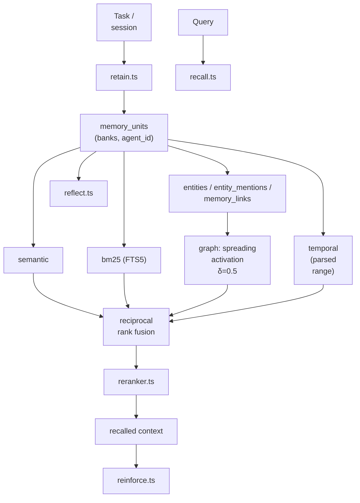

## 1. Executive Summary

Gini is an MIT-licensed agent whose memory is a **local reimplementation of the Hindsight memory model** rather than an integration of it. The code says so directly:

> `recall.ts`: "This is Gini's local retrieval implementation for the hindsight memory model."
> `retain.ts`: "This is Gini's local retain implementation for the hindsight memory model."

It borrows the vocabulary — memory banks, memory units, retain/recall/reflect, four parallel recall channels — and implements them over its own SQLite schema in `state/memory-db.ts` (1,436 lines). The recall module cites the source paper's equation numbers (Eqs. 9–12), so this is a faithful implementation, not a loose homage.

That makes it the atlas's first **second implementation of a memory model it already documents**, which is interesting on its own. But two things make it worth reading independently of [Hindsight](../hindsight/).

**The unit schema is one of the richest here.** `memory_units` carries a `status` of `proposed | active | archived | rejected | conflicted` — including both a rejected state *and* an explicit conflicted state, which almost nothing else has — alongside a `network` of `world | experience | opinion | observation`, separate `occurred_start`/`occurred_end` and `mentioned_at` timestamps (bi-temporal), `embedding_model` and `embedding_dim` stored per unit, `confidence`, `agent_id`, and `source_task_id`/`source_session_id` provenance.

**Memory decisions are recorded as ADRs.** `docs/adr/agent-memory-isolation.md` documents making agent id the isolation key across all four recall channels, and states the failure that forced it: before isolation, "a 'coding' agent's pinned memories would pollute the 'research' agent's recall and vice versa." The atlas has thirty-odd systems and almost no written record of *why* any of them made the choices they did; Gini keeps one.

The main reservation is unusual for this atlas: the design is strong enough that the gaps are subtle. `conflicted` and `rejected` exist as states, but no operator-facing resolution workflow comparable to [RainBox](../rainbox/)'s review page was found, and no memory-quality benchmark is committed.

## 2. Mental Model

```sql
CREATE TABLE memory_units (
  id TEXT PRIMARY KEY,
  bank_id TEXT NOT NULL REFERENCES memory_banks(id) ON DELETE CASCADE,
  agent_id TEXT,                       -- isolation key
  text TEXT NOT NULL,
  embedding BLOB, embedding_dim INTEGER, embedding_model TEXT,
  occurred_start TEXT, occurred_end TEXT,   -- when it was true
  mentioned_at TEXT NOT NULL,               -- when it was said
  network TEXT NOT NULL
    CHECK (network IN ('world','experience','opinion','observation')),
  confidence REAL,
  metadata TEXT NOT NULL DEFAULT '{}',
  source_task_id TEXT, source_session_id TEXT,
  status TEXT NOT NULL DEFAULT 'active'
    CHECK (status IN ('proposed','active','archived','rejected','conflicted')),
  created_at TEXT NOT NULL, updated_at TEXT NOT NULL
)
-- plus memory_banks, entities, entity_mentions, memory_links, schema_meta
```

Three axes are worth separating out.

**Epistemic kind (`network`).** `world` (how things are), `experience` (what happened to me), `opinion` (a view held), `observation` (what was seen). Distinguishing an *opinion* from a *world fact* at the schema level is rare and consequential — a stated preference and a verifiable fact should not decay, conflict, or corroborate the same way.

**Lifecycle state (`status`).** `proposed` is a candidate tier, `rejected` is a durable negative judgment, and `conflicted` marks a unit known to disagree with another. Together with `confidence`, this is a genuine trust model.

**Time.** `occurred_start`/`occurred_end` versus `mentioned_at` is [bi-temporal fact validity](../../patterns/bi-temporal-fact-validity/) — the pattern the atlas credits to [Graphiti](../graphiti/), implemented here as ordinary columns.

Recall:

```text
query
 ├─ semantic — cosine similarity vs query embedding            (Eqs. 9–10)
 ├─ bm25     — SQLite FTS5 MATCH against memory_units_fts      (Eq. 11)
 ├─ graph    — spreading activation seeded from top semantic
 │             hits; decay δ=0.5, per-channel multipliers      (Eq. 12)
 └─ temporal — query parsed for absolute/relative range; units
               whose occurred window overlaps it
 → reciprocal rank fusion → rerank → agent_id filter applied throughout
```

## 3. Architecture

- `packages/runtime/src/memory/` — `retain.ts`, `recall.ts`, `reflect.ts`, `reinforce.ts`, `embedding.ts`, `entities.ts`, `temporal.ts`, `reranker.ts`, `schemas.ts`, `migrate.ts`, `migrate-pinned-to-user-md.ts`, plus `integration.test.ts` and per-module tests.
- `packages/runtime/src/state/memory-db.ts` (1,436 lines) — schema and storage.
- `packages/runtime/src/cli/commands/memory.ts` — CLI surface.
- `packages/web/` — query and view types for a memory UI.
- `docs/memory.md` and an extensive `docs/adr/` corpus.



## 4. Essential Implementation Paths

### Four channels, fused

`recall.ts` documents its channels and their equation provenance in a header comment, which is unusually good practice — a reader can check the implementation against the paper. The graph channel is spreading activation seeded from the top semantic hits with decay δ=0.5 and per-channel multipliers; the temporal channel only participates when the query actually contains a temporal expression, so it does not dilute fusion on queries where time is irrelevant.

Default channel weights appear in the module (`semantic: 1.0`, `temporal: 0.8`, among others), so fusion is tunable — though, as with most of the atlas, there is no committed evidence that the defaults are right. [MetaClaw](../metaclaw/) is the only system here that could answer that question.

### Per-agent isolation, as a documented decision

The ADR is worth quoting for its structure as much as its content. It records status and date, links related ADRs, states the decision (agent id is the isolation key; banks and units carry it; recall filters on it across all four channels; legacy rows carry `agentId`; `/api/memory*` filters by active agent), then gives the context — the cross-persona pollution that motivated it — and the consequence that a new agent starts with empty memory, config copied from defaults but content not.

"Configuration is copied at creation; content is not" is a small, precise rule that many systems get wrong by cloning too much or too little.

### Bi-temporal columns

Separating `occurred_start`/`occurred_end` from `mentioned_at` means a unit can record "the deploy failed on Tuesday" learned on Friday, and the temporal channel can match a query about Tuesday rather than about Friday. Graphiti achieves the same with edge validity intervals and a graph database; Gini achieves it with three columns and a range-overlap test, which is dramatically simpler and sufficient for unit-level facts.

### Embedder identity per unit

`embedding_model` and `embedding_dim` are stored on each unit rather than globally, so a model change does not silently invalidate the index — units embedded with different models are distinguishable and can be re-embedded selectively. The atlas praises [MemPalace](../mempalace/) for checking embedder identity and [Magic Context](../magic-context/) for keying embeddings by `(item, model_id)`; this is the same discipline.

### Migration as a first-class concern

`migrate.ts` and `migrate-pinned-to-user-md.ts` handle schema evolution and a specific data migration (pinned memories into a user Markdown file), and `memory-db.ts` comments describe an additive-column strategy where fresh installs get columns via `CREATE TABLE` while existing installs get them added. `schema_meta` tracks version.

## 5. Memory Data Model

Beyond `memory_units`, the schema carries `memory_banks`, `entities`, `entity_mentions`, and `memory_links` — an entity layer supporting the graph recall channel, and explicit links between units.

Gaps relative to the strongest models here:

- **`conflicted` and `rejected` exist without a visible resolution surface.** The states are modelled; what an operator does about a conflicted unit was not found in the inspected code. Compare RainBox, whose four resolution options (supersede, reject, not-conflict, scoped exception) are the point of having the state.
- **No rejected-*value* tombstone.** A rejected unit is a rejected row; nothing was found preventing an equivalent claim from being retained again under a new id.
- **`confidence` has no documented provenance** — how it is set, and whether anything updates it, was not traced.

## 6. Retrieval Mechanics

Genuine four-arm hybrid with RRF and reranking, agent-scoped throughout, with the temporal arm activating conditionally. `reinforce.ts` suggests retrieval feeds back into unit standing — the atlas's standing caution about popularity loops applies, and whether reinforcement touches `confidence` or only ranking is the question that matters. Keeping it out of `confidence` is the [MetaClaw](../metaclaw/) discipline; the schema here would permit either.

## 7. Write Mechanics

`retain.ts` is the write path; `reflect.ts` the consolidation pass; `proposed` status provides a candidate tier before a unit becomes `active`. Whether promotion from `proposed` is automatic or gated was not determined.

## 8. Agent Integration

A CLI (`cli/commands/memory.ts`), an HTTP surface (`/api/memory*`), and web query/view types indicate a memory UI. Agents are the isolation boundary, and the related ADR `agents-replace-profiles.md` explains that agents — not profiles — drive runtime behaviour, which is what made per-agent memory necessary.

## 9. Reliability, Safety, and Trust

Strengths:

- **A real trust model**: `proposed`/`active`/`archived`/`rejected`/`conflicted` plus `confidence`.
- **Epistemic kind on every unit**, separating opinion from world fact.
- **Bi-temporal columns**, cheaply.
- **Per-unit embedder identity.**
- **Four-channel recall with documented equation provenance.**
- **Agent-level isolation enforced across every channel and the HTTP API.**
- **Architecture decisions written down**, with the failure each fixed.
- **Versioned, additive schema migration.**

Gaps:

- **No visible conflict-resolution workflow** for the `conflicted` state.
- **No value-level tombstone**, so re-retention of a rejected claim appears possible.
- **Channel weights undefended** by any committed evaluation.
- **No memory-quality benchmark** found.
- **`reinforce` semantics unclear** — whether usage can move `confidence` is exactly the line the atlas cares about.

## 10. Tests, Evals, and Benchmarks

Per-module tests (`recall.test.ts`, `retain.test.ts`, `reflect.test.ts`, `embedding.test.ts`, `integration.test.ts`, `migrate-pinned-to-user-md.test.ts`) sit alongside the implementation, and `integration.test.ts` asserts end-to-end behaviour including that a follow-up task records recalled units. Nothing was run for this review.

No memory-quality benchmark was found. Given that the recall implementation cites specific equations from a published model, the natural evaluation — does this implementation reproduce the source model's reported behaviour? — is absent, and would be unusually easy to justify here.

## 11. For Your Own Build

### Steal

- **Write down memory decisions as ADRs.** Status, date, decision, context, consequences — and crucially the failure that motivated it. Forty systems into this atlas, Gini is the clearest example of a project that can explain itself.
- **`conflicted` as a first-class status.** Most systems either resolve conflicts silently or surface them outside the data model; making it a state means a conflicted unit can be found, counted, and worked through.
- **Epistemic kind as a column.** `world | experience | opinion | observation` costs one field and prevents a whole class of category errors.
- **Bi-temporal without a graph database.** Two occurrence columns plus a mention timestamp gets most of the value of temporal validity at unit granularity.
- **Store the embedding model on the row.**
- **Conditional temporal channel** — only fuse a time arm when the query has a time expression.
- **"Configuration is copied at creation; content is not."**

### Avoid

- **Modelled states without workflows** — `conflicted` and `rejected` need somewhere for a human to act.
- **Rejection without a value tombstone.**
- **Fusion weights as undefended defaults.**
- **Reinforcement of unclear reach.**

### Fit

Borrow:

- The `memory_units` schema more or less wholesale; it is among the best-shaped in the atlas.
- The ADR practice — the cheapest quality improvement available to any memory project.
- The conditional temporal channel and the per-unit embedder identity.

Do not copy:

- The trust states without building the workflow that resolves them.
- Fusion defaults without measuring them.

## 12. Open Questions

- What resolves a `conflicted` unit, and who sees it?
- Does `reinforce` touch `confidence`, or only ranking? The schema allows both; only one is safe.
- What promotes a unit from `proposed` to `active`?
- Does this implementation reproduce the source model's published retrieval behaviour? The equation citations invite the comparison.
- Should rejection write a value-level tombstone, given that retention is automatic?

## Appendix: File Index

- Schema and storage: `packages/runtime/src/state/memory-db.ts` (`memory_units`, `memory_banks`, `entities`, `entity_mentions`, `memory_links`, `schema_meta`).
- Write path: `packages/runtime/src/memory/retain.ts`.
- Retrieval: `packages/runtime/src/memory/recall.ts` (four channels, RRF), `reranker.ts`, `temporal.ts`, `entities.ts`.
- Consolidation and reinforcement: `reflect.ts`, `reinforce.ts`.
- Embeddings: `embedding.ts`.
- Migration: `migrate.ts`, `migrate-pinned-to-user-md.ts`.
- CLI: `packages/runtime/src/cli/commands/memory.ts`.
- Decisions: `docs/adr/agent-memory-isolation.md`, `docs/adr/agents-replace-profiles.md`, `docs/adr/prompt-cache-in-memory-tier.md`, `docs/adr/stable-system-prefix.md`, `docs/memory.md`.
- Tests: `packages/runtime/src/memory/*.test.ts`, `integration.test.ts`.
