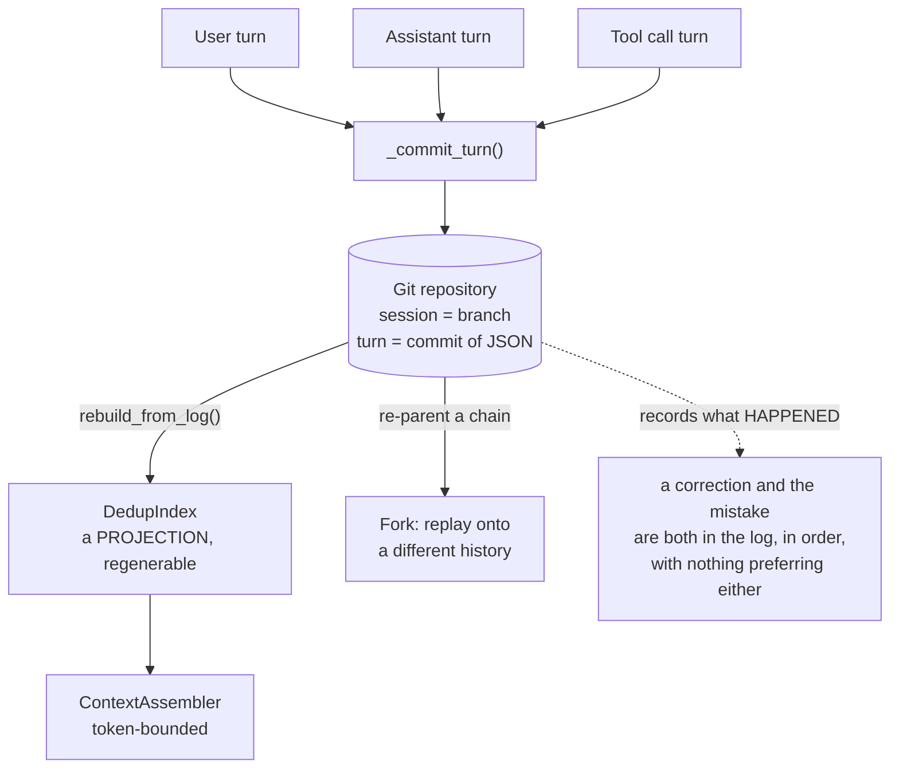

## 1. Executive Summary

GitLord's pitch is one line: *"Git for AI Agents. GitLord turns Git into a
database for autonomous agents. Every agent action becomes a version-controlled
event — inspectable, replayable, forkable."* MIT-licensed, 3,263 lines of Python
across a git layer (602), context assembly (361), sessions (321), an MCP server
(295), a model layer (292), a CLI (243) and RAG (234), with 233 tests.

A `Session` is a branch. `append_user_turn`, `append_assistant_turn` and
`append_tool_call_turn` each commit a turn as JSON. `_commit_turn` carries a
nested `rebuild(old_parent)` so a chain can be re-parented, which is what makes
forking a session and replaying it onto a different history a first-class
operation rather than a manual git exercise.

**The mechanism this atlas cares about is `DedupIndex.rebuild_from_log`.** The
index that makes retrieval fast is a *projection*, and the code can regenerate it
by walking the commit log and reading each turn's JSON back out. That is the
[evidence before belief](../../patterns/evidence-before-belief/) shape stated as
architecture: the log is the authority, the index is derived, and a corrupted or
stale index is a rebuild rather than a data loss. [Core Memory](../core-memory/)
reaches the same arrangement with session JSONL as the live authority; GitLord
gets it for free by making the authority a git repository.

**And six of the seven capability marks are withheld, for a reason worth
stating rather than scoring.** GitLord durably records *what happened* — turns,
tool calls, their order and their lineage. It does not record *what is
believed*. There is no claim, no fact, no status, no scope predicate, and no
notion of a value that could be corrected or rejected. Ask it "what is the
user's deployment target" and the answer is a search over transcript; ask it
"did that change last week" and the answer is a diff a human reads. This atlas's
seven columns are all about belief, and GitLord is deliberately about record.

The seventh is `negative_eval`, and it is narrow. `test_summary_turns_excluded`
asserts that a summarized turn does not reach the assembled context, with a
positive control in the same test so an assembler returning nothing cannot pass
it — the shape this atlas argues for. What it guards is a mechanism no entry
point can reach, described in section 7.

## 2. Mental Model

Immutable append, with git's escape hatches. A turn is committed and never
edited; a correction is a later turn saying something different, and both are in
the log with the ordering intact. Replay reconstructs state by walking forward;
forking creates a branch where a different continuation can be explored without
disturbing the original.

That is the strongest *provenance* model in this atlas and the weakest
*epistemic* one, and the two follow from the same choice. Because everything is
kept, nothing needs a trust state; because nothing is interpreted, nothing can be
marked wrong. A system that records the conversation in which a user said "no,
it's Postgres, not MySQL" has the correction — as text, in order, next to the
mistake — and has no mechanism that prevents retrieval from surfacing the
mistake.

Git also brings a deletion problem the atlas has met before in a different form:
a rewritten chain leaves the old commits reachable until garbage collection, and
a forked branch may still hold them. "Delete what the agent learned about me" is
a git history rewrite across every branch, which is a category of operation
rather than a call.



## 3. Architecture

A git repository, `litellm` for model access (imported behind a `HAS_LITELLM`
guard so the package works without it), and nothing else to run. `git.py` (602
lines) is the plumbing; `ContextAssembler`, `DedupIndex` and `ContextCache` in
`context.py` sit above it; `mcp.py` exposes the whole thing to MCP clients.

`ToolSchemaTranslator` in `model.py` converts tool schemas between OpenAI-family
and Anthropic formats — provider portability at the schema layer, which is
housekeeping rather than memory but is the kind of thing that decides whether a
log stays replayable after a provider switch.

## 4. Essential Implementation Paths

- `gitlord/git.py` (602) — commits, branches, refs, the object layer.
- `gitlord/context.py` (361) — `DedupIndex` with `rebuild_from_log`,
  `ContextCache` with per-branch invalidation, `ContextAssembler`,
  `count_tokens`.
- `gitlord/session.py` (321) — `Session`, `create`, `resume`, `_commit_turn`,
  `append_*_turn`, `_rebuild_index`, `_next_turn_number`.
- `gitlord/mcp.py` (295), `gitlord/model.py` (292), `gitlord/rag.py` (234).

## 5. Memory Data Model

A turn, serialised as JSON in a commit. `_read_turn_json(repo, sha)` is the
reader, so the addressing unit is a commit sha plus a path — durable, globally
unique, and meaningful to every tool that understands git.

There is no unit below the turn. No fact is extracted, so there is nothing to
carry a status, a validity window or a source. Every timestamp available is
git's, which is record time.

## 6. Retrieval Mechanics

`ContextAssembler` builds the model's context from the turn history, with
`count_tokens` bounding it, a `DedupIndex` keyed on `(branch, path)` holding a
turn number and a content hash so unchanged content is not re-included, and a
`ContextCache` keyed on `(branch, turn_n)` with `invalidate` and
`invalidate_branch` for correctness after a rewrite. `rag.py` adds retrieval on
top.

**Scope is a branch, not a predicate.** Isolation between sessions is real —
different branches are different histories — and it is partition-shaped, so the
mark is withheld on the same basis as several other systems here. Nothing
composes a user or tenant key into a query.

## 7. Write Mechanics

Writes block and are commits. `_next_turn_number` sequences them,
`_commit_turn` performs the write and can rebuild a chain onto a new parent, and
`_rebuild_index` keeps the projection current. There is no background work and
no fact extraction — the log is the memory.

**Consolidation is the exception, and it is built but not connected.** A `Turn`
carries an optional `summarizes: list[str]` (`schemas.py:47`); `TurnRole.summary`
is a role; `Session.append_summary_turn` commits one; `ContextAssembler.compute_summary`
walks the branch between two shas and returns a summary turn naming every commit
in the range; and the assembler has a branch for reading it. Three tests cover
the path. `append_summary_turn` and `compute_summary` have no caller outside
`tests/` — not in `cli.py`, `mcp.py`, `model.py` or `session.py`'s own flow — so
no entry point can produce a summary turn, and every assembled context is the
full log.

What the assembler would do with one is worth reading before the feature is
wired. `context.py:160-169`:

```python
if turn.role == TurnRole.summary and turn.summarizes:
    for s in turn.summarizes:
        summary_exclusions[s] = turn.content
else:
    collected.append((turn, sha))
# …
for turn, sha in collected:
    if sha in summary_exclusions:
        continue
```

The summary turn is never added to `collected`, and the covered shas are skipped
from it — so the summarized span leaves the context and the summary does not
take its place. `summary_exclusions` is a `dict[str, str]` whose values are
written and never read; a `set` would behave identically. The committed test
asserts exactly this: `test_summary_turns_excluded` checks that both the
summarized turn and the summary content are absent. Compression that removes
without replacing is a plausible thing to discover in production and an
implausible thing to have intended.

The cost profile follows: writes are cheap and permanent, and the growth is
linear in conversation length with no compaction path in the repository.

## 8. Agent Integration

A CLI and an MCP server, with LiteLLM underneath. The MCP surface is what makes
the design portable — an agent on any MCP client gets a forkable, replayable
session store without adopting GitLord's runtime.

## 9. Reliability, Safety, and Trust

No marks, and the report's position is that this is a category difference rather
than a deficiency — the same call the atlas made for
[`Cohexa-ai/agent-coherence`](https://github.com/Cohexa-ai/agent-coherence),
though GitLord lands on the memory side of the line because it durably stores
content that is later retrieved, not just coordination metadata.

**Git history is not the atlas's `audit_log`**, and the rubric says so
explicitly: it is *"a real mechanism and a different one"*. GitLord is the
strongest instance of that different mechanism in the corpus. Every write is
attributable, ordered, diffable and signed if the repository is configured for
it — properties the atlas's own append-only column does not require — and it
records turns rather than memory mutations, because there are no memory
mutations to record.

**No tombstone, and the reason is structural.** There is no value to key one on.
A user's rejection of a fact is a turn; the fact is an earlier turn; both are in
the log, and retrieval sees both.

## 10. Tests, Evals, and Benchmarks

233 test functions across fifteen files, none run here. No memory benchmark, no
retrieval-quality measurement and no published numbers.

Five assertions in the suite are negative, and only one is about memory content:
`test_context.py:311-312`, which pins that a summarized turn and its summary are
both absent from the assembled context. The other four are shape checks — a
`metadata` key absent from a RAG result, `tool_calls` absent from a translated
response, a sub-session absent from an index.

The assertion this design most invites is a rebuild *equivalence*:
destroy the index, run `rebuild_from_log`, and assert the assembled context is
identical. `test_dedup_index_rebuild` does the first two steps and then checks
the index's own entries rather than the assembled output, so the property the
whole derived-index argument rests on is one assertion short.

## 11. For Your Own Build

### Steal

- **Make the log the authority and the index a projection you can rebuild.**
  `rebuild_from_log` means index corruption is an inconvenience rather than a
  data loss, and it lets you change the index format without a migration.
- **Use commit shas as memory addresses.** Globally unique, content-derived, and
  meaningful to every tool that speaks git — a better identifier than a UUID you
  have to explain.
- **Make forking first-class.** Re-parenting a turn chain turns "what if the
  agent had done that differently" from a thought experiment into a branch.
- **Invalidate your context cache per branch.** Caches keyed on a session that
  can be rewritten need an explicit invalidation path, and this one has it.

### Avoid

- **Mistaking a complete record for a usable memory.** A log that contains the
  correction and the mistake, with no mechanism preferring the correction, will
  surface both. Something has to interpret.
- **Assuming git gives you deletion.** Rewriting history leaves reachable
  objects behind on other branches and in the reflog, so an erasure request is a
  repository-wide operation, not a call.

### Fit

Use GitLord where auditability and replay are the requirement — agent runs you
need to reconstruct exactly, experiments you want to fork, workflows where "what
did it do and in what order" is the question. It is the right substrate for that
and the tooling around it already exists on every developer's machine.

Pair it with something else where belief is the requirement. It has no opinion
about what is true, which is exactly why it is a good place to keep the evidence
for a system that does.

## 12. Open Questions

- **Does a rebuilt index reproduce the original *context*?** `test_dedup_index_rebuild`
  covers the index: four turns, a fresh `DedupIndex`, `rebuild_from_log`, and
  assertions that `foo.py` maps to turn 1 and `bar.py` to turn 3. What no test
  compares is an assembled message list before and after a rebuild, which is the
  property the design actually rests on.
- **What happens to memory across a fork?** A branched session inherits the
  history; whether the dedup index and context cache handle a fork correctly was
  not traced, and `invalidate_branch` suggests the author thought about it.
- **How does this grow?** Linear in turns with no compaction; whether
  `ContextAssembler`'s token budget is the only bound was not established.
- **What does `rag.py` retrieve over?** The module was sized and not read.

## Appendix: File Index

| Path | Lines | What it holds |
| --- | --- | --- |
| `gitlord/git.py` | 602 | Commits, branches, refs |
| `gitlord/context.py` | 361 | `DedupIndex`, `rebuild_from_log`, `ContextCache`, assembler |
| `gitlord/session.py` | 321 | Sessions as branches, turn appends, re-parenting |
| `gitlord/mcp.py` | 295 | MCP surface |
| `gitlord/model.py` | 292 | LiteLLM layer, tool-schema translation |
| `gitlord/cli.py` | 243 | CLI |
| `gitlord/rag.py` | 234 | Retrieval |
| `tests/` | 233 tests in 15 files | Sessions, context assembly, RAG, regressions |

### Searches behind the absence claims

Run from the repository root; each returned only what is described beside it.

```sh
# summarization has no caller outside tests
grep -rn 'append_summary_turn\|compute_summary' gitlord/ tests/

# nothing composes a scope key into a retrieval predicate
grep -rniE 'user_id|tenant|namespace|scope' gitlord/rag.py gitlord/context.py

# the negative assertions in the suite, all five of them
grep -rn 'assert.*not in' tests/

# no paper, citation file or DOI
grep -rniE 'arxiv|@article|CITATION|\bdoi\b' --include='*.md' --include='*.toml' .
```

## History

**2026-09-14** — [`8bfe0aa391a82cf62e595cd41bba06c7e4966e39`](https://github.com/yashneil75/gitlord/commit/8bfe0aa391a82cf62e595cd41bba06c7e4966e39) — second reading. One commit since the previous pin, a version bump to 0.2.0 for a PyPI release touching `gitlord/__init__.py` and `pyproject.toml`; no source file changed. Screened again: no auto-executing surface, no build-time execution point, one unpinned manifest with no lockfile beside it; nothing was installed and nothing was run. The reading was therefore of claims rather than of a diff, and two were wrong at the first pin. The summary machinery — `TurnRole.summary`, `Turn.summarizes`, `append_summary_turn`, `compute_summary` and an assembler branch reading all of it — exists in full and has no caller outside `tests/`, which is a sharper statement than "nothing summarises". And the open question asking whether a rebuilt index reproduces the original was answered in part by `test_dedup_index_rebuild`, so it narrows to the assembled context rather than the index. `negative_eval` is added on `test_summary_turns_excluded`, the one negative assertion in the suite about memory content, with its positive control named. The searches behind the absence claims are recorded in the appendix.

**2026-07-30** — [`42b0bab151777c1ee38ced7ab2805b0699e7a8a1`](https://github.com/yashneil75/gitlord/commit/42b0bab151777c1ee38ced7ab2805b0699e7a8a1) — first reading.
