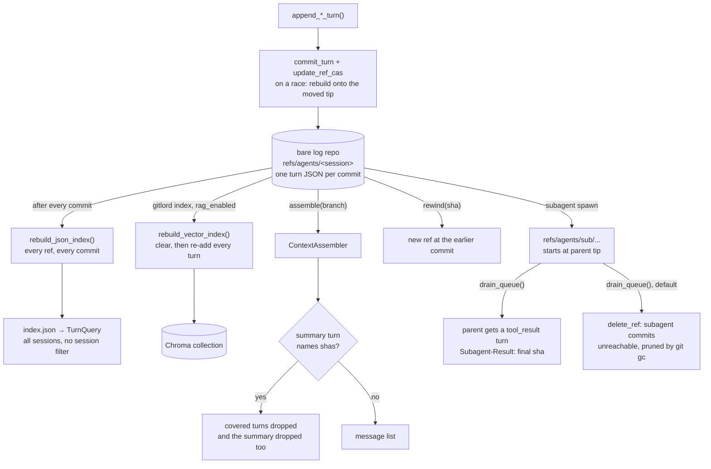

## 1. Executive Summary

GitLord is a Python library that stores an agent's run as git history: each
turn is a JSON file committed to a branch under `refs/agents/`, and a session
is that branch. What it buys is provenance: every turn is addressable by
commit sha and ordered by the commit graph. `rewind` forks from any earlier
commit. Both derived indexes are rebuilt from the log instead of being
maintained beside it. What it lacks is any notion of belief. A correction is a
later turn, the mistake stays beside it, and nothing prefers either. Its
default subagent cleanup also deletes the only ref to a subagent's history
while the parent's trailer still names its sha.

**The log is the authority and both indexes are projections of it.**
`Session._commit_turn` calls `_rebuild_index` after every commit, which runs
`IndexBuilder.rebuild_json_index` over every ref and rewrites
`.gitlord/index.json` from scratch (`gitlord/session.py:114-130`,
`gitlord/index.py:21-59`). `gitlord index` rebuilds that file and, when RAG is
enabled, clears the Chroma collection and re-adds every turn from the log
(`gitlord/cli.py:176-197`, `gitlord/index.py:61-103`). That is the
[evidence before belief](../../patterns/evidence-before-belief/) arrangement
stated as architecture: a stale or corrupted index is a rebuild, not a data
loss. [Core Memory](../core-memory/) reaches it with session JSONL as the
authority; GitLord makes the authority a git repository.

**No capability mark is awarded, and the reason is a category difference.**
GitLord durably records *what happened* — turns, tool calls, their order and
lineage — and nothing about *what is believed*. There is no claim, fact,
status, scope predicate or value that could be corrected or rejected. The one
negative assertion about content, `test_summary_turns_excluded`, keeps turns
out of an assembled message list, and a turn is an event that cannot turn out
to be false. Section 10 carries the reasoning.

## 2. Mental Model

Immutable append, with git's escape hatches. A turn is committed and never
edited; a correction is a later turn saying something different, and both stay
in the log in order. `rewind` points a new ref at an earlier commit, so a
different continuation can be explored without disturbing the original, and a
subagent gets a branch that starts at its parent's tip.

A strong provenance model and an empty epistemic one follow from the same
choice. Because everything is kept, nothing needs a trust state; because
nothing is interpreted, nothing can be marked wrong. A log in which a user said
"no, it's Postgres, not MySQL" holds the correction — as text, in order, next
to the mistake — and no mechanism stops a later read from surfacing the
mistake.

Git also decides what forgetting means here. A commit stops existing only when
no ref reaches it and `git gc` prunes it, so "delete what the agent learned
about me" is a history rewrite across every branch that holds the turn. The
same rule works in the other direction: deleting a ref forgets everything only
that ref reached, which is what the default subagent cleanup does.


```mermaid
%% caption: every turn is a commit on a session ref and both indexes are rebuilt from the log; a summary turn removes its covered turns and itself from the assembled context, and a drained subagent's ref is deleted so its commits become unreachable while the parent's trailer still names the sha
flowchart TB
    W["append_*_turn()"] --> CAS["commit_turn + update_ref_cas<br/>on a race: rebuild onto the moved tip"]
    CAS --> Log[("bare log repo<br/>refs/agents/&lt;session&gt;<br/>one turn JSON per commit")]
    Log -->|"after every commit"| J["rebuild_json_index()<br/>every ref, every commit"]
    J --> Q["index.json → TurnQuery<br/>all sessions, no session filter"]
    Log -->|"gitlord index, rag_enabled"| V["rebuild_vector_index()<br/>clear, then re-add every turn"]
    V --> C[("Chroma collection")]
    Log -->|"assemble(branch)"| A["ContextAssembler"]
    A --> S{"summary turn<br/>names shas?"}
    S -->|"yes"| Drop["covered turns dropped<br/>and the summary dropped too"]
    S -->|"no"| M["message list"]
    Log -->|"rewind(sha)"| R["new ref at the earlier commit"]
    Log -->|"subagent spawn"| Sub["refs/agents/sub/...<br/>starts at parent tip"]
    Sub -->|"drain_queue()"| Res["parent gets a tool_result turn<br/>Subagent-Result: final sha"]
    Sub -->|"drain_queue(), default"| Del["delete_ref: subagent commits<br/>unreachable, pruned by git gc"]
```

## 3. Architecture

Two git repositories and nothing else that must run. The log repository is
bare and holds only turn commits; the workspace repository is the agent's
working tree, and each turn records the workspace `HEAD` so `rewind` can check
it out again (`gitlord/session.py:97-98`, `:258-263`). Git is driven through
`subprocess` calls to the `git` binary (`gitlord/git.py:51-65`).

Everything else is optional and imported behind a guard: `litellm` for
`ModelRouter`, `chromadb` for `VectorIndex`, `mcp` for `MCPMon`, `typer` for the
CLI and `tiktoken` for token counting. The core dependency is `pydantic`.
`VectorIndex` opens a `PersistentClient` at `.chroma` relative to the working
directory and creates its collection with Chroma's default embedding function
(`gitlord/rag.py:22-39`).

`ToolSchemaTranslator` converts tool schemas to OpenAI, Anthropic and Gemini
formats (`gitlord/model.py:22-34`). That is provider portability rather than
memory, and it decides whether a logged tool call can be replayed against a
different provider.

## 4. Essential Implementation Paths

- `gitlord/git.py` (602) — `commit_turn` builds a tree under `turns/` and a
  commit with trailers; `update_ref_cas` retries a moved ref with backoff.
- `gitlord/session.py` (321) — `Session.create`, `resume`, `_commit_turn`,
  `append_*_turn`, `rewind`, `query`, `snapshot`, `_rebuild_index`.
- `gitlord/index.py` (156) — `IndexBuilder.rebuild_json_index` and
  `rebuild_vector_index`, both walks of the log.
- `gitlord/context.py` (361) — `ContextAssembler.assemble`, `_apply_dedup`,
  `_apply_budget`, `compute_summary`; `DedupIndex` and `ContextCache`.
- `gitlord/subagent.py` (223) — `spawn`, `complete`, `drain_queue`, `trim`.
- `gitlord/query.py` (226) — `TurnQuery` over the JSON index.
- `gitlord/rag.py` (234) — `VectorIndex` over Chroma.

## 5. Memory Data Model

A turn is a pydantic `Turn` serialised to JSON and committed as
`turns/<20-digit turn number>-<role>.json` (`gitlord/schemas.py:28-47`,
`gitlord/git.py:320-348`). Each commit's tree carries every earlier turn file
as well, and `get_turn_filename` takes the last one in sort order as the
commit's own. The commit message repeats the metadata as trailers — `Turn-ID`,
`Role`, `Agent`, `Tool`, token counts, cost, `Workspace-Commit`,
`Subagent-Result` — which is what the JSON index is built from
(`gitlord/git.py:270-318`).

Roles are `system`, `user`, `assistant`, `tool_call`, `tool_result` and
`summary`. There is no unit below the turn: no fact is extracted, so nothing
carries a status, a validity window or a source. Every timestamp is record
time.

## 6. Retrieval Mechanics

Three read paths ship as library classes. Nothing in the package calls
`ContextAssembler` or `VectorIndex.query`; an application embedding GitLord
does. The one read wired to the package's own flow is `Session.query()`.

**`ContextAssembler.assemble` walks one branch** into an OpenAI-style message
list (`gitlord/context.py:131-195`). It pairs tool results with calls,
collapses a repeated file read with an identical content hash into
`[see turn N — content unchanged]` (`:260-303`), trims oldest-first to a token
budget, and prepends caller-supplied RAG results. The dedup keeps its own
per-call map (`:265`). The `DedupIndex` stored on the assembler (`:128`) is
read nowhere, and `DedupIndex.rebuild_from_log` has no caller outside
`tests/`.

**The assembly cache ignores two of its inputs.** The key is
`(branch, up_to_turn)`, and a hit returns before `budget_tokens` or
`rag_results` is looked at (`:138-140`). A second call for the same turn with
a different budget or fresh retrieval results gets the first call's messages.
`ContextCache.invalidate` has no caller in the package.

**`Session.query()` reads every session.** The JSON index holds all refs,
`TurnQuery._load` flattens them into one list, and `query()` applies no
session filter (`gitlord/query.py:27-49`, `gitlord/session.py:299-308`). Each
ref's entry comes from `git log <ref>`, which includes its ancestors
(`gitlord/index.py:105-150`). A rewind branch is indexed as its own session
repeating the shared history, and a retained subagent branch's turns —
parent history included — are appended to the parent's list. A cost sum
over the index counts that shared history once per ref.

**`VectorIndex` offers four query methods that make one call.** `query`,
`query_by_type`, `query_mmr` and `hybrid_search` all end in the same
`collection.query(query_texts=..., where=...)`; `query_mmr`'s `diversity` is
never read (`gitlord/rag.py:104-168`). Results carry Chroma's distance under
the key `score`, which the assembler prints to the model as `(score: …)`.

**Scope is a branch for assembly and nothing for the indexes.** Session
isolation in `assemble` is real and partition-shaped. The vector metadata
carries `agent_id`, and no caller composes it into `filter_by`. The mark is
withheld.

## 7. Write Mechanics

Writes block and are commits. `_next_turn_number` reads the tip's trailers,
`commit_turn` writes the blob, tree and commit, and `update_ref_cas` moves the
ref only if it still points at the parent (`gitlord/git.py:350-380`). On a
lost race the nested `rebuild(old_parent)` in `_commit_turn` re-numbers the
turn and re-commits it onto the new tip, up to 64 times
(`gitlord/session.py:100-112`). Concurrent writers to one session therefore
serialise without losing a turn.

**Every commit rebuilds the whole JSON index.** With `auto_index` on, the
default, `_rebuild_index` runs one `git log` per ref and one per commit across
every session. A turn's write cost grows with the whole repository, not with
its session. The rebuild's exceptions are swallowed, so a failure leaves a
stale index without a signal (`gitlord/session.py:114-130`).

**Summary turns are documented and dropped whole.**
`Session.append_summary_turn` and `ContextAssembler.compute_summary` are public
methods that `docs/api/session.md` and `docs/guides/context.md` document, and
no module in the package calls them. The assembler reads a summary turn at
`gitlord/context.py:159-169`:

```python
if turn.role == TurnRole.summary and turn.summarizes:
    for s in turn.summarizes:
        summary_exclusions[s] = turn.content
else:
    collected.append((turn, sha))
# …
for turn, sha in collected:
    if sha in summary_exclusions:
        continue
```

The summary turn never enters `collected`, and the covered shas are skipped,
so the summarized span leaves the context and the summary does not take its
place. `summary_exclusions` is a `dict[str, str]` whose values are never read.
`SPEC.md:245` says assembly *"substitutes the summary turn for the original
range"*, and `test_summary_turns_excluded` asserts the opposite: the summary
text is absent.

**Snapshots copy and do not compact.** `compress_to_snapshot` writes turns up
to N into a JSON file and removes nothing (`gitlord/snapshot.py:13-55`).
`rebase_from_snapshot` points a ref at the first post-snapshot commit, whose
parents still reach the full history, and has no caller in the package or its
tests (`:58-106`). The log grows linearly with no compaction path.

## 8. Agent Integration

GitLord ships no agent loop. The CLI's `run` creates or resumes a session and
commits the prompt as a user turn; it calls no model (`gitlord/cli.py:41-64`).
`log`, `tree`, `show`, `diff` and `rewind` read or fork the log, and `index`
rebuilds both indexes whether or not `--rebuild` is passed, since the option is
never read.

`gitlord/mcp.py` is an MCP *client*. `MCPMon` starts configured stdio servers,
lists their tools, restarts a lost server with exponential backoff, and calls
tools on the agent's behalf (`gitlord/mcp.py:54-295`). GitLord exposes nothing
over MCP. An application wires `ModelRouter`, `MCPMon`, `ContextAssembler` and
the `append_*_turn` methods into its own loop; that application is the producer
of every turn except the CLI's user prompt.

## 9. Reliability, Safety, and Trust

No marks, and the position here is that this is a category difference rather
than a deficiency. GitLord durably stores content that is later read back,
which puts it on the memory side of the scope line;
[`Cohexa-ai/agent-coherence`](https://github.com/Cohexa-ai/agent-coherence),
which stores only coordination metadata, sits on the other side.

**Git history is not the rubric's `audit_log`**, which calls it *"a real
mechanism and a different one"*. GitLord is a clear instance of that different
mechanism: every write is attributable, ordered, diffable, and signed if the
repository is configured for it. It records turns rather than memory
mutations, because there are no memory mutations to record.

**The subagent trailer outlives what it points at.** `drain_queue` appends a
`tool_result` turn to the parent with `Subagent-Result: <final sha>` and then,
unless `keep_subagent_branches` is set, deletes the subagent's ref
(`gitlord/subagent.py:140-183`). A trailer is text; git does not follow it.
The subagent's own commits become unreachable, and the first `git gc` past the
prune window removes them. `SPEC.md:132` calls the trailer *"permanent
traceability"*.

**`gitlord trim` cannot see active subagents in another process.** `trim` spares
refs in `_active_subagents`, an in-process dict, and the CLI builds a fresh
`SubagentManager` whose dict is empty (`gitlord/cli.py:216-232`,
`gitlord/subagent.py:185-212`). Run beside a live agent, it deletes the refs
of subagents still running. `SPEC.md:136` says trim keeps them.

**No tombstone, and the reason is structural.** There is no value to key one
on. A user's rejection of a fact is a turn; the fact is an earlier turn; both
are in the log, and every read path sees both.

## 10. Tests, Evals, and Benchmarks

233 test functions in 13 files, none run here, with no CI configuration in the
tree. The Chroma cases are marked `skipif(not HAS_CHROMADB)`, so a run without
the extra passes having asserted nothing about the vector index
(`tests/test_rag.py:104`). No memory benchmark, retrieval measurement or
published result is committed, and no paper is cited.

**`negative_eval` is not awarded.** `test_summary_turns_excluded`
(`tests/test_context.py:295-313`) appends a user turn, an assistant turn and a
summary turn naming the first, then asserts that `"first message"` and
`"summary content"` are absent while `"response"` is present. The positive
control makes it non-vacuous. What it excludes is a turn — a record of an event
— from an assembled message list. The mark asks for material that must not be
retrieved from memory, and an event cannot turn out to be false, so this is
context assembly rather than memory retrieval.

The suite's other negative assertions are shape checks: `tool_calls` absent
from a normalized model response, `metadata` absent from a formatted Chroma result, and
no `sub` pseudo-session in the JSON index (`tests/test_model.py:167`,
`tests/test_rag.py:93`, `tests/test_regressions.py:154`). No case writes two
sessions and asserts that one's turns stay out of the other's query.

`test_dedup_index_rebuild` checks that `rebuild_from_log` maps `foo.py` to turn
1 and `bar.py` to turn 3 (`tests/test_context.py:327-343`). The index it
rebuilds is one the assembler never consults. The index the package does
rebuild after every commit is covered by `tests/test_index.py` and
`tests/test_perf.py`, which assert its shape and contents, not its equality
with an earlier build.

## 11. For Your Own Build

### Steal

- **Make the log the authority and every index a projection you rebuild.**
  `IndexBuilder` regenerates both the JSON and the vector index by walking the
  log, so index corruption is an inconvenience and a format change needs no
  migration.
- **Use commit shas as memory addresses.** Globally unique, content-derived,
  and meaningful to every tool that speaks git.
- **Make forking a ref write.** `rewind` is `update-ref` at an earlier commit
  plus a workspace checkout, which turns "what if the agent had done that
  differently" into a branch.
- **Serialise concurrent appends with a compare-and-swap and a rebuild
  closure.** `update_ref_cas` plus `rebuild(old_parent)` handles a lost race by
  re-committing onto the new tip instead of failing the write.

### Avoid

- **Rebuilding a global index on every write.** It makes each append cost a
  walk of every session; rebuild on demand or incrementally, and surface the
  failure instead of swallowing it.
- **Pointing at history by a sha in a trailer after deleting its ref.** Either
  keep a ref, or accept that the pointer dangles after `gc`.
- **Keying a cache on fewer inputs than the result depends on.**
- **Mistaking a complete record for a usable memory.** A log that holds the
  correction and the mistake, with nothing preferring the correction, will
  surface both.

### Fit

Use GitLord where auditability and replay are the requirement — agent runs you
need to reconstruct exactly, experiments you want to fork, workflows where
"what did it do and in what order" is the question. It is a small library
around tools every developer already has, and you supply the agent loop.

Pair it with something else where belief is the requirement, and turn
`auto_index` off before the repository grows. It has no opinion about what is
true, which makes it a good place to keep the evidence for a system that does.

## 12. Open Questions

- **When does `git gc` run?** GitLord writes with plumbing (`commit-tree`,
  `update-ref`), which does not trigger automatic gc, so how long a drained
  subagent's commits survive depends on something outside the package.
- **Which embedding model does the vector index use?** None is configured, so
  Chroma's default applies, and `chromadb>=0.5` is unpinned with no lockfile.
- **How slow does an append get?** The per-commit index rebuild is linear in
  the whole repository; no test or benchmark measures it.

## Appendix: File Index

| Path | Lines | What it holds |
| --- | --- | --- |
| `gitlord/git.py` | 602 | Commit and tree construction, trailers, CAS ref update |
| `gitlord/context.py` | 361 | `ContextAssembler`, dedup, budget, summary exclusion, `DedupIndex`, `ContextCache` |
| `gitlord/session.py` | 321 | Sessions as refs, turn appends, rewind, per-commit index rebuild |
| `gitlord/mcp.py` | 295 | `MCPMon`, an MCP client supervisor |
| `gitlord/model.py` | 292 | `ModelRouter` over LiteLLM, `ToolSchemaTranslator` |
| `gitlord/cli.py` | 243 | Typer CLI |
| `gitlord/rag.py` | 234 | `VectorIndex` over Chroma |
| `gitlord/query.py` | 226 | `TurnQuery` over the JSON index |
| `gitlord/subagent.py` | 223 | Subagent refs, completion queue, drain, trim |
| `gitlord/index.py` | 156 | `IndexBuilder`: JSON and vector rebuilds from the log |
| `gitlord/snapshot.py` | 117 | Snapshot to JSON, ref rebase |
| `gitlord/schemas.py` | 98 | `Turn`, `TurnRole`, `CommitTrailers`, config models |
| `SPEC.md` | 336 | Design specification, including summary substitution and subagent cleanup |
| `tests/` | 3,092 | 233 tests in 13 files, two MCP server fixtures |

### Searches behind the absence claims

Run from the repository root; each returned only what is described beside it.

```sh
# summarization, the dedup rebuild and cache invalidation: under gitlord/ only the definitions
grep -rn 'append_summary_turn\|compute_summary\|rebuild_from_log\|invalidate' gitlord/ tests/

# the assembler never reads its DedupIndex; only the constructor assigns it
grep -rn 'self\.dedup_index' gitlord/

# no module constructs the assembler, the router or the MCP client; only rag.py's own internals query Chroma
grep -rnE 'ContextAssembler\(|ModelRouter\(|MCPMon\(|\.query\(|query_mmr|hybrid_search' gitlord/

# nothing composes a scope key into a retrieval predicate
grep -rniE 'user_id|tenant|namespace|scope' gitlord/rag.py gitlord/context.py gitlord/query.py

# mcp.py is a client: no server object or tool decorator in the package
grep -rnE 'FastMCP|mcp\.server|Server\(' gitlord/

# rebase_from_snapshot: only its definition
grep -rn 'rebase_from_snapshot' gitlord/ tests/

# the negative assertions in the suite: five lines, two in the summary test
grep -rn 'assert.*not in' tests/

# query_mmr's diversity appears only in its signature; index's --rebuild only in its declaration
grep -n 'diversity' gitlord/rag.py
grep -nw 'rebuild' gitlord/cli.py

# no embedding function is configured for the Chroma collection
grep -rn 'embedding_function' gitlord/

# no test times an append; the only clock reads are an MCP startup deadline
grep -rnE 'time\.(time|perf_counter|monotonic)|benchmark' tests/

# the two newest commits touching source or tests: the 5 August version bump, then 19 July
/usr/bin/git log -2 --format='%h %ad %s' --date=short -- gitlord tests

# no CI configuration
ls .github .gitlab-ci.yml .circleci 2>&1

# no paper, citation file or DOI
grep -rniE 'arxiv|bibtex|@article|@misc|CITATION|doi\.org' . --exclude-dir=.git
```

## History

**2026-09-30** — [`8bfe0aa391a82cf62e595cd41bba06c7e4966e39`](https://github.com/yashneil75/gitlord/commit/8bfe0aa391a82cf62e595cd41bba06c7e4966e39) — audit at the same commit; upstream had not moved. `negative_eval` is withdrawn: the test excludes an event from an assembled message list, which is context assembly by the rubric's scope test; marks go from one to none. Four published descriptions were wrong. The index rebuilt from the log is `IndexBuilder`'s JSON and vector index, not `DedupIndex`, which nothing consults. `mcp.py` is an MCP client, not a server. `_commit_turn`'s rebuild is a CAS retry, not forking. Summary turns are documented library API rather than unreachable. Added in [section 9](#9-reliability-safety-and-trust): subagent cleanup leaves the `Subagent-Result` sha unreachable, and `trim` deletes active subagents' refs. Test files are 13, not fifteen. Screen: one unpinned manifest, no auto-run or build-time execution; nothing installed, built or run.

**2026-09-14** — [`8bfe0aa391a82cf62e595cd41bba06c7e4966e39`](https://github.com/yashneil75/gitlord/commit/8bfe0aa391a82cf62e595cd41bba06c7e4966e39) — second reading. One commit since the previous pin, a version bump to 0.2.0 for a PyPI release touching `gitlord/__init__.py` and `pyproject.toml`; no source file changed. Screened again: no auto-executing surface, no build-time execution point, one unpinned manifest with no lockfile beside it; nothing was installed and nothing was run. The reading was therefore of claims rather than of a diff, and two were wrong at the first pin. The summary machinery — `TurnRole.summary`, `Turn.summarizes`, `append_summary_turn`, `compute_summary` and an assembler branch reading all of it — exists in full and has no caller outside `tests/`, which is a sharper statement than "nothing summarises". And the open question asking whether a rebuilt index reproduces the original was answered in part by `test_dedup_index_rebuild`, so it narrows to the assembled context rather than the index. `negative_eval` is added on `test_summary_turns_excluded`, the one negative assertion in the suite about memory content, with its positive control named. The searches behind the absence claims are recorded in the appendix.

**2026-07-30** — [`42b0bab151777c1ee38ced7ab2805b0699e7a8a1`](https://github.com/yashneil75/gitlord/commit/42b0bab151777c1ee38ced7ab2805b0699e7a8a1) — first reading.
