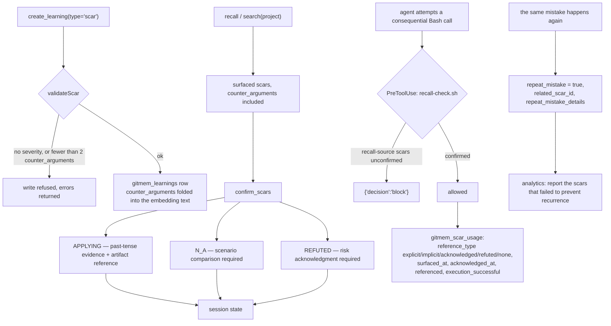

## 1. Executive Summary

GitMem is an MIT MCP server — around 59,000 lines of TypeScript — that gives a
coding agent "institutional memory": **scars** (mistakes), **wins**,
**patterns** and **anti-patterns**, in Postgres with pgvector or a local
`.gitmem/` directory.

**Two mechanisms make it worth the report, and they are the same idea applied at
both ends of the memory lifecycle.**

**At write time, a scar is refused unless it argues against itself.**

```typescript
function validateScar(params: CreateLearningParams): string[] {
  const errors: string[] = [];
  if (!params.severity) {
    errors.push("Scars require severity (critical, high, medium, low)");
  }
  if (!params.counter_arguments || params.counter_arguments.length < 2) {
    errors.push("Scars require at least 2 counter_arguments");
  }
  return errors;
}
```

You may not record a lesson learned without recording at least two reasons
someone might reasonably reject it. The counter-arguments are stored in a
`TEXT[]` column, folded into the embedding text, and **returned on every
search** — so the objection travels with the claim to the point of use.

Nothing else in this atlas requires a memory to carry its own rebuttal.

**At read time, every surfaced scar must be individually answered.**
`confirm_scars` implements what the file calls the **refute-or-obey protocol**:

> "Each recalled scar must be addressed with:
> `APPLYING` — Scar is relevant, past-tense evidence with artifact reference;
> `N_A` — Scar doesn't apply, scenario comparison required;
> `REFUTED` — Overriding scar, risk acknowledgment required."

And it is enforced, not requested. `hooks/scripts/recall-check.sh` is a
`PreToolUse` hook on `Bash` with a "CONFIRMATION GATE (hard block, consequential
actions only)" that emits `{"decision": "block"}` when recall-source scars are
unconfirmed. A sibling hook, `credential-guard.sh`, hard-blocks any tool call
that would expose credentials.

[Daem0nMCP](../daem0n-mcp/) makes *consultation* a precondition. GitMem makes
consultation *per item*: it is not enough to have called recall, you must say what
you did about each thing recall told you, and overriding one costs you an
explicit risk acknowledgment.

**And the one clean bug** is in the dismissal counter — section 9.

## 2. Mental Model

A scar is a structured artifact, not a sentence: severity, `problem_context`,
`solution_approach`, `applies_when`, `why_this_matters`, `action_protocol`,
`self_check_criteria`, and the counter-arguments. Recall surfaces it, the agent
must answer it, and the answer is recorded along with whether the resulting
action succeeded.



## 3. Architecture

`src/` splits into `tools` (the MCP surface), `schemas` (Zod input schemas per
tool), `services`, `hooks`, `commands`, `diagnostics` and `constants`. The
storage layer is Supabase/Postgres with pgvector on the paid path and a local
`.gitmem/` directory on the free tier, and `search.ts` implements **both**: a
vector path and a local keyword path that also scans decisions and merges them
into the same ranked list.

`hooks/` ships a Claude Code plugin with `SessionStart`, `UserPromptSubmit`,
`PreToolUse` and session-close hooks, plus templates for Claude, Cursor, Copilot
and Windsurf rule files.

Five separate vitest configs — unit, integration, e2e, perf and smoke — and 82
test files.

## 4. Essential Implementation Paths

**Refuse a weak scar** — `src/tools/create-learning.ts` (`validateScar`
`:39-51`, `buildEmbeddingText` `:54-69`, the early return on errors `:80-90`).

**Confirm a surfaced scar** — `src/tools/confirm-scars.ts` (the protocol
docstring `:1-18`), `src/services/session-state.ts`.

**Block on unconfirmed** — `hooks/scripts/recall-check.sh` (the confirmation
gate `:6-9`), `hooks/scripts/credential-guard.sh`,
`hooks/hooks/hooks.json` (the `PreToolUse` matcher on `Bash`).

**Record what happened** — `src/tools/record-scar-usage.ts`,
`record-scar-usage-batch.ts`, `schema/setup.sql` `gitmem_scar_usage`
`:132-147`.

**Suggest and dismiss** — `src/services/thread-suggestions.ts`
(`SUGGESTION_MATCH_THRESHOLD` `:29`, the match loop `:91-107`, the new
suggestion `:120-127`, `dismissSuggestionById` `:157-168`,
`getPendingSuggestions` `:174-180`), `src/tools/dismiss-suggestion.ts`.

## 5. Memory Data Model

`gitmem_learnings` is the table to read:

- `learning_type` — `CHECK IN ('scar', 'win', 'pattern', 'anti_pattern')`
- `severity` — `CHECK IN ('critical', 'high', 'medium', 'low')`
- `counter_arguments TEXT[]` — the arguments against this memory
- `applies_when TEXT[]`, `problem_context`, `solution_approach`
- `why_this_matters`, `action_protocol`, `self_check_criteria`
- `is_active`, `decay_multiplier`
- `repeat_mistake BOOLEAN`, `related_scar_id UUID`,
  `repeat_mistake_details JSONB`
- `project`, `source_date`, `persona_name`, `embedding vector(1536)`

**`repeat_mistake` is the field to steal.** A scar exists to stop something
happening again. This schema records the case where it *didn't* — the flag, a
link to the original scar, and a JSONB detail with a `reason` — and
`services/analytics.ts` queries `repeat_mistake: "eq.true"`, joins
`related_scar_id` and `repeat_mistake_details`, and reports them.

A memory system that measures which of its memories failed at their job is
rare. The atlas has read many that measure retrieval and almost none that ask
whether retrieval changed the outcome.

`gitmem_scar_usage` is the other half:

```sql
reference_type TEXT CHECK (reference_type IN
  ('explicit', 'implicit', 'acknowledged', 'refuted', 'none')),
surfaced_at TIMESTAMPTZ, acknowledged_at TIMESTAMPTZ,
referenced BOOLEAN, execution_successful BOOLEAN, variant_id UUID
```

`'none'` is the value most systems omit: a scar was shown and the agent did
nothing with it. `surfaced_at` and `acknowledged_at` separate shown from
addressed. `execution_successful` closes the loop to the outcome, and
`variant_id` allows A/B variants of the same lesson.

## 6. Retrieval Mechanics

Vector search on the Supabase path, keyword on the free tier, with `severity`
and `learning_type` post-filters and a `fetchCount = matchCount * 3` over-fetch
so the post-filter has material to trim. Decisions are searched alongside
learnings on the local path and merged into one similarity-sorted list.

`project` is resolved once per call — `params.project || getProject() ||
"default"` — and passed into both `localScarSearch(query, fetchCount, project)`
and the remote search. A stored column reaching the query is what
`scope_enforced` certifies.

`counter_arguments` come back on every result shape in `search.ts`. That is the
detail that makes the write-time rule worth having: the objection is not filed
away, it is injected next to the claim.

## 7. Write Mechanics

`create_learning` validates, embeds and inserts. A scar failing validation
returns `success: false` with the errors and no row — a refusal, not a warning.

`archive_learning` sets `is_active = false`, and `log.ts` filters
`is_active: "eq.true"`, so archiving removes a learning from retrieval without
deleting it. Nothing is keyed on a rejected *value*: an archived scar's content,
re-submitted, is a new row.

## 8. Agent Integration

An MCP server on npm (`gitmem-mcp`) with a one-command `init` wizard that
auto-detects the IDE, a Claude Code plugin with four lifecycle hook points, rule
templates for four editors, a `PRIVACY.md` and a `SECURITY.md`, and a starter
scar set in `schema/starter-scars.json`.

The hook set is the integration that matters: `SessionStart` initialises,
`UserPromptSubmit` auto-retrieves, `PreToolUse` guards credentials and enforces
confirmation, and a session-close check runs at the end.

## 9. Reliability, Safety, and Trust

**Scope enforced — awarded**, per section 6.

**Human review — awarded** on the suggestion pipeline: implicit thread
detection proposes a thread from session-embedding similarity, the suggestion is
`status: "pending"`, and it becomes an open thread only when a person promotes
it or disappears when a person dismisses it. A proposal that does not take
effect until someone acts on it is the mark's substance.

**Audit log — withheld, deliberately.** `gitmem_scar_usage` is the richest
retrieval-feedback table in this corpus, and retrieval feedback is explicitly the
half the mark does not cover: it records what was *surfaced and used*, not an
append-only record of memory *mutations*. Nothing found logs creates, archives
and edits as events.

**Trust state — withheld.** `is_active` is a lifecycle flag and `severity` and
`decay_multiplier` are grades, not epistemic states. The nearest thing to an
epistemic state is `repeat_mistake`, which describes the world rather than the
memory's standing.

**Tombstone, bitemporal, negative eval — no.** `source_date` is stored and no
query treats it as a validity bound.

**The dismissal counter cannot reach its own threshold.**

`dismiss_suggestion`'s header says: *"Suggestions dismissed 3+ times are
permanently suppressed."* `getPendingSuggestions` implements it:
`s.status === "pending" && s.dismissed_count < 3`.

But `dismissSuggestionById` sets `suggestion.status = "dismissed"` and increments
the count, and the routine that decides whether an incoming topic matches an
existing suggestion begins:

```typescript
for (const suggestion of updated) {
  if (suggestion.status !== "pending") continue;
```

A dismissed suggestion is skipped by the matcher. So the next time the same topic
recurs, no existing suggestion matches, and a fresh one is created with
`generateSuggestionId()` and `dismissed_count: 0`. In the paths read, nothing
returns a dismissed suggestion to `pending`.

**Therefore `dismissed_count` can never exceed 1, the `< 3` guard is
unreachable, and dismissal suppresses a record rather than a topic** — the user
who dismisses a suggestion will be offered the same topic again under a new id.
The unit test asserts exactly the reachable behaviour (`expect(result!
.dismissed_count).toBe(1)`), which is why the gap is invisible to the suite.

The fix is small: match against dismissed suggestions too (they carry the
embedding), and increment the existing record instead of creating a new one.
That would also turn the feature into something this atlas has been looking for —
a rejected item keyed on its *content* rather than its id, which is the property
that separates a real suppression from a bypassable one.

## 10. Tests, Evals, and Benchmarks

**No paper, no retrieval benchmark.** 82 test files across five vitest configs —
unit, integration, e2e, perf and smoke — plus CI, a `CHANGELOG.md`, a
`SECURITY.md`, a `PRIVACY.md`, a `CODE_OF_CONDUCT.md` and a
`DIRECTORY-SUBMISSIONS.md`.

Notable test names: `no-console-log.test.ts` (a lint invariant asserted as a
test), `provenance-citation.test.ts`, `confirm-scars.test.ts`,
`archive-learning.test.ts`, `thread-suggestions.test.ts`.

The measurement that would matter here is the one the schema is built for and no
committed analysis performs: `gitmem_scar_usage.execution_successful` joined
against `reference_type`, answering whether confirming a scar changed the
outcome. The `repeat_mistake` analytics report is the closest, and it counts
recurrences rather than comparing them against a baseline.

**I ran nothing.**

## 11. For Your Own Build

### Steal

- **Require counter-arguments before you accept a lesson.** Two, minimum,
  enforced at write time with the write refused otherwise. It forces the author
  to have thought about when the lesson does not apply, and it is the cheapest
  guard against a memory system that accumulates confident overgeneralisations.
- **Return the counter-arguments with the memory.** Storing the objection and
  hiding it at retrieval would be pointless; here it rides along in every result
  shape and in the embedding text.
- **Make consultation per item, not per session.** Every surfaced scar answered
  with `APPLYING`, `N_A` or `REFUTED` — and make each answer cost something:
  past-tense evidence with an artifact reference, a scenario comparison, or an
  explicit risk acknowledgment.
- **Enforce it with a hard block on consequential actions only.**
  `{"decision": "block"}` from a `PreToolUse` hook matched to `Bash`, with
  read-only tools unaffected, is the right blast radius.
- **Record `'none'` as a usage outcome.** A scar that was surfaced and ignored is
  data; a table that only records uses cannot tell you which memories are dead
  weight.
- **Separate `surfaced_at` from `acknowledged_at`.** Two timestamps make "shown"
  and "addressed" distinguishable, which is what makes the ignore rate
  measurable.
- **Track whether the scar failed.** `repeat_mistake`, `related_scar_id` and a
  reason, reported in analytics. A memory system should be able to name its own
  memories that did not work.
- **Give a learning an `action_protocol` and `self_check_criteria`.** A lesson an
  agent can act on beats a lesson it can only read.
- **Over-fetch before post-filtering.** `matchCount * 3` when a severity or type
  filter is set.

### Avoid

- **Do not skip non-pending records in a dedup matcher when the non-pending
  state is what you are trying to enforce.** Here it makes a documented
  suppression rule unreachable and turns "dismissed permanently" into "dismissed
  once, then offered again".
- **Do not key a suppression on a generated id.** Key it on the content or its
  embedding, or a re-derivation walks straight past it.
- **Do not let a test assert only the reachable branch.** The suite checks
  `dismissed_count` becomes 1 and never asks how it would become 3.

### Fit

The best fit in this batch for a team that wants an agent to be *accountable* to
its memory rather than merely informed by it — the refute-or-obey gate plus the
counter-argument requirement is a coherent discipline, and the hooks make it real
rather than advisory.

The Supabase dependency is the main adoption question; the free tier's local
keyword path exists but is a different retrieval quality.

## 12. Open Questions

- **Who sets `repeat_mistake`?** The analytics read it and the write path was not
  located; whether it is agent-reported or detected was not established.
- **What is `variant_id` for?** `gitmem_scar_usage` supports A/B variants of a
  scar and no variant assignment logic was found.
- **Is `execution_successful` ever analysed?** It is the column that would answer
  whether confirmation changes outcomes.
- **Does `decay_multiplier` reach ranking?** It is on the row; its consumer was
  not traced.

## Appendix: File Index

**Write-time validation** — `src/tools/create-learning.ts` (`validateScar`
`:39-51`, embedding text including counter-arguments `:54-69`, the refusal path
`:80-90`)

**Confirmation protocol** — `src/tools/confirm-scars.ts` (the refute-or-obey
docstring `:1-18`), `src/schemas/confirm-scars` via `src/schemas/index.ts`,
`src/services/session-state.ts`

**Hooks** — `hooks/hooks/hooks.json` (`SessionStart`, `UserPromptSubmit`,
`PreToolUse` on `Bash`), `hooks/scripts/recall-check.sh` (the confirmation gate
`:6-9`, the output contract `:23`), `hooks/scripts/credential-guard.sh` (the
`"decision": "block"` emissions), `hooks/scripts/session-close-check.sh`

**Schema** — `schema/setup.sql` (`gitmem_learnings` `:11-39`, `gitmem_sessions`
`:68-85`, `gitmem_decisions` `:104-118`, `gitmem_scar_usage` `:132-150`),
`schema/starter-scars.json`

**Retrieval** — `src/tools/search.ts` (project resolution `:131`, over-fetch
`:136`, the local path `:140-200`, counter-arguments in every result shape
`:151`, `:269`, `:301`)

**Suggestions** — `src/services/thread-suggestions.ts`
(`SUGGESTION_MATCH_THRESHOLD` `:29`, the thread cover check `:80-88`, the
pending-only match loop `:91-107`, the new suggestion `:120-127`,
`dismissSuggestionById` `:157-168`, `getPendingSuggestions` `:174-180`),
`src/tools/dismiss-suggestion.ts` (the suppression claim `:4-5`),
`tests/unit/services/thread-suggestions.test.ts` (`:271-278`)

**Analytics** — `src/services/analytics.ts` (`repeat_mistake: "eq.true"` `:229`,
the select `:236`, the report `:357-361`, `:808`)

## History

**2026-08-09** — [`c091a7589858e6e8cf0a6b3774a7e9d0ffbf0aa5`](https://github.com/gitmem-dev/gitmem/commit/c091a7589858e6e8cf0a6b3774a7e9d0ffbf0aa5) — first reading. Screened before reading; the tree was read, never installed, and no test was run.
