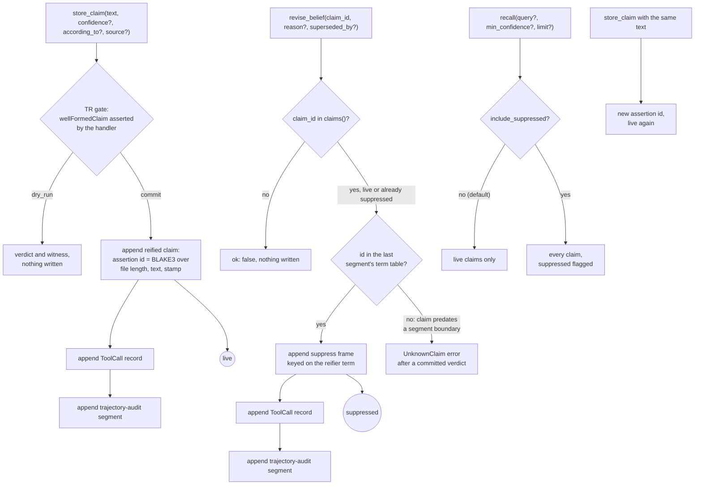

## 1. Executive Summary

GMEOW is an RDF 1.2 ontology and reasoning engine built in Rust, whose
README names grounded agent memory as its flagship use. That memory is three
MCP tools on the `gmeow mcp` server: `store_claim` appends a reified claim to a
single GTS file, `recall` ranks claims by token overlap, and `revise_belief`
suppresses one without deleting it. Every committed write also appends a
tool-call record and a trajectory-audit segment to the same file.

What is notable is the discipline around a small store. Revision is a
suppression frame, never an erasure, and an explicit `include_suppressed` view
shows what was retired. One test pins the suppression filter across five recall
shapes with a control claim beside each negative.

What is weak is the distance between that store and the ontology above it. The
claim carries text, a creation stamp and three optional annotations. Standpoints,
evidence, defeaters and the `originGenerated` confabulation flag the README
describes live in the ontology slices and never reach the claim file.

The native store is `purrdf::gts::examples::agent_memory`, a module of a separate
Blackcat repository whose comments call it a *"dependency-light example API"*
and disclaim cross-process locking (`agent_memory.rs:152`, `:277-283`). This
report read it at the `rust-v3.0.0` tag the lockfile pins. GMEOW adds the
Transaction-Logic gate, the audit segment and a browser backend.

The tooling is AGPL-3.0-only and the ontology CC BY 4.0, with the copyright
holder reserving separate commercial licences (`LICENSING.md`). A product that
links the MCP crate takes on the AGPL.

Three marks: `trust_state`, `audit_log`, `negative_eval`. Section 9 names the
four withheld. The conjecture and candidate libraries are append-only stores of
logic formulas tested against a knowledge base, not agent memory, and are not
covered.

## 2. Mental Model

A memory is a claim: a string an agent asserts, with optional confidence,
attribution and source. It becomes part of the store when `store_claim`
commits. Nothing extracts, merges or checks it, and the README's line *"An LLM
output is a claim, not a truth"* is the whole admission policy. Two
contradictory claims coexist, and nothing adjudicates between them.

**A claim has two states, live and suppressed, and one transition.**
`revise_belief` appends a suppression frame naming the claim's reifier term
(`agent_memory.rs:538-566`). Recall drops suppressed claims unless asked for
them (`:677-687`). There is no way back: the action policy names `store_claim`
as `revise_belief`'s compensation, *"reversible by RE-STORING (re-asserting) the
claim"* (`slices/core/agentic/examples/mcp-action-policy.ttl:146-159`). A
re-stored claim is a new record with a new id, because the id hashes the file
length and the creation stamp (`agent_memory.rs:445-458`).

**Identity is the record, not the text.** Each claim also has a subject
`urn:purrdf:claim:` plus a digest of its text (`:459`), and `claims()` treats a
suppression of either the reifier or the subject as suppressing the claim
(`:744`). Only the reifier is ever targeted. The MCP handler admits a
`claim_id` only if it is a known assertion id (`lib.rs:4967-4974`).

**Every write passes a Transaction-Logic gate.** The handler builds a start
state from situations it asserts, runs the action schema through
`execute_transaction_dataset`, and writes only on a committed success
(`lib.rs:7732-7748`). For `store_claim` the handler asserts `wellFormedClaim`
unconditionally once `text` is present (`:4874`), so the gate cannot refuse. For
`revise_belief` it asserts `targetClaimExists` when the id is known, suppressed
or not (`:4989-4995`), and the policy's precondition is that one situation. The
verdict restates the handler's set membership, and a second revise of a
suppressed claim passes and appends another frame.

**Who moves a claim.** The agent, through the two write tools. No person, no
background pass and no model call holds any other route.

## 3. Architecture

The repository is a Rust workspace of about fifty crates around an ontology
authored as Turtle slices. A build pipeline compiles the slices into one GTS
bundle, and the `gmeow` CLI embeds it as `BUNDLE_GTS`. `gmeow mcp` serves the
consumer MCP surface over stdio from that bundle alone
(`crates/gmeow-cli/src/commands.rs:5811-5828`). `gmeow-mcp` declares 38 tools
(`crates/mcp/src/lib.rs:391`), of which six are governed writes (`:400-408`).

**The storage seam is one trait with two backends** (`crates/mcp/src/storage.rs:87-166`).
Natively, `FsClaimStore` delegates every method to purrdf's `Memory` at the
path `GMEOW_MEMORY_PATH` resolves to, defaulting to `~/.gmeow/memory.gts`
(`:809-819`, `:850-876`, `:901-945`). In the browser, `InMemoryClaimStore` holds
claims, suppressions and calls in a mutex and stamps a logical clock anchored at
the Unix epoch (`:1145-1420`). No `localStorage`, `sessionStorage` or IndexedDB
reference appears in the wasm crates or the docs assets, so a browser store
lasts as long as the page.

**The file is a GTS `ai-package`.** One segment header carries the profile and
an in-band zstd dictionary, `gmeow-memory-hot-v1`, read out of the loaded
bundle (`lib.rs:8758`, `:8783-8806`). Each record appends `terms`, `quads`,
`reifies`, `annot` or `suppress` frames to that segment's chain
(`agent_memory.rs:509-520`). When the bundle's dictionary differs from the one
the file's tail pins, the native backend opens a new segment header before
writing (`storage.rs:741-754`).

**Nothing runs in the background.** `compact_store` would repack the file
into one streamable signed segment under the library lock
(`lib.rs:8805-8871`). It has no caller in the tree; `bench/README.md:368-376`
discusses its dictionary.

### Deployment and ergonomics

One native binary, built from source or downloaded as a signed release, and a
file under the home directory. No database, network, model or API key is
needed to store or recall. The documented one-line install, `claude mcp add gmeow
… -- uv run gmeow mcp` (`docs/mcp-server.md:12-14`), runs whatever `gmeow` is on
`PATH`; the Python package in `packages/python/` is the generated Pydantic
models and declares no `gmeow` script.

The store is not human-readable. It is compressed binary frames, and reading or
repairing it needs purrdf's reader, the `recall` tool with `include_suppressed`,
or `store_segment`, which exports claims and calls as N-Quads.

## 4. Essential Implementation Paths

**Write.** `tool_store_claim` (`crates/mcp/src/lib.rs:4865-4943`) reads `text`,
`confidence` and `dry_run`, runs `execute_memory_txn` with the store-claim schema
(`:4874-4880`), returns early on a failure or a dry run, then calls
`ClaimStore::store_claim`. Natively that is `Memory::store`
(`agent_memory.rs:435-531`). It rejects empty text and a confidence outside
`[0, 1]`, mints the assertion id, and appends four frames. The handler then
calls `record_tool_call` (`lib.rs:4914-4927`) and `write_audit_segment`
(`:4928-4941`, `:7815-7826`).

**Confidence is range-checked by the engine, not the handler.** The comment at
`lib.rs:4870-4873` says in-range confidence is *"enforced above"*;
`optional_f64` checks only that the value is a number (`:7511-7523`). An
out-of-range value commits the verdict and fails in `Memory::store`, so
nothing is written.

**Read.** `tool_recall` → `recall_json` (`lib.rs:4950-4952`, `:8369-8382`) →
`Memory::recall` (`agent_memory.rs:677-719`), which calls `claims()` and so
reads and parses the whole file (`:721-748`, `:813-819`).

**Revise.** `tool_revise_belief` (`lib.rs:4964-5063`) reads every claim to
build the known and active id sets (`:4967-4974`), rejects an unknown successor
(`:4975-4983`), runs the gate, then calls `Memory::revise`
(`agent_memory.rs:538-566`). That function resolves the claim id against
`last_segment_terms()` with `resolve_existing`, which never mints a row
(`:540-543`, `:955-958`), and appends an optional `annot` frame linking the
successor by `wasDerivedFrom`, then the `suppress` frame.

**Export and re-seed.** `store_segment` serializes claims and calls as
position-addressed `gmeow:ClaimToken` and `gmeow:ToolCall` N-Quads, carrying
`displayable` for suppression and dropping backend ids and creation stamps
(`storage.rs:280-320`, `lib.rs:8404-8415`). `seed_claim_store` reads it back
through the public write API (`storage.rs:574`), so a re-seeded claim is stamped
afresh.

**Tests.** `crates/mcp/src/tests.rs:1216-1328` and `:2053-2218` cover the triad
through `call_tool_result`; `crates/mcp/src/lib.browser_storage_tests.rs` and
`crates/mcp/src/storage.tests.rs` cover the browser store and the export; the
engine's own suite is purrdf's `crates/gts/tests/agent_memory_append.rs`.

## 5. Memory Data Model

| Field | Where | Notes |
| --- | --- | --- |
| id | reifier IRI | `urn:purrdf:assertion:blake3:` over kind, file length, text, stamp, source, confidence, attribution (`agent_memory.rs:880-899`) |
| text | `rdf:value` literal of the reified statement | the subject is `urn:purrdf:claim:` plus a digest of the text |
| created | `dct:created` annotation | wall-clock UTC natively, a logical epoch-anchored counter in the browser |
| confidence | annotation, `xsd:decimal` | optional, `[0, 1]` |
| according_to | annotation | stored as a plain literal (`:490-498`) though the option's doc calls it an IRI |
| source | `sourceLocation` annotation | free text |
| suppressed | derived from `suppress` frames | not stored on the claim; the frame also carries the reason |

The predicates sit under `https://example.org/memory/` (`agent_memory.rs:30-45`).
GMEOW's own `gmeow:` vocabulary appears only in the export, whose comment
declines to reproduce purrdf's on-disk encoding as *"a second, silent source of
truth for a shape we do not own"* (`storage.rs:291-298`).

**No valid time.** `dct:created` is the only time on a claim. The audit segment
records `gmeow:atTime` and a temporal frame per call, which is also transaction
time.

**No scope key.** One file is one memory. `according_to` is an annotation that
no read consults.

**No correction chain the reader follows.** A successor named in
`superseded_by` is written as a `wasDerivedFrom` annotation (`:545-549`), and
nothing in `agent_memory.rs` reads that predicate back. The reason and the
successor survive in the recorded `revise_belief` call's arguments.

## 6. Retrieval Mechanics

Recall is lexical and exhaustive. Every call parses the whole package, filters,
scores and truncates (`agent_memory.rs:677-719`):

- Suppressed claims are dropped unless `include_suppressed` is set.
- With `min_confidence`, claims below it are dropped, and so is every claim
  stored without a confidence (`:683-686`). A floor of `0.0` hides those too.
- An empty query returns storage order reversed, newest first.
- Otherwise the query and each claim are lowercased and split on whitespace;
  the score is the size of the token intersection, zero-score claims are
  dropped, and ties go to the newer claim.
- `limit` defaults to 10 (`lib.rs:8370`).

Tokens keep their punctuation, so `window` does not match `window,`, and there is
no stemming, synonymy or vector arm. Nothing is injected automatically; the agent
calls `recall` and receives JSON with each claim's id, text, confidence,
attribution, source, stamp and suppressed flag (`lib.rs:8417-8427`).

The failure modes follow from the shape. Over-recall is bounded by `limit`.
Under-recall is the main risk, because a paraphrase shares no tokens. A
contradiction surfaces as two claims side by side, which is the design.

## 7. Write Mechanics

Writes are explicit tool calls, synchronous, with no model and no extraction.
There is no deduplication: storing the same text twice yields two live claims
with different ids. Update is suppression plus a new claim, and delete does not
exist on the tool surface.

**Agent-generated content is the only content.** The handler checks the shape of
the arguments and the engine checks text and confidence. Nothing inspects what
the claim says or who could have said it, and `according_to` is whatever the
caller passes.

**The three appends are separate.** `Memory::store` writes and returns, then
`record_tool_call` appends, then `write_audit_segment` appends
(`lib.rs:4903-4941`). The library path in the same file builds its verdict and
audit segments together for *"one atomic replace"*, *"rather than two separate
appends where the second can fail after the first has already landed"*
(`lib.rs:7898-7902`). The claim path does what that comment rules out.

**No lock is taken.** `refute_conjecture` runs read, precondition and append
inside `with_library_lock` and explains the lost update it prevents
(`lib.rs:5274-5281`). `tool_store_claim` and `tool_revise_belief` take no lock,
and purrdf's `Memory` requires exclusive write ownership of each path across
processes while *"this example deliberately does not claim cross-process
locking"* (`agent_memory.rs:277-283`).
Two MCP server processes on the default path, one per client session, are the
case that comment describes. This was read, not reproduced.

**A segment boundary strands older claims.** `revise` looks the claim id up only
in the last segment's term table (`agent_memory.rs:540-543`). The native backend
opens a new segment whenever the bundle's dictionary differs from the one the
tail pins (`storage.rs:741-754`, `:858-861`). After such a boundary, a claim
stored before it is in `claims()`, so the handler's gate commits, and `revise`
then fails with `UnknownClaim`. No test revises across a boundary; the engine's
cross-append test stays within one segment (`agent_memory_append.rs:443-476`).
Read, not run.

### Operational cost

- Write: synchronous, three appends, no model call. Each call constructs a fresh
  `Memory`, so the first append reads the whole file to rebuild the term table
  (`agent_memory.rs:355-387`), and the medium check reads it again
  (`storage.rs:742-746`).
- Background: none.
- Read: one full parse per `recall` and per `revise_belief`; cost grows with
  the file, which only grows. Output is bounded by `limit`, and nothing is
  injected into a prompt unless the agent asks.

## 8. Agent Integration

The integration is an MCP stdio server and nothing else. There is no hook,
no session-start injection and no compaction handling; the docs' guidance is
*"`store_claim` when you learn, `recall` before you answer, `revise_belief` when
you learn better"* (`docs/mcp-server.md:84-85`). The `recall` tool description
an agent sees is *"Recall stored memory claims."* (`lib.rs:3346-3354`).

The agent has full agency: it stores, recalls, revises and exports, and every
write accepts `dry_run` for a verdict without a write. Adapting the store to
another agent means running the same binary or linking `gmeow-mcp`, which
brings the AGPL and the reasoner; the purrdf module alone is permissively
licensed and has no reasoner dependency.

The browser build splits the engine into two wasm images and keeps every
claim-store tool in one of them. The doc comment on `REASONING_SEGMENT_TOOLS`
records the defect this prevents, a `store_claim` that returned `ok` while
`recall` answered `[]` from the other image's store (`lib.rs:316-337`), and
`the_grounded_memory_triad_is_served_by_one_segment` pins it (`tests.rs:322`).

## 9. Reliability, Safety, and Trust

**Provenance is per record and per call.** Each claim can carry attribution and
source, and each committed write leaves a tool-call record with its arguments
and result. Neither is verified: both are caller strings.

**Uncertainty is representable in two ways that do not interact.** Confidence is
a float used only as an optional floor. Suppression is a bit that filters. A
claim can be confident and suppressed, or live and unrated, and recall treats
the two independently.

**Concurrency is the weakest point.** The engine requires a single writer and
GMEOW does not enforce one on the claim file, while it does on both libraries
(section 7). The likely result of two writers is two appends computing the same
term base, which the engine's comment at `agent_memory.rs:400-407` describes as
rows that *"silently point at the FIRST claim's terms"*.

**Privacy.** Nothing deletes. A claim a user wants gone is suppressed and stays
in the file, in its tool-call record and in any export. `compact_store` is
described as statement-preserving and is not wired.

**Prompt-injected memories** reach the store as readily as any other claim, and
recall returns them without a marker of origin. The README's
`originGenerated` flag is ontology vocabulary only; it appears in the slices
and the generated Pydantic models, not in `crates/mcp/src` or the engine module.

Capability marks:

- `trust_state` — awarded. A stored suppression withholds a claim from every
  default recall on both backends; evidence in the frontmatter record.
- `audit_log` — awarded. A named `ToolCall` record per committed write in the
  same append-only file, with the gaps the record lists.
- `negative_eval` — awarded; evidence in section 10.
- `tombstone` — withheld. Suppression is keyed on the reifier, a record. The
  same text stored again is a new live claim, and the action policy names
  re-storing as the designed reversal. The subject IRI is a digest of the text
  and `claims()` would honour a suppression of it, but `revise_belief` cannot
  target it and a re-stored claim restates the subject as a new term.
- `bitemporal` — withheld. One creation stamp, no valid time.
- `scope_enforced` — withheld. The partition is the file; `according_to` is
  stored and never read as a filter.
- `human_review` — withheld. No state waits for anyone, and the agent holds
  `revise_belief`.

## 10. Tests, Evals, and Benchmarks

Nothing was built or run for this report; everything below was read at the pin.

**The negative case.** `memory_triad_preserves_suppression_on_every_default_recall_path`
(`crates/mcp/src/tests.rs:1216-1294`) stores a canary and a control with the
same tail words, revises the canary, and for five argument shapes asserts the
canary absent and the control present (`:1282-1283`). It then asserts the audit
view returns the canary flagged. A filter that dropped everything fails on the
control, and one that dropped nothing fails on the canary. The same test pins
the tool-call trajectory: two stores and a revise, with the intervening recall
unrecorded (`:1243-1268`).

**Other triad cases.** `revision_rejects_unknown_ids_before_writing` (`:1297-1328`)
covers an unknown id and an unknown successor. `store_claim_dry_run_computes_verdict_without_persisting`,
`revise_belief_dry_run_does_not_suppress` and
`committed_revise_suppresses_but_never_deletes` (`:2053-2218`) cover the dry runs
and the audit view. `committed_store_records_the_audit_context` (`:2088-2140`)
asserts the six trajectory-audit predicates land in `memory.gts`.

**Engine cases.** `agent_memory_append.rs` asserts one header per store, that an
appended store folds to the same claims as the older pack-per-claim layout, that
an unknown revision appends nothing, and that a later revision suppresses the
right claim. Both record ids are frozen against golden values
(`agent_memory.rs:1119-1131`).

**The test harness.** The triad tests run inside `batch_mcp_items!`, which
partitions cases by a `_heavy_offgate` name suffix; none of the triad cases
carries it (`crates/test-batch-macros/src/lib.rs:299`). `ci.yml` installs
`cargo-nextest` (`:380-383`). This reading did not trace which CI job runs the
`gmeow-mcp` suite.

**Evals.** `evals/` scores an LLM's claim extraction from a corpus for grounding,
hallucination and abstention; the only committed output is a hand-authored
reference baseline (`evals/outputs/reference-baseline/meta.json`). It does not
touch the claim store. No retrieval-quality evaluation of `recall` is in the
tree.

**Paper.** `CITATION.cff` registers a DOI, `10.67342/26w4o`, for the ontology as
a dataset. No paper describing or evaluating the memory is cited.

**Not covered.** Concurrent writers; revise across a segment boundary; a
crash between the claim append and its call record; recall with
`min_confidence` over claims stored without one.

## 11. For Your Own Build

### Steal

- **Retire by appending, and give the retired set its own read.** A default
  filter plus an explicit `include_suppressed` view keeps the audit question
  answerable without letting it leak into answers.
- **Record every mutation in the store it mutates.** A tool-call record with
  arguments, result and generated ids, in the same append-only file, answers
  "why is this here" without a second system.
- **Pin the negative with a control in the same loop.** Five argument shapes,
  each asserting the retired claim absent and a sibling present, is the minimum
  that cannot pass on an empty result.
- **Test the backend nobody can test where it ships.** The browser store is
  compiled on every target so the native suite exercises it.
- **Keep reads and writes of one store in one deployable.** The wasm split
  forked the store once; the tool list now says which tools share it, and a test
  enforces it.

### Avoid

- **A gate whose inputs the handler asserts.** A verdict computed over
  situations the caller pushed is a restatement of the caller's `if`. Put the
  check where it can disagree, or call it validation.
- **Locking one store and not its sibling.** The libraries take an exclusive
  lock and the claim file, written by the same server, does not.
- **Resolving ids in the newest segment only** of a file that opens new segments
  for operational reasons.
- **Writing a successor link nothing reads.** If a correction chain matters,
  surface it on recall.
- **A floor that silently drops unrated records.** Decide what a missing
  confidence means and say it in the tool description.

### Fit

This suits an agent builder who wants an inspectable, append-only claim log
with clean suppression semantics and an audit trail, on one machine, under one
writer, and who will call `recall` deliberately. It does not suit anyone who
needs memory to be found by meaning, scoped between users or projects, deleted
on request, or shared by several concurrent agent sessions on one file. The
ontology's model of belief, standpoint and defeat is far richer than the store,
and adopting GMEOW for memory means adopting the AGPL and a large reasoning
engine to get a module the engine's own repository files under examples.

## 12. Open Questions

- Do two `gmeow mcp` processes appending to one `memory.gts` corrupt it in
  practice, and does the reader detect it?
- Which CI job runs the `gmeow-mcp` triad tests, and on what bundle?
- Is a dictionary change between releases expected, and has any user file
  crossed a segment boundary?
- Does the published `purrdf` 3.0.0 crate match the `rust-v3.0.0` tag byte for
  byte? The lockfile checksum was not compared.
- Will `compact_store` be wired, and does a compacted file keep every
  suppression and call record?

## Appendix: File Index

- **Storage and schema:** `crates/mcp/src/storage.rs`;
  purrdf `crates/gts/src/examples/agent_memory.rs` at `rust-v3.0.0`.
- **Write, revise and audit:** `crates/mcp/src/lib.rs:4865-5063`, `:7700-7990`;
  `slices/core/agentic/examples/mcp-action-policy.ttl:88-172`.
- **Retrieval:** `crates/mcp/src/lib.rs:8369-8427`; `agent_memory.rs:677-748`.
- **MCP surface:** `crates/mcp/src/lib.rs:290-420`, `:3265-3385`;
  `crates/gmeow-cli/src/commands.rs:5811-5828`; `docs/mcp-server.md`.
- **Compaction:** `crates/mcp/src/lib.rs:8805-8871`.
- **Tests:** `crates/mcp/src/tests.rs`, `crates/mcp/src/storage.tests.rs`,
  `crates/mcp/src/lib.browser_storage_tests.rs`; purrdf
  `crates/gts/tests/agent_memory_append.rs`.

### Recorded searches

Checked against the checkout at the pinned revision, with purrdf at
`rust-v3.0.0` cloned beside it as `.engine-purrdf`.

- `rg -n 'compact_store' . --glob '!.engine-purrdf/**'` — the definition in `crates/mcp/src/lib.rs:8841` and two mentions in `bench/README.md`; no caller.
- `rg -n 'with_library_lock|flock' crates/mcp/src/lib.rs crates/mcp/src/storage.rs` — library paths and compaction only; no hit in `tool_store_claim`, `tool_revise_belief` or `FsClaimStore`.
- `rg -n 'lock' .engine-purrdf/crates/gts/src/examples/agent_memory.rs | rg -v 'cache|lock\(\)|PoisonError'` — no file lock.
- `rg -n 'WAS_DERIVED_FROM|wasDerivedFrom' .engine-purrdf/crates/gts/src/examples/agent_memory.rs crates/mcp/src/*.rs` — the constant, two doc lines and the one writer in `revise`; no reader.
- `rg -n -i 'valid_?from|valid_?to|valid_?until|tenure|valid_at|invalid_at' crates/mcp/src/lib.rs crates/mcp/src/storage.rs .engine-purrdf/crates/gts/src/examples/agent_memory.rs` — no match.
- `rg -n 'according_to' .engine-purrdf/crates/gts/src/examples/agent_memory.rs crates/mcp/src/storage.rs | rg -i 'filter|=='` — no match.
- `rg -n -i 'originGenerated|confabulat' crates/mcp/src .engine-purrdf/crates/gts/src/examples/agent_memory.rs` — no match; `rg -l -i 'originGenerated' --glob '!conformance/**'` lists the README, a doc, two slice files and the generated Pydantic models.
- `rg -n -i 'indexeddb|localstorage|sessionStorage' crates/docs/assets crates/mcp-wasm crates/mcp-core-wasm -l` — no match.
- `grep -rliE 'arxiv|bibtex|@article|@misc|doi\.org|CITATION' --exclude-dir=.git --exclude-dir=.engine-purrdf --exclude-dir=conformance .` — `CITATION.cff`, `README.md`, `docs/CITATIONS.md` and pipeline reference fixtures; the DOI is the ontology's own.

## History

**2026-10-03** — [`38f568b04a5f6509e98ccb5e3b387623f1974b58`](https://github.com/Blackcat-Informatics/gmeow-ontology/commit/38f568b04a5f6509e98ccb5e3b387623f1974b58) — first reading, at the head of `main`, a commit dated 2 October 2026. Three marks: `trust_state`, `audit_log`, `negative_eval`. Screened before reading: 2 auto-run surfaces (`.cursorrules`, `.github/copilot-instructions.md`), 9 build-time execution points, 65 dependency files inside the cooldown, every file in the depth-1 clone dating to the tip, and 1 floating range; `AGENTS.md`, `CLAUDE.md` and `.cursorrules` were treated as data. The claim store was read in purrdf at [`3954ae2438c3193bf5812cfd7621dc993f1d1d6d`](https://github.com/Blackcat-Informatics/purrdf/commit/3954ae2438c3193bf5812cfd7621dc993f1d1d6d), the `rust-v3.0.0` tag the lockfile pins. Nothing installed, built or run.
