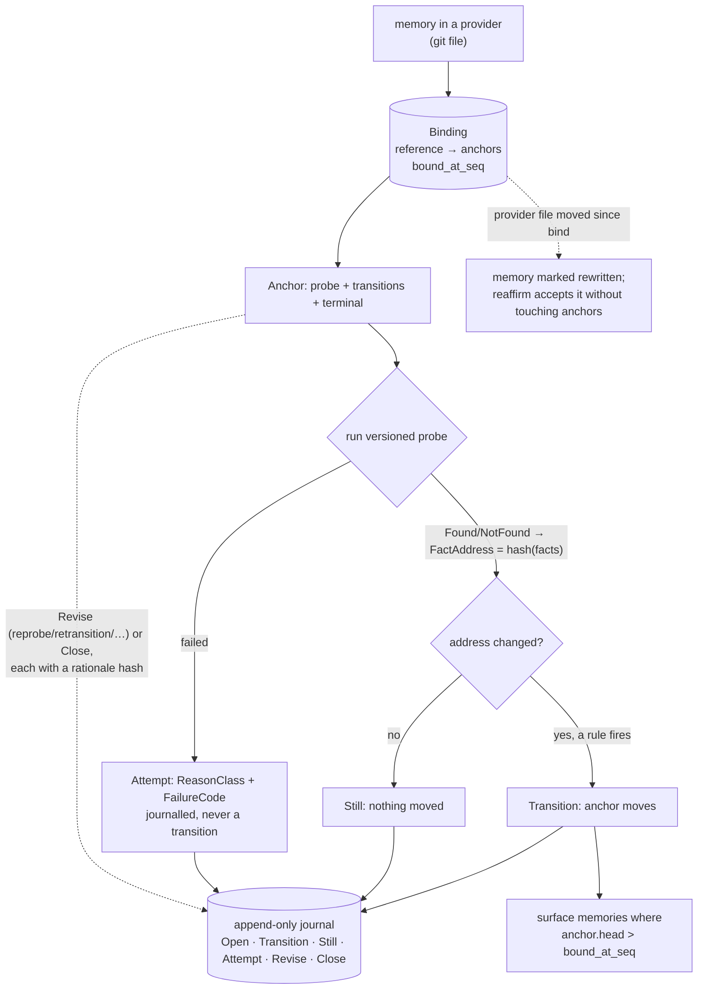

## 1. Executive Summary

GMR — Grounded Memory Runtime — is a grounding layer that sits *beside* an agent's
memory rather than being one. Apache-2.0, 50,501 lines of Rust across eight
crates and four sibling trees. It answers a question the rest of this atlas mostly leaves to decay
heuristics and manual review: **when does a stored belief stop being true because
the thing it was about changed?**

Its answer is a first-class mechanism, and it is the reason the report exists. A
memory is not stored as content here; it is stored as a **binding** — an external
reference `(provider, external_id)`, e.g. `("git", "memories/core-modules.md")`,
attached to one or more **anchors**. An anchor is an observable fact: a versioned
**probe** that produces `Facts`, a set of content-hashed **transition rules**
(`when` expression → `to` expression), and a state. GMR re-runs the probe,
content-addresses the observed facts, and when that address crosses a declared
transition the anchor moves and GMR returns the memories bound to it. The memory
content stays in its provider (git files); GMR maintains the *relationship*
between a judgment and the observable state it depends on, and — its own README
is precise about this — "does not store a copy of the world or decide whether a
judgment is correct."

Three things make it worth a senior reader's time.

**The transition is content-addressed, and the failure taxonomy is separate from
it.** A change is detected when the hash of the observed `Facts` (plus the probe
derivation) differs from the last — not by a model judging similarity. And when
the probe *fails*, that is journalled as an `Attempt` with a `ReasonClass` of
`Unreachable`, `Unusable` or `Unevaluable` and a specific `FailureCode`
(`TimedOut`, `InvalidJson`, `GuardNotBoolean`, `DividedByZero`, …). An
unreachable probe therefore **never masquerades as a change** — the most
important correctness property a drift detector can have, and one the tests pin
by name (`does_not_blame_the_anchors_it_never_reached`).

**Every anchor is an append-only journal.** `Open`, `Transition`, `Still` (the
fact was re-observed and had not moved), `Attempt` (a failed observation),
`Revise` (the anchor's own probe, rules, terminal set or state changed, each with
a rationale content-hash) and `Close`. The declaration is versioned and every
change to it carries a reason. That is `audit_log` earned without strain, and it
extends to the grounding definition itself, not just the data.

**It is dogfooded on its own source.** The `memories/` directory holds 135
memories, each a design decision about GMR's own code — `about:
crates/gmr-core/src/addr.rs#CanonicalizeError` in the frontmatter — and each
closing with a "When this changes, ask" section: the questions to re-evaluate the
memory when its anchor drifts. The project stores its own architectural
rationale the way it asks agents to store theirs.

The honest limits are two, and both follow from what GMR deliberately is not. It
grounds and surfaces; it does not decide correctness, so the value is entirely a
function of whether someone wrote a probe that observes the right fact and a
transition that fires on the right change. And a probe declared `Open`
(unverifiable) is trusted rather than reproduced — GMR marks the distinction
(`Verifiability::Closed` vs `Open`) but cannot close the gap for you.

## 2. Mental Model

A memory here is a **binding**, and its trust is derived from the state of the
anchors it binds to, at the journal sequence it was bound at.

```text
memory (in a provider: git file, …)   -- GMR does not own the content
  └─ Binding { reference, anchors, bound_at_seq }
       └─ Anchor { key, probe, transitions, terminal, superseded? }
            probe run  -> Outcome::Found{facts} | NotFound
                       -> FactAddress = hash(derivation, found, facts)
            address changed and a rule fires -> Transition (anchor moves)
            address same                      -> Still (nothing moved)
            probe failed                      -> Attempt (ReasonClass + FailureCode)
       surface: memories whose anchor moved since their bound_at_seq
```

The epistemic states are discrete and they live on the anchor and the binding,
not on a confidence score:

- An anchor has a `status` and a set of `terminal` statuses; it can be `closed`
  or `superseded` by another anchor (with a rationale hash). These are the states
  that decide whether a bound memory is still grounded.
- A binding records `bound_at_seq` — the journal position the memory was attached
  at — so "has this memory's basis drifted" is the concrete test `anchor.head >
  bound_at_seq`, not a guess.
- A memory's *own content* is tracked too: if the provider file moved since
  binding, the view marks it `rewritten`, and a caller can `reaffirm` it —
  accept the new content — "without touching anchors." A memory with no anchor is
  carried but marked ungrounded; a detached memory is no longer listed under its
  former anchor.

`trust_state` is earned by this: a bound memory is *current*, *drifted* (anchor
moved past its bound sequence), *rewritten* (its own content changed),
*ungrounded* (no anchor), or dead (anchor closed/superseded) — discrete states, a
field on the anchor and the binding, governing whether the memory should be
trusted. What GMR does *not* have is a rejected-value tombstone: `Superseded` and
`Close` are anchor-level with a rationale, not a record keyed on a rejected
memory value, so `tombstone` is withheld and the supersession named as the
near-miss.

The probe carries the other honesty axis. `Verifiability::Closed` means the
observation is content-addressed and reproducible; `Open` means you are trusting
a declaration that cannot be independently reproduced. GMR records which, on
every observation, so a memory grounded on a reproducible probe is
distinguishable from one grounded on an assertion — but it does not refuse the
`Open` one, and a reader should not read the mark as verification it is not.



## 3. Architecture

Eight crates, cleanly separated:

- **`gmr-core`** (2,648 lines) — the types: `anchor.rs` (`Anchor`, `Rule`,
  `Transitions`, `State`, `Superseded`, `RunSettings`), `memory.rs` (`Ref`,
  `Binding`, `Link`, `LinkKind`), `journal.rs` (`Entry`, `Change`, `ReasonClass`,
  `FailureCode`, `AnchorState`, `Observation`), `probe.rs` (`ProbeRef`,
  `Verifiability`, `Derivation`, `Facts`, `Outcome`), and `addr.rs`
  (content-hashing, canonicalization, string newtypes).
- **`gmr-expr`** (1,934 lines) — the transition expression language: the `when`
  guard and `to` state expressions are content-hashed source evaluated against
  the observed facts, with a failure code per evaluation error (`GuardNotBoolean`,
  `NoSuchField`, `NotComparable`, `DividedByZero`).
- **`gmr-probe`** (130 lines) and **`gmr-budget`** (220 lines) — probe execution
  deadlines and the budget a batch of observations spends.
- **`gmr-runtime`** (11,792 lines) — the loop and the verbs: `observe.rs` runs a
  probe and produces an `Observed`, `read.rs` derives `cobound` memories and
  answers freshness-bounded reads, `health.rs` computes the anchor and corpus
  census, and `assembly.rs` wires the stores together, with `bind`, `link`,
  `edges`, `open`, `close`, `revise`, `pass`, `policy`, `translate` and
  `scheduler` beside them.
- **`gmr-store`** (5,207 lines) — SQLite (via `sqlx`) with the trigger-enforced
  append-only tables, the revocation pair, the mutable `sighting`, `usage`,
  `ledger` and `queue` counters, a content-addressed `sealed` table, and a
  portable export/import for binary upgrades.
- **`gmr-content`** (360 lines) — the `ContentProvider` trait: `fetch(id)` and
  `fetch_at(id, version)`, so a provider that keeps history can serve the content
  a memory was bound against.
- **`gmr`** (37 lines) — the umbrella.

Four sibling trees sit beside them and are larger than the crates they wrap:
`console/` (14,884 lines) holds the CLI plus Node and Python bindings;
`batteries/` (11,685) holds transport, provider, survey and atlas adapters;
`packs/coding` (2,586) ships the concrete coding domain — a `probes/` directory,
an `extract` crate, a `cli` and a `SKILL.md`; and `tools/` (4,526) holds the
acceptance and measurement harnesses. That proportion is the thing to weigh: the
semantics this report credits live in about 22,000 lines of crate code, and
roughly 34,000 lines of adapter, console and tooling surround them.

### Deployment and ergonomics

- **One SQLite file**, no service. Memory content lives in whatever provider the
  adopter binds (git is the worked case), so GMR adds a grounding index beside an
  existing memory store rather than replacing it.
- **The store is portable** — `export`/`import` exist specifically so a binary
  upgrade can round-trip the database, an unusual amount of care for a v0.3.
- **Probes are external processes** with deadlines and output caps
  (`gmr-probe`), run through a shell transport; the coding domain's probe is a
  shell script.
- **The memory format is plain Markdown with an `about:` header** — human- and
  agent-readable, diffable, and the binding is what GMR adds on top.

The screen found two dependency surfaces inside the seven-day cooldown, three
build-time execution paths — two `build.rs` and one more under `packs/coding` —
and one unpinned surface in `console/python`, against a workspace `Cargo.lock`.
It also flags `dist/moment/pre-push`, a git hook payload that is inert until
something copies it into `.git/hooks`. Nothing was installed or run; the crates
were read and cross-checked against 858 committed tests.

## 4. Essential Implementation Paths

- **Bind** — `Binding { reference, anchors }` in `gmr-core/src/memory.rs`,
  persisted by the `BindingStore` in `gmr-store/src/bindings.rs` with a
  `binding_version` and `bound_at_seq`.
- **Observe** — `gmr-runtime/src/observe.rs::observe(&AnchorKey)` runs the probe,
  builds an `Observation` (`Outcome`, `FactAddress`, `Versions`), and appends the
  right journal entry.
- **Detect change** — `Outcome::address()` in `gmr-core/src/probe.rs`
  content-hashes `{derivation, found, facts}`; `journal::should_still` compares
  last vs now to decide `Still` versus a candidate transition; the `gmr-expr`
  guard decides whether a rule fires.
- **Journal** — `gmr-core/src/journal.rs::Entry`, append-only, sequenced by
  `Seq`, with `Open`/`Transition`/`Still`/`Attempt`/`Revise`/`Close` and an
  `AnchorState` head projection.
- **Surface** — `gmr-runtime/src/read.rs::cobound(&Ref)` derives the memories
  sharing an anchor; the grounding view marks each `rewritten`, `grounded`,
  `retrievable`, with `content_at_bind`.
- **Revise / close** — `Change::{Reprobe, Retransition, Reterminal, Restate}`
  journalled as `Entry::Revise` with a `rationale` hash; `Entry::Close` likewise.
- **Failure handling** — `FailureCode::reason()` maps each code to a
  `ReasonClass`, keeping "couldn't observe" separate from "observed a change."
- **Provider** — `gmr-content::ContentProvider::fetch_at(id, version)` retrieves
  the exact content a memory was bound against, when the provider keeps history.

## 5. Memory Data Model

The unit is a `Binding`, and the model's discipline is that GMR stores
*relationships and observations*, never the memory's content:

| Table | Holds |
| --- | --- |
| `journal` | append-only anchor entries, sequenced, timestamped |
| `bindings` | a memory `Ref` (provider, external_id), its version, its `bound_at_seq` |
| `binding_anchors` | the many-to-many of bindings to anchor keys |
| `links` | typed memory→memory edges (`LinkKind`, e.g. `contradicts`) |
| `sealed` | content-addressed records (rationales, contexts, expr sources) |

`Ref` is `(ProviderId, ExternalId)`, both non-empty and ≤128 chars; a memory is
identified by where it lives, not by GMR-assigned id. `Binding` carries the
anchor keys and — in the store record — the version and sequence it was bound at,
which is the staleness key. `Link` gives typed edges between memories, including
a `contradicts` kind, so the graph can hold that two memories disagree without
GMR adjudicating.

**Scoping is by provider namespace, not by a security boundary.** A `Ref`'s
provider and external_id namespace where the content lives; there is no per-user
or per-tenant scope key applied as a read filter, because GMR is a single-project
grounding layer. `scope_enforced` is therefore withheld — the honest statement is
that the mark's mechanism (a stored scope key filtered on the read path) is not
present, not that scoping was overlooked.

Temporal fields are observation/record time: journal entries carry `at:
DateTime<Utc>`, and the binding carries a `bound_at_seq`. There is no separate
validity-time axis — GMR records when it *observed* a state, not a claim about
when the state was true in the world independent of observation — so `bitemporal`
is withheld. The `bound_at_seq`-versus-`head` comparison is the staleness
mechanism and is worth taking even though it is single-temporal.

## 6. Retrieval Mechanics

GMR does not search. There is no lexical index and no vector index over memory
content — `stack_retrieval` is empty on purpose. Its read path is **surfacing**:
observe an anchor, and if it transitioned, return the memories bound to it; or,
given a memory, return its `cobound` siblings (memories sharing its anchors),
derived from the binding graph rather than stored. Retrieval is driven by *drift*,
not by *query similarity*.

That is the design's whole thesis and its whole limitation. The strength: a
memory is surfaced exactly when the fact it depends on changes, which is the
question decay heuristics approximate with a clock and vector stores cannot ask
at all. The limitation: GMR cannot answer "what do I know about X" — that is the
provider's job or a separate retrieval layer's; GMR answers "which of my stored
beliefs just became suspect." The two are complementary, and a deployment needs
both.

The surfacing has three failure modes it handles explicitly, all tested. An
unreachable bound version is **flagged, not silently dropped**
(`an_unreachable_bound_version_is_flagged_not_silently_dropped`) — GMR tells you
it could not fetch the content the memory was bound against rather than pretending
the memory is fine. A detached memory is **no longer listed** under its former
anchor. And a probe failure **does not blame the anchors it never reached**, so a
network blip does not surface every memory as drifted. These are the negative
assertions that earn `negative_eval`: committed cases that particular material
must *not* be surfaced.

## 7. Write Mechanics

Two write paths, both append-only in spirit. **Binding** attaches a memory
reference to anchors at the current journal sequence. **Observation** appends to
the anchor's journal: a `Still` when the content-addressed fact has not moved, a
`Transition` when it crosses a rule, an `Attempt` when the probe fails. Nothing
overwrites; the head state is a projection of the journal.

Revision of the grounding definition itself is the interesting write.
`Entry::Revise` records a `Change` — `Reprobe` (swap the probe), `Retransition`
(change the rules), `Reterminal` (change the terminal set), `Restate` (correct the
state) — each with a `context` and a `rationale` content-hash, and the
`AnchorState` counts revisions by kind. So the grounding logic is itself versioned
and auditable: you can see that an anchor's probe was swapped, when, and why. That
is rarer than data-level audit and it is the same append-only discipline applied
one level up.

The memory-content side is handled without GMR owning the content. When the
provider file moves, the memory is marked `rewritten` against the version it was
bound at; `reaffirm` accepts the new content and clears the flag "without touching
anchors," and — tested — reaffirming an unbound reference is refused
(`not_bound`). So a content edit and an anchor drift are two distinct events with
two distinct resolutions, which is the correct separation: a memory can be
rewritten while its grounding holds, or drift while its text is untouched.

There is no background LLM pass and no consolidation. The heavy recurring work is
observation, run on a cadence (`RunSettings::cadence_secs`) with a budget
(`budget_ms`), and a `Retain::{Tick, Full}` setting governs how much journal
history is kept. The cost scales with the number of anchors and the probe cost,
not with the memory corpus size — a grounding index is cheap relative to
re-embedding a store.

## 8. Agent Integration

GMR is a Rust runtime and CLI, with the coding domain (`domains/coding/`) as the
worked integration: probes that observe a codebase (a test roster), an extractor,
and a `SKILL.md` for an agent to use it. The `ContentProvider` trait is the
integration seam for memory itself — bind against `git`, or any provider that can
`fetch` a reference and, ideally, `fetch_at` a version.

The division of labour is the thing to understand for adoption: an agent's memory
system stores and retrieves; GMR sits beside it and tells it which stored items
have gone stale. An agent would write a memory to its own store, register a
binding in GMR against the code or config that memory depends on, and on later
turns ask GMR which memories drifted before trusting them. That is a narrower,
sharper contract than "a memory system," and it composes with any of the stores
in this atlas rather than competing with them.

The `about:` convention is the lightweight version of the same idea for a
file-based memory: a Markdown memory names the symbol it depends on in
frontmatter, and the coding domain's extractor turns that into a binding. The 135
committed memories are the existence proof that the convention is usable at
scale on a real codebase — GMR's own.

## 9. Reliability, Safety, and Trust

**The failure taxonomy is the reliability core, and it is the right one.** A
drift detector's cardinal sin is treating "I could not observe" as "it changed,"
which would surface every memory as suspect on a network hiccup and train the
reader to ignore the signal. GMR separates them at the type level:
`Outcome::{Found, NotFound}` is an observation, `Entry::Attempt` with a
`ReasonClass` and `FailureCode` is a failure, and only a changed `FactAddress`
with a firing rule is a `Transition`. `does_not_blame_the_anchors_it_never_reached`
pins it. This is the discipline the atlas's [verify memory against its subject](../../compare/#verify-memory-against-its-subject)
pattern asks for, implemented as a runtime rather than a one-off check.

**The audit trail reaches the grounding definition, and the database refuses to
break it.** Every anchor mutation — data and declaration alike — is a journalled
entry with a rationale hash, so "why is this memory considered current" is
answerable from the journal, not reconstructed. That is stronger provenance than
most stores here offer, because most audit the memory and not the policy that
judges it. The append-only property is not a convention either: sixteen
`BEFORE UPDATE` and `BEFORE DELETE` triggers `RAISE(ABORT, 'append_only')` across
the journal, bindings, binding anchors, both revocation tables and links, and the
content-addressed `sealed` table raises `sealed_immutable`. The schema's own
comment for that block — *"Append-only — by trigger, not by good intentions"* —
is the right instinct, and four tables are exempted openly rather than quietly:
`sighting` and `usage` counters, a per-session `ledger`, and a polling `queue`,
each labelled mutable in the schema with the reason it is.

**Trust is honest about its own limits.** `Verifiability::Closed` vs `Open` marks
whether an observation is reproducible, and GMR records it rather than pretending
every probe is verifiable. A memory grounded on an `Open` probe is trusted on a
declaration; the system tells you so and leaves the decision to you. This is the
correct posture — surface the uncertainty rather than resolve it silently — and
it is also the ceiling: GMR cannot make an unverifiable probe verifiable.

**What it deliberately does not do bounds the safety story.** GMR does not decide
whether a memory is *correct*, only whether its *basis moved*; a memory grounded
on the wrong anchor is confidently reported current while being wrong, and
nothing here catches that. It does not store the content, so it cannot enforce
redaction or scoping on it — that is the provider's job. And there is no
multi-tenant boundary. These are scope choices, stated plainly in the README, not
gaps to fix.

**The `tombstone` near-miss is a refusal rather than a gap, and the schema argues
for it.** `Superseded` and `Close` retire an anchor with a rationale, and
`binding_revocations` with `binding_revoked_tags` retire a binding — but a
revocation names *the binding rows it observed*, and the comment states the
consequence it is buying: *"Naming them is what keeps a later add of the same
anchor alive: it is a tag this revocation never saw."* Link revocation is
scoped the same way, each row killing exactly one observed edge *"so a concurrent
re-assertion of the same edge lands as a new seq and survives."* So the machinery
that would carry a value-level tombstone exists and is deliberately bounded to
what a revoker actually saw, which is the correct call for a store with
concurrent writers and the reason the mark is withheld. Nothing records a
*rejected memory value* keyed on content, and closing that would require GMR to
reach into the content it deliberately does not own.

## 10. Tests, Evals, and Benchmarks

858 tests across the crates, and the runtime's integration suites are aimed
squarely at the mechanisms this report credits. `grounding.rs` asserts the
memory-content behaviours: a rewritten record emits an edge with both versions,
reaffirming clears `rewritten` without touching anchors, reaffirming an unbound
reference is refused, an unreachable bound version is flagged not dropped,
`cobound` is derived not stored, an unanchored record is carried but marked, and
a revoked record is no longer listed under its anchor. `operations.rs` covers
the transition machinery, including that a transition "waits for the streak"
(a single observation does not move an anchor) and that a failed probe does not
blame anchors it never reached.

Those last two are the tests that matter most, because they pin the two ways a
drift detector goes wrong — firing on noise, and firing on its own failure — and
GMR asserts against both. The negative cases (`a_revoked_record_is_no_longer_listed_under_the_anchor`,
`a_batch_that_runs_out_of_budget_does_not_blame_the_anchors_it_never_reached`)
are the committed "must not surface" assertions behind `negative_eval`.

Two committed instruments sit above the unit tests, and they measure different
things.

`gmr health` is the corpus-level one. `AnchorHealth` reports, per anchor, how
many readings it took, how many answered, and how many of those answers moved a
memory, with `never_fired()` and `fired_and_changed_nothing()` naming the two
shapes of a badly chosen anchor; beside them a restate count and the intervals
between restatements, whether the declaration drifted, the rationale sizes, a
stall ratio and the last failure. `CorpusHealth` aggregates it: bound
references, active anchors, memories per anchor, `barren_anchors` — anchors
carrying no memory at all — and `unsupervised` claims carrying no anchor. All of
it is derived from the journal, so the census costs a read rather than an
instrumented run.

`tools/msis` is the acceptance one, and its stance is the part worth copying. A
fresh agent holding only the binary and its `SKILL.md` must assemble a task's
minimal sufficient information set by walking the anchor-memory network of a
synthetic repository, and the fixture is built so the trivial baseline cannot
win: the vendor name and contract cap live only in one note's body and the
conclusion only in the journal, so *"no file grep can complete the set."* Four
scenarios cover an incoming-link walk, an outgoing one, an unannounced edit, and
a mechanical no-LLM case. Two gates fire — sufficiency, that the answer states
what only the full set yields, and findability, that every ground-truth address
appears in `relied_on` — and the third scenario gates that a drifted ground is
*reported* rather than silently relied on. Minimality precision against three
distractor notes is computed and deliberately **not** gated: the stated
infrastructure bar is *"found, even if slowly — retrieval speed and precision are
reported as metrics, never gated."* Declining to gate a metric you are already
computing is the discipline most eval harnesses skip. It costs API money per
scenario and never runs in CI, and it grants the agent unrestricted Bash inside a
throwaway fixture directory, which the README says in as many words.

What neither establishes is detection precision and recall over a corpus of real
memories and real changes — how often a genuine drift is surfaced and how often a
surfaced drift is spurious. Health counts what the anchors did; msis proves a
sufficient set is findable on a synthetic fixture of six notes. The 197
dogfooded memories in `memories/` are the fixture the missing measurement could
be run on.

## 11. For Your Own Build

### Steal

**Bind a memory to the observable fact it depends on, and re-check the fact
rather than the memory's age.** A clock-based decay says "this is old"; a
grounding binding says "the thing this was about changed." The second is what a
reader actually wants, and GMR shows it is buildable as a versioned probe plus a
content-hashed transition, not an LLM judgment.

**Separate "could not observe" from "observed a change" at the type level.** An
`Attempt` with a failure taxonomy, distinct from a `Transition`, is the single
most important property of a drift detector — without it the signal trains its
reader to ignore it. Copy the `ReasonClass`/`FailureCode` split.

**Content-address the observation.** A transition detected by the hash of the
observed facts changing is deterministic, cheap, and immune to a model's mood; it
also gives you a `FactAddress` to journal and compare. Reserve the model for
extraction, not for deciding whether something changed.

**Journal the grounding policy, not just the data.** `Revise` entries with a
rationale hash mean "why is this considered current" is answerable including "the
probe was swapped on this date because …". Auditing the judge, not only the
judged, is rare and worth it.

**Record whether an observation is reproducible.** `Closed` vs `Open` lets a
reader distinguish a memory grounded on a re-runnable probe from one grounded on
an assertion, without forcing the system to reject the latter.

**Let the memory name its dependency in frontmatter.** `about:
path/to/file#symbol` plus a "When this changes, ask" section is the
zero-infrastructure version of a binding, and the 197 dogfooded memories prove it
scales on a real codebase.

### Avoid

**Do not let a probe failure surface memories as drifted.** It is the same error
as treating a 500 as a delete: if "unreachable" and "changed" collapse, every
outage looks like the world moved. Keep them distinct and journal the failure.

**Do not ground a memory and think you have verified it.** GMR grounds and
surfaces; it does not decide correctness. A memory bound to the wrong anchor is
reported current while being wrong, and no amount of drift detection catches a
grounding that was mis-specified.

**Do not conflate a content rewrite with a basis drift.** A memory whose text was
edited and a memory whose subject changed are two events needing two responses;
folding them loses the ability to reaffirm one without disturbing the other.

**Do not read `Open`/reproducible-unverifiable as a trust score.** It says
whether the observation can be re-run, not whether the memory is true; treating
an `Open` probe's output as verified is exactly the mistake the flag exists to
prevent.

### Fit

GMR fits a builder who already has a memory store and wants the one thing most
stores lack: a principled answer to when a stored belief has gone stale because
its subject moved. It composes with any store in this atlas — it is a grounding
index beside them, not a replacement — and it is unusually disciplined for a v0.6
(a portable store, a failure taxonomy, a dogfooded corpus, trigger-enforced
append-only tables, 858 tests). The coding
domain makes it directly usable for grounding memories about a codebase.

Walk away if you want a store: GMR does not hold your memory content, retrieve by
similarity, or scope by tenant, and it will not decide whether a memory is
correct. And weigh the authoring cost honestly — the value is entirely in whether
someone writes probes that observe the right facts and transitions that fire on
the right changes, which is real work the runtime cannot do for you. For a team
willing to write those, it is the sharpest implementation of memory-staleness
detection in the corpus; for one that wants staleness handled automatically, the
decay-and-reinforcement systems here ask less and promise less.

## 12. Open Questions

- What is detection quality in practice — over a corpus of memories and real
  changes, how often does a genuine drift surface and how often is a surfaced
  drift spurious? `health` counts what the anchors did and `msis` proves a
  sufficient set is findable on a six-note fixture; neither answers this.
- How are transitions authored at scale? The `when → to` expressions are the
  labour; the coding domain has an extractor, but how much of anchor authoring is
  automatable versus hand-written is not established from the tree.
- Does any provider besides git implement `fetch_at`, and what does grounding
  degrade to when a provider keeps no history (the `keeps_history=false` path
  returns `None`)?
- Is there an intended multi-project or multi-tenant story, or is single-project
  the design? The `Ref` provider namespaces content but nothing scopes reads.
- Would GMR ever reach into content to record a rejected value, or is
  content-ownership-by-the-provider a permanent boundary that keeps a
  rejected-value tombstone out of scope?

## Appendix: File Index

**Core types**

- `crates/gmr-core/src/anchor.rs` — `Anchor`, `Rule`, `Transitions`, `State`, `Superseded`, `RunSettings`, `Retain`.
- `crates/gmr-core/src/memory.rs` — `Ref`, `Binding`, `Link`, `LinkKind`.
- `crates/gmr-core/src/journal.rs` — `Entry`, `Change`, `ChangeKind`, `ReasonClass`, `FailureCode`, `AnchorState`, `Observation`, `should_still`.
- `crates/gmr-core/src/probe.rs` — `ProbeRef`, `Verifiability`, `Derivation`, `Facts`, `Outcome`, `FactAddress`.
- `crates/gmr-core/src/addr.rs` — content hashing, canonicalization, string newtypes.

**Expression and probe**

- `crates/gmr-expr/` — the `when`/`to` transition language and its evaluation failure codes.
- `crates/gmr-probe/` — probe budgets and deadlines.

**Runtime and store**

- `crates/gmr-runtime/src/observe.rs` — observation and journal append.
- `crates/gmr-runtime/src/read.rs` — `cobound` surfacing, and `grounded_within` with `Instructions::fresher_than`, which errors rather than serving a reading older than the caller demanded.
- `crates/gmr-runtime/src/health.rs` — `Aim` with `never_fired` and `fired_and_changed_nothing`, `AnchorHealth`, and `CorpusHealth` with `barren_anchors` and `unsupervised`; surfaced as the CLI's `health` verb.
- `crates/gmr-store/src/sqlite/schema.rs` — the tables, the revocation pair with its tag-scoping comment (52-70), the four mutable counters (120-158), and the sixteen append-only triggers (160-192).
- `crates/gmr-store/src/bindings.rs`, `sqlite/portable.rs` — binding records and portable export/import.
- `crates/gmr-store/src/{ledger,sightings,usage}.rs` — the mutable tallies.
- `crates/gmr-content/` — the `ContentProvider` trait.

**Domain and corpus**

- `packs/coding/` — probes (`test-roster.sh`), `extract`, `cli`, `SKILL.md`.
- `memories/` — 197 memories anchored to GMR's own code via `about:` frontmatter.

**Tests and harnesses**

- `crates/gmr-runtime/tests/grounding.rs` — rewritten/reaffirm/unreachable/cobound behaviours, and `a_revoked_record_is_no_longer_listed_under_the_anchor` (630).
- `crates/gmr-runtime/tests/operations.rs` — transition streak, the aim counters, and `a_batch_that_runs_out_of_budget_does_not_blame_the_anchors_it_never_reached` (956).
- `crates/gmr-store/tests/{conformance,durable,portable}.rs` — the store contract, including that the append-only triggers fire.
- `tools/msis/` — `fixture.py` (the ground truth), `grade.py` (the two gates and the ungated precision metric), `run.sh`, and a README stating the bar.

## History

**2026-09-10** — [`34845baba22aee4c46200e0adc68699c8ee4cde0`](https://github.com/Anchorstate-Lab/GMR/commit/34845baba22aee4c46200e0adc68699c8ee4cde0) — read again at release v0.6.4, 246 commits and 471 files past the previous pin. Screened first: two dependency surfaces inside the seven-day cooldown, three build-time execution paths, one unpinned surface under `console/python`, and a `dist/moment/pre-push` hook payload that is inert until something installs it; nothing was installed or run. The three marks hold, and two published claims did not. Section 10 said no committed measurement existed: `gmr health` computes an anchor and corpus census from the journal — including anchors that never answered, anchors that answered without moving a memory, barren anchors and unsupervised claims — and `tools/msis` is an acceptance harness with a synthetic fixture, four scenarios and two gates, which reports minimality precision and deliberately does not gate on it. Section 9's tombstone paragraph said the machinery was absent: `binding_revocations` and `binding_revoked_tags` exist and are deliberately scoped to the binding rows a revocation observed, so a later re-add survives — the mark stays withheld, on a refusal rather than an absence. The append-only property moved from convention to sixteen database triggers. Test attributes went from 223 to 858 and the tree from about 11,500 lines of Rust to 50,501 across eight crates and four sibling trees. The absence claim that no scope filter exists anywhere in the runtime or store was re-run and holds.

**2026-08-14** — [`8c4bc230c501a344b6d52d4f51f08e0d7b51c981`](https://github.com/Anchorstate-Lab/GMR/commit/8c4bc230c501a344b6d52d4f51f08e0d7b51c981) — first reading, at release v0.3.2. Screened before opening: dependency surfaces inside the seven-day cooldown (v0.3.2 released the day of reading), ordinary Cargo build surfaces, `Cargo.lock` present. Nothing was installed or run; the transition, failure-taxonomy, journal and surfacing semantics were read from `gmr-core` and `gmr-runtime` and cross-checked against the committed `grounding.rs` and `operations.rs` tests.
