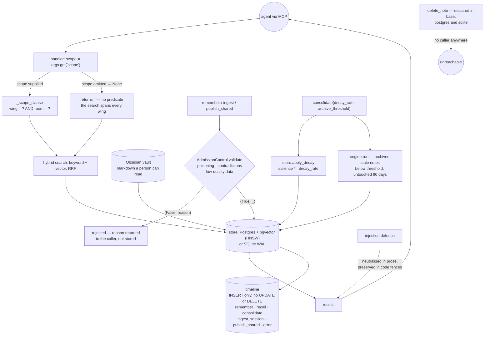

## 1. Executive Summary

Gomaa is a local-first memory engine for coding agents, Apache 2.0, Python, 137
files. It keeps memories as Obsidian Markdown in a vault a person can read and
mirrors them into PostgreSQL with pgvector or a zero-config SQLite WAL database,
with hybrid reciprocal-rank-fusion search, a wikilink graph, salience decay and
an MCP server.

**Two marks: `audit_log` and `negative_eval`.**

The injection defence is the thing to take away, because it is tested in both
directions. `test_prose_tokens_neutralized` asserts that chat-template control
tokens do not survive in prose — `assert "<|im_start|>" not in neutralized` —
and the very next case asserts the same token **must** survive inside a code
fence, with the comment saying so. A neutraliser that stripped everything would
pass the first and fail the second, which is the whole point of writing the
second.

The scope mechanism is the thing to be careful about. Memories carry a `wing`
and a `room`, and both stores compose them through a `_scope_clause` helper —
but the helper opens `if not scope: return "", []`, and the MCP handler passes
`scope=args.get("scope")`. So the boundary is an argument the calling model
supplies, and a model that omits it searches everything. `scope_enforced` is
withheld on exactly that.

## 2. Mental Model

A memory is a Markdown note in a vault, indexed into a store. `wing` and `room`
are the two levels of the hierarchy the README frames as the answer to *"Domain
Cross-Contamination: Research notes, credentials, and task scratchpads
collide."* Salience decays daily; notes that fall below a threshold and have not
been touched in ninety days are archived rather than deleted.

Every wired operation appends a row to a timeline table that is never updated or
deleted.

## 3. Architecture



## 4. Essential Implementation Paths

**The scope helper, twice** — `gomaa/stores/postgres.py:159-169` and
`gomaa/stores/sqlite.py:115-122`. Each store carries its own copy of the same
eleven lines: an empty result for an absent scope, then `wing = ?` and
`room = ?` appended when present. Composed into the query at `postgres.py:312`
and `:367` under `if scope_clause:`. Two implementations of one rule is the
drift risk; they agree today.

**Where the scope comes from** — `gomaa/mcp_server.py:369` and `:379`,
`scope=args.get("scope")`, reaching `core.py:302-318` as
`self.db.search_semantic(emb, top_k, filters, scope=scope)`. The model decides
whether to constrain its own search.

**The admission gate** — `gomaa/security.py:10-20`. `AdmissionControl`
*"validates memory writes before they become persistent. Protects against
poisoning, contradictions, and low-quality data."* `validate` returns
`(bool, reason)`; the reason goes back to the caller and no durable record of
the rejection is written.

**The timeline** — `stores/postgres.py:171-182`, an `INSERT INTO timeline
(action, note_title, query, summary)` with a `created_at` default, read back
newest-first by `get_timeline`. No `UPDATE` or `DELETE` against the table exists
anywhere in the package. Its producers sit in `core.py` at `:210`, `:278`,
`:330`, `:488`, `:550` and `:559`, and the action vocabulary is `remember`,
`recall`, `consolidate`, `ingest_session`, `publish_shared`, `remind` and
`error`.

**Decay, and the parameter that does not apply it** —
`core.py:601` calls `db.apply_decay(decay_rate=...)`, which really multiplies
salience (`sqlite.py:527`, `new_salience = row["salience"] * decay_rate`). Then
`:609` calls the consolidation engine with the same value, where its docstring
says `decay_factor` *"[is] accepted for interface parity with store-level
consolidation; archiving uses archive_threshold."* The comment is accurate: the
store does the decay, the engine does the archiving, and the engine takes the
decay parameter only so the two signatures match.

## 5. Memory Data Model

A note with a title, content, wikilinks, tags, a `wing`, a `room` and a
salience. Salience is a float that decays; there is no status field, no
supersession pointer, no rejected-value record and no validity window. Pinned
notes are *"permanent and immune to decay"* per the CLI flag.

`delete_note` is declared on the store interface and implemented in both
backends, and **nothing calls it**. There is no deletion path from the CLI or
the MCP surface; what the README frames as forgetting is decay plus archival.

## 6. Retrieval Mechanics

Keyword and vector arms fused by reciprocal rank fusion, over Postgres with an
HNSW index or SQLite. A shared-memory store can be searched alongside the
private one for cross-agent fleet sharing.

## 7. Write Mechanics

A write passes admission control, lands in the vault as Markdown and in the
store as a row, and appends a timeline entry. Consolidation runs decay at the
store and archival in the engine.

## 8. Agent Integration

An MCP server, a CLI, a dashboard, adapters for several agent frameworks, and
asynchronous Google Drive sync with its own path-safety tests.

## 9. Reliability, Safety, and Trust

**`audit_log`.** The timeline is insert-only, has no mutation path anywhere in
the package, and is written by every operation that is wired — including
failures, under the `error` action. The one mutation it does not cover,
deletion, is a method nothing calls.

**`negative_eval`** — section 10.

**`scope_enforced` is withheld.** The key is stored, the helper is real and both
stores apply it — and `if not scope` returns no predicate, while the handler
reads the scope from the model's own arguments with `args.get`. The rubric's
test for this mark is *write to project A, query from project B*; here a query
that simply omits the scope returns both. Worth contrasting with the same
night's reading of [Lerim](../lerim/), where an empty scope compiles to `0=1`
and a test is named for it.

**`trust_state` is withheld.** Admission control is a write gate rather than a
state: a rejected write does not become a memory marked untrustworthy, it does
not become a memory at all, and the reason is returned rather than stored.
Salience is a float used for ranking and archival.

**`tombstone`, `bitemporal` and `human_review` are withheld.** Nothing records a
rejected value, there is one clock, and nothing waits for a person.

**One thing a reader should know before deploying.** The scope that separates
*"research notes, credentials, and task scratchpads"* — the README's own
example — is the one an agent can leave out of its query.

## 10. Tests, Evals, and Benchmarks

Twenty-nine test files, several of them security-specific: injection defence,
vault security, Google Drive path safety, graph cycles, and two general security
files. Nothing was installed and nothing was run.

The mark rests on `tests/test_injection_defense.py`, and on the pairing:

```python
def test_prose_tokens_neutralized(self):
    assert "<|im_start|>" not in neutralized
    assert "[INST]" not in neutralized
    assert "​" in neutralized

def test_code_blocks_preserved(self):
    assert "<|im_start|>" in neutralized  # Must be preserved inside code fence
```

The first asserts chat-template control tokens do not survive in prose and that
the zero-width marker replacing them is present. The second requires the same
token to survive inside a code fence, and the comment states the requirement. A
neutraliser that stripped every occurrence would satisfy the first and fail the
second — which is why the second is the assertion that gives the first its
meaning.

`tests/test_vault_security.py` adds the traversal cases from both directions —
`test_path_traversal_wing_blocked` and `test_path_traversal_title_blocked`, so
the scope field and the title are each checked as an attack surface — and
`test_rollback_preserves_existing_file_on_db_error`, which requires a database
failure not to destroy the note already on disk.

No benchmark and no paper.

## 11. For Your Own Build

### Steal

- **Test a sanitiser in both directions in the same file.** The must-not is easy
  and the must-survive is what stops the trivial implementation from passing.
- **Check traversal through every field that reaches a path.** Here both the
  scope name and the title are tested, because both become directory components.
- **Assert that a failed write leaves the existing file alone.** A rollback test
  is cheap and the failure it catches is silent.
- **Log the errors into the same timeline as the successes.** One `error` action
  beside `remember` and `recall` means the record answers what went wrong.
- **Say when a parameter exists only for signature symmetry.** *"accepted for
  interface parity"* saved a reading from reporting an inert knob as a defect.

### Avoid

- **A scope the caller may omit.** `args.get("scope")` plus
  `if not scope: return "", []` is a boundary that holds exactly as often as the
  model remembers it. Default it to the caller's own wing, or refuse the query.
- **The same eleven-line predicate in two stores.** They agree now; nothing
  makes them agree later.
- **Declaring a delete you never wire.** `delete_note` in the base class and
  both backends, with no caller, reads as a capability to anyone who greps for
  one.

### Fit

Take it if you want agent memory you can open in Obsidian with a real Postgres
index behind it, and you control the callers well enough to always pass a scope.
Take `test_injection_defense.py` regardless.

## 12. Open Questions

- `scope` is read from the model's arguments and defaults to nothing. Was an
  implicit default wing considered, or is the unscoped search the intended
  behaviour for a single-user install?
- `delete_note` is implemented twice and called nowhere. Is a forget path
  planned, and would it append a timeline action?
- Admission control returns a rejection reason to the caller. Would a recorded
  rejection be useful, given the README's complaint that humans *"cannot audit,
  correct, or curate what the agent learned"*?
- The timeline has no actor column. With cross-agent fleet sharing, is per-agent
  attribution intended?

## Appendix: File Index

| Path | What it holds |
| --- | --- |
| `gomaa/stores/postgres.py` | `_scope_clause`, the timeline insert, `apply_decay`, `delete_note` |
| `gomaa/stores/sqlite.py` | the second copy of `_scope_clause`, and the salience multiply |
| `gomaa/mcp_server.py` | `scope=args.get("scope")`, where the boundary becomes optional |
| `gomaa/security.py` | `AdmissionControl.validate` and the salience scorer |
| `gomaa/consolidation.py` | the engine, and the docstring explaining which parameter it does not use |
| `gomaa/core.py` | the timeline producers and the consolidate path |
| `tests/test_injection_defense.py` | the neutralisation case and its control |
| `tests/test_vault_security.py` | traversal through wing and through title, and the rollback case |

## Appendix: Recorded Searches

Run from the root of the checkout at the pinned commit.

| Claim | Command | Result at this pin |
| --- | --- | --- |
| An absent scope yields no predicate | read `gomaa/stores/postgres.py:159-161` and `sqlite.py:115-118` | `if not scope: return "", []` in both |
| The scope comes from the model's arguments | `grep -n "scope=" gomaa/mcp_server.py` | `scope=args.get("scope")` at `:369` and `:379` |
| The timeline is never rewritten | `grep -rn "timeline" --include='*.py' gomaa \| grep -iE "UPDATE\|DELETE"` | Nothing |
| Which actions are logged | `grep -n -A3 "log_timeline(" gomaa/core.py` | `remember`, `recall`, `consolidate`, `ingest_session`, `publish_shared`, `remind`, `error` |
| `delete_note` has no caller | `grep -rn "delete_note" --include='*.py' gomaa \| grep -v "def delete_note"` | Nothing |
| Decay is really applied, despite the parity comment | `grep -rn "decay_rate" --include='*.py' gomaa/stores gomaa/core.py` | `core.py:601` calls `apply_decay`, and `sqlite.py:527` does `new_salience = row["salience"] * decay_rate` |
| The licence carries no rider | `head -3 LICENSE`; `grep -n -i 'anthropic\|may not' LICENSE` | Stock Apache 2.0; the only match is the standard compliance clause |

## History

**2026-09-20** — [`00ee124d765e890b73f1d4db14d801d39d1f58b8`](https://github.com/M4F-S/gomaa/commit/00ee124d765e890b73f1d4db14d801d39d1f58b8) — first reading, at 137 files. Screened before reading; nothing was installed and nothing was run. Apache 2.0. Two marks, `audit_log` and `negative_eval`. `scope_enforced` is withheld because the wing-and-room key, though stored and applied by both stores, is read from the calling model's arguments and compiles to no predicate when omitted. One claim was checked and dropped before publication: the consolidation engine accepts a `decay_factor` it does not use, which reads as an inert knob until the docstring and `core.py:601` show the store applies the decay and the engine takes the parameter only for signature symmetry.
