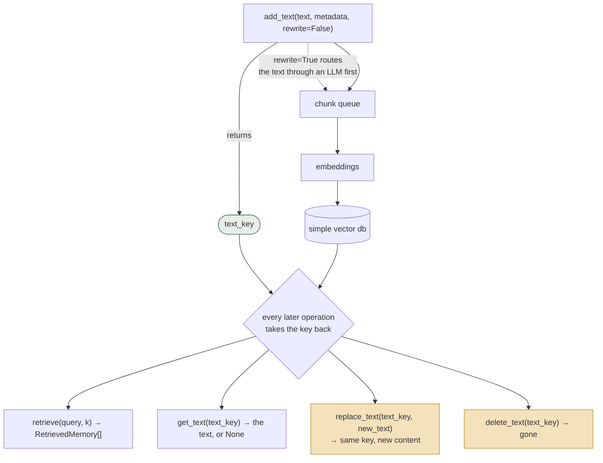
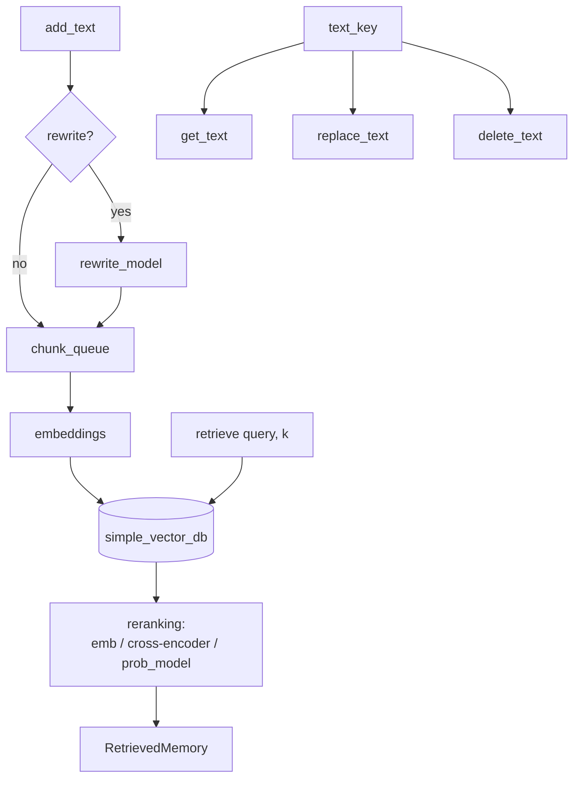

## 1. Executive Summary

GoodAI LTM is a Python library for giving a conversational agent long-term
memory: chunk text, embed it, rerank retrieval with a model you can swap or
train, and hand the results back. It is small — about 8,500 lines — and it has
been **dormant since 28 February 2024**, which is the first thing a reader should
know and not the thing that determines whether it is worth reading.

It is worth reading, for one reason the two 2026 framework contracts in this
atlas make sharp. Its `BaseTextMemory` declares, as abstract methods:

```python
add_text(text, metadata=None, rewrite=False, ...)      -> TextKeyType
replace_text(text_key, text, metadata=None, ...)       -> TextKeyType
delete_text(text_key, ...)                             -> TextKeyType
get_text(text_key)                                     -> Optional[str]
```

Insert returns a key; update and delete take that key back. That is the complete
lifecycle, addressed, on the interface — and it is exactly what
[Google ADK](../adk-python/) omits (three writes, one search, no removal) and
what [AutoGen](../autogen/) cannot express at all, because `MemoryContent` has no
identifier and `clear()` is therefore the only removal verb it can offer. A 2024
library from a small research lab has the correction surface that the 2026
frameworks from Google and Microsoft do not.

The rest is competent and unsurprising: a chunk queue with section separators
bounding chunk expansion, a simple vector database, optional LLM rewriting on
both the write and the query, and a reranking layer with embedding,
cross-encoder and probabilistic variants plus training scripts. There is no scope
key of any kind, no provenance, no trust state, and no tombstone — deletion here
is removal, not rejection.

The strongest thing GoodAI shipped is not in this repository. Its
[companion benchmark](../../benchmarks/) has twenty datasets including
prospective memory and theory of mind, committed result reports, and seven
"forget this" reset messages that it sends and never scores.

## 2. Mental Model

A memory is a **chunk of text with a key**. `add_text` returns a `TextKeyType`;
every subsequent operation on that memory takes the key back.



The `text_key` is the whole interface: a write hands one back and every later
operation takes one. The two highlighted operations are the state machine —
`replace_text` overwrites and `delete_text` removes, both **without trace**.

The state machine has one state. A memory exists, may be replaced in place, and
may be deleted. There is no candidate, no verified, no superseded-with-a-record
and no rejected: `replace_text` overwrites and `delete_text` removes, both
without trace.

That is a deliberate boundary. This is a *store*, not a belief system: it takes
responsibility for chunking, embedding, ranking and addressing, and leaves every
epistemic question to the caller.

`add_separator` is the one structural idea worth naming — it marks a section
boundary that chunk expansion cannot cross, so retrieving a chunk cannot bleed
context from an unrelated document into the result. Small, and the sort of thing
a system adds after a bad retrieval.

## 3. Architecture

A Python library, MIT licence, with no server, no daemon, no MCP surface and no
framework binding. Its consumers are the example agents in `examples/`.



Modules: `goodai/ltm/mem/` (`base.py`, `default.py`, `auto.py`, `chunk.py`,
`chunk_queue.py`, `mem_foundation.py`, `simple_vector_db.py`,
`rewrite_model.py`, `config.py`) and `goodai/ltm/reranking/` (`emb.py`,
`st_ce.py`, `prob_model.py`, `stanford.py`, `auto.py`).

`AutoTextMemory.create(emb_model=…)` is the front door, and the `auto` pattern
recurs — models are named by string and resolved — which is why the examples are
three lines long.

### Deployment and ergonomics

- **What has to run:** nothing. `pip install`, and an embedding model downloads
  on first use.
- **Local and offline: yes**, with a local embedding model and a local reranker.
  `rewrite=True` on either the write or the query calls OpenAI; both are optional
  and default off.
- **No API key is required to store or retrieve.**
- **Persistence is whole-state serialisation** — `state_as_text()` and
  `set_state(state)`, demonstrated in `examples/ltm_agent_persistence.py`. The
  memory survives a process by being written out and read back in its entirety,
  which is fine at the scale this library targets and is not a database.
- **Hand-repairable:** `dump()` writes the store to a stream, so inspection is
  easy; surgical repair is not.

## 4. Essential Implementation Paths

**Interface.** `goodai/ltm/mem/base.py` — `BaseTextMemory` with `add_text`
(121), `replace_text` (~140), `delete_text` (154), `get_text` (~164),
`retrieve_multiple` (187), `retrieve` (191), `add_separator`, `dump` (212),
`state_as_text` (224), `set_state` (232), plus `RetrievedMemory` and
`remove_overlaps` (79).

**Default implementation.** `goodai/ltm/mem/default.py` — `delete_text` at 158;
the chunk queue and vector database are wired here.

**Chunking.** `chunk.py` and `chunk_queue.py`; section separators bound chunk
expansion. `mem_foundation.py` carries `remove_duplicates_and_overlaps` (59) —
deduplication at *retrieval* rather than at write.

**Rewriting.** `rewrite_model.py` — an ABC plus an OpenAI implementation with
`DEFAULT_QUERY_PROMPT_TEMPLATE`, used for both stored-text rewriting
(`add_text(rewrite=True)`) and query rewriting (`retrieve(rewrite=True)`).

**Reranking.** `goodai/ltm/reranking/` — embedding similarity, a
sentence-transformers cross-encoder, and a probabilistic matching model, with
`scripts/train_matching_model.py` and `scripts/train_emb_model.py` to train them.

**Examples that are documentation.** `examples/delete_memory.py` deletes both by
key and by query result; `rewriting.py`, `custom_reranker.py`,
`ltm_agent_persistence.py`, `ltm_agent_with_wiki.py`, `wiki_retrieval.py`,
`ltm_agent_shopping_list.py`, `dump_mem.py`.

**Tests.** `goodai/ltm/mem/tests/`.

## 5. Memory Data Model

A chunk carries text, optional `metadata: dict`, a timestamp and a key. The
omissions are uniform:

- **No scope of any kind.** Searching `goodai/` for `scope` or `user_id` returns
  nothing. There is no user, session, project, agent or tenant concept — a
  `TextMemory` instance *is* the scope, and separating two users means
  constructing two memories.
- **No provenance.** `metadata` is a free dict with no conventions, and nothing
  in the library reads it.
- **No confidence, no state, no validity interval, no version chain.**
  `replace_text` reuses the key and discards what was there.

**The key is the whole contribution.** Because `add_text` returns an address and
every mutating operation takes one, this library can express "change *that*
memory" and "remove *that* memory" — the two sentences ADK cannot say and AutoGen
cannot form. Nothing else in the data model is notable; this one thing is, and it
costs a return value.

## 6. Retrieval Mechanics

`retrieve(query, k, rewrite=False)` and `retrieve_multiple(queries, k, …)`:
embedding retrieval into the vector database, then a reranker, then
`remove_overlaps` / `remove_duplicates_and_overlaps` so adjacent chunks are not
returned as separate results.

Two things worth noting.

**The reranker is a first-class, swappable, trainable component.** Most systems
here either have no reranker or hardcode one. This is an interface with three
implementations and two training scripts, and `examples/custom_reranker.py`
exists to show you how to bring your own. For a library whose job is ranking,
putting the ranking decision behind a trained model rather than a weighted sum is
the right shape.

**Query rewriting is opt-in and off by default.** `retrieve(rewrite=True)` sends
the query through an LLM first. Making the expensive path a flag, defaulted off,
is [gate the expensive path](../../patterns/gate-the-expensive-path/) applied
honestly — the library does not spend tokens unless asked.

Failure modes are the ordinary ones: a single embedding space, no metadata
filter, no recency weighting, and no scope filter to apply before ranking because
there is no scope.

## 7. Write Mechanics

`add_text` is synchronous and, by default, model-free: chunk, embed, store.
`rewrite=True` routes the text through an LLM first, which is the only place the
library forms anything.

There is **no deduplication at write** — duplicates are handled at retrieval by
overlap removal — **no conflict detection**, and **no consolidation**. Two
contradictory `add_text` calls produce two chunks and retrieval may return both.
Correction is the caller's job, and the library's contribution is that the caller
*can* do it: hold the key, call `replace_text` or `delete_text`.

Nothing filters input: no secret detection, no injection guard, no notion of an
untrusted source.

### Operational cost

- **Writes are cheap and synchronous** — one embedding pass, or an LLM call with
  `rewrite=True`.
- **Lag before a memory is retrievable: none.** The write completes into the
  index.
- **No background pass exists**, so nothing rewrites the store.
- **On the read path** `k` bounds results; there is no token budget, and chunk
  expansion is bounded only by section separators.
- **Persistence is whole-state**, so saving is O(store) with no incremental
  write.

## 8. Agent Integration

There is no integration surface — no MCP, no tool schema, no framework adapter,
no server. You import it. The `examples/` agents show the intended shape: call
`retrieve` before answering, `add_text` after.

That is a legitimate position for a library, and it is also part of why this
codebase did not become the thing developers reached for. By 2026 the frameworks
had shipped their own provider contracts and the integration question had been
decided elsewhere — which is what makes the comparison in §1 worth drawing, since
the contracts that won express less than this one does.

## 9. Reliability, Safety, and Trust

**No trust model, and — unlike the framework contracts — no pretence of one.**
`metadata` is a dict nothing reads. There is no provenance, no confidence, no
verification state, and no way to mark a chunk as untrusted. For a store that is
a defensible boundary, and it means the library cannot help with any of the
failures this atlas is organised around.

**Deletion is removal, not rejection.** `delete_text` takes the chunk out. There
is no record it existed, no tombstone, and nothing prevents the same text being
added again a second later under a new key. So the lifecycle is complete in the
CRUD sense and absent in the correction sense — a distinction this atlas exists
to draw. Being able to delete a memory is not the same as being able to reject a
value, and this library is the clearest illustration of the difference, because
it has the first entirely and the second not at all.

**No scope means no multi-tenancy story.** One `TextMemory` per user is the
answer, and it is the caller's to implement. The one identifier in the tree is
`session_id`, a uuid the agent mints per session — and its two uses are seeding
the default timestamp function and labelling a prompt callback. It never reaches
a retrieval, which is the sharpest form of "no scope": the identifier exists and
is spent on a clock.

**One knob has two defaults.** `redundancy_overlap_threshold` is `0.75` in
`goodai/ltm/mem/config.py:108` and `0.6` in `goodai/ltm/agent.py:105`, where the
agent copies its own value into the memory config it builds. So the filter that
earns this report's one capability mark behaves differently depending on whether
you construct the memory directly or let the agent do it, and nothing reconciles
the two numbers.

**Dormancy is the operational risk.** Two and a half years without a commit,
against a dependency surface including embedding models, sentence-transformers
and the OpenAI client. Nothing here is broken by that on its own; everything here
is exposed to it.

## 10. Tests, Evals, and Benchmarks

Unit tests live under `goodai/ltm/mem/tests/`, and **this report's first reading
said no test asserts that particular material must not be retrieved. That was
wrong, and the mark is now carried.** The pair sits at the top of `test_mem.py`:

```python
def test_no_redundancy(self):
    config.redundancy_overlap_threshold = 0.5
    ...
    r_memories = mem.retrieve(query, k=3)
    for i ...:  for j in range(i + 1, len(r_memories)):
        cs = get_correctness_score(tokenizer, p1, p2)
        assert cs <= 40
```

`test_redundancy_allowed` is the same text, the same query and the same `k`, with
the threshold at 1.0 and the assertion inverted — `match_count > 0` for pairs
scoring 50 or more. So one case asserts that material too similar to something
already returned does not appear beside it, and its neighbour proves the
arrangement returns exactly that material when the filter is off. A negative
retrieval assertion and its control, twelve lines apart, in the first sixty lines
of the file the first reading said contained none.

The honest limit, recorded in the evidence line: the exclusion is a property of
the result *set* rather than a named value or a scope boundary, so it is the
thinnest of the three shapes this mark covers.

Two other tests are near-misses worth naming rather than counting.
`test_separators_and_replacement` replaces a fact with unrelated text and then
asserts the retrieved passage carries `metadata['replacement']` — identity of the
survivor, but it never queries the replaced text to check the original is gone.
`test_delete_all` deletes every key and asserts `mem.is_empty()`, which is a
statement about the store rather than about a query.

The evaluation story is the interesting one and it is in a **separate
repository**. `GoodAI/goodai-ltm-benchmark`, read for this atlas at
[`188e7618413775f1ce783763d5ee0b5ccd4c31c9`](https://github.com/GoodAI/goodai-ltm-benchmark/commit/188e7618413775f1ce783763d5ee0b5ccd4c31c9)
and described on the [benchmarks page](../../benchmarks/), has twenty datasets
including prospective memory, theory of mind and delayed recall; committed HTML
result reports for GPT-4 and Claude 2.1; and seven datasets that instruct the
agent to forget something and never check whether it complied.

Shipping a benchmark suite alongside a memory library is rare enough to credit
plainly. Very few systems in this atlas publish an evaluation harness at all, and
almost none publish one whose task variety exceeds conversational QA.

## 11. For Your Own Build

### Steal

- **Return a key from your write, and take it back on update and delete.** That
  is the whole lesson, it costs one return value, and its absence is what leaves
  two much larger 2026 frameworks unable to express a targeted correction.
- **Make the reranker swappable and trainable.** If ranking is your product, the
  ranking decision should not be a weighted sum buried inside a search function.
- **Section separators that bound chunk expansion** — a cheap structural guard
  against a retrieved chunk dragging in text from an unrelated document.
- **Default the LLM paths off.** Both rewriting paths are opt-in flags, so the
  library has a zero-token mode that actually works.

### Avoid

- **Whole-state serialisation as your persistence model.** Fine until the store
  is large, and then it is the only thing you think about.
- **Treating delete as correction.** Removing a chunk leaves nothing that stops
  the same text arriving again. If what you need is "this was wrong", a key-based
  delete is necessary and not sufficient.
- **Deferring scope to the caller in a library people will multi-tenant.** "One
  instance per user" holds only until someone puts it behind a service.

### Fit

Read this for the interface, not to run it. It is the cleanest demonstration in
the atlas that a memory abstraction's first job is to give memories addresses,
and the relevant part is two pages long.

Do not adopt it. No commit since 28 February 2024, no scope key, and persistence
by whole-state serialisation; the ecosystem moved to framework-mounted providers
and hosted services and this library did not follow. If you are choosing
something to run, choose something maintained — and then check whether its
interface can say "delete that one", because the odds are it cannot.

The people who should still pull the repository are anyone designing a provider
contract. Diff `BaseTextMemory` against `BaseMemoryService` and `Memory`, and the
missing methods are obvious in about ninety seconds.

## 12. Open Questions

- **Is the project retired or paused?** Nothing in the repository says. The
  benchmark repository was still being updated in December 2024, which suggests
  the evaluation work outlived the library.
- **Is `TextKeyType` stable across `state_as_text` / `set_state`?** If keys are
  not preserved across serialisation then the update and delete surface is
  process-scoped, which would substantially weaken the one advantage this library
  holds over the frameworks. Not traced.
- **Does `replace_text` preserve the original timestamp or reset it?** It matters
  for any recency weighting the caller applies.
- **What does `prob_model` reranking model**, and how does it compare with the
  cross-encoder on the companion benchmark? Training scripts ship; comparative
  numbers were not found here.

## Appendix: File Index

**Interface and data model**

- `goodai/ltm/mem/base.py` — `BaseTextMemory`, `RetrievedMemory`,
  `remove_overlaps`
- `goodai/ltm/mem/auto.py` — `AutoTextMemory.create`
- `goodai/ltm/mem/config.py`

**Implementation**

- `goodai/ltm/mem/default.py` — `delete_text` (158)
- `goodai/ltm/mem/chunk.py`, `chunk_queue.py`
- `goodai/ltm/mem/mem_foundation.py` — `remove_duplicates_and_overlaps` (59)
- `goodai/ltm/mem/simple_vector_db.py` — `remove_ids` (71)
- `goodai/ltm/mem/rewrite_model.py`

**Reranking**

- `goodai/ltm/reranking/` — `emb.py`, `st_ce.py`, `prob_model.py`,
  `stanford.py`, `auto.py`
- `scripts/train_matching_model.py`, `scripts/train_emb_model.py`

**Examples**

- `examples/delete_memory.py`, `rewriting.py`, `custom_reranker.py`,
  `ltm_agent_persistence.py`, `ltm_agent_with_wiki.py`,
  `ltm_agent_shopping_list.py`, `dump_mem.py`

**Tests**

- `goodai/ltm/mem/tests/`

## History

**2026-09-17** — [`22ca10c21771d0192d550517cb06c3aab6e602aa`](https://github.com/GoodAI/goodai-ltm/commit/22ca10c21771d0192d550517cb06c3aab6e602aa) — re-read at the same commit, still the tip of the default branch; the last commit upstream is 28 February 2024, whose message is *"One more unit test for testing replace()"*. Nothing could have moved, so this reading audited the first one. Screened again: no auto-run surface, one build-time execution path (`setup.py`), no unpinned manifest, nothing inside the cooldown; nothing was installed and nothing was run. MIT, 7,687 lines of Python.

**`negative_eval` is earned, and the first reading's sentence that no such test exists is withdrawn.** `test_no_redundancy` sets `redundancy_overlap_threshold = 0.5`, calls the real `mem.retrieve(query, k=3)` and asserts every pair of returned passages scores at most 40 on token overlap; `test_redundancy_allowed`, twelve lines below it, runs the identical setup at threshold 1.0 and asserts at least one pair scores 50 or more. A must-not on the retrieval result and its own control, in the first sixty lines of the file the first reading described as containing neither. The searching error was the same one this session found three times: a survey for `assert not` and `not in` over a suite whose negative assertions are `assert cs <= 40` and `assertIsNone`.

**Two findings about the code.** `redundancy_overlap_threshold` has two defaults — `0.75` in `mem/config.py` and `0.6` in `agent.py`, which copies its own value into the memory config it builds — so the filter behind this report's one mark behaves differently depending on which entry point constructed the store. And the only identifier in the tree, the agent's per-session uuid, is spent on seeding the default timestamp function and labelling a prompt callback; it never reaches a retrieval, which is a sharper way to say "no scope" than the absence of the word.

Everything else held: the keyed lifecycle is abstract on the base interface — `add_text`, `replace_text`, `delete_text`, `get_text` — deletion is removal rather than rejection, `metadata` is a dict nothing reads, and the benchmark suite lives in a separate repository. `stack_source` moves from `seeded` to `reviewed`.

**2026-07-29** — [`22ca10c21771d0192d550517cb06c3aab6e602aa`](https://github.com/GoodAI/goodai-ltm/commit/22ca10c21771d0192d550517cb06c3aab6e602aa) — first reading. Screened before reading; nothing was installed or run.
