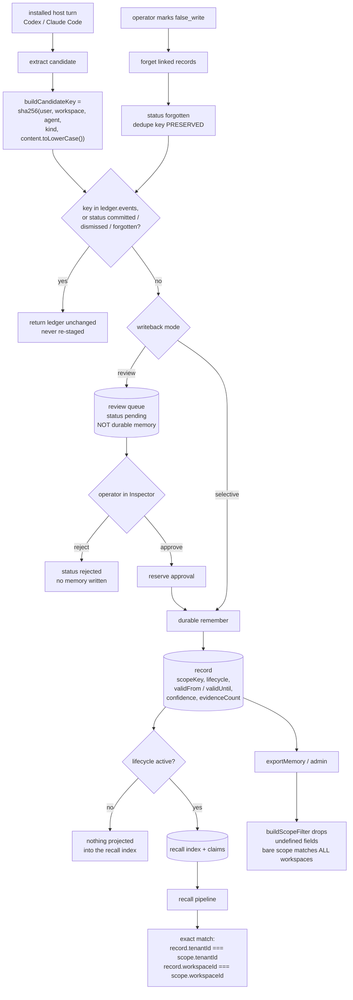

## 1. Executive Summary

GoodMemory is a memory layer for chat apps and for coding agents installed in a
host — Codex and Claude Code — published under MIT at version 0.8.0, with 1,131
commits since 23 March 2026 across 163,939 lines of TypeScript in `src/` and
392,190 lines across 807 test files. Its README is explicit about what it is
not: "not an LLM, agent framework, vector database, or generic RAG system", but
"the product memory layer between your app or installed agent host and the
model runtime".

Three mechanisms here are better than the category norm.

The first is a **tombstone keyed on content**. A writeback candidate's key is
`sha256` over the user, workspace, agent, kind and lower-cased content, so it
identifies the statement rather than a row. When a person marks a written
memory a false write, the ledger records `forgotten` and — this is the part
that matters — keeps the key in `ledger.events`. Every later propose checks
that set first and returns the ledger untouched. The same sentence extracted
again from a later session never comes back.

The second is a **review mode that holds candidates outside memory**. In review
mode the installed host extracts candidates and writes none of them; they sit
in a queue for an operator to approve or reject in the Inspector. Approval is
reserved before the durable write so two concurrent approvals cannot both
commit, a failed write releases the reservation, and a stale interrupted
approval requires operator recovery rather than retrying itself.

The third is **evidence discipline about its own numbers**. Every figure in the
README's public claims table is backed by a committed declaration in
`benchmark-claims/` recording the exact command, commit, package version,
judge, dataset source and licence, and a gate refuses a README number whose
declaration does not pass. The declarations distinguish a strict deterministic
track from a comparable track that re-judges *the same stored answers* under
the benchmark's official protocol, and they carry their own caveats — the
LoCoMo file records a "heuristic provider-variance estimate" and warns that
external headline scores "are references, not controlled head-to-head
measurements". That is the traceability habit this atlas finds missing far more
often than it finds it.

What does not hold together as well is scope. There are two fences and they do
not agree. On the recall path, `filterRecordsByDefaultRecallScope` requires
`record[key] === scope[key]` for tenant and workspace, so a scope carrying only
a `userId` matches only records that have no tenant and no workspace. On the
admin and export path, `buildScopeFilter` drops undefined fields before
querying, so the same bare scope matches every tenant and every workspace that
user has. `exportMemory` is a public API method. The result is that the scope
GoodMemory's own isolation scenario is built to protect — workspace — is
enforced exactly on one read path and widened by omission on another.

Six marks: `tombstone`, `human_review`, `trust_state`, `scope_enforced`,
`bitemporal`, `negative_eval`.

## 2. Mental Model

A **scope** is five fields: `userId` (required, non-empty, or `normalizeScope`
throws), `tenantId`, `workspaceId`, `agentId`, `sessionId`. `scopeToKey` joins
them with `::` into the key stored on every record.

A **record** is one of six typed shapes. Beyond its content it carries a
`confidence`, an `evidenceCount`, a `MemorySource` (`explicit`, `inferred`,
`import` or `confirmed`, with the instant it was extracted), a `lifecycle`, and
optionally a validity interval and a TTL.

A **lifecycle** is `active`, `superseded` or `inactive`, and the transitions are
a declared table: active may go anywhere, superseded may only go to inactive,
inactive may return to active. `transitionLifecycle` throws on anything else.

A **claim** is a projection of a record into a subject-predicate-object slot
with its own validity interval. Claims are append-only: `queryClaims` returns
the current value per slot, `queryClaimHistory` returns everything.

A **candidate** is a proposed writeback from an installed host, identified by
the hash of its own content, and living in one of two files under the install
root — the review queue if the host is in review mode, the audit ledger once it
has been staged.

## 3. Architecture

| Area | Role |
| --- | --- |
| `src/domain` | The record, scope, provenance, temporal and taxonomy types — the smallest place to read the model |
| `src/storage` | One document-store port with SQLite, Postgres and in-memory implementations; `repositories.ts` holds `listByScope` and `buildScopeFilter` |
| `src/remember` | Extraction, rules, profiles and the write handlers |
| `src/recall` | The retrieval pipeline: routing, BM25, fusion, decomposition, iterative recall, reranking, selection, context assembly, the evidence ledger, and `projections/` for claims |
| `src/install` | Installed-host integration: the writeback runtime, the audit ledger, the review queue, host config and hooks |
| `src/api` | `createGoodMemory`, the public operations, admin and governance ops |
| `src/governance`, `src/policy`, `src/verify` | Write policy hooks, page artifacts, verification |
| `apps/inspector-web` | The local React Inspector where an operator reviews candidates |
| `benchmark-claims`, `REPRODUCING.md`, `scripts` | The committed claim declarations and the gate that enforces them |

## 4. Essential Implementation Paths

- `src/domain/scope.ts:18-42` — `normalizeScope` and `scopeToKey`.
- `src/recall/policy.ts:15-27` — the exact-match recall scope guard.
- `src/storage/repositories.ts:279-288` — `buildScopeFilter`, the subset filter.
- `src/install/hostWritebackRuntime.ts:1816-1833` — `buildCandidateKey`.
- `src/install/hostWritebackAuditLedger.ts:144-156` — the refusal on a known key.
- `src/install/hostReviewQueue.ts:11-49` — the review queue's contract.
- `src/recall/generalizedSelection.ts:35-48` — `isFactVisibleAt`.
- `src/domain/provenance.ts:23-40` — the lifecycle transition table.

## 5. Memory Data Model

Six record types share a spine: scope fields, `confidence`, `evidenceCount`,
`source`, `lifecycle`, `supersededBy`, `updatedAt`. Facts and claims add
validity: `validFrom`, `validUntil`, `expiresAt`. `MemorySource.method`
separates what the user said (`explicit`), what the system inferred
(`inferred`), what arrived through import, and what a person confirmed — a
four-way distinction most stores in this corpus collapse into one boolean.

Claim projections are the interesting layer. A claim is a slot value with a
validity interval, a polarity and a modality, and the projection runtime keeps
every version: a replacement closes the earlier value's interval when it
becomes valid, and a value ingested late but valid earlier is bounded on
arrival rather than treated as current. `queryClaims` exposes the head;
`queryClaimHistory` exposes the lot.

## 6. Retrieval Mechanics

Recall is a pipeline, not a query. A router picks a retrieval profile,
lexical and vector lanes fuse, a decomposer splits multi-part questions,
iterative recall re-queries, a reranker reorders, and selection fills a token
budget. Two filters run before any of it: the exact-match scope guard, and the
lifecycle-and-validity gate in `isFactVisibleAt`, which drops anything not
`active`, anything expired, and anything whose `validFrom` is after the
caller's reference instant.

The reference instant is a caller argument throughout, not `Date.now()` buried
in a helper, which is what makes the temporal tests possible to write.

## 7. Write Mechanics

`remember` runs configurable extractors and rules. For installed hosts the
writeback runtime has four modes — `off`, `observe`, `review`, `selective` —
and only the last two can produce durable memory without a person. The ledger
is written before the durable write and updated after, so a crash between them
leaves a `pending` event rather than an untracked write, and the recovery path
requires an operator rather than retrying on its own.

Everything stored from a transcript goes through `containsSensitiveCredential`
and a bounded preview; the review queue's own comment says stored content is
"the bounded, secret-redacted candidate *statement* — never the raw
transcript".

## 8. Agent Integration

`goodmemory setup` installs hooks for Codex and Claude Code, `goodmemory
status` reports what is wired, and the MCP server is read-only unless writeback
is opted into. Package exports cover the library, an AI SDK adapter, a host
adapter and an HTTP surface. The Inspector is a local web app, which is where
review actually happens.

## 9. Reliability, Safety, and Trust

**The two scope fences do not implement the same rule.** This is the finding.
`filterRecordsByDefaultRecallScope` compares tenant and workspace with `===`,
which means an undefined field on the scope matches only an undefined field on
the record. `buildScopeFilter` builds its query from
`Object.entries({...}).filter((entry) => entry[1] !== undefined)`, which means
an undefined field is simply not asked about. Both are reasonable in
isolation; together they mean a caller holding a user-only scope sees almost
nothing through `recall` and everything through `exportMemory`. Nothing here
crosses a user boundary — `userId` is required and always compared — so this is
a widening within one user's memory, not a leak between people. But workspace
separation is the thing the project's own scenario test exists to prove, and
the export path does not hold it.

**The lifecycle filter is spread across the pipeline, not held at the store.**
`listByUser` returns retired rows untouched, and a committed test asserts
exactly that: a fact demoted with `demotionReason: "ttl_expired"` still comes
back from the repository. The filtering happens in `isFactVisibleAt`, at four
seams in `contextBuilder`, in `generalizedSelection`, and at projection time.
That is defensible — the projection gate means a superseded record never enters
the recall index at all — but it is a rule enforced in many places rather than
one, and a new read surface inherits none of it by default. `listByUser` has no
caller in `src`, `apps` or `clients` at this pin; it is reachable only through
the repository port.

**The tombstone and the audit ledger are scoped to installed-host writeback.**
Both files live under the install root and both are keyed to host candidates. A
`remember` call made directly through the library has no equivalent refusal
list and no equivalent ledger, so `audit_log` is withheld: the record does not
cover all write paths. The claim projection's append-only history is the
closest thing on the library side, and it records claim revisions rather than
mutations.

## 10. Tests, Evals, and Benchmarks

807 test files, more lines of test than of source. The ones that carry the
marks are named in the frontmatter. Three habits are worth copying.

The scenario fixtures in `tests/scenarios/behavior-fixtures.ts` express an
expectation as `hasEntries` beside `lacksEntries` on the same assembled block,
so a positive control and a must-not live in one declaration and cannot drift
apart.

`tests/unit/inspector-candidate-review.test.ts` tests the *failure* modes of
approval — a concurrent replay, a durable write that fails, a stale interrupted
approval, a candidate from another scope — rather than only the happy path.

And the benchmark claim gate is a test over the README: it cross-checks the
public tables in both languages against the committed declarations, so a number
cannot be edited into the prose without its evidence.

## 11. For Your Own Build

### Steal

- **Key the tombstone on the content, not the row.** Hashing scope, kind and
  normalised content means a re-extraction of the same sentence collides with
  the thing the user already rejected. A row id would not.
- **Preserve the dedupe key through the forget.** The subtle half is that
  deleting the memory must not delete the memory of having rejected it; the
  test that pins this is named for exactly that property.
- **A review mode that writes nothing.** Candidates that live outside memory
  until a person acts are a different guarantee from candidates written and
  later approved, and the difference shows up the moment review is abandoned.
- **Reserve before the durable write.** Approval reservation plus release on
  failure plus operator recovery on a stale reservation is the full set, and
  most review queues in this corpus implement none of the three.
- **A gate that refuses an undeclared number.** `benchmark-claims/` with a
  strict track and a re-judged comparable track is the strongest answer to
  benchmark traceability this atlas has read.

### Avoid

- **Two scope filters with different semantics on the same record shape.** If
  one path treats an absent field as "must be absent" and another treats it as
  "don't care", the difference will be discovered by whoever calls the second
  one with a scope built for the first.

### Fit

Reach for this if you are adding memory to an installed coding agent and want
the write path gated on a person, with rejections that stick. Look elsewhere if
you need one uniform scope rule across every read surface, or a mutation audit
covering library writes and not only host writeback.

## 12. Open Questions

- Should `buildScopeFilter` adopt the recall guard's exact-match semantics, or
  should `exportMemory` require the caller to state the scope fields it intends
  to cross? Either resolves the asymmetry; the current pair does not.
- Is `listByUser` still needed? It has no caller outside tests and is the one
  repository read with no scope beyond the user.
- The tombstone is per installed host, under the install root. What happens to
  a rejection when the same user works from a second machine?

## Appendix: File Index

| Path | What to read it for |
| --- | --- |
| `src/domain/scope.ts` | The scope model and its canonical key |
| `src/domain/provenance.ts` | The lifecycle states and the transition table |
| `src/recall/policy.ts` | The exact-match recall scope guard |
| `src/storage/repositories.ts` | `listByScope`, `listByUser` and `buildScopeFilter` |
| `src/install/hostWritebackAuditLedger.ts` | The tombstone and the writeback audit |
| `src/install/hostReviewQueue.ts` | The review queue's contract, in its own words |
| `src/recall/generalizedSelection.ts` | Lifecycle and validity at read time |
| `src/recall/projections/` | Claim projection, history and revision visibility |
| `REPRODUCING.md`, `benchmark-claims/` | The claim declarations and the gate |
| `tests/scenarios/behavior-fixtures.ts` | `hasEntries` beside `lacksEntries` |

## History

**2026-09-16** — [`416c15b479e189039709468fb319bb50c0fbe50e`](https://github.com/hjqcan/GoodMemory/commit/416c15b479e189039709468fb319bb50c0fbe50e) — first reading, at a commit dated 14 September 2026. Screened before opening, from a shallow clone: thirty-six files, one auto-run surface, one build-time execution point, eleven unpinned surfaces, seventeen dependency files inside the cooldown, and `AGENTS.md` and `CLAUDE.md` read as data. Nothing was installed, built or run.
