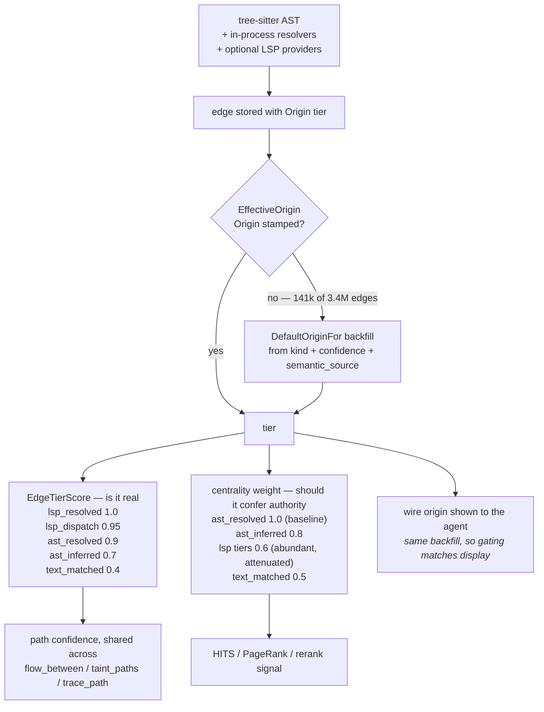

## 1. Executive Summary

Gortex is a code-intelligence engine in Go — roughly 960,000 lines, Apache-2.0,
3,814 commits and 30 contributors since 6 April 2026 — that parses 257
tree-sitter grammars into a persistent knowledge graph and serves it over MCP,
a CLI and a web UI as a single static binary.

The idea this atlas is here for is on the edges. Every edge in the graph carries
an `Origin`: one of `lsp_resolved`, `lsp_dispatch`, `ast_resolved`,
`ast_inferred` or `text_matched`. That is not a confidence score, it is a record
of **how the claim was established** — a compiler told us, a dispatch table told
us, the syntax tree was unambiguous, a type was inferred, or two strings looked
alike. `EdgeTierScore` maps the ladder to a 0–1 weight, and it is deliberately
the *one* shared mapping, so that a path confidence returned by `flow_between`,
`taint_paths` and `trace_path` means the same thing in all three.

Then it does something better than that, and it is the thing worth taking away.
For graph centrality — HITS and PageRank over the call graph — the tiers are
weighted **differently**, and the most trustworthy tier is *discounted*. The
reasoning is written out: LSP providers materialise a dense layer of
framework-wiring and interface-dispatch edges, and *"counting every such edge at
full weight inflates the apparent centrality of utility and framework code over
genuine domain authorities."* So `ast_resolved` becomes the 1.0 baseline,
`text_matched` sits at 0.5 as a possible false positive, and the abundant
compiler-grade tier is pulled down to 0.6.

That is a distinction most systems in this atlas never make: **how much you
believe a fact and how much it should count toward ranking are different
quantities**, and the most reliable evidence can be the most misleading when it
is also the most plentiful. A single confidence number cannot express it.

The provenance model also survives contact with an old index, which is rarer
than it sounds. `EffectiveOrigin` exists because reading `e.Origin` raw is
*"almost always a bug"*: most stored edges predate per-provider stamping, and the
comment supplies the count — in a 3.4-million-edge graph, 141,000 resolved
`calls` edges carry no `Origin` at all. Since `OriginRank` maps the empty string
to 0, below even `speculative`, a raw read sorts the single largest bucket of
call edges beneath the weakest tagged tier. `EffectiveOrigin` backfills from edge
kind, confidence and semantic source — and, critically, it is the *same* backfill
that stamps the wire `origin` shown to the agent, so a gating decision made in
the engine matches the provenance the agent was shown for that edge.

The weak seam is measurement, and it is a mirror image of the one in
[`repowise`](../repowise/), read the same day. Gortex ships its ground truth
*inside the repository* — `bench/baselines/groundtruth.json` and `queries.json`
are right there, which repowise's are not. But that ground truth is **ten
queries whose expected file paths were hand-written against Gortex's own
repository**, the timings come from *"a single operator's machine"*, and the one
surface that would be graded by somebody else — SWE-bench, whose harness is fully
built and shipped in `eval/` and `cmd/gortex/eval_swebench.go` — has a results
table in which every cell reads `TBD`. The README's *"Reproducible benchmarks"*
is true; what is reproducible is a self-graded measurement.

## 2. Mental Model

Gortex treats a codebase the way a compiler treats a translation unit and then
keeps the result. Parse to an AST, resolve what can be resolved, and store the
resolution *together with the reason it was possible*.

The key move is that resolution quality is **first-class and persisted**, not a
transient property of the parse. The store comment makes the comparison
explicit: Gortex persists the resolved target *and* its five-tier provenance,
where a competitor persists only the target. Once the tier is on the row, three
different consumers can each decide what to do with it — a ranker can score it, a
query can refuse anything below a floor via `MeetsMinTier`, and a UI can collapse
it to `lsp` / `ast` / `heuristic` via `ResolvedBy` without inventing its own
thresholds.

The second idea is that the same ladder is read through two different lenses.
Confidence asks *is this edge real*. Centrality attenuation asks *should this
edge confer authority*. The answers diverge precisely where evidence is both
strong and abundant.

## 3. Architecture

`internal/graph` holds the node, edge and store model and is where the
provenance work lives. `internal/indexer` walks and parses; `internal/search`
carries a trigram index, an FTS normalisation layer, a vector arm, a rerank
stage and a hybrid combiner behind a swappable backend. `internal/dataflow`
implements flow and taint analysis with per-edge provenance threaded through.
`internal/pathguard` confines filesystem access. `internal/lsp*` and
`internal/serverstack` manage language servers and embedders.

Storage is SQLite through the pure-Go `modernc.org/sqlite` driver, which is what
lets the whole thing ship as a static binary with no dependency chain — a real
distribution decision with a visible cost in query surface.

## 4. Essential Implementation Paths

`internal/graph/edge.go` is the file. Five constants define the ladder;
`OriginRank` orders it; `MeetsMinTier` turns it into a query filter with the
explicit note that an empty filter always passes and an empty origin fails any
non-empty filter; `ResolvedBy` collapses it for display; `EdgeTierScore` maps it
to confidence; the `ProvenanceWeight*` constants map it, differently, to
centrality; and `EffectiveOrigin` is the accessor everything is supposed to use.

The docstring on `EffectiveOrigin` is the best piece of hazard documentation in
this reading. It states the bug (`e.Origin` raw is almost always wrong), gives
the magnitude (141k of 3.4M edges unstamped), explains the mechanism (empty
string ranks below `speculative`, so the largest bucket sorts last), and closes
the loop that matters (the backfill is also what the agent is shown, so gating on
`EffectiveOrigin` keeps the decision consistent with the displayed provenance).
A nil edge reports the trusted baseline rather than the weakest tier.

`internal/pathguard/pathguard.go` is the second path, and it separates its two
halves on purpose: admission keeps escaping symlinks out of the corpus so every
downstream reader inherits the fix, and each content sink re-checks so a corpus
built some other way — an older on-disk index, a caller assembling its own file
list — still cannot serve out-of-repository bytes. Confinement is relative to
*"the ONE root that owns the file, never to the union of every tracked root: repo
A must not read repo B's files."*

## 5. Memory Data Model

Nodes carry an id, kind, name, file path and a `RepoPrefix`. Edges carry a kind,
a numeric confidence, an `Origin` tier, a coarse `Tier` label and a `Meta` map in
which `semantic_source` participates in the backfill. Enrichment rows — churn,
coverage, release blame — hang off node ids and carry their own `RepoPrefix`.

`EdgeProvenanceUpdate` exists as a distinct update shape, which is the schema
admitting that provenance can be revised without the edge being rewritten — for
instance when an LSP provider comes online after an initial AST-only pass and
lifts an `ast_inferred` edge to `lsp_resolved`.

## 6. Retrieval Mechanics

A trigram searcher, an FTS arm with a normalisation mode, a vector arm and a
rerank stage, combined by a hybrid searcher behind a swappable backend interface,
with `equivalence.go` and a suite of equivalence tests holding the backends to
the same answers. Structural questions are graph traversals, and the traversal
results carry a path confidence computed from `EdgeTierScore` over the edges
walked — which is why the shared mapping matters: a taint path and a call path
that both report 0.7 mean the same thing about their weakest link.

`MeetsMinTier` is the abstention lever. A caller can demand `ast_resolved` or
better and receive nothing rather than a text match, which is the shape this
atlas keeps asking for — a retrieval path that can return fewer results on
purpose.

## 7. Write Mechanics

Batch indexing through tree-sitter, lifted by in-process resolvers and, where
available, by real language servers. A watcher drives incremental reindexing.
Deletion is by disappearance: `DeleteFileMtimes` and `DeleteFileMetasByFiles`
prune paths that no longer exist, scoped by `repoPrefix`.

There is no record of a *wrong* edge. If a resolver produced a bad
`text_matched` edge and a later pass produces the correct `lsp_resolved` one, the
graph ends up with the right answer and no memory of the wrong one — which is
correct for a derived index and is why the tombstone mark does not apply. The
distinction worth holding is that Gortex's graph is *derived*, so re-deriving is
a complete repair; a system storing asserted claims cannot repair itself that way,
which is why the rest of this atlas argues about tombstones and this report does
not.

## 8. Agent Integration

An MCP server with 175 configurable tools — the point of the number being that a
deployment mounts a subset. `docs/cli.md` describes a `tools receipt` command
that emits a *"context-budget receipt"* naming advertised versus deferred tool
counts and `registered_tool_schemas: 0`, as an auditable record that driving
Gortex from the CLI mounts no tool schemas into the model's context, with search
and describe explicitly inspection-only so they *"never promote a tool into the
live set."*

Making the context cost of a tool surface into an auditable artifact is a good
idea and an unusual one; a 175-tool server that could not prove what it mounted
would be a liability.

One install configures every one of 19 detected coding agents.

## 9. Reliability, Safety, and Trust

Supply-chain posture is the strongest in this corpus: Sigstore-signed releases,
SLSA Level 3, an OpenSSF Scorecard badge, and no dependency chain to speak of in
the shipped binary. Screening the tree found no auto-executing surface — a
`Makefile` executes at build time, `go.mod` and `go.sum` were inside the
seven-day cooldown, four unpinned manifests live in benchmark fixtures and the
Python eval harness, and `CLAUDE.md` carries instructions addressed to a reading
agent, which this atlas records as data rather than following.

`pathguard` is a genuine security boundary treated as one, with the attack it
prevents named in the package comment and both halves — admission and read-time —
argued separately.

The scope hazard is real and the project has documented it as a test rather than
resolved it. The empty repo prefix is **overloaded**: in one family of calls
(`ChurnRows`, `GetRepoNonContentNodes`, `NodeIDNamesByKindsSeq`) it is a
wildcard meaning every repository; in another (`GetRepoContentNodes`,
`GetRepoNodes`) it is an exact match on the repository whose prefix is empty.
They share a signature. `empty_prefix_wildcard_test.go` exists as *"the fence"*
against a future reader normalising one to the other, and states the failure
mode precisely: collapsing a wildcard into an exact match does not error, it
returns an empty slice, and *"the global pass built on it silently stops doing
anything."*

Pinning both behaviours in tests is a defensible response to an API that cannot
be changed without breaking callers. It is not the same as a boundary that cannot
be widened by accident, and a reader adopting this store should treat the empty
string as a value requiring a comment at every call site.

## 10. Tests, Evals, and Benchmarks

2,323 Go test files. `equivalence_test.go` holds the swappable search backends to
identical results, which is the right shape for a component with four
implementations.

`BENCHMARK.md` documents five benchmark surfaces — reference-repo performance,
token efficiency, a wire-format scorecard, daemon MCP-tool latency, and
`search_symbols` retrieval recall — each with a headline number, a published
table, a "How to reproduce" block and a link to source artifacts, plus an update
protocol saying to re-run the subcommand and paste the new table.

What that page is honest about, and what a reader should carry:

- The retrieval ground truth is `bench/baselines/groundtruth.json`: **ten
  queries**, with per-query expected file paths *"against the gortex repo"*,
  hand-curated by the project. It is committed and inspectable, which is more
  than most, and it is the project grading itself on its own codebase.
- The timings *"come from a single operator's machine"*, which the document
  states in its opening, along with the caveat that other hardware will show the
  same relative shape and different absolute numbers.
- `BENCHMARK-SWE.md` is *"the public results template"*. The harness is real —
  `cmd/gortex/eval_swebench.go` plus the Python side in `eval/` — and the
  instructions for populating it are specific, down to requiring the harness
  commit SHA, the run date, and a `results/swebench/<run-id>/` directory with
  per-task JSON *"so any reviewer can spot-check the count."* The results
  section reads **Last run: TBD** and every cell is a dash.

Shipping a rigorous empty template rather than a soft number is a defensible
choice, and the reproduction instructions are better than most published
results. The claim a reading of this tree supports is that **no externally graded
result is committed to this repository**, which is a statement about the artifact
and not about the engine.

## 11. Patterns Worth Stealing

**Persist how you know, not just what you know.** An edge that records
`lsp_resolved` versus `text_matched` lets every downstream consumer set its own
bar. An edge carrying only a float does not.

**One shared tier→score function.** Three different path tools return
comparable confidences because exactly one mapping exists. Two mappings would
have drifted.

**Weight trust and authority separately.** The most reliable evidence can be the
most abundant, and abundance inflates centrality. Discounting the strongest tier
for ranking while keeping it strongest for confidence is the correct answer to a
problem most systems do not notice they have.

**Make the accessor the safe one and say why.** `EffectiveOrigin` over
`e.Origin`, with the docstring carrying the count of unstamped rows and the
consequence of reading raw. The unsafe field is still there; the comment is what
stops it being used.

**Back-fill toward the trusted baseline, not the weakest tier.** A nil edge
reports `ast_resolved`, and unstamped edges are inferred rather than sorted last.
Treating "unknown" as "worst" silently buries the largest bucket in a maturing
index.

**Confine at admission *and* at every read.** One check would have been cheaper;
two means a corpus assembled by some other path still cannot serve out-of-root
bytes.

**Turn an unresolvable API ambiguity into a test.** If the empty string must
mean two things, pin both meanings with a failure message that explains the
confusion, so the next reader's tidy-up fails loudly.

## 12. Open Questions

- What is the real distribution of `Origin` tiers in a large index? The 3.4M-edge
  figure in the `EffectiveOrigin` comment is the only population number in the
  tree, and the value of a five-tier ladder depends entirely on whether the
  bottom tiers are rare or dominant.
- Were the centrality attenuation weights derived or chosen? 0.6 for the LSP
  tiers against a 1.0 AST baseline is a strong claim about how much framework
  wiring distorts authority, and nothing in the repository measures the
  rebalancing it produces.
- Does a lifted edge keep its history? `EdgeProvenanceUpdate` revises provenance
  in place, so an edge promoted from `ast_inferred` to `lsp_resolved` appears to
  lose the record that it was once a guess — which matters for a cached answer
  computed while it was one.
- What would ten queries become? The retrieval ground truth is the smallest
  committed eval in this reading, and it grades the project on its own
  repository; the SWE-bench harness that would answer this is built and unrun.

## Appendix: File Index

| Path | What it carries |
| --- | --- |
| `internal/graph/edge.go` | The five-tier ladder, both weight mappings, and `EffectiveOrigin` |
| `internal/graph/store.go` | The store interface, `repoPrefix` throughout, and the resolved-target persistence note |
| `internal/graph/empty_prefix_wildcard_test.go` | The fence around the overloaded empty prefix |
| `internal/pathguard/pathguard.go` | Filesystem confinement at admission and at every content sink |
| `internal/dataflow/dataflow.go` | Flow and taint with per-edge provenance threaded through |
| `internal/search/` | Trigram, FTS, vector and rerank behind a swappable backend, with equivalence tests |
| `bench/baselines/groundtruth.json` | Ten queries, expected paths, curated against this repository |
| `BENCHMARK.md` | Five surfaces, with reproduction blocks and a single-machine caveat |
| `BENCHMARK-SWE.md` | The SWE-bench template; results still `TBD` |

## History

**2026-08-19** — [`1145b9f36f84efe8bcda3aa82ecd3aae5a5d2a36`](https://github.com/zzet/gortex/commit/1145b9f36f84efe8bcda3aa82ecd3aae5a5d2a36)
— first reading. Screened before reading: no auto-run surface, a build-time
`Makefile`, `go.mod` and `go.sum` inside the seven-day cooldown, four unpinned
manifests in benchmark fixtures and the Python eval harness, and a `CLAUDE.md`
carrying instructions addressed to a reading agent, recorded as data. Nothing was
installed and nothing was executed; the benchmark tables were read, not
reproduced.
