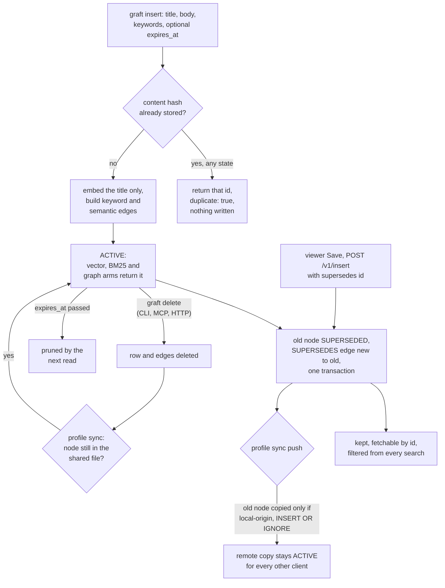

## 1. Executive Summary

Graft is a local memory daemon for coding agents, written in C11. An agent saves
a note — a title, a Markdown body and keywords — and later asks whether it has
seen a problem before. The answer is a gate: `STRONG` returns the note,
`WEAK` returns only its title, `MISS` returns nothing but a fallback list. A
hybrid ranked search and a beam search over a keyword-and-semantic edge graph
sit beside it. Embeddings run in-process through llama.cpp with BGE-M3, so
nothing leaves the machine.

What is notable is that gate: it refuses to hand over a body unless a lexical
signal agrees with the vector. What is weak is correction. The supersession the
README advertises is reachable only from an HTTP endpoint that is off by
default, the agent-facing surfaces correct by deleting, and profile sync reverses
the deletions and never carries the supersessions.

The core is a daemon, `graftd`, reached over a Unix socket with MessagePack
frames by a thin `graft` CLI. A Python MCP server wraps the CLI, an optional
HTTP server and Vue viewer expose the same operations, and skills installed by
`graft setup` teach Claude Code, Codex and OpenCode when to search and when to
save. Profiles give one SQLite file and one daemon per memory space.
[Heimdall](../heimdall/) vendors Graft's C source under `vendor/graft/` as its
retrieval engine.

Four findings shape the rest of this report.

- **Supersession has no agent path.** `mg_op_insert` accepts a `supersedes` id
  and marks the old node superseded in the same transaction. The CLI's
  `build_insert` sends no such field, the MCP `graft_insert` tool has no such
  parameter, and the `graft` skill tells the agent to `delete` and re-insert.
  The one caller in the tree that sends the field is the viewer's
  *Save (supersedes)* button, over HTTP.
- **Sync resurrects.** A pull re-inserts every remote node missing locally, so
  a local delete of a shared note returns on the next sync. A push copies only
  local-origin nodes with `INSERT OR IGNORE`, so a superseded state never
  reaches the remote or any other client.
- **The gate reads the title only.** Insert embeds the title, and query scores
  vector and trigram overlap against the title. With the default thresholds,
  `WEAK` is reachable only in a lexical band 0.015 wide.
- **Three epistemic shapes are declared and unwired.** A `STALE` node state, a
  `CONTRADICTS` edge kind, and a `stale_marked` count hardcoded to `0` in
  consolidate's output.

One mark, `negative_eval`, on a storage test that asserts an expired neighbour
stays out of a graph read while the live neighbour is returned. Section 9 names
the six withheld.

## 2. Mental Model

A memory is a node the caller wrote. It becomes a belief when `insert` commits:
there is no extraction, no model call and no candidate state. It is `ACTIVE`
from birth (`src/insert/insert.c:380`). It stops being one in three ways — a
delete removes the row, an insert that names it in `supersedes` sets it
`SUPERSEDED`, or its `expires_at` passes and the next read prunes it.

**Identity is the content.** `build_content_hash` hashes title, body and the
sorted keywords with BLAKE3, and deliberately leaves author and dates out
(`insert.c:119-167`). An insert whose hash exists returns the existing id with
`"duplicate": true` and writes nothing (`insert.c:289-298`). The lookup does not
filter on state (`src/storage/storage.c:495-512`). Re-inserting the exact text
of a superseded note therefore returns the superseded node's id, reports
success, and leaves the note invisible to every search. `graft get` does not
print a state (`src/retrieve/get.c:1-14`), so nothing tells the agent.

**Supersession is a filter, not a verdict.** A `SUPERSEDED` node keeps its row
and gains an incoming `SUPERSEDES` edge (`storage.c:425-452`). The vector scan,
both FTS arms and the graph walk all carry `state != 2` beside the expiry
predicate (`storage.c:591-601`, `:738-746`, `:770-787`). A superseded node is
fetchable by id and visible in the viewer. It cannot be searched.

**The gate decides how much of a note the model sees.** A `STRONG` hit returns
title and body. A `WEAK` hit returns the title with `body: nil`
(`src/retrieve/query.c:250-258`). Nothing marks a `STRONG` body as provisional,
and the opt-in hook prints it under `<graft-cache hit="STRONG">` as found.

## 3. Architecture

`graftd` is a single C11 process per profile. It opens the profile's SQLite
file, loads BGE-M3 through llama.cpp, and serves MessagePack frames on an
`AF_UNIX` socket (`src/daemon/socket.c`, `src/daemon/dispatch.c:114-127`). The
`graft` CLI encodes each command as a frame, auto-starting the daemon when the
socket is absent, and prints the reply as JSON. Eleven ops exist: classify,
insert, query, retrieve, explore, get, stats, consolidate, delete, view and
remote_sync.

**Persistence.** One SQLite file in WAL mode per profile, under
`<GRAFT_HOME>/profiles/<name>/graft.db` (`src/cli/profile.c:1-20`). The schema is
five tables and one FTS5 virtual table (`src/storage/schema.c:9-68`). The
vectors live in a sqlite-vec `vec0` table that falls back to a plain blob table
if the extension will not load (`storage.c:109-120`). The file is forced to
mode 0600 after open. A `GRAFT_DB_KEY` is applied as a SQLCipher `PRAGMA key`,
and the code probes `cipher_version` and warns loudly when the linked SQLite
is not SQLCipher (`storage.c:142-201`).

**Search stack.** The vector arm does not use sqlite-vec's KNN. `topk_scan`
selects every live row's embedding and computes cosine in C
(`storage.c:587-627`), so each search is linear in the store. Lexical search is
FTS5 BM25 with a `unicode61` tokenizer. The graph is two edge kinds written at
insert and walked by `explore`.

**Optional surfaces.** An HTTP server with a Vue 3D viewer, off by default and
refused on a non-loopback address unless `allow_remote` is set with a token or
external TLS (`config.example.yaml:312-340`). A Python MCP server over stdio,
or over HTTP behind an OAuth resource-server gateway
(`integrations/mcp-server/`). An autosync worker that syncs a profile against a
shared SQLite file on an interval (`profile.c:1109-1330`).

### Deployment and ergonomics

The documented install pipes `install.sh` to a shell, which fetches a prebuilt,
checksum-verified archive into `~/.graft` and fetches the BGE-M3 GGUF model,
about 600 MB, once. No API key and no network service are needed after that; a
CPU is enough, and CUDA or ROCm are build options. `graft setup` copies skills
into every agent it finds, and `/graft-init` inside the agent writes the usage
rule into `CLAUDE.md` or `AGENTS.md`.

`graft view` runs `npm install` and `npm run build` for the viewer on first use
(`src/cli/view.c:1-11`), which executes a dependency tree whose manifest carries
floating ranges. The store is an ordinary SQLite file, readable and repairable
with `sqlite3` apart from the embedding blobs.

## 4. Essential Implementation Paths

**Write.** `graft insert` → `build_insert` (`src/cli/main.c:346-385`) sends
title, body, keywords, an author resolved from `--author`, `GRAFT_AUTHOR` or
`user@host` (`main.c:194-230`), and an optional `expires_at`. `mg_op_insert`
(`insert.c:206-395`) hashes, checks for a duplicate, embeds the title
(`:313`), upserts keywords, calls `mg_insert_build_edges_from_embedding`, and
commits through `mg_storage_insert_node_with_edges` (`storage.c:345-455`).

**Edges.** For each keyword, a vector top-k restricted to nodes with that
keyword yields keyword edges above `edge_keyword_min` 0.5; a global top-20 run
through MMR yields semantic edges above `edge_semantic_min` 0.6
(`src/insert/edges.c:74-213`). Every accepted edge also appends its cosine to
`similarity_samples` (`:108`, `:205`).

**Query.** `mg_op_query` (`query.c:114-275`) embeds the text, takes ten vector
candidates, gives up below a cosine floor of 0.3 (`:43`, `:161`), and scores
each survivor with `mg_verify_score` against its title (`:200-207`). The best
hit by a weighted rank wins. A `MISS` carries a fallback retrieve capped at five
(`:81-84`).

**Retrieve.** `mg_retrieve_run_rrf` (`src/retrieve/retrieve.c:129-327`) fuses
three lists of 50 — vector, BM25 on title, BM25 on body — by `1/(k + rank)`
with k 60. An optional rerank stage is off by default.

**Explore.** `mg_op_explore` (`src/explore/explore.c`) seeds from the vector
top-k, drops seeds sharing no keyword with the filter, then extends beams
through `mg_storage_neighbors` with a log-score, a depth penalty and an MMR
penalty. The keyword filter is resolved by `mg_storage_upsert_keyword`
(`explore.c:258-275`), so a read with an unknown keyword inserts a keyword row.

**Delete.** `mg_op_delete` → `mg_storage_delete_node` (`storage.c:1063-1102`)
removes the vector row explicitly, because `vec0` ignores foreign keys, then the
node, cascading keywords and edges and removing the FTS row by trigger.

**Supersede.** `mg_op_insert` parses `supersedes` only when it is exactly 32
hex characters, and silently inserts without superseding otherwise
(`insert.c:245-269`). The HTTP handler forwards the field
(`src/http/handlers.c:273-305`); `NodePanel.vue` sets it to the open node on
save (`viewer/src/components/NodePanel.vue:130-146`).

**Sync.** `mg_op_remote_sync` (`src/storage/remote_sync_op.c:26-51`) runs
`mg_storage_pull_remote_file` then `mg_storage_push_to_remote_file`
(`storage.c:1198-1277`, `:1287-1386`). An `http://` remote is refused with
*"HTTP remote sync is not available in this build"* (`profile.c:955-958`).

**MCP.** `register_tools` (`integrations/mcp-server/server.py:127-264`) wraps
each CLI command in a subprocess, with `GRAFT_PROFILE` set from the `profile`
argument (`:67-72`).

## 5. Memory Data Model

| Field | Type | Written by | Notes |
| --- | --- | --- | --- |
| `id` | 16-byte UUIDv7 | insert | primary key |
| `content_hash` | BLAKE3, `UNIQUE` | insert | title, body and sorted keywords |
| `title`, `body` | text | insert | only the title is embedded |
| `author` | text, nullable | CLI flag, env or `user@host` | stored verbatim, never checked |
| `created_at`, `last_access`, `access_count` | ms, count | insert, `STRONG` query, `get` | |
| `expires_at` | ms, 0 for none | caller | rows past it are deleted, not kept |
| `state` | 0 active, 1 stale, 2 superseded | insert (0), supersession (2) | nothing writes 1 |
| `origin` | 0 local, 1 remote, 2 pushed | sync | drives what pull deletes and push copies |

Edges carry `src`, `dst`, a kind — `KEYWORD` 0, `SEMANTIC` 1, `CONTRADICTS` 2,
`SUPERSEDES` 3 — an optional keyword id and a weight
(`include/graft/types.h:17-28`, `schema.c:53-62`). Nothing in `src/` writes
kind 2; consolidate counts it and recommends a review if any exist
(`src/stats/consolidate.c:29-30`, `:73-75`). The configuration reference
describes `nli_enabled` as *"Reserved for the future contradiction-detection
layer"* and a no-op (`docs/configuration/README.md:96`).

**Scope is the file.** A profile is its own database and its own daemon, so
profiles cannot see one another at the storage layer. There is no scope key on
a node. The MCP server's instructions call profiles tenants —
*"pass `profile=<name>` to any tool to target a specific tenant"*
(`server.py:115-120`) — and the OAuth gateway grants `graft:read`,
`graft:write` and `graft:admin` per operation with no claim naming a profile.
A token holder chooses the tenant.

**A keyword scope on one read.** `http.view_keyword_scope` restricts
`/v1/view` to nodes tagged with one keyword, and edges to those with both ends
in scope (`src/retrieve/view.c:108-178`). `/v1/search`, `/v1/match`,
`/v1/explore` and `/v1/nodes/{id}` on the same server do not read the setting.

**No time axis beyond the row.** `expires_at` ends a node's life and the prune
deletes it, so nothing records what was believed before it expired. A
superseded node keeps `created_at` and loses searchability; the superseding
node's `created_at` is the only date of the change.

## 6. Retrieval Mechanics

**The gate.** With the cross-encoder off, which is the default, a candidate is
`STRONG` when trigram overlap with the title is at least 0.15 with a cosine of
0.7, or when the cosine is at least 0.75 with overlap at least 0.065. It is
`WEAK` when it is not strong, the cosine is at least 0.85 and overlap at least
0.05 (`src/verify/verify.c:263-285`; defaults at `src/config/config.c:54-60`).
Any candidate with a cosine of at least 0.85 and overlap of at least 0.065
is already strong, so
`WEAK` occupies overlap between 0.05 and 0.065. The unit test for the weak gate
sits in that band at 0.06 (`tests/test_verify.c:35-37`).

**The body is not searched by meaning.** Only the title is embedded, and the
gate scores only the title. A note whose answer is in the body reaches the
agent through `query` only if its title is phrased like the question. The
`graft` skill says so: *"The title is the retrieval anchor"*.

**The lexical arms AND every token.** `build_scoped_fts_query` wraps each
whitespace token as `col:"token"` and joins them with a space
(`storage.c:651-703`, the join at `:674-676`). FTS5 reads a space as AND, so a
row must contain every token of the query. A sentence-length query to
`retrieve`, or the `MISS` fallback over a whole prompt, will usually match
nothing lexically and fall back to the vector list alone. The quoting closes a
column-breakout injection, which the comment above the function describes.
[Heimdall](../heimdall/)'s benchmark analysis located the same join in its
vendored copy as one cause of its low recall.

**Every read writes.** `topk_scan`, `mg_storage_fts_search` and
`mg_storage_neighbors` each call `mg_storage_prune_expired` first
(`storage.c:610`, `:736`, `:770`). That function opens `BEGIN IMMEDIATE` and
deletes expired rows (`:285-343`), so each search takes the write lock, and
`query` records a similarity sample unless `signals_only` is set
(`query.c:153-157`).

**Injection.** The opt-in `UserPromptSubmit` hook runs `graft query` on any
prompt of four or more words. On `STRONG` it prints title and body plus up to
six explore neighbours at depth one or more, under the heading *"what may
contradict or constrain the answer"*
(`integrations/optional/hooks/graft/query_inject.js:156-172`). On `MISS` it
injects a bare marker and deliberately withholds the fallback list (`:199-208`).
Injection is bounded to one body and a few titles per prompt.

## 7. Write Mechanics

Writes are explicit and synchronous. Nothing extracts from a transcript; the
agent decides to call `insert`, prompted by the skills, or by the optional
`PostToolUse` hook that emits a same-turn proposal after an edit. `/learn` and
`/memoryze` are skills that plan and distill notes before inserting them, and
`/learn` asks for the user's approval in its text.

**Deduplication is exact.** A change of one character, or one keyword, is a new
node. The skill's instruction for a wrong note is delete then insert, and for a
doubtful one to *"re-save it with an `unsure` keyword"* — a tag convention that
no read path consults.

**Delete is final locally and temporary under sync.** Pull deletes a local row
only when its origin is non-zero and the shared file lacks it
(`storage.c:1218-1222`), then inserts every shared node missing locally with
`INSERT OR IGNORE` (`:1228-1234`). A note deleted on one client and still in
the shared file is back after the next sync. No sync path deletes from the
shared file.

**Supersession does not travel.** Push copies nodes `WHERE origin = 0` with
`INSERT OR IGNORE` and flips them to origin 2 (`storage.c:1329-1338`,
`:1370-1373`). A client that supersedes a pulled node pushes the new node and
the `SUPERSEDES` edge; the old node's row on the shared file is never updated.
Every other client keeps retrieving it.

**Agent-written and person-written notes are indistinguishable.** `author` is
whatever the caller supplies, defaulting to the login name and host. There is
no content filter; the skills ask the model not to save secrets.

### Operational cost

- Write: synchronous. One BGE-M3 embedding of the title on CPU, then one
  brute-force vector scan per keyword and one global scan to build edges, each
  preceded by a prune transaction. A new note is searchable when `insert`
  returns.
- Background: none by default. `consolidate` is manual; it prunes expired nodes,
  deletes orphan, duplicate and zero-weight edges, then runs `ANALYZE`
  (`storage.c:973-1060`). Autosync, when enabled, re-reads the whole shared
  file per interval.
- Read: one embedding and one linear vector scan per query; `query` loads up to
  ten candidate rows. The hook adds one body and up to six titles to the user's
  turn.

## 8. Agent Integration

The supported path is skills plus one rule in the instruction file. The
`graft` skill tells the agent to search before any non-trivial task, to insert
fixes, gotchas and decisions at the end of a piece of work, and to close each
turn with a one-line recap of what graft did
(`integrations/standard/skills/graft/SKILL.md`). `recall` escalates from
`query` to `retrieve` to `explore`; `memory-audit` reads `graft stats` and
`graft analytics` and proposes deletions without making them.

The MCP server exposes the same operations as tools — `graft_query`,
`graft_retrieve`, `graft_explore`, `graft_classify`, `graft_insert`,
`graft_get`, `graft_delete`, `graft_stats`, `graft_analytics` and seven profile
tools including remove and merge. Over stdio, `_require_scopes` returns early
because there is no token, so every tool is open to the model
(`server.py:94-106`).

The three hooks under `integrations/optional/hooks/` are not installed by
`graft setup` and need a hand edit of `settings.json`. The `CHANGELOG.md`
*Unreleased* section lists them as removed (`CHANGELOG.md:28-30`); at this
commit they are in the tree under `optional/`.

The agent holds insert and delete and cannot supersede. The only
agent-reachable correction is deletion, which sync reverses for shared notes.

## 9. Reliability, Safety, and Trust

**The gate is the trust mechanism, and it acts per query.** It withholds a
body when the lexical and vector signals disagree, which prevents a confident
wrong hit on an unrelated note. It says nothing about whether the note itself
is still true. A stale note with a well-phrased title is `STRONG`.

**Correction depends on which door is used.** A person in the viewer produces
supersession: atomic, reversible by hand, filtered from every search. An agent
produces deletion. Sync reverses the second and ignores the first on every
other client.

**Local safety is careful.** The DB is chmod 0600; the hook state directory
is 0700 and session ids are validated before use as filenames
(`query_inject.js:36-46`); HTTP auth uses a constant-time compare and a
read-only token tier (`src/http/server.c:131-148`); browser writes need an
`Origin` matching `Host`. The `Origin` check is a substring test
(`server.c:175-177`).

**Privacy.** Deletion is a hard delete in the profile's file and in FTS. Earlier
exports, merges into other profiles, and any shared sync file keep copies.

**Uncertainty is not representable** beyond the `unsure` keyword convention.

Capability marks:

- `negative_eval` — awarded; evidence in section 10.
- `tombstone` — withheld. Delete leaves nothing. Supersession is keyed on a
  record and is excluded by the rubric. The content-hash duplicate check does
  swallow an exact re-insert of superseded text, but it is keyed on the whole
  record including keywords, reports success, and any edit walks past it.
- `trust_state` — withheld. `state` is a lifecycle with one filtering value,
  `SUPERSEDED`, and no value says a note is unverified or believed wrong.
  `STALE` is declared in `types.h:26` and has no writer; consolidate reports
  `stale_marked` as a constant `0` (`consolidate.c:32-33`).
- `bitemporal` — withheld. `created_at` and a deleting `expires_at`; no valid
  interval and no as-of read.
- `scope_enforced` — withheld. Profiles are a physical partition. The one
  predicate on a stored key, `view_keyword_scope`, sits on `/v1/view` and not
  on search, match, explore or get.
- `audit_log` — withheld. `usage.jsonl` appends one line per CLI invocation,
  with op, status, latency, hit and id (`src/cli/usage_log.c:93-113`,
  `main.c:650`). It exists for hit-rate analytics, is not in the store, names
  no profile, and misses HTTP and viewer writes, expiry prunes, sync and merge.
- `human_review` — withheld. `/learn`'s approval gate is prose to the model;
  the viewer edit is authoring after the fact; the agent holds insert and
  delete.

## 10. Tests, Evals, and Benchmarks

I built and ran nothing; everything below is from reading the tests at the pin.

**The negative case.** `tests/test_storage.c` section 6 (`:237-345`) inserts an
expired node with a weight-1.0 semantic edge from `title_hit`, then asserts
`mg_storage_neighbors` returns exactly one neighbour, `body_hit`
(`:262-266`). The live neighbour is the positive control, so an empty or
unfiltered result fails. The same section asserts an expired node is absent
from a vector top-k over a store of live nodes sharing its embedding
(`:286-301`). The FTS twin asserts a search for `gamma` returns zero rows with
no live `gamma` node beside it (`:325-331`), which an empty index also passes.

**Supersession is tested for the write, not the read.** The test inserts a node
with `supersedes` and asserts the old node's state is `SUPERSEDED`
(`test_storage.c:486-509`). No case asserts it is absent from a search.

**Sync is tested for bookkeeping.** `test_remote_profiles.c` covers origin
flags, remote-side deletion, push idempotence and merge. One comment reads
*"pushed node treated as local-done, not re-deleted"* above an assertion that
requires `deleted == 1` (`:108-115`). No case deletes locally and syncs.

**The ops are tested for argument rejection.** `mg_op_query`, `mg_op_retrieve`,
`mg_op_insert` and the rest appear in tests only with a `NULL` context
(`tests/test_retrieve.c:91-111`, `tests/test_explore.c:38-54`). `test_embed.c`
skips without `GRAFT_TEST_MODEL`, which the workflow does not set. The gate is
unit-tested on hand-picked signal values (`test_verify.c`).

**CI.** `ctest` runs in `.github/workflows/release.yml:62-115`, which triggers
only on pushes to `release/**` branches.

**No benchmark.** No retrieval-quality harness or result is committed; the
README roadmap lists *"publish better benchmarks"*. No paper or citation file
is in the tree.

## 11. For Your Own Build

### Steal

- **Gate the body, not the answer.** Returning the title alone on a weak match
  lets the agent decide whether to open it, and costs almost nothing.
- **Require a lexical signal to agree before calling a vector hit strong.**
  Unrelated high-cosine neighbours are the common false positive.
- **Make supersession atomic with the replacing insert**, and put the state
  predicate in every read's SQL, including the graph walk.
- **Quote user text per token before it reaches an FTS `MATCH`**, and say in a
  comment which injection it closes.
- **Warn when an encryption key is set but the engine cannot use it.** A
  silently ignored `PRAGMA key` is a false sense of safety.

### Avoid

- **A correction verb only a person's UI can reach.** If the agent corrects by
  deleting, the lifecycle state never gets written in practice.
- **Sync that inserts whatever is missing.** Without a deletion record,
  replicated deletes come back; without updating existing rows, state changes
  never replicate.
- **Implicit AND over every token of a natural-language query.** Use OR with
  BM25 ranking, or cap the token count.
- **A dedup lookup that ignores state.** It turns a re-assertion into a
  silent no-op against a hidden row.
- **Pruning inside every read.** It puts a write lock on the search path.

### Fit

Graft suits one developer on one machine who wants coding-agent notes recalled
across sessions without a service or an API key, and who will phrase titles as
future questions. The C daemon is small enough to read in a day and runs on a
laptop CPU. It does not suit a team sharing memory through profile sync: the
sync as written cannot propagate a correction, and a deleted note returns.
Anyone needing to know why a note is believed, or when it stopped being true,
will find no record to read.

## 12. Open Questions

- How often does `WEAK` fire in real use, given the band the defaults leave it?
  The usage log records hit labels, so `graft analytics` could answer this.
- Does `INSERT OR REPLACE` in a merge with `overwrite` fire the cascades on the
  replaced rows, or leave edges pointing at a deleted id?
- Is the viewer the intended correction path, or is supersession meant to reach
  the CLI and MCP tools?
- Heimdall's `VENDORED.md` names a different upstream for its vendored copy;
  which commit of this repository does that copy correspond to?

## Appendix: File Index

- **Schema and storage:** `src/storage/schema.c`, `src/storage/storage.c`,
  `include/graft/types.h`, `include/graft/storage.h`.
- **Write:** `src/insert/insert.c`, `src/insert/edges.c`,
  `src/insert/classify.c`, `src/cli/main.c` (`build_insert`,
  `mg_resolve_author`).
- **Read:** `src/retrieve/query.c`, `src/verify/verify.c`,
  `src/retrieve/retrieve.c`, `src/explore/explore.c`, `src/retrieve/get.c`,
  `src/retrieve/view.c`, `src/config/config.c`.
- **Delete, maintenance, sync:** `src/retrieve/delete.c`,
  `src/stats/consolidate.c`, `src/storage/remote_sync_op.c`,
  `src/cli/profile.c`.
- **Transport:** `src/daemon/dispatch.c`, `src/http/server.c`,
  `src/http/handlers.c`, `viewer/src/components/NodePanel.vue`.
- **Agent surfaces:** `integrations/mcp-server/server.py`,
  `integrations/mcp-server/oauth_gateway.py`,
  `integrations/standard/skills/*/SKILL.md`,
  `integrations/optional/hooks/graft/*.js`, `src/cli/usage_log.c`.
- **Tests:** `tests/test_storage.c`, `tests/test_verify.c`,
  `tests/test_remote_profiles.c`, `tests/test_retrieve.c`,
  `tests/test_explore.c`, `.github/workflows/release.yml`.

### Recorded searches

Checked against the checkout at the pinned revision, from the tree root.

- `grep -rn -E 'MG_EDGE_CONTRADICTS|MG_NODE_STALE|MG_NODE_SUPERSEDED' src include integrations viewer/src` — `SUPERSEDED` written at `storage.c:443`; `CONTRADICTS` and `STALE` appear only in `types.h`.
- `grep -rn 'SET state' src` — one site, `storage.c:441`.
- `grep -rn -i 'supersede' src/cli integrations` — no match; no CLI flag, MCP parameter or skill text supersedes.
- `grep -rn -iE 'vec_distance|embedding MATCH|knn' src` — no match; sqlite-vec is not queried for nearest neighbours.
- `grep -rn 'keyword_scope' src` — `config.c`, the copy in `verify.c`, and `view.c` only.
- `grep -n -i 'profile' integrations/mcp-server/oauth_gateway.py` — no match.
- `grep -rniE 'audit|event_log|mutation' src include --include='*.c' --include='*.h'` — no match.
- `grep -rn -E 'valid_from|valid_to|valid_until|as_of' src include` — no match.
- `grep -rn 'mark_local_pushed' src` — definition only; the test calls it.
- `grep -rn 'mg_op_' tests/*.c` — query, retrieve, insert, get and delete appear only with a `NULL` context.
- `grep -n 'GRAFT_TEST_MODEL' .github/workflows/*.yml` — no match.
- `grep -rliE 'arxiv|bibtex|@article|@misc|doi\.org|CITATION' . --exclude-dir=.git --exclude-dir=third_party` — no match, and no `CITATION.cff`.

## History

**2026-09-26** — [`b60e8f34ecda05d7883731dea244616de679f982`](https://github.com/AEndrix03/Graft/commit/b60e8f34ecda05d7883731dea244616de679f982) — first reading, at the head of `master`, the v0.1.1 release commit of 25 September 2026. One mark, `negative_eval`. Screened before reading: one auto-run finding, `.gitmodules` naming four third-party submodules (BLAKE3, llama.cpp, mpack, sqlite-vec), left uninitialised; no build-time execution point; three dependency surfaces inside the cooldown, inflated because a depth-1 clone dates every file to the tip; two unpinned surfaces, the MCP server's `pyproject.toml` with no lockfile and the viewer's floating ranges; an empty `CLAUDE.md` recorded as data. Read with `grep` and `sed`; nothing installed, built or run.
