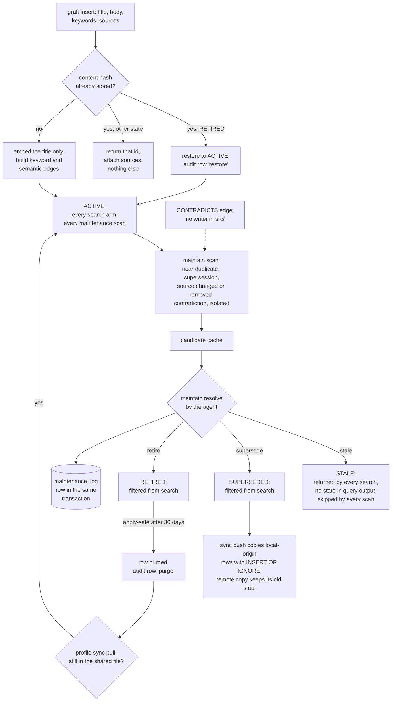

## 1. Executive Summary

Graft is a local memory daemon for coding agents, written in C11. An agent saves
a note — a title, a Markdown body, keywords and optionally the files it came
from — and later asks whether it has seen a problem before. The answer is a
gate: `STRONG` returns the note, `WEAK` returns only its title, `MISS` returns
nothing but a fallback list. A hybrid ranked search and a beam search over a
keyword-and-semantic edge graph sit beside it. Embeddings run in-process
through llama.cpp with BGE-M3, so nothing leaves the machine.

What is notable is the gate, and a correction loop built around it: a scan
proposes candidates, the agent resolves each with one verb, and every
resolution is reversible and lands in an append-only log in the same
transaction. What is weak is that the loop's two epistemic outputs do not
reach the read path. A note marked `stale` is returned by every search and
labelled by none, and contradiction candidates read an edge kind nothing in
the product writes.

The core is a daemon, `graftd`, reached over a Unix socket with MessagePack
frames by a thin `graft` CLI. A Python MCP server wraps the CLI, an optional
HTTP server and Vue viewer expose the same operations, and a Claude Code and
Codex plugin ships the skills plus two hooks. Profiles give one SQLite file and
one daemon per memory space. [Heimdall](../heimdall/) vendors Graft's C source
under `vendor/graft/` as its retrieval engine.

Four findings shape the rest of this report.

- **`STALE` withholds nothing.** `graft maintain resolve --action stale` writes
  it (`src/storage/maintain_store.c:686-689`). The vector, full-text and graph
  reads all select `state IN (0,1)`, query output carries no state, and every
  maintenance scan selects `state = 0`. A stale note keeps answering `STRONG`
  and drops out of the process that would retire it.
- **Contradiction detection has no producer.** `contradiction` is the
  highest-priority candidate kind, and it reads `CONTRADICTS` edges
  (`maintain_store.c:226`). No path in `src/` writes one; the only writer in
  the tree is a test fixture (`tests/test_maintain.c:300`).
- **Sync resurrects and carries no state.** A pull re-inserts every shared node
  missing locally, and a push copies only local-origin rows with
  `INSERT OR IGNORE`. A supersession, retirement or stale mark never reaches
  another client, and a retired shared note returns `ACTIVE` once apply-safe
  purges it.
- **The agent clears its own queue.** The `memory-audit` skill resolves
  candidates *"without asking the user in the normal path"*, and the resolve
  verb is an MCP tool. The audit row's `actor` is a string the caller supplies.

Two marks, `audit_log` and `negative_eval`. Section 9 names the five withheld.

## 2. Mental Model

A memory is a node the caller wrote. It becomes a belief when `insert` commits:
there is no extraction, no model call and no candidate state. It is `ACTIVE`
from birth (`src/insert/insert.c:416`). It leaves the searchable set in four
ways: `supersede` and `retire` hide it, `delete` removes the row, and a passed
`expires_at` gets it pruned on the next read. `stale` is a fifth transition
that hides nothing.

**Identity is the content.** `build_content_hash` hashes title, body and the
sorted keywords with BLAKE3 and leaves author, dates and sources out
(`insert.c:131-176`). An insert whose hash exists returns the existing id with
`"duplicate": true` (`insert.c:350-363`). The lookup does not filter on state
(`src/storage/storage.c:882-900`). For a `RETIRED` note the insert restores it,
audited as `restore` with detail *"same content inserted again"*
(`insert.c:224-246`). For a `SUPERSEDED` or `STALE` note it returns the id and
changes nothing, so a re-assertion of superseded text is a silent no-op against
a hidden row.

**Supersession and retirement are filters; staleness is a label nobody reads.**
The four states and their effect on each reader:

| State | vector, FTS, graph | `query` / hook output | maintenance scans | `get`, viewer |
| --- | --- | --- | --- | --- |
| `ACTIVE` 0 | returned | no state field | scanned | `active` |
| `STALE` 1 | returned | no state field | skipped | `stale` |
| `SUPERSEDED` 2 | filtered | — | skipped | `superseded` |
| `RETIRED` 3 | filtered | — | skipped | `retired` |

The read predicates are at `storage.c:976-990`, `:1130`, `:1164` and `:1171`;
the scan inputs at `maintain_store.c:161`, `:226`, `:281`, `:323`, `:368` and
`src/maintain/maintain.c:452`. `get` prints the state (`src/retrieve/get.c:93-96`).

**The gate decides how much of a note the model sees.** A `STRONG` hit returns
title and body. A `WEAK` hit returns the title with `body: nil`
(`src/retrieve/query.c:327-332`). The plugin's prompt hook injects a `STRONG`
note under *"Close is not proven - check it against the code before relying on
it"* (`src/cli/hook.c:323-327`), which is a caveat to the model and carries no
state.

```mermaid
%% caption: how a Graft note becomes searchable, the transitions the maintenance loop can apply, which of them a search honours, and where sync undoes them
flowchart TD
    W["graft insert: title, body,<br/>keywords, sources"] --> H{"content hash<br/>already stored?"}
    H -- "yes, RETIRED" --> RS["restore to ACTIVE,<br/>audit row 'restore'"]
    H -- "yes, other state" --> DUP["return that id,<br/>attach sources,<br/>nothing else"]
    H -- "no" --> E["embed the title only,<br/>build keyword and<br/>semantic edges"]
    E --> A["ACTIVE:<br/>every search arm,<br/>every maintenance scan"]
    RS --> A
    SC["maintain scan:<br/>near duplicate, supersession,<br/>source changed or removed,<br/>contradiction, isolated"] --> Q["candidate cache"]
    A --> SC
    CE["CONTRADICTS edge:<br/>no writer in src/"] -.-> SC
    Q --> R{"maintain resolve<br/>by the agent"}
    R -- "stale" --> ST["STALE:<br/>returned by every search,<br/>no state in query output,<br/>skipped by every scan"]
    R -- "supersede" --> SU["SUPERSEDED:<br/>filtered from search"]
    R -- "retire" --> RT["RETIRED:<br/>filtered from search"]
    R --> LOG[("maintenance_log<br/>row in the same<br/>transaction")]
    RT -- "apply-safe after 30 days" --> PG["row purged,<br/>audit row 'purge'"]
    PG --> PULL{"profile sync pull:<br/>still in the shared file?"}
    PULL -- "yes" --> A
    SU --> PUSH["sync push copies local-origin<br/>rows with INSERT OR IGNORE:<br/>remote copy keeps its old state"]
```

## 3. Architecture

`graftd` is a single C11 process per profile. It opens the profile's SQLite
file, loads BGE-M3 through llama.cpp, and serves MessagePack frames on an
`AF_UNIX` socket to a pool of client workers (`src/daemon/socket.c`,
`src/common/workers.c`). Storage calls are serialized by a mutex and the
daemon drains its workers before freeing state; both landed as fixes on
3 October 2026 (`e9500a7`, `1e58f5d`). The `graft` CLI encodes each command
as a frame, auto-starting the daemon when the socket is absent, and prints the
reply as JSON.

**Persistence.** One SQLite file in WAL mode per profile, under
`<GRAFT_HOME>/profiles/<name>/graft.db`. The base schema is five tables and one
FTS5 virtual table; schema v4 adds `sources` and `node_sources`, and v5 adds
five maintenance tables, both additive on open (`src/storage/schema.c:120-199`).
Vectors live in a sqlite-vec `vec0` table that falls back to a plain blob table
if the extension will not load (`storage.c:170-181`). The file is forced to
mode 0600 after open (`storage.c:214`). A `GRAFT_DB_KEY` is applied as a
SQLCipher `PRAGMA key`, and the code probes `cipher_version` and warns loudly
when the linked SQLite is not SQLCipher (`storage.c:219-261`); a heap overflow
in quoting that key was fixed on 3 October (`268e410`).

**Search stack.** The vector arm does not use sqlite-vec's KNN. `topk_scan`
selects every searchable row's embedding and computes cosine in C
(`storage.c:974-1015`), so each search is linear in the store. Lexical search
is FTS5 BM25 with a `unicode61` tokenizer. The graph is two edge kinds written
at insert and walked by `explore`.

**Optional surfaces.** An HTTP server with a Vue 3D viewer, off by default and
refused on a non-loopback address unless `allow_remote` is set
(`config.example.yaml:354-378`). A Python MCP server over stdio, or over HTTP
behind an OAuth resource-server gateway (`integrations/mcp-server/`). An
autosync worker that syncs a profile against a shared SQLite file
(`src/cli/profile.c:970`).

### Deployment and ergonomics

The documented install fetches a prebuilt, checksum-verified archive into
`~/.graft`, plus Homebrew and Scoop manifests, and fetches the BGE-M3 GGUF
model, about 600 MB, once. No API key and no network service are needed after
that; a CPU is enough, and CUDA or ROCm are build options. The Claude Code and
Codex plugin (`plugins/graft/`) carries six skills and a `hooks.json` whose two
hooks run the `graft` binary, never start the daemon, and exit 0 on any
failure; `GRAFT_HOOKS=0` turns both off. `/graft-init` inside the agent writes
the usage rule into `CLAUDE.md` or `AGENTS.md`.

`graft view` runs `npm install` and `npm run build` for the viewer on first use
(`src/cli/view.c:1-10`), which executes a dependency tree whose manifest
carries floating ranges. The store is an ordinary SQLite file, readable and
repairable with `sqlite3` apart from the embedding blobs.

## 4. Essential Implementation Paths

**Write.** `graft insert` → `build_insert` (`src/cli/main.c:337-400`) sends
title, body, keywords, an author resolved from `--author`, `GRAFT_AUTHOR` or
`user@host` (`main.c:142`), an optional `expires_at`, and repeatable
`--source` locators. `mg_op_insert` (`insert.c:248-445`) parses sources before
writing anything, hashes, checks for a duplicate, embeds the title (`:373`),
upserts keywords, builds edges, and commits node, edges and source links in one
transaction through `mg_storage_insert_node_with_sources`.

**Edges.** For each keyword, a vector top-k restricted to nodes with that
keyword yields keyword edges above `edge_keyword_min` 0.5; a global top-20 run
through MMR yields semantic edges above `edge_semantic_min` 0.6
(`src/insert/edges.c:74-213`). Every accepted edge appends its cosine to
`similarity_samples` (`:108`, `:205`).

**Query.** `mg_op_query` (`query.c:175`) embeds the text, takes ten vector
candidates, gives up below a cosine floor of 0.3 (`:46`), and scores each
survivor with `mg_verify_score` against its title (`:277`). The best hit by a
weighted rank wins (`:158-172`). A `MISS` carries a fallback retrieve capped at
five (`:141-144`). `explain=true` returns every scored candidate with its
signals.

**Retrieve.** `mg_retrieve_run_rrf` (`src/retrieve/retrieve.c:129-327`) fuses
three lists of 50 — vector, BM25 on title, BM25 on body — by `1/(k + rank)`
with k 60. An optional rerank stage is off by default.

**Explore.** `mg_op_explore` (`src/explore/explore.c`) seeds from the vector
top-k, drops seeds sharing no keyword with the filter, then extends beams
through `mg_storage_neighbors` with a log-score, a depth penalty and an MMR
penalty. The keyword filter is resolved by `mg_storage_upsert_keyword`
(`explore.c:258-275`), so a read with an unknown keyword inserts a keyword row.

**Provenance.** A file source is stored relative to its project root with a
BLAKE3 fingerprint, and the project id is the normalized `origin` remote or the
root path (`src/common/source.c`). `graft sources diff` re-hashes the recorded
files and reports each link unchanged, changed or removed; `sources refresh`
stores the new fingerprint after a note is revalidated
(`src/cli/sources.c`, `src/storage/sources_op.c`).

**Maintain.** `maintain scan` builds candidates of seven kinds — contradiction,
source removed, source changed, possible supersession, near duplicate above a
cosine of 0.92, keyword fragmentation, isolated low-value — and caches them
with deterministic ids (`src/maintain/maintain.c:686`). Near duplicates compare
only the newest 2,000 active nodes (`maintain_store.c:152-163`).
`maintain resolve` maps an action to transitions and calls
`mg_storage_maint_apply`, which applies them, records a `keep` dismissal keyed
on the candidate and an evidence digest, drops affected candidates, and
appends the audit row in one transaction (`maintain_store.c:739-778`).
`maintain apply-safe` purges retired notes past the 30-day retention and
supersedes byte-identical title-and-body duplicates by the oldest
(`maintain.c:1027`, `maintain_store.c:792-950`).

**Delete.** `mg_op_delete` → `mg_storage_delete_node` (`storage.c:1462-1501`)
removes the vector row explicitly, because `vec0` ignores foreign keys, then
the node, cascading keywords, edges and source links and removing the FTS row
by trigger. No audit row is written.

**Sync.** `mg_op_remote_sync` (`src/storage/remote_sync_op.c:26-51`) runs
`mg_storage_pull_remote_file` then `mg_storage_push_to_remote_file`
(`storage.c:1740-1825`, `:1835-1940`). An `http://` remote is refused
(`profile.c:939`).

**MCP.** `register_tools` (`integrations/mcp-server/server.py:127`) wraps each
CLI command in a subprocess, with `GRAFT_PROFILE` set from the `profile`
argument (`:71`). Four maintenance tools — scan, resolve, apply-safe and log —
sit beside insert and delete.

## 5. Memory Data Model

| Field | Type | Written by | Notes |
| --- | --- | --- | --- |
| `id` | 16-byte UUIDv7 | insert | primary key |
| `content_hash` | BLAKE3, `UNIQUE` | insert | title, body and sorted keywords |
| `title`, `body` | text | insert | only the title is embedded |
| `author` | text, nullable | CLI flag, env or `user@host` | stored verbatim, never checked |
| `created_at`, `last_access`, `access_count` | ms, count | insert, `STRONG` query, `get` | |
| `expires_at` | ms, 0 for none | caller | rows past it are deleted, not kept |
| `state` | 0 active, 1 stale, 2 superseded, 3 retired | insert (0), maintain resolve (1, 2, 3, 0), insert with `supersedes` (2), apply-safe collapse (2) | see section 2 for what reads it |
| `origin` | 0 local, 1 remote, 2 pushed | sync | drives what pull deletes and push copies |

**Provenance.** `sources(project, kind, locator, fingerprint, observed_at)` is
unique per project, kind and locator; `node_sources` links a node to any number
of sources with the fingerprint it was derived from
(`schema.c:120-146`). Sources travel through export, merge and both sync
directions, newest observation winning (`storage.c:1528`, `:1812`, `:1921`).

**Maintenance tables.** `maintenance_retired` holds the retirement time and
prior state, `maintenance_candidates` the last scan, `maintenance_dismissals`
the `keep` decisions keyed on candidate id and evidence digest, and
`maintenance_log` one row per resolution, purge, collapse and apply-safe run
with `ts`, `actor`, `action`, `candidate_id`, `kind`, `nodes`, `detail` and
`note` (`schema.c:150-199`).

Edges carry `src`, `dst`, a kind — `KEYWORD` 0, `SEMANTIC` 1, `CONTRADICTS` 2,
`SUPERSEDES` 3 — an optional keyword id and a weight
(`include/graft/types.h:17-32`). `SUPERSEDES` is written by insert
(`storage.c:812-838`) and by the resolve transition
(`maintain_store.c:717-734`), and a restore deletes it. The configuration
reference describes `nli_enabled` as *"Reserved for the future
contradiction-detection layer"* and a no-op
(`docs/configuration/README.md:105`).

**Scope is the file.** A profile is its own database and its own daemon, so
profiles cannot see one another at the storage layer. No scope key sits on a
node. A source's `project` filters the `sources` commands and the project
coverage count (`storage.c:621-625`, `src/cli/project.c:300`), and no search
reads it. The MCP server's instructions call profiles tenants (`server.py:117`)
and the OAuth gateway grants `graft:read`, `graft:write` and `graft:admin` per
operation with no claim naming a profile, so a token holder chooses the tenant.

**A keyword scope on one read.** `http.view_keyword_scope` restricts
`/v1/view` to nodes tagged with one keyword (`src/retrieve/view.c:111-122`).
Search, match, explore and get on the same server do not read the setting.

**No time axis beyond the row.** `expires_at` ends a node's life and the prune
deletes it. A superseded node keeps `created_at`; the log row, where the
change went through maintenance, is the only record of when it stopped being
current.

## 6. Retrieval Mechanics

**The gate.** With the cross-encoder off, which is the default, a candidate is
`STRONG` when trigram overlap with the title is at least 0.15 with a cosine of
0.7, or when the cosine is at least 0.75 with overlap at least 0.065. It is
`WEAK` when it is not strong, the cosine is at least 0.85 and overlap at least
0.05 (`src/verify/verify.c:263-285`; defaults at `src/config/config.c:54-60`).
Any candidate with a cosine of at least 0.85 and overlap of at least 0.065 is
strong, so `WEAK` occupies overlap between 0.05 and 0.065. The
committed benchmark shows the consequence: one `WEAK` answer in 205 dev
queries and none in 120 held-out ones.

**The body is not searched by meaning.** Only the title is embedded, and the
gate scores only the title. A note whose answer is in the body reaches the
agent through `query` only if its title is phrased like the question. The
`graft` skill says so: *"The title is the retrieval anchor"*.

**The lexical arms AND every token.** `build_scoped_fts_query` wraps each
whitespace token as `col:"token"` and joins them with a space
(`storage.c:1039-1091`, the join at `:1062-1064`). FTS5 reads a space as AND,
so a row must contain every token of the query. A sentence-length query to
`retrieve`, or the `MISS` fallback over a whole prompt, usually matches nothing
lexically and falls back to the vector list alone. The quoting closes a
column-breakout injection, which the comment above the function describes.
[Heimdall](../heimdall/)'s benchmark analysis located the same join in its
vendored copy as one cause of its low recall.

**Every read writes.** `topk_scan`, the FTS search and `mg_storage_neighbors`
each call `mg_storage_prune_expired` first (`storage.c:998`, `:1124`, `:1158`).
That function opens `BEGIN IMMEDIATE` and deletes expired rows
(`storage.c:416-474`), so each search takes the write lock, and `query`
records a similarity sample unless `signals_only` is set (`query.c:224-226`).

**Injection.** The plugin's `UserPromptSubmit` hook sends at most 1,000 bytes of
a prompt of three or more words to a running daemon, and on `STRONG` injects
the title and up to 800 bytes of body with a `graft get` pointer
(`hook.c:278-287`, `:317-334`, `:400-430`). It injects nothing on `WEAK` or
`MISS`. The older opt-in JavaScript hook under `integrations/optional/hooks/`
adds up to six explore neighbours; the changelog warns that installing both
doubles the lookup.

## 7. Write Mechanics

Writes are explicit and synchronous. Nothing extracts from a transcript; the
agent decides to call `insert`, prompted by the skills. `/learn` has a
`bootstrap` mode that builds a new project's memory topic by topic and a `docs`
mode that ingests a repository's documentation with file sources; `/memoryze`
distils a session.

**Deduplication is exact.** A change of one character, or one keyword, is a new
node. Apply-safe closes the keyword-only case: notes with byte-identical title
and body are superseded by the oldest, their source links copied to the keeper
(`maintain_store.c:870-950`).

**Correction depends on which instructions the model read.** The `graft` skill
says to insert the corrected note and `supersede` the old one in the same turn,
and keeps `graft delete` for *"a secret saved by mistake"*
(`plugins/graft/skills/graft/SKILL.md:56-66`, `:173-190`). The MCP server's
own instructions say *"Use graft_delete to remove obsolete/wrong nodes; to
'modify' a node, delete it then re-insert"* (`server.py:117-119`), and
`/learn docs` handles a changed document by delete then insert
(`plugins/graft/skills/learn/SKILL.md:290`). A model reached only over MCP
gets the unaudited path.

**Delete is final locally and temporary under sync.** Pull deletes a local row
only when its origin is non-zero and the shared file lacks it
(`storage.c:1760-1763`), then inserts every shared node missing locally with
`INSERT OR IGNORE` (`:1772-1777`). A note deleted on one client and still in
the shared file is back after the next sync, and so is a pulled note that
apply-safe purged after retirement. No sync path deletes from the shared file.

**State does not travel.** Push copies nodes `WHERE origin = 0` with
`INSERT OR IGNORE` and flips them to origin 2 (`storage.c:1879-1885`, `:1926`).
A later supersession, retirement or stale mark on a pushed or pulled node is
an `UPDATE` that no sync statement copies, so every other client keeps
retrieving the old note. Provenance is the exception: both directions run
`sync_provenance`, newest observation winning.

**Agent-written and person-written notes are indistinguishable.** `author` is
whatever the caller supplies. There is no content filter; the skills ask the
model not to save secrets.

### Operational cost

- Write: synchronous. One BGE-M3 embedding of the title on CPU, then one
  brute-force vector scan per keyword and one global scan to build edges, each
  preceded by a prune transaction. A new note is searchable when `insert`
  returns. The committed benchmark measured an insert round trip at a p50 of
  266 ms on a Windows CPU.
- Background: none in the daemon. `apply-safe` and `scan` run when the agent
  calls them; `graft status` recommends `scan` after 50 inserts. The
  near-duplicate scan is quadratic over at most 2,000 active vectors.
- Read: one embedding and one linear vector scan per query, measured at a p50
  of 250 ms on the held-out run; the hook adds one body of at most 800 bytes
  to the user's turn.

## 8. Agent Integration

The supported path is the plugin plus one rule in the instruction file. The
`graft` skill's lifecycle has the agent run `graft status` at session start
and bootstrap a project the first time it meets it. It then recalls before
substantial work, supersedes a contradicted note on the spot, saves durable
knowledge with `--source file:` after the work, and runs maintenance only when
due and in a bounded batch — *"without asking the user in the normal path"*
(`CHANGELOG.md:20`). `memory-audit` drives the scan-and-resolve loop and
escalates to the user only when it cannot tell which side of a contradiction
is right, when intent is unobservable, or when the user asked to review
(`plugins/graft/skills/memory-audit/SKILL.md:66-77`).

The MCP server exposes 21 tools, including `graft_query`, `graft_retrieve`,
`graft_explore`, `graft_insert` with `sources`, `graft_get`, `graft_delete`,
the four maintenance tools and seven profile tools including remove and merge.
Over stdio, `_require_scopes` returns early because there is no token, so
every tool is open to the model (`server.py:94-106`).

The agent holds insert, resolve, apply-safe and delete. It produces candidates'
dispositions and writes their audit rows under an actor it names.

## 9. Reliability, Safety, and Trust

**The gate is the trust mechanism, and it acts per query.** It withholds a
body when the lexical and vector signals disagree, which prevents a confident
wrong hit on an unrelated note. The held-out benchmark prices its limit:
12 of 30 unanswerable questions, most on the same technology as a stored note,
got a `STRONG` hit, and the README names this the open problem.

**Correction is reversible and audited when it goes through maintenance.**
Every transition is checked against the current state, applied with the audit
row in one transaction, and undone by `restore`, which also removes the
`SUPERSEDES` edge (`maintain_store.c:681-734`). Retirement holds the row for
30 days before purge. Hard delete, HTTP supersession and sync bypass all of
this.

**Staleness inverts the intended effect.** The skill tells the agent to choose
`stale` over `retire` when unsure because *"the note stays searchable and the
next pass can retire it"* (`memory-audit/SKILL.md:77`). It does stay
searchable. No scan kind selects it again, so no pass reaches it, and a test
pins the searchable half as intended behaviour (*"stale nodes stay
searchable"*, `tests/test_maintain.c:356`).

**Local safety is careful.** The DB is chmod 0600; HTTP auth uses a
constant-time compare and a read-only token tier; browser writes need an
`Origin` matching `Host`, checked as a substring (`src/http/server.c:180-187`).
Keywords containing a comma are rejected, because the content hash joins
keywords with one and two different sets could otherwise collide
(`insert.c:55-61`).

**Privacy.** Deletion is a hard delete in the profile's file and in FTS.
Earlier exports, merges into other profiles, and any shared sync file keep
copies. A purged note's id survives in `maintenance_log`, without its text.

Capability marks:

- `audit_log` — awarded. `maintenance_log` is append-only in the code, written
  in the transaction that makes each maintenance change, and outlives the node
  it names. It covers the maintenance verbs and not insert, delete, sync or
  expiry — the partial coverage [MemoryBear](../memorybear/) and
  [IAI-PME](../iai-pme/) were credited with, and unlike
  [Memorizer](../memorizer/), whose events a purge tool and a cascade delete.
- `negative_eval` — awarded; evidence in section 10.
- `trust_state` — withheld. `STALE` has a writer and no read that excludes,
  demotes or labels it outside `get` and the viewer. `SUPERSEDED` and
  `RETIRED` filter, and both say a note was replaced or removed, not that it
  is believed false.
- `human_review` — withheld. The candidate queue waits for a resolver, and the
  resolver is the producing agent: `graft_maintain_resolve` is on its MCP
  surface and the skill resolves without asking.
- `tombstone` — withheld. `maintenance_dismissals` is keyed on a candidate id
  and an evidence digest and records a rejected *proposal*, not a rejected
  value. Retirement is keyed on the record, and re-inserting a retired note's
  exact text restores it.
- `bitemporal` — withheld. `created_at` and a deleting `expires_at`; no valid
  interval and no as-of read.
- `scope_enforced` — withheld. Profiles are a physical partition, and the two
  stored keys with a predicate, a source's `project` and `view_keyword_scope`,
  sit on the sources commands and `/v1/view` and not on search.

## 10. Tests, Evals, and Benchmarks

I built and ran nothing. The tests below are read at the pin, and the
benchmark figures are recomputed from the committed result rows.

**The negative cases.** `tests/test_maintain.c` asserts a note is in vector and
full-text results, retires it, asserts it is absent from both, restores it and
asserts it is back (`:462-483`). The bracketing checks fail a search that
returns nothing. The graph check in the same block (`:470-475`) passes on an
empty neighbour list, because `b`'s only neighbour is the retired note.
`tests/test_storage.c` section 6 asserts an expired neighbour is absent from a
graph read while the live neighbour is returned (`:237-266`) and an expired
node is absent from a vector top-k over live nodes sharing its embedding
(`:286-301`). The superseded case (`test_maintain.c:344`) asserts absence with
no positive control.

**The maintenance loop is tested at the op level.** Scan, resolve, apply-safe,
status and log run through the daemon dispatcher against a real store: the
deterministic candidate id, a `keep` dismissal holding until evidence changes,
convergence to zero pending, retention-gated purge, and four log rows for one
node in newest-first order with the note and the default actor
(`test_maintain.c:320-370`, `:495-517`). The contradiction case works because
the fixture writes the `CONTRADICTS` edge itself (`:283-300`).

**Sync is tested for bookkeeping and merge.** `test_remote_profiles.c` covers
origin flags, remote-side deletion, push idempotence, and a merge with
`--overwrite` that keeps target ids and edges (`:211-415`). No case deletes,
retires or supersedes locally and then syncs.

**The read ops are tested for argument rejection.** `mg_op_query`,
`mg_op_retrieve`, `mg_op_insert` and `mg_op_explore` appear in tests only with a
`NULL` context (`tests/test_retrieve.c:91-111`, `tests/test_explore.c:38-54`),
so the insert-restores-retired path is untested. `test_embed.c` skips without
`GRAFT_TEST_MODEL`, which no workflow sets. The gate is unit-tested on
hand-picked signal values (`test_verify.c`).

**CI.** `ctest` runs on Linux and Windows on every push and pull request to
`develop` and `master` (`.github/workflows/ci.yml:7-12`, `:76-77`,
`:142-143`), beside the release workflow.

**The benchmark.** `bench/run.py` starts a private daemon with default settings
over 65 notes — 50 general gotchas and 15 about a fictional monorepo — and
scores `query` and `retrieve`; `bench/agent.py` asks Claude Sonnet each
held-out question with and without the `query` result injected and has Claude
Haiku grade the answers (`bench/README.md`). The held-out set was written by a
model that saw the notes and not the thresholds.

From the 120 committed
held-out rows, version 0.1.1 on Windows, I recompute `STRONG` precision
79/96 = 0.823, `STRONG` hit rate on answerable questions 79/90 = 0.878, and
false `STRONG` on negatives 12/30 = 0.40, matching the published table; the
dev set, on which the thresholds were tuned, gives 0.916, 0.980 and 0.20. The
agent run reports project-question accuracy rising from 27% to 73% on 15
questions, and general-question accuracy falling from 100% to 97% on 75. No
paper or citation file is in the tree.

## 11. For Your Own Build

### Steal

- **Gate the body, not the answer.** Returning the title alone on a weak match
  lets the agent decide whether to open it, and costs almost nothing.
- **Write the audit row in the transaction that makes the change**, with no
  foreign key to the node, so the row outlives a purge and records it.
- **Key a dismissal on the evidence, not only the candidate.** A `keep` that
  expires when the content hash or source fingerprint changes stops the same
  finding nagging and lets a real change through.
- **Fingerprint the file a note came from.** A changed or vanished source is a
  cheap, deterministic staleness signal that needs no model.
- **Quote user text per token before it reaches an FTS `MATCH`**, and say in a
  comment which injection it closes.
- **Commit the benchmark rows, not only the table**, and quote the held-out
  set over the tuning set.

### Avoid

- **A state that only the detail view reads.** If a transition is meant to
  warn, the search result has to carry it; if it is meant to hide, the
  predicate has to exclude it. `STALE` does neither.
- **A detector whose input has no producer.** A candidate kind ranked first in
  priority and fed only by a test fixture reads, in a status count, as a
  property that is checked.
- **Two agent surfaces with opposite correction advice.** The skill says
  supersede; the MCP instructions say delete and re-insert.
- **Sync that inserts whatever is missing.** Without a deletion record,
  replicated deletes come back; without updating existing rows, state changes
  never replicate.
- **Implicit AND over every token of a natural-language query.** Use OR with
  BM25 ranking, or cap the token count.
- **Pruning inside every read.** It puts a write lock on the search path.

### Fit

Graft suits one developer on one machine who wants coding-agent notes recalled
across sessions without a service or an API key, will phrase titles as future
questions, and is content to let the agent curate its own memory with a log to
audit afterwards. The C daemon runs on a laptop CPU and the maintenance code is
an afternoon's read. It does not suit a team sharing memory through profile
sync, which cannot carry a correction and returns deleted notes. Anyone who
needs a person between the agent and a change to memory, or needs "doubtful"
to mean anything at retrieval time, will have to add both.

## 12. Open Questions

- Is `STALE` meant to be searchable and unlabelled, as the test at
  `test_maintain.c:356` pins, or is a query-time label or demotion planned?
- What is meant to write `CONTRADICTS` edges — the reserved `nli_enabled`
  layer, or an insert-time check?
- Will the MCP server's instructions follow the skill to supersede-and-restore,
  or is delete-and-reinsert intended for clients without the plugin?
- Heimdall's `VENDORED.md` names a different upstream for its vendored copy;
  which commit of this repository does that copy correspond to?

## Appendix: File Index

- **Schema and storage:** `src/storage/schema.c`, `src/storage/storage.c`,
  `src/storage/maintain_store.c`, `src/storage/sources_op.c`,
  `include/graft/types.h`, `include/graft/storage.h`,
  `include/graft/maintain.h`.
- **Write:** `src/insert/insert.c`, `src/insert/edges.c`,
  `src/insert/classify.c`, `src/common/source.c`, `src/cli/main.c`
  (`build_insert`, `mg_resolve_author`).
- **Read:** `src/retrieve/query.c`, `src/verify/verify.c`,
  `src/retrieve/retrieve.c`, `src/explore/explore.c`, `src/retrieve/get.c`,
  `src/retrieve/view.c`, `src/config/config.c`.
- **Maintenance, delete, sync:** `src/maintain/maintain.c`,
  `src/cli/maintain.c`, `src/cli/sources.c`, `src/cli/status.c`,
  `src/cli/project.c`, `src/retrieve/delete.c`, `src/stats/consolidate.c`,
  `src/storage/remote_sync_op.c`, `src/cli/profile.c`.
- **Transport:** `src/daemon/dispatch.c`, `src/common/workers.c`,
  `src/http/server.c`, `src/http/handlers.c`,
  `viewer/src/components/NodePanel.vue`.
- **Agent surfaces:** `plugins/graft/hooks/hooks.json`, `src/cli/hook.c`,
  `plugins/graft/skills/*/SKILL.md`, `integrations/mcp-server/server.py`,
  `integrations/mcp-server/oauth_gateway.py`,
  `integrations/optional/hooks/graft/*.js`, `src/cli/usage_log.c`.
- **Tests and benchmark:** `tests/test_maintain.c`, `tests/test_storage.c`,
  `tests/test_verify.c`, `tests/test_remote_profiles.c`,
  `tests/test_retrieve.c`, `tests/test_explore.c`, `bench/run.py`,
  `bench/agent.py`, `bench/results/2026-10-02-windows-0.1.1-*.json`,
  `.github/workflows/ci.yml`.

### Recorded searches

Checked against the checkout at the pinned revision, from the tree root.

- `git grep -n -E 'MG_EDGE_CONTRADICTS|MG_NODE_STALE|MG_NODE_SUPERSEDED|MG_NODE_RETIRED' -- src include integrations viewer/src` — `STALE` written at `maintain_store.c:689`, `SUPERSEDED` at `storage.c:830`; `CONTRADICTS` appears only in `types.h`.
- `git grep -n -E 'kind *= *2' -- src` — reads only: `maintain_store.c:226`, the count at `storage.c:1452`, and `merge_map` kinds unrelated to edges.
- `git grep -n -E 'MG_EDGE_CONTRADICTS' -- tests` — the fixture at `test_maintain.c:300`.
- `git grep -n -E 'SET state' -- src` — `maintain_store.c:667` and `storage.c:828`.
- `git grep -n -E 'state *(=|IN)' -- 'src/*.c'` — every search predicate is `IN (0,1)`; every maintenance scan input is `= 0`.
- `git grep -n -E '"state"' -- src/retrieve src/cli/hook.c src/explore` — `get.c` and `view.c` only; `query.c`, `retrieve.c`, `explore.c` and `hook.c` emit no state.
- `git grep -n -i -E '(DELETE FROM|UPDATE|DROP TABLE) *maintenance_log'` — no match.
- `git grep -n -E 'maint_log_append|log_append_unlocked\(|mg_maint_log_t ' -- src` — writers in `maintain.c`, `maintain_store.c` and `insert.c` only; none in `delete.c`, the sync functions or `merge_from`.
- `git grep -n -i -E 'vec_distance|embedding MATCH|knn' -- src` — no match; sqlite-vec is not queried for nearest neighbours.
- `git grep -n 'keyword_scope' -- src` — `config.c`, the copy in `verify.c`, and `view.c` only.
- `git grep -n -i 'project' -- src/retrieve src/explore src/verify` — no project predicate on any read.
- `grep -n -i 'profile' integrations/mcp-server/oauth_gateway.py` — no match.
- `git grep -n -i -E 'valid_from|valid_to|valid_until|as_of' -- src include` — one hit, `status.c:320`, the time of the last scan.
- `git grep -n -E 'mg_op_(query|retrieve|insert|explore)\(' -- tests` — `NULL`-context calls only.
- `grep -n 'GRAFT_TEST_MODEL' .github/workflows/*.yml` — no match.
- `git grep -l -i -E 'arxiv|bibtex|@article|@misc|doi\.org|CITATION' -- . ':!third_party'` — no match, and no `CITATION.cff`.

## History

**2026-10-05** — [`25485e223fecf54a8bd23becb05e81aa0d7acee3`](https://github.com/AEndrix03/Graft/commit/25485e223fecf54a8bd23becb05e81aa0d7acee3) — v0.2.0, 67 commits past the previous pin. `audit_log` gained on `maintenance_log`; `negative_eval` held, with retired-note cases added. The agent can supersede, retire and restore through `maintain resolve`, so the previous lead finding is gone; `STALE` gained a writer and no filtering reader ([section 2](#2-mental-model)), contradiction detection reads an edge nothing writes, and sync is unchanged. A committed benchmark replaces "no benchmark" ([section 10](#10-tests-evals-and-benchmarks)) and answers the `WEAK` question; the merge question was fixed upstream in `41f8152`. Screened again from a full clone: 2 auto-run surfaces (`.gitmodules`, a new `.claude-plugin/` marketplace whose hooks run the `graft` binary), 1 file inside the cooldown, 2 unpinned surfaces; nothing installed, built or run.

**2026-09-26** — [`b60e8f34ecda05d7883731dea244616de679f982`](https://github.com/AEndrix03/Graft/commit/b60e8f34ecda05d7883731dea244616de679f982) — first reading, at the head of `master`, the v0.1.1 release commit of 25 September 2026. One mark, `negative_eval`. Screened before reading: one auto-run finding, `.gitmodules` naming four third-party submodules (BLAKE3, llama.cpp, mpack, sqlite-vec), left uninitialised; no build-time execution point; three dependency surfaces inside the cooldown, inflated because a depth-1 clone dates every file to the tip; two unpinned surfaces, the MCP server's `pyproject.toml` with no lockfile and the viewer's floating ranges; an empty `CLAUDE.md` recorded as data. Read with `grep` and `sed`; nothing installed, built or run.
