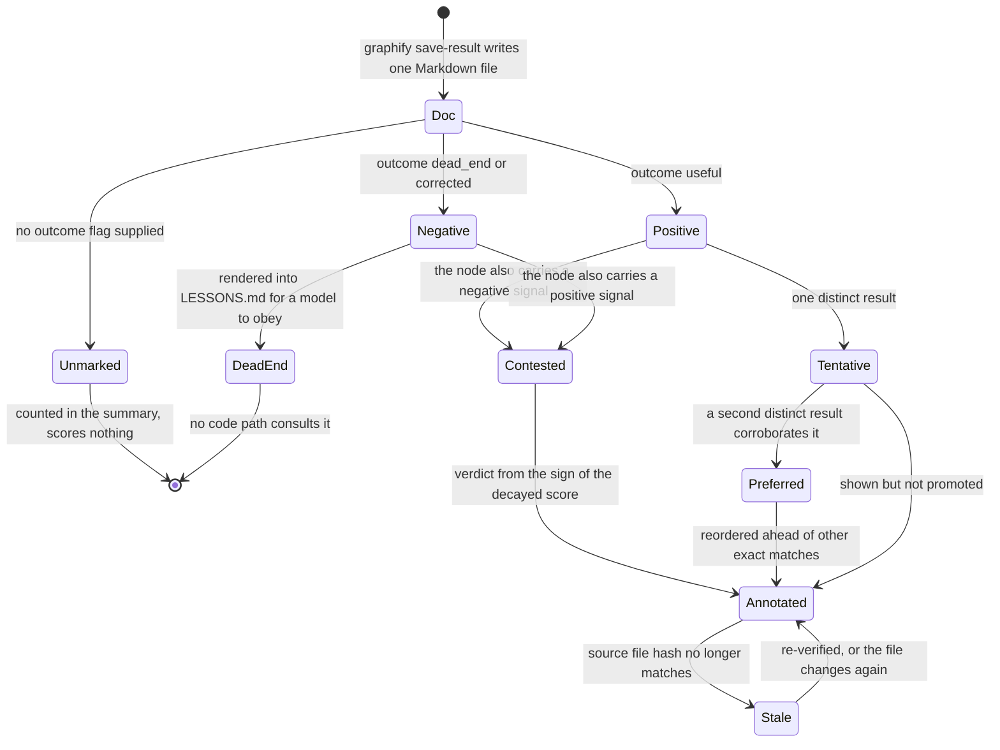

## 1. Executive Summary

Graphify is a **code-and-document knowledge graph** for AI coding assistants —
tree-sitter AST extraction into a traversable graph, deliberately not a vector
index. The memory system is a small layer bolted to the side of it, and it is
the reason this report exists: roughly 1,000 lines out of 15,959, in
`graphify/reflect.py` and one function in `graphify/ingest.py`.

The loop is simple to state. An agent answers a question from the graph and
calls `graphify save-result` with the question, the answer, the node labels it
cited, and an **outcome** — `useful`, `dead_end`, or `corrected`. That writes one
Markdown file into `graphify-out/memory/`. Later, `graphify reflect` reads every
such file, scores each cited node with a signed, time-decayed weight, and emits
two artifacts: a human-readable `LESSONS.md` for an agent to read at session
start, and a machine-readable `.graphify_learning.json` sidecar that annotates
the graph at query time.

Three things make it worth the visit.

**Corroboration is a gate, not a counter.** A node cited by one useful answer is
`tentative`; it becomes `preferred` only at two distinct results
(`_DEFAULT_MIN_CORROBORATION = 2`). The module docstring states the intent
directly — *"one save can't mint a trusted lesson."* The threshold is a
parameter, and a committed test asserts it is honoured rather than hardcoded.

**A lesson is re-checked against the file it is about.** Each sidecar entry
stores a `code_fingerprint`: the SHA-256 of the cited node's `source_file`.
`load_learning_overlay` recomputes that hash on **every read** and stamps
`stale: bool` per entry. The hash is content-only with no path mixed in, so a
sidecar committed to git stays valid across machines — this is designed to be
shared, and the staleness bias is stated as a design choice: file-level hashing
*"over-flags (any edit to the file marks every node in it stale) rather than
under-flags, which is the safe direction for a re-verify hint."*

**It has the test the atlas keeps asking for.**
`test_lessons_artifact_cannot_be_globbed_back_into_memory` is a committed
regression guard that the system's own generated `LESSONS.md` cannot re-enter as
a memory doc. Beside it, `test_header_is_cautious` asserts the artifact's header
contains *"verify before relying"* and does **not** contain *"reuse what
worked"*. A test on the register of your own generated prose is not something
this corpus has seen before.

The weakest part is the one the design most advertises. `dead_end` is described
in the agent-facing skill as *"the question/path led nowhere; don't re-derive it
next time"* — and no code path consults it. Dead ends are rendered into
`LESSONS.md` for a model to read and obey. A node cited *only* by dead ends is
correctly excluded from the source lists, which is real; the question itself is
advisory text. The second weakness is smaller and stranger: every memory doc is
written with `contributor: "graphify"` hardcoded, so on a shared graph a
correction has no author.

## 2. Mental Model

A memory here is **a record of how an answer turned out**, not a fact. The unit
is the Q&A doc; the belief is derived from the whole set of them on every
`reflect` run and is never stored as a claim about the world.

That separation is deliberate and stated in the source. The derived experiential
layer lives in `.graphify_learning.json`, a sidecar, with the comment: *"kept
separate from the durable structural truth in `graph.json` — no `learning_*`
fields are ever stamped into the graph itself."* The graph is what the code
says; the sidecar is what happened when someone used it. Delete the sidecar and
nothing about the project's structure is lost.

### How a thing becomes a belief

`save_query_result` (`graphify/ingest.py:274`) writes one file with YAML
frontmatter — `type`, `date`, `question`, `contributor`, optional `outcome`,
optional `correction`, and up to ten `source_nodes`. The outcome is written
**twice**: into the frontmatter, so `reflect` can aggregate it deterministically,
and into an `## Outcome` body section, so the signal survives into the graph on
the next semantic re-extraction. Two consumers, two representations, one write.

`aggregate_lessons` (`reflect.py:364`) then assigns each doc a sign — `+1` for
`useful`, `−1` for `dead_end` and `corrected`, `0` for unmarked — and a weight
from `_decay`, an exponential with a 30-day half-life. Each cited node
accumulates `sign × weight`, plus separate counts of distinct positive and
negative *results*. `_finalize_sources` splits them:

- **positive only, ≥ 2 results** → `preferred`
- **positive only, 1 result** → `tentative`
- **both signs** → `contested`, carrying a verdict of `useful` / `dead end` /
  `even` taken from the sign of the decayed score
- **negative only** → absent from all three lists

The decay is what makes `contested` decidable: a fresh dead end outweighs a
months-old useful, so the verdict is recency-weighted rather than a vote count.
Scores are rounded to nine digits specifically so sort order and the contested
verdict stay stable across platforms where `pow` differs in the last ULP.

When a graph is available, nodes that no longer exist in it are dropped —
existence in the artifact is a precondition for a lesson about it surviving.

### How a belief stops being one

Four ways, and only two of them are mechanical.

*Decay.* Every signal's weight halves every 30 days. Nothing is deleted; an old
`useful` simply stops outvoting anything.

*Contradiction.* One `dead_end` or `corrected` on a node that was `preferred`
moves it to `contested` immediately — the classification is by the *presence* of
both signs, not by the score. A reader sees `learning=contested` on that node
from the next query onward.

*Staleness.* `_is_stale` re-hashes the node's source file and compares. Changed,
vanished, or never-fingerprinted-but-has-a-file all return `True`. This does not
remove the lesson; it annotates it `stale`, which surfaces as
`learning=preferred:stale` in query output.

*Deletion.* There isn't any. No code path edits or removes a memory doc, and
`reflect` regenerates both artifacts wholesale from whatever files are present.
Forgetting means deleting a file by hand.

Nothing keys on the *answer*. A `corrected` doc records the right answer in a
`correction` field and demotes the nodes the wrong answer cited — but the wrong
value itself is never registered as rejected, so nothing prevents the same
answer being derived and saved again tomorrow. `dead_ends` come closest and are
explicitly excluded from the sidecar overlay: *"those stay query-scoped,
surfaced only in the report."*



## 3. Architecture

Graphify is a **Python CLI and a skill**, with no server, no database and no
network dependency on the memory path. `uv tool install graphifyy` then
`graphify install` registers a slash command with the assistant.

Everything lives in one directory beside the project:

```text
graphify-out/
├── graph.json                  the structural graph
├── .graphify_analysis.json     community detection
├── .graphify_learning.json     the work-memory sidecar
├── memory/                     one Markdown file per saved Q&A
└── reflections/LESSONS.md      the derived artifact an agent reads
```

`GRAPHIFY_OUT` relocates the whole tree, which is how worktrees and shared-output
setups are handled.

**Extraction** is tree-sitter AST for code — deterministic, local, no model —
with a semantic pass over docs, PDFs, images and video that does use the
assistant's model. Every edge is tagged `EXTRACTED` or `INFERRED`, which is a
provenance distinction on the *graph* rather than on memory, and a good one.

**The memory layer touches no model at all.** `reflect.py`'s docstring commits to
it: *"It is deterministic: no LLM, stable sort orders, byte-stable output for a
given input and a given `now`."* A committed test
(`test_sidecar_is_byte_identical_across_runs`) holds it to that.

**Background work** is git hooks. A post-commit and a post-checkout hook rebuild
the code graph and then, *"best-effort; never fails the hook"*, refresh
`LESSONS.md` if any memory docs exist. Both are wrapped in `try/except Exception:
pass` around the reflect call specifically, so a memory failure cannot break a
commit. The rebuild itself takes a flock and a configurable timeout.

There is a deliberate placement decision worth noting: `LESSONS.md` lands in
`reflections/` rather than in the exported wiki, because *"`graphify export wiki`
deletes every `wiki/*.md` on each run — a lessons file written there would be
clobbered on the next export."*

### Deployment and ergonomics

Nothing has to be running. No database, no embedding server, no API key for the
memory path — the code half is fully local, and only the semantic pass over
non-code documents reaches a model. Install is one command; first run is
`/graphify .` in the assistant.

The store is **entirely human-readable and repairable by hand**: Markdown files
you can edit or delete, and a JSON sidecar that is regenerated from them. The
sidecar is designed to be committed — the content-only hash exists so it stays
valid across checkouts — which makes the work memory shareable through the same
mechanism as the code.

The cost is that everything is per-directory. Two projects share nothing, and
there is no way to ask a question across them.

## 4. Essential Implementation Paths

**Write.** `graphify save-result` → `cli.py:1087` → `save_query_result`
(`ingest.py:274`). Validates the outcome against `OUTCOMES`, slugs the question
into a timestamped filename, hand-builds YAML frontmatter (no PyYAML
dependency), writes the file. Never reads existing memory.

**Aggregate.** `reflect()` (`reflect.py:564`) → `load_memory_docs` →
`parse_memory_doc` (a hand-written parser for the same YAML subset the writer
emits, so foreign `.md` files are skipped cleanly) → `aggregate_lessons`
(`reflect.py:364`) → `_record_node` / `_finalize_sources`.

**Render.** `render_lessons_md` (`reflect.py:489`) → `reflections/LESSONS.md`,
grouped by graph community when `.graphify_analysis.json` is present, flat
otherwise.

**Project.** `build_learning_overlay` (`reflect.py:758`) resolves each cited
label to exactly one canonical node id — ambiguous citations are skipped —
attaches status, score, uses, `last`, `source_file`, `code_fingerprint` and up to
five provenance entries, then `write_learning_sidecar` emits it with
`sort_keys=True, indent=2`.

**Read.** `serve.py:52` loads the sidecar onto the graph at load time;
`serve.py:927` appends `learning={status}{':stale'}` to each rendered node; and
`serve.py:1128` moves a `preferred` node to the front of the exact-match list.
That last line is the only place memory changes *ranking* rather than
*presentation*.

**Gate.** `lessons_fresh` (`reflect.py:527`) compares the output's mtime against
every input's, so `reflect --if-stale` is a no-op when the git hook already
refreshed the file. Its docstring is careful about what it is claiming:
*"it only gates whether to recompute, not what the recomputation produces (that
stays deterministic)."*

**Hooks.** `hooks.py:142` and `hooks.py:191` — the post-commit and post-checkout
refresh, each in its own suppressed try block.

## 5. Memory Data Model

The stored record is a file. Frontmatter carries `type`, `date` (ISO 8601 UTC),
`question`, `contributor`, and optionally `outcome`, `correction` and
`source_nodes` (capped at ten). The body repeats the question, the answer, the
outcome and the cited nodes as Markdown.

The derived record is a sidecar entry keyed by canonical node id:

| Field | Meaning |
| --- | --- |
| `status` | `preferred` / `tentative` / `contested` |
| `score` | signed, decayed, rounded to nine digits |
| `uses` | distinct positive results |
| `neg` | distinct negative results (contested only) |
| `verdict` | `useful` / `dead end` / `even` (contested only) |
| `last` | most recent event date |
| `source_file` | the node's file, as recorded in the graph |
| `code_fingerprint` | SHA-256 of that file's content |
| `provenance` | up to five recent `{q, date, outcome}` entries |

**Provenance is capped at five and is recent-first**, which is an explicit
trade: the trail exists to explain a current status, not to be an audit history.
Only `useful` and `corrected` events are recorded in it — the comment calls this
*"the experiential trail an agent cares about — what cited this node, and how it
turned out."*

**Scoping is a directory.** One `graphify-out/` per project. There is no user,
team, agent or tenant key anywhere in the read path. `contributor` exists in the
frontmatter and in `ingest()` for fetched URLs, but `save_query_result`
**hardcodes it to the literal `"graphify"`**, and no code filters on it. On a
graph shared through git — which the content-only hash is explicitly designed to
enable — every correction is anonymous.

**Temporal modelling is record-time only.** `date` is when the answer was saved.
There is no notion of when a fact was true, and the decay function operates
purely on the age of the record.

## 6. Retrieval Mechanics

Two surfaces, and they work differently.

**`LESSONS.md` is read wholesale at session start.** The skill instructs the
agent to run `graphify reflect --if-stale` and then read the file, which lists
preferred sources ("start there"), known dead ends ("skip them") and prior
corrections. There is no query, no ranking against the current question, and no
token budget — the whole artifact enters context. Its size is bounded only by a
per-section `k` in `_render_bucket`.

**The sidecar annotates query results inline.** Every node in a query result
carries a `learning=` suffix, and a `preferred` node that matches exactly is
reordered to the front. This is the authority-over-similarity move: a node's
standing comes from how it *performed*, not from how it scored against the query
string.

Failure modes worth naming:

- **The dead-end list is advisory.** It reaches the model as prose in
  `LESSONS.md` and nothing enforces it. The skill says "skip them"; the code
  says nothing.
- **Citation resolution is by label, and ambiguity is dropped silently.**
  `_resolve_canonical_id` returns `None` when a cited label maps to more than one
  node, and `_add` skips it. A lesson about a common function name may simply not
  appear.
- **File-level fingerprinting over-flags by design.** Any edit anywhere in a file
  marks every lesson about every node in it stale. Stated as the safe direction,
  and it is — but on a large file it means the annotation is stale most of the
  time.
- **`LESSONS.md` grows without a retention policy.** Old memory docs are never
  pruned; decay reduces their weight to near-nothing while `reflect` still parses
  every one of them on every run.

## 7. Write Mechanics

Writes are **agent-invoked and synchronous**, and cost one file write. There is
no extraction, no embedding, no model call, and therefore no lag: a saved result
is visible to the next `reflect`, and the next `reflect` is a full recomputation
over a directory of small Markdown files.

The outcome flag is **optional**, and this is the design's soft centre. The skill
tells the agent to add one, but `save_query_result` accepts `None`, and an
unmarked doc contributes to the counts and scores nothing. Nothing measures how
often the flag is supplied in practice, and the whole trust layer is downstream
of a model remembering to pass an argument.

Deduplication is by question: `_dedupe_by_question` collapses repeated saves of
the same Q&A in the dead-ends and corrections lists, with a comment recording
that the same Q&A saved twice used to duplicate lines. Node scoring counts
distinct *documents*, not citations — `test_corroboration_counts_distinct_docs_not_citations`
pins it, which is the difference between two independent confirmations and one
answer citing the same node twice.

Conflict handling is the `contested` state and nothing more. There is no merge,
no supersession pointer, and no way to mark one doc as replacing another.

### Operational cost

Nothing on the write path blocks on anything. `reflect` is O(all memory docs) and
runs on a git hook or on demand; on a corpus of a few hundred saved answers that
is milliseconds, and the `--if-stale` gate exists so a session-start run costs
almost nothing when the hook already did it.

The read cost is the honest one. `LESSONS.md` is injected in full at session
start with no budget, which is the same unbounded-injection shape this atlas
criticises elsewhere — the difference is that the artifact is small because the
signal is sparse, not because anything caps it. And because the file is read at
session start rather than per turn, it sits in the stable part of the prompt
rather than invalidating a prefix cache on every request.

## 8. Agent Integration

Graphify ships the same skill compiled into **fourteen harness formats** —
`agents`, `amp`, `claude`, `claw`, `codex`, `copilot`, `droid`, `kilo`, `kiro`,
`opencode`, `pi`, `trae`, `vscode`, `windows` — plus an always-on rules file for
`CLAUDE.md`, `AGENTS.md`, `GEMINI.md`, Kiro steering and VS Code instructions.
The memory contract is therefore *prose in a skill file*: the agent is told to
call `save-result` with an outcome, and told to read `LESSONS.md` first.

The agent has complete agency and no obligation. It decides whether an answer is
worth saving, which nodes it cited, and which outcome applies. Nothing validates
the citation list against what the query actually returned.

There is no MCP server for the memory layer. Integration into another harness
means writing another skill file, which is a fifteen-minute job and the reason
fourteen of them exist.

## 9. Reliability, Safety, and Trust

**The trust states are real and they reach the reader.** `preferred`,
`tentative` and `contested` are stored fields, `tentative` genuinely withholds
(the docstring: *"seen useful only once (not yet corroborated)"*), and both the
status and the staleness flag are rendered next to the node in query output. The
atlas grants `trust_state` on that basis.

**Verification is against the artifact, not by judgement.** The staleness check
is a content hash, computed the same way by the writer and the reader — a
comment explains that this is why a freshly-written verdict on unchanged code is
never spuriously stale. No model adjudicates anything, anywhere in this layer.

**The self-ingestion guard is the standout.** `LESSONS.md` has no frontmatter, so
`parse_memory_doc` rejects it and `load_memory_docs` skips it even if it lands
inside `memory/` — and there is a committed test asserting exactly that, named
for the failure it prevents. Two systems in this atlas had to fix this bug after
shipping it; this one has a regression guard for it.

**Prompt-injection exposure is real but narrow.** Memory docs contain a model's
own answer text, saved verbatim, and `LESSONS.md` is injected without fencing or
a "this is data" wrapper. An answer that quoted a hostile document would carry
that text into the next session's context. Against that, the content is the
agent's own prose about its own project, and nothing in the store came from an
untrusted third party by default.

**Data-loss risks** are mild by construction: files are append-only, never
edited, and every derived artifact is rebuildable from them. The real risk is the
opposite — nothing is ever removed, and there is no retention policy.

**What it cannot represent:** who said something (the hardcoded contributor), when
a fact was true (record time only), and that a specific value must never come
back (no tombstone).

## 10. Tests, Evals, and Benchmarks

The suite is large — **3,308 test functions across 177 files, 59,500 lines
against 15,959 lines of source**, a ratio near four to one. `tests/test_reflect.py`
alone carries 58 tests over 958 lines for a roughly 900-line memory layer.

What is pinned, in the order I found it convincing:

- **`test_lessons_artifact_cannot_be_globbed_back_into_memory`** — the generated
  artifact must not be re-ingestible as evidence, with a docstring naming it a
  regression guard.
- **`test_header_is_cautious`** — asserts `"verify before relying"` is in the
  rendered header and `"reuse what worked"` is not. A test on the *register* of
  generated memory prose.
- **`test_negative_only_node_absent_from_sources`** — a node carrying only
  negative signals must not appear in any source list. This is a committed
  negative-retrieval assertion, and it is why the atlas grants `negative_eval`.
- **`test_corroboration_threshold_promotes_only_repeated_nodes`** and
  `test_min_corroboration_is_honored_not_hardcoded`.
- **`test_recency_decides_contested_verdict`** and `test_half_life_actually_feeds_decay`.
- **`test_node_existence_gate_drops_stale_nodes`**, end-to-end as well as at unit
  level.
- **`test_loader_marks_entry_stale_when_source_file_changes`**, plus three tests
  for path-resolution edge cases that could produce a *spurious* stale.
- **`test_sidecar_is_byte_identical_across_runs`** and
  `test_render_byte_stable_across_independent_aggregations`.
- **`test_second_session_benefits_from_the_first`** — the loop as a whole.

`BENCHMARKS.md` exists and concerns graph extraction, not memory. There is no
retrieval-quality evaluation of the lessons layer and no measurement of how often
an outcome flag is actually supplied — which is the number that decides whether
any of this fires in practice. I inspected these tests; I did not run the suite.

## 11. For Your Own Build

### Steal

**Withhold a lesson until a second, independent result confirms it.** One
positive signal makes something `tentative` and visible; two make it `preferred`
and promoted in ranking. Counting *distinct results* rather than citations is the
part that matters, and it is one `Counter` and one comparison.

**Score signals signed and time-decayed, then let the sign settle contradiction.**
A 30-day half-life means a fresh dead end outweighs a months-old success without
any explicit conflict-resolution logic. Round the score before comparing, so the
verdict is stable across platforms — that is a two-line detail with a real bug
behind it.

**Hash the artifact a memory is about, and recompute it on read.** Store the
content hash with the memory; recompute at load; stamp `stale`. Content-only, no
path, so a committed sidecar survives a different checkout. Bias the check toward
over-flagging and say so in the comment.

**Keep the derived experiential layer out of the structural store.** A sidecar
next to `graph.json` rather than fields inside it means the expensive artifact
stays canonical and the cheap one can be deleted and rebuilt. It also makes
"what does the code say" and "what happened when we used it" separately
answerable.

**Write a test that your own generated memory artifact cannot be re-ingested as
evidence.** It costs five lines. Two systems in this atlas shipped that bug and
fixed it afterwards.

### Avoid

**Don't ship a "don't re-derive this" list that no code path consults.** If the
only thing standing between a known dead end and a repeated dead end is a model
reading a Markdown bullet and choosing to obey it, the mechanism is a prompt, not
a memory. Either filter on it or describe it as advice.

**Don't make the trust signal an optional argument.** The entire epistemic layer
here is downstream of an agent remembering to pass `--outcome`. If the signal is
load-bearing, derive it from something observable or require it; an optional flag
that a model supplies when it feels like it will be supplied unevenly, and
nothing here measures how unevenly.

**Don't hardcode the author field on a record you intend to share.** A shared
store where every entry claims the same contributor cannot answer "who decided
this was wrong", which is the first question anyone asks of a correction.

**Don't let a lessons file grow without a retention policy just because decay
makes old entries cheap.** Decay reduces an old signal's *weight*; it does not
reduce the cost of parsing it, and it does not stop the artifact from growing.

### Fit

This suits **one developer, one repository, and an agent that answers questions
from a code graph** — which is a narrow target, and the memory layer is honestly
scaled to it. Nine hundred lines, no service, no model, a store you can read in
an editor, and a rebuild from scratch that costs milliseconds. If that is your
situation, the corroboration gate and the staleness check are worth having and
would take an afternoon to port.

It is not a general agent memory system and does not present itself as one. The
unit of memory is "how a graph query turned out", so it can remember that a
module is a good place to look and cannot remember that you prefer tabs. Anyone
looking for preferences, entities, a user profile, or memory that survives
outside one project directory is in the wrong repository — and would be better
served pairing this with something else than trying to widen it, because the
narrowness is what keeps it deterministic.

The team case is the interesting one and the least finished. The content-only
hash and the committable sidecar say someone thought about sharing this through
git; the hardcoded `contributor` and the absence of any scope key say nobody has
yet had to answer what happens when two people disagree.

## 12. Open Questions

- **How often is `--outcome` actually supplied?** Everything here is downstream
  of it and nothing measures it. A count of marked versus unmarked docs in a real
  `memory/` directory would settle whether this is a working loop or a
  well-tested one.
- **Does the `learning=` annotation change model behaviour?** The sidecar reaches
  the prompt as a suffix on a node line. Whether a model attends to
  `learning=contested:stale` is unmeasured, and would need a run rather than a
  read.
- **Was the dead-end list ever intended to be enforced?** The skill's wording
  ("don't re-derive it next time") reads like a promise the code does not keep;
  the issue history would say whether that is a gap or a decision.
- **What happens on a shared graph when two contributors disagree?** The
  mechanism resolves it by recency-weighted score with no notion of who, which
  may be intended or may simply not have come up.

## Appendix: File Index

**Write path** — `graphify/ingest.py` (`save_query_result`, `OUTCOMES`),
`graphify/cli.py:1087`.

**Aggregation and scoring** — `graphify/reflect.py`: `parse_memory_doc`,
`load_memory_docs`, `_decay`, `_record_node`, `_finalize_sources`,
`aggregate_lessons`, `_dedupe_by_question`.

**Derived artifacts** — `graphify/reflect.py`: `render_lessons_md`,
`build_learning_overlay`, `write_learning_sidecar`, `load_learning_overlay`,
`_is_stale`, `_content_hash`, `_code_fingerprint`, `_provenance_for`.

**Read path** — `graphify/serve.py:52` (overlay load), `:927` (annotation),
`:1128` (preferred reordering); `graphify/exporters/html.py:475`.

**Gate and background** — `graphify/reflect.py:527` (`lessons_fresh`),
`graphify/hooks.py:142` and `:191` (post-commit / post-checkout refresh).

**Agent surface** — `graphify/skills/*/references/query.md` (fourteen harnesses),
`graphify/always_on/*.md`.

**Tests** — `tests/test_reflect.py` (58 tests, 958 lines).

## History

**2026-07-31** — [`4fe11092ccbe9f543608f140c790f68d5d83cae4`](https://github.com/Graphify-Labs/graphify/commit/4fe11092ccbe9f543608f140c790f68d5d83cae4) — first reading.
