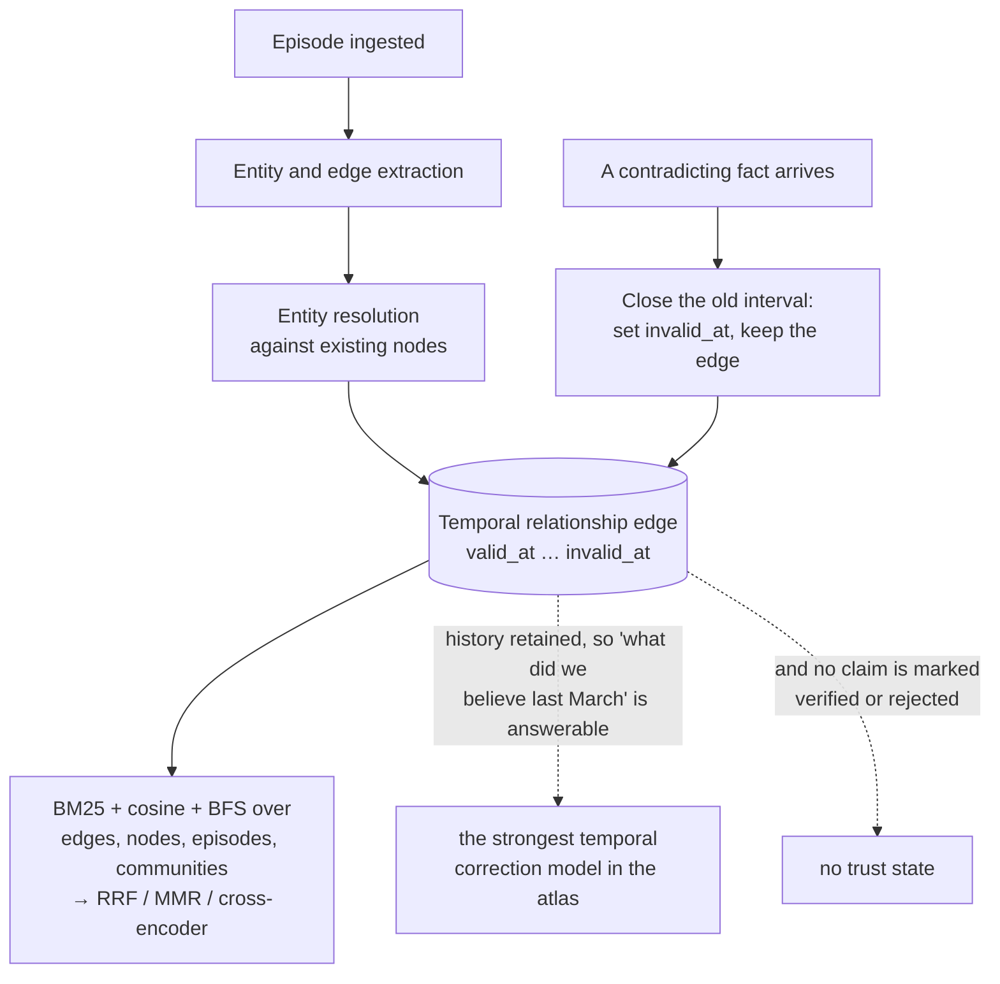

## 1. Executive Summary

Graphiti is a library for building an incrementally updated temporal knowledge graph from episodes such as messages, events, or documents. Its defining feature is bi-temporal memory: it distinguishes when an episode or fact was true (`valid_at`/`invalid_at`) from when the graph learned or expired it (`created_at`/`expired_at`).

This is a genuinely different answer to agent memory. Graphiti does not primarily produce a bag of user facts. It preserves episodes, resolves entities, extracts typed relationships, invalidates contradicted edges, and searches across facts, entities, episodes, and communities. The graph remains queryable as history rather than overwriting the past with the latest summary.

Its strengths—temporal correctness, rich retrieval, custom ontology support—also create its risks. Ingestion is LLM-heavy, graph-database operations are operationally substantial, and entity/edge deduplication mistakes can restructure memory globally. It is best treated as a context-graph engine, not a drop-in truth store.

## 2. Mental Model

An episode is immutable evidence. Entities are normalized concepts mentioned by episodes. Entity edges are extracted claims, with temporal validity and links back to their source episodes. Communities and sagas provide higher-level organization and summaries.

```text
episode(content, reference_time, group_id)
  -> extract + resolve entity nodes
  -> extract + dedupe entity edges
  -> assign valid_at / invalid_at
  -> invalidate contradictory older edges
  -> connect episode to entities and episode chain
  -> search edges + nodes + episodes + communities
```

Two clocks answer two different questions:

- “When was this believed/recorded?” uses `created_at` and `expired_at`.
- “When was this true in the represented world?” uses `valid_at` and `invalid_at`.

That distinction makes backfilled and corrected history representable without pretending ingestion time equals event time.



## 3. Architecture

Core areas:

- `graphiti_core/graphiti.py`: public orchestrator for episodes, bulk ingestion, search, removal, sagas, and indices.
- `graphiti_core/nodes.py`: episodic, entity, community, and saga node types.
- `graphiti_core/edges.py`: episodic, entity, and community edge types plus persistence.
- `graphiti_core/utils/maintenance/`: extraction, resolution, dedupe, invalidation, and graph mutation.
- `graphiti_core/search/`: configurable multi-scope search and reranking recipes.
- `graphiti_core/driver/`: Neo4j, FalkorDB, Kuzu, and Amazon Neptune adapters.
- `graphiti_core/llm_client/`, `embedder/`, and `cross_encoder/`: model abstractions.
- `mcp_server/` and `server/`: agent-facing service layers.

The design separates graph-domain objects from driver queries and LLM clients. Search receives a `GraphitiClients` bundle, while ingestion orchestration uses the same explicit clients. This supports backend substitution, though not every backend has identical query or index capabilities.

## 4. Essential Implementation Paths

- Single ingestion: `Graphiti.add_episode()` in `graphiti_core/graphiti.py`.
- Bulk ingestion: `Graphiti.add_episode_bulk()`.
- Episode model: `EpisodicNode` in `graphiti_core/nodes.py`.
- Entity/fact models: `EntityNode` and `EntityEdge` in `nodes.py` and `edges.py`.
- Entity extraction/resolution: `utils/maintenance/node_operations.py`.
- Relationship extraction: `extract_edges()` in `utils/maintenance/edge_operations.py`.
- Contradiction and temporal invalidation: edge resolution/invalidation functions in `edge_operations.py`.
- Search entrypoints: `Graphiti.search()`, `Graphiti.search_()`, and `search()` in `search/search.py`.
- Search presets: `search/search_config_recipes.py`.
- Episode removal: `Graphiti.remove_episode()`.
- Database constraints: driver `build_indices_and_constraints()` implementations.

## 5. Memory Data Model

`EpisodicNode` stores content, episode type, source description, `valid_at`, `created_at`, and `group_id`. Episodes can represent messages, text, or JSON.

`EntityNode` stores a normalized name, summary, labels/types, attributes, embedding, and scope. Optional application-defined Pydantic models constrain entity attributes.

`EntityEdge` is the principal fact record:

- source and target entity UUIDs;
- relationship name and natural-language fact;
- source episode UUIDs;
- embedding and custom attributes;
- `valid_at`, `invalid_at`, `created_at`, and `expired_at`;
- `group_id` scope.

`EpisodicEdge` links an episode to mentioned entities. Community nodes/edges group the entity graph. Saga nodes group episodes and maintain summaries with both wall-clock and episode-time watermarks.

## 6. Retrieval Mechanics

Graphiti searches four scopes concurrently: entity edges, entity nodes, episodes, and communities. Each scope can enable a combination of:

- BM25/full-text search;
- cosine similarity;
- graph BFS from explicit or discovered origins.

Results are fused and reranked with configurable recipes: RRF, maximal marginal relevance, cross-encoder scoring, node distance, or episode-mention signals. `EDGE_HYBRID_SEARCH_RRF` is the default high-level recipe used by the convenient `Graphiti.search()` path.

Filters support group IDs, dates, entity labels, and edge types. Search can also center on a node or begin BFS from supplied origins. This is more expressive than ordinary fact-vector recall, but query behavior depends heavily on choosing the right recipe and graph scope.

## 7. Write Mechanics

`add_episode()` saves an episode, obtains recent context, extracts entity nodes and facts, resolves nodes against the existing graph, embeds new material, and persists nodes/edges. Extracted relationships carry the episode UUIDs that support them.

Temporal edge handling is the standout step. Relationship extraction can produce `valid_at` and `invalid_at`; maintenance code compares a resolved edge with existing candidates and expires or bounds overlapping claims. An older fact can remain in the graph with a closed validity interval instead of being deleted.

Bulk ingestion reduces calls through combined extraction but documents a tradeoff: it omits some edge invalidation/date extraction behavior found in single-episode insertion. Consumers cannot assume the faster path is semantically identical.

## 8. Agent Integration

The Python library is the primary surface. MCP and server packages expose graph operations to agents and applications. `group_id` is the main namespace and must be supplied consistently.

Search returns structured graph objects rather than a prebuilt prompt block. That is flexible for applications that want facts, entity summaries, or source episodes separately, but safe formatting, token budgeting, and injection fencing remain application responsibilities.

## 9. Reliability, Safety, and Trust

Strong safeguards:

- source episode UUIDs on extracted facts;
- retention of invalidated history;
- explicit event-time and ingestion-time fields;
- group-scoped reads and writes;
- constraints and indexes per graph backend;
- bounded concurrency helpers and retry-capable model clients;
- validation of LLM-returned entity names against resolved nodes;
- dropping self-edges;
- extensive driver, search, extraction, dedupe, and temporal tests.

Trust remains evidence-oriented rather than verification-oriented. A fact can be well sourced and still false. LLM entity resolution can merge distinct real-world entities; a bad merge then contaminates many neighboring facts. Group IDs are a filter boundary, but authorization must be enforced by the service around the library.

## 10. Tests, Evals, and Benchmarks

The repository has unit and integration coverage for graph operations, entity/edge extraction, deduplication, temporal invalidation, search recipes, filters, drivers, bulk ingestion, episode deletion, and sagas. Many meaningful tests require a live graph database and model substitutes.

There are benchmark and evaluation utilities, but measured quality depends on the LLM, embedder, graph backend, ontology, and dataset. The source gives strong evidence for mechanics; it does not make temporal extraction or entity resolution objectively correct.

## 11. For Your Own Build

### Steal

- Store episodes as evidence before graph-derived facts.
- Distinguish transaction time from real-world validity time.
- Invalidate an old fact by closing its interval rather than erasing history.
- Keep source episode IDs on every derived relationship.
- Search facts, entities, episodes, and communities as separate scopes.
- Make retrieval recipes explicit and task-selectable.
- Validate LLM-extracted relationships against resolved entity identities.
- Maintain both wall-clock and event-time watermarks for backfilled summaries.

### Avoid

- LLM errors can mutate graph topology, not just one text record.
- A mistaken entity merge has wide blast radius.
- Graph database and model dependencies make local operation heavier than file/SQLite memory.
- Single and bulk ingestion do not provide identical temporal semantics.
- Search configuration has many degrees of freedom and can be hard to evaluate.
- No built-in candidate/verified/rejected trust state.
- Prompt assembly and authorization are outside the core library.

### Fit

Borrow Graphiti when time and relationships are central to the domain: changing employment, ownership, preferences, plans, incidents, or other facts that have valid intervals. The bi-temporal edge model and evidence links are more valuable than copying the whole ingestion pipeline.

For simpler personal memory, a graph may be needless complexity. Preserve source events and add validity fields to ordinary records first. Adopt entity resolution and graph traversal only when cross-entity questions measurably require them.

## 12. Open Questions

- How often does automatic edge invalidation close the wrong historical fact?
- What recovery path splits entities after an incorrect deduplication?
- How should applications authorize `group_id` rather than merely filter by it?
- Which search recipe performs best for conversational recall versus graph investigation?
- How should bulk ingestion advertise its reduced temporal semantics to callers?
- Can source episodes be deleted for privacy without leaving unsupported derived edges?

## Appendix: File Index

- `graphiti_core/graphiti.py`
- `graphiti_core/nodes.py`
- `graphiti_core/edges.py`
- `graphiti_core/utils/maintenance/node_operations.py`
- `graphiti_core/utils/maintenance/edge_operations.py`
- `graphiti_core/utils/maintenance/combined_extraction.py`
- `graphiti_core/utils/maintenance/graph_data_operations.py`
- `graphiti_core/search/search.py`
- `graphiti_core/search/search_config.py`
- `graphiti_core/search/search_config_recipes.py`
- `graphiti_core/search/search_filters.py`
- `graphiti_core/driver/`
- `mcp_server/`
- `tests/`
