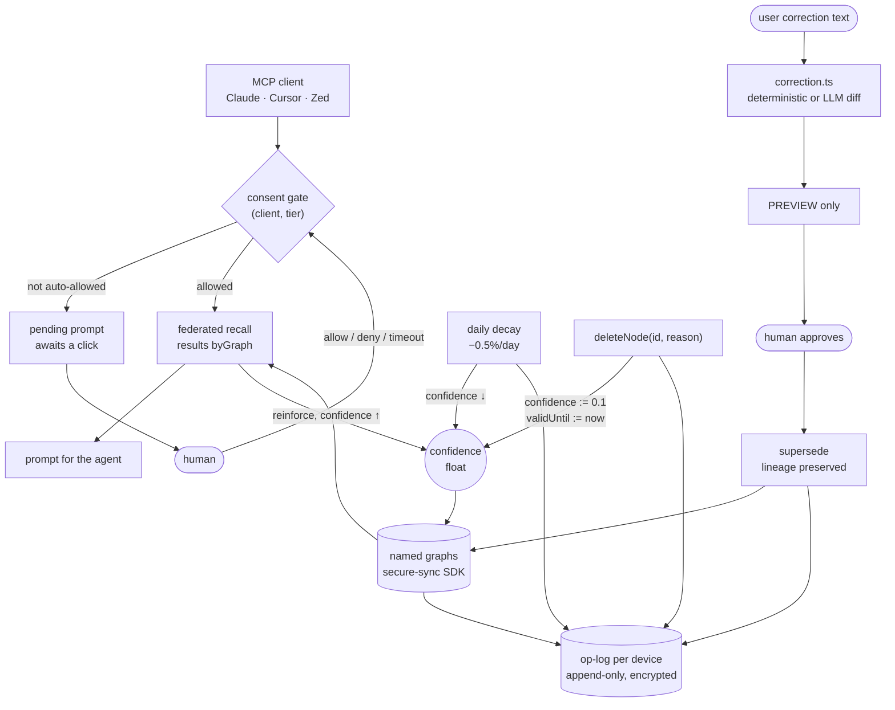

## 1. Executive Summary

Graphnosis is a local-first encrypted memory product — a Tauri desktop app, a
sidecar, an MCP server on three transports, a VS Code extension and a docs site,
about 111,000 lines of TypeScript in the sidecar alone, 984 commits since 11 May
2026. It is licensed **FSL-1.1-Apache-2.0**: source-available now, Apache 2.0
later, which is a caveat a reader should hold rather than a reason to skip it.
Two papers ship with DOIs.

The product framing is a "dual-graph cortex" with typed edges, skills as
walkable SOPs, and personas that join a room when mentioned. The mechanisms this
atlas cares about sit underneath that, and three of them are worth the visit.

**The consent gate blocks on a human, and cannot leak its own answer.** When an
MCP client asks for a tier that policy does not auto-allow, the server registers
a pending prompt, pushes it to the frontend, and *waits* for a click —
allow-for-a-duration, deny, or timeout. The headless fallback is a phrase the
user types, and the phrase is HMAC-derived per tier over a rolling window,
compared in constant time, and **never returned over MCP or written to a log**.
A client that wanted to grant itself access cannot read the secret out of the
system it is asking.

**A correction is a preview.** Two paths — a deterministic one that recalls the
closest match and supersedes it, and an LLM-assisted one that proposes a
multi-part diff — and both stop before writing: *"the diff is only a PREVIEW —
nothing is written until the user reviews and approves it."* The deterministic
path exists so the feature works with no model at all, and the file says why
that matters: recall is deterministic, "pick the top hit" is deterministic, and
`supersede` preserves lineage.

**Contradiction detection returns a three-value verdict, not a boolean.**
`genuine_contradiction`, `temporal_supersession`, `negation_artifact` — a
distinction most detectors in this corpus cannot draw, and the module is
deterministic with no model call.

**Weakest, and it is structural:** deletion is a number. `deleteNode(id, reason)`
drops `confidence` to `0.1` and sets `validUntil`. That is the same field daily
decay lowers and reinforce-on-recall raises, so *deleted*, *doubted* and
*unused* are one scalar. The adapter is honest about it — *"the node stays for
audit. We surface that semantics rather than hiding it"* — and the honesty does
not make the field able to carry three meanings at once.

## 2. Mental Model

```text
MCP client ──► consent gate ──► [ human clicks allow / deny ]  ◄── blocking
                   │
                   ▼
             federated recall ──► results byGraph ──► prompt
                   ▲
   graphs ─────────┘        every mutation ──► op-log (encrypted, per device)
     │                                              op + before + after + reason
     ▼
  correction ──► diff PREVIEW ──► [ human approves ] ──► supersede (lineage kept)

  daily: decay ↓ confidence     recall: reinforce ↑ confidence
  delete: confidence := 0.1     ← the same field as both of the above
```

The design's centre of gravity is **the human in the loop, twice**: once before
a client may read, once before a correction may write. Almost everything else —
decay, reinforcement, contradiction scanning, duplicate detection, skill
training — is designed to *produce a queue for that human* rather than to act.
Temporal decay states the intent directly: memories drift *"into the review
deck's low-confidence queue where the user can confirm or dismiss them
deliberately"*, and decay is deliberately slow *"so users don't see memories
vanishing."*

## 3. Architecture



**Runtime.** A Tauri desktop shell over a Node sidecar that owns everything: the
graphs, the MCP servers (stdio, HTTP, socket), a relay, connectors, embedding
and PDF workers, and the schedulers. `host.ts` and `ipc.ts` are about 11,000
lines each, `mcp-server.ts` 7,700, `skill-trainer.ts` 5,700, `brain-engine.ts`
3,600.

**Persistence is delegated, and this is the boundary to state plainly.** The
graph store, its encryption and the op-log codec are
`@nehloo-interactive/graphnosis-secure-sync`, pinned from GitHub at `v0.4.1` —
a non-registry dependency, flagged as such by the screen, and not present in
this tree. So the node model, the crypto and the sync protocol were not read
here. What this repository contains is the layer above: policy, correction,
contradiction, consent, scheduling, and the MCP surface.

**One thing in that layer is a direct answer to a limit of the dependency.**
`oplog-safe-read.ts` exists because both the SDK's reader and this app's earlier
one called `fs.readFile()` on a whole `.oplog` file, which fails with ENOMEM once
a long-lived device file reaches multi-gigabyte size. The replacement indexes
chunk headers with small positional reads and decrypts one chunk at a time,
bounding memory to the largest single flush batch. The module is explicit that
it mirrors the SDK's wire format deliberately because *"we can't change the SDK's
own reader (it's a pinned external dependency)"*. Writing a memory-safe
substitute beside a dependency you cannot patch, and saying so, is the right
handling.

## 4. Essential Implementation Paths

**The consent gate.** `consent-prompts.ts` is an in-process registry of pending
prompts shared between the MCP server (registers and awaits) and IPC (resolves).
A choice is `{action: 'allow', durationMs}`, `{action: 'deny'}` or
`{action: 'timeout'}` — the duration on the allow is what makes "Allow for an
hour" expressible rather than a permanent grant. Two canonical tiers,
`deidentified` and `sensitive`, with a legacy `personal` normalising into the
first.

**The consent phrase.** `generateConsentPhrase(hmacKey, tier)` derives a phrase
from an HMAC over `tier:slot` where the slot is a time window — shorter for
`sensitive` — and `validateConsentPhrase` compares in constant time and accepts
the previous window as well, which is the standard tolerance for a human typing
across a boundary. The comment carries the property that matters: *"Never logged
or returned via MCP."*

**Correction.** `correction.ts` picks its path by whether a local LLM is
configured. The deterministic default recalls the single closest match and
supersedes it, or adds the correction when nothing matches. The LLM path parses
a multi-part diff of edit / supersede / delete / add across candidates, and the
Zod schema is deliberately lenient on input because *"small local LLMs treat 'no
value' inconsistently"* — omitting a key, emitting JSON `null`, or emitting an
empty string — and rejecting the whole diff over any of those *"throws away an
otherwise-valid proposal and surfaces as a confusing Zod error banner."* A
preprocess coerces `null` to `undefined` so the output type stays clean. That is
the right place to absorb model sloppiness: at the parser, with the reason
written down, rather than in the consumer.

**Contradiction.** `contradiction-utils.ts` is deterministic and its regexes
carry their own precision history. `IDENTITY_RE` matches "always" / "never" /
"no longer" only when first-person-anchored, because *"bare 'always'/'never'
anywhere in a snippet was a false-positive source, so they no longer match
standalone"*; `WEAK_ENTITY_RE` drops bare years, money and dates; and a
`COMMON_TERM_ENTITIES` set removes words that *"appear in almost every note"*
from pairing. A heuristic that records which of its own matches were wrong is
one somebody has run against a real corpus.

**The write-authority rule.** `ghampus-memory-write-policy.ts` states a locked
fact: specialist personas *"may discuss and propose remembers; they do not
autonomously write cortex memory."* Only the orchestrator may write without an
explicit ask, and an external MCP client writing because the user asked in that
client counts as explicit user intent rather than agent autonomy. Keying write
authority on *which agent is speaking* is uncommon in this corpus, where a store
usually cannot tell one caller from another.

## 5. Memory Data Model

A node carries text, a `confidence` float, an optional `validUntil`, a source
kind, and classification metadata whose `classificationLabelId` resolves through
a schema to an `internalTier` that policy reads. The node type itself is the
SDK's; the adapter surfaces `confidence` and `validUntil` and states the
deletion semantics rather than wrapping them.

**Three meanings share one float, and that is the report's main reservation.**
Daily temporal decay lowers `confidence` by 0.5%. Reinforce-on-recall raises it.
`deleteNode` sets it to `0.1`. So a node the user deleted, a node nobody has
recalled in a year, and a node the system was never sure about are the same
value, distinguishable only by whether `validUntil` happens to be set. The
rubric's phrasing for the withheld mark fits exactly: a confidence number
answers *how sure* and a state answers *may this be acted on*, and a system that
collapses them cannot say "I have this on record and do not believe it."

**A separate axis exists and governs a different question.** The sensitivity
tier and classification label decide *disclosure* — which client may see the
memory, and whether a consent prompt fires. That is a real, discrete, enforced
field, and it is not an epistemic status, which is why it earns the consent gate
credit in section 9 rather than the trust mark.

**No tombstone.** Deletion is soft and the row remains, but nothing keys on the
*value*, so the same text can be re-ingested by a connector on the next sweep and
lands as a new node.

## 6. Retrieval Mechanics

Recall is federated across named graphs and returns results grouped `byGraph`,
with the prompt assembled from them. Around it: an embedding queue that
serializes every embed because *"Brain recalls/searches embed the query — they
MUST go through the global embedding queue or they can run concurrently with a
connector ingest's embed and crash the (non-reentrant) embed worker, deadlocking
all embedding"*; TF-IDF pairing, an association index, edge prediction, query
enrichment with its own cache, and a recall-coverage and latency benchmark
module.

**Separation is by graph, not by a key inside one.** There are named graphs, an
RBAC module, a session access policy and a classification schema, and recall
crosses graphs by design. This reading did not trace a stored principal key
reaching the query *within* a graph, so `scope_enforced` is withheld — the same
call the atlas makes for partition-shaped isolation elsewhere. The RBAC and
session-access-policy modules exist in `graphnosis-app-core` and their reach into
the recall path is the part a further reading should establish.

**Soft-deleted nodes are dropped on the way out**, and the recall path notes it
is careful to do so *"without making the SDK call quadratic"* — which is the
cost shape of filtering deletions in a store you reach through an interface
rather than a query language.

## 7. Write Mechanics

Ingest arrives through connectors, documents, PDF and vision pipelines, and
voice transcription, all serialized per graph because appends do not return node
ids and the adapter recovers them by diffing the node set before and after —
*"brittle if two appends interleave, so the host serializes ingest calls per
graph."* Naming a brittle recovery and then removing the concurrency that would
break it is the honest handling of an interface you do not own.

**Decay is dormant on purpose, and says so.** `temporal-engine.ts` restricts
decay to an `EPHEMERAL_SOURCE_KINDS` set containing exactly `'ephemeral'`, and
then states: *"No current ingest path produces an ephemeral kind, so the decay
loop is dormant by design; a future ambient-capture feature would ingest under
such a kind."* Human-added memories — file, url, conversation, clip — are never
in that set, under a policy the file names **Autonomous Indelibility**: they
strengthen, never weaken.

That is the atlas's most common defect, a mechanism with no producer, arriving
in its defensible form. The difference between this and the fifty-odd unwired
mechanisms in the corpus is one comment: the code says the loop is dormant, says
why, and says what would wake it. A reader auditing this tree cannot mistake the
silence for a bug, and cannot mistake the decay curve for something that is
currently running either.

### Operational cost

No model call is required for correction, contradiction detection, or
reinforcement — each has a deterministic path, and the local LLM is optional
throughout. The recurring costs are embedding (serialized through one worker),
the daily decay sweep, and the contradiction and duplicate scanners, all of
which run behind an idle-maintenance lane and a background scheduler keyed on
client activity.

## 8. Agent Integration

One cortex behind many clients: MCP over stdio, HTTP and a Unix socket, plus a
relay, a tool catalog, a registry, and an audit module for MCP calls
specifically. The desktop app is the review surface — consent prompts land there,
and so do correction previews.

**The consent gate is the integration story.** Most memory MCP servers in this
corpus expose a store to whatever client connects and rely on the client being
trustworthy. Here the connection is the thing being gated: a `(client, tier)`
pair is either auto-allowed by policy or stops until a person decides, with the
grant carrying a duration. The timeout path is designed for the headless case —
*"no frontend connected (headless sidecar, dev SSH, CI smoke tests)"* — and falls
back to the typed phrase rather than to allowing.

## 9. Reliability, Safety, and Trust

**The op-log is the audit spine and it has one writer.** `host.ts` constructs a
single `OpLogWriter` and comments that all op writes go through it; 35 emit sites
cover ten operations with `before`/`after` payloads and a `reason` string naming
the cause, so a decay tick and a user edit are distinguishable in the record
rather than both reading as `editNode`. Retention, health, stats, reporting and
a safe reader are separate modules around it.

**The gate cannot be talked into opening itself.** Because the consent phrase is
HMAC-derived and never returned over MCP, a compromised or over-eager client has
nothing to replay. This is the property most consent mechanisms in this corpus
lack: they gate the action and then hand the caller everything needed to satisfy
the gate.

**Deletion is the weak point and it compounds.** A soft delete writes
`confidence = 0.1`, and reinforce-on-recall raises confidence on nodes that
appear in results. Whether a deleted node can be reinforced back above the
recall floor depends on the filter order between the soft-delete drop and the
reinforcement pass; this reading did not establish that ordering, and it is the
first thing to check before relying on `forget` in this system. What is certain
is that the representation makes the question askable, which a discrete
`deleted` state would not.

**Prompt-injection and redaction** get real attention — `log-redact.ts`,
`ghampus-safe-preview.ts`, `dispatch-safe-readout`, a compliance schema guard —
and the write-authority rule bounds which actor may persist anything without
being asked.

## 10. Tests, Evals, and Benchmarks

338 test cases across 69 files plus a bespoke suite harness under `tests/` with
its own `runSuite`, fixtures and a `summarizeRecall` helper. I did not run them.

Two idioms sit side by side and a reader grepping for one will miss the other:
the `.test.ts` files use `node:assert` — 546 `assert.equal`, 160 `assert.match`,
43 `assert.doesNotMatch` — while the `tests/` suites use a custom `assert(cond,
label, detail)` that reports into a suite result.

**`tests/mutations.test.ts` is the file that carries the mark**, because it
writes the control. It recalls a person's name and asserts it appears, calls
`forgetSource`, asserts nodes were soft-deleted, recalls the same query and
asserts the name is absent, then calls forget a second time and asserts zero
nodes were affected. The pre-check is what makes the post-check mean something:
without it the same test passes against a recall that has simply stopped
returning anything.

`tests/edge-cases.test.ts` is the other one worth naming — empty, whitespace and
one-character queries asserted to be both non-crashing *and deterministic*, by
running each recall twice and comparing prompts. Determinism as a committed
property of a retrieval path is rare here.

No memory benchmark and no published retrieval numbers in this repository; there
is a `recall-latency-benchmark` module and a `recall-coverage` module, and
neither ships committed results.

## 11. For Your Own Build

### Steal

- **Make the consent gate blocking, and give the grant a duration.** An
  `{allow, durationMs} | {deny} | {timeout}` choice is the difference between a
  permission model and a checkbox somebody clicks once.
- **Never hand the caller the secret that satisfies your gate.** The consent
  phrase is HMAC-derived per tier and window, constant-time compared, and never
  returned over the protocol it is gating.
- **Make the correction a preview.** Two paths, one deterministic and one
  model-assisted, and neither writes until a person approves — so the model's
  non-determinism costs a re-read rather than a wrong edit.
- **Give the contradiction detector three verdicts.** `genuine_contradiction`,
  `temporal_supersession`, `negation_artifact`. The second is the one systems
  wrongly report as a conflict, and the third is the one that floods the queue.
- **Record which of your heuristic's matches were wrong.** Bare "always" and
  "never" were dropped from an identity regex because they produced false
  positives; that comment is worth more to the next maintainer than the regex.
- **Key write authority on which agent is speaking.** Proposals from
  specialists, writes from the orchestrator, and an external client's write
  treated as user intent because the user typed it there.
- **Say when a loop is dormant and what would wake it.** The decay pass runs
  over a source kind nothing currently produces, and the file says so — which
  turns an unwired mechanism from a defect into a documented plan.
- **Write the memory-bounded reader when you cannot patch the dependency.**
  Indexing chunk headers with positional reads instead of slurping a multi-GB
  file, mirroring the pinned SDK's wire format on purpose.

### Avoid

- **Do not encode deletion as a low confidence value.** `confidence = 0.1` is
  the same field decay lowers and recall raises, so *deleted*, *stale* and
  *doubted* stop being distinguishable and a reinforcement pass has to be
  trusted not to undo a removal.
- **Do not let a soft delete leave the value re-ingestable.** Nothing here keys
  on content, so the next connector sweep can bring back what a user removed as
  a fresh node.
- **Do not assume one assertion idiom.** Two test conventions in one repository
  means a coverage grep answers about half the suite.

### Fit

Take Graphnosis if the human gate is the point: a personal or regulated cortex
where a client should not read a sensitive tier without somebody clicking, and
where a correction should be reviewed before it lands. The consent design and
the preview-first correction are both stronger than what most of this corpus
ships, and the deterministic paths mean neither needs a model.

Look elsewhere if you need to reason about the store itself — it is a pinned
GitHub dependency that is not in this repository — or if deletion has to be a
state rather than a number. And read the licence: FSL-1.1-Apache-2.0 is
source-available today with an Apache 2.0 conversion later, which is a different
question from whether you may ship it.

## 12. Open Questions

- **Can a reinforced node climb back out of a soft delete?** `deleteNode` writes
  `confidence = 0.1` and reinforce-on-recall writes it upward. The answer depends
  on whether the reinforcement pass filters on `validUntil` before it touches
  confidence, and that ordering was not traced here. It is the one question that
  decides whether `forget` is durable.
- **How far do RBAC and the session access policy reach?** Both modules exist in
  `graphnosis-app-core`; whether either becomes a predicate on the recall path,
  as opposed to a gate on the surface around it, would decide the scope mark.
- **Does the sensitivity tier survive consolidation and skill training?** A
  classification governs disclosure of a node; a summary derived from several
  nodes has to inherit the strictest of them, and nothing traced here shows that
  inheritance.
- **What does the contradiction triage cost in false positives now?** The regexes
  record two rounds of precision fixes and there is a health scheduler, but no
  committed measurement of the current rate.
- **Is the decay curve ever exercised?** Its only eligible source kind has no
  producer, so the parameters have never run against real data — which means the
  0.5%/day figure and the review-deck behaviour it feeds are untested in
  practice as well as in the suite.

## Appendix: File Index

- **Consent and review:** `apps/desktop-sidecar/src/consent-prompts.ts`,
  `mcp-server.ts` (`generateConsentPhrase`, `validateConsentPhrase`),
  `ghampus-edit-proposal.ts`, `unattended-undo.ts`
- **Correction:** `correction.ts`, `graphnosis-impl.ts` (`CorrectionOutcome`),
  `graphnosis-adapter.ts` (the soft-delete semantics)
- **Contradiction:** `contradiction-utils.ts` (severity, temporal verdict,
  precision gates), `contradiction-scan.ts`, `contradiction-health.ts`,
  `contradiction-health-scheduler.ts`,
  `packages/graphnosis-app-core/src/compliance/policy-contradiction.ts`
- **Brain and time:** `brain-engine.ts`, `temporal-engine.ts`,
  `reinforcement-engine.ts`, `vitality.ts`, `memory-health.ts`,
  `memory-hygiene.ts`, `healing-journal.ts`
- **Audit:** `host.ts:1415` (`OpLogWriter`), `oplog-safe-read.ts`,
  `oplog-retention.ts`, `oplog-report.ts`, `oplog-health.ts`,
  `oplog-activity-query.ts`, `mcp-audit.ts`, `agent-audit.ts`,
  `unattended-audit.ts`
- **Write authority:** `ghampus-memory-write-policy.ts`, `agent-policy.ts`,
  `admin-policy.ts`, `skill-train-admission.ts`
- **Scope and compliance:** `packages/graphnosis-app-core/src/settings/rbac.ts`,
  `compliance/classification-schema.ts`, `compliance/session-access-policy.ts`,
  `compliance/obligation.ts`
- **Retrieval:** `host/recall-methods.ts`, `embedding-queue.ts`,
  `association-index.ts`, `edge-prediction.ts`, `query-enrichment-cache.ts`,
  `recall-coverage.ts`, `recall-latency-benchmark.ts`
- **Tests:** `tests/` (`mutations.test.ts`, `edge-cases.test.ts`,
  `mcp-audit.test.ts`, `concurrency.test.ts`, `duplicates.test.ts`,
  `_helpers.ts`) and 69 `.test.ts` files beside the sources

## History

**2026-08-23** — [`b79be25df98d1dd47eb9a01d0da37f9881ab7b85`](https://github.com/nehloo-interactive/graphnosis-app/commit/b79be25df98d1dd47eb9a01d0da37f9881ab7b85) — first reading, at app version 1.37.0, 984 commits since 11 May 2026. Screened before anything was read: one auto-run surface, two build-time execution points, eight unpinned surfaces including a non-registry dependency — `@nehloo-interactive/graphnosis-secure-sync` pinned as `github:nehloo-interactive/graphnosis-secure-sync#v0.4.1` — and a `CLAUDE.md` addressed to a reading agent. Nothing was installed, nothing was built and no test was run. The graph store, its encryption and the op-log codec live in that pinned dependency and were not read; this report covers the ~111,000-line sidecar around it, and says so where a claim would otherwise reach past the boundary. Three marks. `scope_enforced` is withheld because separation is by named graph and this reading did not trace a stored principal key reaching a query inside one; `trust_state` is withheld because `confidence` carries belief, use-recency and deletion in a single float; `bitemporal` is withheld because `validUntil` records when the system expired a node and no separate validity start was traced; `tombstone` is withheld because nothing keys on a removed value.
