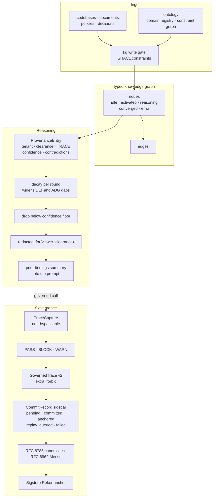

## 1. Executive Summary

GraQle turns an organisation's existing material — code, documents, policies,
decisions — into a typed knowledge graph that coding agents reason over. It is
a commercial product: Apache-2.0 in the tree, on PyPI at 0.84.0, with editions,
entitlements, metering, federation and compliance modules beside the graph
itself. A patent notice in the governance middleware asserts two European
applications over the methods it implements and permits their use under the
project's licence while requiring a separate licence to reimplement them
elsewhere; that is stated here because a reader should know it before copying
anything, and it does not restrict reading or analysis.

Three marks. The memory unit is a `ProvenanceEntry` carrying a tenant key, a
clearance level, a confidence that decays between verifications, and five TRACE
gap scores — Specification Compliance, Prior Knowledge Conformity, Logical
Transparency, Auditability and Factual Sufficiency — that compose to a single
quality number.

Two things in it repay study. The first is the **tenant validator**, whose step
order is fixed so that *"no acceptance check ever sees an un-normalised value"*:
it URL-decodes exactly once and rejects a residual `%XX` so a double-encoded
separator cannot survive, rejects unicode separator and dot homographs
alongside their ASCII forms, and only then allow-lists three shapes. The second
is the **audit schema discipline**: the governed trace is frozen with
`extra="forbid"`, so the cryptographic-commit layer added later composes a
sidecar record beside it rather than adding fields, because mutating the model
would be *"a breaking schema change touching every reader"*.

`trust_state` is withheld, and section 9 gives the reason: every epistemic axis
here is a number.

## 2. Mental Model

Three layers sit on top of each other, and the interesting behaviour is at the
seams.

**The graph** is typed: nodes with an operational status, edges, an ontology
with domain registries and a constraint graph, and a write gate with SHACL
constraints in front of it.

**The reasoning memory** is what an agent actually sees. Findings from earlier
rounds are held as provenance entries and rendered into a prompt ordered by
confidence — but confidence is not static. Each entry decays as
`confidence_initial × lambda^rounds_since_verification ×
penalty^contradiction_count`, and the decay also widens the entry's
transparency and auditability gaps, so an old unverified claim does not merely
score lower, it is recorded as less auditable.

**The governance layer** wraps every governed tool call in a trace, records each
gate's verdict, and commits the record into a Merkle tree anchored to a public
transparency log.

## 3. Architecture

## 4. Essential Implementation Paths

- **Memory unit and decay:** `graqle/core/memory_types.py`.
- **Clearance:** `graqle/core/types.py` (`ClearanceLevel`), and
  `redacted_for` in `memory_types.py`.
- **Tenant partitioning:** `graqle/core/tenant.py`,
  `graqle/reasoning/memory.py`.
- **Prompt assembly:** `graqle/reasoning/memory.py` — decay, floor, redaction,
  truncation.
- **Governance trace:** `graqle/governance/trace_capture.py`,
  `trace_schema.py`, `trace_store.py`.
- **Tamper evidence:** `graqle/governance/tamper_evidence/` — `merkle.py`,
  `canonicalize.py`, `committer.py`, `verifier.py`, `audit_log_v3.py`.

## 5. Memory Data Model

`ProvenanceEntry` is a mutable dataclass, and the comments around its fields are
worth as much as the fields:

- **`tenant_id`** defaults through a `default_factory` rather than a bare
  default, with the reason recorded — so a test that reassigns the default
  tenant is honoured rather than frozen at class-definition time. Its
  `__post_init__` rejects a whitespace-only value and stores the stripped form.
- **`clearance`** defaults to `PUBLIC`.
- **`trace_scores`** are five *gaps*, each 0.0 for no gap and 1.0 for the
  maximum, so the composite is `1.0 - total_gap`. Measuring the deficit rather
  than the quality is a deliberate inversion, and it means a new dimension can
  be added without rescaling the others.
- **`contradiction_count`** feeds the decay as an exponent.
- The module opens by rejecting a malformed default tenant with an explicit
  `raise` and a note that `assert` is stripped under `python -O` — a small
  thing that most codebases get wrong once.

A field-ordering comment records the dataclass rule that any new required field
must be inserted before the defaulted ones, which is the sort of note that stops
a future contributor breaking every deserialised payload.

## 6. Retrieval Mechanics

Activation selects which nodes reason; aggregation combines their outputs by
weighted synthesis, majority vote, rank fusion or confidence weighting.

What an agent sees from earlier rounds is assembled in one pass that does four
things in order: decay every entry to the current round, sort by the decayed
confidence, drop anything under the floor, and render each survivor through
clearance redaction — then stop at a character cap with an explicit
`... (truncated — more findings available)` line rather than silently cutting.

The ordering matters for the same reason it does elsewhere in this corpus:
decay runs *before* the floor, so the threshold is applied to a current value
rather than to whatever the confidence was when the entry was written.

## 7. Write Mechanics

Ingestion passes a write gate with SHACL constraints and an ontology that can be
generated and routed per domain. Every governed tool call is wrapped by
`TraceCapture`, which creates the trace before execution rather than after, so a
call that fails still leaves a record.

The tamper-evidence layer then batches records, canonicalises them under
RFC 8785, commits them as RFC 6962 Merkle leaves, and anchors to Sigstore Rekor.
When Rekor is unreachable the record moves to `REPLAY_QUEUED` and a later drain
advances it — the unavailable-dependency branch is a state in the lifecycle
rather than an exception that loses the record.

## 8. Agent Integration

An MCP server, adapters for coding agents, a chat surface with its own
permission manager, a CLI, Docker and Lambda images, and a PyPI package with
editions and entitlement checks. The README's framing is organisational rather
than personal — *"give your AI a memory of how your organisation actually
works"* — and the surrounding modules (metering, licensing, federation,
compliance) are consistent with that.

## 9. Reliability, Safety, and Trust

**Scope enforced — awarded, on two axes.** The tenant validator rejects the
things a partition key is usually attacked with — double encoding, traversal,
homographs — before it allow-lists anything, and clearance is applied where it
matters: at the point an entry is rendered into a prompt. Two
limits belong beside the mark. Tenant scoping is opt-in behind
`GRAQLE_TENANT_SCOPING`, though the failure mode is a named exception rather
than a silent collapse to one partition. And the validator's docstring is
explicit that passing it does not assert the tenant exists — *"downstream authz
must verify tenant existence independently"* — which is the correct division of
responsibility and worth knowing.

**Audit log — awarded.** Non-bypassable capture, a verdict vocabulary, a frozen
schema extended by composition, an explicit no-silent-drop commit lifecycle, and
a public transparency-log anchor.

**Negative eval — awarded.** The clearance pair asserts both directions on one
fixture, and the negative asserts a redaction marker rather than an absence.

**Trust state — withheld.** Every epistemic axis here is a number.
`confidence` is a float that decays and is compared against a floor; the five
TRACE dimensions are floats composing to another float; `contradiction_count`
is an integer exponent; `reasoning_impact` is a HIGH/MED/LOW label with no
read that filters on it. The discrete enums in the tree are operational rather
than epistemic — `NodeStatus` is a reasoning node's lifecycle, `CommitStatus`
is the audit record's commitment lifecycle, and `ClearanceLevel` is an access
level already carrying `scope_enforced`. A confidence floor excluding a stale
entry is the number axis doing threshold work, which this mark deliberately
does not count.

**Bitemporal — withheld.** Entries carry a `timestamp` and round numbers for
storage and verification, which is a processing clock rather than a second axis
for when a fact was true; no read answers an as-of question.

**Human review — withheld.** Governance decisions are gate outcomes computed by
the system. The clearance model describes who may *read*, not who has approved.

**One disclosure worth naming.** `redacted_for` replaces the value and keeps
everything else — source agent, round, confidence and TRACE score all remain
visible, and the summary line renders them. That is a deliberate choice, and a
reader below the clearance therefore learns that a restricted finding exists,
how confident the system is in it, and how well-evidenced it is. For a debate
panel that is probably the point; for a tenant boundary it is metadata leakage,
and the two uses share one mechanism.

## 10. Tests, Evals, and Benchmarks

**No paper**, but a patent. Searched the README and docs for `arxiv`,
`@article`, `@misc`, `doi.org` and `CITATION.cff`: none. The governance
middleware instead carries a patent notice naming European applications
EP26162901.8 and EP26166054.2, with use permitted under the project's licence
and reimplementation of the methods requiring a separate patent licence. The
repository is Apache-2.0 and the notice sits alongside it rather than replacing
it; the atlas records such riders rather than treating them as an exclusion.

525 Python test files, organised per module — activation, adapters, agents,
alignment, analysis, assurance and onward. The pair this report leans on is in
`tests/test_core/test_fault_isolation.py`, and section 9's evidence record
quotes it.

The repository also carries `benchmarks/`, `gate-demos/`, an
`sdk_self_audit.py` with a committed `sdk_audit_report.json`, and a
`MIGRATION-0.46-to-0.52.md` — signals of a product maintained across versions
rather than a snapshot. No retrieval benchmark result is claimed in the README
that this reading found, so there is no published number to check.

## 11. For Your Own Build

- **Fix the order of a validator's steps and say why.** Decoding after an
  acceptance check is how a double-encoded separator gets in. This one
  URL-decodes exactly once, rejects a residual `%XX`, and only then tests.
- **Reject homographs, not just the ASCII form.** Blocking `/` and `..` while
  allowing their unicode lookalikes is a partition boundary with a hole in it.
- **Freeze the audit schema and extend by composition.** `extra="forbid"` on the
  record of truth, and a sidecar keyed by trace id for anything added later,
  keeps every existing reader working.
- **Make the unavailable-dependency branch a state.** `REPLAY_QUEUED` is better
  than an exception, because the record is still progressing toward anchored
  rather than lost.
- **Measure gaps, not scores.** Five dimensions each reporting a deficit
  compose by addition, and a sixth can be added without rescaling the rest.
- **Decide what a redaction still reveals.** Keeping the fault code makes a
  redacted failure actionable; keeping the confidence and quality scores makes
  a restricted finding's existence public. Both are choices, and they should be
  made separately.

## 12. Open Questions

- Tenant scoping is off unless an environment variable is set. What does a
  deployment that forgets it look like — every entry in the default partition,
  with the named exception only on an explicit non-default id?
- `redacted_for` preserves the TRACE scores by design. Is there a deployment
  where clearance is a tenant boundary rather than a debate-panel filter, and
  does the metadata disclosure get revisited there?
- The Merkle commitments anchor to Sigstore Rekor. Is there a verifier path a
  customer can run independently of the product to check a trace against the
  public log?

## Appendix: File Index

- Memory unit, decay, redaction: `graqle/core/memory_types.py`
- Clearance and node status: `graqle/core/types.py`
- Tenant validation: `graqle/core/tenant.py`
- Prompt assembly: `graqle/reasoning/memory.py`
- Graph and write gate: `graqle/core/graph.py`, `graqle/core/edge.py`,
  `graqle/governance/kg_write_gate.py`
- Ontology: `graqle/ontology/`
- Governed trace: `graqle/governance/trace_capture.py`, `trace_schema.py`,
  `trace_store.py`
- Tamper evidence: `graqle/governance/tamper_evidence/`
- Tests: `tests/test_core/test_fault_isolation.py` and 524 others

## History

**2026-09-19** — [`04f05a60c8b8d2a887c6d0fbb465e83be883888c`](https://github.com/quantamixsol/graqle/commit/04f05a60c8b8d2a887c6d0fbb465e83be883888c) — first reading, at the head of `master`, version 0.84.0. Screened with `scripts/screen_repo.py` before anything was read: unpinned dependency surfaces and manifests inside the seven-day cooldown, the latter an artefact of screening a `--depth 1` clone; nothing was installed, built or run. Three marks. The reading covered the provenance entry and its decay, the TRACE gap dimensions, the tenant validator and the clearance model, the prompt-assembly path that applies both, the governed-trace capture and its schema discipline, and the tamper-evidence layer with its commit lifecycle; the sixty-odd remaining modules — federation, metering, licensing, entitlement, calibration, compliance and the rest — were read as context rather than as subject, and a reader should treat this report as covering the memory and governance core of a much larger product. Apache-2.0, with a patent notice in the governance middleware naming European applications EP26162901.8 and EP26166054.2: use is permitted under the project's licence and reimplementing the methods elsewhere requires a separate patent licence, which is recorded here as a rider rather than an exclusion. Four marks are withheld with reasons in section 9; the short version is that every epistemic axis in this system is a number, and the discrete enums are operational or access-control rather than states a memory can hold.
