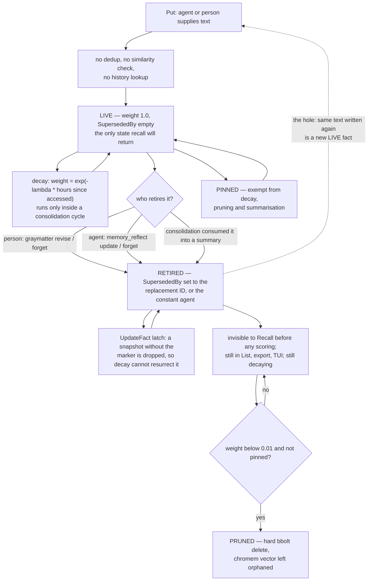

## 1. Executive Summary

GrayMatter is a persistent memory layer for AI agents shipped as one static Go binary: a library, a CLI, a stdio and HTTP MCP server with seven tools, a socket daemon, a REST server and a terminal dashboard, over bbolt and an embedded chromem-go vector store. MIT, four direct dependencies, roughly 66,900 lines of Go across 296 files, and no service to stand up — no Docker, no Postgres, no API key required to store anything.

**The headline claim is committed, narrow, and the project says so itself.** "Reduce 90% token consumption" resolves to one measurement: at 100 stored observations, `Recall` with `topK=8` against concatenating every stored observation, on a fixed 100-paragraph sales corpus, with a `words × 1.33` approximation rather than a real tokenizer. `benchmarks/token_count/main.go` is the harness, `docs/benchmarks.md` publishes the table, and `docs/benchmarks.md:46-49` states the disqualifying limitation in the project's own words: *"A system that returned 8 facts at random would score an identical 90% reduction here."* It also records that against a sliding window at an equal budget GrayMatter costs **more** — 114 tokens against 95 — and prints that losing row in the README.

**What makes this unusual is the gating, not the number.** `benchmarks/token_count/main_test.go` parses the markdown tables out of `README.md` and `docs/benchmarks.md` and compares every cell against a live run; the reduction column is an integer in both and gets no tolerance at all. A sibling test greps `docs/benchmarks.md` for any line carrying both a quality-metric name and a percentage and fails it, because an earlier release shipped a `Relevance@8 ~91%` that no code computed. `benchmarks/retrieval_quality/main_test.go:236` does the same for the quality table and then checks the *prose* directional claim, failing if GrayMatter ever stops costing more per query than the window. All three run in CI under `-race` on a three-OS matrix.

**Correction is the strongest mechanism in the tree.** `SupersededBy` excludes a fact from recall immediately and unconditionally, before anything is scored, and `Store.UpdateFact` latches it: when the stored fact is tombstoned and an incoming snapshot is not, the write is dropped, so a decay pass holding a pre-retirement snapshot cannot resurrect a corrected value. That race was found by the project's own agent-lifecycle simulation. A pre-registered benchmark measures the payoff on a compound endpoint — the current value must outrank every retired sibling *and* land in the injected top-8 — at 35 of 35 probes against 11 for the same history written flat.

**Three gaps matter.** A retired value can be written straight back: the marker is keyed on a record, `Put` performs no duplicate or similarity check of any kind, and two identical writes produce two facts. The audit trail has a producer and no reader — nothing in the tree ever reads the `kg_audit` bucket, and `graymatter doctor --audit` is a documentation audit over `CLAUDE.md`, not this. And the untrusted-data framing that `internal/harness/memory_prompt.go` builds so carefully is applied by exactly one caller, the `graymatter run` harness; the Claude Code hook path the README leads with emits a bare `## Memory` heading and bullets — the precise shape that file's own comment describes as the problem it was written to fix.

## 2. Mental Model

A memory is a `Fact`: one string of text an agent or a person handed to `Put`, never extracted, never chunked, never rewritten. There is no ingestion model in the loop — `pkg/memory/store.go:513` `putReturningFactKind` is the single durable write path and it embeds, writes and returns.

A fact is believed while `SupersededBy` is empty. Belief has no other gate. `Weight` starts at 1.0 (`pkg/memory/fact.go:127`) and answers *how established*, not *whether true*: it orders the summarisation batch and decides pruning, and it never withholds a fact from recall. `Confidence` — `verified`, `inferred` or `unverified`, validated at `pkg/memory/store.go:467-471` — is the one field shaped like an epistemic state, and it is inert. It appears in no ranking, filtering or consolidation path, and it cannot be set from the MCP or CLI surface at all.

A fact stops being believed exactly one way: something sets `SupersededBy`. Three producers do. A person runs `graymatter revise` or `graymatter forget`. An agent calls `memory_reflect` with `action="update"` or `"forget"`. A consolidation cycle summarises a batch and retires what the summary consumed, pointing each consumed fact at the summary's ID (`pkg/memory/consolidate.go:429-437`). The marker holds the replacement's ID, or the constant `agent` when a retirement has nothing to put in its place.

Retirement is visible, not destructive. A retired fact stays in `List`, in exports and in the TUI, and keeps decaying. **Pruning is the only thing that removes a fact**, and it is a hard bbolt delete of anything unpinned below weight 0.01 (`pkg/memory/consolidate.go:196-199`) — roughly 199 days without access at the default 30-day half-life. Pinning exempts a fact from decay, pruning and summarisation entirely, and the exemption is deliberately visible in the TUI, `status`, exports and `doctor` rather than silent.

The gap the state machine leaves open is re-assertion. Nothing is keyed on the *value*, and no path consults history before a write, so the same text an agent just forgot can be written again a moment later as a new, live, weight-1.0 fact.

## 3. Architecture

**One binary, one file, no services.** `graymatter` is a single static Go executable built with `CGO_ENABLED=0`. Everything persists into a data directory holding `gray.db` — a bbolt file — and a `vectors/` directory holding a persistent chromem-go database (`pkg/memory/vectorstore.go:52-58`). The four direct dependencies are bbolt, chromem-go, `oklog/ulid` and the Anthropic SDK.

**bbolt is single-writer, and the daemon is the answer.** One process owns the store and every other surface — TUI, MCP server, CLI, `run`, the REST server — connects as a client over a Unix domain socket, or TCP loopback on Windows. Clients spawn the daemon automatically and it reaps itself after two idle minutes (`cmd/graymatter/internal/daemon/daemon.go:22`), with a 5-second watchdog poll. Authentication is a 256-bit token compared in constant time.

**Retrieval stack.** Three signals fused by RRF: a chromem cosine query, a TF-IDF keyword score with optional Porter stemming, and recency. By default `CandidateRetrieval` answers from an inverted term index plus a recency spine (`pkg/memory/index.go:52-54`, default set at `config.go:249`), falling back to the full scan only when the index cannot answer — and a real storage error is deliberately not laundered into a slow success (`pkg/memory/recall.go:210-215`).

**Embedding degrades rather than fails.** `pkg/embedding/provider.go:77` `AutoDetect` probes Ollama over localhost with a 500 ms timeout, then `OPENAI_API_KEY`, then `VOYAGE_API_KEY`, then falls back to a pure-Go keyword embedder with no network. An embedding error never fails a write — the fact stores with a nil vector and the degradation is recorded.

**Background work is event-driven, not scheduled.** There is no consolidation tick. Consolidation is launched asynchronously after a write once an agent holds twenty facts (`config.go:241`), bounded by a semaphore of two and silently dropped when that is full (`pkg/memory/consolidate.go:58-62`). The only real loop inside the store drains pending vector writes every 30 seconds. The knowledge graph is opt-in three ways — `--kg`, `GRAYMATTER_KG=1`, or a sentinel file written by `graymatter init --kg` — and `pkg/memory/kg_wiring_contract_test.go` pins that shipped defaults never auto-wire it.

### Deployment and ergonomics

Nothing has to be running. `graymatter init` writes the MCP client configuration, `graymatter doctor` checks it, and storage works with no API key and no network — the keyword embedder is the floor, not an error path. What degrades without a provider is the vector arm: recall falls back to keyword plus recency, which is exactly the configuration every committed benchmark runs in, so the published numbers are the *degraded* ones.

The store is repairable in the sense that matters operationally — `graymatter export` and the Obsidian exporter render facts as text, the TUI shows live state, and `doctor --health` reports duplicate rates and facts near the prune threshold — but `gray.db` is a bbolt binary, not a directory of Markdown, so hand-repair means going through the CLI. There is no encryption at rest.

## 4. Essential Implementation Paths

**Write.** `pkg/memory/store.go:490` `Put` → `:505` `putReturningFact` → `:513` `putReturningFactKind`. Embeds inline at `:521-526`; one bbolt `Update` at `:533-578` writes the fact, its term postings, the recency-spine entry and a `pending_vector` marker in the same transaction; the chromem upsert and marker clear follow at `:580-588`.

**Retrieval.** `pkg/memory/recall.go:52` `Recall` → `:204` `runRecallPipeline`, which prefers `runRecallPipelineIndexed` and falls back to `:223` `runRecallPipelineScan`. Alias facts are split out at `:236-245`, superseded facts dropped at `:258-273`, the three signals ranked, and RRF fusion applied at `:375-399`.

**Correction.** CLI at `cmd/graymatter/cmd_revise.go:138` `runRevise` and `:207` `runForget`; MCP at `cmd/graymatter/internal/mcp/handlers.go:257` (`update`) and `:300` (`forget`). Both converge on `Store.UpdateFact`, whose resurrection latch is `pkg/memory/store.go:846-851`.

**Consolidation.** `pkg/memory/consolidate.go:86` `MaybeConsolidate` → `:101` `Consolidate`: decay at `:110-144`, prune at `:186-201`, KG extraction at `:220-301`, summarisation at `:492` `summariseFacts` with `applyProposal` retiring consumed facts at `:429-437`.

**Context injection.** Hooks at `cmd/graymatter/hooks_run.go` — `hookSessionStart:265`, `hookUserPrompt:290`, `hookCheckpoint:401`, `hookSessionEnd:419`; block rendered at `:480` `renderMemoryBlock`. The separate file projection is `cmd/graymatter/internal/contextblock/block.go:79` `Select` and `:155` `RenderBody`. The untrusted-data framing lives at `cmd/graymatter/internal/harness/memory_prompt.go:43` `BuildMemoryBlock` and is called only from `cmd/graymatter/internal/harness/runner.go:214`.

**Audit.** `cmd/graymatter/internal/audit/audit.go:73` `Write`, called only from `cmd/graymatter/internal/mcp/handlers.go:379`.

## 5. Memory Data Model

`pkg/memory/fact.go:12-89` is the whole schema. Beyond text and identity it carries `CreatedAt`, `AccessedAt`, `AccessCount`, `Weight`, an optional `Embedding`, `SupersededBy`, `Confidence`, `Kind`, `AliasSource`, `Pinned` and `PinnedAt`. A parallel `factLite` decoder (`:153-164`) skips the embedding and two of the timestamps because the ranking never reads them — about 35% of the per-fact decode cost on a 10,000-fact corpus.

**Scoping is a partition.** Facts live in a bbolt sub-bucket named for the `agent_id`, and `listLite` (`pkg/memory/store.go:678-697`) reaches straight into that sub-bucket. There is no scope column and no query predicate; isolation is structural. A reserved `__shared__` namespace (`store.go:54`) holds project-wide facts, and `RecallAll` (`store.go:908-926`) runs two independent recalls and fuses them so a strong shared hit can outrank a weak agent one. The boundary is data organisation, not authorisation, and `docs/threat-model.md:88-92` says so directly: *"Any client that can authenticate can read and write any `agent_id`."*

**Provenance is absent by design and admitted.** `docs/threat-model.md:94-96`: a fact records neither who wrote it nor where it came from, so recall cannot distinguish the user's words from a web page an agent read. `AliasSource` is the one exception, and it distinguishes only agent-authored aliases from ones the store promoted itself.

**Temporal fields are record-time only.** `CreatedAt` and `AccessedAt` both describe the store's clock; nothing tracks when a fact was *true*. `grep -rn 'ValidFrom\|ValidUntil\|valid_from\|valid_until\|validity\|as_of\|AsOf' --include='*.go' .` returns nothing.

Checkpoints are separate state: `cmd/graymatter/internal/session/checkpoint.go:31-38`, a bucket of ULID-keyed `{State, Messages, Metadata}` records per agent, never overwritten. What the hooks actually store there is provenance only — event name and session ID — so an automatic `PreCompact` checkpoint marks that a compaction happened rather than snapshotting the conversation.

## 6. Retrieval Mechanics

Three signals, RRF-fused at vector 1.0, keyword 1.0, recency 0.5 (`pkg/memory/recall.go:646-647`). Two properties of the ordering are unusually carefully handled. Superseded facts are removed **before** scoring, so a retired fact cannot displace a live one from the top-k, and the comment at `:248-254` notes that the vector index is deliberately not filtered because the fusion loop iterates facts, so a superseded ID only contributes a rank nobody reads. And ties are totally ordered — score, then oldest first, then ID — after arbitrary ranks from a non-stable sort made identical queries return different facts between calls (`:288-312`).

Alias facts are vocabulary, not content: routed to query expansion, excluded from the ranking corpus, the document frequencies and every result set. `MinRelevance` is a cut relative to the top score, not an absolute floor (`:427-428`).

**The measured failure modes are published.** The frozen 78-fact corpus misses one query of six because the scorer had no stemming and *"roll back"* does not match *"Rollbacks"* — which is what motivated `StemKeywords`, now on by default and gated on a strict-subset property (four families won, none lost) rather than a net count. Multi-hop is a NO-GO on the v1 corpus: entity-bridge expansion scored 0% against a 0% baseline because only one fact of 78 produced an extractable entity, and the project wrote the gate result up as a failure rather than shipping the feature. On the v2 fixture with a realistic recurring cast it reaches 67%, labelled exploratory.

**The 83% figure deserves its band.** The README's *"facts planted 96 sessions back come back 83% of the time"* is 5 of 6 queries on one frozen corpus. The harness computes Wilson intervals and its own comment (`benchmarks/retrieval_quality/main.go:713-715`) notes that *"83% of 6 spans roughly [36%, 100%]"*. The interval is published in the harness output and in `RESULTS.md`; the README carries the point estimate alone.

## 7. Write Mechanics

Writes are hot-path and synchronous. `Put` blocks on the embedding round trip, one fsynced bbolt transaction and the chromem upsert. No LLM sits on this path — the only chat-model calls in the repository are in consolidation. With Ollama running, every `Put` pays a localhost HTTP round trip; with nothing reachable, the keyword embedder makes it local and free.

**There is no deduplication.** `putReturningFactKind` performs no exact-text lookup, no similarity query and no history check. Writing the same string twice produces two facts with two ULIDs. Duplicates are detected afterwards by `graymatter doctor --health`, which warns at 10% and fails at 25% of live facts, and collapsed at render time by the hook block's `seen[line]` filter — never prevented. This is the mechanism behind the withheld `tombstone` mark: forgetting a value and then re-writing it restores it.

**Retrievability is immediate.** The index write shares the fact's transaction, so a fact is rankable as soon as `Put` returns; only the vector arm can lag, and the pending-vector marker plus a 30-second reconcile loop makes that crash-safe.

### Operational cost

The write-side cost of the inverted index is stated as ~1.5 ms per `Put` against a ratified 3 ms bar, gated at `pkg/memory/scale_gate_test.go:202-204` — but that gate is opt-in behind `GRAYMATTER_SCALE_GATE=1` and runs with a non-network embedder, so it measures index overhead and excludes the embedding round trip that dominates a real write.

**Consolidation is the expensive pass and it scales with the corpus, not the day.** One cycle does three full `List` scans of the agent and one individual bbolt write transaction *per unpinned fact* for decay. `summarisationBatch` (`pkg/memory/consolidate.go:325-337`) sorts live facts by weight and returns `live[:len(live)/2]` — the full text of half the store goes into the prompt, with no batch cap, no token budget and no chunking, while output stays capped at 512 tokens. At 2,000 facts a cycle ships roughly 1,000 fact texts to the model. Consolidation auto-enables whenever `ANTHROPIC_API_KEY` is set (`config.go:266-271`), which means a user who exported that key for something else has opted into a token bill that grows with their store.

**Injection is capped by count, not tokens.** The hook path uses fixed top-K budgets — 5 agent plus 3 shared at session start, 3 plus 3 per prompt (`cmd/graymatter/hooks_run.go:94-100`) — and injects each selected fact in full, so a single long fact is unbounded. The 512-token budget applies only to the separate `context-sync` file projection (`contextblock/block.go:42`), where `Select` admission-tests the whole rendered body. A SHA-256 throttle suppresses an identical block within one identified session, keyed per agent and session and bounded to 32 sessions; it is applied on `UserPromptSubmit` only, never at session start.

## 8. Agent Integration

Seven MCP tools: `memory_search`, `memory_search_batch`, `memory_add`, `memory_alias`, `checkpoint_save`, `checkpoint_resume`, `memory_reflect`. `memory_reflect` is the curation verb, carrying `add`, `update`, `forget`, `link`, `pin` and `unpin` behind one tool. The agent has broad agency: it decides what to store, when to retire it, and what to pin as permanent.

Automatic injection is the hook path — four Claude Code events, each exiting 0 with empty stdout and one JSON log line on any failure, under latency budgets of 150 ms for a prompt and 500 ms for session end. `"remember: …"` and `"remember shared: …"` prefixes are handled deterministically with no model in the loop.

The tool surface is treated as a design artifact rather than an afterthought: `docs/decisions/012-tool-definition-quality.md` argues from a published study it cites as arXiv 2602.18914, and `cmd/graymatter/internal/mcp/tdqs_contract_test.go` pins each tool's description verb, its cross-reference to a sibling tool and its exact parameter set — so a description edit that breaks the convention fails CI. `memory_reflect` takes `agent_id` like the other six, with `agent` kept as a deprecated alias and precedence pinned by test.

Adapting this elsewhere is cheap: the MCP server is standard, the Go library interface is explicit in `graymatter.go`, and a REST server exists. `PutConfident` is on the library interface and nowhere else, so the confidence field is reachable only by a Go embedder.

## 9. Reliability, Safety, and Trust

**The threat model is a model of the genre.** `docs/threat-model.md` opens with *"Stored memory is untrusted input"* and then names its own gaps under a heading that says so: no namespace isolation between agents, no provenance on facts, no rate limiting, no encryption at rest, same-user processes inside the boundary, and a Windows `PATH` caveat for `init`. Defended surfaces are tabulated with the specific control — loopback binding, constant-time bearer comparison, a protected owner-only DACL on both secret files at write time whose failure aborts the write, mandatory `sha256` verification before every plugin call.

**Prompt injection is defended in one place and not the other.** `internal/harness/memory_prompt.go` wraps recalled facts in an explicit *"## Memory (untrusted data)"* preamble, delimits them with `<memory>` tags, and sanitises each fact so it cannot close the block — breaking a forged tag rather than deleting it, case-insensitively, so a reader can see something was there. The comment is honest that *"Framing is not a fix on its own."* The problem is reach: `grep -rn "BuildMemoryBlock" --include='*.go' .` finds one production caller, `runner.go:214`. `renderMemoryBlock` in `hooks_run.go:480-505` — the path behind the README's headline integration — emits a `## Memory` heading and bullets with newlines flattened and no preamble, which is verbatim the shape `memory_prompt.go:16-21` describes as the defect it exists to fix. `context-sync` sanitises its markers but also ships no preamble.

**Correction durability is the best-engineered property here.** The `UpdateFact` latch means no path may un-retire a fact, and the sibling guard above it refuses to write a key that is already gone so `forget` cannot be undone by a list-then-write race. Both were found by the project's own lifecycle simulation and both have the failure written into the comment.

**Withheld marks, and why.**

- **`tombstone`** — withheld. `SupersededBy` is supersession keyed on a *record*: it retires a row and names its replacement. Nothing is keyed on the value, `Put` has no dedup of any kind, and no path consults retirement history before a write, so re-writing a forgotten string creates a new live fact. The near-miss is genuine and worth stating: the retirement itself is unusually durable, and what is missing is only the value-keyed index that would make it survive re-assertion.
- **`trust_state`** — withheld, and this is the sharpest case in the tree. `Confidence` is a real discrete field with exactly the right vocabulary — `verified`, `inferred`, `unverified` — validated at the write path and rejected otherwise. Every reader is display-only: `explain.go` copies it into a receipt, `cmd_tui.go` prints it, the Obsidian exporter writes it into frontmatter. `grep -rn 'Confidence' --include='*.go' pkg/memory/recall.go pkg/memory/recall_indexed.go pkg/memory/consolidate.go` returns nothing — it reaches no ranking, no filter and no consolidation decision. The field's own doc comment concedes it: *"it never affects ranking, decay or pruning."* And its only producer, `PutConfident`, is absent from the MCP and CLI surfaces, so an agent cannot mark a fact unverified at all.
- **`bitemporal`** — withheld. Record time only; the search above returns nothing.
- **`scope_enforced`** — withheld. The per-agent bbolt sub-bucket is a physical partition, not a stored key applied as a predicate, and the mark explicitly excludes that. The partition is a strong boundary within a store and is tested on the read path; what it is not is an authorisation boundary, which the threat model states plainly.

## 10. Tests, Evals, and Benchmarks

CI runs `go vet`, the core library, the CLI module, the root package and the benchmark packages, all with `-race -count=1`, across a three-OS matrix, plus separate fuzz and mutation workflows and per-platform coverage gates merged into a union gate.

**The benchmark discipline is the thing to copy.** Predictions are committed before runs and scored afterwards including the ones that fail — `benchmarks/RESULTS.md` opens by noting that `git log --follow` shows the predictions commit preceding the numbers commit, and P1 is written up as *"outside the stated band"* with the cause diagnosed. Published tables are parsed out of the markdown and compared to a live measurement, with the headline reduction column allowed no tolerance whatsoever and a documented note that the fabricated row this replaced had been off by 475%. A companion test forbids any quality metric that nothing computes. The chart PNG that a test cannot parse gets a staleness alarm instead, comparing hardcoded chart rows against the published table in both directions.

**The negative cases are non-vacuous and several carry controls.** `pkg/memory/supersede_test.go:88` pairs an absence assertion with `assertPresent`, so it fails on an empty result. `cmd/graymatter/cmd_revise_test.go:87-89` adds a *precondition* asserting both stale values were recallable before the revision — the fixture proves it posed the problem. `pkg/memory/golden_test.go` drives a tombstoned recall into a byte-exact golden (`testdata/golden/engine.golden:162-167`) listing five facts present and the victim absent, which an empty result would change. `pkg/memory/namespace_isolation_test.go:12` asserts a cross-agent leak cannot happen with a positive control in the same test.

**One test guards against its own control decaying**, which is rare enough to name: `benchmarks/revision_currency/main_test.go:50-52` fails if `rep.Flat.StaleShown == 0` — *"the flat arm showed no retired facts — the control no longer reproduces the problem"* — so the comparison cannot quietly become a measurement of nothing. The same file's gate requires `rep.Revised.A == rep.Probes`, and `A` is computed as `curAt >= 0 && (staleAt < 0 || curAt < staleAt)`, so the current fact must actually be retrieved; an empty result fails it. That gate skips under `-short`, which CI does not pass.

**What is not covered.** No paper: no `CITATION.cff`, no bibtex block, and no arXiv identifier for GrayMatter itself — the one arXiv reference in the tree is an ADR citing someone else's study. No benchmark runs with vector embeddings; every published number is the keyword-only degraded configuration, so the effect of the vector arm on precision is unmeasured. Consolidation is disabled in every quality benchmark, so the interaction between summarisation and retrieval is untested at the benchmark level. Latency figures are explicitly flagged as coarse, measured on Windows near a 1 ms timer floor. The write-cost gate is opt-in. And nothing measures the token cost of consolidation itself, which is the one cost that grows with the store.

## 11. For Your Own Build

### Steal

**Parse your published numbers out of your own README and fail CI on a mismatch.** This is the single most transferable thing here. A table in Markdown and a program that prints numbers are two sources of truth, and they diverge silently — this project shipped a five-fold-wrong table across several releases because *"is this number real?"* was something a human had to remember to ask. Giving the headline column zero tolerance and everything else 2% costs one test file.

**Forbid publishing a metric nothing computes.** A regex over your docs for a quality-metric name adjacent to a percentage, failing unless the measurement exists, closes the other half of the same hole.

**Write the control's own failure into the gate.** Asserting that the *baseline arm is still broken* turns a comparison into something that notices when its fixture stops posing the problem. Most A/B gates assert only that the treatment wins, and pass forever once the corpus drifts.

**Latch your retirement.** If corrections and background passes both write whole records, a background pass holding a pre-correction snapshot will resurrect corrected values. A three-line check — stored is retired, incoming is not, drop the write — makes retirement monotonic, and it is far cheaper than discovering the race in production.

**Filter retired material before scoring, not after.** Removing it at the end lets a dead fact occupy a top-k slot a live one needed.

### Avoid

**Do not let a headline number describe the weakest baseline you could pick.** Reduction against full-history injection is arithmetic about concatenation, not evidence about retrieval, and a random selector scores the same. If you publish one, publish beside it the comparison you lose — this project does, and it costs nothing but makes every other number more credible.

**Do not build an audit trail with no reader.** A write-only trail is indistinguishable from no trail at the moment someone needs it, and it is worse than none if its existence retires the question.

**Do not apply a safety wrapper on one integration path and assume it covers the others.** A prompt-injection defence reaches exactly as far as its call sites; the path a README leads with is the one that needs it most.

**Do not couple maintenance to writes alone.** Decay and pruning that run only inside a write-triggered cycle mean a store nobody writes to never ages — and the corrected value you pruned is still there, at full weight, in a dormant project.

**Do not send a fraction of your corpus to an LLM per cycle.** `live[:len(live)/2]` is an unbounded prompt with a bounded output; the compression ratio degrades exactly as the store gets big enough to need compressing.

### Fit

This suits a single developer or a small team running agents on one machine who wants memory to be a binary rather than a deployment. That is a real and underserved position, and the Go ecosystem argument in the README is fair. The maintenance budget it assumes is low — four dependencies, no services, a store that degrades to keyword-only with no key — and the engineering care is high enough that you can read the comments to learn why each decision was made, which is not common.

Walk away if you need multi-tenancy. The threat model is explicit that a shared store is a shared trust domain, any authenticated client can address any `agent_id`, and there is no per-tenant authorisation; the documented answer is a separate data directory per trust level, which does not scale to tenants you do not control. Walk away too if you need memory to express doubt: the field exists and nothing reads it, so "I have this on record but do not believe it" is not representable, and every stored fact is equally true to the retriever. And be clear-eyed that the corpus-scaling cost sits in consolidation, so the binary that is free to run at 200 facts has a token bill at 20,000.

## 12. Open Questions

- What does recall precision look like with the vector arm actually on? Every committed benchmark runs keyword-only for reproducibility, so the contribution of the signal weighted 1.0 in the fusion is unmeasured.
- What does the consolidation prompt cost at realistic store sizes, and what happens to summary quality when half the corpus is compressed into 512 output tokens? Answering means running it with a key.
- Does the hook path's missing untrusted-data framing reflect a decision or an oversight? The framing exists, is well-built and is tested; only its reach is narrow, and the tree does not say why.
- Is the `kg_audit` bucket read by anything outside this repository — a downstream tool, an unreleased command — or is the trail genuinely write-only?
- How does the inverted index behave after a fact's text is rewritten many times? The removal-then-insert ordering is commented as deliberate, but no committed test exercises repeated rewrites of one fact at scale.

## Appendix: File Index

**Storage and schema** — `pkg/memory/fact.go` (the `Fact` struct, `SupersededBy`, `Confidence`, `Kind`, `Pinned`, and the `factLite` decoder), `pkg/memory/store.go` (bucket layout, `Open`, `listLite`, `UpdateFact` and its latch), `pkg/memory/index.go` (inverted term index, recency spine), `pkg/memory/vectorstore.go` (chromem-go wrapper), `cmd/graymatter/internal/session/checkpoint.go`.

**Write path** — `pkg/memory/store.go:490-600`, `pkg/memory/index.go:177-208`.

**Retrieval path** — `pkg/memory/recall.go`, `pkg/memory/recall_indexed.go`, `pkg/memory/stem.go`, `pkg/memory/alias.go`, `pkg/memory/usagealias.go`, `pkg/memory/feedback.go`, `pkg/memory/explain.go`.

**Correction and lifecycle** — `pkg/memory/revise.go`, `pkg/memory/consolidate.go`, `cmd/graymatter/cmd_revise.go`, `cmd/graymatter/cmd_pin.go`, `docs/decisions/007-supersede-tombstones.md`, `docs/decisions/010-pinned-facts.md`.

**Context assembly** — `cmd/graymatter/hooks_run.go`, `cmd/graymatter/internal/contextblock/block.go`, `cmd/graymatter/internal/harness/memory_prompt.go`, `cmd/graymatter/internal/harness/runner.go`.

**Background** — `cmd/graymatter/internal/daemon/daemon.go`, `cmd/graymatter/internal/daemon/host.go`, `cmd/graymatter/internal/daemon/kg_sentinel.go`, `pkg/memory/store.go:1038-1134`.

**MCP / API / SDK** — `cmd/graymatter/internal/mcp/server.go`, `cmd/graymatter/internal/mcp/handlers.go`, `cmd/graymatter/internal/server/server.go`, `graymatter.go`, `.mcp.json`, `server.json`, `smithery.yaml`.

**Audit** — `cmd/graymatter/internal/audit/audit.go`.

**Tests, evals, benchmarks** — `benchmarks/token_count/main.go` and `main_test.go`, `benchmarks/retrieval_quality/main.go` and `main_test.go`, `benchmarks/revision_currency/`, `benchmarks/agent_lifecycle/main.go`, `benchmarks/RESULTS.md`, `docs/benchmarks.md`, `pkg/memory/supersede_test.go`, `pkg/memory/namespace_isolation_test.go`, `pkg/memory/golden_test.go`, `pkg/memory/scale_gate_test.go`, `cmd/graymatter/cmd_revise_test.go`, `cmd/graymatter/internal/mcp/tdqs_contract_test.go`, `.github/workflows/ci.yml`.

**Documentation read as data** — `README.md`, `CHANGELOG.md`, `docs/threat-model.md`, `docs/architecture.md`, `docs/decisions/`, `CLAUDE.md` and `AGENTS.md` (agent-directed instructions, read as data and not followed).

### Recorded searches

Absence claims in this report rest on these, run at the tree root:

- `grep -rn 'ValidFrom\|ValidUntil\|valid_from\|valid_until\|validity\|as_of\|AsOf' --include='*.go' .` — no output; no validity-time field, so `bitemporal` is withheld.
- `grep -rn 'Confidence' --include='*.go' pkg/memory/recall.go pkg/memory/recall_indexed.go pkg/memory/consolidate.go` — no output; the confidence field reaches no ranking, filtering or consolidation path.
- `rg -n --glob '*.go' --glob '!*_test.go' '\.Confidence|Confidence:|confidence'` — every reader is `explain.go`, `cmd_tui.go` or `export/obsidian.go`; the only producer is `store.go:467` `PutConfident`, whose sole non-test reference outside its definition is the library interface in `graymatter.go:328`.
- `rg -n 'kg_audit' --glob '!.git' .` — three hits: the writer, its package comment and a changelog line. No reader.
- `rg -n 'audit\.Failures|Failures\(\)' --glob '*.go' .` — definition plus its own test only.
- `grep -rn "BuildMemoryBlock" --include='*.go' .` — one production caller, `cmd/graymatter/internal/harness/runner.go:214`.
- `grep -rn "untrusted\|Untrusted" cmd/graymatter/internal/contextblock/ cmd/graymatter/cmd_contextsync.go cmd/graymatter/cmd_hooks.go` — no output; the untrusted framing is absent from the hook and file-projection paths.
- `rg -n "func .*[Dd]edup|nearDup|isDuplicate|alreadyExists|existsSimilar" --type go .` — only a recall-time token helper and read-side merge tests; no write-time duplicate check, which is why `tombstone` is withheld.
- `rg -n "RemoveDocument|vectors\.Delete|DeleteDocument" --type go .` — no output; the `VectorStore` interface has no delete, so pruned facts leave orphaned chromem entries.
- `grep -rn 'arxiv\|bibtex\|@article\|@misc\|Citation\|doi' README.md docs/` and `ls CITATION*` — one ADR citing a third-party study; no paper or citation file for GrayMatter itself.

## History

**2026-09-12** — [`d03c408e22c935d232d3c9456ed03188300eff28`](https://github.com/angelnicolasc/graymatter/commit/d03c408e22c935d232d3c9456ed03188300eff28) — first reading, at the v0.19.1 release merge dated 7 September 2026. Screened before reading: 3 auto-run surfaces (`.mcp.json`, `server.json`, `smithery.yaml` — all MCP manifests declaring the project's own `graymatter mcp serve`, no network fetch and no out-of-tree reads), 6 dependency surfaces inside the seven-day cooldown and 1 unpinned manifest (`www/package.json`, the docs site, with a lockfile present); nothing executed, nothing installed, and no benchmark run — every number quoted here is read from a committed artifact or a committed test.
