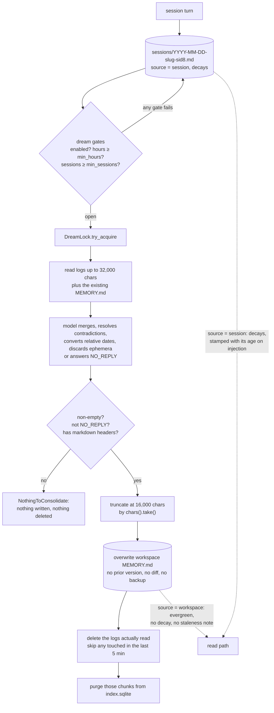

## 1. Executive Summary

Grok Build (`grok`) is SpaceXAI's terminal coding agent — 1.59 million lines of
Rust across 2,586 files, Apache-2.0, synced periodically from a monorepo whose
commit is recorded in a `SOURCE_REV` file at the root. Its memory is one crate
of that, `crates/codegen/xai-grok-memory`, about 9,900 lines carrying **290
tests**, and it is gated behind `--experimental-memory` or `GROK_MEMORY=1`.

The design is [memory as an editing surface](../../patterns/memory-as-an-editing-surface/)
with a derived index. Markdown files under `~/.grok/memory/` are the source of
truth — a global `MEMORY.md`, a per-workspace `MEMORY.md` under a directory
named `{slug}-{blake3(cwd)[..8]}`, and dated session logs beneath it — and a
per-workspace `index.sqlite` carries FTS5 and, when sqlite-vec loads, a vector
table. Nothing is stored that a person cannot open in an editor.

**Two things here are better than anything comparable in this atlas, and both
are on the read path.** Retrieved session memory is annotated with its own age
before the model sees it — `**Stale (4 months):** Verify current state before
relying on this.` — computed from `created_at` and suppressed for curated
sources, which are treated as evergreen. And the injection is written to
preserve the provider's prompt-prefix cache: the memory block is persisted into
the leading system message and reused verbatim on later turns rather than
re-scored, with the reason in the code — *"a re-scored block would mutate the
system-prompt prefix and bust the KV cache for the whole downstream
conversation."* That is the most direct answer in this corpus to a question
[the report format](../../methodology/per-repo-report-format/) asks every system
and almost none answers.

**The consolidation pass is where it gets dangerous, and the danger is a
compound of three reasonable decisions.** A `dream` — the crate's word — fires
when config, hours elapsed and session count all pass, takes a lock, and asks a
model to merge recent session logs into the existing `MEMORY.md`. The response
is then truncated at `MAX_DREAM_CHARS = 16_000` by `chars().take()`, written
over the workspace `MEMORY.md`, and the session logs that were read are
**deleted**. There is no version of `MEMORY.md`, no diff, and no backup. Prior
knowledge survives one round only because the prompt asks the model to merge
rather than replace, and a consolidation whose output runs long loses its tail
mid-document and then destroys the evidence it was built from.

Against that, the cleanup is careful in ways worth crediting: only the stems
actually *read* inside the 32,000-character input cap are deleted, files touched
in the last five minutes are skipped in case a concurrent session is appending,
and the index chunks are purged only for stems that really left the disk.

The second finding is a deletion gap. `grok memory clear --global` removes
`~/.grok/memory/MEMORY.md` and nothing else — but that file is indexed into
*every* workspace's `index.sqlite` with `source = "global"`, and `chunks.text`
holds the content verbatim. The clear command never opens an index. The text
survives, and stays searchable, in every workspace not running a live session at
that moment, until someone runs `grok memory reindex`.

## 2. Mental Model

A memory is a **markdown chunk**: text, a blake3 hash of its content, a `path`
and line range, a `source` of `global`, `workspace` or `session`, and
`created_at`, `updated_at`, `access_count` and `last_accessed`. The unit is a
slice of a file rather than a fact — nothing is extracted, nothing is typed, and
the file is what a person edits.

Three scopes, and they are not peers:

- **global** — `~/.grok/memory/MEMORY.md`, curated, shared across every workspace.
- **workspace** — the project's `MEMORY.md`, curated, written by the dream.
- **session** — dated logs of what happened, raw, and the only decaying kind.

That split is the whole epistemic model, and it is a good one. `is_evergreen_source`
returns true for global and workspace, so curated knowledge is exempt from
temporal decay and from the staleness annotation, while session logs decay and
are labelled with their age. The system is saying that a thing a person or a
consolidation pass wrote down is a different kind of claim from a thing that
merely happened, and it treats them differently on the read path rather than
only in storage.

There is no trust state. Nothing is candidate, verified or rejected, and no
record carries confidence. The nearest thing is the staleness note, which is a
*rendering* rather than a state: it is computed at injection time from age and
written into the prompt, and nothing is stored on the chunk. A reader looking
for `trust_state` should read that as a deliberate near-miss — the hedge reaches
the model, which is where it matters, and no query can filter on it.

How a memory dies has three paths and only one of them is graceful:

```text
session log      -> read by a dream -> DELETED from disk, chunks purged
                 -> not read (beyond the 32K cap) -> kept
                 -> decays in ranking: score × e^(-ln2/half_life × age)

workspace MEMORY -> overwritten wholesale by the next dream, no prior version

any file         -> edited or removed by hand -> watcher reindexes or purges
```

Nothing is superseded and nothing is tombstoned. The dream prompt instructs the
model to *"Resolve contradictions — if a recent session disproves an older fact,
keep only the current truth"*, which is destructive supersession by construction:
the old claim is not closed out with an interval the way
[Graphiti](../graphiti/) or [Zep](../zep/) would close it, it is simply not
written into the next version of the file.



## 3. Architecture

The memory crate is fifteen modules:

- **`storage.rs`** (1,862 lines, 81 tests) — the file layer. `MemoryScope`,
  `MemoryStorage`, workspace hashing, `write_daily_log`, `write_long_term`,
  `append_to_memory`, `read_file`, `list_memory_files`, `clear_workspace`,
  `clear_global`, `gc`.
- **`backend.rs`** (1,616 lines) — `MemoryBackendImpl`, the seam the tools call,
  which owns the index handle, the watcher sync and the embedding glue.
- **`dream.rs`** (1,471 lines, 51 tests) — gates, prompt, response processing,
  cleanup, `execute_dream`.
- **`dream_lock.rs`** (488 lines, 20 tests) — lock lifecycle, rollback,
  `last_consolidated_at`, `sessions_since`.
- **`index.rs`** (1,286 lines) — SQLite schema, `reindex_file`, `delete_path`,
  `all_indexed_paths`, the reindex claim.
- **`search.rs`** (1,349 lines, 31 tests) — the ranking pipeline.
- **`mmr.rs`**, **`query_expansion.rs`**, **`chunker.rs`**, **`embedding.rs`**,
  **`watcher.rs`**, **`archive.rs`**, **`schema.rs`**, **`text_utils.rs`**.

Three tables: `meta` (schema version, embedding dimensions, a `reindex_claim`),
`chunks` with a unique text `id` and indexes on `path` and `hash`, and a
contentless `chunks_fts` FTS5 virtual table. A fourth, `chunks_vec`, is created
as a `vec0` table only when sqlite-vec loads; when it does not, the whole
pipeline degrades to FTS with `text_weight` forced to 1.0.

The agent-facing surface is two tools in `xai-grok-tools` — `memory_search` and
`memory_get`, both declaring `is_read_only: true` — plus `/flush` and `/dream`
slash commands and the automatic session log.

### Deployment and ergonomics

- **Nothing extra has to be running.** SQLite is embedded, the index is a file
  in the workspace memory directory, and markdown is markdown.
- **Memory is off unless asked for**: `--experimental-memory` or `GROK_MEMORY=1`.
- **Semantic search is optional and degrades cleanly.** Without sqlite-vec the
  system is FTS-only by design, not by breakage, and the fallback is tested.
- **The store is human-readable and hand-repairable** — that is the point of it —
  and a file watcher on `~/.grok/memory/` picks up external edits, reindexing
  created and modified files and purging chunks for deleted ones.
- **`grok memory` has real operator tooling**: `clear` with a confirmation
  prompt, `reindex`, and a `doctor` that detects orphaned chunks.
- Install is a prebuilt binary from `x.ai/cli` or a source build with a pinned
  toolchain and DotSlash for hermetic tools.

**One thing leaves the machine, conditionally.** `archive.rs` tars the global
`MEMORY.md`, the workspace `MEMORY.md` and every session log into
`memory.tar.gz`, and `upload_memory_state` in `xai-grok-shell/src/upload/trace.rs`
sends it to GCS. The gate is
`self.session_registry_local.or(remote).unwrap_or(false)` plus
`auth.is_xai_auth()`. Precisely: off by default; never for a non-xAI credential;
an explicit local setting wins in both directions — and if the local flag is
unset, a server-delivered remote setting decides. The comment on
`build_memory_archive` says the archive exists so a reconstruct pipeline can
inject it into a Docker image "for full replay fidelity". Anyone whose
`MEMORY.md` accumulates work context should set the local flag deliberately
rather than leave it unset.

The screen of this checkout found no auto-run surfaces, 102 dependency surfaces
inside the seven-day cooldown, 7 build-time `build.rs` execution points and one
unpinned npm manifest, with `Cargo.lock` present. Nothing was installed and
nothing was run.

## 4. Essential Implementation Paths

- **Session capture** — `MemoryStorage::write_daily_log` in `storage.rs:162`,
  writing `sessions/YYYY-MM-DD-{slug}-{sid8}.md`.
- **Curated write** — `write_long_term(scope, content)` at `storage.rs:198`
  (overwrite) and `append_to_memory` at `:228`.
- **Dream gates** — `check_dream_gates` in `dream.rs:40`, cheapest first:
  `config.enabled`, then hours since `lock.last_consolidated_at()`, then
  `dream_lock::sessions_since()`.
- **Dream prompt** — `DREAM_SYSTEM_PROMPT` at `dream.rs:88`.
- **Input assembly** — `build_dream_user_message` at `dream.rs:181`, capped by
  `MAX_DREAM_INPUT_CHARS = 32_000`, returning `processed_stems` — the logs
  actually read.
- **Response validation** — `process_dream_response` at `dream.rs:273`: rejects
  empty, rejects `NO_REPLY`, rejects a response with no markdown headers, then
  truncates at `MAX_DREAM_CHARS = 16_000`.
- **Execution** — `execute_dream` at `dream.rs:394`: acquire lock, process,
  `write_long_term(Workspace, …)`, `clean_processed_sessions`, roll the lock
  back on write failure.
- **Cleanup guard** — `clean_processed_sessions` at `dream.rs:336`, with
  `CLEANUP_RECENCY_GUARD_SECS = 300`.
- **Caller** — `run_dream_inner` in
  `xai-grok-shell/src/session/acp_session_impl/memory_dream.rs:285`, which reads
  the existing `MEMORY.md`, runs the model call under a 30-minute timeout,
  passes `dream_msg.processed_stems` to `execute_dream`, then reindexes
  `MEMORY.md` and calls `delete_paths_from_index` for the cleaned stems.
- **Ranking** — `hybrid_search` in `search.rs`, with `temporal_decay_multiplier`
  at `:114` and the merge at `:267`.
- **Read containment** — `MemoryStorage::read_file` at `storage.rs:274`.
- **Injection** — `format_memory_reminder` and `conversation_has_memory_context`
  in `xai-grok-shell/src/session/helpers/memory_context.rs`.
- **Staleness** — `format_staleness_note` in
  `xai-grok-tools/src/types/memory_backend.rs:27`.
- **Watcher sync** — `backend.rs:358`, reindexing dirty files that exist and
  calling `index.delete_path` for those that do not.
- **Archive and upload** — `archive.rs`, and `upload_memory_state` in
  `xai-grok-shell/src/upload/trace.rs:814`.

## 5. Memory Data Model

```sql
CREATE TABLE chunks (
    rowid         INTEGER PRIMARY KEY AUTOINCREMENT,
    id            TEXT UNIQUE NOT NULL,
    path          TEXT NOT NULL,
    start_line    INTEGER NOT NULL,
    end_line      INTEGER NOT NULL,
    text          TEXT NOT NULL,
    hash          TEXT NOT NULL,       -- blake3 of the chunk text
    source        TEXT NOT NULL,       -- global | workspace | session
    created_at    INTEGER NOT NULL,
    updated_at    INTEGER NOT NULL,
    access_count  INTEGER DEFAULT 0,
    last_accessed INTEGER
);
CREATE VIRTUAL TABLE chunks_fts USING fts5(text, content='');
-- when sqlite-vec loads:
CREATE VIRTUAL TABLE chunks_vec USING vec0(chunk_id TEXT PRIMARY KEY,
                                           embedding FLOAT[dimensions]);
```

The content hash is the update primitive: `reindex_file` compares hashes and
touches only what changed, so an edit to one paragraph of a long `MEMORY.md`
does not re-embed the file.

**Scoping is enforced three ways, and the strongest is the one a model can
reach.** The workspace directory is `{slug}-{blake3(cwd)[..8]}` and owns its own
`index.sqlite`, so cross-workspace reads are impossible by containment rather
than by filter. `source` is a stored column and FTS applies it — `WHERE
chunks_fts MATCH ?1 AND c.source IN (…)`. And `read_file`, which is what
`memory_get` calls with a model-supplied path, canonicalizes both the target and
the memory root, refuses anything not `starts_with` the root, and then reads the
*canonicalized* path rather than the original, with the reason in a comment:
"to prevent TOCTOU races". That is the containment check on the read path that
several systems in this atlas apply only on the write path.

`created_at` and `updated_at` are record time; nothing tracks when content was
true, so `bitemporal` is withheld. There is no version chain, no supersession
link, and no tombstone — a rejected fact can be re-derived by the next dream
from a session log that has not yet been consumed.

One documentation drift worth noting because it will mislead a reader:
`lib.rs`'s data-layout comment says workspace directories are keyed by
`blake3(cwd)[..16]`, and `storage.rs` builds `{slug}-{hash8}`. The code is
authoritative.

## 6. Retrieval Mechanics

The pipeline is eight steps and every one of them is documented at the top of
`search.rs`:

1. FTS5 BM25, always available.
2. Vector KNN when sqlite-vec and embeddings are present.
3. Merge by `chunk_id`, normalize to `[0,1]`.
4. Drop content-free chunks — the auto-generated `MEMORY.md` stub never reaches
   a result or an injection.
5. Temporal decay, **session sources only**: `decayed = base × e^(-λ × age_days)`
   with `λ = ln(2) / half_life_days`.
6. Source weights, an access-frequency boost, `min_score` filter, ranked on the
   unclamped score with the display score clamped afterwards.
7. MMR diversity re-ranking, opt-in.
8. Truncate to `max_results`.

Three details are worth taking out of that list.

**The half-life is written correctly**, which is worth saying only because
[MemoryBank](../memorybank/) — the origin of this mechanism in agent memory —
is not. `ln(2) / half_life_days` in the exponent gives the parameter its plain
meaning, and exponential decay is memoryless, so applying it per query rather
than on a schedule produces the same number.

**Decay is scoped to the right thing.** Curated files do not age. A project's
`MEMORY.md` is not less true for being four months old, and a session log
usually is; separating the two is the judgement most decay implementations skip.

**FTS-only chunks are not penalized for the existence of vectors.** A chunk
matched by BM25 and not by KNN scores its full FTS score rather than
`text_weight × fts`, and the test that pins this is named
`test_fts_only_chunks_not_penalized_by_vec_existence` with a comment explaining
that the alternative made those chunks "impossible to retrieve" at default
weights. That is a regression test carrying its own bug report, and the bug it
describes is a plausible thing to ship.

Retrieval is both tool-mediated and automatic. `memory_search` is a tool the
model calls, with a description that tells it when to reach for memory —
including *"After compaction when prior context may have been lost"*. And the
harness injects on its own at two moments: the first turn of a session, and
after compaction, formatted by `format_memory_reminder` into a
`<system-reminder>` block carrying score, source, file path, line range, a
500-character snippet and the staleness note.

The failure mode this design has and does not mitigate is chunk-level recall on
a hand-edited file: chunks are markdown slices, so a fact split across a
heading boundary is two chunks, and nothing re-joins them at read time beyond
MMR's redundancy penalty pushing one of them out.

## 7. Write Mechanics

Three write paths, and only one of them is on the agent's turn.

**Session logging** appends during the session. **`/flush`** writes the current
session's content on demand. **The dream** is the consolidation, and it is the
only path from a raw session log into curated memory.

The dream is gated cheapest-first — `enabled`, then hours since the last
consolidation, then the count of sessions since — and none of those is a token
cost until they all pass. It takes a `DreamLock` with a stale-lock timeout, and
on a write failure it rolls the lock back so the next attempt is not silently
skipped. The model call has a 30-minute timeout. **Nothing blocks the user's
turn**: the dream runs in the session actor around a model call the harness
makes on its own.

The response validation is better than most: empty rejected, `NO_REPLY`
rejected — an explicitly permitted no-op, which is the instruction that stops a
consolidation pass from churning — and a response with no markdown headers
rejected as malformed. Then the truncation, and this is where it goes wrong.

**`MAX_DREAM_CHARS = 16_000` is applied with `chars().take()` and the result is
written over the file.** A consolidation that produces a longer document than
the cap is cut mid-structure, and what it is cut over is the accumulated
`MEMORY.md` from every prior dream. There is no version, no `.bak`, no diff, and
no append mode on this path — `write_long_term` overwrites. The prompt asks the
model to *"merge it with new sessions rather than discarding prior knowledge"*,
and that instruction is the only thing standing between a long project history
and a short summary of last week.

Then the sources are deleted. `clean_processed_sessions` removes the session
logs, and the caller purges their chunks from the index. The guards are real —
only stems actually read within the 32,000-character input cap, and nothing
modified in the last five minutes — but the shape is: summarize, overwrite,
destroy the evidence, in that order, with no way back.

There is no deduplication beyond content hashing at the chunk level, no conflict
detection, and no filtering of what gets written. Embedding is batched at 32 and
happens after the write, in `embed_missing_chunks`, so a memory is
lexically searchable immediately and semantically searchable shortly after — the
lag is one embedding round trip and it is not on the read path's critical route.

`gc` is conservative and worth crediting for what it refuses to do: it removes
`tmp*` workspace directories that are empty or older than seven days, and
non-`tmp` workspaces only when they are **both** empty and older than
`max_age_days`. A non-empty workspace directory is never touched.

## 8. Agent Integration

Two tools, both read-only by declaration: `memory_search` and `memory_get`. The
model can search and read; it cannot save, edit or forget. Writing is the
harness's job — the session log accrues as a consequence of what happened, and
consolidation is a scheduled pass, not a decision the model makes.

That is the same split [Zep](../zep/) has under MCP and the opposite of most
memory servers, and here it comes with a compensating affordance: the
`memory_search` description is written to make the model reach for memory
without being told, listing five situations including "a question references
prior work, decisions, or context you don't have" and the post-compaction case.
An agent that cannot write its memory can at least be taught when to read it.

The `/dream` and `/flush` slash commands put the two write paths in the user's
hands, and `grok memory clear | reindex | doctor` puts repair in the operator's.

Adapting this elsewhere means taking `xai-grok-memory` roughly whole — it is a
crate with a clean surface (`MemoryStorage`, `MemoryIndex`, `MemoryBackendImpl`)
but it assumes the `~/.grok/memory` layout, the `xai_grok_config_types` config
structs and the telemetry target. The mechanisms transfer more easily than the
code.

## 9. Reliability, Safety, and Trust

**The staleness annotation is the trust mechanism, and it is unusual enough to
name precisely.** `format_staleness_note` takes a source and a `created_at`,
returns nothing for global and workspace, and otherwise emits `**Note (…):**
Verify this is still current.` past `STALE_NOTE_DAYS` and `**Stale (…):** Verify
current state before relying on this.` past `VERY_STALE_DAYS`. It runs in both
the tool output and the automatic injection. Nothing is stored, nothing can be
filtered on it, and no query can ask for "only fresh memories" — so it is not
`trust_state`. What it is, is the hedge arriving where the hedge is used. Most
systems in this atlas inject a retrieved memory as a bare assertion and leave
the model to guess whether a months-old note about a build system still holds.

**The thresholds are one day and seven days**, which is aggressive enough to be
worth arguing about. A session memory acquires "Verify this is still current"
after a single day and the stronger warning after a week, so in practice almost
every session chunk a model sees is hedged. For a coding agent that is
defensible — a week-old observation about a working tree usually *is* stale —
but a warning attached to nearly everything carries less information than one
attached to some things, and there is no configuration key for either constant.
The curated sources being exempt is what keeps the signal meaningful at all: the
distinction a reader gets is not fresh-versus-old but written-down-versus-observed.

**Provenance is surfaced rather than stored.** Every injected result carries its
file path, line range, source and score, so the model can say where a claim came
from and a user can open the file. There is no author field and no link from a
consolidated `MEMORY.md` line back to the session that produced it — the dream
merges and the trail ends there, which is the cost of the overwrite.

**Injection is prompt-cache-aware**, and the reasoning is in the code:
`conversation_has_memory_context` checks whether a memory block is already in
the leading system message and callers reuse it verbatim rather than
re-searching, because a re-scored block "would mutate the system-prompt prefix
and bust the KV cache for the whole downstream conversation". The tradeoff is
stated rather than hidden: the injected memory is fixed at first-turn relevance
for the life of the conversation.

**There is no defence against prompt-injected memory.** Session logs record what
happened, including content the agent read from a repository or the web, and the
dream consolidates that into curated memory without any check on where a claim
originated. A `<system-reminder>` block is a strong frame, and the injected
memory sits inside one.

**The deletion gap.** `clear_workspace` does `remove_dir_all` on the workspace
directory, which contains `index.sqlite`, so a workspace clear is complete.
`clear_global` removes one file — and `list_memory_files` indexes the global
`MEMORY.md` into every workspace index with `source = "global"`, where
`chunks.text` holds it verbatim. `grok memory clear --global` never opens an
index. The watcher covers a workspace whose session is live at that moment,
because it watches the global memory directory; a workspace with nothing running
keeps the text until `grok memory reindex` runs its orphan sweep. The recovery
path exists, is tested, and is not on the delete path.

Concurrency is handled seriously: the dream lock with stale-lock recovery and
rollback, a `reindex_claim` row in `meta` so two processes do not reindex at
once, `arc_swap` for lock-free dirty-path tracking in the watcher, and
`busy_timeout` and journal-mode pragmas chosen on the open path by filesystem.

## 10. Tests, Evals, and Benchmarks

**290 tests inside the memory crate**, distributed sensibly rather than
concentrated in the easy modules: 81 in `storage.rs`, 51 in `dream.rs`, 31 in
`search.rs`, 27 in `backend.rs`, 24 in `index.rs`, 20 in `dream_lock.rs`, 15 in
`mmr.rs`, 14 in `query_expansion.rs`. For a subsystem this size that is a
strong ratio, and the tests read as written against specific failures rather
than for coverage.

Two of them earn the `negative_eval` mark, and both are built the right way —
by establishing that the material *would* be returned before asserting that it
is not:

- `test_content_free_chunk_excluded_from_search` writes the auto-generated
  `MEMORY.md` stub and a real file that both match the query, asserts the stub
  **is** a raw FTS candidate first — with the comment "This proves the filter —
  not a non-match — is what removes it" — sets `min_score: 0.0` so only the
  filter can exclude, and then asserts it is absent from the results.
- `test_reindex_maintenance_removes_orphaned_chunks` indexes a unique token,
  asserts it is findable, deletes the file, runs the orphan sweep, and asserts
  the search now returns nothing.

The second is a deletion test in the sense [the deletion harness](../../benchmarks/)
asks for: delete, then prove. What it proves is that the *maintenance path*
removes orphans, not that the delete path does — which is exactly the gap in
section 9, visible in the test's own comment that it is simulating
`grok memory reindex`.

What is absent: no benchmark, no dataset, no retrieval-quality measurement. The
ranking pipeline has seven weighted stages and nothing measures whether the
weights are right. There is no evaluation of the dream — no assertion that a
consolidation preserves the facts in its input, which is the property the
truncation threatens, and the cheapest useful test this crate does not have.
And nothing tests the interaction that produces the section 9 gap: clear the
global file, then search from a second workspace.

## 11. For Your Own Build

### Steal

**Stamp retrieved memory with its own age and a verify hint, and suppress it for
curated sources.** Two thresholds, a formatter, and a source check. It costs
nothing, it reaches the model at the moment the model is deciding whether to
trust a claim, and it distinguishes "a person wrote this down" from "this
happened once, months ago" without needing a trust field.

**Decide where injected memory sits with the provider's prompt cache in mind.**
Persisting the memory block into the leading system message and reusing it
verbatim, rather than re-scoring per turn, keeps the prefix stable. Whichever
way you choose, choose it — most systems here re-inject fresh context every turn
and none of them mentions the cost.

**Scope by containment first, and canonicalize on the read path anyway.** A
per-workspace directory with its own index makes cross-workspace reads
impossible rather than filtered; canonicalizing both sides of a model-supplied
path and reading the canonicalized result closes the traversal and the TOCTOU
race that survive containment.

**Exempt curated memory from decay.** Age is evidence about a session log and
noise about a written-down convention. One predicate on `source` separates them.

**Let the consolidator answer "nothing".** `NO_REPLY`, plus a structural check
that the response looks like the document it claims to be, stops a scheduled
pass from writing noise on a quiet week.

**Write the regression test's reason into its name.** `test_fts_only_chunks_not_penalized_by_vec_existence`
tells a future reader what breaks if the behaviour changes, which a coverage
test does not.

### Avoid

**Do not truncate a consolidation by character count and write it over the
original.** A cap is reasonable; a cap applied with `chars().take()` to a
document that replaces your entire durable memory is a data-loss path with no
error. Fail the dream instead, or write to a new file and swap only on a
completeness check.

**Do not delete the sources in the same pass that summarizes them.** Summarize,
verify, and let the raw material age out separately. The order here —
overwrite, then destroy the inputs — means a bad consolidation cannot be redone
from what it consumed.

**Keep a prior version of any file a background pass overwrites.** One `.bak`,
one git commit, one dated copy. The dream is careful about locks, rollback on
write failure, recency guards and index consistency; the thing it does not do is
keep the version it replaced.

**Make delete reach every derived store, and put that on the delete path rather
than in the repair tool.** An index that holds `text` verbatim is a second copy
of the memory, and a clear command that does not open it has not deleted
anything a search can't find.

### Fit

This suits a reader building a coding agent who wants the memory layer to be
files a developer edits, with search as an accelerator rather than the interface.
The crate is unusually well engineered for something behind an experimental flag
— the concurrency work, the graceful sqlite-vec degradation, the operator
tooling and the test density are all above what this atlas normally sees at this
stage — and the read path is worth studying whatever you are building.

Walk away if your memory needs to be a set of claims rather than a set of
documents. There is no fact, no extraction, no supersession and no way to
express that something is disputed; a contradiction is resolved by a model
rewriting a markdown file and the losing side leaving no trace. And walk away if
you cannot tolerate a scheduled pass that overwrites and deletes — the gates
make it infrequent, not reversible.

The narrower caution: if your `MEMORY.md` will hold anything you would not send
to a vendor, set the session-registry flag explicitly rather than leaving it
unset for a remote setting to decide.

## 12. Open Questions

- What happens when a dream's output exceeds 16,000 characters in practice? The
  truncation is unconditional and the sources are deleted afterwards; nothing in
  the tree bounds how often the cap is hit.
- Is the `lib.rs` claim of `blake3(cwd)[..16]` a stale comment, or did the
  layout change and leave the doc behind?
- Does anything reconcile the index against `list_memory_files` at session
  start, or is `grok memory reindex` the only orphan sweep? Only the manual path
  is visible here.
- Were the one-day and seven-day staleness thresholds measured against anything,
  or picked? Neither is configurable.
- The `dream` model call has a 30-minute timeout — is it made against the
  session's model, or a cheaper one? The caller delegates to
  `run_dream_model_call` and the selection is not in this crate.
- Does the reconstruct pipeline that consumes `memory.tar.gz` retain it, and for
  how long? The archive builder documents the destination and not the retention.

## Appendix: File Index

**Storage and schema**

- `crates/codegen/xai-grok-memory/src/storage.rs` — `MemoryScope`, `MemoryStorage`, `write_daily_log`, `write_long_term`, `read_file`, `list_memory_files`, `classify_source`, `clear_workspace`, `clear_global`, `gc`.
- `crates/codegen/xai-grok-memory/src/schema.rs` — `chunks`, `chunks_fts`, `chunks_vec`.
- `crates/codegen/xai-grok-memory/src/index.rs` — `reindex_file`, `delete_path`, `all_indexed_paths`, the reindex claim.

**Consolidation**

- `crates/codegen/xai-grok-memory/src/dream.rs` — `check_dream_gates`, `DREAM_SYSTEM_PROMPT`, `build_dream_user_message`, `process_dream_response`, `clean_processed_sessions`, `execute_dream`.
- `crates/codegen/xai-grok-memory/src/dream_lock.rs` — lock lifecycle, `sessions_since`.
- `crates/codegen/xai-grok-shell/src/session/acp_session_impl/memory_dream.rs` — `run_dream_inner`.

**Retrieval**

- `crates/codegen/xai-grok-memory/src/search.rs` — `hybrid_search`, `temporal_decay_multiplier`, `is_evergreen_source`, `is_content_free`.
- `crates/codegen/xai-grok-memory/src/mmr.rs`, `query_expansion.rs`, `chunker.rs`, `embedding.rs`.

**Agent surface**

- `crates/codegen/xai-grok-tools/src/implementations/memory/` — `search_tool.rs`, `get_tool.rs`, `mod.rs`.
- `crates/codegen/xai-grok-tools/src/types/memory_backend.rs` — `format_staleness_note`.
- `crates/codegen/xai-grok-shell/src/session/helpers/memory_context.rs` — `format_memory_reminder`, `conversation_has_memory_context`.

**Operations**

- `crates/codegen/xai-grok-memory/src/watcher.rs` — the `notify` watcher and dirty-path tracking.
- `crates/codegen/xai-grok-memory/src/backend.rs` — watcher sync, embedding glue.
- `crates/codegen/xai-grok-pager/src/memory_cmd.rs` — `grok memory clear`.
- `crates/codegen/xai-grok-memory/src/archive.rs` and `crates/codegen/xai-grok-shell/src/upload/trace.rs` — the archive and its upload gate.

## History

**2026-08-14** — [`eb267feff13129e568df38fb6fdf0ceb65f735d6`](https://github.com/xai-org/grok-build/commit/eb267feff13129e568df38fb6fdf0ceb65f735d6) — first reading, at a commit dated 13 August 2026 whose `SOURCE_REV` records monorepo commit `e6a67a5408288c98380cd13f3b1fe1fbc01c9f1f`. Screened before opening: no auto-run surfaces, 102 dependency surfaces inside the seven-day cooldown, 7 build-time `build.rs` execution points, one unpinned npm manifest, `Cargo.lock` present. Nothing was installed and nothing was built or run; the deletion gap in section 9 was established by reading the clear path, the index location and the watcher, not by observing a store.
