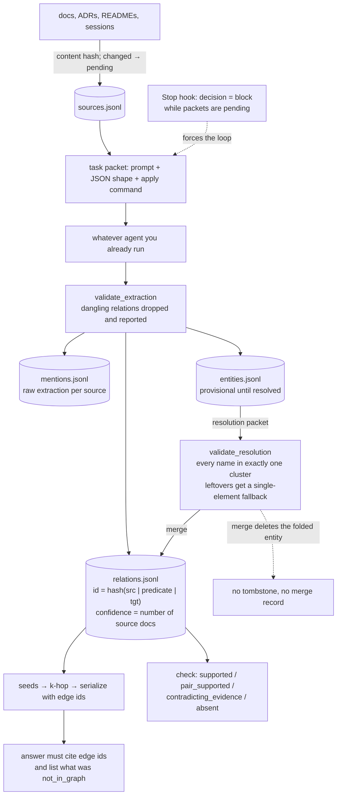

## 1. Executive Summary

growmos is a knowledge graph that lives in `.growmos/` beside a repository —
3,684 lines of Python across thirteen modules, **zero dependencies**, MIT, on
PyPI as `growmos` 0.1.5. It is one day old: the first commit and the pinned
commit are both dated 17 August 2026, twenty-three commits apart, so every
judgement here is about a design rather than about a project with a track
record.

**The memory is an edge, and its identity is the fact rather than the event.**
`_relation_id` is `r_` plus a hash of `(source_entity_id, normalized predicate,
target_entity_id)`, so the same triple extracted from a second document does not
append a second row — it appends a source id to the existing one and
`confidence` becomes `max(1, len(sources))`. **Confidence here is a count of
corroborating documents, not a number a model emitted**, which is a distinction
this atlas asks about in every report and rarely finds on the right side.

**The write path is not the agent choosing to remember.** `.claude/settings.json`
installs two hooks. `SessionStart` prints the brief and, when work is pending,
tells the agent to run the loop. `Stop` scans for changed documents and, if
packets are outstanding, returns `{"decision": "block", "reason": …}` — Claude
Code honours that, so the session cannot end until the graph is caught up, with
`stop_hook_active` checked so the block never loops. Most systems in this corpus
ask an agent to maintain memory in prose and record, in their own docs, that it
does not happen. This one takes the question out of the model's hands.

**Retrieval is graph traversal with the citation key attached.** Seeds come from
alias containment then token overlap against the question, `khop` induces a
subgraph, and `serialize` emits each triple sorted by corroboration with its
edge id and source labels inline. The answer schema is strict
(`additionalProperties: false`, every field required) and has two fields worth
naming: `cited_edges`, which the model can only fill from ids it was shown, and
**`not_in_graph`**, a first-class place to put the part of the question the graph
could not answer.

**It carries no capability mark, and the near-misses are unusually dense.** A
discrete `provisional` state that no read filters on; a `when` validity range
that nothing queries; an append-only `mentions.jsonl` that records extractions
but not mutations; a structured review verdict that lands in a memo rather than
on the node; committed gold sets scored for precision without a case asserting
that particular material must not be retrieved. Each is one small step from a
mark, which is what a one-day-old design with this much intent looks like.

## 2. Mental Model

A memory is a claim of the form *(entity) —[predicate]→ (entity)*, and it becomes
one by being extracted from a document that the store has hashed and registered.
The pipeline is the playbook the README cites: extraction, resolution, assembly,
querying, with an evaluation loop closing the circle. The deterministic half —
hashing, ids, validation, scoring, packing — is the CLI's; the judgement half —
what the entities are, which names are the same thing, what a profile says — is
handed to whatever agent is already running, as a task packet carrying the
prompt, the JSON shape, and the exact `growmos apply` command to feed the answer
back.

**Nothing is silently lost at either judgement step, and both validators say so
in code rather than in a comment.** `validate_extraction` drops any relation
whose endpoints are not among the extracted entities and *reports each drop* —
no dangling edges. `validate_resolution` requires every input name to land in
exactly one cluster; a name the model left out gets a single-element fallback
cluster and a recorded problem, and a name that appears twice keeps its first
assignment and a recorded problem. An entity that survives as a single-element
cluster is marked **provisional**: known, queryable, and flagged as not yet
reconciled.

Death is thin, and that is the honest weakness. `merge` folds one entity into
another — union of sources, longer description wins, aliases repointed, edges
rewritten onto the surviving id with their sources preserved — and then deletes
the folded entity outright. `compact` prunes edges whose endpoints no longer
exist. There is no state meaning *rejected*, nothing keyed on a value that a
later extraction would consult, and no record that a merge or a rename happened
beyond a two-hundred-entry ring buffer in `state.json`. Re-assert a name that was
merged away and it is created again, provisional, as though it were new.

## 3. Architecture

Nothing runs. `pip install growmos` puts a single CLI on the path; the store is a
directory of JSONL and JSON files that the module header describes as
deliberately hand-editable — *"an agent could maintain these files with a text
editor."* There is no database, no server, no embedding model, and the dependency
count is zero, which for a knowledge-graph tool is the whole operational
argument: the cost of adopting it is a directory in the repository.

The layout mirrors the tables: `sources.jsonl` (every document eaten, with its
content hash and status), `mentions.jsonl` (raw extraction output per source),
`entities.jsonl`, `aliases.jsonl` (alias plus type → entity id), `relations.jsonl`,
`profiles/*.json`, `prompts/*.md` (editable templates), `eval/gold/*.json`, and
`journal.md`. `schema.json` is versioned with a `history` array, and
`bump_schema` records why each version changed — the graph's vocabulary is itself
under change control.

Three surfaces read and write it: the CLI, an MCP server (`growmos mcp`, tools
for query, entity lookup, remember, link, check), and the installed hooks.
`growmos integrate` writes the wiring for Claude Code, Codex, Grok, Cursor and
Gemini, and a committed test asserts that running it twice is idempotent.

`growmos view` produces a self-contained offline HTML explorer with no server and
no dependencies, and `export` emits HTML, JSON, DOT, Mermaid, Cypher or SQL. By
this atlas's rubric a viewer is not a review surface, but as a way to see what a
graph has become it is better than most.

## 4. Essential Implementation Paths

- **Ingest queue.** `Store.register_source` hashes the file; a changed digest
  flips `status` back to `pending`, which is the whole incremental mechanism.
  `Store.scan` marks vanished files `missing` rather than deleting their rows.
- **Extraction.** `growmos next` emits a packet → the agent answers →
  `growmos apply extraction` → `schema.validate_extraction` →
  `Store.apply_extraction` records raw mentions, resolves each name against the
  alias map, creates provisional entities for the unmatched, and adds edges.
- **Edge identity and corroboration.** `Store._relation_id` and
  `Store.add_relation` (`src/growmos/store.py:394`).
- **Resolution.** `schema.validate_resolution` → `Store.apply_resolution` →
  `Store.merge` per cluster.
- **Retrieval.** `Graph.find_seeds` → `Graph.khop` → `Graph.serialize` →
  the `ANSWER_SCHEMA` contract in `schema.py`.
- **Fact-check.** `Graph.check_claim` (`src/growmos/graph.py:171`).
- **Evaluation.** `evaluate.py` — precision, recall and F1 raw and resolved
  against `eval/gold/*.json`, plus the ten-item `doctor` checklist.
- **Hooks.** `cli.py:cmd_hook` — `session-start` prints the brief and the pending
  work, `stop` returns the blocking decision.
- **Exclusions.** The default `exclude` list in `Store.init`.

## 5. Memory Data Model

An entity carries `name`, `type` (from a versioned per-preset vocabulary), a
description, its source ids, a mention count, and a `provisional` flag. An edge
carries `id`, `source`, `predicate`, `target`, `sources`, `confidence`, `created`,
`updated`, `schema_version`, and optionally `when`.

**Two fields are more interesting than their size suggests.** `schema_version` is
stamped on every edge, so a graph built under an older vocabulary is
distinguishable from one built after a `bump_schema` — most systems here version
the code and not the rows. And `when` is a `{start, end}` validity range set by
`growmos link --start/--end`, defaulting `end` to `"ongoing"`, preserved through a
merge — **validity time, separate from the `created`/`updated` record time**. No
read path filters on it, no query takes an as-of parameter, and nothing in the
serializer prints it, so the `bitemporal` mark is withheld on the same ground the
atlas withholds it elsewhere: the column exists and no question consults it.

Provenance is the model's strongest feature. Every edge names the documents it
came from; `mentions.jsonl` keeps the raw extraction per source so an edge can be
traced back past resolution to the sentence-level claim that produced it; and
`serialize` prints the source labels beside each triple, so the agent sees where
a fact came from at the moment it uses it. The one qualification: `compact`
rewrites `mentions.jsonl` deduplicated, so "never rewritten" in the module header
is true of content and not literally of the file.

There is no scope key. One `.growmos/` serves the repository and everyone working
in it, which the README states as the point — *"lets five agents share one
picture of the codebase without passing it through anyone's context window."*
That is a design choice rather than an oversight, and it is also why
`scope_enforced` does not apply.

## 6. Retrieval Mechanics

`find_seeds` scores entities by alias containment in the normalized question,
falling back to token overlap on entity names weighted slightly by degree, and
takes the top four. `khop` expands two hops by default, capped at 400 nodes.
`edges_within` takes the induced subgraph, and `serialize` sorts by descending
`confidence` — so **the triples the model sees first are the ones the most
documents agree on** — then prints each as
`(source) --[predicate]--> (target)  [r_abc123; from: docs/adr-7.md]`.

The packet's instruction is *"Answer using only the knowledge graph"*, and a
committed test asserts both that instruction and the presence of an `r_` id in
the rendered packet. The `ANSWER_SCHEMA` then requires `cited_edges` and
`not_in_graph`: the first is checkable against the ids that were actually shown,
and the second gives the model a sanctioned place to say what it could not find,
which is the affordance most retrieval prompts leave out and then complain about.

**Fact-checking is a separate read path and its failure behaviour is the good
part.** `check_claim` resolves both endpoints and returns one of four verdicts —
`supported`, `pair_supported` (an edge exists between the pair with a different
predicate), `contradicting_evidence`, or `absent`. When the claim is not
supported it does not stop at "no": it quotes what the graph *does* say about
each endpoint, a move the code names in a comment after its own worked example
(*"the 'Aldrin flew on Gemini 12' move"*). A refusal that carries the adjacent
true edges is more useful than a refusal, and it is testable — the committed case
asserts the verdict *and* that the evidence contains the two specific edges.

The failure modes follow from the design. Seeds are lexical, so a question that
names nothing in the graph by name retrieves from a poor starting set regardless
of how good the graph is; the test suite records this honestly, asserting that a
partial name (`"Armstrong"`) does not resolve. Two hops is a fixed horizon. And
nothing filters on `provisional`, so an unreconciled duplicate of an entity can
answer beside its canonical twin.

## 7. Write Mechanics

Three verbs write directly. `remember` creates or updates an entity with a
provenance label the caller supplies (`session:2026-08-17` is the documented
form); `link` adds an edge between two names, creating them if needed;
`journal` appends a timestamped, attributed entry to `journal.md`. Everything
else arrives through `apply`, which takes the agent's JSON, validates it, and
mutates the store.

Deduplication happens at two levels and both are content-derived rather than
similarity-based: the edge id is the hash of the triple, and the alias map keys
on `(normalized name, type)`. Re-asserting a known fact is therefore idempotent
in structure and additive in evidence — the corroboration count goes up.

**The maintenance schedule is the mechanism, and it is worth being precise about
what it does.** The `Stop` hook rescans for changed documents, and when a packet
is pending it emits a blocking decision whose reason names the pending source
count, the provisional entity count, and the next packet kind, then asks for
`growmos next` until "up to date" and a one-line journal entry. `stop_hook_active`
is checked first so a continuation triggered by the hook never re-blocks. The
`SessionStart` hook prints the brief and appends, when work is pending, a line
telling the agent to run the loop *"(it is quick and does not need permission)"*.

That parenthesis is the part to weigh. The blocking stop is a genuine mechanism —
memory maintenance that does not depend on the model deciding to bother, which is
the failure this atlas records more than any other. The permission line is the
opposite kind of thing: prose in a hook telling the model not to ask, which is a
sentence a user has not seen and cannot easily audit. Both ship in the same file
that `growmos integrate` writes into a repository.

### Operational cost

Writes are synchronous and local — file appends and a JSON rewrite, no model call
on the write path itself. The judgement steps cost one agent turn per packet, and
the packets are bounded by config (`max_docs_per_run` 50, `max_entities_per_doc`
40, `resolve_batch_size` 80, `chunk_chars` 6000). New memory is retrievable
immediately. Nothing re-reads the whole store on a timer; the only whole-store
passes are `compact` and `eval`, both invoked by hand. On the read path, the
packet is bounded by `max_triples` (300) and the k-hop node cap, and it is
assembled per question rather than injected every turn.

## 8. Agent Integration

The MCP server exposes query, entity lookup, `remember`, `link` and `check`, so
the graph is reachable from any MCP-capable client; the CLI covers the rest; and
`growmos integrate` writes each harness's own config format — including an
`AGENTS.md` block for the CLIs that read one. A committed test asserts the
integration is idempotent, which is the check that stops a second run from
duplicating a config block.

**The exclusion list is where this design says something most do not.** The
default `exclude` in `Store.init` skips `AGENTS.md`, `CLAUDE.md`, `GEMINI.md`,
`.claude/**`, `.cursor/**`, `.codex/**` and `.github/**`, under the comment
*"agent instruction files are protocol, not knowledge."* A graph that ingested
its own harness's instruction files would turn prompts into facts, and would give
anyone who can edit `AGENTS.md` a path into what the graph asserts. Drawing that
line in the default config, with the reason attached, is a small decision that
closes a real injection route.

The agent's authority over memory is high by design — it extracts, resolves,
summarises, writes gold sets and reviews nodes — and the compensating control is
that every one of those steps is a validated JSON shape rather than free text,
with the deterministic half kept out of the model's hands.

## 9. Reliability, Safety, and Trust

`confidence` is a corroboration count. That is the right shape and it has a
ceiling worth naming: it counts *documents*, so a claim repeated across five
files that all copied one another scores five, and the graph has no notion of
source independence. Cross-document agreement is still better evidence than a
model's self-reported certainty, which is what most of this corpus stores.

`provisional` is the closest thing to an epistemic state. It is set when a name
does not match the canonical set, it is honest about what it means, and every use
of it in the tree is a *counter* — the `doctor` checklist, the `status` line, the
health signals, the "what to do next" suggestion. No query filters on it. So a
provisional entity is treated as true by every read path while being reported as
unreconciled by every health surface, and `trust_state` is withheld on exactly
that gap.

The audit story is two-thirds built. `mentions.jsonl` is append-only in content
and carries every extraction with its source; `journal.md` is append-only and
attributed, and review outcomes land in it. What is missing is the mutation
record: a `merge` deletes an entity and rewrites its edges, a `rename` changes a
display name, and neither writes a durable event — `record_run` appends to a
`runs` array in `state.json` that is truncated to the last two hundred entries
and rewritten whole. So the store can tell you where a surviving fact came from
and cannot tell you what used to be there.

**The review loop inspects without adjudicating.** `growmos next` periodically
emits a review packet asking for one node's edges to be verified against its
sources; the answer is a strict `{ok, issues, fixes}`; `--reviewer` records
`agent` or `human`, gold files carry `_reviewed_by`, and `doctor` reports who
reviewed them. Then `apply review` writes `last_sample_ok` into state, appends a
run entry, and writes the verdict into `journal.md` as prose. It does not touch
the node, flag the edges the reviewer called wrong, or gate anything on the
result. A person can absolutely correct the graph — `merge`, `rename`, editing
the JSONL by hand — but the surface built for judging memory content records the
judgement beside the graph rather than on it, which is why `human_review` is
withheld.

Prompt injection has one considered defence (the instruction-file exclusion) and
one open surface: any document the graph is pointed at becomes extraction input,
and a repository's docs are writable by whoever can open a pull request. The
validators constrain the *shape* of what an extraction may claim, not its
content.

## 10. Tests, Evals, and Benchmarks

Twenty test methods in 314 lines against 3,684 lines of source, with CI. I did
not run them: `pyproject.toml` changed the day of this reading, inside the
seven-day cooldown.

The suite is small and pointed, and two cases stand out for what they choose to
assert. `test_check_claim_gives_playbook_feedback` checks a false claim
(*Armstrong commanded Gemini 12*), asserts the verdict is
`contradicting_evidence`, and asserts the evidence contains the two specific true
edges that refute it — testing the *quality of the refusal*, not just its
occurrence. And `test_eval_precision_perfect_recall_partial` asserts precision is
1.0 **and recall is less than 1.0**, naming the entity the extractor missed. A
test that pins a known imperfection, rather than the number the project would
prefer, is rare enough to copy.

The evaluation machinery is the substantial part. `eval/gold/*.json` are gold sets
written by whoever answers the gold packet — the agent by default, a human by
flag — and `growmos eval` reports precision, recall and F1 both raw and after
alias resolution, per document. `growmos doctor` runs ten checks and the suite
asserts the count and that "Provenance tracking" is among them. The loop the
README describes — change a prompt in `.growmos/prompts/`, rerun eval, watch F1
move — is real, and it is the closest thing to an experimental harness a project
this age usually has.

**`negative_eval` is withheld, and the near-miss is the gold sets themselves.**
Precision against a committed gold set penalises extracting what should not be
there, which is the property the mark is about; but precision is a score, and no
committed case asserts that particular material must not be retrieved. The
closest assertions are write-side — a dangling relation must be dropped, a
partial name must not resolve — which is the same distinction that keeps the mark
off other systems here.

No paper, no benchmark against another system, and no committed retrieval
evaluation beyond the gold sets. `METHODOLOGY.md` credits an external playbook —
*Knowledge Graph Engineering for Multi-Agentic Systems: The Anthropic Playbook* —
and the code cites it by section throughout (`§XI.F` on the confidence rule,
`§IV.B` on the resolution fallback). Those citations resolve to a document
outside this repository, so a reader can check the implementation against the
prose only if they have it.

## 11. For Your Own Build

### Steal

- **Key the edge on the fact, not the event.** `r_ + hash(source | normalized
  predicate | target)` makes a re-extraction idempotent in structure and additive
  in evidence, which is what turns "we saw this again" into corroboration rather
  than a duplicate row.
- **Let confidence be a count of independent sources.** A number a model emitted
  is a mood; the number of documents that say the same thing is a measurement,
  costs nothing to maintain, and gives the serializer a defensible sort order.
- **Print the citation key next to the fact.** Serializing each triple with its
  edge id and source labels means the answer schema can require `cited_edges` and
  the citation is checkable against what was actually shown.
- **Give the answer a `not_in_graph` field.** A sanctioned place to say what the
  store could not answer is cheaper than any hallucination defence applied after
  the fact.
- **Refuse with the adjacent evidence.** A fact-check that fails by quoting the
  true edges around each endpoint tells the reader what the graph believes
  instead, and it is directly testable.
- **Exclude the agent's own instruction files from ingestion, by default, with
  the reason in the config.** *"Agent instruction files are protocol, not
  knowledge"* is one comment that closes the path from "who can edit `AGENTS.md`"
  to "what the graph asserts".
- **Make the maintenance loop a control-flow property, not a request.** A stop
  hook that blocks while work is pending — with a re-entry guard so it cannot
  loop — is the answer to the failure this atlas records most often, where a
  contract asks the model to consult or update memory and nothing checks that it
  did.
- **Assert your known imperfection in a test.** Pinning recall below 1.0 and
  naming the missed entity turns a weakness into a regression detector.

### Avoid

- **Telling the model, in a hook, that an action does not need permission.** The
  blocking stop is a mechanism; *"it is quick and does not need permission"* is
  prose that pre-authorises a tool loop on the user's behalf, in a file installed
  into their repository by an integrate command.
- **A merge that deletes without a record.** Folding one entity into another is
  the single most destructive operation here, and afterwards nothing in the store
  says it happened — the ring buffer in `state.json` holds two hundred runs and
  is rewritten whole. Re-assert the merged-away name and it returns as new.
- **A validity range nothing reads.** `when` is written, preserved through a
  merge, and consulted by no query and no serializer. Either a read takes an
  as-of parameter or the field is documentation with a schema.
- **A review verdict that lands beside the thing it judged.** `{ok, issues,
  fixes}` is a good shape; writing it to a memo while the node keeps its edges
  unchanged means the next query cannot tell that somebody found it wrong.
- **A state that every health check counts and no query filters.**
  `provisional` is reported everywhere and enforced nowhere, so the graph is
  honest in its dashboards and unqualified in its answers.

### Fit

Take this if you want a shared, inspectable graph in the repository rather than a
memory service, and if the agents you run are MCP- or hook-capable so the
maintenance loop actually closes. The cost of trying it is genuinely a directory:
zero dependencies, plain files, and an offline viewer, so the exit cost is `rm -rf
.growmos`. The judgement-as-task-packet design also means it works with whatever
model you already pay for and needs no key of its own, which is the right shape
for a tool that wants to sit in someone else's workflow.

Walk away if you need multi-tenancy or per-user scope — there is one graph per
directory and no key on any record — or if you need a correction that binds: a
wrong fact can be merged, renamed or hand-edited, and nothing prevents the same
extraction from re-asserting it tomorrow. And treat the pin as a snapshot of
something a day old. The design is coherent and the intent is unusually clear;
what it does not have yet is any evidence of behaviour over time, which for a
memory system is most of the question.

## 12. Open Questions

- What would a read that filtered on `provisional` cost? The flag is already
  computed and counted everywhere; excluding provisional entities from the
  serialized subgraph, or marking them in the packet, is the difference between a
  dashboard signal and an epistemic state.
- `when` exists on the edge and is preserved through a merge. Was an as-of query
  intended, and would it key on `when` or on the source document's date?
- A merge is irreversible and unrecorded. Would an append-only merge event in
  `journal.md` — which is already the append-only, attributed file — be enough to
  answer "what used to be here", without a full event log?
- `confidence` counts documents, not independent sources. In a repository where
  ADRs quote the README, what does a corroboration count of five actually mean?
- The blocking stop hook is the strongest mechanism here and also the most
  intrusive. Is there a form of it that reports the pending work without
  overriding the user's decision to stop?

## Appendix: File Index

**Store and model**
- `src/growmos/store.py` — the `.growmos/` layout in its header, `add_relation`
  and the corroboration rule, `apply_extraction`, `merge`, `remember`, `link`,
  `journal`, `compact`, and the default `exclude` list in `init`
- `src/growmos/schema.py` — presets, the strict structured-output schemas
  (`ANSWER_SCHEMA` with `cited_edges` and `not_in_graph`), and the two validators
  that drop dangling relations and guarantee every name lands in a cluster
- `src/growmos/util.py` — hashing, normalization, id derivation

**Retrieval**
- `src/growmos/graph.py` — `find_seeds`, `khop`, `serialize`, `check_claim`,
  `diagnostics`, `entity_card`

**Loop and surfaces**
- `src/growmos/cli.py` — `next`, `apply` (extraction / resolution / profile /
  gold / review), and `cmd_hook` with the session-start brief and the blocking
  stop
- `src/growmos/mcp.py` — the MCP tool surface
- `src/growmos/integrate.py` — per-harness config writing
- `src/growmos/evaluate.py` — precision/recall/F1 raw and resolved, and the
  ten-item doctor
- `src/growmos/prompts.py`, `src/growmos/providers.py` — packet templates and the
  optional headless provider mode

**Configuration and docs**
- `.claude/settings.json`, `.mcp.json`, `server.json` — the installed hooks and
  the MCP manifests
- `METHODOLOGY.md`, `README.md`

**Tests**
- `tests/test_growmos.py` — twenty methods, including the fact-check refusal case
  and the eval case that asserts recall below 1.0

## History

**2026-08-17** — [`510deb2dfee151fb79402b0a3274025f9c1c2c71`](https://github.com/codician-team/growmos/commit/510deb2dfee151fb79402b0a3274025f9c1c2c71) — First reading, at 23 commits on a repository whose first commit is dated the same day, 17 August 2026, published to PyPI as `growmos` 0.1.5. Screened first: three auto-run surfaces, all invoking the project's own binary and all read before anything else — `.claude/settings.json` (`SessionStart` and `Stop` hooks running `growmos hook …`), `.mcp.json` and `server.json` (both declaring `growmos mcp`) — plus one manifest changed the same day, inside the seven-day cooldown, and one unpinned surface with no lockfile. Nothing was installed, built or run, so the twenty committed tests were read rather than executed. No capability mark: seven near-misses are stated in place, of which four are the interesting ones — a `provisional` entity state that every health surface counts and no read path filters on, a `when` validity range written and preserved through a merge but consulted by nothing, an append-only provenance file that records extractions while entity merges and renames leave only a two-hundred-entry ring buffer in `state.json`, and a structured review verdict (`ok`/`issues`/`fixes`, attributed to `agent` or `human`) that is written to a memo rather than onto the node it judged. The mechanisms worth the report are the content-derived edge id with confidence as a count of corroborating documents, the default exclusion of agent instruction files as *"protocol, not knowledge"*, the fact-check that refutes with the adjacent true edges, and the `Stop` hook that returns `{"decision": "block"}` while packets are pending — beside which the same hook file tells the agent the loop *"does not need permission"*. No paper; `METHODOLOGY.md` credits an external playbook that is not in the repository.
