## 1. Executive Summary

Guild is a single Go binary holding an MCP server and an embedded SQLite store,
meant to be driven by agents rather than by people — the README's framing is
that guildmasters stay in the loop for important decisions while the execution
loop is autonomous. Two stores sit inside it: *lore*, which is the memory, and
*quests*, which is a task board with atomic claims so parallel agents in
different editors do not collide.

Two marks.

**The status filter is an allow-list.** An entry carries one of nine statuses,
and the search path's default predicate names the four it will admit —
`current`, `seed`, `exploring`, `imported` — rather than the five it will
exclude. That direction matters: add a tenth status tomorrow and it is invisible
to search until somebody adds it to the list, which is the failure mode you
want. A deny-list gets the opposite default, and the report's second finding is
that the listing path beside it is written exactly that way.

**The exclusion test is its own control.** One fixture, one archived entry whose
title matches the query, run twice with the widening flag as the only variable:
zero results by default, exactly one with the flag. Neither half can pass for
the wrong reason while the other holds.

Two things here are worth taking even though they carry no mark. The hints
engine records, for every rule it fires, whether the agent then followed it,
ignored it, or has not yet been scored — so a rule has a denominator. And the
near-duplicate threshold is argued in a comment from two named reproducer
pairs and a measured Jaccard score, with the rejected alternatives written
down.

## 2. Mental Model

Lore is what the guild knows; quests are what it has to do.

A lore entry is small by construction: a topic slug, a kind, a title and a
summary the schema marks mandatory at two or three sentences, with the full
content optionally living in a file the entry points at. Entries link to each
other with three relations — one says this informs that, and the other two are
the epistemic pair, supersedes and contradicts.

The loop the README describes is: on session start an agent makes one call to
recover the project's standing instructions, the last handoff note and the
highest-priority quest; then it claims work, consults the lore, acts, and
records the outcome. Clearing a quest cascades to unblock its dependents.

What holds the memory honest is a status on every entry and a consolidation
pass that adjusts them.

## 3. Architecture

```mermaid
%% caption: a single Go binary serves lore and quests over MCP from embedded SQLite; an agent inscribes entries carrying one of nine statuses, and the search path fuses BM25 with vector similarity by reciprocal rank only when embedding coverage clears a threshold, falling back deterministically to keyword-only — with a default predicate that names the four statuses it admits rather than the five it excludes, while the listing path beside it denies two instead; a consolidation pass supersedes the older of an exact-duplicate pair and links it to the newer, and a hints engine scores each fired rule by whether the agent followed it, ignored it, or has not been scored yet
flowchart TD
    AG["any MCP client<br/>parallel agents, different editors"] --> BIN["one Go binary<br/>MCP server"]

    subgraph Lore["lore — what the guild knows"]
        INS["inscribe"] --> E[("entries<br/>topic · kind · title · summary<br/>status (9) · valid_days · needs_review<br/>access_count · prompted_by")]
        E --- L[("entry_links<br/>informs · supersedes · contradicts")]

        APP["appraise (search)"] --> COV{"embedding coverage<br/>≥ threshold?"}
        COV -->|yes| RRF["BM25 + vector, RRF fusion"]
        COV -->|no| BM["BM25 + stopwords<br/>deterministic fallback"]
        RRF --> FILT
        BM --> FILT
        FILT{"default: status IN<br/>current · seed · exploring · imported<br/>— an allow-list"}
        FILT -->|IncludeAll| ALL["every status"]
        FILT --> HITS["ranked entries<br/>access counters bumped"]

        LIST["list"] --> FILT2{"default: status NOT IN<br/>archived · superseded<br/>— a deny-list"}
        FILT2 --> ROWS["stale, promoted, parked visible here<br/>and not to search"]
        E --> APP
        E --> LIST

        COM["commune (consolidation)"] --> DUP["exact-duplicate pair"]
        DUP --> SUP["older → superseded<br/>+ superseded_by link, same pass"]
        SUP --> E
        NEAR["near-duplicate scan<br/>14-day window, Jaccard 0.40"] --> FLAG["flagged in the report<br/>never refused"]
    end

    subgraph Quests["quests — what it has to do"]
        Q[("task_status · task_notes")]
        TE[("task_events — append-only<br/>event · agent_id · data")]
        CLAIM["atomic claim"] --> Q
        Q --> CASC["clearing cascades<br/>to unblock dependents"]
        Q --> TE
    end

    subgraph Hints["hints engine"]
        H[("hints — rule · severity · cooldown<br/>enabled (0 = auto-disabled by prune)")]
        HF[("hint_fires<br/>followed: null pending · 1 · 0")]
        H --> FIRE["fires on a trigger tool"] --> HF
        HF --> SCORE["follow-through scored<br/>N calls later"] --> H
    end

    BIN --> Lore
    BIN --> Quests
    BIN --> Hints
```

## 4. Essential Implementation Paths

- **Schema:** `internal/storage/migrations/001_init.up.sql` and the eight
  migrations after it.
- **Search and its filter:** `internal/lore/appraise.go`,
  `appraise_rrf.go`.
- **Listing and its different default:** `internal/lore/list.go`.
- **Consolidation and supersession:** `internal/lore/commune.go`.
- **Near-duplicate detection:** `internal/lore/dedupe.go`.
- **Quest board and its event log:** `internal/quest/post.go`.

## 5. Memory Data Model

The entry table is where the report's material is. Nine statuses, a
`valid_days` column commented as days before auto-stale, a `needs_review` flag,
a `prompted_by` column naming the quest that caused the entry to be written,
and access counters the search path bumps on every returned row.

Two of those deserve a note.

`prompted_by` is provenance of an unusual kind — not where the content came
from but *what the agent was doing when it wrote this down*. For a substrate
whose whole point is that a later agent picks up the thread, knowing which task
produced a note is close to knowing why it exists.

`valid_days` is the one field whose writer went missing. It is set at insert by
three paths and read back by the search projection, and nothing found in this
reading moves an entry to `stale` when the window lapses — the status is there
and a caller may set it, but no sweep does. The column reads as a declared
intent rather than an enforced one.

## 6. Retrieval Mechanics

BM25 over FTS5 with a stopword tokenizer, fused with vector similarity by
reciprocal rank — but only when embedding coverage clears a configured
threshold. Below it the appraisal *"is identical to the Phase 0 BM25+stopwords
path and never constructs a vector arm"*, which the module attributes to an
architecture decision record on partial coverage and deterministic fallback.
Choosing determinism over a half-populated vector index, and naming the
decision, is the right way to handle a store that is still being embedded.

The status filter runs as part of the where clause, before ranking. Its
construction is the thing to copy: the code appends
`status IN ('current','seed','exploring','imported')` unless the caller asks for
everything. An allow-list default means the set of things an agent can be shown
only grows when someone decides it should.

The listing path takes the other approach — `status NOT IN ('archived','superseded')`
— with its own comment explaining that this exposes *"only actively-maintained
entries"*. Both hide something; they hide different things. An entry marked
`stale`, `promoted` or `parked` appears in a listing and never in a search.

## 7. Write Mechanics

Agents inscribe entries through MCP tools. The consolidation pass then does two
jobs on a schedule: reclassifying entries whose kind no longer fits their
length, and reforging exact-duplicate pairs — marking the older of the two
`superseded` by id and writing a `superseded_by` link in the same pass, with
both actions recorded in a report of fixes applied.

Near-duplicates are a separate, softer mechanism, and its comment is a model of
how to justify a threshold. The window is fourteen days because agents doing
topical audits write observations within days of each other and *"extending
beyond 2 weeks risks surfacing intentional re-assessments of slowly-evolving
topics"*. The Jaccard floor is 0.40 because a named reproducer pair scored
about 0.55, while 0.30 *"would catch even looser paraphrases but fires on
entries that merely share a topic abbreviation"*. Two real cases, a measured
score, and the rejected alternative — that is what a tuned constant should look
like. The outcome is a flag in a report; nothing is refused.

## 8. Agent Integration

One compiled binary, no runtime dependencies, an MCP server any client can
attach to. Atomic claims on the quest board let parallel agents in different
editors take work without colliding. Install scripts for both platforms and a
recipe directory.

## 9. Reliability, Safety, and Trust

**Trust state — awarded**, on the nine-value status and the search path's
allow-list default, with the supersession writer in `commune.go` as the
producer. The limit is in the evidence record and it is a real one: two read
paths, two different defaults.

**Negative eval — awarded**, on the paired archived-entry case.

**Tombstone — withheld.** The near-duplicate scan is the only value-shaped
mechanism and it flags rather than refuses, within a fourteen-day window, and
nothing consults a record of what was rejected when the next entry is written.

**Audit log — withheld, and the asymmetry is worth naming.** The quest board
has `task_events`, an append-only log carrying the event, the acting agent and
a payload, written on every post. Lore has no counterpart: an update rewrites
the row in place, and no prior version is kept anywhere. The coordination half
of this system is auditable and the memory half is not, which is the reverse of
where the atlas usually finds the gap.

**Human review — withheld.** `needs_review` is a boolean, and its tool schema
describes it as a flag for human review — but it is a parameter on the
`inscribe` tool the writing agent itself calls, so the agent decides whether
its own entry needs a person. It is surfaced on read, which makes it a label
carried to whoever is looking rather than a gate on anything.

**Scope enforced — withheld.** Every entry carries a project id and the listing
path always scopes by it, but the search path's cross-project mode is
documented as *"recommended for research queries"* and the filter is applied
only when the caller declines it. That is organisation rather than isolation,
which suits a single developer's machine.

**Bi-temporal — withheld.** `created_at` and `updated_at` are record time;
`valid_days` is a duration with no reader.

## 10. Tests, Evals, and Benchmarks

**No paper** and no `CITATION.cff`.

143 test files against 349 source files. The one carrying the mark is quoted in
section 9; what is missing beside it is a test for the listing path's different
default, which is how a divergence between two read paths survives.

The hints engine is the piece of measurement work worth describing. Every rule
fires at most once per cooldown window, and every firing writes a row whose
`followed` column is null until a scorer runs some number of calls later and
sets it to one or zero. The schema comment explains the design in a sentence
that generalises well past this repository: the pending value exists so that a
fired rule has *"an obey count and not only an ignore count"*. A rule that
stops landing is auto-disabled by a prune, and one rule carries a per-era
severity payload so it demotes itself in the context where it was measured to
hit that floor. A system that scores its own advice, and keeps the denominator,
is doing something most nudge layers do not.

No benchmark result is committed.

## 11. For Your Own Build

- **Write the status filter as an allow-list.** Naming the statuses you admit
  means a status added later is excluded until someone decides otherwise;
  naming the ones you exclude means it is visible by default.
- **Then check your other read paths agree.** Two defaults that hide different
  sets is a divergence no test here would catch, and it is invisible until
  somebody notices a stale entry in one view and not the other.
- **Keep the denominator on a nudge.** A fired-and-ignored count without a
  fired-and-followed count cannot tell a bad rule from an unlucky one.
- **Argue the threshold from named cases.** Fourteen days and a Jaccard floor
  of 0.40, each with the reproducer that set it and the alternative that was
  rejected, is a constant a later maintainer can re-derive.
- **Fall back deterministically rather than partially.** A vector arm over a
  half-embedded corpus is worse than no vector arm, and saying which regime you
  are in beats silently blending them.
- **Record what the agent was doing when it wrote the note.** A pointer from an
  entry to the task that prompted it is provenance a later reader can act on.

## 12. Open Questions

- The search path admits four statuses and the listing path denies two. Is the
  difference deliberate — a listing being a maintenance view and a search being
  a steering one — and if so, should the listing say that where the default is
  set?
- `valid_days` is documented as days before auto-stale and nothing found here
  performs the transition. Is the sweep planned, or is the column a caller's
  responsibility?
- The quest board keeps an append-only event log and lore keeps none. Would the
  same table shape carry lore mutations, or is the entry's own status history
  considered sufficient?

## Appendix: File Index

- Schema and migrations: `internal/storage/migrations/`
- Search, its filter and fusion: `internal/lore/appraise.go`,
  `internal/lore/appraise_rrf.go`, `internal/lore/appraise_test.go`
- Listing: `internal/lore/list.go`
- Consolidation and supersession: `internal/lore/commune.go`
- Near-duplicate detection: `internal/lore/dedupe.go`
- Snapshot archive and restore: `internal/lore/archive.go`,
  `internal/lore/restore.go`
- Quest board and its event log: `internal/quest/post.go`,
  `internal/quest/restore.go`
- Hints engine: `internal/hints/`

## History

**2026-09-19** — [`139cab9b72aa859618cc3065264983249be3fd42`](https://github.com/mathomhaus/guild/commit/139cab9b72aa859618cc3065264983249be3fd42) — first reading, at the head of `main`, Go 1.25. Screened with `scripts/screen_repo.py` before anything was read: one build-time execution surface in a Makefile whose default target was checked, an `AGENTS.md` and a `CLAUDE.md` addressed to a reading agent and read as data throughout, and a committed `go.sum` unchanged for twenty-three days. Nothing was installed, built or run. Apache-2.0. Two marks. The reading covered the nine migrations and the entry and link schema, both read paths and their differing defaults, the fusion threshold and its deterministic fallback, the consolidation pass and its supersession writer, the near-duplicate thresholds and their stated rationale, the hints engine's fire and follow-through tables, the quest board's event log, and the appraisal test suite; the CLI, install, release, session and telemetry packages were read as context rather than as subject. Five marks are withheld with reasons in section 9, and the one worth repeating is `audit_log`: the quest board keeps an append-only event log and lore, which is the memory, keeps none — an update overwrites in place with no prior version kept.
