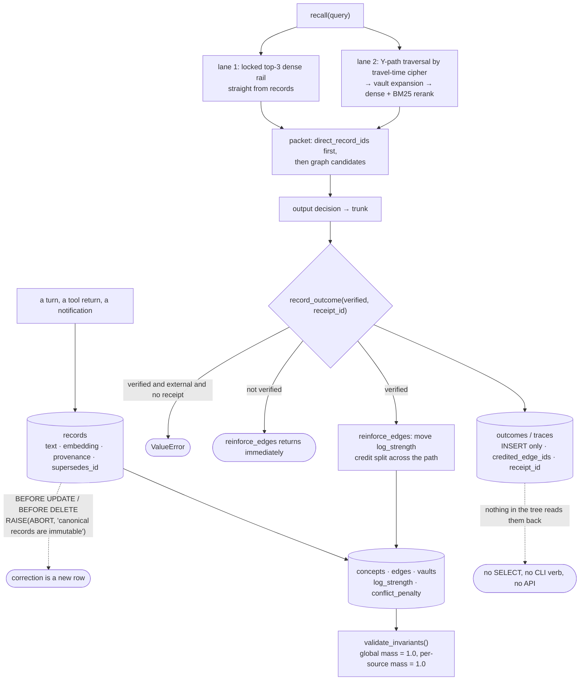

## 1. Executive Summary

Habitus AI is a memory engine with **no runtime dependencies at all** —
`dependencies = []` in `pyproject.toml`, one SQLite file, pure Python — Apache-2.0,
5,551 lines under `src/` against 893 of tests, two commits both dated 28 August
2026.

Its documentation is written in the register of a physics paper: a folded
hourglass bicone, an immutable `SELF` at layer zero, perceptual trunks `HEAR`,
`SEE`, `NOTICE` above and effector trunks `SPEAK`, `LOOK`, `DO` below, a
travel-time cipher and conserved fluid edge weights summing to 1.0. The atlas
has read three of this author's systems already —
[AIMAOS](../aimaos/), [Cognitive Spatial Memory](../cognitive-spatial-memory/)
and [Helix AGI](../helix-agi/) — and the recurring question for the family is
whether the physics is machinery or vocabulary.

Here a good deal of it is machinery, and the report's job is to separate the
parts. **One mark**, and three mechanisms that deserve to be copied
independently of the geometry they arrive wrapped in:

- Canonical records are immutable because **SQLite triggers abort every UPDATE
  and DELETE**, and both directions are tested.
- The conservation claim is a **checked invariant**, not a slogan:
  `validate_invariants` verifies global and per-source edge mass against 1.0 and
  is called from the CLI, the app, the demo and two tests.
- Durable learning **discards an unverified outcome** and refuses a verified
  external one that carries no receipt id.

Against that, the default embedding space is a hash, the audit tables have no
reader, and the one field that could scope a read never reaches a query.

## 2. Mental Model

Two things are stored and only one of them can change.

A **record** is canonical and permanent. It carries its text, its embedding, its
provenance and an optional pointer at the record it supersedes, and the database
will not let anything modify or remove it. Correction is addition.

The **graph** is where everything mutable lives — concepts, and edges between
them carrying a `log_strength` and a `conflict_penalty`. Retrieval walks the
graph; learning moves the edges. Because the strengths are normalised to sum to
one, reinforcing a path necessarily costs its competitors, which is the design's
answer to score inflation.

The interesting boundary is what is allowed to move an edge.



## 3. Architecture

One SQLite file and nothing else. Eleven tables — records, record links,
concepts, edges, edge evidence, vault membership, traces, outcomes, experience
state, experience projections and overlap clusters — plus two triggers and six
indexes, all created inline. `chromadb`, `pinecone-client` and `pgvector` sit in
an optional `vector-stores` extra behind `vector_adapters.py`; nothing needs
them.

The zero-dependency claim is true and it has a price, described in section 6.

## 4. Essential Implementation Paths

**Immutability is a database property, not a convention.**

```sql
CREATE TRIGGER IF NOT EXISTS records_are_immutable_update
BEFORE UPDATE ON records BEGIN
    SELECT RAISE(ABORT, 'canonical records are immutable');
END;
```

with the matching `BEFORE DELETE`. This is the strongest form of the guarantee
available in SQLite: it survives a caller that bypasses the store class, and it
holds for anything that opens the file. Most systems in this corpus that call
their records immutable enforce it in the write method and leave the table
writable underneath.

**The conservation invariant is checked, and by more than a test.**
`validate_invariants` walks the graph and returns a list of strings: `SELF` must
exist, every seed trunk must exist, the global edge mass must be 1.0 within
tolerance, **the local probabilities out of every source on both sides must sum
to 1.0**, `SELF`'s input frontier must be exactly `HEAR`/`SEE`/`NOTICE` and its
output frontier exactly `SPEAK`/`LOOK`/`DO`, and every lower child must have an
overlap cluster and carry no semantic payload. It is called from `cli.py`,
`app.py`, `demo.py`, and asserted empty in two tests. A physics claim with a
checker attached is a different kind of claim from one without.

**Learning is gated twice.** `record_outcome` raises before it stores anything
when the outcome claims to be verified on an external trunk and carries no
receipt id:

```python
if verified and decision.trunk is not None and not receipt_id:
    raise ValueError("verified external outcomes require a receipt ID")
```

and `reinforce_edges` opens with `if not verified: return`. So an unverified
outcome is recorded and changes no weights, and a verified one cannot be
asserted without naming the receipt that backs it. The credit is then split
`1.0 / len(credited)` across the path's edges and scaled by an evidence-quality
factor, with a negative delta raising the edge's `conflict_penalty` rather than
only lowering its strength.

The gate checks that a receipt *id* is present. It does not check that the
receipt exists, that it succeeded, or that it matches the decision — the
`ToolReceipt` dataclass carries `status`, `verified` and `error` fields, and
nothing on this path consults them.

**The two lanes meet on a canonical id.** Lane 1 pulls the top three dense
neighbours straight out of the records table; lane 2 traverses the graph and
expands vaults. `test_graph_candidates_cannot_evict_three_direct_records`
asserts `selected_record_ids[:3] == direct_record_ids`, so a graph score cannot
displace the direct rail — the eviction failure the README's comparison table
claims as a differentiator, tested.

## 5. Memory Data Model

A record carries `record_id`, `event_id`, `record_type`, `source_id`,
`timestamp`, `text`, `embedding_json`, `provenance_json`, `metadata_json` and
`supersedes_id`. Two absences shape what the system can say.

**There is no epistemic status.** `RecordType` is a kind — `FACT`,
`OBSERVATION`, `INBOUND_MESSAGE`, `OUTBOUND_MESSAGE`, `RECEIPT` — and the only
confidence in the schema is a float on `experience_projections`. Nothing can
mark a record disputed, unverified or withdrawn; the strongest statement
available is that a later record supersedes it.

**There is one time axis.** `timestamp` is set by the caller or defaults to
`utc_now()` at write, and no column records when a fact was true as distinct
from when the row arrived. Concepts carry `created_pulse` and
`last_active_pulse`, which are logical clocks over the graph rather than a
validity axis on a fact.

`source_id` is stamped on every record and defaults to `"human"`. No read path
filters on it, so it is provenance for a reader rather than a scope key —
the corpus's most common declared-and-unapplied shape, at its most benign here
because the system is single-tenant by construction.

## 6. Retrieval Mechanics

Lane 1 is dense top-3 against the records table, locked. Lane 2 computes
travel times along Y-paths — `Δy / (ε + local_probability) + conflict_penalty` —
activates the visited nodes' vaults, and reranks the pooled candidates by dense
similarity plus BM25.

**The default dense space is a hash.** `DeterministicHashEmbedder` builds a
1024-dimension vector by hashing tokens at weight 1.0, character trigrams at
0.20 and adjacent token pairs at 0.35, signing each by a digest bit and
normalising. Its own docstring is candid — *"Offline lexical embedder for
reproducible tests and demonstrations. Production callers should supply an
actual semantic model"* — and an `Embedder` Protocol plus the vector adapters
make substitution easy.

That candour is in the code and not in the README, which contrasts Habitus
against "Traditional Vector RAG" and describes "shared 1024D concept vectors"
and "dense nearest neighbors" without saying that the shipped space is lexical.
A reader running the demo is comparing a hashed bag of tokens against BM25, and
the "Dense + BM25 hybrid" is then two lexical signals.

## 7. Write Mechanics

Synchronous and insert-only. A record is written, its embedding computed inline,
its concepts and vault membership updated, and the traversal trace saved. There
is no queue and no background pass; gestation and hatching are explicit calls,
and `test_gestation_and_agent.py` pins that hatching twice raises `already
hatched`.

## 8. Agent Integration

A Python library first, with `HabitusAI` and `HabitusMemory` aliasing
`BaseAgenticMemoryRAG`, a CLI, an agent wrapper, and a `ToolRegistry` that binds
each tool to an output trunk — `SPEAK` for verbal, `LOOK` for non-mutating
inspection, `DO` for external state change — and returns a `ToolReceipt` from
every execution. The trunk classification is the part of the geometry that earns
its keep: distinguishing an inspection from a mutation before the call is a
distinction most tool layers make after it, if at all.

The README's capability table names this mechanism `ActionReceipt`. The tree
contains `ToolReceipt` and an `AudioReceipt`, and no `ActionReceipt`.

## 9. Reliability, Safety, and Trust

The immutability triggers, the verified-only reinforcement and the invariant
checker are three independent guards, and each is the enforced rather than the
documented version of its claim. That is unusual in this corpus and it is the
reason to read the repository.

What is missing sits on the other side of the write. There is no scope key on
any query, no status a record can carry, no validity axis, and no review
surface. And the audit tables — the one mark this report awards — are
**write-only**: `save_outcome` and `save_trace` are bare `INSERT`s with no
`SELECT` against either table anywhere in `src/`, no CLI verb that lists them
and no API that returns them. The record of which weights moved and on what
evidence is being kept faithfully for a reader who does not yet exist.

## 10. Tests, Evals, and Benchmarks

Thirty-seven test functions across ten files, 893 lines. Nothing was run for
this review; the README's badge says 31, which is stale in the harmless
direction.

The suite is aimed at the guarantees rather than at coverage, which is the right
choice at this size. `pytest.raises(sqlite3.IntegrityError, match="immutable")`
appears twice, once for the update trigger and once for the delete;
`pytest.raises(ValueError, match="receipt")` pins the learning gate;
`validate_invariants() == []` is asserted after a reload, which makes it a
persistence test as well as a topology one. `test_multiresolution_memory.py`
asserts `"text" not in projection.metadata` and `"text" not in columns` — the
projection layer must carry activations and not content.

**`negative_eval` is withheld and the near-miss is worth naming, because it
points the other way.** The retrieval suite's strongest case,
`test_graph_candidates_cannot_evict_three_direct_records`, asserts that
particular material must *not be evicted* — the mirror of the column, and a
rarer assertion. What no committed case does is establish that particular
material must not be **returned**: no distractor is asserted absent from a
result, and no query is asserted to retrieve nothing.

No benchmark result is committed and none is claimed, which is worth stating
plainly given that the same author publishes
[FP-AMB](https://github.com/munch2u-a11y/FP-AMB), a memory benchmark this atlas
[reads on its benchmarks page](../../benchmarks/#a-benchmark-whose-baseline-wins-and-the-category-that-cannot-fail).
Habitus AI does not appear in its committed scorecards.

## 11. For Your Own Build

**Enforce immutability in the database, not in the method.** Two triggers and
four lines make "canonical records are immutable" a property of the file rather
than a property of the code path everyone happens to use.

**Give your conservation law a checker, and call it from more than a test.**
`validate_invariants` returning a list of strings — checked by the CLI, the app
and the demo — is what separates a normalisation that holds from one that is
asserted to hold in the README.

**Make unverified feedback a no-op rather than a small update.** `if not
verified: return` at the top of the reinforcement function is a stronger
statement than a confidence multiplier, because there is no setting of the
weights at which unverified evidence leaks in.

**Then read the receipt you demanded.** Requiring a receipt id and never
checking the receipt's `status` leaves the gate satisfiable by any string.

## 12. Open Questions

**Who is supposed to read `outcomes` and `traces`?** The rows carry exactly what
a debugging session would want — which edges moved, by how much, under which
receipt. Nothing surfaces them, and a log with no reader tends to drift out of
correctness unnoticed.

**What does the geometry buy over a flat graph?** The invariants pin the shape —
`SELF` at the centre, three trunks each side — and nothing committed measures a
retrieval difference against an unstructured baseline. The author's own
benchmark would answer it.

**Does the travel-time cipher beat cosine on anything?** The formula is central
to the design and no test or artifact compares it against the direct rail alone.

## Appendix: File Index

| Path | What it holds |
| --- | --- |
| `src/habitus_ai/store.py` | The eleven tables, the immutability triggers, `save_outcome` and `save_trace` |
| `src/habitus_ai/graph.py` | `reinforce_edges`, the verified gate, `validate_invariants` |
| `src/habitus_ai/pipeline.py` | Ingest, `record_outcome` and the receipt requirement |
| `src/habitus_ai/retrieval.py` | The two lanes and the rerank |
| `src/habitus_ai/embeddings.py` | `DeterministicHashEmbedder` and the `Embedder` protocol |
| `src/habitus_ai/tools.py` | `ToolReceipt`, the trunk binding, `ToolRegistry.execute` |
| `tests/test_store_and_topology.py` | The two immutability assertions |
| `tests/test_graph_and_learning.py` | The receipt gate assertion |
| `tests/test_retrieval_pipeline.py` | The direct-rail eviction test, invariants after reload |

## History

**2026-08-29** — [`f93b770e4b3c1875151dc13eb90421598c3efa5f`](https://github.com/munch2u-a11y/Habitus-AI/commit/f93b770e4b3c1875151dc13eb90421598c3efa5f) — first reading, Apache-2.0, 5,551 lines under `src/` and 893 of tests across ten files, two commits both dated 28 August 2026. Screened before reading: no auto-run surface, no build-time execution surface, one unpinned surface and a `pyproject.toml` modified the same day. Nothing was installed and nothing was run. One mark. `audit_log` rests on `outcomes` and `traces` being insert-only records of which edge strengths a pulse changed and under which receipt, with the caveat recorded in the evidence field that nothing in the tree reads either table back. `tombstone` is withheld because `supersedes_id` is supersession; `trust_state` because `RecordType` names a kind and the only confidence is a float on a projection; `bitemporal` because a record has one timestamp and no validity axis; `scope_enforced` because `source_id` is stamped on every record and no query filters on it; `human_review` because no approval, review or quarantine surface exists. `negative_eval` is withheld with the near-miss named: the retrieval suite asserts that the direct rail's records cannot be *evicted*, which is the mirror of the mark, and no committed case asserts that particular material must not be returned. The fourth system from this author in the atlas, after [AIMAOS](../aimaos/), [Cognitive Spatial Memory](../cognitive-spatial-memory/) and [Helix AGI](../helix-agi/). The reading covers the store, the graph, the pipeline, retrieval, tools and the tests; the app, the audio path and the vector adapters were not traced.
