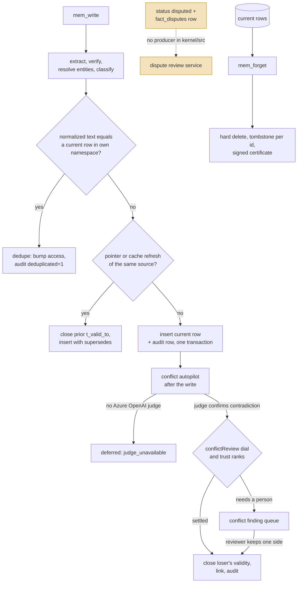

## 1. Executive Summary

Halofy is a memory kernel for an organization's agents, published under
AGPL-3.0-or-later with the retriever driver interface under Apache-2.0. It is
about 96,000 lines of TypeScript in `kernel/src` with 208 test files, released
as twelve commits between 22 and 24 August 2026; the initial commit's message
calls it the "public release of the Halofy memory kernel", and
`OPEN-SOURCE-SCOPE.md` names what stays in a commercial product — an AI gateway,
billing, managed channels, a hosted connector catalogue and the tuned extraction
prompts.

The design is a governance boundary with memory behind it, and the boundary is
built with unusual care:

- **Identity is server-owned.** The namespace, actor and role come from the API
  key, and no MCP tool schema accepts an identity field.
- **Every read is an enumerated ancestor list.** A caller in `acme/eng/platform`
  sees rows in exactly `acme`, `acme/eng` and `acme/eng/platform`, compiled as a
  bound `IN` list; subtree operations use escaped `LIKE … ESCAPE '\'` anchored on
  `/`, with regression tests for `_` and `%` in namespace names.
- **Every outcome audits, in the same transaction.** Writes, faults, allocations,
  denials, misses and errors append to `audit_log`, and each row carries a
  sha256 hash chained to the previous one.
- **Retrieval is delegated and read-only.** A driver receives a `ScopedView` and
  returns references; a Mem0 sidecar driver may only reorder the candidates it
  was sent. A six-check conformance kit tests any driver against that contract.
- **Corrections never overwrite.** Supersedence closes the prior row's
  `t_valid_to` and links it; the one delete is `mem_forget`, which writes
  tombstones and an ed25519-signed deletion certificate.

The finding that matters most is a documented mechanism with no producer. The
architecture guide and the write path's own comment describe a trust-ranked
quarantine: a lower-trust write that contradicts a higher-trust fact lands as
`status = 'disputed'`, invisible to reads, with an open `fact_disputes` row for a
reviewer. The migration adds the status, `disputes/index.ts` implements the
review state machine, and read paths filter on it. Nothing in `kernel/src`
inserts a `fact_disputes` row or sets a memory row to `disputed`; the only
inserts are in `test/disputes.test.ts:107` and `test/feedback.test.ts:82`. The
constant `SUPERSEDE_MIN_COSINE = 0.75` that names the write path's "synchronous
band" is declared at `write/index.ts:134` and read nowhere. What does run is an
out-of-band conflict autopilot that asks a model whether neighbouring facts
contradict, settles the result by the same trust lattice, and queues what it
may not settle for a person — and it runs only when an Azure OpenAI conflict
deployment is configured.

Four marks: `scope_enforced`, `audit_log`, `human_review`, `negative_eval`.

## 2. Mental Model

A memory is a `memory_objects` row in L2, the warm tier, or a concept document
in L3, the cold tier. An L2 row carries four times: `event_time` (when the
described thing happened), `assertion_time` (when the system was told),
`t_valid_from` and `t_valid_to` (the interval over which the row is believed).
"Current" means `t_valid_to IS NULL`.

A row becomes memory through the write path and stops being current in one of
four ways:

- **Exact dedupe** keeps the existing row and bumps its access telemetry.
- **Deterministic refresh** — a pointer fact or a cache-refresh write from the
  same source document — supersedes its stale predecessor: the old row's
  validity closes and the new row's `supersedes` points at it, in one
  transaction guarded against a concurrent writer closing the same victim.
- **A model-judged contradiction** is settled by the conflict autopilot using
  the provenance lattice `manual 50 > document 40 = live-fetch 40 >
  consolidation 30 > swap-import 20 > conversation 10`, or queued for a person,
  depending on the namespace's `conflictReview` dial.
- **Compliance erasure** hard-deletes the row and leaves a tombstone keyed on
  its id.

Nothing in that list records a rejected *value*. Tombstones name erased ids;
an erased fact asserted again is a new row. So `tombstone` is withheld.

The validity interval is kept honestly: supersedence never mutates content, and
`mem_search` with `validOnly: false` opens a lane that includes superseded rows.
But no read takes a time and returns what was believed then — the reads filter
on `t_valid_to IS NULL` or drop the filter — so `bitemporal` is withheld. The
`t_valid_from <=` comparisons in `skills/store.ts:485` and `skills/vetting.ts:697`
version skill records, not memory.

`trust_state` is withheld for the unwired reason above: the one status that
judges a memory contestable, `disputed`, is never written. `archived` is written
when a source document is removed, together with a closed `t_valid_to`
(`ingest/kernel-store.ts:483-617`, `knowledge-bases/sources.ts:208`), and by an
admin's `archive_warm` placement action (`movement/index.ts:453`), so it records
what happened to a source or where a row lives rather than a judgement about
whether the fact holds.

## 3. Architecture

`kernel/` is one Node 22 package: the kernel library, an HTTP server, an MCP
server over stdio and `/mcp`, a CLI, and a frameworkless console served by the
HTTP server.

| Area | Where | Role |
| --- | --- | --- |
| Syscalls | `src/syscalls/index.ts`, `src/kernel.ts` | Role check, effective policy, tenant gate, token-bucket rate limit, op body, audit |
| Index | `src/index/index.ts` | Every read and write of `memory_objects`; the ACL predicate |
| Write path | `src/write/` | Extraction, verification, entities, classification, dedupe, insert |
| Retrieval | `src/driver/`, `src/retrieval/` | `ScopedView`, baseline, graph and Mem0 drivers, BM25 and hybrid merge |
| Allocator | `src/allocator/` | Token-budgeted working sets |
| Fault | `src/fault/` | L2 then L3 on absolute scores |
| Cold tier | `src/cold/` | Concepts from markdown with YAML frontmatter, encrypted private bodies |
| Conflicts | `src/conflict-autopilot/`, `src/conflict-scans/` | Model-judged contradictions, trust-ranked settlement, findings queue |
| Consolidation | `src/consolidation/` | Knowledge proposals and their review |
| Erasure | `src/erasure/`, `src/erasure-fence.ts` | `mem_forget`, tombstones, certificates, a generation fence against concurrent writes |
| Audit | `src/audit/` | Hash-chained append-only log |
| Schema | `src/db/migrations.ts` | 4,632 lines of numbered migrations |

The database is the authority. Without `DATABASE_URL` the kernel embeds PGlite
with pgvector — the same schema and SQL — so the demo and the test suite need no
server, no key and no network: a `StubLlm` and a 256-dimension `HashEmbedder`
stand in for models. Warm-store mirrors and retriever sidecars are caches; an
unreachable mirror writes to a durable outbox and the syscall still succeeds.

### Deployment and ergonomics

- **Nothing external to start:** `npm ci && npm run demo` boots the real kernel
  on embedded PGlite. Durable deployments use Postgres with pgvector, Docker
  Compose or the Kubernetes manifests in `kernel/deploy/`.
- **Keys:** `cli.ts keygen <namespace> <actor> <role>` mints an API key; MCP and
  HTTP resolve everything from it.
- **Models are optional and degrade loudly.** Without an LLM, writes store
  content verbatim and classification still runs; without an embedder, search
  falls back to BM25 and audits `driver=bm25-degraded`; a dead driver sidecar
  falls back to baseline and audits `driver_fallback`.
- **Two capabilities need specific configuration:** the conflict judge needs an
  Azure OpenAI conflict deployment (`kernel.ts:1414-1427`), and certificates stay
  verifiable across restarts only with `HALOMEM_SIGNING_KEY` set; otherwise an
  ephemeral key is generated at boot with a warning.
- **Hand-repairable:** it is plain Postgres with a readable schema, but a
  hand-edited `memory_objects` row bypasses the audit chain the system exists to
  keep.

The screen of this checkout found no auto-running configuration, no build-time
execution path, no manifests inside the seven-day cooldown and two unpinned
surfaces across seven scanned files, plus `AGENTS.md` read as data. Nothing was
installed or run.

## 4. Essential Implementation Paths

- **Identity** — API keys resolve to an `Identity` in `src/auth/`; the MCP
  tools in `src/mcp/tools.ts` take the identity from context, never from
  arguments.
- **ACL** — `namespaceAncestors` at `src/index/index.ts:75`; every read method
  binds the list into `namespace IN (…)` with `status = 'active'` and, by
  default, `t_valid_to IS NULL` (e.g. `:459-462`). `readScopeSql` (`:96`) adds
  governed subtree grants as escaped prefix predicates and returns `FALSE` when
  a scope grants nothing.
- **Write** — `WritePath.write` in `src/write/index.ts`: extraction unless
  `hints.verbatim` (`:330`), exact dedupe against the caller's own namespace
  (`:560-597`), deterministic pointer or cache refresh as the only in-path
  supersedence (`:600-611`), insert plus `closeValidity` in one transaction with
  the audit row (`:714`). `TRUST_RANK` is at `:156`; the comment above it
  (`:150-155`) describes a quarantine to `disputed` that the file does not
  implement.
- **Conflict autopilot** — `src/conflict-autopilot/index.ts`: each committed fact
  judged once against eight nearest neighbours above cosine 0.6; `autoDecision`
  (`:228-248`) settles by rank under `auto`, only for an outranking write under
  `lower-trust` (the default, `policy/store.ts:231`), and never under `all`.
  Kicked after writes (`kernel.ts:1798`).
- **Conflict findings** — `src/conflict-scans/index.ts`: manual scans and
  autopilot findings in `conflict_scan_findings`; resolution (`:1160-1215`)
  claims the finding, closes the retired fact's validity with a guard, links it,
  dismisses other findings citing it, and audits in one transaction.
- **Disputes** — `src/disputes/index.ts` resolves `fact_disputes` rows with
  `uphold-new`, `keep-old`, `edit` or `both-valid`; no source file creates one.
- **Consolidation** — `src/consolidation/index.ts`: `prepare` (`:312`) drafts
  proposals, inserted as `pending_review` (`:394`); `reject` (`:440`), `edit`
  (`:471`) and `approve` (`:545`) record `proposal_decisions` and publish a new
  immutable knowledge version on approval.
- **Search** — `kernel.memSearch` (`kernel.ts:8148`) → policy-selected driver
  over `buildScopedView` (`src/driver/view.ts`).
- **Fault** — `src/fault/index.ts`: L2 accepted at an absolute
  `0.6 · cosine + 0.4 · BM25` of at least 0.35 (`:50`, `:401`), else L3 concepts
  at 0.15 (`:58`), else a miss.
- **Erasure** — `src/erasure/index.ts`, called from `memForget`
  (`syscalls/index.ts:1677`).
- **Audit** — `appendAuditEventTx` at `src/audit/index.ts:110`.

## 5. Memory Data Model

`memory_objects` (`db/migrations.ts:210-231`, widened later): `id`, `namespace`,
`scope` (`user`, `assistant`, `team`, `org`), `tier`, `backend_ref`, `content`,
`type`, `confidence`, `event_time`, `assertion_time`, `t_valid_from`,
`t_valid_to`, `supersedes` (a foreign key into the same table), `provenance`
JSONB, `ttl_seconds`, `last_accessed`, `access_count`, `fault_count`, `status`
(`active`, `archived`, `tombstoned`, and `disputed` since migration 24), and an
inline `vector(dim)` embedding. Later migrations add `classification` and `source_access` JSONB
(`:997`, `:999`), a generated `search_document` tsvector, derived entities and
model-generated display titles.

Beside it: `concepts` and `knowledge_concepts`/`knowledge_versions` for L3,
`entity_registry`, `policies` and policy documents, `tombstones` (`:366`:
`memory_id`, `namespace`, `reason`, `erased_at`, `certificate_id`),
`deletion_certificates`, `knowledge_proposals` with `proposal_decisions`,
`fact_disputes`, `conflict_scan_findings`, `memory_pins`, segments and forks for
sharing, and the audit tables.

**Provenance** is a list of entries naming a source (`manual`, `document`,
`live-fetch`, `consolidation`, `swap-import`, `conversation`), an actor, and for
connector content the source id, document key and content hash. It is what the
trust lattice ranks.

**Scope.** The namespace hierarchy is the tenancy model. A child namespace reads
its parents' facts but a dedupe or supersedence only ever targets rows in the
caller's own namespace, so a team write can never close an organization fact it
can see. The `scope` column records who a fact is about and is not the access
predicate. Sharing works through explicit mounts, which add
`OR id IN (<mounted ids>)` to the predicate (`index/index.ts:494`).

## 6. Retrieval Mechanics

Three read surfaces, all through the same scoped index.

**`mem_search`** routes to the driver the namespace's policy selects. The
baseline driver over-fetches each lane at `max(2k, 10)`, runs pgvector cosine
and in-memory BM25 over the scoped candidates, min-max normalizes each lane,
merges `0.5 · vector + 0.5 · BM25`, deduplicates by ref, and trims greedily to
the token budget while keeping the top hit. The graph driver adds entity-fact
lanes. The Mem0 driver posts candidates to a Python sidecar and drops any ref
the sidecar returns that it was not sent (`src/driver/mem0.ts`). When a search
finds nothing locally, `live: "auto"` may start a live confirmation against the
source, whose verified results land in a write-back cache.

**`mem_assemble`** returns ranked blocks, never a prompt: policy directives
first, capped at 35% of the budget but not reserving it; governed pins;
recently accessed current rows that have been accessed at least once; then a
hybrid search on the task hint. A block that does not fit is skipped rather than
truncated, and blocks sort by a stable key so the same working set serializes
identically — which keeps an upstream prompt cache warm.

**`mem_fault`** answers a question the working set could not. Because driver
scores are min-max normalized per query, the top hit is always near 1.0; the
fault handler recomputes an absolute score so the L2 floor means something and
L3 is reachable. The tier that answered is returned and audited, and an L3 hit
or miss bumps the best L2 candidate's `fault_count` as a consolidation signal.

The driver boundary is enforced mechanically. `conformance/index.ts` runs
`finds-planted-fact`, `respects-scoped-view`, `latency-envelope`,
`budget-discipline`, `read-only` and `deterministic-k` against any cartridge.

## 7. Write Mechanics

`mem_write` is synchronous by default and runs extraction inside the call when a
model is configured, so an agent writing a transcript waits on a model round
trip; `{"async": true}` returns a ticket and `mem_write_status` polls it. The
row is retrievable when the transaction commits.

Imports get no shortcut. Connectors — filesystem, Postgres, Obsidian, CSV — and
`swap-import` feed the same path, so imported content is extracted, verified,
classified and audited like conversation.

Verification rejects candidates with a reason in `result.rejected`, and a
non-verbatim write carrying provenance whose candidate is a low-information fact
is rejected and audited as `denied` before insert (`write/index.ts:433-437`). Classification runs on every persisted fact, including
the verbatim brownout path, so no fact loses its sensitivity label by taking a
degraded route.

Semantic conflicts are deliberately kept out of the write transaction. After
commit, the autopilot compares the new fact with its nearest neighbours by
embedding — not by entity annotation, which a batch scan would need — and asks
the judge. Under the default `lower-trust` dial a write that outranks the
incumbent supersedes it unattended; everything else becomes a finding. With no
judge configured the pass records `judge_unavailable` and conflicting facts
coexist as current rows, which the architecture guide says outright for the
stub lane.

Background work is bounded and leased: the autopilot is single-flight and
lease-fenced across replicas, consolidation runs produce proposals rather than
publishing, and no pass rewrites the whole store.

## 8. Agent Integration

Fifteen MCP tools: `mem_write`, `mem_write_status`, `mem_read`, `mem_search`,
`mem_assemble`, `mem_fault`, `mem_live_result`, `mem_pin`, `mem_unpin`,
`mem_stats`, `mem_forget`, `mem_policy`, `mem_policy_ack`, `mem_share` and
`mem_manifest`. The same syscalls are `POST /v1/mem/<name>` over HTTP and
commands in the CLI. Roles gate them: `agent` and `member` get syscalls, an
`auditor` reads but cannot write, `admin` and `owner` manage their subtree.

Agency is bounded by the key rather than the prompt. A model can write and
search as much as its rate limit allows, but it cannot name a namespace, cannot
reach a sibling, and cannot erase outside its subtree. `kernel/integrations/`
carries a Claude Code integration and a `halomem-sync` package.

The console is the human surface: access and teams, sources, policies,
knowledge proposals, conflicts, audit, alerts, skills, connected apps and
export, backed by `/v1/admin/*` routes.

## 9. Reliability, Safety, and Trust

**The access boundary is the strongest part.** Identity from the key, an
enumerated ancestor list rather than a pattern for the base rule, escaped and
slash-anchored patterns where a subtree is genuinely needed, and a `FALSE`
default when a governed scope grants nothing. The architecture guide says this
class of bug "has been found twice in this codebase by adversarial review" and
asks for a `_`, `%` and `\` regression test on every namespace predicate; the
suite has them (`access-grants.test.ts:253`, `access-projection.test.ts:501`,
`auth.test.ts:210`, `company-file-store.test.ts:288`).

**The audit trail is complete by construction and tamper-evident.** A committed
fact with no audit row is not a reachable state where a transaction handle
exists, and `m7-audit-chain.test.ts` asserts that mutating a row, deleting the
newest hashed row, or deleting all of them is detected. The `purpose` column
holds query text truncated to 200 characters and is suppressed for turns marked
sensitive.

**Erasure is provable, within limits.** A certificate enumerates the erased ids
and derived usage rows and is signed with ed25519; tampering with the erased
count fails verification in `erasure.test.ts`. The audit rows about erased
content survive it by design. Without `HALOMEM_SIGNING_KEY` a restart makes old
certificates unverifiable.

**Brownouts never become permits.** Model, embedder, driver and mirror failures
degrade and are audited; an ACL evaluation, policy denial or classification
failure is an error.

**The documented quarantine is not there.** A reader of `docs/architecture.md`
or of the `TRUST_RANK` comment would expect a lower-trust contradicting write to
be withheld from reads pending review. Searched with
`rg -n "INSERT INTO fact_disputes" kernel/src kernel/test` and
`rg -n "'disputed'" kernel/src`: the inserts are test fixtures, and every
source hit reads or resolves the status. The live mechanism is the autopilot,
which under `lower-trust` leaves both facts current and queues a finding — so an
underranking contradiction stays readable until a person decides. That is a
weaker guarantee than the document states, and it is the one that ships.

**Injection.** Content from connectors is classified for sensitivity and
secrets and ranked low only when its provenance is `conversation`. Nothing
separates an instruction embedded in a synced document from a fact; the trust
lattice ranks sources, not content.

## 10. Tests, Evals, and Benchmarks

**2,563 `it`/`test` cases across 208 test files** in `kernel/test`, hermetic on
PGlite, `StubLlm` and `HashEmbedder`. The README claims 2,678 tests across 205
files and six of six conformance checks; neither was run for this report.

The negative assertions are the kind the atlas counts, with controls.
`cross-tenant.test.ts` plants facts in `acme` and `globex`, then asserts through
every read path the file names — read by id, candidates, vector search,
top-accessed, three drivers, stats, audit listing, fault, scorecards, import and
fragmentation — that a `globex` caller sees none of the `acme` facts — and,
at `:183`, that its own candidate set is non-empty, so an empty result cannot
pass. `erasure.test.ts:135` asserts each erased id is absent from a vector search
on its own content while another actor's fact in the same namespace survives,
and `:384` that an out-of-subtree target erases nothing.

The dispute tests are the caveat. `test/disputes.test.ts` seeds `fact_disputes`
and `disputed` rows by SQL and exercises the resolution state machine
thoroughly; nothing tests that the write path creates one, because it does not.

**Benchmarks:** `kernel/scripts/bench-retrieval.mjs` ingests a LoCoMo,
LongMemEval or ConvoMem JSONL through the real write path and scores
evidence-turn recall over `mem_search`. No result files are committed
(`git ls-files | grep -i 'bench\|result\|score'` returns only the script). No
paper is cited.

## 11. For Your Own Build

### Steal

- **Resolve identity from the credential, and refuse it in the body.** An MCP
  schema with no namespace field cannot be talked into another tenant.
- **Compile the base ACL to an enumerated list, not a pattern.** Keep `LIKE`
  for subtree operations only, escape it, anchor it on the separator, and test
  it with `_`, `%` and `\`.
- **Put the audit row in the transaction, and chain it.** Completeness by
  construction plus a hash chain makes the log evidence rather than a log.
- **Hand retrievers a view, not a database.** A read-only cartridge interface
  with a conformance kit lets the ranking change without touching the
  boundary.
- **Recompute absolute scores before a tier decision.** Min-max normalized
  scores make every floor meaningless.
- **Pack policy first, but cap it rather than reserve it.**

### Avoid

- **Documenting a gate the write path does not run.** The quarantine, its
  status, its review service and its tests all exist; the insert does not.
  Delete the comment or wire the producer, and test the write, not the fixture.
- **Named thresholds nothing reads.** `SUPERSEDE_MIN_COSINE` looks like policy
  and is dead code.
- **Making contradiction handling depend on one vendor's deployment.** Without
  an Azure OpenAI conflict deployment, contradictory facts coexist indefinitely
  and nothing says so outside an audit detail line.
- **A validity interval with no as-of read.** The data to answer "what did we
  believe on 1 March" is stored and no query asks it.

### Fit

This suits an organization putting several agents on shared context that needs
per-team isolation, compliance erasure with evidence, and an audit trail its
security function can read — and that can run Postgres. The retrieval is
replaceable by design, so a team that already has a retriever can mount it
behind the boundary.

It is a platform to operate, not a library: fifteen syscalls, a console, roles,
policies, key management, a signing key to custody, and an AGPL licence on the
kernel. A single agent wanting a personal memory will find most of it overhead.

Walk away, or plan to finish it, if you need contradictions quarantined at write
time rather than queued after the fact.

## 12. Open Questions

- **Was the dispute producer left in the commercial tree?** The public history
  begins at the release commit, and the producer is absent there too.
- **Does consolidation produce proposals on the stub model?** The engine wraps
  the configured LLM; what the stub drafts was not traced.
- **What does `live: "auto"` do on a self-hosted build** without the commercial
  federation lane the scope document names?
- **Will the validity interval get an as-of read?**

## Appendix: File Index

**Boundary**

- `kernel/src/auth/`, `kernel/src/iam/`, `kernel/src/tenancy/` — keys, roles, tenants
- `kernel/src/index/index.ts` — `namespaceAncestors`, `readScopeSql`, every `memory_objects` query
- `kernel/src/driver/view.ts` — `buildScopedView`
- `kernel/src/syscalls/index.ts` — the syscall prologue and `memForget`
- `kernel/src/mcp/tools.ts` — MCP tool definitions

**Write and conflicts**

- `kernel/src/write/index.ts` — `WritePath`, `TRUST_RANK`, `SUPERSEDE_MIN_COSINE`
- `kernel/src/conflict-autopilot/index.ts` — `autoDecision`, `ConflictAutopilot`
- `kernel/src/conflict-scans/index.ts`, `classifier.ts` — findings and the judge
- `kernel/src/disputes/index.ts` — the unreached dispute review service
- `kernel/src/consolidation/index.ts` — knowledge proposals

**Read**

- `kernel/src/driver/baseline.ts`, `graph.ts`, `mem0.ts`
- `kernel/src/allocator/`, `kernel/src/fault/index.ts`, `kernel/src/fault/scoring.ts`
- `kernel/src/cold/index.ts`
- `kernel/src/conformance/index.ts`

**Erasure and audit**

- `kernel/src/erasure/index.ts`, `certificate.ts`, `keys.ts`; `kernel/src/erasure-fence.ts`
- `kernel/src/audit/index.ts`

**Schema and docs**

- `kernel/src/db/migrations.ts`
- `docs/architecture.md`, `docs/driver-kit.md`, `OPEN-SOURCE-SCOPE.md`

**Tests**

- `kernel/test/cross-tenant.test.ts`, `erasure.test.ts`, `access-grants.test.ts`, `m7-audit-chain.test.ts`, `consolidation.test.ts`, `disputes.test.ts`, `conflict-autopilot.test.ts`

**Searches behind the absence claims**

- `rg -n "INSERT INTO fact_disputes" kernel/src kernel/test`
- `rg -n "'disputed'" kernel/src`
- `rg -n "SUPERSEDE_MIN_COSINE" kernel`
- `rg -n -i "asOf|as_of|validAt|t_valid_from <=" kernel/src`
- `rg -n "DELETE FROM audit_log|UPDATE audit_log" kernel/src`
- `git ls-files | grep -i 'bench\|result\|score'`

## History

**2026-09-19** — audited at the unchanged pin [`3763e64f521df8dc58d00d4632e732e702dd76ef`](https://github.com/halofyai/halofy/commit/3763e64f521df8dc58d00d4632e732e702dd76ef); nothing upstream moved. All four marks stand and every anchor is exact. `human_review` was producer-tested against the tool and credential surfaces rather than carried forward, since the corpus-wide re-test of that mark has been withdrawing it from systems whose approve verb turns out to sit on the agent's own surface. Here it does not. The three proposal decisions are admin HTTP routes, the admin predicate is a role comparison against `owner` or `admin`, and the two code paths that resolve an agent credential both return the literal string `"agent"` as the role instead of reading a column — so the role is a property of which key table the credential came from, and the one function that mints keys refuses without an owner caller. The record now carries that trace. Screened again first; nothing was installed and no suite was run.

**2026-09-15** — [`3763e64f521df8dc58d00d4632e732e702dd76ef`](https://github.com/halofyai/halofy/commit/3763e64f521df8dc58d00d4632e732e702dd76ef) — first reading, at a commit dated 24 August 2026. Screened before opening: no auto-running configuration, no build-time execution path, no manifests inside the seven-day cooldown, two unpinned surfaces, and `AGENTS.md` read as data. Nothing was installed or run; test counts were counted from the files, not from a run.
