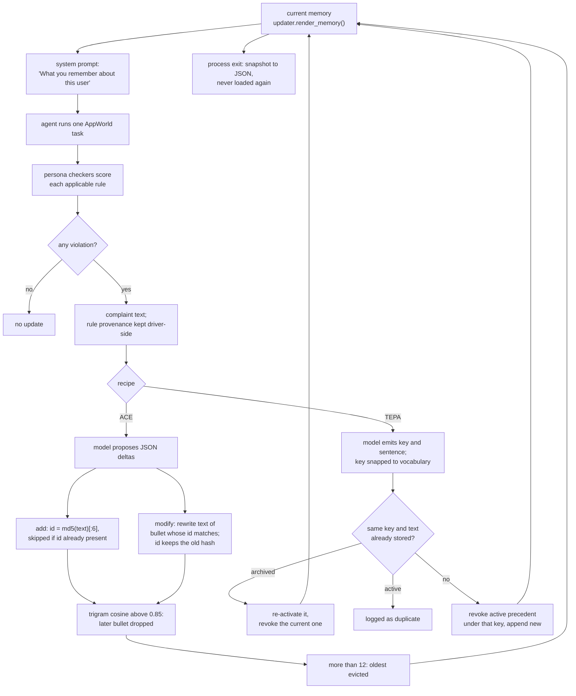

## 1. Executive Summary

This repository is the experiment code for
[arXiv:2609.36892](https://arxiv.org/abs/2609.36892), *Harness Evolution as
Learning* (Gan, Gong and Liu, submitted 29 September 2026). It extends AppWorld
with personas whose preferences are executable checkers, and runs a personal
agent through a stream of tasks. After each rejected training episode an
updater turns the simulated user's complaint into memory, and the whole memory
goes into the next episode's system prompt.

What is notable is the shape of the comparison. Six update recipes share one
two-method interface, `observe` and `render_memory`, so the paper can hold the
model, actuator, persona and feedback fixed and vary only how memory is
written. Two recipes give memory units an identity that can be corrected: ACE
bullets carry a content-hash id the model can `modify`, and TEPA precedents are
keyed by attribute and revoked rather than deleted.

What is weak is durability and verification. The memory lives in one Python
process and starts empty in every run; checkpoint snapshots are written for
analysis and nothing reads them back. ACE's deduplication keeps the older of
two similar bullets even when the newer one negates it. No test and no result
file is committed, so none of the paper's figures recomputes from the tree.

There is no licence file, so the code is all rights reserved by default: it
can be read, and copying it needs the authors' permission.

Two marks, both on the TEPA baseline: `trust_state` for its active flag and
`audit_log` for its mutation history. Section 9 names the five withheld.

## 2. Mental Model

A memory is a statement about one user's preferences, written by the agent's
own model from a complaint. It becomes a belief the moment an updater returns:
nothing is held as a candidate, and the next episode reads it as *"What you
remember about this user"* (`appworld_p/agent.py:56`). It stops being one when
a later update overwrites, revokes, deduplicates or evicts it, or when the
process ends.

**The complaint is the only evidence, and a checker generates it.**
`make_feedback` turns each violated rule into a line; the `instance` tier used
for Q2 and Q3 quotes the checker's detail without the target value, and the
`corrective` tier hands over the rule's correction template
(`appworld_p/feedback.py:95-151`). Accepted episodes produce no update in any
recipe. Which rule produced which complaint line is kept in
`Feedback.provenance` for scoring and is never shown to the learner
(`feedback.py:18`).

**Each recipe answers "how does a wrong memory die" differently.**

- *ACE*: a `modify` delta rewrites a bullet by id; a near-duplicate is dropped
  in favour of whichever bullet came first; above 12 bullets the oldest go
  (`appworld_p/ace_updater.py:146-173`).
- *TEPA*: a new precedent under the same attribute key revokes the active one,
  which stays archived with `revoked_at` and `revoked_by`; writing the archived
  text again re-activates it (`appworld_p/baseline_updaters.py:225-264`).
- *TRACE*: a compiled check is evicted FIFO above 12, and it is also enforced
  by retrying the episode in a fresh world when it fails
  (`baseline_updaters.py:417-420`; `appworld_p/driver.py:274-299`).
- *Reflexion*: the fourth reflection pushes out the first
  (`baseline_updaters.py:90-93`).
- *Full rewrite*: the model rewrites the whole memory, truncated at
  `max_memory_chars` (`appworld_p/updaters.py:141-145`).
- *Q1 learned arm*: nothing dies; the memory is the top-L of a fixed bank of
  oracle statements, ranked by how often their correction template appeared
  (`updaters.py:62-98`).

## 3. Architecture

`appworld_p/` is a library the runner scripts import. `SessionDriver` owns one
persona, one updater, one `SessionHistory` and one LLM client, and runs a list
of training tasks with evaluations at checkpoints (`appworld_p/driver.py:151-183`,
`:400-468`). Each episode opens a fresh `AppWorld` world, so tasks share no
environment state; the updater object is the only thing that carries learning
from one episode to the next.

Persistence is a set of artifacts under `outputs/`, which `.gitignore`
excludes. Per run the driver writes a memory snapshot at each checkpoint, a
transcript per episode, `episodes.jsonl`, `manifest.json` and `history.json`
(`driver.py:257-263`, `:430`, `:470-490`), and `run_q3_evolve.py` adds
`updater_final.json` (`scripts/run_q3_evolve.py:159-160`). Of the memory
artifacts, only the Q2 assertion pool crosses a process boundary:
`run_exp2_pool.py` writes it and `run_exp2_arms.py` loads it
(`scripts/run_exp2_pool.py:51-58`, `scripts/run_exp2_arms.py:17-19`).
`SessionHistory.load` exists and nothing calls it (`appworld_p/history.py:69-74`).

Two agents consume the memory. `FunctionCallAgent` allows one API call with
literal arguments per turn, which the paper uses so the model cannot hand
arithmetic to an interpreter; `ReactCodeAgent` runs model-written Python. Both
place memory and harness statistics in separate system-prompt sections
(`appworld_p/agent.py:89-94`, `:234-239`). LLM access is raw HTTP through
`httpx` to Anthropic- or OpenAI-compatible endpoints (`appworld_p/llm.py`).

### Deployment and ergonomics

An experiment needs Python 3.11, `appworld==0.1.3.post1` with its downloaded
data, an API key, and a task pool built by `scripts/build_task_pool.py`, which
the README says scans AppWorld metadata for about 30 minutes on first run. No
database or service runs. The memory itself is a Python object for the length
of one run; the snapshots are readable Markdown and JSON, but editing one
changes nothing, because no run loads them.

## 4. Essential Implementation Paths

**Capture.** `SessionDriver.run` runs each training task, scores it with
`Persona.check`, builds feedback with `make_feedback`, then calls
`self.updater.observe(ep, feedback)` and `self.history.update(ep)` in that
order (`driver.py:447-466`). The episode record carries every non-rejected API
call with resolved app and API names (`driver.py:248-250`;
`appworld_p/episode.py`).

**Extraction, per recipe.**

- ACE: `DELTA_PROMPT` with the rendered bullets and the complaint, at
  temperature 0.7, parsed by `_extract_json_array`, which tolerates code fences
  and surrounding prose (`ace_updater.py:16-34`, `:78-96`, `:113-131`).
- TEPA: `TEPA_WRITE_PROMPT` with a redacted action summary, the complaint and
  a fixed 23-key attribute vocabulary; off-vocabulary keys are snapped by prefix
  and substring (`baseline_updaters.py:115-147`, `:180-209`).
- TRACE: `TRACE_COMPILE_PROMPT` asks for an API, argument, predicate and value
  per complaint; values over 24 characters are refused except for `equals`
  (`baseline_updaters.py:290-319`, `:390-410`).
- Reflexion: one or two sentences per rejected episode
  (`baseline_updaters.py:51-61`, `:77-95`).
- Full rewrite: `SELF_EVOLVE_PROMPT` returns a new memory file
  (`updaters.py:105-145`).
- Q2 pool: `induce_assertion` turns one complaint line into one standing
  preference sentence, and `AssertionCollector` keeps execution memory empty
  while it collects (`appworld_p/summarize.py:61-109`).

**Injection.** `_current_memory` picks the updater's render, nothing, the
oracle statements, a fixed block, or the oracle plus the full habit log,
according to `memory_mode` (`driver.py:193-209`). A self-gate or verifier
report is appended to it for the retry (`driver.py:215-217`).

**Correction.** ACE `modify` (`ace_updater.py:146-153`); TEPA `_revoke_key`
and re-activation (`baseline_updaters.py:225-264`). No recipe exposes deletion
as an action; everything else leaves by eviction or rewrite.

**Background.** None. Every update is synchronous at the end of a training
episode.

**Tests.** None in the tree (section 10).

## 5. Memory Data Model

| Recipe | Unit | Identity | Fields beyond text | Leaves by |
|---|---|---|---|---|
| ACE | `Bullet` | md5 of the text at add, 6 hex | `helpful`, `harmful` (never written) | modify, dedup, cap 12 |
| TEPA | `Precedent` | md5 of key and content, 6 hex | `key`, `active`, `added_at`, `revoked_at`, `revoked_by` | revocation (archived) |
| TRACE | `TraceRule` | md5 of API, argument, predicate and value | `fired`, `failed` | FIFO above 12 |
| Reflexion | string | position | none | FIFO above 3 |
| Full rewrite | one string | none | none | rewrite, truncation |
| Q1 learned | `Candidate` | rule name | `alpha`, `beta` | never |
| Q2 pool | `Assertion` | none | `rule_name`, `episode_index`, `complaint` | never |

(`ace_updater.py:37-43`; `baseline_updaters.py:149-158`, `:336-346`;
`updaters.py:12-22`; `summarize.py:39-46`.)

**The ACE id is the hash of the text the bullet was born with.** `modify`
changes `b.text` and recomputes the embedding but keeps `b.id`
(`ace_updater.py:148-153`). So a later `add` of the original wording collides
with the live bullet's id and is skipped (`:140-142`). That works as a
value-keyed block on the superseded text for exactly as long as the bullet
survives deduplication and the cap.

**`helpful` and `harmful` are declared and unwired.** They appear only in the
`Bullet` dataclass (`ace_updater.py:42-43`); no line increments them, the
prompt never shows them, and the eviction rule does not consult them. In
[Agentic Context Engine](../agentic-context-engine/), the system this recipe
adapts, the counters exist and are maintained; the paper calls its version a
mechanism-level adaptation.

**`beta` never moves.** The Q1 `Candidate` starts at Beta(1, 3) and only
`alpha` is incremented (`updaters.py:67-79`), so the posterior mean is a
monotone count of complaints mentioning that rule.

**Time** is an update counter: TEPA's `added_at` and `revoked_at` are
`self.updates` at the moment of the write. There is no wall-clock field and no
valid-time field on any unit.

**Scope** is the process. A run loads one persona, and nothing on a memory unit
names a user, persona or task.

## 6. Retrieval Mechanics

There is no retrieval. Every recipe renders everything it holds, and the agent
receives it inside `<memory>` tags in the system prompt for the whole episode
(`agent.py:56`, `:236`). TEPA renders active precedents only, with their keys
in brackets (`baseline_updaters.py:266-271`); ACE renders each bullet with its
id so the model can target a `modify` (`ace_updater.py:46-50`).

**Q2 builds its block offline, by rule.** `rank_within_rule` deduplicates
case-insensitive repeats and orders each rule's assertions by mean Jaccard
overlap with the others, so the most central paraphrase leads
(`appworld_p/exp2.py:12-36`). `build_arm_memory` takes one line per rule
round-robin until every rule is covered, then more lines in the same order, then
recycles them to reach `L`, and shuffles with a seed derived from the
evaluation seed and `L` (`appworld_p/arms.py:31-71`).

**The recycling can start earlier than the paper says.** `cap_distinct` limits
the lines added after coverage to 55 distinct texts, and the README's Q2
command passes `--cap-distinct 55` (`arms.py:43-48`). The paper says the pool is
recycled when `L` exceeds the number of distinct learner assertions. With one
line per rule covered first, a block holds at most 55 more distinct lines, so
the two descriptions agree only if each pool held few enough assertions. The
pools are not committed, so whether the cap binds is not checkable here.

**Bounding** differs by recipe: 12 ACE bullets, 12 TRACE checks, 3 Reflexion
entries and 1,200 characters for the rewrite arm in the Q3 runner
(`scripts/run_q3_evolve.py:114-118`). TEPA has no cap; its active set is
bounded by the key vocabulary plus any `other.` keys the model invents.

## 7. Write Mechanics

**ACE merges deterministically after a model proposes.** Adds are appended at
the end; modifies edit in place. Deduplication then walks the list in order and
drops any bullet whose trigram vector has cosine above 0.85 with one already
kept, so the earlier bullet always wins (`ace_updater.py:155-165`). The cap
then removes from the front (`:167-173`).

**That ordering decides contradictions by age.** `embed_text` hashes character
trigrams into 1,000 binary buckets (`ace_updater.py:63-71`). I re-implemented
those nine lines in a scratch script, without importing the repository, and
scored sentence pairs. *"Text messages should end with my first name."* against
the same sentence with *"not"* inserted scores 0.931. A correcting `add` that
negates an existing bullet is therefore dropped and the old bullet stays; only
`modify` can correct it. A public-to-private flip scored 0.836, just under the
threshold.

**The history over-reports ACE adds.** `applied_here` records an add before
deduplication runs, and the dedup and cap steps log only counts
(`ace_updater.py:145`, `:164`, `:171`, `:176-178`). An add that deduplication
discarded appears in the history as applied.

**TEPA replaces by key and keeps the loser.** A write under an existing key
revokes the active precedent and appends the new one; an exact repeat of an
archived precedent re-activates it and revokes the current one
(`baseline_updaters.py:241-264`). Key snapping matches by prefix and by the
attribute name appearing as a substring, so a novel key can be folded into a
vocabulary key and revoke a precedent about a different detail
(`:202-207`).

**TRACE writes enforcement, not only text.** `check` evaluates each learned
predicate against the episode's recorded calls, and the driver re-runs the
task in a fresh world with the failures appended, up to three attempts, in both
training and evaluation (`baseline_updaters.py:426-448`; `driver.py:274-299`).
A check whose API or argument is absent counts as inapplicable.

**Credential redaction** applies to the TEPA, TRACE and Reflexion prompts,
which drop authentication calls and replace secret-named arguments with a
placeholder (`baseline_updaters.py:21-48`). ACE's prompt receives no action
summary, and the full-rewrite prompt receives the first 40 calls unredacted
(`updaters.py:137-138`).

### Operational cost

Each rejected training episode costs one extra model call, synchronous, before
the next episode starts. Nothing rereads the store in the background. Injection
is bounded per recipe as in section 6, and the memory sits in the system prompt,
which is constant within an episode and changes only between episodes, so a
provider prefix cache is invalidated at most once per update. The TRACE gate
multiplies agent cost by up to three on every episode it rejects.

## 8. Agent Integration

The agent has no memory tool. It cannot read, write or correct memory during a
task; it only reads what the driver put in its prompt. The updater uses the
same model in a separate call with its own system prompt
(`ace_updater.py:120-124`).

The harness-side state that is not memory is kept apart on purpose.
`SessionHistory` counts payments, card choices and emails across episodes as
ground truth for the state-class rules, and its docstring says it is *"NOT
visible to the agent unless a harness explicitly injects it"*
(`appworld_p/history.py:1-6`). The `external` arm does inject it, as a
`<stats>` section separate from `<memory>` (`driver.py:218-221`).
`SpendTotalAutofill` rewrites the payment note's running total in the action
itself and commits to its ledger only after the API confirms success
(`appworld_p/autofill.py:1-5`, `:88-95`).

Adapting a recipe is cheap: each updater depends on an `EpisodeRecord`, a
`Feedback` and an LLM client, and nothing else.

## 9. Reliability, Safety, and Trust

**Provenance stops at the driver.** Every complaint line maps to the rule that
produced it, and the Q2 pool stores `rule_name` beside each induced sentence
(`summarize.py:39-46`). No memory unit in the Q3 recipes records which episode
or complaint produced it, except TEPA's `added_at` counter.

**Nothing survives the process.** A run starts with an empty updater, and the
end-of-run JSON is an archive for the analysis scripts. A person cannot inspect
and correct a learned memory before the next run uses it, because no run uses
it.

**Injected memory is unqualified.** Except TEPA's filter, every recipe hands its
full contents to the agent as what it remembers. The paper's Q2 result, in
which more relevant learned lines raise violations past `L=10`, measures one
cost of that design.

**Marks.**

- `trust_state` — **awarded** to TEPA's `active` flag. It is stored, moved by
  later writes in both directions, and filters the only read path. It records
  supersession by attribute key rather than verification: a newer wrong
  precedent revokes an older right one.
- `audit_log` — **awarded** to TEPA's `history`, which logs every mutation of
  the precedent list with the ids involved. ACE's list of the same name does not
  qualify alone, because dedup and capacity evictions are logged as counts.
- `tombstone` — withheld. The nearest thing is ACE's id collision in section 5,
  which blocks re-adding a modified bullet's original text, but it lives inside
  the live bullet and disappears when that bullet is evicted. TEPA does the
  opposite on purpose: an exact repeat of a revoked precedent re-activates it.
- `bitemporal` — withheld. `added_at` and `revoked_at` are update counters,
  both recording when the system changed, not when a preference held.
- `scope_enforced` — withheld. One persona per process; no key on any unit.
- `human_review` — withheld. The user is a programmatic checker, and every
  update takes effect before the next episode with nothing waiting.
- `negative_eval` — withheld. No test is committed (section 10).

**Secrets.** `llm.py` loads `.env` with `override=True`, so a key in the file
replaces one set in the environment (`appworld_p/llm.py:12`).

## 10. Tests, Evals, and Benchmarks

**No test is committed.** `git ls-files` lists no test file, and `.gitignore`
excludes `/tests/`, `/pytest.ini`, `scripts/test_llm.py` and
`scripts/rerun_running_total.py` under *"Local validation and rerun utilities"*
(`.gitignore:41-45`). A suite existed locally and was kept out of the release.
The plotting and paper-figure scripts are excluded the same way (`:22-25`).

**What the paper reports**, all with `claude-haiku-4-5-20251001` and the
function-call actuator:

- *Q1, approximation.* Stating the preference cuts private-note-format and
  SMS-sign-off violations from 1.00 to 0.07 and 0.00. Checksum, habitual card
  and running total stay at 0.50, 0.78 and 0.44 with stated context; the
  harness that computes the value reaches 0.17, 0.00 and 0.00.
- *Q2, generalization.* The pooled violation rate falls from about 0.77 at
  `L=0` to 0.20 at `L=10`, then rises to 0.25–0.27 for `L` from 20 to 150.
- *Q3, optimization.* No memory scores 0.881 and the oracle 0.071. ACE and
  TEPA finish near 0.48, TRACE near 0.57, Reflexion close to no memory; the
  full-rewrite and corrective diagnostics finish near 0.69 and 0.78.

**What is committed to reproduce them** is the code, five persona files, the
frozen splits for Q1, Q2 and Q3 (`configs/experiments/`), and the command lines
in the README. The split sizes match the README: Q3 trains on nine tasks from
three template families and evaluates on six from two others. Not committed:
the task pool, the Q2 assertion pools, any `outputs/` run, and the figure
scripts. **No headline recomputes from the tree**, and I ran nothing that calls
a model.

**Two reading notes on the Q3 design.** The 24-episode stream samples with
replacement from nine tasks, so training tasks recur
(`appworld_p/streams.py:6-14`). And the corrective diagnostic uses the
full-rewrite updater, not ACE (`run_q3_evolve.py:55-59`), so it tests the
information channel for that recipe; its 0.78 sits beside the rewrite arm's
0.69, not beside ACE's 0.48. The paper states that the Q3 instance feedback
withholds the category tag and the initials format, so part of the oracle gap
is unreachable by construction.

**Missing tests to want before trusting a recipe:** that a `modify` followed by
a re-add of the original text is refused; that a negating `add` is not silently
dropped; that a revoked TEPA precedent is absent from `render_memory` while
another key's precedent is present.

## 11. For Your Own Build

### Steal

- **Keep the rule-to-complaint mapping outside what the learner sees.** Storing
  provenance driver-side lets you score whether a learned line is about the
  right preference without leaking the answer into the memory.
- **Revoke by key and keep the revoked entry.** One active value per attribute,
  with `revoked_at` and `revoked_by`, gives a render path a filter and an
  analyst a history for the price of a boolean.
- **Put the memory and the harness statistics in separate prompt sections.**
  A count maintained by code is a different kind of claim from a sentence the
  model wrote, and the prompt can say so.

### Avoid

- **Resolving near-duplicates by insertion order.** A similarity threshold
  cannot see polarity; when a newer item negates an older one, the newer is the
  likely correction, and keeping the older inverts the update.
- **An id that outlives the text it hashes.** Either re-hash on modify or make
  the id opaque; a stale content hash blocks the old value by accident and
  stops doing so the moment the bullet is evicted.
- **Declaring outcome counters the eviction rule never reads.** Either wire
  `helpful` and `harmful` into the cap or remove them, so the dataclass does not
  describe a mechanism the code lacks.

### Fit

This is a research harness, and its value is the comparison: six write recipes
under one feedback protocol, with frozen splits. Study it to choose a write
recipe for preference memory, or to borrow the checker-as-user protocol for your
own evaluation. Do not adopt it as memory for a product: nothing persists, there
is no scope, and the licence does not grant reuse.

## 12. Open Questions

- How many distinct assertions did each Q2 pool hold, and did the 55-line
  `cap_distinct` bind at `L=60` and `L=150`?
- How often did ACE deduplication drop a newer bullet that contradicted an
  older one, and did that contribute to the ACE plateau? The per-run
  `updater_final.json` would show it, and none is committed.
- What did the excluded `/tests/` suite cover?
- Do TEPA key snaps fold distinct preferences into one key in practice? The
  `key_snaps` counter is archived per run and not committed.

## Appendix: File Index

- **Driver and episode loop:** `appworld_p/driver.py`, `appworld_p/episode.py`,
  `appworld_p/streams.py`, `appworld_p/config.py`.
- **Updaters:** `appworld_p/ace_updater.py`, `appworld_p/baseline_updaters.py`,
  `appworld_p/updaters.py`, `appworld_p/summarize.py`.
- **Q2 memory construction:** `appworld_p/arms.py`, `appworld_p/exp2.py`.
- **Feedback and preferences:** `appworld_p/feedback.py`, `appworld_p/persona.py`,
  `appworld_p/rules/base.py`, `appworld_p/rules/pool_a.py`,
  `appworld_p/rules/pool_b.py`, `appworld_p/rules/api_map.py`.
- **Harness-side state:** `appworld_p/history.py`, `appworld_p/habit.py`,
  `appworld_p/autofill.py`.
- **Agents and model access:** `appworld_p/agent.py`, `appworld_p/llm.py`.
- **Runners and analysis:** `scripts/run_exp1.py`, `scripts/run_exp1b.py`,
  `scripts/run_exp2_pool.py`, `scripts/run_exp2_arms.py`,
  `scripts/run_q3_evolve.py`, `scripts/aggregate_s1_seeds.py`,
  `scripts/compare_q3_arms.py`, `scripts/gate_elimination_ceiling.py`,
  `scripts/build_task_pool.py`.
- **Configuration:** `configs/personas/*.yaml`, `configs/experiments/*.json`,
  `.gitignore`, `requirements.txt`.

### Recorded searches

Checked against the checkout at the pinned revision. In this shell `grep` and
`rg` honour the subject's `.gitignore`, so these use `git grep` and
`git ls-files`; `git ls-files -i -c --exclude-standard` returns nothing.

- `git grep -nE 'read_text|\.load\(|json\.load|open\(|\.save\(|write_text|memory_n'` — every load and save of run state; `SessionHistory.load` and the memory snapshots have no reader, and `updater_final.json` is only written.
- `git grep -n 'SessionHistory.load\|History.load\|\.load('` — only `Persona.load`.
- `git grep -nE 'helpful|harmful'` — `ace_updater.py:42-43` only.
- `git grep -nw 'beta'` — the field and the `mean` property in `updaters.py`; no writer.
- `git grep -n 'history' appworld_p/ace_updater.py appworld_p/baseline_updaters.py` — each list is initialised once and otherwise only appended to.
- `git grep -nE 'ACEStyleUpdater|TepaUpdater|TraceUpdater|ReflexionUpdater|SelfEvolveUpdater|AssertionTopL|AssertionCollector' -- scripts` — every updater has a runner that constructs it.
- `git grep -nE 'def test_|pytest|unittest'` and `git ls-files | grep -iE 'test|spec'` — no test file; `pytest` appears only in `.gitignore`.
- `git ls-files | grep -iE 'output|result|\.jsonl|\.csv'` — no committed result.
- `git grep -nE 'arxiv|bibtex|@article|@misc|doi.org|CITATION'` — no citation block; the baselines cite arXiv ids in a docstring (`baseline_updaters.py:3`), and the paper links this repository.
- `git grep -niE 'licen'` — no match; no LICENSE file.

## History

**2026-10-04** — [`9f7e8178588513f30296cd965a9923c17f5ff98c`](https://github.com/ZyGan1999/self-evolving-harness-as-learning/commit/9f7e8178588513f30296cd965a9923c17f5ff98c) — first reading, at the head of `main`, a commit dated 25 September 2026, against [arXiv:2609.36892](https://arxiv.org/abs/2609.36892). Two marks, `trust_state` and `audit_log`, both on the TEPA baseline. Screened before reading on a full clone: 2 files scanned, 0 RUNS, 0 EXEC, 0 FRESH, 0 FLOAT; no agent instruction file is committed. No licence file. Read with `git grep` and `sed`; nothing installed, built or run. The trigram similarity scores in section 7 come from a standalone re-implementation of `embed_text`, not from the repository's code.
