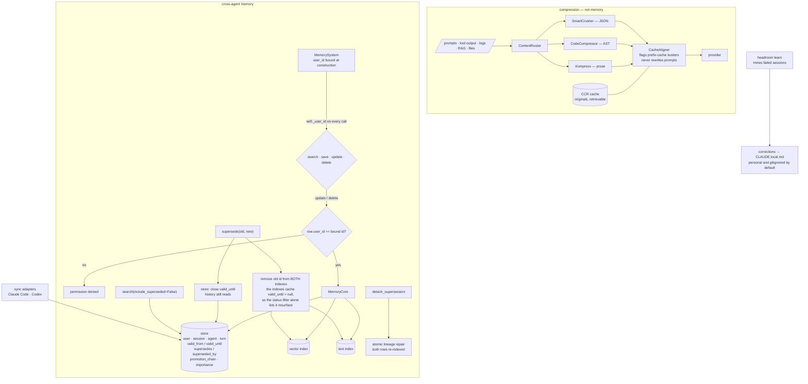

## 1. Executive Summary

Headroom is a context-compression layer: a local proxy and library that
compresses tool outputs, logs, RAG chunks and files before they reach the
model. Most of the repository is about that. The part this atlas reads is the
cross-agent memory subsystem beside it — roughly eleven thousand lines under
`headroom/memory` — which stores facts across Claude, Codex, Gemini and Grok in
one place.

Two marks, and the first one turns on a detail worth the whole report.

**Supersession closes a validity window, and then removes the old row from the
indexes.** The store keeps the predecessor so history still reads, and the
default search excludes superseded rows. That alone looks sufficient and is
not, because the vector and text indexes hold their own cached copy of the
metadata — in which `valid_until` is still null. The comment says what happened
without it: *"the superseded (stale) version keeps resurfacing from search
alongside the new one, so contradictory/outdated facts get recalled
together."* A status filter that reads a stale cache is not a filter.

**The user id is a field of the system object, not an argument.** The memory
system binds it at construction and passes that same field into every search,
save, update and delete, so the surface an agent reaches has no parameter for
naming somebody else. Update and delete re-verify the stored row's owner on top
of that and return a permission denial on mismatch.

What is missing is a test for the first of those. The index-removal comment
records a bug that shipped, and nothing in eight hundred-odd test files asserts
that a superseded memory stays out of search — so the class of defect the
comment describes can return silently.

## 2. Mental Model

Two systems share a repository and it is worth keeping them apart.

**Compression** is the product: a router that detects content type and picks a
compressor, a cache aligner that flags content which would bust a provider's
prefix cache, and a reversible mode that keeps originals locally and retrieves
them on demand. None of it is memory in this atlas's sense — it shortens what
is in flight.

**Memory** is the subsystem this report is about. A memory belongs to a user
and optionally to a session, an agent and a turn, and its scope level is
*derived* from which of those are set rather than stored separately — so the
level cannot disagree with the identifiers. Corrections supersede rather than
edit, and a `promotion_chain` records memories that bubbled up from a narrower
scope to a wider one.

Between them sits `headroom learn`, which mines failed sessions into
corrections and writes them into an agent instruction file.

## 3. Architecture

## 4. Essential Implementation Paths

- **Record model and scope levels:** `headroom/memory/models.py`.
- **Core operations, supersession, indexes:** `headroom/memory/core.py`.
- **Agent-facing surface and ownership checks:**
  `headroom/memory/system.py`, `headroom/memory/mcp_server.py`.
- **Cross-agent sync and dedup:** `headroom/memory/sync.py`,
  `headroom/memory/sync_adapters/`.
- **Learn pass and its writer:** `headroom/learn/`.
- **Measurement of compression policy:** `headroom/audit/maturation.py`.

## 5. Memory Data Model

The record carries the usual fields and three that are worth naming.

`scope_level` is a computed property rather than a column: turn if a turn id is
set, else agent, else session, else user. A derived level cannot drift from the
identifiers it describes.

`promotion_chain` and `promoted_from` record a memory that bubbled from a
narrower scope into a wider one, which is a mechanism most hierarchical stores
describe and few keep the lineage for.

And `normalize_entity_refs` is a function-length post-mortem. `entity_refs` is
typed as a list of strings and nothing enforced it, so callers persisted the
richer dictionary shape into it by mistake; the docstring records what that
cost — a set update raising on an unhashable dict and a lower-case call raising
on a dict *"took down whole memory searches rather than the one bad row"*. The
fix unwraps a dict to its name so nothing is lost and drops anything with no
recoverable name rather than stringifying it, because a ref like
`"{'entity_type': 'project'}"` *"would only pollute the graph"*. Coercing at
the boundary, and choosing to drop rather than to stringify, is the right pair
of decisions.

## 6. Retrieval Mechanics

Vector similarity with full-text and graph adapters beside it, filtered by
user, session and agent, by scope level, by a minimum similarity, and by
validity — `include_superseded` defaults to false.

The supersession path is where the care shows. Closing the validity window in
the store is not enough on its own, because the search filters off a copy of
that metadata cached in the index; the old id is therefore removed from both
indexes, and the comment notes it mirrors what `delete()` already did. This is
the failure mode worth carrying away from this report: **a status filter is
only as fresh as the copy of the status the filter reads.**

## 7. Write Mechanics

Correction is supersession. The replacement is created with the predecessor's
scope, importance, entity refs and metadata, embedded, and linked; the old row
keeps its place in history with its validity closed; both indexes drop the old
id and gain the new one; the cache invalidates the old entry and stores the
new.

`detach_supersession` reverses exactly one reciprocal edge, with the store
doing the lineage repair atomically and both rows re-indexed afterwards so the
restored memory is immediately searchable. A supersession that can be undone
without hand-editing a graph is uncommon and worth noting.

Cross-agent sync computes a truncated SHA-256 of the content and builds the set
of hashes already present before importing, so re-running a sync does not
duplicate. That is idempotence, not a rejection record — see section 9.

## 8. Agent Integration

A proxy, an MCP server exposing compress, retrieve and stats, agent wrappers
for a dozen coding tools, Python and TypeScript SDKs, and sync adapters that
put Claude Code and Codex on one store. `headroom learn` mines failed sessions
and writes corrections to `CLAUDE.local.md` by default, with the reasoning
stated: a project's `CLAUDE.md` is team-shared and checked into git while the
local file is personal and gitignored, and learned patterns are
personal-by-default. Writing inferred corrections to the private file unless
someone asks otherwise is the right default.

## 9. Reliability, Safety, and Trust

**Trust state — awarded**, on the validity close plus the index removal. The
limit is that it is a timestamp rather than a vocabulary: nothing distinguishes
a memory superseded because the world changed from one retracted because it was
wrong.

**Scope enforced — awarded**, on the bound user id and the ownership
re-verification, with the caveat that the layer below takes it as an optional
argument.

**Negative eval — withheld, and this is the sharpest finding in the report.**
The index-removal comment documents a defect that reached users: superseded
memories resurfacing from search beside their replacements. Eight hundred-odd
test files include a supersession test that asserts the pointers are set and
the old row is marked, and none asserts that the superseded memory is absent
from a search. The test that would have caught the original bug, and would
catch its return, is the one not written. A cross-user isolation assertion is
present in the form of a count rather than an identity, which is weaker again.

**Tombstone — withheld.** The sync dedup is keyed on a content hash, which is
the right key, but it is consulted to avoid importing something that already
exists rather than to refuse something that was rejected. Nothing records a
rejection.

**Audit log — withheld, and the naming is worth a warning to a reader.** There
is a module called `audit` and a module called `tracker`, and neither is what
those names suggest to someone looking for a memory audit trail:
`headroom/audit/` simulates a compression policy against real transcripts, and
`memory/tracker.py` tracks process RAM. No append-only record of memory
mutations exists; supersession leaves lineage pointers on the rows themselves.

**Bi-temporal — withheld.** `valid_from` and `valid_until` look like a second
axis and are used as lineage bounds on the record axis — both default to now,
`valid_until` is set at supersession time, and no read takes an as-of
parameter. There is no query that answers what the store held at a past
instant.

**Human review — withheld.** The learn pass writes to a personal gitignored
file by default, which limits the blast radius of an inferred correction, but
nothing gates a write on a person's approval.

## 10. Tests, Evals, and Benchmarks

**No paper** and no `CITATION.cff`. A compression model is published on Hugging
Face; the memory subsystem cites nothing.

Eight hundred and thirty-eight test files, of which a handful touch memory
directly. `tests/test_memory_system.py` alone carries 104 cases covering the
scope hierarchy, ownership, supersession pointers and per-user clearing.

The measurement work in `headroom/audit/maturation.py` deserves a mention even
though it is about compression rather than memory, because the method is the
one an atlas reader should want applied to a memory policy. It simulates a
read-maturation policy against a real transcript corpus and reports the
distribution rather than an average: on 81 sessions, 35.5% of reads are
re-reads and 95% of those are partial, 60.7% of large reads are never touched
again, and the median next touch is four turns — *"hence quiesce_turns=5."* A
tuning constant derived from a measured distribution, with the corpus and the
date written down beside it, is what most configuration defaults are not.

No memory benchmark result is committed.

## 11. For Your Own Build

- **Assume your index caches the field your filter reads.** Closing a validity
  window in the store and filtering on it at query time looks complete and is
  not, if the vector index holds its own copy of that metadata. Remove the row
  from the index too.
- **Write the regression test for the bug your comment describes.** A comment
  explaining why a line exists is a record of a defect; without a test it is
  also a record of how the defect will return.
- **Bind the scope key to the object, not to the call.** A user id that is a
  field of the system an agent talks to cannot be named differently by the
  agent.
- **Derive the scope level from the identifiers.** A stored level and the ids
  it summarises are two things that can disagree; a computed property is one.
- **Coerce at the boundary and drop what you cannot recover.** A wrong-shaped
  value in a typed list took down whole searches rather than one row, and
  stringifying it would have polluted the graph instead.
- **Default an inferred correction to the private file.** Team-shared and
  checked into git is the wrong destination for something a machine concluded
  from a failed session.

## 12. Open Questions

- Supersession is a timestamp. Would a reason on the close — corrected,
  retracted, expired — change what the search default should exclude, or is one
  bucket enough for this use?
- The core accepts an optional user id and the system above it never omits one.
  Is the core's permissiveness needed by a caller, or could it take the id as a
  required argument and remove the asymmetry?
- `headroom learn` writes corrections into an instruction file the agent reads
  every session. Is there a path for retiring one that turned out wrong, or
  does it live until a person edits the file?

## Appendix: File Index

- Record model, scope levels, entity-ref coercion:
  `headroom/memory/models.py`
- Core operations, supersession, index maintenance:
  `headroom/memory/core.py`
- Agent surface and ownership checks: `headroom/memory/system.py`,
  `headroom/memory/mcp_server.py`, `headroom/memory/tools.py`
- Ports and adapters: `headroom/memory/ports.py`,
  `headroom/memory/adapters/`, `headroom/memory/backends/`
- Cross-agent sync: `headroom/memory/sync.py`,
  `headroom/memory/sync_adapters/`
- Learn pass: `headroom/learn/analyzer.py`, `headroom/learn/writer.py`
- Compression-policy measurement: `headroom/audit/maturation.py`
- Tests: `tests/test_memory_system.py`, `tests/test_memory_decision.py`,
  `tests/test_memory_rank_policy.py`, `tests/test_memory_eval.py`

## History

**2026-09-19** — [`bc21c9370793f7e4aa94ac4c5d9a67a8d2dd0df9`](https://github.com/headroomlabs-ai/headroom/commit/bc21c9370793f7e4aa94ac4c5d9a67a8d2dd0df9) — first reading, at the head of `main`. Screened with `scripts/screen_repo.py` before anything was read: four auto-run surfaces including a Claude Code plugin manifest, a devcontainer configuration, a Copilot instructions file and an MCP server manifest, alongside build-time execution paths and unpinned dependency surfaces across a large polyglot tree, with every manifest reported inside the seven-day cooldown as an artefact of a `--depth 1` clone. Nothing was installed, built or run. Apache-2.0 with a `NOTICE`. Two marks. This reading is of the memory subsystem — the record model, the core's supersession and index maintenance, the system object's scope binding and ownership checks, the sync path's dedup, and the memory test suites — and not of the compression layer that is the bulk of the repository; the Rust crates, the proxy, the plugins and the SDKs were read only where they touched those paths. Five marks are withheld with reasons in section 9. The one worth repeating is `negative_eval`: the comment on the index-removal records a defect that shipped, and no committed test asserts that a superseded memory stays out of search.
