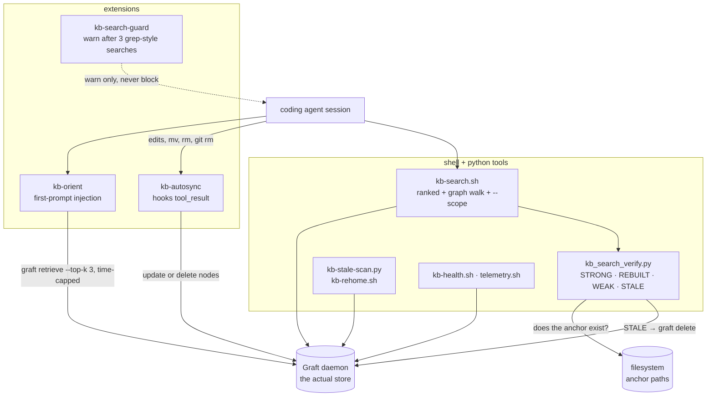

## 1. Executive Summary

Heimdall is a verification and orchestration layer that sits **on top of** a
semantic memory store rather than being one. Its README states the thesis
plainly: *"Heimdall fixes retrieval, not storage. The insight: agent memory fails
not from lack of storage but from lack of retrieval with trust."* The store
underneath is [Graft](https://github.com/ArihantDeva/heimdall), a separate
daemon; Heimdall seeds it, keeps it current, and labels what comes out.

The mechanism the report exists for is in `bin/kb_search_verify.py`. Every
search hit is checked against the filesystem at read time and assigned a verdict
— `STRONG` (lexical coverage plus a live path), `REBUILT` (the path moved and the
node was rebuilt), `WEAK` (semantic only), `STALE` (the anchor is gone, and the
node is removed), plus `REMOVED` and `NOPATH`. Then the results are sorted by
**verdict class first**, with the similarity score demoted to a tiebreak, under a
comment that says why: it *"keeps the true STRONG hit on top instead of burying"*
it beneath a better-scoring unverified one.

That is the atlas's most repeated complaint answered directly. This corpus is
full of systems where retrieval strength and truth end up in one number; here
they are two, and the one that means *this still exists* wins.

**Also strong:** `extensions/kb-autosync.ts` keeps the graph honest by parsing
the agent's own `mv`, `rm`, `rmdir`, `trash` and `git rm` out of `tool_result`
and calling `graft delete` when an anchor disappears — deletion propagating from
the filesystem into the memory rather than the other way round.

**Weakest:** nothing about trust is stored. A verdict is computed, used to sort
one result set, and discarded; the next search recomputes it. A node cannot be
doubted between searches, and no history exists of what was once STALE. That,
plus a store this repository does not own, is why no capability mark is awarded
below.

## 2. Mental Model

A memory is a Graft node whose identity is a **filesystem path** — and the
system's whole epistemics is whether that path is still there.

```text
graft retrieve ──► candidates ──► for each hit: extract_paths(body)
                                        │
                        ┌───────────────┴───────────────┐
                   path exists?                    path gone
                        │                               │
              coverage ≥ 0.5 ?                  handle_stale():
              ┌─────────┴─────────┐             bounded basename search
           STRONG              WEAK                    │
                                          ┌────────────┴────────────┐
                                     found: REBUILT           not found: STALE
                                                                (node removed)

sort key = vrank{STRONG:0, REBUILT:0, WEAK:1, STALE:2, REMOVED:2, NOPATH:3}
           then score        ← the score only breaks ties
```

**The state is not a property of the memory; it is a property of the memory's
relationship to the world at the moment you asked.** That is a different design
from every trust-state system in this corpus, which stores a status a writer set.
Here nothing is set: the verdict is derived, every time, from whether the thing
the note points at still exists.

Control is **background-managed** for freshness and **agent-facing** for reading.
The agent searches and is warned when it does not; it does not file memories
through Heimdall at all.

## 3. Architecture



**Runtime shape.** Shell scripts and small Python programs under `bin/`, three
TypeScript agent extensions under `extensions/`, a launchd job, a YAML config
example, and one test file. Roughly two dozen files; there is no service of its
own beyond the scheduled jobs.

**Persistence.** None. The store is Graft, reached over its CLI (`graft
retrieve`, `graft delete`, `graft stats`), seeded by `bin/seed-graft.sh` from
`~/knowledge-base/.inventory.tsv` — idempotently, because *"graft dedupes by
(title, body) — re-runs add nothing"*. `seed-graft.sh` refuses to run when the
daemon is unreachable rather than seeding into nothing.

**Search stack.** Graft supplies semantic candidates and Heimdall adds a lexical
coverage measure over the query tokens plus a graph walk, so the arms are vector
and lexical with the lexical half used for *verification* rather than recall.

### Deployment and ergonomics

A personal-machine tool: Node, Python, bash, a launchd plist, and a Graft daemon
you must be running. `~/knowledge-base/` is the assumed root. Nothing is
containerised and nothing is multi-user. The store is inspectable only through
Graft, which is the part a reader of this repository cannot check.

## 4. Essential Implementation Paths

**Verification.** `bin/kb_search_verify.py` — `extract_paths(text)` pulls
candidate anchors out of a node's body; coverage is a token overlap between the
query and the hit; `verdict = "STRONG" if cov >= 0.5 else "WEAK"` when the path
exists (`:164`), `STALE` when it does not (`:166`). A STALE hit with an id goes
to `handle_stale` (`:83`), whose docstring gives the reason it exists —
*"Desktop gets reorganized aggressively"* — and which runs a bounded basename
search, returning `REBUILT` when it finds the file elsewhere and `STALE` when it
does not, in which case the node is removed. The output line documents the
vocabulary for the reader: *"STRONG=lex+path, REBUILT=path moved+node rebuilt,
WEAK=semantic-only, STALE=path gone (auto-removed), REMOVED=deleted just now"*.

**Ranking.** `vrank = {"STRONG": 0, "REBUILT": 0, "WEAK": 1, "STALE": 2,
"REMOVED": 2, "NOPATH": 3}` is the primary sort key and the score is secondary
(`:172-175`).

**Search.** `bin/kb-search.sh` — top-k candidates, a related-edge walk, `-n N`,
`--no-explore`, and `--scope S` which keeps *"only results whose path contains
S"*.

**Session orientation.** `extensions/kb-orient.ts` injects a knowledge block into
the first prompt from `graft retrieve --top-k 3` plus an edge walk, with the
retrieval time capped because *"a hung graft must never stall the first
prompt"*, and a stated preference for answering what the agent *"actually asks,
not burn context on speculative injection"*.

**The guard.** `extensions/kb-search-guard.ts` with `lib/kb-guard-core.mjs`
warns after three consecutive grep-style searches that did not consult
knowledge. It is *"warn-only, never block"*, one warning per firing action, and
`tests/guard.test.mjs` is the repository's only test.

**Autosync.** `extensions/kb-autosync.ts` hooks `tool_result` for
edit/write/hashline_edit/bash, parses shell commands into `{kind: "move" | "remove", paths}`
— including `mv a b dir/` multi-source semantics — resolves them deterministically
because *"tool_result has no cwd"*, and calls `graft delete <id>` for nodes
anchored at a removed path.

**Maintenance.** `bin/kb-stale-scan.py`, `bin/kb-rehome.sh`, `bin/kb-rebuild.sh`,
`bin/kb-health.sh`, `bin/telemetry.sh`, on a launchd schedule.

## 5. Memory Data Model

Heimdall defines no schema. A node is whatever Graft holds — a title, a body,
and, by convention, one or more filesystem paths inside the body that
`extract_paths` can find. **The anchor is the identity**, and the entire
verification model rests on it: a note whose body names no path can only ever be
`NOPATH`, which sorts last.

**Scoping** is a substring match against the path at query time. There is no
stored scope key, no user or project field, and nothing prevents a search without
`--scope` from returning anything in the store — which for a single-user tool
over one home directory is consistent, and is why the mark is withheld rather
than awarded narrowly.

**Provenance and time.** None recorded by Heimdall. Freshness is observed rather
than stored: the question is never *when was this written* but *does its anchor
exist now*.

**Correction.** There is none for content. A node is verified, rehomed or
deleted; nothing edits what a note says, and nothing records that a note was once
wrong.

## 6. Retrieval Mechanics

Two stages: Graft returns semantic candidates and a graph walk widens them, then
every hit is verified and the set is sorted by verdict before score. The second
stage is the contribution, and it inverts the usual arrangement — most systems in
this corpus rank by similarity and, at best, annotate. Here a WEAK hit with a
high score sits below a STRONG hit with a lower one, on purpose.

**Failure modes.** Coverage at `≥ 0.5` is a blunt threshold: a correct note
phrased differently from the query lands in WEAK and drops a whole rank class.
Verification is filesystem existence, so a file that still exists but no longer
says what the note claims is STRONG — the anchor is checked, the content is not.
And `--scope` matching a path substring will match anything sharing the string,
which for a personal knowledge base is usually fine and is not a boundary.

**Cost.** Every search stats the filesystem once per hit and may run a bounded
basename search for each STALE one, so read latency scales with results and with
how disorganised the disk is.

## 7. Write Mechanics

**Heimdall does not write memories.** Seeding is a one-off from an inventory
file; after that the only mutations it performs are corrective — rehome a moved
anchor, delete a node whose file is gone.

That makes its write path an unusual one for this atlas: it is a **deletion
propagation path**, driven by parsing what the agent did. When a session moves or
removes files, `kb-autosync` observes it in `tool_result` and updates the graph
live, rather than waiting for a scan to notice.

The fragility is in the same place as the ambition: the parser has to understand
shell. `mv a b dir/` moving multiple sources into a final directory is handled
explicitly, and the space of shell commands that relocate a file is much larger
than the space this parser covers. Anything it misses becomes a STALE hit later,
which the read path then cleans up — so the two mechanisms cover for each other,
and the design says so by having both.

### Operational cost

No model call anywhere in this repository. The read path pays one filesystem
check per hit; the background jobs pay a scan. Session orientation is capped in
time and to three retrieved items, deliberately. There is no injection per turn,
so nothing here invalidates a prompt-prefix cache repeatedly.

## 8. Agent Integration

Three extensions and a set of shell tools. The agent's relationship to memory is
**read and be nudged**: `kb-orient` puts prior work in the first prompt,
`kb-search` is the tool it calls, and `kb-search-guard` warns when it has run
three grep-style searches without consulting knowledge — a behavioural
intervention on the read path that this corpus has almost no other examples of.

The guard being warn-only is the right call and is stated as one. A blocking
guard would be an enforcement point, and the [pattern this atlas argues
for](../../patterns/gate-the-expensive-path/) is about deciding whether the
costly operation is worth doing rather than forbidding the cheap one.

## 9. Reliability, Safety, and Trust

**The trust model is real and entirely transient.** Four verdicts, computed per
hit, used to sort, then discarded. Nothing persists, so nothing can accumulate:
a node that was STALE last week and REBUILT today leaves no record of either, and
a reader cannot ask which parts of the store have been unstable. The mark is
withheld on exactly that basis — the rubric asks for a discrete status *as a
field*, and this is a computation — while noting that the *effect* is stronger
than what the mark measures, because STALE does not merely withhold a memory, it
deletes it.

**Data loss.** That deletion is the risk. A STALE verdict removes the node, and
the only guard is the bounded basename search that precedes it. A file moved to a
path the search does not cover — a rename, an archive, an unmounted volume — is
indistinguishable from a file deleted, and the note about it goes with it. For a
knowledge base whose anchors are on a machine that gets *"reorganized
aggressively"*, that is a real exposure, and the honest counterweight is that the
underlying note usually still exists in Graft's source inventory.

**Provenance, audit, review:** none. No record of mutations, no surface for a
person to adjudicate anything, and no protection against a poisoned note beyond
the anchor check.

**Multi-user:** not attempted, and correctly so — this is a tool for one person's
home directory.

## 10. Tests, Evals, and Benchmarks

One test file, `tests/guard.test.mjs`, covering the search guard's counting
behaviour. The verification logic — the thing this system is for — has no test:
`extract_paths`, the coverage threshold, the `vrank` ordering and `handle_stale`
are all uncovered, and the last of them deletes data.

The tests I would want before running this over a real knowledge base, in order:
that a STRONG hit outranks a higher-scoring WEAK one; that `handle_stale` returns
REBUILT rather than deleting when the file exists under a different directory;
and that a node whose anchor is on an unmounted path is not removed. The third is
the one that would change the design.

`docs/heimdall_compare.dot` and its rendered PNG compare Heimdall against
[Graphify](../../systems/graphify/) and Graft; it is a positioning diagram, not a
measurement, and no benchmark or result artifact is committed.

## 11. For Your Own Build

### Steal

- **Sort by verified-ness first and by score second.** Four lines of `vrank`
  ahead of the similarity comparison is the whole idea, and it directly prevents
  the failure this atlas names most often — a confident, well-scoring memory that
  is no longer true outranking a duller one that is.
- **Verify a memory by checking the thing it points at.** An anchor that can be
  stat'd turns freshness from a decay heuristic into an observation. Where your
  memories reference files, commits, tickets or URLs, the same check is available
  and costs one syscall.
- **Try to rehome before you delete, and bound the search.** A moved file is the
  common case and a deleted one is the rare case; treating the first as the
  second loses notes.
- **Warn the agent when it is not using memory, and do not block it.** Three
  consecutive grep-style searches without a knowledge lookup is a cheap,
  observable signal that the store is being ignored.
- **Cap the time of any first-prompt injection.** *"A hung graft must never stall
  the first prompt"* is the right instinct for anything that runs before the user
  sees a response.

### Avoid

- **Do not let a read-path verdict be the only record of trust.** Compute it if
  you like, but persist the transitions — a store where nodes go stale and come
  back has a maintenance story that nobody can see if the state lives only in one
  sorted result set.
- **Do not delete on a failed existence check alone** unless you can distinguish
  moved, archived and unmounted from deleted. The bounded search helps and does
  not close the gap.
- **Do not verify the anchor and call the content verified.** A file that still
  exists is not a note that is still right; this check answers a narrower
  question than the verdict names suggest.
- **Do not leave the data-destroying path untested.** `handle_stale` removes
  nodes and has no test.

### Fit

This suits one developer with a large personal knowledge base spread across
projects, already running Graft, who has noticed their agent re-solving problems
it has notes on. Within that shape it is a sharp, small tool with one genuinely
good idea. Walk away if you need the store itself — Heimdall owns none of it — or
if your notes do not anchor to files, because the entire trust model is the path
check. And treat the deletion behaviour as the thing to configure before running
it against notes you cannot regenerate.

## 12. Open Questions

- What is Graft's own model, and does it record anything Heimdall's verdicts
  could be persisted into? The store is a dependency this repository does not
  contain.
- How often does `handle_stale` delete a node whose file merely moved outside the
  bounded search? Only a real knowledge base would show the rate.
- Does the coverage threshold of 0.5 discriminate on real queries? It is the one
  number in the system and nothing reports its effect.
- The comparison diagram sets Heimdall against Graphify and Graft; whether that
  reflects a measurement or a positioning choice is not visible from the tree.

## Appendix: File Index

- **Verification and ranking:** `bin/kb_search_verify.py` (`extract_paths`, `handle_stale` at `:83`, verdict at `:164`, `vrank` at `:172`)
- **Search:** `bin/kb-search.sh`
- **Agent extensions:** `extensions/kb-orient.ts`, `extensions/kb-search-guard.ts`, `extensions/kb-autosync.ts`, `lib/kb-guard-core.mjs`
- **Store boundary:** `bin/seed-graft.sh`
- **Maintenance:** `bin/kb-stale-scan.py`, `bin/kb-rehome.sh`, `bin/kb-rebuild.sh`, `bin/kb-health.sh`, `bin/telemetry.sh`, `launchd/`
- **Tests:** `tests/guard.test.mjs`

## History

**2026-08-20** — [`f9bc25abd27351d1af04ebe24b7deb555ba42102`](https://github.com/ArihantDeva/heimdall/commit/f9bc25abd27351d1af04ebe24b7deb555ba42102) — first reading. Screened before anything was read: no auto-executing surface, no build-time execution, both `package.json` and `package-lock.json` inside the seven-day cooldown and one unpinned range; nothing was installed, no daemon was started and no search was run. The verdict ordering and the stale-handling path were established by reading `kb_search_verify.py`, and the store beneath — Graft — is a separate program that this reading did not inspect.
