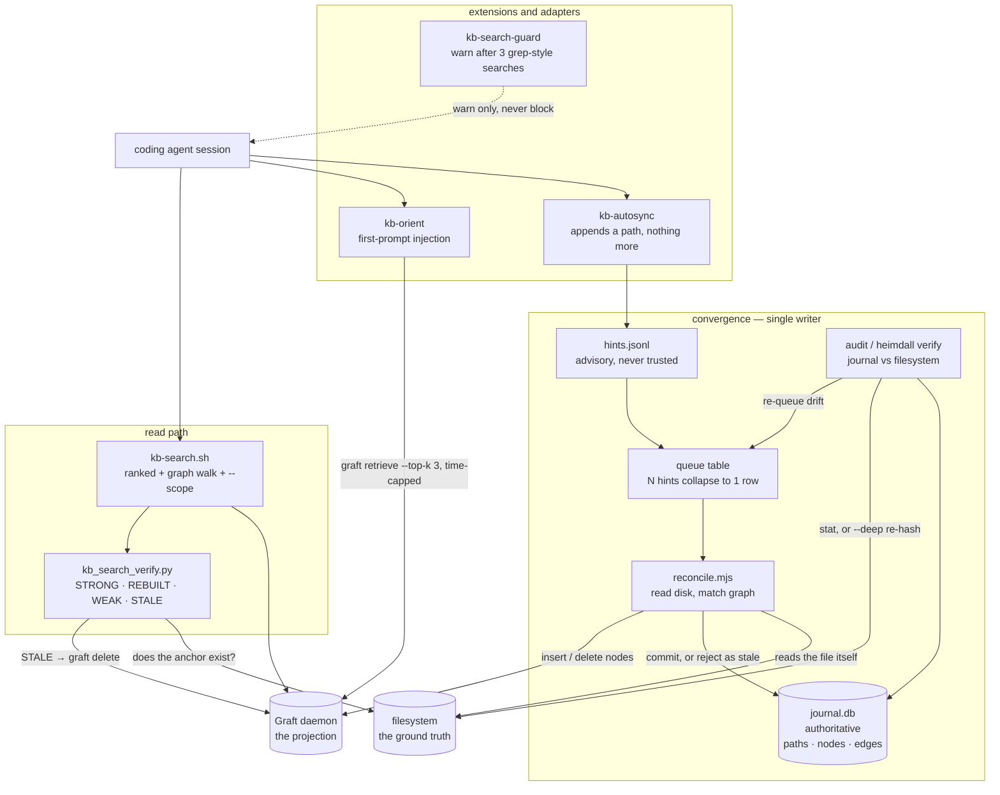

## 1. Executive Summary

Heimdall is a verification and orchestration layer that sits **on top of** a
semantic memory store rather than being one. Its README states the thesis
plainly: *"Heimdall fixes retrieval, not storage. The insight: agent memory fails
not from lack of storage but from lack of retrieval with trust."* The store
underneath is Graft, a separate C daemon; Heimdall seeds it, keeps it current,
and labels what comes out.

The mechanism the report was first written for is in `bin/kb_search_verify.py`.
Every search hit is checked against the filesystem at read time and assigned a
verdict — `STRONG` (lexical coverage plus a live path), `REBUILT` (the path moved
and the node was rebuilt), `WEAK` (semantic only), `STALE` (the anchor is gone,
and the node is removed), plus `REMOVED` and `NOPATH`. Then the results are
sorted by **verdict class first**, with the similarity score demoted to a
tiebreak, under a comment that says why: it *"keeps the true STRONG hit on top
instead of burying"* it beneath a better-scoring unverified one.

That is the atlas's most repeated complaint answered directly. This corpus is
full of systems where retrieval strength and truth end up in one number; here
they are two, and the one that means *this still exists* wins.

**The write path is now a different system.** At the first reading, the graph was
kept current by an extension that regex-parsed the agent's own `mv`, `rm` and
`git rm` out of `tool_result` and issued `graft delete` from the hook. That is
gone. `extensions/kb-autosync.ts` now appends one line — a path — to a hints
file, and `bin/lib/reconcile.mjs` reads the file from disk and makes the graph
match whatever is actually there. Its header states the property the whole design
turns on:

> A queued path is a hint that SOMETHING changed, never a description of what.

Behind it: a SQLite journal that is authoritative over the graph, a single-writer
lock, a generation counter that rejects a stale commit, a depth ladder that
degrades rather than failing when tree-sitter is absent, and an audit that
compares the journal against the filesystem and re-queues whatever drifted.
Twenty-three tests cover it, including one named for the case the old parser
could not see: *"a git checkout is picked up (the old command-regex path could
not see it)"*.

**Weakest:** nothing about trust is stored, so no capability mark is awarded
below. And the two halves of this repository do not talk to each other. The
reconciler's journal knows a path is `absent`; the read-time verifier stats the
filesystem itself and has never heard of the journal. Both delete Graft nodes.
Neither can see what the other did.

## 2. Mental Model

Heimdall now holds two independent answers to one question — *does the thing this
memory points at still exist?* — computed by different code, at different times,
against the same store.

```text
READ TIME (unchanged)             CONVERGENCE (new)
graft retrieve                    hint: "look at this path"
  └► for each hit:                  └► single writer reads the FILE
     does its anchor exist?            └► makes the graph match disk
        ├─ yes + coverage → STRONG        └► journal row: present | absent
        ├─ yes           → WEAK
        └─ no → rehome? REBUILT
                else     STALE ──► graft delete
                                            sink.delete ◄── retraction
        neither consults the other's record
```

**At read time the state is not a property of the memory; it is a property of
the memory's relationship to the world at the moment you asked.** That is a
different design from every trust-state system in this corpus, which stores a
status a writer set. Here nothing is set: the verdict is derived, every time.

**In convergence the reverse holds.** The journal is a stored record, and
`bin/lib/journal.mjs` opens by saying what it is for: *"Heimdall's authoritative
index. The graph is a projection of this; if they disagree, this wins and the
graph gets rebuilt."*

Control is **background-managed** for freshness and **agent-facing** for reading.
The agent searches and is warned when it does not; it still does not file
memories through Heimdall at all.

## 3. Architecture



**Runtime shape.** An npm package with a `heimdall` CLI (`init`, `daemon`,
`reconcile`, `verify`, `depth`, `hint`, `search`, `insert`, `doctor`), a library
of nine ES modules under `bin/lib/`, the original shell and Python tools, three
TypeScript agent extensions, a launchd job, and six test files.

**Vendored dependencies.** Two arrived since the first reading.
`vendor/graft/` holds Graft's C source under Apache 2.0 — 49 files, described in
`VENDORED.md` as *"the actual code — daemon, CLI, storage, embed, retrieve,
explore, verify, http."* `vendor/graphify/` holds the tree-sitter code-graph
extractor under MIT. Neither is a build: `build/` and `third_party/` —
llama.cpp, sqlite-vec, BLAKE3, mpack — are explicitly **not** vendored, so the
store is still a binary you have to produce or install, and `heimdall doctor`
tells you when it is missing. One detail is worth flagging rather than resolving:
`VENDORED.md` gives the upstream as `github.com/tinygrad/graft`, while the
LICENSE file vendored beside it reads *"Copyright 2026 Andrea Redegalli"*. The
provenance note and the licence in the same directory do not name the same party.

**Persistence.** Heimdall now has its own. `~/.heimdall/journal.db` is opened
with `PRAGMA journal_mode = WAL` so a reader never blocks the writer, and
`PRAGMA synchronous = FULL` under the comment *"Durability over speed: this file
is the source of truth."* Five tables: `paths`, `owned_nodes`, `owned_edges`,
`pending_edges`, `queue`. Graft remains the retrieval engine and is now the
*projection*, reached over its CLI through `bin/lib/sink.mjs`.

**Search stack.** Unchanged: Graft supplies semantic candidates, Heimdall adds a
lexical coverage measure plus a graph walk, so the arms are vector and lexical
with the lexical half used for *verification* rather than recall.

### Deployment and ergonomics

Still a personal-machine tool — Node, Python, bash, launchd, a Graft binary you
must be running — but installable now: `heimdall init --harness pi|claude-code|codex|cursor|windsurf|all`
writes the hook configuration each harness expects, and `bin/lib/adapters.mjs`
has a test per target. Nothing is containerised and nothing is multi-user.

## 4. Essential Implementation Paths

**Reconciliation.** `bin/lib/reconcile.mjs` — `reconcilePath` takes a path,
reads its current state, and commits the difference. Three branches: the file is
gone, so every node the path owns is deleted from the sink and the row is
committed `state: "absent"`; the hash and depth match what the journal already
holds, so the row is dequeued untouched — *"Forty agents editing one file collapse
to one hash comparison"*; or the content changed, so nodes are re-projected.

Two orderings in that function are argued for in comments, and both arguments are
correct:

> Sink writes happen BEFORE the journal commit. A crash in between leaves the
> path dirty, so it is redone — safe precisely because reconcile is idempotent.
> The reverse order could mark a path clean that was never projected, which is
> the one failure we cannot detect later.

and, on re-projection, *"Reusing a sink id whose content moved would leave a
stale embedding behind"* — so the old node is deleted before the new one is
inserted rather than updated in place.

**Concurrency.** `journal.commit` takes the generation read at the start of the
reconcile and refuses if it has moved; the caller returns `{action: "stale"}` and
the path is left queued. `bin/lib/lock.mjs` admits one writer and reclaims a lock
whose holder is a dead pid. The journal's header explains why locking is not the
mechanism: *"concurrent writers do not exist, so the delete+insert races that
plagued the old direct-to-graft path are unrepresentable."*

**Ordering independence.** `pending_edges` parks an edge whose target symbol has
not been indexed yet, owned by the source file and resolved when the target's
file is reconciled. The test asserts the graph is identical whether A or B is
reconciled first.

**Depth.** `bin/lib/depth.mjs` defines four levels — `path`, `file`, `symbol`,
`graph` — and the default is `max`, resolved to the deepest level whose
dependencies are present on this machine. A box without tree-sitter degrades to
L1 and `heimdall doctor` says so *"instead of failing to install."*

**Drift.** `audit(ctx, {deep, enqueue})` walks every journal row: a `present` row
whose file is gone is drift, an `absent` row whose file is back is drift, and
otherwise size and mtime are the cheap screen with `--deep` re-hashing to catch
a same-size same-mtime rewrite. `heimdall verify` calls it with `enqueue: false`
and exits 1 on drift — *"drift detection and drift repair are separable."*

The subtlest rule here is `cap_max`, and it is the fix in the tip commit. A file
whose language has no tree-sitter extractor settles below the machine's maximum
depth forever; flagging that as drift every audit made `verify` permanently red.
The row therefore records the capability that was in force when it was written,
so a below-cap row is only drift when the capability itself is new.

**Verification.** `bin/kb_search_verify.py` — unchanged in shape, extended in
substance. `extract_paths(text)` pulls candidate anchors out of a node's body;
coverage is a token overlap between the query and the hit; a `STALE` hit with an
id goes to `handle_stale`, whose docstring still gives the reason it exists —
*"Desktop gets reorganized aggressively"* — and which runs a bounded basename
search, returning `REBUILT` when it finds the file elsewhere and `STALE` when it
does not, in which case the node is removed. Since the first reading the verdict
also folds in **file content**: a hit whose file exists but whose text does not
lexically cover the query no longer reaches `STRONG`.

**Ranking.** `vrank = {"STRONG": 0, "REBUILT": 0, "WEAK": 1, "STALE": 2,
"REMOVED": 2, "NOPATH": 3}` is the primary sort key and the score is secondary.

**The guard.** `extensions/kb-search-guard.ts` with `lib/kb-guard-core.mjs`
warns after three consecutive grep-style searches that did not consult
knowledge. It is *"warn-only, never block"*, one warning per firing action.

**Hinting.** `extensions/kb-autosync.ts` is now twenty-odd lines of work and a
long header explaining what it stopped doing. *"Appending a line is all this
does, so it is non-blocking and needs no lock, no sqlite, no graft, and no
debounce."*

## 5. Memory Data Model

Heimdall now defines a schema, and it is the more interesting half of the system.

`paths` carries `hash`, `size`, `mtime_ms`, `depth`, `cap_max`, `generation`,
`state` and `reconciled_at`. `owned_nodes` carries `node_id`, `path`, `kind`,
`symbol`, `line`, `label` and a nullable `sink_id` — nullable because *"the
journal entry is written first and is authoritative, the projection catches
up."* `owned_edges` and `pending_edges` hold resolved and parked relations.
Node ids are namespaced by path so two files named `index.ts` cannot collide,
and there is a test for exactly that.

**Ownership is the organising idea.** Every node and edge belongs to one path,
so retracting a path is a bounded, exact operation — *"deleting a file retracts
exactly its own nodes"*, with a sibling file's node asserted untouched in the
same test.

The nodes projected into Graft are thin. `renderNode` turns a file node into
`{title: path, body: "path — language"}` and a symbol node into
`{title: "alpha() — /p/f.py:12", body: "alpha() defined at /p/f.py:12"}`. What
the graph gains from L3 is *structure and location*, not content: nothing
embeds the body of a function.

The knowledge-base notes seeded from `~/knowledge-base/.inventory.tsv` are a
second, unrelated population in the same store, with no journal row and no
owning path. **The anchor is still their identity**, and a note whose body names
no path can only ever be `NOPATH`, which sorts last.

**Scoping** is a substring match against the path at query time. There is no
stored scope key, no user or project field, and nothing prevents a search without
`--scope` from returning anything in the store — which for a single-user tool
over one home directory is consistent, and is why the mark is withheld rather
than awarded narrowly.

**Provenance and time.** `reconciled_at` is the first timestamp Heimdall has ever
recorded, and it is when the row was last converged, not when anything was true.
There is no history: a row is updated in place, so the journal says what is, never
what was.

**Correction.** Still none for content. A node is verified, rehomed, retracted or
deleted; nothing edits what a seeded note says, and nothing records that a note
was once wrong.

## 6. Retrieval Mechanics

Two stages: Graft returns semantic candidates and a graph walk widens them, then
every hit is verified and the set is sorted by verdict before score. The second
stage is the contribution, and it inverts the usual arrangement — most systems in
this corpus rank by similarity and, at best, annotate. Here a WEAK hit with a
high score sits below a STRONG hit with a lower one, on purpose.

**Failure modes.** Coverage remains a blunt threshold, and the content check
added since the first reading tightens one failure and opens another: a file that
still exists but no longer says what the note claims is no longer automatically
STRONG, but a correct note phrased differently from the query now has two ways to
lose a rank class instead of one. And `--scope` matching a path substring will
match anything sharing the string, which for a personal knowledge base is usually
fine and is not a boundary.

**The journal is not consulted.** `kb_search_verify.py` contains no reference to
it. The reconciler may have recorded a path `absent` seconds earlier; the read
path will still stat the filesystem itself, reach the same conclusion by its own
route, and delete the node through a second code path. For the common case this
is merely redundant. It stops being redundant for nodes the reconciler owns: a
read-time `graft delete` removes a projection whose `sink_id` the journal still
holds, and nothing ever notices, because `audit()` compares the journal to the
**filesystem** and never to the sink.

**Cost.** Every search stats the filesystem once per hit, reads the file when the
path is live, and may run a bounded basename search for each STALE one, so read
latency scales with results, with file sizes, and with how disorganised the disk
is.

## 7. Write Mechanics

**Heimdall still does not write memories, and now writes an index.** Seeded notes
come from an inventory file. Everything else in the graph is a projection of the
journal, and the journal is a projection of the disk.

The fragility that was in this section is gone, and the repository says so in the
file that carried it. `kb-autosync.ts` lists the three properties that made the
old approach unfixable: it could only see writes it recognised — *"`git checkout`,
`make`, a script, an IDE save, or a second agent were structurally invisible"* —
every hook process wrote the graph concurrently, and *"a misparse wrote WRONG
data, because the command text was treated as the description of what changed."*

What replaces it is the standard level-triggered control loop, applied to a
memory index. The hint carries no verb. Reconcile is idempotent, so a duplicate
hint is free, a missing hint is caught by the audit, and a wrong hint reads a file
that has not changed and dequeues. That is a materially stronger guarantee than
anything else in this corpus offers for keeping a store aligned with a world it
does not control, and it costs one SQLite file.

**One gap remains on the insert side.** `GraftSink.insert` parses the new node's
id out of Graft's stdout, accepting bare hex or JSON, and **returns `null` when
neither matches**. Reconcile stores that null as the node's `sink_id` without
error. The node exists in Graft, the journal owns it, and no code path can ever
delete it — retraction only deletes ids it has. Because the hash still matches
disk, the audit will never flag the row. It is one unparsed line of output away
from a node that outlives the file it describes.

### Operational cost

No model call anywhere in this repository. The read path pays one filesystem
check and one file read per hit; the reconciler pays a hash per changed file and
batches tree-sitter work into one Python invocation per drain round, which the
comment calls *"the difference between a startup sweep taking minutes and taking
hours."* Session orientation is capped in time and to three retrieved items. There
is no injection per turn, so nothing here invalidates a prompt-prefix cache
repeatedly.

## 8. Agent Integration

Three extensions and a set of shell tools, now reachable from five harnesses.
`heimdall init --harness <name>` writes the configuration each one wants — a pi
extension config, a Claude Code settings hook, a Codex `AGENTS.md` snippet, a
Cursor or Windsurf rules file — and `tests/adapters.test.mjs` asserts each writes
what it claims.

The agent's relationship to memory is **read and be nudged**: `kb-orient` puts
prior work in the first prompt, `kb-search` is the tool it calls, and
`kb-search-guard` warns when it has run three grep-style searches without
consulting knowledge — a behavioural intervention on the read path that this
corpus has almost no other examples of.

The guard being warn-only is the right call and is stated as one. A blocking
guard would be an enforcement point, and the [pattern this atlas argues
for](../../patterns/gate-the-expensive-path/) is about deciding whether the
costly operation is worth doing rather than forbidding the cheap one.

**A hint is advisory all the way down.** `heimdall hint /gone.md` warns and exits
0, with a test asserting the zero: an agent cannot fail its own turn by hinting a
path that has been deleted, because absence is a state the reconciler is entitled
to record.

## 9. Reliability, Safety, and Trust

**The trust model is real and entirely transient.** Verdicts are computed per
hit, used to sort, then discarded. Nothing persists, so nothing can accumulate: a
node that was STALE last week and REBUILT today leaves no record of either, and a
reader cannot ask which parts of the store have been unstable. The mark is
withheld on exactly that basis — the rubric asks for a discrete status *as a
field*, and this is a computation — while noting that the *effect* is stronger
than what the mark measures, because STALE does not merely withhold a memory, it
deletes it.

**The journal is not the record that would fix this.** It stores `state`, and
`present`/`absent` is existence rather than epistemic status; it is updated in
place rather than appended to; and an `absent` row is keyed on a path, not on a
value that was rejected. Under this atlas's definitions that is neither a trust
state, an audit log, nor a tombstone — the `absent` row exists so that a
reappearance can be detected as drift, and a reappeared file is re-indexed
without reference to why it left.

**Data loss.** The read path's deletion is still the risk, and it is now the
older of the two mechanisms. A STALE verdict removes the node, and the only
guard is the bounded basename search that precedes it. A file moved to a path the
search does not cover — a rename, an archive, an unmounted volume — is
indistinguishable from a file deleted. The reconciler's retraction is the safer
of the pair, because it acts on a path it already owns and records the outcome;
`handle_stale` acts on a path it inferred from a note's prose.

**Failure containment is deliberate and tested.** A path that throws during
extraction is dequeued rather than retried forever, leaving the prior journal row
untouched; a sink that is down defers once and dequeues; both have a test that
fails the run if the drain loop spins more than five rounds. `PRAGMA synchronous
= FULL` and the sink-before-commit ordering mean a crash costs redundant work, not
a row marked clean that was never projected.

**Provenance, audit, review:** no append-only record of mutations, no surface for
a person to adjudicate anything, and no protection against a poisoned note beyond
the anchor and content checks.

**Multi-user:** not attempted, and correctly so — this is a tool for one person's
home directory.

## 10. Tests, Evals, and Benchmarks

Fifty-three cases across six files, against one at the first reading. Twenty-three
of them are in `tests/reconcile.test.mjs`, and they test the properties the design
claims rather than the functions it exports:

- N concurrent writers on one path converge to one node set; 300 hints from
  separate processes collapse to one queue row.
- Reconciling twice is byte-identical, compared as a snapshot of the journal.
- A commit whose generation went stale writes nothing.
- Deleting a file retracts exactly its own nodes and leaves a sibling's alone.
- Cross-file edges converge regardless of reconcile order.
- A behind-our-back edit is detected by audit and repaired by reconcile; a
  rewrite that preserved size and mtime is caught only by `--deep`, with the
  shallow audit asserted to be fooled in the same test.
- A git checkout is picked up — named for the case the old parser could not see.
- A below-capability row is not perpetual drift, and a legacy row without
  `cap_max` is flagged exactly once.
- An erroring path and a failing sink each dequeue rather than poisoning the
  queue, with the assertion written as a round counter that calls `assert.fail`.

`tests/kb-verify.test.mjs` is the second addition and closes the gap this report
named first: the verification logic now has tests, driving the real
`kb_search_verify.py` in a self-test mode that needs no daemon. Its first case is
the content contract — a hit whose file lacks lexical coverage of the query must
not be STRONG — and two more are regressions for a path-extraction bug whose
description is the useful part: the old pattern *"could never match `~/...` prose
at all, which silently hid every `~`-anchored node from both search verdicts and
the stale scan."* A verifier that cannot see a class of anchors calls them all
NOPATH, and nothing would have reported that.

**`handle_stale` still has no test.** Neither does `vrank`. Grep the test
directory for `STALE`, `REBUILT` or `vrank` and there are no hits. The suite that
now proves a crash cannot mark a path clean does not check that the function
which deletes a user's notes prefers rehoming to deletion — the two tests this
report asked for at the first reading, that a moved file returns REBUILT and that
an unmounted anchor is not removed, are still the ones missing.

No benchmark or result artifact is committed. `docs/heimdall_compare.dot` and its
rendered PNG compare Heimdall against [Graphify](../../systems/graphify/) and
Graft; it is a positioning diagram, not a measurement. The README's *"23 tests"*
counts the reconciler suite, not the repository.

## 11. For Your Own Build

### Steal

- **Make the hint carry no verb.** *"A queued path is a hint that SOMETHING
  changed, never a description of what."* Every system in this corpus that syncs
  a store to an external world by replaying events inherits the same three bugs
  named in `kb-autosync.ts`: unrecognised writes are invisible, concurrent
  writers race, and a misparse writes wrong data confidently. Reading the source
  of truth instead makes all three unrepresentable rather than handled.
- **Sort by verified-ness first and by score second.** Four lines of `vrank`
  ahead of the similarity comparison directly prevents the failure this atlas
  names most often — a confident, well-scoring memory that is no longer true
  outranking a duller one that is.
- **Write the projection before you mark the source clean.** The comment carries
  the whole argument: the crash you can recover from is redundant work, and the
  crash you cannot detect is a row marked clean that was never projected.
- **Record the capability a row was written under.** `cap_max` is a small column
  that turns "this file could be indexed more deeply than it is" from permanent
  drift into a one-time upgrade — the difference between a verify command that
  converges and one that is always red and therefore ignored.
- **Separate drift detection from drift repair.** `heimdall verify` reports and
  exits nonzero; `heimdall reconcile --all` fixes. That split is what makes the
  accuracy claim a thing you can put in CI.
- **Verify a memory by checking the thing it points at.** An anchor that can be
  stat'd turns freshness from a decay heuristic into an observation.
- **Warn the agent when it is not using memory, and do not block it.**

### Avoid

- **Do not let two subsystems delete from one store without a shared record.**
  Both halves of this repository remove Graft nodes, and neither reads the
  other's state. The journal is declared authoritative over the graph and nothing
  ever compares them.
- **Do not accept a null id from an insert.** A projection whose id you failed to
  parse is a row you can never delete and an audit that will never flag it.
- **Do not let a read-path verdict be the only record of trust.** Compute it if
  you like, but persist the transitions — a store where nodes go stale and come
  back has a maintenance story that nobody can see if the state lives only in one
  sorted result set.
- **Do not delete on a failed existence check alone** unless you can distinguish
  moved, archived and unmounted from deleted.
- **Do not leave the data-destroying path untested** while writing twenty-three
  tests for the path that does not destroy data.

### Fit

This suits one developer with a large personal knowledge base spread across
projects, already able to build or install Graft, who has noticed their agent
re-solving problems it has notes on. The reconciler makes it a plausible
code-graph index for a working tree as well, which it was not before. Walk away
if you need the store itself — the source is vendored, the binary is not — or if
your notes do not anchor to files, because the read-time trust model is entirely
the path check. And treat `handle_stale` as the thing to configure before running
it against notes you cannot regenerate.

## 12. Open Questions

- Nothing compares the journal to the sink. What fraction of `sink_id`s are stale
  after a month of the read path deleting nodes underneath it, and would a
  `verify --projection` pass be cheap enough to run on a timer?
- How often does `handle_stale` delete a node whose file merely moved outside the
  bounded search? Only a real knowledge base would show the rate, and nothing
  records it.
- Does the coverage threshold discriminate on real queries, now that file content
  feeds it as well as the query tokens? It is still the one tuned number in the
  system and nothing reports its effect.
- Would the verdicts be worth persisting into the journal now that a journal
  exists? The row has a `state` column and a `reconciled_at`; the missing piece
  is history, not a place to put it.
- `VENDORED.md` and the vendored LICENSE name different parties for Graft. Which
  is the upstream matters for anyone relying on the Apache grant.

## Appendix: File Index

- **Convergence:** `bin/lib/reconcile.mjs` (`reconcilePath`, `drain`, `audit`, `skipPath`), `bin/lib/journal.mjs` (schema, `commit`, `resolvePending`), `bin/lib/lock.mjs`, `bin/lib/depth.mjs` (`LEVELS`, `depthFor`), `bin/lib/extract.mjs`, `bin/lib/sink.mjs` (`MemorySink`, `GraftSink`, `renderNode`), `bin/lib/hints.mjs`, `bin/heimdall-reconciler.mjs`
- **CLI and adapters:** `bin/heimdall.js`, `bin/lib/cli-main.mjs`, `bin/lib/adapters.mjs`, `docs/adapters.md`
- **Verification and ranking:** `bin/kb_search_verify.py` (`extract_paths`, `handle_stale`, verdict, `vrank`)
- **Search:** `bin/kb-search.sh`
- **Agent extensions:** `extensions/kb-orient.ts`, `extensions/kb-search-guard.ts`, `extensions/kb-autosync.ts`, `lib/kb-guard-core.mjs`
- **Store boundary:** `bin/seed-graft.sh`, `vendor/graft/` (Apache 2.0), `vendor/graphify/` (MIT)
- **Maintenance:** `bin/kb-stale-scan.py`, `bin/kb-rehome.sh`, `bin/kb-rebuild.sh`, `bin/kb-health.sh`, `bin/telemetry.sh`, `launchd/`
- **Tests:** `tests/reconcile.test.mjs`, `tests/kb-verify.test.mjs`, `tests/guard.test.mjs`, `tests/adapters.test.mjs`, `tests/cli-contract.test.mjs`, `tests/init.test.mjs`

## History

**2026-08-22** — [`70ad71d06328d94331041da6aa10ab9c54b96be5`](https://github.com/ArihantDeva/heimdall/commit/70ad71d06328d94331041da6aa10ab9c54b96be5) — re-pinned after fifteen commits. Screened again before reading: no auto-executing surface, no build-time execution, three files inside the seven-day cooldown, and two unpinned dependency surfaces — three floating ranges in `package.json` against a present lockfile, and sixteen `>=` requirements in `vendor/graphify/requirements.txt`. Nothing was installed, no daemon was started and no search was run. The write path was replaced: the command-parsing autosync is now a hint emitter, and a level-triggered reconciler over a SQLite journal converges the graph from disk, with a single-writer lock, generation-checked commits and an audit. Graft's C source and Graphify are vendored, without their build trees. The test count went from one file to six; the verification logic gained tests and `handle_stale` still has none. No capability mark changes: the journal's `absent` row is keyed on a path rather than a rejected value, it is updated in place rather than appended to, and the verdicts are still computed at read time and discarded.

**2026-08-20** — [`f9bc25abd27351d1af04ebe24b7deb555ba42102`](https://github.com/ArihantDeva/heimdall/commit/f9bc25abd27351d1af04ebe24b7deb555ba42102) — first reading. Screened before anything was read: no auto-executing surface, no build-time execution, both `package.json` and `package-lock.json` inside the seven-day cooldown and one unpinned range; nothing was installed, no daemon was started and no search was run. The verdict ordering and the stale-handling path were established by reading `kb_search_verify.py`, and the store beneath — Graft — is a separate program that this reading did not inspect.
