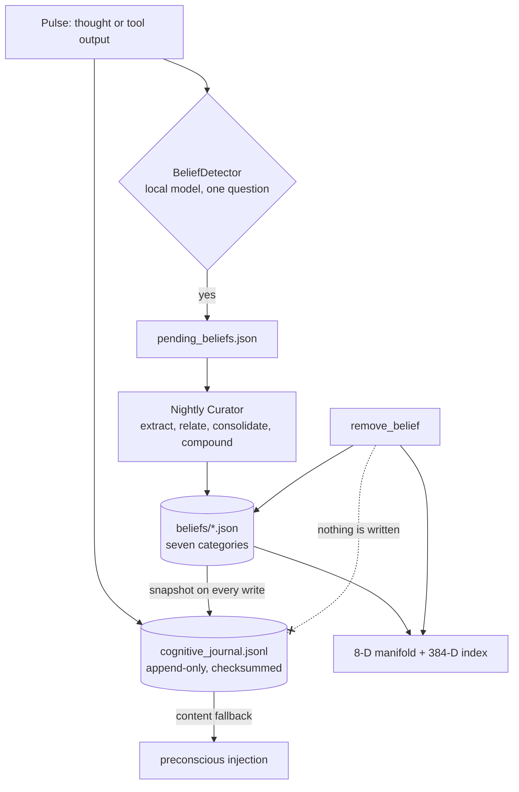

## 1. Executive Summary

Helix AGI is a 59,000-line single-agent runtime, AGPL-3.0, built around a
continuous four-state pulse loop rather than a request/response chain. Its memory
layer has two halves that do not share a storage model. **Beliefs** live in seven
JSON files, one per category, in a two-tier epistemic topology: an outer tier
formed during the pulse (premises, propositions, preferences) and an inner tier
crystallised nightly by a Curator (people, skills, desires, concepts).
**Memories** live nowhere but an append-only JSONL journal — `MemoryManager.store`
says so in its own docstring: *"No SQLite or ChromaDB writes are performed."*

Retrieval is split, and the split is the best structural idea here. An 8-D
manifold carries ambient "gravity" for preconscious injection, deliberately
cheap; a lossless 384-D index (numpy brute force, upgrading to FAISS `IndexIVFFlat`
past 5,000 vectors) serves explicit recall. Ambient and precise are different
jobs with different costs, and most systems in this atlas run both through one
index.

What separates this system from its neighbours is that its epistemics are
*written down as equations* and recomputed on a schedule. A belief's mass is
`m_s + m_a` — structural confidence plus an affective charge derived from the
somatic state at encoding — and confidence is recomputed nightly by a stated
attrition equation over time held, reliance, verifications and stability. The
code explains what it excluded and why: relation count was removed from
individual mass because it produced *"relations → mass ↑ → gravity ↑ →
co-injection → more relations"* (`memory/belief_store.py:44-47`), a
self-reinforcing popularity loop caught and cut.

Against that, one gap runs through the whole design. `CognitiveJournal`'s module
docstring calls it *"the single source of truth for all Helix memories, beliefs,
and thought snapshots"*, and **nothing that deletes ever writes to it.**
`remove_belief` rewrites a category file and clears the two runtime indexes;
`archive_belief` sets mass to `0.01` and adds a tag. Neither appends a line. The
journal therefore holds the content of every belief the system has ever had,
including the ones it was told to forget, and `preconscious._resolve_memory_content`
reads content out of it as a live fallback. Memories have no delete path at all.

## 2. Mental Model

A thought becomes a belief in four moves, and stops being one in a way that
depends on which store you ask.

**Capture is model-free.** Every pulse writes a memory line to the journal with
its 8-D position and the Lagrangian snapshot of the somatic state at encoding. No
extraction, no embedding call, no database.

**Tagging is cheap and local.** `BeliefDetector` runs as a post-pulse hook and
asks a local Ollama model exactly one question — *"does this thought contain a
durable belief realization?"* — in two passes, one over the internal monologue
and one over expressive tool output. It does *"NO extraction, classification,
embedding, or comparison"*; a yes writes the pulse id into
`data/pending_beliefs.json` with `status: pending`. The expensive work is deferred
to the night.

**Crystallisation is nightly and consolidative.** The Curator collects raw
memories, extracts candidate beliefs with a frontier model, builds relations,
merges against the existing store, and compounds higher-order beliefs from
UMAP/HDBSCAN clusters before integrating. Only beliefs that pass consolidation
proceed — except when consolidation raises, where the handler is explicit that
*"on failure, all beliefs pass through unmerged"*.

**Decay is arithmetic, not judgement.** Confidence is recomputed from
`C = min(1.0, (Base + w_T + w_R + w_V) × (0.5 + S))`. Nothing sets a status; a
belief becomes irrelevant by losing mass, and `archive_belief` accelerates that
by pinning mass at `0.01`.

**And forgetting is where the two stores diverge.** A `remove_belief` is honest
about the belief file and the runtime indexes and silent to the journal.

The dotted edge is the finding. Every other arrow into the journal is a write;
the delete path has none, and the journal still feeds the prompt.

## 3. Architecture

An operator stands up a single agent on one machine. `Helix Setup Wizard.sh` and
a Tkinter wizard collect credentials and model choices; `main.py` starts the
pulse loop; state lives under a `data/` directory beside the code. There is no
server, no multi-user surface and no migration system — a category file is read,
rewritten in full, and written back.

Models are pluggable across Gemini, Anthropic, Ollama and llama.cpp, with a
`local_conscious` provider for fully offline operation. The design leans on that
split: the frontier model does nightly extraction, a small local model does the
per-pulse gate, and `all-MiniLM-L6-v2` produces the 384-D embeddings.

Reach is unusually wide for a memory system — Discord, Slack, Telegram, WhatsApp
and webhook channels; Google Calendar, Drive, Gmail and Tasks; a browser and
desktop-control tool; a tool factory that writes new tools into `tools/custom/`.
The operational consequence is that the memory layer ingests from many mouths and
has one lock-free JSON file per belief category behind them.

`requirements.txt` pins nothing — 29 requirements are declared with `>=`,
including `chromadb`, `sentence-transformers` and three model SDKs — and
`setup.py` executes at install time. The screen of this checkout reported one
build-time execution surface, two unpinned dependency surfaces and one manifest
changed inside the seven-day window; nothing from the tree was installed or run
for this report.

## 4. Essential Implementation Paths

- **Capture** — `memory/memory_manager.py:199` `store()`: appends to the journal,
  optionally registers a 384-D embedding, returns an incrementing short-term id.
- **Belief write** — `memory/belief_store.py:314` `add_belief()` →
  `_normalize_belief` → `_write_category` → `_sync_runtime` →
  `_append_belief_snapshot`.
- **Journal** — `memory/cognitive_journal.py`: `append` (line 61), `load_all`
  (118), `latest_by_id` (137), `compact` (151).
- **Delete** — `memory/belief_store.py:440` `remove_belief`, `:453`
  `archive_belief`; `core/physics_engine.py:471` `_remove_point` clears both the
  spatial space and the semantic index.
- **Correction** — `:529` `update_belief`, `:715` `adjust_confidence`, `:752`
  `find_near_duplicates`, `:776` `merge_beliefs`.
- **Nightly** — `core/curator.py:82` `_run_nightly_cycle`.
- **Gate** — `core/belief_detector.py`, tagging only.
- **Injection** — `core/preconscious.py`, with `_resolve_memory_content` at
  `:673`.

## 5. Memory Data Model

A belief carries `id`, `content`, `mass`, `confidence`, `verifications`,
`stability_index`, `relations`, `memory_refs`, `position_8d`,
`encoding_lagrangian`, `created_at`, `last_accessed`, `access_count`, `source`
and `tags`. Categories are files, not a column: `premises`, `propositions`,
`preferences` in the outer tier; `people`, `skills`, `desires`, `concepts` in the
inner one.

Two absences matter. There is **no status field** — nothing in the schema can say
*candidate*, *verified* or *rejected*, so every epistemic distinction has to be
expressed as a number. And there is **no scope key of any kind**: no user, no
project, no agent, no tenant. This is a single-agent design and says so, but it
means the memory layer has no boundary to enforce if the design ever grows one.

A journal line carries `id`, `type` (`memory`, `belief`, `thought`), `content`,
`position_8d`, `pulse_id`, `lagrangian`, `metadata`, an optional 384-float
embedding, a timestamp and a SHA-256 `checksum`.

`memory_refs` gives a belief provenance back to the memories that formed it, and
`get_justification_chain` (`:626`) walks it. That is real provenance, and it is
the reason the deletion gap bites: nothing repairs an inbound `memory_refs` or
`relations` pointer when the target is removed, while `merge_beliefs` explicitly
does repair *"all relation pointers"* when two beliefs become one.

## 6. Retrieval Mechanics

Ambient recall never runs a query. The preconscious assembles context from what
is *near* the current attention centre in the 8-D manifold, weighted by mass —
the README's claim is that this injects roughly 30 tokens per turn against about
1,900 for flat semantic RAG.

Explicit recall goes to `SemanticIndex`: cosine over uncompressed 384-D vectors,
brute force under 5,000 vectors and FAISS `IndexIVFFlat` above, with a read-write
lock so the pulse loop can write while a tool reads. The strategy upgrade is
automatic and the thresholds are stated in the module docstring.

`get_surface_by_topic`, `search_beliefs` and `get_related` serve belief lookups
directly from the category files, and `recall_with_somatic_echo` blends the
affective state at encoding into memory recall — retrieval conditioned on how the
agent felt, which is unusual and coherent with the rest of the design.

## 7. Write Mechanics

**Writes do not block on a model.** A pulse's memory reaches the journal
immediately; the belief detector's model call happens in a post-pulse hook, and
nothing about capture depends on it. Write-to-retrievable lag for a *memory* is
effectively zero when an embedding is supplied, and for a *belief* it is one
night: a tagged pulse is not a belief until the Curator runs.

**A background pass rewrites a large part of the store.** The nightly cycle
extracts, merges and compounds; `merge_beliefs` consolidates duplicates and
rewrites relation pointers; the attrition pass recomputes confidence across
every belief. All of it is unattended, and none of it is reviewable before it
takes effect.

Every belief write also appends a full snapshot to the journal, including the
384-float embedding. **The nightly compaction that would bound this does not
run** — `compact()` is defined at `cognitive_journal.py:151` and has no caller
anywhere in the tree, so the journal grows one complete snapshot per belief
update forever.

## 8. Agent Integration

The agent is the product; there is no SDK to embed. Memory is reachable through
tools (`memory_recall`), through the automatic preconscious injection, and
through the dashboard, which reads `data/` and renders state. The dashboard is a
**monitor, not a review surface** — nothing in it approves, edits, rejects or
deletes a belief, which is why `human_review` is withheld.

A separate MCP plugin (`plugins/helix-agent-lab/`) exists for running prompt
cases against agents. It is testing infrastructure rather than a memory surface.

## 9. Reliability, Safety, and Trust

**Integrity is computed, checked, and then discarded.** Every journal line
carries a SHA-256 over its own JSON. `load_all` recomputes it and, on a mismatch,
*"we simply skip the corrupted line"* — no error, no counter, no log line. A
truncated or edited journal reads as a shorter journal. The mechanism to detect
tampering is present and its result is thrown away.

**Deletion does not propagate to the store the system calls authoritative.**
`remove_belief` clears the manifold and the semantic index, so a removed belief
will not come back through either retrieval surface. It remains in the journal
with its content, and `preconscious._resolve_memory_content` tries the belief
store first and the journal second — so an id that survives in an affect surface
or a dangling `relations` entry resolves the deleted belief's text and injects it
as *"emotionally resonant"*.

Two functions would make that worse and are not currently wired:
`CognitiveSpace.bootstrap_from_journal` and `SpatialMind.bootstrap` both replay
`load_all()` — every historical snapshot, not `latest_by_id()` — and neither has
a caller. They are one call site from turning a delete into a no-op across
restarts.

**Trust is numbers.** Confidence, mass, verifications and stability index, with
no discrete state, so *rejected* is not expressible. The only occurrence of
"contradiction" in the belief store is a comment on a `-0.10` stability nudge
(`:480`): a contradiction is detected, subtracts a tenth, and leaves no record
that a conflict happened.

**Consolidation fails open.** When the merge phase raises, *"all beliefs pass
through unmerged"* — an extraction error becomes duplicate beliefs rather than a
paused night.

## 10. Tests, Evals, and Benchmarks

Roughly forty test files, plus sandboxes for LoCoMo, StateBench, belief
extrapolation and tool creation. `tests/test_belief_operations.py` covers the
store's arithmetic; `tests/test_runtime_integrity.py` exercises journal
round-trips.

The one committed negative assertion in the memory layer is
`tests/test_scratchpad_postpone.py:130`: remove a note, then assert its id is
absent from the file on disk. That is a deletion-durability assertion against the
store's only read surface, and it earns `negative_eval` — narrowly. **Nothing
asserts that a removed belief is absent**, and the test that would matter most is
the one this design would fail: a removed belief's content is still in the
journal, and the journal is a read path.

`tests/test_simulated_safety_benchmark.py:209` asserts that episode metadata,
goals and titles stay out of the prompt an agent sees — harness hygiene, and the
right instinct, but about the benchmark rather than about memory.

Benchmark artifacts are committed rather than merely quoted: per-run JSON and
markdown under `documents/benchmark/`, including a comparative run against a
Codex baseline. Read them for what they are — the composite is 90/90, graded by a
model against the system's own rubric, so it measures the harness's agreement
with itself.

**The headline retrieval claim has no artifact.** *"~30 tokens per turn … versus
~1,900 … a 63× reduction"* appears three times in the README, and no file under
`documents/benchmark/` contains a token measurement. The mechanism makes the
direction plausible; the number is unsupported in the tree.

## 11. Patterns Worth Stealing

### Steal

**Cut the loop between reachability and importance, and write down why.** The
comment at `belief_store.py:44-47` records that relation count was removed from
individual mass because related beliefs got co-injected, which created more
relations, which raised mass again. Cluster gravity now emerges from spatial
density instead. Most systems that ship this loop never name it.

**Put a cheap local gate in front of the expensive nightly pass.**
`BeliefDetector` answers one yes/no question with a small local model and writes
a pulse id to a pending file. Extraction, classification, embedding and
comparison all happen later, in one batch, on a bigger model.

**Separate the ambient surface from the precise one.** An 8-D manifold for
what should drift into attention, a lossless 384-D index for what was explicitly
asked for. They have different accuracy requirements and different per-turn
budgets, and merging them is how ambient recall gets expensive.

**Write the decay rule as an equation with named terms.** Time held, reliance,
verifications, stability — each visible, each tunable, each auditable against a
belief's stored fields.

### Avoid

**Do not call a store the single source of truth unless deletion writes to it.**
Every other mutation appends a snapshot; only forgetting is silent, which makes
the journal a complete history of everything except what a user asked to remove.

**Do not verify a checksum and discard the result.** Skipping a corrupted line
converts an integrity failure into silent data loss.

**Do not ship a documented maintenance pass with no caller.** The compaction that
bounds journal growth exists as a method and never runs.

**Do not resolve content through a fallback that outlives your delete.** The
preconscious tries the store, then the journal — so the second path serves what
the first one was told to forget.

### Fit

This is a design for one person running one agent on one machine, and on those
terms it is coherent: no scope key is the right answer for a single-tenant
desktop system, JSON files are inspectable, and the physics metaphor buys a
cheap ambient recall path that genuinely avoids per-turn embedding calls. Take
the equations and the gate.

It is the wrong starting point for anything with a second user, a compliance
obligation, or an operator who will be asked *"is it gone?"* — not because the
mechanisms are unsophisticated, but because the layer that would answer that
question is the one the delete path skips. A reader who wants the same ambient
recall with a defensible forget story should copy the manifold and put a real
store under it.

## 12. Antipatterns / Risks

- **A source of truth that never hears a delete.** The central risk, and the
  cheapest to close: append a tombstone line on `remove_belief` and teach
  `latest_by_id` to honour it.
- **Silent checksum failures**, which hide the corruption they detect.
- **Unbounded journal growth**, one embedding-bearing snapshot per belief write,
  with the bounding pass unwired.
- **Dangling references after delete**, because `remove_belief` does not repair
  inbound `relations`/`memory_refs` while `merge_beliefs` does.
- **Published numbers without artifacts** — the 63× context claim.
- **A model grading its own system** in the committed comparative benchmark.
- **Consolidation that fails open**, turning an extraction error into duplicates.
- **Full-file rewrites** of belief categories with no lock, under a runtime with
  five inbound message channels.

## 13. Build-vs-Borrow Takeaways

Borrow the *shape*: model-free capture, a cheap local gate, a nightly
consolidator, and two retrieval surfaces with different cost profiles. That
combination is well-reasoned and unusually well documented in comments.

Do not borrow the storage layer. Seven JSON files rewritten whole, an unbounded
journal, and a delete that reaches two indexes and not the log are three separate
things to replace, and each is straightforward to replace independently — the
belief schema itself would sit unchanged on SQLite with a status column and a
mutation log.

## 14. Open Questions

- Is `bootstrap_from_journal` intended as the restart path? If it is wired
  later, every deleted belief returns, and every historical snapshot returns with
  it, since it replays `load_all()` rather than `latest_by_id()`.
- Was `compact()` ever called, and what is journal size in a long-running
  install?
- What produced the ~30 versus ~1,900 token figures, and can the harness be
  committed?
- Is the `-0.10` contradiction nudge ever the *only* consequence of a detected
  conflict, or does a downstream pass act on it?

## 15. Appendix: File Index

| Path | Role |
| --- | --- |
| `memory/belief_store.py` | Seven-category belief store, mass and confidence arithmetic, merge, remove, archive |
| `memory/cognitive_journal.py` | Append-only JSONL journal, checksums, `compact()` |
| `memory/memory_manager.py` | Journal-only memory writes, semantic and contextual search |
| `memory/semantic_index.py` | 384-D index, numpy → FAISS upgrade, save/load |
| `core/curator.py` | Nightly extraction, consolidation, compounding, integration |
| `core/belief_detector.py` | Per-pulse local-model gate that tags without extracting |
| `core/belief_consolidator.py` | Relation building and duplicate merging |
| `core/preconscious.py` | Ambient injection assembly; `_resolve_memory_content` |
| `core/physics_engine.py` | Point registration and removal across both indexes |
| `core/cognitive_space.py`, `core/spatial_mind.py` | 8-D manifold and KD-trees; unwired journal bootstraps |
| `dashboard/dashboard.py` | Read-only state monitor |
| `tests/test_scratchpad_postpone.py` | The one committed absence assertion |
| `documents/benchmark/` | Committed per-run benchmark JSON and reports |

## History

**2026-08-07** — [`54cbbdd86e426c13e48f2fdb20145fb199d54425`](https://github.com/munch2u-a11y/Helix-AGI/commit/54cbbdd86e426c13e48f2fdb20145fb199d54425) — first reading. Screened before reading: 0 auto-run surfaces, 1 build-time execution surface (`setup.py`), 2 unpinned dependency surfaces including 29 `>=` requirements, and one manifest changed the same day — inside the seven-day cooldown. Nothing was installed, built or run; every claim here is from static reading. The pinned commit is the head of a repository whose most recent work is an MCP testing plugin rather than the memory layer.
