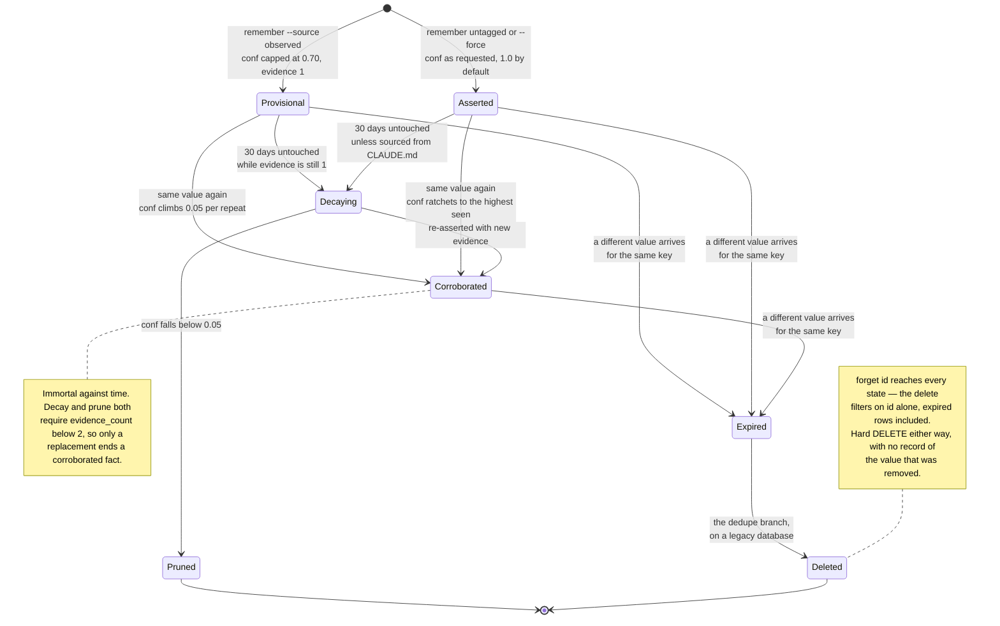
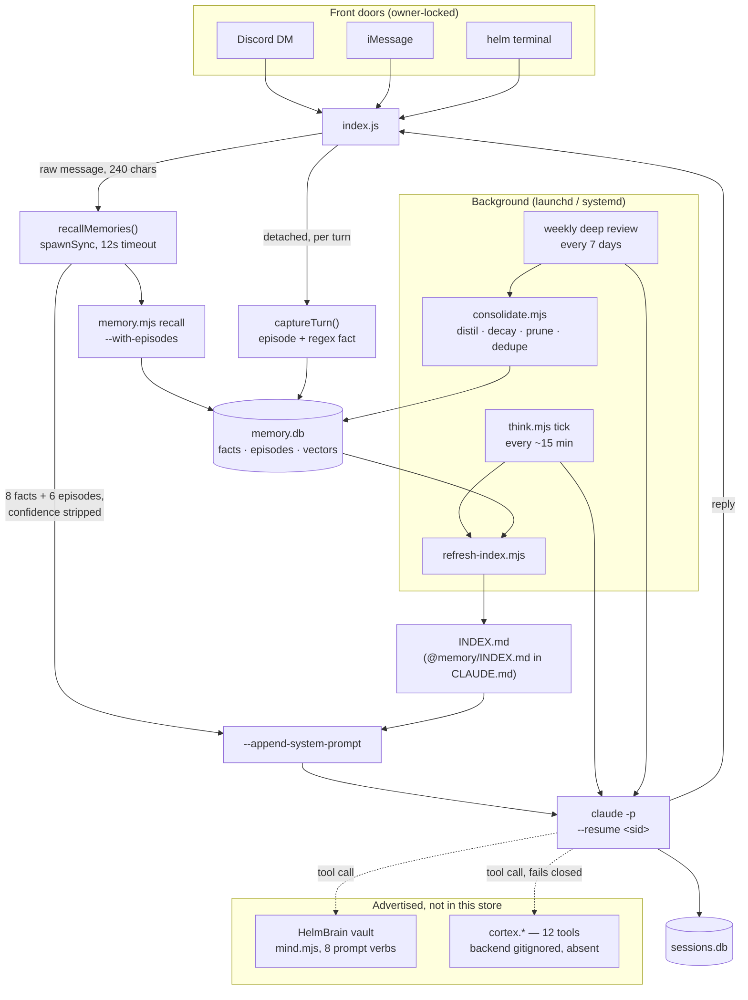

## 1. Executive Summary

Helm is a **single-owner personal agent** that runs on the owner's own machine.
Messages arrive from Discord, iMessage or a terminal client; `index.js` shells
out to the `claude` CLI with the workspace and the home directory mounted; the
agent acts and reports back. Memory is not a product surface here — it is one
SQLite file, five columns of bookkeeping bolted onto it, and a background process
that reflects every fifteen minutes.

The design worth reading the code for is the **evidence gate** in
`workspace/memory/memory.mjs:87-162`. A write tagged `--source observed` — the
tag the background reflection loop uses when it thinks it has noticed something
about the owner — is capped at `PROVISIONAL_CAP = 0.7` no matter what confidence
the caller asked for. It can only rise by 0.05 per *independent repeat*, tracked
in `evidence_count`. A first observation is therefore structurally incapable of
being stored as certain. That is the [evidence before
belief](../../patterns/evidence-before-belief/) pattern implemented in about
fifteen lines of SQL and arithmetic, in a project whose whole memory layer is
401 lines.

The apparatus around it is unusually complete for its size. Supersession expires
the old row and keeps it (`expired_at`), so `history <key>` returns the chain.
Decay in `consolidate.mjs` applies only to single-evidence facts, exempts rows
sourced from `CLAUDE.md`, and is *slowed by retrieval* — `log1p(access_count)`
is subtracted from the number of stale weeks, so a fact the agent keeps reaching
for holds its confidence. Recall fuses BM25 with a genuinely local MiniLM
embedding by reciprocal rank, and degrades to TF-IDF cosine and then to
keyword-only without saying so. Retrieval quality is anchored by behavioural
tests that assert *ranking*, not just round-trips: `smoke.mjs:892` asserts a
high-confidence fact outranks a low-confidence match, `smoke.mjs:1253` asserts
BM25 term-frequency ordering.

**And then the number is thrown away at the point of use.** `recallMemories`
(`index.js:490-510`) formats the top eight facts as `- (kind) key: value` and
prefixes them with `MEMORY — use these, never contradict them`. No confidence,
no evidence count, no source, no id. A preference the loop guessed once from a
transcript and a fact the owner stated directly reach the model as the same kind
of sentence, under an instruction not to contradict either. The one channel that
does carry the number — the generated `INDEX.md`, imported at `CLAUDE.md:15` —
prints `_(conf 0.62)_` for `preference` rows and omits it for every other kind.
The system spends real effort deciding how much to believe each fact and then
declines to tell the consumer.

The second weakness is structural rather than epistemic. Active rows are
identified by the predicate `expired_at IS NULL`, enforced by a *partial* unique
index (`memory.mjs:54-64`), and every reader has to remember it. Three do not:
`getAutonomyMode` (`index.js:244`) reads the agent's own autonomy setting without
the filter and will return the stale pre-supersession value; the distillation
lookup in `consolidate.mjs:74` can write a distilled value onto a dead row; the
dedupe pass at `consolidate.mjs:146` selects candidate rows without the filter,
so the branch that fires can delete superseded history and sum retracted
evidence onto the survivor. A soft-delete predicate with no view and no
accessor is a design that only works while every author remembers it.

Where it is weakest overall: three memory surfaces are advertised to the model
and only one of them is in the repository. `mind` drives a Markdown vault whose
"AI-first note format" — frontmatter `confidence`, `recency`, a
`## Contradictions` section with `open | resolved` status — is defined entirely
in a prompt (`workspace/mind/MIND.md`) and parsed by no code. Twelve `cortex.*`
tools are registered as "the 5-layer memory stack", and their backend is
gitignored and absent.

## 2. Mental Model

A memory is a **`(kind, key)` slot holding one current value**. `kind` is an
open string used by convention — `preference`, `learned`, `note`, `goal`,
`profile`, `exam`, `fact` — not an enum in code. The key is meant to be stable
and short; the CLAUDE.md guidance and the think prompt both tell the agent to
reuse a key rather than mint one.

Alongside the slots is an **episode log**: one row of free text per notable turn,
with a channel tag and a timestamp. Episodes are the raw stream; facts are what
survives it.

Confidence is a float, not a state. But there are effectively two grades,
distinguished by who wrote the row and how it was tagged:



Decay is `conf *= 0.9` per stale week, with `log1p(access_count)` subtracted from
the week count first, so retrieval slows the fall without ever reversing it.

Three properties of this machine matter.

**Corroboration is the only thing that raises belief.** Nothing in the system
verifies a fact against the world. A repeat observation of the same value is the
entire evidence model, and it is deliberately weak: `0.05` per repeat means six
independent sightings to reach 1.0 from the cap.

**Death is asymmetric.** Being *replaced* is recoverable — the row stays and
`history` shows it. Being *forgotten* or *pruned* is not: both are
`DELETE FROM facts`, and nothing records that the value ever existed. So the
system remembers what it changed its mind about but not what it discarded, and
the next reflection tick is free to re-derive a pruned fact from the same
episodes that produced it.

**Who moves memory between states.** Almost everything is agent-controlled but
not owner-visible. The owner writes memory only by talking — either the hot-path
regex catches an explicit "remember that …", or the reflection loop reads the
transcript later and decides for itself. There is no review surface: `unsure
--threshold 0.7` lists the weakly-evidenced preferences, and the weekly prompt
tells the agent to re-assert the ones it found evidence for, but no code takes an
owner verdict and writes it back. The nearest thing to human adjudication is the
owner saying something different next time and hoping the loop notices.

## 3. Architecture

Helm is a set of Node processes on one machine, plus the `claude` CLI as the
reasoning engine. There is no server, no container, no vector service.

- **`index.js`** (1,241 lines) — the Discord brain. Owner-locked to `OWNER_ID`,
  holds the session, assembles the prompt, spawns `claude -p` with
  `--append-system-prompt`, `--add-dir WORKSPACE`, `--add-dir ~`.
  `imessage.js` and `cli.js` are alternative front doors onto the same session.
- **`workspace/memory/`** — the store. `memory.mjs` is the CLI and the schema;
  `embed.mjs` the embedding cache; `consolidate.mjs` the nightly hygiene pass;
  `refresh-index.mjs` the prompt-facing Markdown projection; `migrate.mjs` a
  one-shot CLAUDE.md importer.
- **`workspace/think/think.mjs`** — background cognition as a long-lived process
  under launchd/systemd (`com.helm.think`), ticking every
  `THINK_INTERVAL_MIN` (default 15).
- **`workspace/tools/`** — a JSON registry of 140 shell-out tools, two of which
  are `memory.remember` and `memory.recall`.
- **`workspace/sessions.mjs`** — a second SQLite file mapping the single key
  `'owner'` to a Claude Code session id for `--resume`.



### Deployment and ergonomics

This is the cheapest memory deployment in the atlas that still has an epistemic
model. What has to be running: **nothing**. The store is a SQLite file opened
synchronously by whichever script needs it, through Node's built-in
`node:sqlite` — hence the hard `engines: node >=22.5.0`. There is no separate
dependency for the database at all.

Fully local and offline, with one graceful degradation: semantic recall wants
`Xenova/all-MiniLM-L6-v2` under `~/.helm-models`, and `embed.mjs:48-51` sets
`allowRemoteModels = false`, so it will *never* fetch the model mid-flight. If
the cache is cold, `ensurePipelineLoaded()` returns false and retrieval falls
back to TF-IDF cosine. `node workspace/memory/embed.mjs download` is the
explicit opt-in that populates it. Refusing to download at query time is the
right call and rarer than it should be.

No API key is required to store anything — memory is entirely local arithmetic.
A key is required to *think*, and even that is optional: `AUTH_MODE=custom`
points the engine at Ollama.

The store is human-readable and repairable by hand: it is one SQLite file with
three small tables, a `dump` verb that emits JSON, and a generated `INDEX.md` in
Markdown. Recovery from a bad memory is `sqlite3` or `memory.mjs forget <id>`.
Against that: `*.db` is gitignored, so there is no committed fixture, and every
schema change is expressed as a `try { ALTER TABLE … } catch {}` executed on
every process start (`memory.mjs:41-49`, repeated in `consolidate.mjs:29-35` and
`migrate.mjs:29-33`). It works, it is idempotent, and it means the real schema
is the union of five files rather than anything declared in one place.

## 4. Essential Implementation Paths

**Capture — hot path.** `index.js:572-583` `captureTurn(userText, reply, channel)`
runs after every reply. It spawns two *detached, unwaited* children: an
`episode add "<user, 160 chars> → <reply, 160 chars>"`, and — only if the user
text matches
`\b(?:remember(?:\s+that)?|note\s+that|for\s+the\s+record|fyi[:,]?)\s+(.{4,200})` —
a `remember learned note-<base36 timestamp> "<captured span>" --source observed
--confidence 0.8`. This is the whole zero-LLM write path.

**Capture — gateway backfill.** `index.js:520` `ingestEpisodes()` bulk-inserts
text as episodes, deduped against the last 2,000 summaries.
`catchUpDiscord()` (`index.js:537`) uses it on reconnect to absorb messages
Discord did not replay while the bot was down, marks the last seen id in
`workspace/.discord-last-seen`, and deliberately does not act on the backlog —
it ingests and sends one notice. `scanDiscordHistory()` pages up to 2,000
messages on demand.

**Extraction / consolidation.** Two passes, one LLM and one not.

The LLM pass is the weekly deep review (`think.mjs:54-82`, `WEEKLY_PROMPT`): read
`dump`, the last 50 episodes, and `unsure --threshold 0.7`; write 1-3 summary
episodes; turn themes appearing in 2+ recent episodes into `learned` facts;
re-assert low-confidence preferences that got new evidence. It is instruction
only — no schema, no validator, no retry.

The deterministic pass is `consolidate.mjs`, four stages:

1. **Distil** (lines 44-92) — count word stems across episodes in the window;
   any stem in ≥3 distinct episodes becomes a `learned` fact whose value is
   literally `mentioned in N episodes (last: "…")`, at
   `min(0.9, 0.4 + 0.1·N)`.
2. **Decay** (lines 94-123) — `evidence_count < 2` and `last_seen` older than
   `--decay-days` (30) and not `source='CLAUDE.md'`:
   `conf ·= 0.9^max(0, (weeksStale+1) − log1p(access_count))`.
3. **Prune** (lines 125-134) — `DELETE` where `confidence < 0.05` and
   `evidence_count < 2`.
4. **Dedupe** (lines 136-158) — merge multiple active rows per `(kind, key)`,
   summing `evidence_count` onto the highest-confidence survivor.

**Retrieval.** `memory.mjs:164-326`, one function, no abstraction. Detailed in
§6.

**Context assembly.** Two channels, and they behave differently:

- *Static*: `workspace/CLAUDE.md:15` is the line `@memory/INDEX.md`. Claude Code
  resolves that import into the base prompt on every turn, so the whole active
  fact set — every `preference` with its confidence, up to 30 rows per other
  kind, and the last 12 episodes — is present by default.
  `refresh-index.mjs` regenerates it after every think tick, writing to a
  `.tmp` and `renameSync`-ing over the target so a reader never sees a partial
  file.
- *Dynamic*: `index.js:601` appends `recallMemories(prompt)` to
  `buildPersona(mode)` in `--append-system-prompt`. The query is the raw user
  message, whitespace-collapsed, first 240 characters. `spawnSync` with a 12
  second timeout — the comment explains the number is sized for the first-call
  MiniLM load. Facts whose `source` matches `/^(CLAUDE|helm)\.md$/i` are dropped
  as already-present persona text; eight facts and six episodes survive,
  truncated to 80/180/200 characters and wrapped in
  `MEMORY — use these, never contradict them; don't recite them unless asked:`.
  Every failure path returns `''`.

**Update / delete / forget / conflict.** `remember` with a different value for a
live `(kind, key)` is the conflict path (`memory.mjs:120-152`): stamp
`expired_at` on the old row, insert the new one with `evidence_count` reset to 1,
and write a `fact superseded: <kind>/<key>` episode on channel `memory`. That
episode is gated twice — skipped entirely for keys starting with `__smoke`, and
collapsed to one row per six hours per key by *updating the existing episode's
timestamp* rather than inserting. `forget <id>` hard-deletes the fact and its
cached vector. `history <key>` is the only reader that intentionally omits the
`expired_at` filter.

**Schema.** `memory.mjs:13-64`. Base tables `facts`, `episodes`, `links`; five
columns added by guarded `ALTER`; the partial unique index
`facts_kind_key_uniq ON facts(kind, key) WHERE expired_at IS NULL`, with a
self-healing check that drops and recreates it if an earlier non-partial version
is found (lines 54-64). `vectors` and `episode_vectors` are created lazily by
`embed.mjs` on first use, keyed by fact/episode id, with the vector stored as a
JSON string. `links` is created and never written or read by any file in the
repository.

**Background worker.** `think.mjs`. Lock file with stale-PID reclaim via
`process.kill(pid, 0)` (lines 148-160); skip if the self-upgrade lock is held;
skip between 00:00 and 05:00; `MAX_TICKS` 500 or eight days wall-clock then
`process.exit(0)` and let the service manager restart it. After the tick it
scores the thought with `computeInterruptScore` (lines 93-125) —
`0.7·urgency + 0.3·relevance`, where urgency is keyword hits over three and
relevance is the mean confidence of the top three `--keyword-only` recall hits,
plus 0.2 if a `kind=goal` value appears in the text — and DMs the owner above
0.65. The weekly mark is stamped only when the engine exited zero and unsignalled
(lines 211-215), so a timed-out review is retried rather than silently skipped.

**Tool surface.** `workspace/tools/registry.json` declares `memory.remember`
(`kind`, `key`, `value`, `confidence`) and `memory.recall` (`query`, `limit`).
The wrappers in `workspace/tools/impl/` are thin `spawnSync` shims. Notably
`memory.remember.mjs` never passes `--source`, so a tool-mediated write is never
`observed` and never hits the provisional cap.

**Tests.** `workspace/tests/smoke.mjs`, 2,317 lines, 88 labelled cases, of which
about nineteen exercise memory. Covered in §10.

## 5. Memory Data Model

```sql
facts(id, kind, key, value, source, confidence,
      created, updated,                    -- base
      evidence_count, last_seen,           -- added by ALTER
      valid_from, expired_at, access_count)
episodes(id, ts, channel, summary, raw_ref)
links(from_id, to_id, kind)                -- created, never used
vectors(fact_id, vector TEXT, model, created)
episode_vectors(episode_id, vector TEXT, created)
```

**Scoping: none on the fact table.** There is no user, project, session or agent
column. The boundary is the process: `index.js` refuses anything but `OWNER_ID`,
and `sessions.mjs` hardcodes the key `'owner'` with the comment "this bot is
owner-locked". Episodes carry a `channel` (`discord`, `chat`, `memory`,
`weekly-review`), and no read path ever filters on it — the episode arm of
recall scores the last 500 rows regardless of origin. A scope that is stored and
never applied is exactly the case the atlas withholds `scope_enforced` for.

**Provenance** is one free-text `source` column: `observed`, `consolidate`,
`CLAUDE.md`, or null. It carries real weight for two mechanisms —
`source='observed'` triggers the confidence cap, `source='CLAUDE.md'` exempts a
row from decay and prune — and it is unvalidated and self-asserted by the caller.
There is no link from a fact back to the episodes that produced it; the `links`
table that could express it is dead. So a distilled `learned` fact says
"mentioned in 5 episodes" without being able to name one.

**Temporal fields.** Four: `created`, `updated`, `last_seen`, `valid_from`, plus
the nullable `expired_at`. This is the near-miss on bi-temporality. The columns
are shaped for it, `history` orders by `valid_from DESC`, and the ambition is
legible. But `valid_from` is only ever written as `unixepoch()` at insert time
(`memory.mjs:126-128`, `156-158`) or backfilled to `created` (line 49). No caller
can express "this became true last March"; validity time is record time under a
different name. `expired_at` is likewise the moment of *recording* the
replacement.

There is also a live correctness hazard in `last_seen`. Decay advances it by
`weeksStale · 7 · 86400` (`consolidate.mjs:108-110`) purely so the same decay
step is not re-applied on the next nightly run. It is an effective idempotence
trick and it destroys the column's stated meaning: after a decay pass,
`last_seen` no longer records when the fact was last seen. `unsure` orders by
`last_seen ASC`, so the ordering of the weakly-evidenced list is partly a
function of how many decay passes have run.

**Versioning and correction.** Supersession chains are real and readable, keyed
on `(kind, key)`. What is absent is any record keyed on the *value*: nothing
prevents the next distillation or reflection tick from re-asserting a value that
was superseded, forgotten or pruned, because there is nothing to consult. No
TTL, no pinning beyond the `CLAUDE.md` source exemption, no contradiction
representation — a fact cannot disagree with another fact, only replace it.

**Separation of memory types** is by `kind` convention only, enforced nowhere.
Episodic (`episodes`) and semantic (`facts`) are genuinely separate tables with
separate retrieval arms and separate vector caches, which is the one clean
separation in the model.

The **HelmBrain vault** is a second, disjoint data model: PARA directories of
Markdown under `~/HelmBrain`, with a frontmatter schema (`type`, `tags`,
`sources`, `last_updated`, `confidence: high|medium|low`, `recency`) and a
`## Contradictions` section carrying `status: open | resolved`. It is defined in
`workspace/mind/MIND.md` and read by no code — `grep` for `last_updated` or
`Contradictions` outside that protocol file and the prompt strings that quote it
returns nothing. The vault's trust model is a request to an LLM, not a
structure. The two stores are kept in sync by instruction: the think prompt tells
the agent to persist a fact *and* mirror it into `02 People/About Me.md`
(`think.mjs:45-47`). Nothing reconciles them, and nothing detects divergence.

## 6. Retrieval Mechanics

One function, `memory.mjs:164-326`, and it is more sophisticated than the file
size suggests.

**Candidate set.** `SELECT * FROM facts WHERE expired_at IS NULL ORDER BY
updated DESC, confidence DESC LIMIT 500`. Everything downstream — document
frequency, average document length, BM25 idf, both rank lists — is computed in
JavaScript over those 500 rows on every call. This is the ceiling on the whole
design: past 500 active facts, retrieval stops being able to see the older ones
*at all*, and the window is ordered by recency rather than relevance, so the
facts that fall out are the ones that have not been touched lately — precisely
the long-lived preferences the evidence gate worked hardest to establish. There
is no warning and no test at that boundary.

**Query processing.** Lowercase, `[a-z0-9]+` tokens longer than one character, a
26-word stop list, and a three-rule suffix stemmer (`ies→y`, strip `ing|ed|s`).
An empty query after stopping returns the most recently updated rows.

**Two arms, fused by rank.**

- *Lexical*: BM25 with `k1=1.5`, `b=0.75`, computed by hand (lines 197-213).
- *Semantic*: MiniLM-L6-v2 mean-pooled and normalized via
  `@xenova/transformers`, per-fact vectors cached in `vectors` as JSON text and
  compared by cosine in JS. If the model is not in the local cache, the arm is
  TF-IDF cosine over the same 500 documents instead (lines 215-243). If the
  import or the pipeline throws, `catch {}` keeps the TF-IDF scores.
- *Fusion*: `1/(60 + rank_bm25) + 1/(60 + rank_cos)` — reciprocal rank fusion
  with the conventional k=60 — then multiplied by `confWeight = 0.7 + 0.3·conf`
  and by `keyMatchBoost = 1.3` when a query stem appears in the fact's `key`.
  Survivors need `_bm25 > 0 || _cos > 0.01`.

RRF is the right choice here for the reason it usually is: the two arms produce
incomparable scores, and Helm cannot calibrate them because it has no relevance
data. Multiplying the fused score by a confidence weight rather than adding it
means a 0.05-confidence fact is penalized by 0.715× rather than excluded — a
sensible refusal to let belief fully override relevance.

**The episode arm** (`--with-episodes`, lines 299-322) is a parallel and
deliberately different scorer over the last 500 episodes:
`(cos + 0.12·bm25) · (0.6 + 0.4·recency)` with `recency = exp(-Δt / 30 days)`,
gated at `cos > 0.18 || bm > 0`, six results by default. Facts get no recency
term at all; episodes get an explicit 30-day half-life. That asymmetry is
correct — a preference should not fade from the ranking because it is old — and
it is the kind of distinction most systems this size do not draw.

**A write on the read path.** Line 295: every returned fact gets
`access_count = access_count + 1`. This is what feeds the access-slowed decay,
so it earns its place, but it means `recall` is not a read-only operation, the
registry's `"side_effects": "none"` declaration for `memory.recall` is wrong, and
`computeInterruptScore` — which calls recall on every think tick to score its own
thought — reinforces facts as a side effect of deciding whether to interrupt the
owner.

**Failure modes.** Over-recall is bounded at eight facts on the hot path. The
real exposures are the 500-row window above; silent degradation from MiniLM to
TF-IDF to nothing (three quality tiers, one output shape, no signal to the
caller); the 240-character query truncation, which for a long message searches
only its opening; and distillation artefacts polluting results — a `learned` row
reading `mentioned in 4 episodes (last: "…")` is a high-BM25 match for common
vocabulary and carries no information.

## 7. Write Mechanics

Writes are **one process per fact**. Every path shells out to
`node workspace/memory/memory.mjs remember …`, which opens the database, runs
the guarded `ALTER`s, does its work, prints JSON, and closes. There is no
connection pool, no transaction spanning more than one statement, and no write
queue — `PRAGMA busy_timeout = 5000` is the entire concurrency strategy, against
a background think tick, a consolidation pass, detached per-turn captures and
the dashboard all opening the same file.

**Who writes:**

| Path | Trigger | Tag | Blocking? |
| --- | --- | --- | --- |
| `captureTurn` episode | every turn | — | no, detached |
| `captureTurn` regex fact | "remember that …" in the turn | `observed`, 0.8 | no, detached |
| `ingestEpisodes` | Discord reconnect / manual scan | — | in-process |
| think tick | every ~15 min | `observed`, 0.6 | separate process |
| weekly review | every 7 days | LLM's choice | separate process |
| `consolidate` distil | after weekly review | `consolidate` | separate process |
| `memory.remember` tool | agent decides | **never** `observed` | inside the turn |
| `migrate.mjs` | first run | `CLAUDE.md`, 1.0 | one-shot |

The gate is opt-in by the writer, and that is its weak point. `PROVISIONAL_CAP`
only applies when the caller passes `--source observed`. The think prompt does.
The hot-path regex does. The registry tool `memory.remember` does not
(`workspace/tools/impl/memory.remember.mjs:20-22` builds argv without it), so
whenever the model chooses to save something through its tool surface, the value
lands at the requested confidence — default `1.0` — and is exempt from decay
because `evidence_count` is 1 but confidence is at ceiling. The mechanism that
makes the design interesting can be bypassed by the least deliberate writer in
the system.

**Extraction** is a prompt, not a component. There is no structured extractor,
no JSON schema, no output validator anywhere on the fact-write path. The weekly
review's instruction to write `learned` facts for themes in "2+ recent episodes"
is checked by nobody. The deterministic distiller in `consolidate.mjs` is the
counterweight, and what it produces is **word frequency wearing the vocabulary
of learning**: a stem appearing in three episodes becomes a fact whose value is
the sentence `mentioned in 3 episodes`. It has no subject, predicate or claim.
It is retrievable, weighted at up to 0.9 confidence, and injectable.

The stop list guarding that distiller is the most informative twelve lines in the
repository (`consolidate.mjs:44-53`). Past the ordinary English stopwords sit
`fact`, `facts`, `note`, `notes`, `supersed`, `superseded`, `supersede`,
`superseding`, `episode`, `episodes`, `tick`, `think`, `memory`, `smoke`,
`dump`, `index`, `workspace`, `learned`, `pending`, `loader`. That is the
system's own bookkeeping vocabulary, and it is there because the distiller
learned facts about its own mechanism from its own supersession log. The
`QUEUE.md` entry dated 1 June 2026 states the cleanup: 42 smoke episodes, 85
duplicate supersedes and 24 polluted `learned` rows deleted, "INDEX.md is now
legible again". Any system that logs its own mutations into the same store it
consolidates from will meet this, and most will not notice.

**Deduplication** happens at three levels: the partial unique index makes two
live rows per `(kind, key)` impossible; `ingestEpisodes` checks new summaries
against the last 2,000; the supersede episode collapses to one row per key per
six hours.

**The `note-<timestamp>` leak.** The hot-path regex mints its key as
`'note-' + Date.now().toString(36)` (`index.js:578`). Every captured note is
therefore a *new* `(kind, key)` pair, which means the uniqueness index never
applies, supersession can never fire, and saying "remember that I prefer X"
twice with different values leaves both facts live and mutually contradictory at
confidence 0.8. These rows also arrive with `evidence_count = 1`, so they are
decay-eligible after 30 days — the one thing the owner said explicitly is on the
fastest path to being pruned, and pruning leaves no record.

### Operational cost

**The write path never blocks the agent.** No LLM call, no embedding, no
network — a fact write is a spawn, a few SQL statements and an exit. The
per-turn captures are `detached` and `unref`'d, so the reply is not waiting on
them.

**Retrievable immediately.** There is no indexing lag: `remember` commits and
the next `recall` sees the row. The embedding, if any, is computed lazily on
first retrieval (`getOrComputeVector`) and cached, so the first recall touching a
new fact pays for its vector and later ones do not. The lag that does exist is
elsewhere — a fact the owner reveals in conversation is not stored until the
think tick reads the transcript, up to fifteen minutes later, and is not
distilled or corroborated until the weekly pass.

**The read path does block.** `recallMemories` is a synchronous `spawnSync` on
the critical path of every turn, with a 12-second ceiling, and a cold MiniLM load
is the reason the ceiling is that high. Every message the owner sends pays a
process spawn, a 500-row scan, BM25 over the corpus, up to 500 cosine
comparisons, and a second pass for episodes.

**Background cost scales with the corpus, not the day.** `consolidate.mjs` reads
every episode in the window and every decay-candidate fact; `refresh-index.mjs`
rewrites the whole index from all active facts after *every* tick — roughly 96
times a day. Both are pure SQL and arithmetic with no token cost, which is the
saving grace: the nightly rewrite that would be a token bill in an
LLM-consolidating system is free here. The LLM cost is bounded differently — one
cheap `sonnet` call per 15 minutes, one deeper call per week.

**Prompt-prefix caching is invalidated on every turn, by construction.**
`INDEX.md` arrives through `CLAUDE.md`'s import and is stable between think
ticks. But `--append-system-prompt` carries `buildPersona(mode) +
recallMemories(prompt)`, and the recall block is a function of the current
message, so the system prompt differs every turn. The cheaper arrangement — the
stable index in the prefix, the query-specific memories in the user turn — is
one line away and the static channel already demonstrates it.

## 8. Agent Integration

The agent is **Claude Code driven as a subprocess**. `index.js` builds
`claude -p --output-format stream-json --verbose --model <m> --permission-mode
<pm> --append-system-prompt <persona+memory> --add-dir workspace --add-dir ~
--strict-mcp-config --mcp-config <json>` and, when a session id exists,
`--resume <sid>`. Memory reaches the model three ways, in descending reliability:

1. **Automatic static injection** — `@memory/INDEX.md` in `CLAUDE.md`. Not
   optional, not query-dependent, includes confidence for preferences.
2. **Automatic dynamic injection** — `recallMemories`, eight facts and six
   episodes, confidence stripped, under a "never contradict" instruction.
3. **Tool-mediated** — `memory.recall` / `memory.remember` through the registry,
   plus the CLI verbs documented in `CLAUDE.md:130-150` which the agent can call
   directly through Bash since the workspace is mounted.

The model has **broad agency and no gate**. `PERMISSION_MODE` defaults to
`bypassPermissions` in the think and mind paths, the workspace is `--add-dir`'d,
and the memory CLI is a shell command like any other. So the agent may write any
`kind`, any confidence, `--force` past the provisional cap, or
`forget <id>` — nothing mediates. This is the [governed write
gateway](../../patterns/governed-write-gateway/) pattern's exact inverse: one
store, many writers, no arbiter.

**Session lifecycle** is a single thread. `sessions.mjs` maps `'owner'` to one
Claude Code session id shared by Discord, iMessage and the terminal — a genuinely
nice property the README sells as "one brain, one memory, one conversation" and
which the code actually delivers. The cost is that there is no session scope in
memory either, so nothing distinguishes what was said where.

**Compaction handling is absent in practice.** `workspace/sessions/compact.mjs`
implements `maybeCompact` — estimate tokens at 4 characters each, at 60% of a
100k budget call `haiku` for a five-field JSON anchor (`intent`, `changes_made`,
`decisions`, `next_steps`, `constraints`), write `session_anchor.json`. It is
well-formed, tested (`smoke.mjs:1612`), and **called by nothing in the running
agent**: `swarm.mjs` imports only `HANDOFF_SCHEMA` and `pruneFileReads`, and no
other file calls `maybeCompact`. The live path relies entirely on `--resume` and
whatever Claude Code does internally at its own context limit. Whatever the host
drops at that boundary is not mirrored into the fact store, and the anchor that
was built to survive the boundary is only reachable by hand.

**Adapting this for another agent** would be easy in the parts that matter and
irrelevant in the rest. `workspace/memory/` is four self-contained scripts with a
JSON-on-stdout CLI and no dependency on Helm beyond a path — genuinely portable,
and the cleanest way to lift the evidence gate into another system. Everything
around it is welded to Claude Code's flags.

## 9. Reliability, Safety, and Trust

**Provenance is a self-asserted string** with real consequences and no
verification. `--source observed` invites the cap; `source='CLAUDE.md'` grants
permanent immunity from decay and prune. Any writer can claim either. Since the
model can shell out to the CLI directly, a fact can be made undecayable by
typing the right word.

**The store is an injection surface, and the framing makes it worse.** Facts
enter from: the owner's messages, Discord history scans, the transcript as read
by a reflection loop, and word-frequency distillation over episodes that
themselves contain arbitrary text. There is no sanitization of any of it — no
counterpart to the envelope-stripping other local agents in this atlas were
forced to build. Those facts are then injected under `use these, never
contradict them`. Content that reaches an episode — a web page the agent read
aloud, a Discord message, a filename — can become a `learned` fact with a
confidence up to 0.9 and be presented to the next turn as something not to be
contradicted. The mitigation is real but incidental: the gateway is locked to
one owner, so the attack surface is whatever that owner's machine and inbox
touch.

**Uncertainty is representable and then discarded.** This is the central finding.
`confidence`, `evidence_count`, `source` and `access_count` are all computed
carefully, and the hot-path injection format (`index.js:504`) emits
`- (kind) key: value`. A 0.7 provisional guess and a 1.0 owner statement are
typographically identical in the prompt. Fixing it is a template change; the
data is already there.

**Three readers ignore the expiry predicate.** Active rows are defined by
`expired_at IS NULL`, and the partial index enforces it *for writes* only —
`SELECT`s must remember it themselves:

- `index.js:244` `getAutonomyMode()` — `SELECT value FROM facts WHERE kind =
  'preference' AND key = 'helm.autonomy_mode'` with no expiry filter, no
  `ORDER BY`, and `.get()`. Because SQLite cannot use the partial index for a
  query that does not imply its predicate, this scans and returns the *first*
  matching row by rowid — the oldest, which after any mode change is an expired
  one. `setAutonomyMode` writes through `remember`, which supersedes. So the
  agent's own autonomy setting is read back stale. The corroborating detail is in
  the project's own changelog: the `QUEUE.md` entry dated 1 June 2026 reports
  cleaning up "82 `helm.autonomy_mode` duplicates" — the same key superseded 82
  times. Consistent with a setting that never appears to take effect and gets
  re-set; not proof of it.
- `consolidate.mjs:74` — the distiller's lookup for an existing `learned` fact
  omits the filter, so it can find and `UPDATE` an expired row, writing the
  distilled value onto a dead record while the live one goes untouched.
- `consolidate.mjs:146` — dedupe selects the group's rows without the filter,
  though the group *membership* query (line 143) applies it. If that branch
  fires it deletes every row but one, including superseded history, and sums
  retracted evidence onto the survivor; if an expired row happens to hold the
  highest confidence it is kept and the live row deleted. The partial unique
  index makes duplicate live rows impossible going forward, so this branch
  should only be reachable on a legacy database — a conditional bug, in the
  cleanup path built for exactly the databases that can still trigger it.
- The dashboard (`workspace/dashboard/server.mjs:58-65`) counts and lists recent
  facts unfiltered, so the operator's view of the store overstates it and can
  show retracted values as current.

**Concurrency.** Four writer classes on one SQLite file with a 5-second busy
timeout and no WAL pragma in the code. Each `remember` is read-then-write across
separate statements with no transaction, so two concurrent same-key writes can
interleave; the partial unique index is what turns the loser into an error rather
than a duplicate, which is a good backstop reached by accident. `refresh-index`
is properly atomic. `think.mjs` locks against itself and against self-upgrade,
which is the collision that would actually hurt.

**Data loss.** Two hard deletes with no record: `forget <id>` and the prune
sweep. Prune is the more concerning because it is automatic, silent, and
targets exactly the never-corroborated rows the hot-path regex creates for
explicit owner statements. No backup or sync of `memory.db` exists in the
repository; `*.db` is gitignored; recovery is whatever the owner's machine does.
The vault has no reconciliation with the fact store, so a divergence between
"what Helm knows" and "what the vault says Helm knows" is undetectable by
design.

**Privacy** is the strongest part of the safety story, and it is a matter of
architecture rather than mechanism: everything is local, the store is a file on
the owner's disk, `.gitignore` excludes `owner.md`, `memory.db`, conversations,
the vault key and the secrets vault, and the install refuses to publish them.
Deletion is genuine — `DELETE` means gone — which is the flip side of having no
tombstone.

## 10. Tests, Evals, and Benchmarks

`workspace/tests/smoke.mjs` is 2,317 lines and 88 labelled cases, with
`smoke-phase2.mjs` and `smoke-phase3.mjs` alongside. About nineteen cases touch
memory, and they are behavioural: they spawn the real CLI against the real
`memory.db`, assert on parsed JSON, and clean up by key — `__smoke`-prefixed for
the cases that must not pollute the episode log.

What is genuinely covered:

- **The evidence gate.** `smoke.mjs:285` — an `observed` first write is capped at
  0.7 and a repeat increments `evidence_count`. This is the mechanism the design
  rests on, and it is tested.
- **Ranking, not just recall.** `smoke.mjs:892` asserts a high-confidence fact
  outranks a low-confidence lexical match; `smoke.mjs:1253` asserts BM25 puts
  higher term frequency first. Retrieval *quality* assertions are rare at this
  scale.
- **Supersession end to end.** `smoke.mjs:1293` — the second value supersedes,
  the old row carries `expired_at`, `recall` returns exactly one active row and
  it is the new value, `history` returns both.
- **The schema invariant.** `smoke.mjs:535` asserts the unique index exists and
  blocks a direct duplicate `INSERT` — testing the constraint, not just the code
  path that respects it.
- **The read-path side effect.** `smoke.mjs:1339` asserts `access_count` is
  bumped for returned facts.
- **Its own noise gates.** `smoke.mjs:1953` asserts a `__smoke` supersede emits
  *zero* episodes; `smoke.mjs:1975` asserts four rapid supersedes of one key
  collapse to one episode row.
- **Graceful degradation.** `smoke.mjs:399` asserts `isModelAvailable` is safe
  with no model on disk.
- **A named regression.** `smoke.mjs:200`, labelled `BUG-2`, asserts a double
  `migrate.mjs` run does not grow the fact count.

**`negative_eval` is earned, narrowly.** The supersede case asserts that a value
still present in the database must *not* come back from `recall` — exactly one
active row, and failing with "recall returned old value" if the expired one
appears. The episode-gate cases assert that particular material must not be
written to the stream at all. That is a retrieval-exclusion assertion rather
than a boundary or default-off check, so the flag holds. It is two cases, not a
suite: nothing asserts that a *pruned* or *forgotten* value stays unreachable,
which is where this store is actually weak.

What is missing, in order of what I would want first: a case at the 500-row
recall boundary, since that limit silently caps the whole design; any assertion
that `getAutonomyMode` returns the value just written, which would have caught
the stale read; a test that the injected memory block carries enough for the
model to weight what it is given; a decay test over more than one pass, to pin
the `last_seen` mutation; and anything at all exercising the `mind` verbs against
a real vault — `smoke.mjs:1893` explicitly checks "no Claude run", so the entire
second brain is covered by "the verbs and the protocol file exist". The CORTEX
case (`smoke.mjs:2299`) asserts the client parses and the tools are registered,
which is all it can do, since the server is not in the repository.

**No eval harness, no retrieval benchmark, no committed benchmark artefacts.**
Nothing measures recall quality against a labelled set, and nothing in the
README claims otherwise — the comparison table on the marketing page claims
capabilities, not scores, which is the honest version of this gap.

**The self-audit is the most unusual artefact here.**
`workspace/repo-scan-report.md`, dated 2 June 2026, is a committed 25-issue bug
report: severity, `file:line`, a described failure mode, "reproduced empirically"
where it was, and a named fix that usually points at a correct pattern already
present elsewhere in the same repository. It is candid against its own
marketing — one Low entry is "Public marketing site still promises the removed
multi-machine fleet feature", filed as "user-facing false advertising".

It is also *closed*. Every issue I checked at this commit is fixed: the
`migrate.mjs` column guards are in place before the dedup `DELETE`
(`migrate.mjs:29-33`, High #1); `gui_task.mjs:115` uses `{ shell: true }`
(High #3); `swarm.mjs:39` wraps npm with `shell: IS_WIN` (High #4/#5);
`web.mjs:18` calls bare `curl` instead of `/usr/bin/curl` (High #2); the
fleet remnants are gone from `dashboard/server.mjs`, `cli.js` and
`docs/index.html` (Low #3/#4/#5); `compact.mjs:148` reads fd 0 (Medium #9). The
report's own architectural recommendation — "factor `resolveClaude()` into a
shared module imported by index.js, scheduler.mjs, think.mjs, self-upgrade.mjs
and plan.mjs" — became `workspace/lib/engine.mjs`, now imported by fourteen
modules. `workspace/upgrades/QUEUE.md` records the same loop in changelog form:
dated entries, each naming the smoke test that anchors it and, in the best ones,
the observed pollution that forced it. Finding your own bugs is common; writing
them down with reproduction steps and then closing them is not.

That maturity is uneven, and it is worth being precise about where it stops. It
covers process spawning, cross-platform correctness and mechanism hygiene
thoroughly. It has not reached the memory model's epistemics: the injection
template that discards confidence, the readers that forget the expiry predicate,
and the 500-row window are all invisible to a scan looking for crashes, because
none of them crash.

## 11. For Your Own Build

### Steal

- **Cap a first observation and make belief earn its way up.** Fifteen lines:
  a constant, a source tag, `min(requested, CAP + step·(evidence−1))`, and a
  counter. It gives you a defensible answer to "the model thought it noticed
  something" without a trust-state machine, and it is the cheapest correct thing
  in this report.
- **Let retrieval slow decay, and keep the two signals apart.** Subtracting
  `log1p(access_count)` from stale weeks means use extends life without ever
  raising confidence. Access is evidence of *relevance*; corroboration is
  evidence of *truth*; systems that add usage into a single score conflate them.
- **Give episodes a recency term and facts none.** A preference should not fall
  down the ranking for being old, and an event should. One ranking function for
  both is a decision, usually an unexamined one.
- **Refuse to download a model on the query path.** `allowRemoteModels = false`
  plus an explicit `download` subcommand converts a mysterious first-call stall
  into a documented setup step.
- **Test the constraint, not just the code that honours it.** Asserting the
  unique index rejects a raw `INSERT` covers every future writer, including the
  ones written by an LLM at 3am.
- **Write your bugs down where the code lives.** A committed report with
  `file:line`, a reproduction, and a pointer to the correct pattern already in
  the repo is worth more than an issue tracker, because the next agent reading
  the repository finds it.

### Avoid

- **Computing a confidence and not shipping it.** If the consumer of a memory is
  a language model, the number has to appear in the string. Otherwise the
  epistemics are an internal ceremony, and the phrasing you *do* ship — "never
  contradict them" — silently promotes every guess to a fact.
- **A soft-delete predicate with no accessor.** `WHERE expired_at IS NULL` in
  fourteen places is fourteen chances to forget it, and a partial unique index
  protects the writes while leaving every `SELECT` on its own. Expose a view or a
  single query function and make the raw table unreachable. This is the
  generalizable half of §9.
- **Minting a unique key per captured item.** A timestamped key defeats every
  uniqueness, supersession and update mechanism you built, and turns
  "remember X" said twice into two contradictory live rows.
- **Word frequency dressed as learning.** "Mentioned in N episodes" is a term
  count with no claim in it. If a distiller cannot produce a subject and a
  predicate, keep the count out of the store the model reads.
- **Logging your own mutations into the store you consolidate from.** The
  supersession log becomes input to the distiller, the distiller learns about
  supersession, and you discover it by reading a stop list. Tag mechanism events
  and exclude them at the source, and test that exclusion.
- **Mutating a timestamp to make a batch job idempotent.** Advancing `last_seen`
  so decay does not re-run is effective and destroys the column's meaning for
  every other reader. Keep a separate `last_decayed`.
- **Making a gate opt-in for writers.** A cap that applies only when the caller
  passes the right flag will be bypassed by the laziest call site — here, the
  tool the model itself reaches for.

### Fit

This is a design for **one person, one machine, a few thousand facts**, and
inside those bounds the economics are hard to beat: no service to run, no key
required to store anything, a store you can repair with `sqlite3`, and a genuine
epistemic model in 401 lines. If you are building a personal assistant that lives
on your own hardware and you want memory that is more than a JSON blob, this is a
better starting point than most of the larger systems here, and `workspace/memory/`
lifts out cleanly.

Walk away if any of three things is true. **If the store will exceed a few
hundred active facts**, the recency-ordered 500-row window means retrieval
quietly stops seeing your oldest and best-established memories, and fixing it
means replacing the retrieval function rather than tuning it. **If more than one
person or project shares the store**, there is no scope to add — the boundary is
the process, and `channel` demonstrates how a scope column behaves when nothing
applies it. **If deletion must be durable against re-derivation** — regulated
data, a user's explicit retraction — the hard-delete-with-no-record semantics
put you on the wrong side of the requirement, and a reflection loop reading the
same transcripts will re-derive what you removed.

There is also a maintenance judgement to make that is not about scale. This
codebase improves itself nightly, under a smoke gate, with an auto-revert. That
is why the audit findings are closed and why the noise gates exist. It is also
why the schema is the union of five files' `ALTER` statements and why three
readers drifted from the expiry predicate — a system that grows by accretion
under test pressure gets locally correct and globally inconsistent. Adopting the
memory module is straightforward. Adopting the development model that produced it
means accepting that the invariants live in the smoke tests, and that anything
the smoke tests cannot see is free to rot.

## 12. Open Questions

- **Does `getAutonomyMode` actually return the stale row?** The reasoning is
  from SQLite's partial-index eligibility rules and rowid scan order, and the 82
  duplicate supersessions in `QUEUE.md` are consistent with it. Confirming it
  needs a live database with a superseded `helm.autonomy_mode` and an
  `EXPLAIN QUERY PLAN`.
- **How large does the store get in practice?** Whether the 500-row window is a
  live problem or a latent one depends on the fact count after months of
  15-minute ticks, and `memory.db` is gitignored. The `INDEX.md` cap of 30 rows
  per kind suggests the author has seen kinds grow past 30.
- **Is MiniLM usually loaded?** The three retrieval quality tiers are
  indistinguishable from the output shape, and whether a typical install ever
  runs `embed.mjs download` is unknowable from the repository.
- **What is CORTEX?** Twelve registered tools, a documented five-layer memory
  stack, on-device embeddings, an HTTP API on port 7002 — and
  `workspace/cortex/` is gitignored. Whether it is a prototype, a separate
  product, or abandoned changes how to read the memory architecture, since the
  vault and the fact store are described in `CLAUDE.md` as deliberately distinct
  from it.
- **Does the vault stay coherent with the fact store?** Both are written by
  prompt instruction with no reconciliation. Only running the nightly
  `com.helm.mind` pass against a real vault would show whether "the vault
  rewrites itself" converges or accumulates contradictory notes.
- **What did the nightly self-upgrade do to the memory layer that the smoke tests
  did not catch?** The QUEUE records what was intended and anchored. Whether
  auto-reverted attempts left partial schema changes would need the git history
  of `workspace/memory/` read commit by commit.

## Appendix: File Index

**Storage and schema**

- `workspace/memory/memory.mjs:13-64` — `facts`, `episodes`, `links`; guarded
  `ALTER`s; the self-healing partial unique index.
- `workspace/memory/embed.mjs:14-23`, `104-110` — `vectors` and
  `episode_vectors`, created lazily.
- `workspace/sessions.mjs` — `sessions(key, session_id, adapter, updated)`, key
  always `'owner'`.

**Write path**

- `workspace/memory/memory.mjs:87-162` — `remember`: the provisional cap,
  evidence ratchet, supersession, and the gated supersede episode.
- `workspace/memory/memory.mjs:341-349` — `forget`, hard delete plus vector.
- `index.js:572-583` — `captureTurn`: per-turn episode and the regex fact.
- `index.js:520`, `537`, `559` — `ingestEpisodes`, `catchUpDiscord`,
  `scanDiscordHistory`.
- `workspace/memory/migrate.mjs` — CLAUDE.md bullets to `profile`/`exam`/`note`
  facts at confidence 1.0, updated in place with no supersession.
- `workspace/tools/impl/memory.remember.mjs` — the wrapper that omits
  `--source`.

**Retrieval path**

- `workspace/memory/memory.mjs:164-326` — the 500-row window, BM25, TF-IDF and
  MiniLM arms, RRF fusion, confidence weight, key boost, `access_count` bump,
  and the episode scorer.
- `workspace/memory/embed.mjs:44-101` — pipeline load with remote models
  disabled, `getOrComputeVector` cache.
- `workspace/memory/memory.mjs:328-339` — `unsure`.
- `workspace/memory/memory.mjs:369-379` — `history`, the intentional
  unfiltered read.

**Context assembly**

- `index.js:490-510` — `recallMemories`, the injection template that drops
  confidence.
- `index.js:595-607` — prompt assembly, `--append-system-prompt`, `--resume`.
- `workspace/CLAUDE.md:15` — `@memory/INDEX.md`, the static channel.
- `workspace/memory/refresh-index.mjs` — the index projection, written
  atomically.

**Background workers**

- `workspace/think/think.mjs:39-82` — the cheap and weekly prompts.
- `workspace/think/think.mjs:93-136` — `computeInterruptScore`,
  `loadActiveGoals`.
- `workspace/think/think.mjs:146-225` — the tick: locks, quiet window,
  consolidate, refresh, guards.
- `workspace/memory/consolidate.mjs:44-158` — distil, decay, prune, dedupe, and
  the stop list.

**Other memory surfaces**

- `workspace/mind/MIND.md` — the AI-first note format and three rules, parsed by
  no code.
- `workspace/tools/impl/mind.mjs:21-30`, `47-56` — eight verbs as prompt
  strings, `bypassPermissions` on the vault.
- `workspace/tools/impl/cortex.mjs` — HTTP client for the absent server.
- `workspace/tools/registry.json` — `memory.*`, `mind`, and the twelve
  `cortex.*` declarations.
- `workspace/sessions/compact.mjs:81-132` — `maybeCompact`, unreferenced by the
  running agent.
- `workspace/dashboard/server.mjs:58-65` — the unfiltered operator view.

**Tests and self-audit**

- `workspace/tests/smoke.mjs:285`, `892`, `1253`, `1293`, `1339`, `535`,
  `1953`, `1975`, `399`, `200` — the memory cases named in §10.
- `workspace/repo-scan-report.md` — the 25-issue committed self-audit dated
  2 June 2026.
- `workspace/upgrades/QUEUE.md` — dated self-upgrade changelog with anchoring
  test numbers.

## History

**2026-07-30** — [`f453eaa9683ea0a66b45c76275cb6576bcf14f73`](https://github.com/GOODMAN-PRO/helm/commit/f453eaa9683ea0a66b45c76275cb6576bcf14f73) — first reading.
