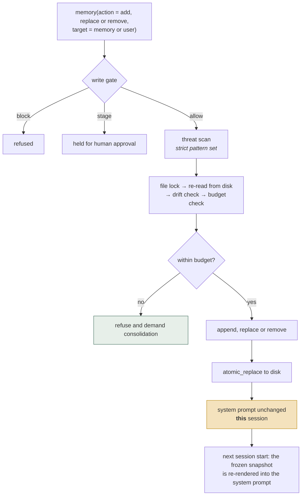
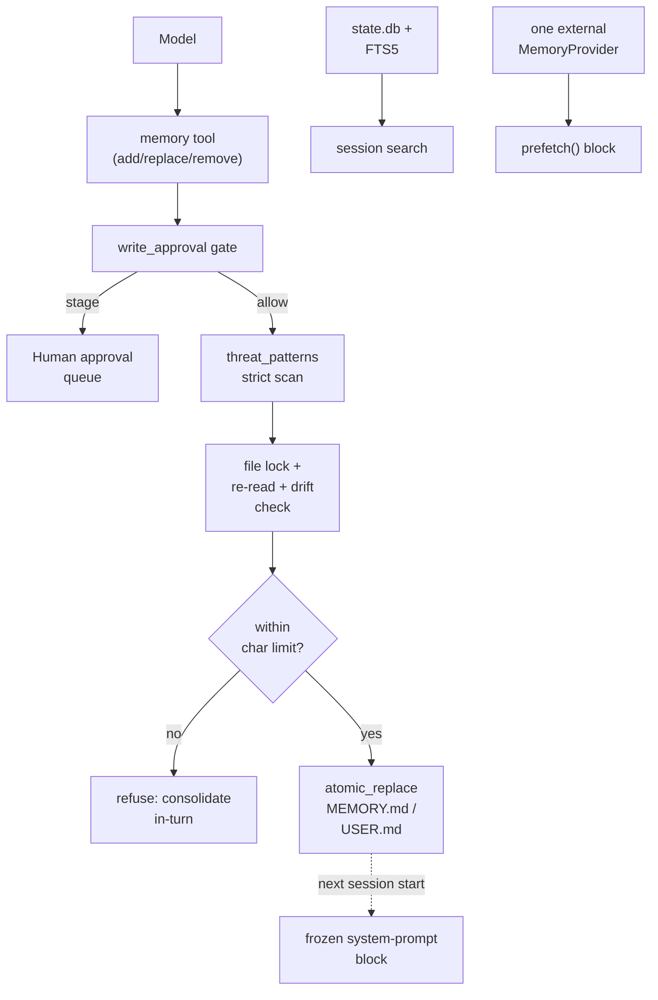

## 1. Executive Summary

This report covers Hermes Agent's **own built-in memory**, not the third-party providers it can mount. The [Holographic](../holographic/) report covers the first-party HRR plugin shipped in the same repository at the same commit; this one covers the memory the agent has when no provider is configured at all.

Hermes takes a position almost nothing else in this atlas takes: **memory is hard-bounded and frozen, because the prompt cache matters more than completeness.**

Two Markdown files under `$HERMES_HOME/memories/` hold curated memory — `MEMORY.md` (the agent's own notes, 2,200 chars) and `USER.md` (the user profile, 1,375 chars). Both are injected into the system prompt as a **frozen snapshot at session start**. Mid-session writes land on disk immediately and durably, but deliberately do *not* change the system prompt, so the prefix cache survives the whole session. The snapshot refreshes on the next start.

The limits are hard, and this is the design's sharpest edge: when an `add` would exceed the char budget, the write is **refused** and the tool returns the current entries with an instruction to consolidate and retry *within the same turn*. Memory compaction is not a background worker; it is a synchronous obligation handed to the model at the moment of overflow.

Around that core sit three more layers:

- **Session history** in SQLite (`~/.hermes/state.db`) with FTS5 full-text search — the unbounded, searchable counterpart to the bounded prompt memory.
- **Skills** as procedural memory: Markdown files the agent writes, updates, and deletes itself via `skill_manage`.
- **A `MemoryProvider` ABC** that mounts exactly one external provider at a time, with first-party adapters for Honcho, Mem0, Hindsight, Supermemory, OpenViking, ByteRover, RetainDB, and Holographic.

The engineering quality of the file layer is high, and much of it is visibly scar tissue from real bugs: external-drift detection with automatic backup, refusal on ambiguous reads, cross-platform file locking, atomic replacement, and threat scanning at the write boundary.

The main weaknesses are the flip side of the same simplicity. Entries are opaque prose with no provenance, status, scope, or supersession; `replace`/`remove` address entries by **substring match** rather than identity; and there is no verification step between "the model decided to remember this" and "this is in every future system prompt."

## 2. Mental Model

There is no schema. The memory unit is a text entry in a delimited flat file:

```text
MEMORY.md   # agent's personal notes    — 2,200 char whole-file budget
USER.md     # what it knows about you   — 1,375 char whole-file budget

entry
§
another entry, possibly
spanning multiple lines
§
a third entry
```

The delimiter is `\n§\n`. Limits are counted in **characters, not tokens**, explicitly "because char counts are model-independent."

Four memory kinds coexist with very different guarantees:

| Layer | Store | Bounded? | In prompt? | Searchable |
|---|---|---|---|---|
| Curated memory | `MEMORY.md` / `USER.md` | Hard char cap | Always, frozen at session start | n/a — always present |
| Session history | SQLite `state.db` | Unbounded | No | FTS5 |
| Skills | Markdown files | Unbounded | Names/descriptions only | by name |
| Provider memory | External | Provider-defined | Via `prefetch` | Provider-defined |

Write lifecycle:



Two things this diagram makes plain. The budget is a **hard refusal** — a write
that would overflow is rejected and consolidation demanded, rather than the file
being silently trimmed. And a write does not change what the model can see until
the *next* session, because the prompt holds a frozen snapshot — so within a
session the agent's memory and its context disagree, by design.

## 3. Architecture

- `tools/memory_tool.py` (1,258 lines): `MemoryStore`, the `memory` tool, budgets, drift detection, locking, and the write gate.
- `agent/memory_manager.py` (1,241 lines): provider registration and lifecycle orchestration.
- `agent/memory_provider.py` (315 lines): the pluggable provider ABC.
- `hermes_state.py` (10,850 lines): SQLite session persistence, FTS5 schema, CJK tokenizer extension, corruption probes and repair.
- `tools/write_approval.py`: the shared allow/block/stage gate used by memory writes.
- `tools/threat_patterns.py`: injection/exfiltration patterns, shared with the context-file scanner.
- `tools/skill_manager_tool.py`, `tools/skill_provenance.py`, `agent/skill_*.py`: skills as procedural memory.



## 4. Essential Implementation Paths

### The frozen snapshot

Documented at the top of `tools/memory_tool.py`: memory files are rendered into the system prompt once, at session start. Mid-session mutations are durable on disk but invisible to the running session's prompt.

The motivation is economic rather than epistemic — a stable prompt prefix keeps the provider's cache warm for the entire session — but it has a real safety consequence the code calls out: because the snapshot is frozen, **a poisoned entry persists for the whole session and across sessions until explicitly removed.** That is why memory content is scanned with the broadest ("strict") threat-pattern set at write time, where most systems in this atlas defend at read time instead.

This is an unusual and defensible trade: Hermes filters what may enter durable memory; [Verel](../verel/) and [RainBox](../rainbox/) instead fence whatever is recalled as untrusted data at the prompt boundary. Write-time filtering is cheaper per turn and cache-friendly; read-time fencing is more robust, because it does not depend on a pattern list being complete.

### Hard budgets and in-turn consolidation

`MemoryStore.__init__(memory_char_limit=2200, user_char_limit=1375)`. In `add`, the prospective serialized total is computed before writing; on overflow the tool returns `success: False` together with `current_entries` and `usage`, and instructs the model to merge or remove entries and retry in the same turn.

`_MAX_CONSOLIDATION_FAILURES_PER_TURN = 3` bounds the resulting loop, so a model that cannot get under budget degrades instead of spinning.

This is the inverse of the atlas's usual pattern. Most systems here let memory grow and add background consolidation later; Hermes refuses the write and makes compaction the model's immediate problem. The benefit is that prompt cost is known statically and cannot drift. The cost is that **the model chooses what to forget under time pressure, with no review and no record of what it dropped.**

### External drift detection

`_detect_external_drift` treats the files as tool-shaped and looks for two signals that something else wrote them: a round-trip mismatch (re-parsing and re-serializing does not reproduce the bytes), or any single parsed entry exceeding the whole-file limit — which implies a shell append, patch tool, manual edit, or sibling session dumped free-form content into what the tool would treat as one entry.

On detection it writes a timestamped `.bak` snapshot and **refuses the mutation**, returning the backup path. If the backup itself fails, the returned string says so explicitly and the file is left unchanged.

Compare [basic-memory](../basic-memory/), which accepts human edits as canonical and invests heavily in bidirectional reconciliation. Hermes takes the opposite and much cheaper route: detect foreign writes, preserve them, and decline to proceed. For a two-file, few-kilobyte store that is the right call; it would not scale to a knowledge base people are expected to edit directly.

The `add` path deliberately skips the drift guard — appending cannot clobber — but a comment records the exception that had to be handled anyway: because `add` rewrites the whole file from parsed entries, a file that exists but reads as empty (transient lock, permission blip, I/O error) would be rewritten down to just the new entry, wiping everything. The code refuses on read failure instead.

### The write gate

`_apply_write_gate` routes every mutating memory action through `tools/write_approval.py`, which returns allow, block, or stage. Staged writes are persisted with an inline summary and a `pending_id` for later human approval — the same confirm-tier write-intent shape [RainBox](../rainbox/) uses for high-impact assistant memory mutations, arrived at independently.

One caveat is explicit in the code: if the gate module fails to import, the function returns `None` and the write proceeds. It **fails open** by design, with a comment saying so.

### Session history

`hermes_state.py` maintains session messages in SQLite with an FTS5 virtual table, and is unusually defensive about it: it detects legacy inline FTS schemas, probes for FTS5 availability and partial corruption with representative `MATCH` queries, caps user-controlled query input at 2,048 chars, can load a CJK tokenizer extension, and can drop and rebuild triggers.

Retrieval here is lexical only. There is no vector index over session history and no fusion with the curated memory files — session search is a separate tool surface the model must choose to call.

### Skills as procedural memory

Skills are Markdown files the agent creates and edits through `skill_manage`, with provenance and usage tracking in `tools/skill_provenance.py` and `tools/skill_usage.py`. Only names and descriptions occupy prompt space; bodies load on demand. This is a clean separation of "what I know how to do" from "what I know", and it is the layer that makes Hermes self-improving in the sense its documentation claims.

## 5. Memory Data Model

The curated layer has no data model beyond ordered strings in a file. Consequences:

- **No provenance.** An entry does not record when, why, from what turn, or on whose authority it was written.
- **No status.** Nothing separates candidate from confirmed; whatever the model writes is immediately authoritative for every future session.
- **No scope.** Profiles partition everything — each profile has its own `HERMES_HOME` with its own config, memory, sessions, and skills — but *within* a profile there is no project, room, or agent boundary.
- **No identity.** `replace` and `remove` locate an entry by unique substring, not by ID. The module docstring presents this as a feature ("short unique substring matching (not full text or IDs)"), and for a hand-sized list it is ergonomic. It is nonetheless identity-by-content: as entries are consolidated and reworded, a substring that was unique can become ambiguous or vanish, and the model must re-derive a handle it cannot store.

Durability is handled well: cross-platform locking via `fcntl` or `msvcrt`, re-read under lock so concurrent sessions observe each other, `atomic_replace` for the final write, and explicit refusal rather than best-effort behaviour on ambiguous reads.

## 6. Retrieval Mechanics

There is essentially no retrieval for curated memory — it is *always* present, in full, in the system prompt. That is the point of bounding it. Recall latency is zero and recall is guaranteed; the trade is that the budget must be small enough for that to be affordable.

The other layers are retrieved on demand and are not fused:

- Session history: FTS5 lexical search, explicit tool call.
- Skills: selected by name/description from the always-present index.
- Provider memory: whatever the mounted provider returns from `prefetch(query)`, appended as its own block.

Nothing ranks across these layers. There is no unified query that considers curated memory, session history, and provider results together, and no de-duplication between them — a fact can appear in `USER.md`, in a provider's store, and in session history, and be injected two or three times.

## 7. Write Mechanics

Curated memory is written only by explicit `memory` tool calls (or their staged, human-approved equivalents). There is no automatic extraction into `MEMORY.md`/`USER.md` — a deliberate choice consistent with the hard budget, since automatic capture would exhaust 2,200 characters almost immediately.

Automatic capture instead happens in the layers that can absorb it: session messages accumulate in SQLite, and a mounted provider's `sync_turn`/`on_session_end` hooks may extract whatever it likes into its own store.

`apply_batch` allows several operations against one target atomically, which is what makes the in-turn consolidate-then-retry flow practical.

## 8. Agent Integration

The `MemoryProvider` ABC is the most explicit pluggable-memory contract in the atlas — roughly seventeen lifecycle members covering initialization, prompt blocks, prefetch, per-turn sync, tool schemas and dispatch, session end and switch, pre-compression extraction, delegation observation, config, backup paths, and shutdown. `MemoryManager` enforces a one-external-provider limit to prevent tool-schema bloat and conflicting backends.

Hermes also exposes sessions to MCP clients via `hermes mcp serve`.

The contract's notable gap — analyzed further in the [pluggable memory provider](../../patterns/pluggable-memory-provider/) pattern — is that **it has no deletion or forgetting hook and no scope parameter.** `on_memory_write` forwards `add`, `replace`, and `remove` for providers that want to mirror built-in writes, but providers are free to implement only `add` (Holographic does exactly that), so a removal in `MEMORY.md` need not reach the provider's copy. There is no interface-level answer to "the user asked to be forgotten."

## 9. Reliability, Safety, and Trust

Strengths:

- Bounded prompt cost by construction, with a stable cached prefix.
- Threat scanning at the write boundary, chosen deliberately because frozen snapshots make poisoning persistent.
- Human approval available for memory writes via a shared staging gate.
- Foreign-write detection with automatic backup and refusal.
- Refusal rather than guessing on failed or ambiguous reads.
- Atomic writes, cross-platform locking, cross-session re-read.
- Extensive FTS5 corruption detection and repair in the session store.
- Profile isolation for multi-persona use.

Gaps:

- **No verification tier.** Anything the model writes is authoritative in every subsequent session. There is no candidate state, no corroboration, and no rejected-value tombstone, so a wrong entry that gets removed can be re-derived and re-added the next session with nothing to stop it.
- **Forgetting is unrecorded and model-driven.** Budget pressure makes the model discard entries; nothing logs what was dropped or why.
- **Substring identity** is fragile under exactly the consolidation the design forces.
- **The write gate fails open** if its module cannot be imported.
- **Write-time pattern scanning is a denylist**, and unlike read-time fencing its coverage depends on the pattern set being complete.
- **No cross-layer deduplication or precedence** between curated memory, provider memory, and session history.

## 10. Tests, Evals, and Benchmarks

Memory-relevant suites include `tests/tools/test_memory_tool.py`, `tests/tools/test_memory_tool_import_fallback.py`, `tests/tools/test_write_approval.py`, `tests/agent/test_memory_provider.py` (1,662 lines), `tests/agent/test_skip_memory_store_65429.py`, `tests/agent/test_learning_mutations.py`, `tests/hermes_cli/test_backup.py`, and the holographic plugin suites.

The suites were not run for this review. Coverage is clearly failure-path-oriented and several guards cite the issues that produced them (#26045 for drift, #50502 for FTS trigger corruption, #57682/#57690 for extraction contamination), which is good evidence that the defensive code reflects real incidents rather than speculation.

No committed memory-quality benchmark was found. There is no evaluation of whether the 2,200/1,375-character budgets are well chosen, and no measurement of what in-turn consolidation discards over long-running use — which is the single most important open empirical question about this design.

## 11. For Your Own Build

### Steal

- **Frozen prompt snapshot.** Decoupling durable writes from prompt mutation to preserve the cache is a genuinely useful move for any always-on memory block, and no other system in this atlas does it explicitly.
- **Hard budget with in-turn consolidation.** Refusing the write and handing back current entries makes the compaction decision explicit and immediate instead of deferring it to a background job that may never run.
- **Character budgets, not token budgets**, for model-independent limits.
- **Foreign-write detection with backup-then-refuse** as a cheap alternative to bidirectional sync.
- **Refuse on ambiguous read** rather than proceeding from a possibly-empty snapshot.
- **A staged write-approval gate** shared across tools, giving humans a checkpoint on durable memory mutations.
- **Skills as separate procedural memory**, indexed by name and loaded on demand.

### Avoid

- **Model writes are immediately authoritative** — no candidate tier, no corroboration, no tombstones.
- **Substring-as-identity** for mutation targets.
- **Unlogged forgetting** driven by budget pressure.
- **Denylist-based injection defence** at write time, with no read-time fence as a second layer.
- **Fail-open write gate.**
- **Layer duplication** with no precedence rule between curated, provider, and session memory.
- **Provider interface with no deletion contract**, making "forget me" unenforceable across a mounted backend.

### Fit

Borrow:

- The frozen-snapshot pattern, especially if prompt caching is a material cost.
- The hard-budget-plus-consolidate-in-turn loop, with the per-turn failure cap.
- `_detect_external_drift`'s two signals and its backup-then-refuse response.
- The staged write-approval gate for durable memory mutations.
- The bounded-curated / unbounded-searchable split, which is a clean and honest division of labour.

Do not copy:

- Substring addressing beyond a few dozen entries.
- Write-time denylist scanning as the *only* injection defence.
- The provider ABC as-is if you need deletion, scope, or multi-tenancy — it has none.
- Unrecorded, model-driven eviction if you ever need to explain why something was forgotten.

## 12. Open Questions

- What is actually lost over months of in-turn consolidation? Nothing measures or logs evictions.
- Should removals write a tombstone so a re-derived entry can be recognized and refused?
- Should the provider ABC gain `forget(scope|id)` and a scope parameter? Without them, host-level deletion cannot be honoured by a mounted provider.
- Should curated memory, provider results, and session hits be fused and de-duplicated rather than concatenated as independent blocks?
- Are 2,200 and 1,375 characters empirically right, or simply the first values that fit comfortably?
- Could entries carry a stable hidden ID while preserving the ergonomic substring interface?

## Appendix: File Index

- Curated memory store, budgets, drift, locking: `tools/memory_tool.py`.
- Write gating and staging: `tools/write_approval.py`.
- Injection/exfiltration patterns: `tools/threat_patterns.py`.
- Provider contract: `agent/memory_provider.py`; orchestration: `agent/memory_manager.py`.
- Session persistence and FTS5: `hermes_state.py`.
- Skills as procedural memory: `tools/skill_manager_tool.py`, `tools/skill_provenance.py`, `tools/skill_usage.py`, `agent/skill_*.py`.
- Provider adapters: `plugins/memory/{holographic,honcho,mem0,hindsight,supermemory,openviking,byterover,retaindb}/`.
- Tests: `tests/tools/test_memory_tool*.py`, `tests/tools/test_write_approval.py`, `tests/agent/test_memory_provider.py`.

## History

**2026-07-27** — [`0fa5e41c86f022bba147797849f0b44865721476`](https://github.com/NousResearch/hermes-agent/commit/0fa5e41c86f022bba147797849f0b44865721476) — first reading.
