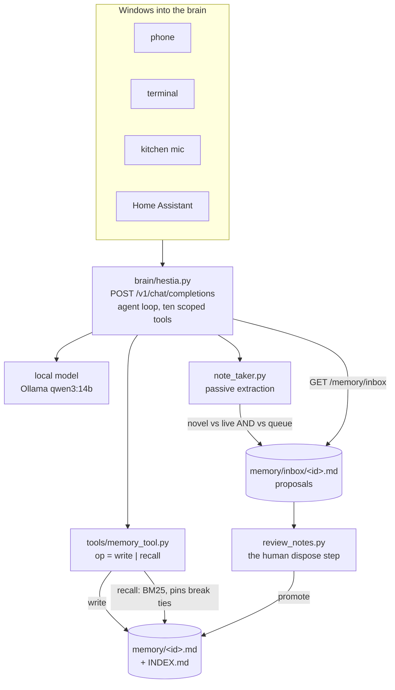

## 1. Executive Summary

Hestia is a self-hosted assistant for a house: one stateful "brain" wrapping a
local model behind an OpenAI-compatible endpoint, with every window into it —
phone, terminal, kitchen mic, Home Assistant — speaking the same dialect. AGPL-3.0.

Its thesis is stated in the README and is unusually disciplined for the category:
*"Most 'AI for the home' points the model at the things it's worst at:
remembering a schedule, watching a threshold, firing a reminder at the right
minute. Hestia does the opposite. Anything deterministic … is handed to something
dumb and reliable: a timer, a record, a row in a database."* The memory follows
from that: markdown files a person can read, a keyword recall, and a model that
proposes rather than decides.

**The mechanism worth the report is the review inbox.** `brain/note_taker.py`
extracts durable facts from conversation in the background, and they *"land in a
review inbox (`memory/inbox/*.md`), NOT straight into the live memory store."*
`brain/review_notes.py` is the human step, and says why: *"nothing becomes part of
the brain's live memory until you promote it here, so the brain learns in the open
and you stay in control (determinism over intelligence)."* No deployment
variable opens a way around it: the module states that *"deployment environment
variables cannot bypass this gate"*, and a test sets the legacy
`HESTIA_NOTETAKER_AUTOWRITE=1` and asserts the fact reaches the inbox and not the
store. That is the difference between a review gate and a decoration.

**Also good:** the store's write whitelist errors loudly rather than coercing,
and a committed test asserts that the refused fact is absent afterwards.

**Weakest:** recall is lexical over every record with no semantic arm,
`confidence` is written and displayed and read by nothing that ranks, and once a
fact is promoted there is no way to mark it wrong — the correction surface is a
text editor and a `rm`.

## 2. Mental Model

A memory is a markdown file. A *proposed* memory is a markdown file somewhere
else.

```text
conversation ──► note_taker (background)
                      │ is it novel vs live memory AND vs the queue?
                      ▼
             memory/inbox/<id>.md          ← proposal, reviewable
                      │
              review_notes.py  ← a person promotes or discards
                      ▼
             memory/<id>.md                ← live: type, confidence, source,
                      ▲                       last_seen, links, pinned + text
                      │
        memory tool: write ──┘        recall ──► BM25, capped at twenty
                             (the model's own two operations)
```

The only lifecycle is **proposed → live**, and it is crossed by a person. After
that there are no states: nothing marks a live fact doubtful, superseded or
rejected, and `confidence` is a float set at write time that never moves except
by editing the file.

Control is genuinely **split by design** rather than by omission. The model may
write directly through its tool; the *passive* extraction — the part that would
otherwise fill a store with unreviewed inferences — is held behind the inbox. The
system treats a live fact as true and says so by putting the judgement step
before the store rather than after it.

## 3. Architecture



**Runtime shape.** A Python service (`brain/`) exposing an OpenAI-compatible
endpoint with an agent loop and ten scoped tools — `home`, `media`, `memory` and
others — plus clients under `clients/` and deployment under `deploy/`. Everything
is local; the README's claim is that nothing leaves the house.

**Persistence.** Markdown files under `HESTIA_MEMORY_DIR` (default `memory/`),
one per fact, with `INDEX.md` regenerated on write — one line per record carrying
id, type and confidence. The records are **gitignored on purpose**, with the
reasoning in `memory/README.md`: they are runtime data, and a reader who wants
the design's *"every learned fact is an auditable diff"* is told to point the env
var at a dedicated git repository.

**Search.** BM25 in `memory_store.recall`, over a token stream filtered by a
48-word stop list and drawn from each record's id, body and link aliases. Rarity
comes from the corpus document frequency and the length normalization uses the
store's own average; the sort key is `(score, pinned)`, so a pin breaks a tie and
cannot promote an irrelevant record, and `confidence` is not in the key at all.
The result is capped at twenty however large `k` is. `memory/README.md` is
explicit that this is v1: *"vector recall is a planned upgrade (markdown stays
the source of truth, the index is derived)."*

### Deployment and ergonomics

A local model on hardware you own, a service, and a directory of markdown. No
cloud, no key needed to store anything, and the store is the most repairable kind
there is. `MEMORY-DESIGN.md` records the build-versus-reuse decision that
produced it, including what was taken from another project — *"Odysseus's
write-it-down reflex + a human-readable structured store + passive background
extraction"* — which is a rarer document than the design itself.

## 4. Essential Implementation Paths

**The tool.** `brain/tools/memory_tool.py::execute(op, content, type)` has exactly
two operations. `write` calls `memory_store.write` and catches `ValueError` to
*"tell the model instead of silently munging"*; `recall` returns rendered hits or
the literal *"Nothing relevant in memory."* There is no delete op, so the model
cannot remove what it wrote.

**The store.** `brain/memory_store.py` — `write(content, type, source,
confidence, links, pinned)` stamps `source: f"{source}@{today}"` and
`last_seen`, writes one file, and calls `_reindex()` to regenerate `INDEX.md`.
`recall(query, k)` scores by BM25 and sorts on `(score, pinned)`.
`context_block(query, k)` renders the selected records for injection.

**The note-taker.** `brain/note_taker.py` extracts candidate facts, checks
novelty against *both* the live store and the existing queue (`:131` — *"True if
this fact isn't already known (live memory) or already queued (inbox)"*), and
writes one proposal per fact as reviewable markdown (`:160`). The module's
docstring states the invariant it holds: *"Background extraction always requires
review; deployment environment variables cannot bypass this gate."*

**The review step.** `brain/review_notes.py` is the promote/discard CLI;
`brain/hestia.py:346` exposes `GET /memory/inbox`.

**Tests.** `brain/tests/test_memory_store.py` and
`brain/tests/test_memory_inbox.py`, plus a wider suite for the brain and tools.

## 5. Memory Data Model

Frontmatter plus prose: `type` (whitelisted), `confidence` (float),
`source` (`<origin>@<date>`), `last_seen`, `links` (a list of ids),
`pinned` (bool). `INDEX.md` is derived and regenerated on every write.

**Scoping:** none, and none is wanted — this is one household's brain, and the
absence is a design position rather than a gap.

**Temporal:** `last_seen` and the date inside `source`. There is no validity
interval and no notion of when a fact stopped being true.

**Correction:** editing or deleting a file. There is no supersession chain, no
rejected-value record, and nothing that stops a promoted-then-deleted fact from
being re-proposed by the note-taker on the next conversation that mentions it —
the novelty check runs against live memory and the queue, and a fact that is in
neither looks new.

## 6. Retrieval Mechanics

Keyword overlap over every record, top-k, with `pinned` and `confidence` breaking
ties. That is honest about its limits in the repository's own words, and it has
the property the taxonomy-heavy systems in this corpus rely on: a small store
where a person knows what is in it.

**Failure modes.** A fact phrased differently from the query is not found, and
there is no fallback channel. The `INDEX.md` is a listing rather than an index —
nothing queries it. And because `confidence` only ever breaks a tie, a
low-confidence fact and a high-confidence one are equally retrievable; the field
records a judgement the read path almost entirely ignores.

## 7. Write Mechanics

Two paths with different rules, which is the design's whole point.

**The model's own writes are immediate** but constrained: an unknown `type`
raises rather than coercing, and the error text goes back to the model so it can
correct itself.

**Passive extraction may only propose.** Everything the note-taker finds goes to
the inbox, deduplicated against live memory *and* the queue so a repeated
conversation does not stack duplicate proposals, and a person promotes. Set beside
the rest of this corpus, where background extraction usually writes straight into
the store and the review surface is a viewer, that ordering is the contribution.

**Conflicts** are not modelled. Two contradictory promoted facts coexist and both
can be recalled.

### Operational cost

Recall is a scan over the store per query and the store is small by construction.
Writes are a file plus an index regeneration — `_reindex()` rewrites `INDEX.md`
on every write, which is O(store) per fact and fine at household scale.
Extraction runs in the background and costs a model call on the local box.
Write-to-readable lag is zero for a tool write and *however long until a person
reviews* for an extracted one, which is the honest trade the design makes.

## 8. Agent Integration

The `memory` tool sits among ten scoped tools behind one OpenAI-compatible
endpoint, so every client — phone, terminal, mic, Home Assistant — reaches the
same store through the same agent loop. The model's agency is two operations
wide: write and recall. It cannot delete, cannot promote from the inbox, and
cannot set its own `confidence` through the tool surface.

That last point is worth stating plainly, because most systems in this corpus let
the writer choose its own trust level. Here the tool's `execute` passes
`source="agent"` and lets the store default the confidence.

## 9. Reliability, Safety, and Trust

**The review inbox is the trust mechanism**, and it is placed before the store
rather than after it. What it does not do is give a promoted fact any way to be
doubted later: after promotion the record is a file like any other.

**Provenance** is real but coarse — `source` records origin and date, and
`links` can relate records, so a promoted fact can point at what it came from.

**Injection.** Recalled text is rendered into a context block with no data fence.
For a household assistant reading from a mic, the material entering memory is
whatever was said in the house, which is a smaller threat surface than most and
not an empty one.

**Privacy** is the design's headline: local model, local files, nothing exposed.
The gitignored records are the right default for a code repository, and the
`HESTIA_MEMORY_DIR` escape hatch for a versioned store is documented in the same
paragraph.

**Data loss.** `_reindex()` rewrites `INDEX.md` on every write with no lock; two
concurrent writes could interleave the regeneration. The records themselves are
separate files, so the blast radius is the index rather than the memory.

## 10. Tests, Evals, and Benchmarks

`test_memory_store.py` covers id uniqueness, file creation, the pinned tiebreak,
and the whitelist refusal — the last of which earns `negative_eval` in its
strongest small form: the refusal raises *and* the content is asserted absent, so
a rejected write cannot leave a partial record. Its comment dates the change to
an audit nit closed on 2026-07-22 and states the alternative it rejected, which
is unusually legible for a test.

Three more negative cases sit beside it, and each one can fail.
`test_irrelevant_pinned_memory_is_not_recalled` writes a pinned record and
asserts an unrelated query returns nothing — which is exactly the assertion that
would have failed under a scoring rule that added a bonus for `pinned` rather
than sorting on it second. `test_common_question_words_do_not_count_as_relevance`
stores *"the car is in the garage"* and asserts that *"what is the coffee"*
recalls nothing, a query that shares two tokens with the record and matches it
without the stop list. `test_alias_links_retrieve_and_context_carries_provenance`
is the positive control for both: a record written with `links=['coffee']` is
recalled by `coffee` and its rendered block carries `source=user@`.

`test_note_taker.py` adds the fourth, on the gate rather than on recall:
`test_legacy_autowrite_flag_cannot_bypass_review` sets the legacy environment
variable, asserts a proposal was produced, asserts the fact is absent from live
memory, and asserts the inbox file exists — so the case distinguishes "the gate
held" from "extraction did nothing".

`test_memory_inbox.py` covers the proposal path, and `test_recipe_review.py`
covers the same propose-then-promote shape applied to imported recipes through
`recipe_drafts.py` and `recipe_review.py`. Evaluation is a directory of scripts —
`eval_keymatch.py`, `eval_heldout.py`, `eval_briefing.py`, `eval_models.py`,
`eval_support.py` and `eval_conversation.py` — beside `sft_gen.py` and
`sft_gen_v2.py`; no committed result artifact reports a score. The conversation
harness states the discipline it works under in its own docstring: *"Quality is
reviewed from transcripts, never inferred from keyword success alone."*

**What I would want:** a case asserting that a fact deleted from live memory is
not re-proposed by the note-taker on the next mention. As read, the novelty check
would treat it as new, which is the rejected-value gap in the shape this design
would actually meet it.

## 11. For Your Own Build

### Steal

- **Let passive extraction propose, never write, and default the bypass off.**
  One inbox directory, one CLI, and a `"0"` default is the whole mechanism, and it
  is the difference between a store a person trusts and one they audit.
- **Deduplicate a proposal against the queue as well as the store.** Checking
  only live memory means the same fact stacks up in the inbox every time it is
  mentioned.
- **Error loudly on an out-of-whitelist type and return the error to the model.**
  Coercion hides the mistake; the model can fix what it is told about.
- **Assert the absence after the refusal.** A test that checks the exception and
  not the store will pass over a half-write.
- **Keep the deterministic work away from the model on purpose, and say so.**
  Timers, thresholds and schedules are not memory problems, and a system that
  routes them away from the LLM has a smaller memory to get right.

### Avoid

- **Do not write a `confidence` the read path only uses as a tiebreak.** Either
  filter on it, rank on it, or drop the field — a recorded judgement nothing acts
  on reads as a control that is not there.
- **Do not leave a promoted fact with no way to be marked wrong.** The inbox
  guards entry and nothing guards what happens after.
- **Do not let deletion be invisible to the extractor.** A fact a person removed
  will look novel the next time it is mentioned.

### Fit

This suits one household running its own hardware, and it is the clearest example
in this corpus of a review-first memory whose default really is review. Take the
inbox pattern whether or not you take the rest. Walk away if you need recall to
find what you cannot name — the keyword scan is honest about being v1 — or if
memory has to be correctable after the fact rather than only before it.

## 12. Open Questions

- What extracts the proposals? `note_taker.py` takes an `extract_fn`; which model
  and prompt run in the default deployment is not visible from the tree.
- How large does the store get before the keyword scan and the per-write
  `_reindex()` are felt in a household?
- Does `review_notes.py` record *rejections*, or does a discarded proposal simply
  disappear? The second would make the same fact re-proposable indefinitely.
- `benchmarks/` and `eval_keymatch.py` exist with no committed results; what do
  they measure and what did they show?

## Appendix: File Index

- **Store:** `brain/memory_store.py`, `memory/README.md`
- **Agent surface:** `brain/tools/memory_tool.py`, `brain/hestia.py`
- **Proposal and review:** `brain/note_taker.py`, `brain/review_notes.py`, `brain/hestia.py:346`
- **Configuration:** `brain/config.py` (`MEMORY_DIR`, `INBOX_DIR`)
- **Design record:** `MEMORY-DESIGN.md`, `ARCHITECTURE.md`, `AUDIT.md`
- **Tests and evals:** `brain/tests/test_memory_store.py`, `brain/tests/test_memory_inbox.py`, `brain/eval_keymatch.py`, `benchmarks/`

## History

**2026-09-19** — re-pinned to [`51ebf7b046a28a310f2ee7fc489b18067b0b33f1`](https://github.com/thefullnacho/hestia/commit/51ebf7b046a28a310f2ee7fc489b18067b0b33f1). Both marks stand. `human_review` was producer-tested rather than carried forward, and the answer is clean: `promote` exists only as a subcommand of `review_notes.py` (`:58`, dispatched at `:103`), and the HTTP server's sole memory route is `GET /memory/inbox` — a read. The previous record's `hestia.py:346` anchor no longer resolves and has been corrected to `:773`; the `note_taker.py` gate statement and `test_legacy_autowrite_flag_cannot_bypass_review` are both exactly where they were. That test remains the thing worth copying here: a regression case that sets the legacy autowrite environment variable and then asserts `mem.recall("1080p") == []`, so the claim *"deployment environment variables cannot bypass this gate"* is checked rather than documented. `negative_eval` stands on `test_unknown_type_raises`. Screened again first; nothing was installed and no suite was run.

**2026-09-16** — [`be5ce89c9bf884b2ca7d9d6a0d3c0d118747becf`](https://github.com/thefullnacho/hestia/commit/be5ce89c9bf884b2ca7d9d6a0d3c0d118747becf) — re-pinned after 1 commit. `brain/note_taker.py`, `brain/review_notes.py` and all three anchored test files are byte-identical, so both marks stand on unchanged code. The single commit adds an NFC tag slug and a rainfall record to the garden domain; the one memory-adjacent file it touches, `brain/hestia.py`, gains a `p` parameter and a watering-position lookup on the capture path, neither of which reaches the inbox or the review flow. Nothing was installed, built or run.

**2026-09-13** — [`71b9e8610a7e20620c92c0189fd1075742d147fb`](https://github.com/thefullnacho/hestia/commit/71b9e8610a7e20620c92c0189fd1075742d147fb) — re-read, 59 commits past the previous pin. Screened again first: no auto-run surface, two dependency files inside the 7-day cooldown and three unpinned surfaces; nothing was installed and the suite was not run. Both marks hold and both gained evidence. The published claim that a `HESTIA_NOTETAKER_AUTOWRITE` bypass exists and is off by default is corrected: the flag no longer bypasses approval, `note_taker.py` states that deployment environment variables cannot bypass the gate, and `test_legacy_autowrite_flag_cannot_bypass_review` sets it to `1` and asserts the fact lands in the inbox rather than live memory. Recall was rewritten from term-overlap counting to BM25 with a stop list, corpus rarity and length normalization; `pinned` moved from a `0.5` score bonus to the second element of the sort key, so it breaks ties and cannot promote an irrelevant record, and `confidence` is no longer read by any ranking while remaining in the context block. Results are capped at twenty. Three recall cases and one gate case were added to the committed negative set, and the propose-then-promote shape now also covers imported recipes through `recipe_drafts.py` and `recipe_review.py`.

**2026-08-20** — [`e6841239a9644035df88bb49f429385382238351`](https://github.com/thefullnacho/hestia/commit/e6841239a9644035df88bb49f429385382238351) — first reading. Screened before anything was read: no auto-executing surface, one build-time execution point, three unpinned surfaces; nothing was installed, no model was pulled and no service was started. The review-inbox default and the whitelist refusal were established by reading `note_taker.py` and `memory_store.py` against their committed tests. The memory records themselves are gitignored runtime data and were not present in the checkout, so every claim here is about the code that writes them.
