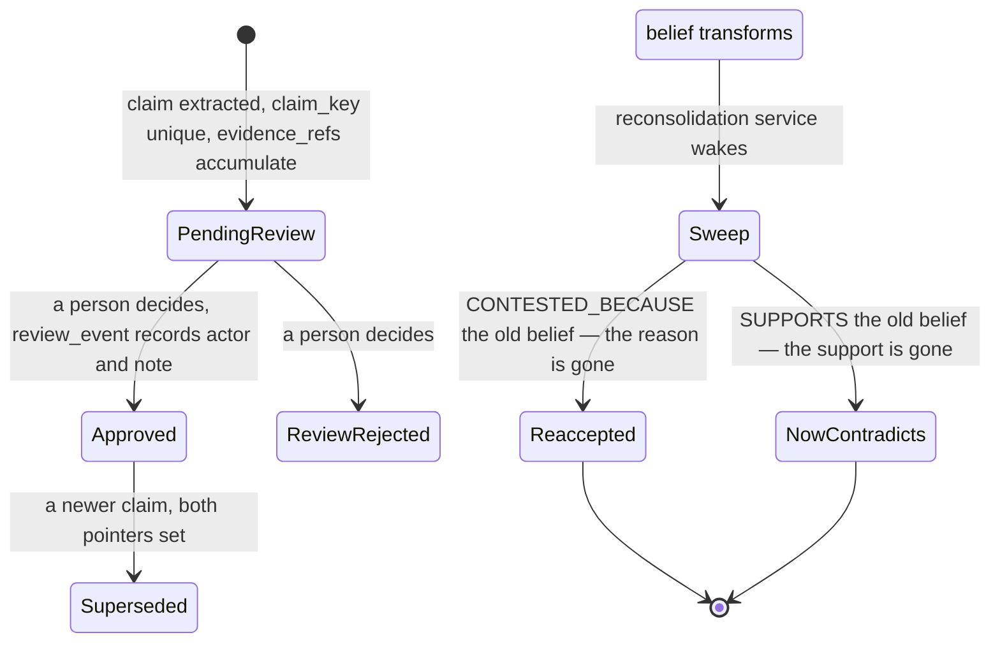

## 1. Executive Summary

Hexis describes itself as "a Postgres-native cognitive architecture" for
"Memory, Identity, and the Shape of Becoming" — a companion agent rather than a
coding assistant. MIT, roughly 182,000 lines, with the memory model implemented
almost entirely in SQL: eighty-plus numbered function files under `db/`, a graph
built as one table per edge type, and Python services orchestrating them.

**The mechanism that earns the report is `services/reconsolidation.py`, and it
asks a question nothing else in this atlas asks.**

When a worldview belief transforms, the service re-evaluates the memories that
were connected to the *old* belief, in two directions, stated in its header:

> 1. `CONTESTED_BECAUSE` → belief: rejected because of old belief, may now
>    accept.
> 2. `SUPPORTS` → belief: supported old belief, may now contradict.

The first direction is the rare one. Every system in this atlas can supersede a
belief. This one goes back and asks **what that belief was suppressing** — which
memories were rejected *because of it*, and whether the reason for rejecting
them has now gone away.

That requires an edge type most graphs do not carry. `CONTESTED_BECAUSE` is one
of a typed set alongside `CAUSES`, `SUPPORTS`, `CONTRADICTS` and `DERIVED_FROM`,
each materialised as its own Postgres table with its own indexes. Recording *why
something was not accepted*, as a first-class edge pointing at the belief that
blocked it, is what makes the sweep possible at all.

**The second thing is the two-axis claim model.** `user_model_claims` carries:

```sql
status        TEXT CHECK (status IN ('active','superseded','rejected'))
review_status TEXT CHECK (review_status IN ('pending_review','approved','rejected','superseded'))
```

— what the system currently holds, and what a person has decided about it, as
separate CHECK-constrained columns with separate defaults. A claim can be active
and unreviewed, or rejected by review while the evidence still stands. Beside
them: `evidence_refs` and `evidence_count`, `contradiction_refs`,
`superseded_by` **and** `supersedes_claim_id` (both directions), `reviewed_at`,
`reviewed_by`, `review_note`, and an index on `(review_status, updated_at DESC)`
so the review queue is a cheap query rather than a scan.

## 2. Mental Model

A memory is a node in a typed graph. A **claim about the user** is a separate
first-class row keyed on a canonical `claim_key` with a `UNIQUE` constraint, so
the same claim arriving from a second source accumulates evidence rather than
duplicating.

Belief lives above both. When a belief changes, the reconsolidation sweep runs,
and memories move.



The two arrows out of `Sweep` are the design. Correction here is not only
forward — retiring a belief reopens what that belief closed.

## 3. Architecture

Postgres does the work. `db/` holds numbered SQL files covering deliberate
transformation, provenance and trust, graph helpers, heartbeat, goals, context,
boundaries, emotional state, neighbourhood recompute, a reflect pipeline,
subconscious observations, tip-of-the-tongue retrieval, scheduling, dopamine and
reward events, tool audit, journal entries and connector cognition.

The graph is hand-built rather than borrowed: `memory_graph."SUPPORTS"`,
`memory_graph."CONTESTED_BECAUSE"` and siblings are separate tables with
`start_id`/`end_id` B-tree indexes each. That is more schema than an adjacency
table and it makes an edge-type-specific sweep a single indexed scan.

Around the database sit Python services (`reconsolidation`, `subconscious`,
`skill_improvement`, `connector_setup`, `prompt_resources`), chat channels, a
UI, plugins, skills and characters. A maintenance worker calls the sweep when
`has_pending_reconsolidation()` returns true.

Standing this up costs a Postgres instance, an LLM endpoint and connector
credentials.

## 4. Essential Implementation Paths

**Claim intake** — connector cognition writes `user_model_claims` on the unique
`claim_key`, appending to `evidence_refs` and incrementing `evidence_count`.

**Review** — a decision writes `user_model_review_events` with `prior_status`,
`prior_review_status`, `decision IN ('approve','reject','supersede','restore')`,
a `note` and an `actor`, and updates the claim's `review_status`,
`reviewed_at`, `reviewed_by` and `review_note`.

**Reconsolidation** — `has_pending_reconsolidation()` → the sweep loads memories
on `CONTESTED_BECAUSE` and `SUPPORTS` edges to the transformed belief →
`chat_json` in batches of eight → `_normalize_verdicts` validates each verdict
carries a `memory_id` and a `verdict` and drops the rest.

**Skill proposals** — `skill_improvement_proposals` with the service header's
own guarantee: "This service never writes skill files. The approved proposal
tool owns that."

## 5. Memory Data Model

The claim table is described in section 1. Three details around it:

`restore` as a review decision is unusual and correct. Approve, reject and
supersede are the obvious three; `restore` means a review decision can itself be
undone, and the event log records both the decision and the state it moved from
(`prior_status`, `prior_review_status`), so the history reconstructs without
inference.

`superseded_by` and `supersedes_claim_id` are both stored. Most systems keep one
and derive the other; keeping both means a chain walks in either direction
without a reverse index.

`contradiction_refs` as a JSONB array beside `evidence_refs` means a claim
carries the case against it as well as the case for it, on the same row.

`tool_executions` and `workflow_executions` (`db/23_tables_tool_audit.sql`) are
a separate audit tier for what the agent *did*, distinct from what it believes.

## 6. Retrieval Mechanics

Graph neighbourhood recompute, a reflect pipeline, emotional-state weighting
over a typed edge set, and `db/18_functions_tip_of_tongue.sql` — a retrieval
path named after the failure it addresses, where a partial cue should surface a
memory that exact matching misses.

The partial indexes tell you the query shapes:
`idx_user_model_claims_category ... WHERE status = 'active'` means the common
read is active claims by category, and `idx_user_model_claims_review` on
`(review_status, updated_at DESC)` means the review queue is meant to be opened
often.

Scope is not a mechanism here. Hexis is a single-subject companion; contacts and
channels partition the input, not the store. `scope_enforced` is withheld and
the design does not claim otherwise.

## 7. Write Mechanics

Claims accumulate rather than overwrite: the unique `claim_key` turns a repeat
observation into an evidence append and a `last_evidence_at` bump.

Correction has three routes and they are genuinely different. A **supersession**
sets both pointers and moves `status`. A **review rejection** moves
`review_status` without touching `status`, so the evidence and the verdict stay
separable. And a **reconsolidation verdict** moves memories in the graph when the
belief they hung off changed.

What is absent is a rejected-value record keyed on content. A claim rejected at
review keeps its `claim_key`, and the `UNIQUE` constraint means a re-extraction
of the same claim lands on the same row — so the rejection is *not* silently
overwritten, which is a stronger accidental property than most systems get. What
it does not do is prevent the row's `status` being moved back to active by a
process other than a review decision, and nothing in the schema forbids that.

## 8. Agent Integration

Chat channels with adapters, connectors for external accounts with an explicit
consent flow — the setup service's replies name it: "I will stay within the
email powers and memory policy you approved" — a UI, a plugin system, skills and
characters.

The consent framing is worth noting because it is the same boundary the review
status enforces one layer down: what the agent may read, and what a person has
approved it to believe, are separate approvals.

## 9. Reliability, Safety, and Trust

**Trust state — awarded, and it is one of the better implementations here.** Two
CHECK-constrained axes, separate defaults, both indexed, with `rejected`
appearing in each and meaning different things: `status = 'rejected'` is the
system's position, `review_status = 'rejected'` is a person's. Keeping them
apart is exactly the separation the mark exists to reward.

**Human review — awarded.** `user_model_review_events` is a mutation surface,
not a display: a decision from a four-value vocabulary, an actor, a note, and
the prior states. `reviewed_by` on the claim names who.

**Audit log — awarded.** The review events table is append-only per claim with
`prior_*` columns, and `tool_executions`/`workflow_executions` cover the action
side.

**Scope, bitemporal, tombstone, negative eval — no.**

**The honest risk is the sweep's judgement.** A reconsolidation verdict is an
LLM call over batches of eight memories, and the code is careful about *parsing*
it — `_normalize_verdicts` drops any verdict missing `memory_id` or `verdict`,
and `_coerce_json` tolerates a string where an object was expected — but nothing
validates the verdict against evidence. A belief transformation can therefore
move a batch of memories on a model's say-so, and the review machinery that
exists for claims does not cover it.

## 10. Tests, Evals, and Benchmarks

**No paper.** `evals/retrieval/` exists with a `conftest.py`, and 252 test files
across the tree.

**I ran nothing.** The screen flagged build-time execution in three files and
two dependency manifests inside the cooldown.

No committed evaluation result was found — no retrieval score, no
reconsolidation accuracy, nothing measuring whether the sweep's verdicts are
right. For the mechanism this report is about, that is the gap that matters:
reconsolidation is a *correction* mechanism whose correctness is unmeasured.

The repository does carry an unusual amount of self-directed documentation —
`MISSION.md`, `MISSION_PROGRESS.md`, `HEXIS_EXPERIENCE_BAR.md` and a file named
`why_i_suck_and_how_to_fix_it.md`. The last is a project keeping its own defect
list in the open, which is the same instinct as
[Shodh-Memory](../shodh-memory/)'s self-audit and
[YantrikDB](../yantrikdb/)'s corrections file, at a less rigorous grade.

## 11. For Your Own Build

### Steal

- **Record why something was rejected as an edge to the thing that rejected
  it.** `CONTESTED_BECAUSE` is what makes it possible, later, to ask what a
  belief was suppressing. Without that edge the question cannot be asked at all.
- **Sweep in both directions when a belief changes.** What the old belief
  blocked may now be acceptable; what it supported may now be contradicted.
  Correction that only moves forward leaves the second-order damage in place.
- **Keep the system's status and the reviewer's verdict in separate columns.**
  `status` and `review_status` with overlapping vocabularies and different
  meanings is the distinction most single-status designs lose.
- **Add `restore` to your review vocabulary.** A review decision that cannot be
  undone makes reviewers cautious in the wrong direction.
- **Log the prior states on the decision.** `prior_status` and
  `prior_review_status` on the event mean the history reconstructs without
  replaying.
- **Store both supersession pointers.** Cheap, and the chain walks either way.
- **Put the case against a claim on the claim.** `contradiction_refs` beside
  `evidence_refs` means a reader sees both without a join.
- **Index the review queue.** `(review_status, updated_at DESC)` says the queue
  is expected to be opened, which is the difference between a workflow and a
  backlog.
- **Say in the service header what it will never do.** "This service never
  writes skill files. The approved proposal tool owns that."

### Avoid

- **Do not let an unvalidated model verdict move memories.** The sweep is
  carefully defensive about parsing and silent about correctness; the claim path
  has a review surface and the reconsolidation path does not.
- **Do not batch a judgement without measuring the batch size.** Eight memories
  per call is a constant with no evaluation behind it, and batching changes what
  the model attends to.
- **Do not build one table per edge type without a plan for adding one.** The
  schema is fast and the migration cost of a new relation is a new table plus
  its indexes plus every query that enumerates the set.

### Fit

This suits someone building a companion agent with a real inner life —
emotional state, dopamine, subconscious observation, identity — who is
comfortable with Postgres as the runtime rather than as the store. Most of the
system is SQL, which is a genuine strength for auditability and a genuine
constraint on who can maintain it.

The part to take is the pair of ideas at its centre: a `CONTESTED_BECAUSE` edge
and a sweep that reads it. Between them they are the only implementation in this
atlas of correction that goes backwards.

## 12. Open Questions

- **How often does the sweep fire, and how much does it move?** Nothing reports
  the rate, and a belief transformation that re-accepts a large batch is a
  significant change to what the agent believes.
- **Who is the `actor` on a review event?** The column exists; whether a person
  or a service can both write it decides whether `human_review` means what it
  says in a real deployment.
- **Can `status` move back to active outside a review decision?** The schema
  permits it and nothing found forbids it.
- **What happens to a claim whose `claim_key` collides across subjects?** The
  constraint is global unique on the key, which is right for a single-subject
  companion and would need scoping for anything else.

## Appendix: File Index

**Reconsolidation** — `services/reconsolidation.py` (the two directions `:5-7`,
`BATCH_SIZE` `:24`, `_normalize_verdicts` `:37`), `services/subconscious.py`

**The claim model** — `db/85_functions_connector_cognition.sql:61`
(`user_model_claims` with both CHECK-constrained axes), `:96`
(`user_model_review_events`), `:44` (`user_model_source_progress`), `:111`
(`connector_item_importance`)

**The typed graph** — `db/00_tables.sql:60-95` (one table per edge type with
per-edge indexes), `db/13_functions_emotional_state.sql:833` (the edge-type
array), `db/06_functions_graph_helpers.sql`,
`db/14_functions_neighborhood_recompute.sql`, `db/15_functions_graph_enhancements.sql`

**Provenance and trust** — `db/05_functions_provenance_trust.sql`,
`db/02_functions_deliberate_transformation.sql`

**Audit** — `db/23_tables_tool_audit.sql` (`tool_executions`,
`workflow_executions`), `db/45_tables_journal.sql`

**Retrieval** — `db/16_functions_reflect_pipeline.sql`,
`db/18_functions_tip_of_tongue.sql`, `db/09_functions_context.sql`,
`db/17_functions_subconscious_observations.sql`

**Proposals** — `db/56_functions_skill_improvement.sql`,
`services/skill_improvement.py`, `db/58_functions_action_claims.sql`

**Integration** — `channels/`, `services/connector_setup.py`, `plugins/`,
`skills/`, `characters/`, `hexis-ui/`, `apps/`

**Its own defect list** — `why_i_suck_and_how_to_fix_it.md`,
`MISSION_PROGRESS.md`

## History

**2026-08-09** — [`fdf24f317ad81db7be2315c23e711a95386175c9`](https://github.com/quixiai/hexis/commit/fdf24f317ad81db7be2315c23e711a95386175c9) — first reading. Screened before reading: no auto-run surface, build-time execution in two `conftest.py` files and an npm manifest, two dependency manifests inside the seven-day cooldown. The tree was read, never installed, and no test was run.
