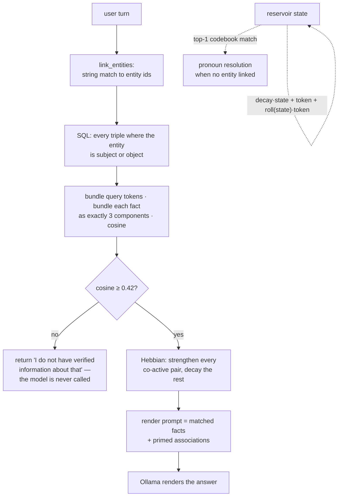

## 1. Executive Summary

Hillock is a local, single-user memory prototype: 1,754 lines of Python across eight files, licensed AGPL-3.0 with a contributor licence agreement its README says exists to preserve the option of commercial dual-licensing later. It stores facts as triples in SQLite, tracks Hebbian co-activation weights between entities, and holds a 10,000-dimensional hypervector space for matching. Its README opens by calling it a work in progress that "isn't all that yet", which is both true and the reason it is worth reading.

Two things make it interesting to this atlas, and neither is the hyperdimensional computing.

**The refusal is control flow rather than instruction.** In `main.py`, the local model is only invoked *after* the symbolic layer has matched at least one stored fact above a similarity threshold, and it is handed those facts to render. When nothing matches, the function returns a fixed string — *"I do not have verified information about that"* — and no model is called at all. Almost every system in this corpus that promises not to hallucinate does it by asking a model to say "I don't know"; this one makes the question unaskable. That is a structurally different guarantee, and it is twelve lines of `if`.

**It publishes four numbers against itself, all under 31%.** Extraction precision 10.6%, extraction recall 22.7%, retrieval accuracy 30.0%, gate accuracy 30.0% — on the README, above the install instructions, with an explanation of why. The harness that computes them is committed, and so is the whole benchmark: thirty sentences, thirty questions, twenty answerable with expected subject-predicate-object, and ten hard negatives each annotated with the reason it is unanswerable. What is not committed is any run output.

**The fading-context reservoir leaves its zero state because the token is added to it directly.** `step` computes `state = decay*state + token_hv + roll(state)*token_hv`, and the middle term is what makes the recurrence go anywhere: without it every term is proportional to the state, and a zero-initialised vector maps to zero forever. Reproducing both forms in separate code, the old rule holds a norm of `0.0` across five steps and the current one climbs `8.0 → 34.4`. The added term also does more than revive the state: `get_context_fingerprint` scores the state against *unbound* codebook entity vectors, so a purely permutation-bound state would have had no component to align with them.

Against that, two findings that reading the code produces and the README does not.

The **gate's operating point is a function of how long the question is.** Facts are bundled from exactly three components — a deliberate normalization the README explains — while the query is bundled from all its tokens, and both are compared against a fixed `0.42`. Holding the overlap constant, cosine falls as the query lengthens, so the same fact clears the gate for a short question and is blocked for a longer one.

And the **published gate accuracy does not measure gating.** `gate_acc = (correct_blocks + correct_answers) / len(questions)` pools blocking on the ten negatives with answering on the twenty positives. Read against the other published number, the pooled figure implies the gate blocked three of ten hard negatives.

## 2. Mental Model

A memory here is a **triple** — `Marie_Curie → born_in → Poland` — and nothing else is durable except the strength of association between two entities.

A fact becomes a memory when a local model extracts it, either from an ingested document or from a sentence the user typed that parses as a declaration. There is no admission gate, no confidence, and no review: `update_relation` is called and the triple is in the store. A fact stops being a memory when a later assertion overwrites it — which happens only for five named functional predicates, `born_in`, `died_in`, `capital_of`, `place_of_birth` and `place_of_death` — or when `/reset` drops all three tables. Every other relation accumulates. There is no per-fact deletion, no status, no timestamp, and no record that anything was ever removed.

So the epistemic vocabulary is thin by construction: **everything stored is treated as true**, and the entire trust decision has been moved from the store to the read path. That is a coherent position for a prototype and it puts unusual weight on the gate.

The second durable structure is associative rather than propositional. `HebbianPlasticityEngine.update_associations` takes the set of entities active on a turn and, for each pair, moves their weight toward 1.0:

```python
new_w = current_w + self.eta * (1.0 - current_w)      # eta = 0.15
```

then multiplies every pair *not* co-active this turn by `1 - decay` (0.01). Reinforcement is asymptotic and cannot exceed one; decay is per-turn rather than per-unit-time, so an association fades by conversational distance rather than by the calendar — which is consistent, since no row in this schema carries a time at all. These weights survive the session in SQLite. They are used to prime the renderer with related concepts, never to select which facts answer a question.

The third structure does not survive anything. The codebook of random ±1 hypervectors is an in-process dictionary, allocated lazily on first sight of a token, and the reservoir state is a NumPy array in memory. Both are rebuilt from scratch on every launch, so a given entity's hypervector is a different random vector in every run. This does not affect correctness — similarity is computed between vectors from the same run — but it means the vector layer holds no memory in the sense this atlas uses the word.



## 3. Architecture

A console program. `python main.py` opens a REPL against a local Ollama endpoint; there is no server, no API and no importable library boundary.

- **`main.py`** (27.8 KB) — the loop, entity linking, the HDC matcher, the gate, extraction prompts, and the three verbosity modes.
- **`database.py`** — three-table SQLite schema and all SQL.
- **`plasticity.py`** — the Hebbian engine, also over the same SQLite file.
- **`reservoir.py`** — 45 lines of VSA context math.
- **`ingestor.py`** — threaded chunking of `.txt` and `.pdf` into blocks of five sentences with two overlapping.
- **`talon_engine.py`** (14 KB) — an optional GPU relation extractor, discussed below and absent from the README's file list.
- **`evaluate_hillock_PROTO_ish.py`** (20.6 KB) — the benchmark.
- **`config.py`** — every tunable constant in one place, which at this size is the right call.

### Deployment and ergonomics

The dependency list is `numpy`, `psutil`, `pypdf` — three lines, unpinned — plus Ollama and a pulled model. That is genuinely light, and the claim the README opens with, that a vector database felt too heavy for a local chatbot, is supported by what the repository actually asks you to install.

The store is one SQLite file of three small tables, so it is inspectable and repairable with any SQL client, and `/reset` re-seeds ten entities and seven relations so a fresh database is never empty. Nothing runs in the background; every write, decay step and query happens inline on the turn.

**`talon_engine.py` is where the install cost changes, and it carries a hazard worth stating plainly.** It loads `jackboyla/glirel-large-v0` through HuggingFace, and to do so it disables a safety check:

```python
transformers.utils.import_utils.check_torch_load_is_safe = lambda: None
transformers.modeling_utils.check_torch_load_is_safe = lambda: None
```

That check is what refuses to deserialize a `torch.load`-format checkpoint, which is a pickle and therefore an arbitrary-code-execution surface; the comment above it calls it a "security block". A third patch overrides `GLiREL._from_pretrained` similarly. Two things bound the risk and both should be said. `transformers`, `torch` and `glirel` are not in `requirements.txt`, so a reader following the documented install gets `TalonEngine = None` and an inert path — the import is wrapped in `try/except ImportError` and the initializer in a second `try`, so it fails closed twice. And it is opt-in hardware-specific code, hardcoded to `cuda:0`. But a contributor who installs the stack to work on ingestion turns off a deserialization guard for a remotely-fetched checkpoint, and nothing in the README tells them so.

## 4. Essential Implementation Paths

### The gate — `main.py`, `select_answering_facts`

The query is bundled into one hypervector by summing the codebook vector of every token. Each candidate fact is bundled from **exactly three components**: resolved subject, resolved object, and a single best-matching predicate word chosen from a small hand-written synonym table (`born_in` also matches "born", "in", "birth"). Cosine is taken between the two bundles and compared against `HDC_THRESHOLD = 0.42`.

The three-component rule is deliberate and the README explains it: holding every fact to the same number of components keeps a short fact from scoring higher than a long one for structural rather than semantic reasons. That reasoning is right, and it is more care than most threshold-based retrieval in this corpus receives.

The unhandled half is that the *query* side has no such rule. Tokens are deduplicated by resolved identity and anything of two characters or fewer is dropped unless it is a known entity — which removes `a`, `of`, `in` and `me` — but what survives is still an unbounded bundle compared against a bundle of three. Bundling n random ±1 vectors against three gives a cosine of roughly `k / sqrt(3n)` for k shared components, so the score falls as the question gets longer while the threshold stays at `0.42`. Simulating the geometry with two shared components and 10,000 dimensions:

| Surviving query components | Cosine | Against a 0.42 threshold |
| --- | --- | --- |
| 3 | 0.674 | pass |
| 5 | 0.518 | pass |
| 6 | 0.474 | pass |
| 8 | 0.411 | **block** |
| 10 | 0.363 | **block** |

Same fact, same overlap, opposite outcomes. The two-character filter barely moves this, because English question words are longer than two characters: of the benchmark's own phrasings, *"Where was Alan Turing born?"*, *"Who did Turing work with?"* and *"What did Marie Curie discover?"* lose nothing at all, and *"Could you tell me where Alan Turing was born?"* loses one token. "Where was Turing born?" and the longer form are still not the same query to this gate. For a system whose central claim is refusing to answer when it should, the threshold is the most important number in the repository, and it is calibrated against an unstated assumption about question length. Normalising the query side the way the fact side is normalised — a fixed component budget, or dividing by the component count — is the change the fixed threshold is waiting for.

### The refusal — `main.py`

Three `return` statements produce `DETERMINISTIC_GATED_FALLBACK`, and what matters is where they sit. The Ollama call is inside the branch that has already matched facts; every path that fails to match returns the fixed string first. The model is never given a question without evidence, so it has no opportunity to answer one from parametric knowledge.

That is the strongest idea here and it generalizes past the prototype. A system prompt saying "only answer from the provided context" is a request; a control-flow structure in which the un-evidenced case never reaches the model is a property. The cost is equally structural: everything the model could legitimately have contributed — paraphrase, arithmetic, combining two facts — is also unreachable, and the system's ceiling is whatever its triple extractor managed to store.

### Correction — `database.py`, `update_relation`

```python
SINGLE_VALUED_PREDICATES = {"born_in", "died_in", "capital_of", "place_of_birth", "place_of_death"}
...
if predicate in SINGLE_VALUED_PREDICATES:
    cursor.execute("DELETE FROM relations WHERE source_id = ? AND predicate = ?", (src_key, predicate))
cursor.execute("INSERT OR REPLACE INTO relations VALUES (?, ?, ?)", (src_key, predicate, tgt_key))
```

Correction is destructive and unrecorded where it happens at all: the prior object is gone, with no supersession pointer, no tombstone, no event and no timestamp. Re-ingesting the same document re-derives the same fact, and nothing consults what a user previously replaced.

**The allowlist is the whole correction policy, and it reaches one of the predicates this system produces.** `predicate_map` in `main.py` normalises everything the extractor emits into four canonical forms — `born_in`, `collaborated_with`, `discovered`, `cracked` — of which only `born_in` appears in the set. `capital_of` exists only in the seed data; `died_in`, `place_of_birth` and `place_of_death` appear nowhere but this set and the optional GLiREL label list in `talon_engine.py`. Anything the model extracts under an un-normalised predicate — the README's own example of extraction noise is `[Grace_Hopper] -[became_a_pioneer]-> […]` — is append-only by construction.

So a user who corrects "Marie Curie discovered Radioactivity" leaves both triples in the store, and both are candidates at the next retrieval. The arrangement protects multi-valued relations from data loss and makes single-valued correctness depend on a hand-maintained set of five strings meeting a predicate vocabulary that a language model invents at ingest time. A `functional` column on the predicate, or a supersession row instead of a `DELETE`, would not have that coupling.

### Writes — `main.py`, conversational learning

A user sentence that is not a question goes to a two-pass extraction prompt, and if it parses, `update_relation` is called immediately: *"I have recorded a new factual declaration."* There is no confirmation, no provenance, and no distinction in the store between a fact extracted from an ingested PDF and one the user asserted in passing. Everything the gate later protects rests on this being right.

### Ingestion — `ingestor.py`

Documents are split into blocks of five sentences with two overlapping, dispatched to worker threads (`MAX_WORKERS = 1` by default, with a comment noting the GTX 1070 it was tuned on), and each block is sent to the model for triple extraction. The overlap is a sensible cheap defence against a fact straddling a chunk boundary; the deduplication that would otherwise imply is handled by the triple primary key.

## 5. Memory Data Model

Three tables. `entities(id, name, type)`, `relations(source_id, predicate, target_id)` with the triple as primary key and cascading foreign keys, and `hebbian_weights(entity_a, entity_b, weight)` with the pair as primary key.

What is absent is easier to list than what is present: no timestamp, no provenance, no confidence, no status, no source document, no scope key, no version, no soft-delete column. A stored fact carries exactly its three strings.

Two smaller observations. `PRAGMA foreign_keys = ON` is set on the connections in `_initialize_db` and `update_relation`, but SQLite applies that pragma per connection, and `plasticity.py` opens its own connections without it — so the cascade the schema declares does not apply on the writer that touches entity pairs most often. It happens not to matter, because nothing deletes an entity row outside the full reset. And `hebbian_weights` rows are decayed but never pruned, so the table grows monotonically with the number of entity pairs ever co-active.

## 6. Retrieval Mechanics

Three stages, all on the turn. `link_entities` matches query tokens against entity ids by string; a single SQL statement fetches every triple where a linked entity is the subject *or* the object, which is a one-hop neighbourhood rather than a traversal; the HDC matcher scores and thresholds them.

`query_relation` carries a small fallback worth naming: if the exact predicate misses, it stems both sides — stripping `ed`, `ing`, `s` and collapsing separators — and accepts a substring match in either direction. It is crude and it is honest about being crude, and for a triple store whose predicates come out of a language model with no controlled vocabulary, some such tolerance is unavoidable.

The failure mode is the one the benchmark measures. Extraction produces predicates like `became_a_pioneer` where the query expects `developed`, and no amount of matcher tolerance recovers a relation the extractor never formed. Retrieval quality here is bounded above by extraction quality, and extraction recall is the lowest of the four published numbers.

## 7. Write Mechanics

Every write is synchronous and inline. The user waits for extraction on a conversational assertion; ingestion of a document blocks the console. There is no queue, no background pass and no re-indexing, which for a store of a few thousand triples is a reasonable trade and one the README implicitly makes by targeting a single local user.

Deletion is `/reset` and nothing else. Conflict handling does not exist as a concept: a contradicting assertion is an overwrite, and two facts that disagree can only coexist if their predicates differ.

### Operational cost

- **The write path is synchronous** and dominated by a local model call per block or per assertion.
- **The lag before a memory is retrievable is zero** — the fact is in SQLite before the turn returns.
- **No background pass rewrites the store**, so nothing can silently undo a correction. In a corpus where most deletion claims expire at the next scheduled job, "there are no scheduled jobs" is a real property rather than a missing feature.
- **The read path injects only matched triples plus primed associations**, so the prompt grows with the number of matching facts and nothing bounds it explicitly.

## 8. Agent Integration

There is none, and the report should be plain about it. Hillock is a console application with a hardcoded Ollama URL; there is no MCP server, no HTTP API, no plugin contract and no packaging beyond `requirements.txt`. `/ingest`, `/mode` and `/reset` are the whole surface. Adapting it for another agent means importing `main.py`'s class and calling `execute_chat_turn`, which is possible — the return tuple carries the mode string — but nothing in the repository is arranged for that.

## 9. Reliability, Safety, and Trust

Strengths:

- **The un-evidenced case never reaches the model**, which is a property rather than an instruction.
- **The benchmark's hard negatives are committed with their reasoning**, ten of them, each annotated with why the text does not support an answer.
- **Facts are normalized to a fixed component count before comparison**, so fact length does not distort ranking.
- **Every hyperparameter is in one file**, named, with the calibrated threshold marked as calibrated.
- **The optional GPU path fails closed twice** — on import and on initialization.
- **No background job can undo a correction**, because there are none.
- **The published numbers are unflattering and prominent**, with a written account of why they are low.

Gaps:

- **The reservoir has no test.** The recurrence that revived it is one term in one line, and nothing asserts the state changes when a token is fed to it.
- **The gate's threshold is length-sensitive**, so admission depends on phrasing in a way nothing in the repository states.
- **The published gate accuracy pools blocking with answering**, and the pooled number is dominated by the twenty answerable questions.
- **Correction reaches one predicate the system actually produces**, and is destructive and unrecorded where it does.
- **Nothing stored carries provenance, time or trust**, so a user assertion and a PDF extraction are indistinguishable afterwards.
- **No scope of any kind**, which is consistent with one local user and worth stating anyway.
- **`talon_engine.py` disables a checkpoint-deserialization guard** for anyone who installs the optional stack.
- **A stated capability rests on a component that does not run**, which is the general form of the first gap and the one a reader should check for themselves before adopting anything here.

## 10. Tests, Evals, and Benchmarks

**There is no test suite.** No `tests/` directory, no test file, no assertion outside the benchmark. For 1,754 lines that is defensible; it also means the inert reservoir had nothing to fail.

**I ran nothing from this repository.** The screen found no auto-executing surfaces and no dependency inside the cooldown, but the benchmark requires a local Ollama with a pulled model and its numbers are model-dependent by construction. The reservoir and matcher findings above are static — the first from reading the recurrence, the second from simulating the bundling geometry in my own code rather than by importing theirs.

`evaluate_hillock_PROTO_ish.py` is better than its filename. It writes its own fixtures — a thirty-sentence corpus and a thirty-question set — wipes the database first so a run cannot inherit state, ingests, queries, and scores four metrics. Twenty questions carry an expected subject, predicate and object; ten are negatives, each with an inline comment giving the reason: *Newton is 1600s, Tesla is 1800s*; *Curie discovered radioactivity, Einstein didn't*; *Enigma is target object, testing link-routing direction*. Those ten are committed cases asserting that particular material must not be returned on a read path, which is the [negative retrieval assertion](../../patterns/rejected-value-tombstone/) this atlas counts, and annotating each with its rationale is rarer than the assertion itself.

Two things are wrong with the scoring, and they are worth separating from the low scores themselves.

**`gate_acc` is not a gate metric.** The formula is `(correct_blocks + correct_answers) / len(questions)` — thirty questions, of which twenty are answerable — so a system that answered every answerable question and blocked nothing would score 66.7% on a metric the README labels *"Gating success rate (blocking unanswerable queries/hard negatives)"* and the script labels *"Hallucination defense rate"*. A system that blocked everything would score 33.3%, which is higher than the 30.0% reported. Pooling a positive obligation with a negative invariant into one scalar is exactly the failure the [AOEP-v0 protocol](../../benchmarks/#aoep) separates its scorecard to avoid, and this is the clearest live instance of it in the corpus.

**The two published numbers together imply the gate's actual performance.** With `retrieval_acc = correct_answers / 20 = 30.0%`, `correct_answers` is 6; with `gate_acc = (correct_blocks + 6) / 30 = 30.0%`, `correct_blocks` is 3. So the hard-negative block rate behind the headline "Gate Accuracy 30.0%" is **three of ten**, and seven of the ten baited queries produced what the script itself names a `HALLUCINATION_LEAK`. The reported figure is not wrong arithmetic; it is a label that does not describe its formula.

**No run output is committed** — no JSON, no log, no results file — so the four README numbers rest on the author's report of a local run. The harness and the full fixture set being committed puts this well ahead of the published-numbers-without-artifacts antipattern this atlas names elsewhere, and one committed output file would close the gap entirely.

**No paper, arXiv reference or citation file exists in this repository.**

## 11. For Your Own Build

### Steal

- **Make the refusal control flow.** If the retrieval step returns nothing, return a fixed string and do not call the model. A prompt asking a model to decline is a request; a branch that never reaches the model is a guarantee, and it costs less code than the prompt does.
- **Normalize what you compare before you threshold it.** Holding every candidate to the same component count so length cannot inflate similarity is the right instinct — and then apply it to *both* sides, or the fixed threshold you calibrated moves under you.
- **Commit the negatives with their reasons.** Ten unanswerable questions, each with a comment saying why the source text does not support an answer, are worth more than a hundred recall cases, and the comments are what let a later reader check the test rather than trust it.
- **Publish the number that embarrasses you**, with the diagnosis beside it. This README's account of why a *better* extraction model scored worse against an exact-string harness is more useful than any of its four scores.
- **Put every constant in one file and mark the ones you calibrated.** At this size it turns "what would I tune" into a five-minute question.
- **Decay by turn when you have no clock.** If nothing in the schema carries a timestamp, decaying associations per interaction is coherent; adding a half-life in days would not be.

### Avoid

- **A recurrence with no additive term.** `state = decay*state + f(state, token)` is zero-preserving, and a zero-initialised state stays zero forever however long you run it. The assertion that catches it is one line — feed a token, check the norm moved — and it belongs beside any state you carry across turns.
- **A hand-maintained list of which predicates are functional.** If the vocabulary is invented by a language model at ingest time and the list is five strings in a source file, the two will not meet. Put the property on the predicate, or supersede instead of deleting.
- **A threshold calibrated against one input shape.** If the score depends on a property of the query the threshold does not know about — length, token count, language — the gate is measuring phrasing as much as relevance.
- **A single scalar over positive and negative obligations.** Blocking what must be blocked and answering what must be answered are different jobs with opposite degenerate solutions; a pooled score hides which one you failed.
- **Keying a correction on `(subject, predicate)` for every relation.** It silently makes them all functional, and the first multi-valued predicate you meet loses data with no error — but narrowing it to an allowlist trades that for relations nobody can correct at all. Both failures are quiet.
- **Disabling a deserialization guard to load a model**, especially in a module the README does not list. If the optional path needs it, say so where the person installing it will read it.

### Fit

This is a prototype and says so, so the question is not whether to deploy it but what to take from it. The gate is the answer: it is the cleanest demonstration in this atlas that "the system will not answer without evidence" can be a structural property, and it fits in a file you can read in one sitting. Take that.

Do not take the storage layer. Three strings per fact with no time, no source and no status is below the floor for anything that has to be corrected later, and the destructive update makes the first multi-valued predicate a data-loss event. Anyone who wanted to build on this would be adding those columns before adding anything else — which is a compliment to how little else is in the way.

The hyperdimensional layer is the part to be most careful about, and not because the idea is wrong. Gradient-free symbolic vector matching over a codebook is a real technique with a real literature, and the matcher here is a working instance of it. But the reservoir beside it does nothing, the codebook is rebuilt every launch, and the README describes both as capabilities. A reader attracted by the architecture should verify which half runs.

## 12. Open Questions

- Does the revived reservoir resolve pronouns correctly in practice, or does the bundle term dominate the permutation-bound term enough that word order stops mattering?
- Is the five-predicate allowlist meant to grow with the extractor's vocabulary, and what maintains it?
- Where did `HDC_THRESHOLD = 0.42` come from, and against what distribution of query lengths?
- What is the intended behaviour for a genuinely multi-valued predicate — is `collaborated_with` meant to hold one target, or is the `DELETE` an oversight?
- Is `talon_engine.py` intended as the default ingestion path once the dependencies are declared, and does the author know the patch disables a `torch.load` guard?
- Do the four README numbers come from one run, and would committing that run's output be acceptable given it depends on a local model? They describe the extraction and gating behaviour of a prior version; three of the four inputs to them have changed since.

## Appendix: File Index

- Gate, matcher, entity linking, console loop: `main.py` (`select_answering_facts`, `execute_chat_turn`, `link_entities`, `resolve_entity_identity`).
- Schema and all SQL, including the destructive correction: `database.py` (`update_relation`, `query_relation`, `get_all_facts_for_entities`).
- Hebbian reinforcement and decay: `plasticity.py` (`update_associations`, `get_associated_priming_context`).
- VSA context math: `reservoir.py` (`step`, `get_context_fingerprint`).
- Document chunking and the optional GPU extractor: `ingestor.py`, `talon_engine.py`.
- Benchmark, fixtures and metrics: `evaluate_hillock_PROTO_ish.py` (`generate_test_assets`, `run_evaluation`).
- Hyperparameters: `config.py`.

## History

**2026-08-12** — [`a0499a55d0e44787dc0df03f4661dd9b0e7c9480`](https://github.com/roandejager/Hillock/commit/a0499a55d0e44787dc0df03f4661dd9b0e7c9480) — re-read one day past the first pin, at v0.2.3, two commits later. Screened again before reading: 0 auto-run surfaces, 0 build-time exec, nothing inside the cooldown, one unpinned manifest; nothing was installed and nothing from the repository was executed.

[`348f08341e7b9dfd42a10d5a23b855e4bd46d0a1`](https://github.com/roandejager/Hillock/commit/348f08341e7b9dfd42a10d5a23b855e4bd46d0a1) changes three things in twenty-five added lines. `reservoir.step` gains `+ token_hv`, so the recurrence has an additive term and a zero-initialised state leaves zero — reproducing both forms in separate code, the previous rule holds a norm of `0.0` across five steps where the current one climbs to `34.4`. `update_relation` narrows its `DELETE` to a set of five named functional predicates, so a second `collaborated_with` no longer removes the first. And `select_answering_facts` deduplicates query tokens by resolved identity and drops tokens of two characters or fewer.

**What the second fix trades.** Removing the data loss for multi-valued relations leaves correction reaching only `born_in`: `predicate_map` normalises the extractor's output into `born_in`, `collaborated_with`, `discovered` and `cracked`, and only the first is in the allowlist, while `died_in`, `place_of_birth` and `place_of_death` appear nowhere else in the tree but the optional GLiREL label list. A corrected `discovered` fact now leaves both triples in the store. The report's previous statement — that the delete keyed on `(subject, predicate)` made every relation functional — was accurate at that pin and describes a defect the project has replaced with a narrower one.

**What the third fix does not change.** The report's claim that the gate's operating point moves with question length holds at this commit: the fact side is still exactly three components, the query side is still unbounded, and `HDC_THRESHOLD` is still `0.42`. The two-character filter removes nothing from three of the benchmark's own four sample phrasings and one token from the fourth, so the crossover between passing and blocking still sits between six and eight surviving components.

The README, its four published metrics and `config.py` are untouched by the commit, so the numbers on the front page describe the extraction, matching and gating behaviour of the previous version.

**2026-08-11** — [`62f75e0c2b70a92991b47c14b320742b026ad3ce`](https://github.com/roandejager/Hillock/commit/62f75e0c2b70a92991b47c14b320742b026ad3ce) — first reading, on the `master` default branch, at the fifty-sixth commit of a repository created 11 June 2026. Screened before reading: 0 auto-run surfaces, 0 build-time exec surfaces, 0 dependency surfaces inside the cooldown, 1 unpinned manifest (`numpy`, `psutil`, `pypdf`, none pinned); nothing was installed and nothing from the repository was executed. The reservoir and gate-geometry findings were checked by reproducing the arithmetic in separate code rather than by importing the modules.
