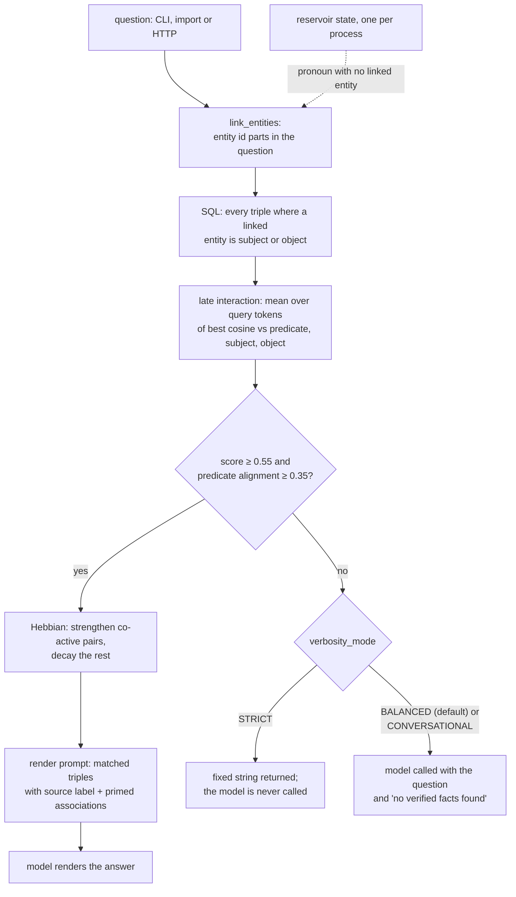

## 1. Executive Summary

Hillock is a local, single-user memory engine. A local extraction pipeline turns
documents into subject-predicate-object triples in SQLite, entities that answer
a question together gain Hebbian co-activation weights, and a 10,000-dimensional
hypervector gate decides which stored triples may answer a question. It runs as
a console, as an importable class, and as an OpenAI-compatible HTTP server.

**The gate decides what memory the model sees.** A stored fact reaches the
render prompt only after it clears `HDC_THRESHOLD` and a predicate-alignment
floor (`engine.py:247`). In `STRICT` mode a question with no fact above the gate
returns a fixed string and no model is called (`engine.py:328-331`). That is a
branch rather than a prompt, and it is the part of this repository to take.

**The default mode sends the blocked question to the model anyway.**
`verbosity_mode` starts as `BALANCED` (`engine.py:32`). In `BALANCED` and
`CONVERSATIONAL`, a question whose facts all fail the gate goes to the model with
a system prompt asking it to say it does not know (`engine.py:334-338`,
`:350-357`). No stored fact is in that prompt, so memory stays gated, and whether
the answer comes from the model's own weights is left to the model. The HTTP
server has no route that changes the mode. The README's claim that the gate
stops questions before they reach the model describes `STRICT` only.

**The gate's score falls as a question gets longer.** It is the mean, over query
tokens, of each token's best cosine against the fact's components
(`reservoir.py:261-290`), so tokens that match nothing pull it down. Under the
subword encoder alone, the regime `verify_hillock.py` forces, *"Where was Marie
Curie born?"* scores 0.525 against its own exact triple and blocks at 0.55. The
three-token negative *"Who cracked Enigma?"* scores 0.682 and passes. Over a
store holding exactly the benchmark's target facts, one answerable question
clears the gate.

**The HTTP server has no authentication and one shared context.** `api.py` binds
`0.0.0.0:8000` (`api.py:96`) where the README says localhost, and routes every
request to one engine over one store. Each answered question writes Hebbian
weights, and pronoun resolution reads a reservoir state that every caller's
tokens have advanced (`engine.py:271-291`). The server cannot ingest, delete or
reset.

One mark, `negative_eval`: the benchmark commits ten questions that must be
blocked beside 22 that must be answered, scored on the gate's own read path.
Section 9 names the six withheld marks and the near-miss behind each.

## 2. Mental Model

A memory is a **triple**, `Marie_Curie → born_in → Poland`, with a label naming
the file it came from. The only other durable structure is the strength of
association between two entities.

A fact becomes a memory when `/ingest` extracts it from a `.txt` or `.pdf`
(`ingestor.py:134-135`). Nothing is written from conversation: a declarative
sentence typed at the console or sent to the server is not a question, so it
reaches the refusal branch (`engine.py:295`, `:325`). A fact stops being a
memory in two ways. The disambiguation quiz that follows an ingest deletes a
triple whose subject or object is a pronoun and inserts the user's replacement
(`engine.py:65-90`), and `/reset` drops all four tables. Every other triple is
permanent, and a second `born_in` for the same person sits beside the first.

**Everything stored is treated as true.** There is no status and no filter on
the rows, so the whole trust decision lives in the gate on the read path.

The second durable structure is associative. `update_associations` takes the
entities active on an answered turn and moves each pair's weight toward 1.0:

```python
new_w = current_w + self.eta * (1.0 - current_w)      # eta = 0.15
```

then multiplies every pair not co-active this turn by `1 - decay`, with decay
0.01 (`plasticity.py:37`, `:44-48`). Decay is per answered turn, not per unit of
time. The weights prime the renderer with related concepts and never select
which facts answer.

The third structure does not survive a restart. The codebook is an in-process
dictionary, and every vector in it is a pure function of its string:
`resolve_predicate_hypervector` sums the MD5-seeded ±1 vectors of the string's
character 3-, 4- and 5-grams, and adds a SimHash projection of its GloVe vector
when one exists (`reservoir.py:228-241`). Strings that share n-grams get
correlated vectors: `born` against `born_in` is +0.315 and `discover` against
`discovered` is +0.551. That is how a query token reaches a stored predicate
without a synonym table. The fading-context reservoir is a NumPy array updated
per token as `decay*state + token + roll(state)*token` (`reservoir.py:243-248`);
its top codebook match resolves a pronoun when no entity links.


```mermaid
%% caption: a stored fact reaches the model only after clearing the gate, while in the default BALANCED mode a blocked question goes to the model with a refusal prompt
flowchart TD
  Q["question: CLI, import or HTTP"] --> L["link_entities:<br/>entity id parts in the question"]
  L --> F["SQL: every triple where a linked<br/>entity is subject or object"]
  F --> M["late interaction: mean over query tokens<br/>of best cosine vs predicate, subject, object"]
  M --> G{"score ≥ 0.55 and<br/>predicate alignment ≥ 0.35?"}
  G -->|yes| H["Hebbian: strengthen co-active pairs,<br/>decay the rest"]
  H --> P["render prompt: matched triples<br/>with source label + primed associations"]
  P --> O["model renders the answer"]
  G -->|no| MODE{"verbosity_mode"}
  MODE -->|STRICT| R["fixed string returned;<br/>the model is never called"]
  MODE -->|"BALANCED (default) or<br/>CONVERSATIONAL"| RP["model called with the question<br/>and 'no verified facts found'"]
  S["reservoir state, one per process"] -. "pronoun with no linked entity" .-> L
```

## 3. Architecture

Twelve Python modules at the repository root, installable as a package whose
`hillock` command runs the console (`pyproject.toml:36-37`).

- **`engine.py`** — `IntegratedHillock`: entity linking, the gate, the refusal
  branch, the three verbosity modes and the disambiguation helpers.
- **`main.py`** — the console REPL and its slash commands.
- **`api.py`** — the FastAPI server, one route that calls `execute_chat_turn`.
- **`database.py`** — the four-table SQLite schema and all fact SQL.
- **`plasticity.py`** — the Hebbian engine over the same file.
- **`reservoir.py`** — the subword encoder, the SimHash projection, the reservoir,
  bit-packed late interaction, and the GloVe loader.
- **`ingestor.py`** and **`talon_engine.py`** — chunking and the extraction
  pipeline: coreference, predicate routing over a fifty-relation taxonomy, and
  GLiREL relation extraction.
- **`export_to_onnx.py`** — exports MiniLM for an optional CPU predicate router.
- **`evaluate_hillock_PROTO_ish.py`** and **`verify_hillock.py`** — the benchmark
  and the verification suite.
- **`config.py`** — every tunable constant in one place.

### Deployment and ergonomics

**The documented install puts the guard-disabling extractor on the default
path.** `requirements.txt` and `pyproject.toml` list `torch`, `transformers`,
`glirel`, `fastcoref`, `spacy` and `sentence-transformers`
(`requirements.txt:8-13`), and `run.sh` installs them (`run.sh:15`).
`talon_engine.py` replaces HuggingFace's `check_torch_load_is_safe` with a no-op
at import time (`talon_engine.py:22-27`). That check refuses to deserialize a
`torch.load` checkpoint, which is a pickle and so a code-execution surface.
`main.py` imports `ingestor.py`, which imports `talon_engine.py`
(`ingestor.py:26`), so the console runs with the guard off from startup. The
server imports only `engine.py` and never loads the extractor.

**A first run downloads 822 MB from a third-party host without asking.**
`IntegratedHillock.__init__` calls `load_lightweight_glove()`, which fetches
`glove.6B.zip` from `nlp.stanford.edu` when `glove.6B.50d.txt` is absent and
verifies nothing about what arrives (`reservoir.py:100-107`). The server does
this at import (`api.py:17`), so the first `python api.py` blocks on it.

**A store created before the provenance column cannot be read.** The schema is
`CREATE TABLE IF NOT EXISTS` with no `ALTER TABLE` anywhere, and every fact read
selects `source_doc` (`database.py:28-40`, `:188`). An existing `hillock_kg.db`
keeps its three-column `relations` table, and the first question that names a
stored entity raises from SQLite.

**`/inspect`, which the README offers for looking under the hood, raises on any
entity with a fact.** It unpacks three values from rows that carry four
(`main.py:152`), and the console loop catches only `KeyboardInterrupt`.

The store is one SQLite file in WAL mode, inspectable with any SQL client, and
`/reset` re-seeds ten entities and seven relations. Nothing runs in the
background.

## 4. Essential Implementation Paths

### The gate — `engine.py`, `select_answering_facts`

The query becomes a set of components: each token, mapped through a twenty-entry
`predicate_map` and resolved against entity ids, kept if longer than two
characters or known (`engine.py:200-209`). Each candidate fact becomes its
predicate's vector plus its resolved subject and object
(`engine.py:221-235`). `hydra_late_interaction_maxsim` takes, for each query
component, its best cosine against the fact's components, and averages those
over the query (`reservoir.py:261-290`). A fact passes when that mean reaches
`HDC_THRESHOLD`, 0.55, and some query component aligns with its predicate at
0.35 or more (`engine.py:247`).

**Averaging over the query makes the score a function of question length.** A
component that matches nothing contributes its best chance cosine, near zero,
so two exact matches in a three-component question score about 0.68, in four
about 0.52 and in five about 0.46. The threshold sits between the second and the
first. Reimplementing the subword encoder and the scoring in separate code, over
a store holding exactly the 22 target facts of the benchmark:

| Question | Components | Score against its own triple | At 0.55 |
| --- | --- | --- | --- |
| *Where was Marie Curie born?* | 4 | 0.525 | block |
| *Where was Bertrand Russell born?* | 4 | 0.553 | pass |
| *What did Alan Turing crack?* | 4 | 0.518 | block |
| *Who did Turing work with?* | 5 | 0.459 | block |
| *Who did Bertrand Russell collaborate with?* | 5 | 0.358 | block |
| *Who cracked Enigma?* (must block) | 3 | 0.682 | pass |

Twenty answerable questions have their expected triple in that store, and only
the Russell birthplace clears the gate, by three thousandths. Eleven *"Where was X
born?"* questions score between 0.525 and 0.553 on the same two exact matches;
the spread is the chance cosine of `where` and `was`, 0.057 and 0.043 for Marie
Curie. On the seed-only store that `verify_hillock.py` check 8 builds, the same
arithmetic gives `passes` 0 and `leaks` 1.

*These are the subword-only figures, which is what runs when the GloVe file is
empty or missing. With GloVe loaded, `where` and `was` carry semantic vectors
whose cosines against a fact I did not measure, so the absolute scores move; the
mean over query components does not depend on the regime.*

### The refusal — `engine.py`, `execute_chat_turn`

The model is called inside the matched branch with the facts, each tagged with
its source label (`engine.py:306-319`). When nothing matches, the mode decides.
`STRICT` returns *"I do not have verified information about that"* and calls
nothing (`engine.py:328-331`). `BALANCED` and `CONVERSATIONAL` build a prompt of
the question and *"Memory: No verified facts found."* and call the model, falling
back to the fixed string only if the call fails (`engine.py:334-343`). A
question of fewer than two words takes a greeting path that also calls the
model in `CONVERSATIONAL` (`engine.py:259-264`).

**In strict mode the property is structural; in the other two it is a request.**
No stored fact can reach the model without clearing the gate in any mode. Only
`STRICT` keeps the model from answering a question with no evidence behind it,
and the default is `BALANCED`.

### Correction and provenance — `database.py`, `engine.py`

Every fact write is `INSERT OR REPLACE` on the triple's primary key with the
file's basename as `source_doc` (`database.py:157-160`, `ingestor.py:134-135`).
**The provenance label is last-writer-wins.** When a second document yields the
same triple, the replace overwrites the label and resets `confidence` and
`created_at`, so the row names one source however many produced it. Two files
with the same basename in different directories get one label.

No supersession exists. A later `born_in` for the same subject is a second row,
and both are candidates at the next question. The disambiguation quiz is the one
path that removes a single fact: after `/ingest`, the console lists every triple
whose subject or object is a pronoun and, for each, deletes it and inserts the
user's answer with `source_doc = 'human_disambiguation'` and `confidence = 1.0`
(`main.py:188-205`, `engine.py:65-90`). A skipped fact stays live, and a pronoun
of three letters or more links as an entity (`engine.py:123-132`). A later
ingest that re-extracts the clarified triple replaces the human label.

### The HTTP server — `api.py`

`POST /v1/chat/completions` takes the last `user` message, drops the rest of
the conversation, and returns `execute_chat_turn`'s reply as a chat completion
(`api.py:42-50`). There is no authentication, no rate limit and no per-caller
state, and `uvicorn.run` binds every interface (`api.py:96`). What a caller can
read is any fact that clears the gate for a question it writes. What it can
write is Hebbian weights, through every answered question (`engine.py:304`),
and the shared reservoir state, through every question.

## 5. Memory Data Model

Four tables (`database.py:21-59`). `entities(id, name, type)`.
`relations(source_id, predicate, target_id, source_doc, confidence, created_at)`
with the triple as primary key and cascading foreign keys.
`hebbian_weights(entity_a, entity_b, weight)` keyed on the pair.
`hdc_reservoirs(doc_id, reservoir_vector, bound_path_count, created_at)` holds
one int8 multi-hop path vector per ingested document, written by ingestion
(`ingestor.py:174`) and read by no query.

**Three of the relation columns carry less than their names suggest.**
`source_doc` is read into every render prompt and the `BALANCED` system prompt
asks the model to cite it (`engine.py:308`, `:372`); no read filters on it.
`confidence` is written once, as 1.0 by the quiz, and read nowhere. `created_at`
is a record time that a replace resets, and it is read nowhere.

`PRAGMA foreign_keys = ON` is per connection in SQLite, and `plasticity.py`
opens its own connections without it. Only the full reset and the benchmark's
own emptying delete entities, so the cascade is never exercised.
`hebbian_weights` rows decay and are never pruned.

## 6. Retrieval Mechanics

Three stages, all inline. `link_entities` matches any part longer than two
characters of an entity id against the question's words (`engine.py:123-132`).
One SQL statement fetches every triple where a linked entity is subject or
object (`database.py:184-193`), a one-hop neighbourhood. The gate in section 4
scores and thresholds them, and every passing fact goes to the prompt, sorted by
score.

A question that names no stored entity retrieves nothing and is refused. A
question that names an entity by a first or last name links it through the
part match, so *"Who did Turing work with?"* finds `Alan_Turing`.

**The pass test is per fact and absolute**, so the number of facts in the prompt
is the number above 0.55 and nothing caps it.

## 7. Write Mechanics

`/ingest` reads the file, splits it into blocks, runs coreference, routes each
sentence to its likeliest predicates, and asks GLiREL for relations above a
threshold of 0.30 (`talon_engine.py:421`). Span cleaners, an origin-predicate
direction rule and a canonical key for symmetric predicates deduplicate within
the document (`talon_engine.py:516-526`). The triples are written in one
transaction (`database.py:146-161`), the active entities' Hebbian weights are
updated, and multi-hop path vectors go to `hdc_reservoirs`. The extractor's
models are unloaded after each ingest (`ingestor.py:223-224`).

There is no admission gate: whatever the extractor emits is stored and treated
as true. The quiz in section 4 is the only human step, and it runs after the
writes have landed.

### Operational cost

- **Ingestion is synchronous** and blocks the console; it needs the extraction
  stack, on CUDA when present and CPU otherwise (`ingestor.py:41-43`).
- **The lag before a memory is retrievable is zero**: it is in SQLite before
  `/ingest` returns.
- **No background pass rewrites the store**, so nothing can undo the quiz's
  replacement except another ingest of the same triple.
- **A question costs one SQL read, the gate, and at most one model call**, plus a
  Hebbian write when anything passes.

## 8. Agent Integration

Three surfaces. The console REPL, with `/ingest`, `/mode`, `/model`, `/inspect`,
`/status`, `/debug` and `/reset`. The `IntegratedHillock` class, whose
`execute_chat_turn` returns the reply, the primed associations, the context
fingerprint and the outcome label. And the HTTP server, which any client that
speaks OpenAI chat completions can point at.

The model side is any OpenAI-compatible `/v1/chat/completions` endpoint,
`LLM_BASE_URL`, defaulting to a local Ollama with `llama3.2` (`config.py:5-6`).
There is no MCP server, no tool surface for an agent to write memory, and no
route for ingestion. An agent that wants Hillock to remember something has to
put it in a file and have a person run `/ingest`.

## 9. Reliability, Safety, and Trust

**The gate holds for memory in every mode.** No stored fact reaches a prompt
without clearing it, and the fixed-string refusal in `STRICT` keeps the model
out entirely.

**The default mode trades that guarantee for tone.** A blocked question reaches
the model in `BALANCED`, the mode the server always runs in.

**The server is open to the network.** Binding `0.0.0.0` with no authentication
exposes every stored fact a question can reach, lets any caller shift Hebbian
weights, and lets one caller's tokens steer another's pronoun resolution.

**The extraction install disables a deserialization guard** for the whole
console process, on the install path the README recommends.

**Provenance is one label per triple** and the last writer sets it.

**Privacy.** Nothing leaves the machine except the first-run GloVe download and
whatever `LLM_BASE_URL` points at.

Capability marks:

- `tombstone` — withheld. The quiz deletes a pronoun triple with no record of
  the rejected value, and nothing stops the extractor from writing it again
  (`engine.py:75`).
- `trust_state` — withheld. `confidence` is a float that no read consults, and
  no row carries a status (`database.py:34`).
- `bitemporal` — withheld. `created_at` is a record time that a replace resets;
  no column holds when a fact was true (`database.py:35`).
- `scope_enforced` — withheld. The schema has no scope key, and the server
  serves every caller from one store and one reservoir (`api.py:17`).
- `audit_log` — withheld. The quiz's `DELETE` and every `INSERT OR REPLACE`
  leave no record of what changed (`engine.py:75`, `database.py:157-160`).
- `human_review` — withheld. The disambiguation quiz edits triples that are
  live and retrievable, and a skipped one stays live; that is editing
  after the write has landed.
- `negative_eval` — awarded on the benchmark's ten must-block questions; section
  10 gives the run and its limits.

## 10. Tests, Evals, and Benchmarks

**`verify_hillock.py` is 21 checks in eight areas** under a docstring calling it
a 20-point suite, runnable without a GPU or the extraction models, exiting
non-zero on any failure (`verify_hillock.py:197-201`). It covers seed counts,
the Hebbian constants against the README's arithmetic, encoder determinism and
binding orthogonality, the v0.4 span cleaners and canonical key, coreference
span replacement, the ingestion path's loud halt without its extractor, the
benchmark's seed overlap, and the gate's score distribution. No CI workflow runs
it.

**Check 1 asserts an overwrite the store does not perform.** It writes
`(Alan_Turing, born_in, Manchester)` over the seeded London and asserts that
`query_relation` returns Manchester (`verify_hillock.py:56-58`). Both rows
persist, and `query_relation` returns whichever row SQLite yields first, which
through the primary-key index is London. The stem-fallback check beside it expects
Manchester as well and meets London first. I did not run the suite.

**Check 8 computes the gate's two error counts and asserts neither.** It scores
every benchmark question against a seed-only store with the gate disabled, then
assigns `passes` and `leaks` and asserts `len(rows) == 32`
(`verify_hillock.py:183-193`). Neither name appears again in the repository. On
the reproduction in section 4, `passes` is 0 and `leaks` is 1.

**The benchmark harness carries the mark.** `generate_test_assets` writes a
32-sentence text and 32 questions: 22 with an expected subject, predicate and
object, and ten that must be blocked, each written to fail one way — an absent
person, a predicate the subject lacks, a relation asked in reverse, an identity
probe (`evaluate_hillock_PROTO_ish.py:56-89`). `run_evaluation` empties the
store and the in-process codebooks, ingests the text, and scores every question
through `link_entities`, `get_all_facts_for_entities` and
`select_answering_facts` (`:113-237`). It reports answerable retrieval accuracy
and hard-negative block rate as separate figures beside a pooled gate accuracy
(`:251-253`).

That separation is the positive control: a gate that blocked everything would
show a perfect block rate beside zero retrieval. The harness scores and does not
fail, it needs the extraction stack to populate anything, and no run output is
committed. The README publishes no scores at this commit; the version table it
carried until 24 September 2026 was removed in
[`95037d447d2b62de067d91b5b94be7df307676de`](https://github.com/roandejager/Hillock/commit/95037d447d2b62de067d91b5b94be7df307676de).

The negatives carry no stated reason at this commit: the inline comments that
gave one per question were removed on 2026-08-13 in
[`3fb3f6edfe36de2f9432403bab4ebd9f294b7e50`](https://github.com/roandejager/Hillock/commit/3fb3f6edfe36de2f9432403bab4ebd9f294b7e50).
Without its reason, *"Who cracked Enigma?"* reads as answerable from the stored
`Alan_Turing cracked Enigma`, and a gate that admits that triple counts a leak.

**I ran nothing from this repository.** The gate figures come from a separate
reimplementation of `SubwordHDCEncoder`, the late-interaction score and the
query-component rules, reproducing NumPy's seeded draws exactly in the Python
standard library and importing nothing from the tree. Its encoder figures match
the published ones above, `born`/`born_in` and `discover`/`discovered`.

No paper, arXiv reference or citation file is in the repository.

## 11. For Your Own Build

### Steal

- **Make the evidence gate a branch.** If no stored fact clears it, return a
  fixed string and do not call the model. Then make that the default, or the
  branch protects only the users who find the setting.
- **Commit must-block cases beside must-answer ones** and report the two rates
  separately, so a gate that blocks everything cannot score well. Keep the
  reason each must block in the fixture; without it a case can read as wrong.
- **Derive vectors from strings when you can.** An n-gram-seeded codebook is
  reproducible across restarts, needs no stored index, and gives morphological
  neighbours a shared component for the cost of a hash per n-gram.
- **Put every constant in one file and mark the calibrated ones.**
- **Decay by turn when nothing in the schema has a clock.**

### Avoid

- **A mean over query tokens against a fixed threshold.** Function words dilute
  it, so admission depends on phrasing. Score only content components, or set
  the threshold per component count.
- **A refusal that is a prompt in the default mode** of a system sold on not
  hallucinating.
- **A provenance column under `INSERT OR REPLACE`.** The replace keeps one source
  and resets the timestamp; provenance needs its own rows.
- **A schema change with `CREATE TABLE IF NOT EXISTS` and no migration.** Every
  existing store breaks on its first fact read.
- **An HTTP server on every interface with no authentication** in front of
  personal memory, and **process-wide conversational state** behind it.
- **A suite that computes the metric the threshold is tuned for and asserts the
  row count.** `passes > 0` is one line.

### Fit

Take the gate's control flow and the committed negatives; leave the store. A
triple with a last-writer label and no supersession cannot be corrected later,
and the gate's averaging needs reworking before its threshold means anything
across phrasings. Run the server only on a loopback interface, and set `STRICT`
in code if the refusal property is the reason you chose it.

## 12. Open Questions

- What do `passes` and `leaks` read on a real run with GloVe loaded? Check 8
  computes both on every run and discards them.
- Is `BALANCED` the default by intent, given the README's claim about the gate?
- Is the `0.0.0.0` bind meant, given the README's localhost URL?
- Is `confidence` meant to be read, and by what?
- Should *"Who cracked Enigma?"* block when the store holds who cracked it, and
  what reason did its removed comment give?

## Appendix: File Index

- Gate, refusal branch, modes, disambiguation helpers: `engine.py`
  (`select_answering_facts`, `execute_chat_turn`, `_get_mode_prompts`,
  `get_ambiguous_facts`, `resolve_ambiguous_fact`).
- HTTP server: `api.py` (`chat_completions`).
- Console and the quiz: `main.py` (`run_cli`).
- Schema and fact SQL: `database.py` (`_initialize_db`, `update_relations_batch`,
  `get_all_facts_for_entities`, `query_relation`).
- Hebbian weights: `plasticity.py` (`update_associations`,
  `get_associated_priming_context`).
- Encoder, reservoir, late interaction, GloVe loader: `reservoir.py`.
- Extraction: `ingestor.py` (`ingest_document_parallel`), `talon_engine.py`.
- Benchmark and suite: `evaluate_hillock_PROTO_ish.py`, `verify_hillock.py`.
- Constants: `config.py`. Packaging and launchers: `pyproject.toml`,
  `requirements.txt`, `run.sh`, `run.bat`.

### Recorded searches

Checked against the checkout at the pinned revision.

- `grep -rnE 'confidence|created_at' --include='*.py' .` — the two schema
  columns, the `hdc_reservoirs` timestamp, and the quiz's insert; no read.
- `grep -rni 'ALTER TABLE' --include='*.py' .` — no match.
- `grep -rniE 'user_id|tenant|namespace|project_id|scope|session_id' --include='*.py' .`
  — one match, *telescopes* in the benchmark text; no scope key.
- `grep -niE 'auth|token|api_key|Depends|Security|Header' api.py` — only the
  `usage` token counts in the response body.
- `grep -rnE '\.update_relation\(|update_relations_batch\(' --include='*.py' .` —
  ingestion and `verify_hillock.py:56`; no conversational writer.
- `grep -rn 'DELETE' --include='*.py' .` — the quiz's delete at `engine.py:75`,
  the benchmark's emptying at `evaluate_hillock_PROTO_ish.py:119-121`, and the
  schema's cascade clauses.
- `grep -rnE 'verbosity_mode\s*=' --include='*.py' .` — the `BALANCED` default
  and the console's `/mode`; nothing in `api.py`.
- `grep -rnwE 'passes|leaks' --include='*.py' .` — assigned at
  `verify_hillock.py:191-192` and used nowhere else; the other match is the
  comment on `HDC_THRESHOLD`.
- `grep -rnE 'get_canonical_triple_key|is_inverted_asymmetric_pair' --include='*.py' .`
  — `talon_engine.py` and `verify_hillock.py`; not `database.py`.
- `grep -rnE 'hdc_reservoirs|save_document_reservoir' --include='*.py' .` — the
  schema, the two drops, the writer and its one caller in `ingestor.py:174`; no
  `SELECT`.
- `git ls-files .github` — `FUNDING.yml` only; no workflow.
- `git ls-files | grep -iE '\.(json|log|csv)$|result|citation'` — no match; no
  run output and no citation file.
- `grep -rniE 'arxiv|bibtex|@article|@misc|doi\.org' --include='*.md' .` — no
  match.
- `grep -nE 'hashlib|sha256|md5' reservoir.py` — only the n-gram seeding; the
  GloVe download is not checked.
- Every search above was run with `/usr/bin/grep`. The repository's `.gitignore`
  lists `*PROTO*`, so a search tool that honours it skips the tracked benchmark
  file.
- The gate figures: a standalone reimplementation of `SubwordHDCEncoder.encode`,
  `hydra_late_interaction_maxsim` and the component rules of
  `select_answering_facts`, with NumPy's legacy `RandomState` draws reproduced
  from MT19937 in the standard library, run over the seed store and over the
  benchmark's target facts.

## History

**2026-10-03** — [`92eebfb9caf42a75ec89a678c26e67c3c94c0845`](https://github.com/roandejager/Hillock/commit/92eebfb9caf42a75ec89a678c26e67c3c94c0845) — 24 commits on, v0.6.0 to v0.8.0. Screened: `pyproject.toml`, new, and `requirements.txt` inside the cooldown and unpinned; no auto-run or build-time surface; nothing installed, built or run. New: an unauthenticated HTTP server, a default mode that sends blocked questions to the model, a pronoun quiz, a last-writer provenance column, and requirements that install the guard-disabling extractor ([section 3](#3-architecture)). `negative_eval` holds, with the answerable questions as its positive control; the new columns earn no mark ([section 9](#9-reliability-safety-and-trust)). Corrected, wrong at the previous pin: the body described query bundling, replaced by late interaction in v0.6; conversational fact writes, removed on 2026-08-12; a five-predicate correction rule the previous pin had commented out; and a pooled gate metric the harness split on 2026-08-23. [Section 4](#4-essential-implementation-paths) recomputes the gate.

**2026-09-17** — [`94e6ae1be4b4a08ccb0bcd38559ab40dfe4b9244`](https://github.com/roandejager/Hillock/commit/94e6ae1be4b4a08ccb0bcd38559ab40dfe4b9244) — re-pinned after 1 commit. Both anchored files are byte-identical at both commits, so the mark stands on unchanged code and every anchor here is exact at the new pin. Nothing was installed, built or run.


**2026-08-30** — [`94e6ae1be4b4a08ccb0bcd38559ab40dfe4b9244`](https://github.com/roandejager/Hillock/commit/94e6ae1be4b4a08ccb0bcd38559ab40dfe4b9244) — re-pinned four commits on, at v0.6.0 with HYDRA late interaction and an `hdc_reservoirs` blob table for multi-hop path vectors. The mark is unchanged at one: the benchmark fixture grew from thirty questions to thirty-two and still carries ten unanswerable ones, so `negative_eval` holds on the same basis.

**`HDC_THRESHOLD` took its fifth value and nothing the report scores changed hands.** `0.42 → 0.78 → 0.68 → 0.72 → 0.55`, under a comment that has read *"Recalibrated gating threshold to eliminate hallucination leaks"* for the last two settings. The section 4 tables carry the new column: the four benchmark questions sit at `0.367`–`0.450` and block at `0.72` and at `0.55` alike, so a 0.17 move changed the verdict on none of them. The component-window table shifts by one — a three-component query now passes where it did not — and the README's advertised `0.42` still admits three of the four.

**The verification suite's one edit in this window was the constant.** `verify_hillock.py` changed exactly one line, `len(rows) == 30` to `len(rows) == 32`, keeping the check named `gate-distribution-ran`. `passes` and `leaks` are still assigned on the two lines above it and appear nowhere else in the repository, so the quantity the recalibration is named for is computed once per run and discarded — and this time the line was edited without the question being asked. The open question about what the threshold is calibrated against is narrowed accordingly: nothing committed can answer it.

**Correction stopped happening.** `database.py`'s functional-predicate `DELETE` is commented out under *"Keep all extracted candidates in DB rather than destructively deleting earlier valid facts"*. The reason is right — destroying an earlier valid fact to make room for a later one loses data — and nothing replaces it, so a newer `born_in` leaves the older row in place with no supersession pointer, no timestamp and no ordering, and both are candidates at the next retrieval. The matrix's `update_delete` and `storage` fields are corrected for that and for the fourth table.

Screened again first: no auto-run surface, no build-time execution surface, one unpinned surface and one manifest inside the seven-day cooldown; nothing was installed and nothing was run.
**2026-08-27** — [`a30ce1a25f0d5763f10a6e591feb2a8122175180`](https://github.com/roandejager/Hillock/commit/a30ce1a25f0d5763f10a6e591feb2a8122175180) — re-pinned six commits on, at v0.6. Screened again: no auto-run surface, no build-time execution, one unpinned surface; nothing was installed and nothing was run. The mark is unchanged at `negative_eval`.

The release is a hypergraph pass — a MaxSim sub-dimensional cascade in `reservoir.py`, positional permutation and sequential path binding for multi-hop paths, token-level late interaction replacing query bundling, and SQLite blob storage for hyperdimensional vectors. Two checks were added to `verify_hillock.py` with it, and both are real properties that can fail: permutation orthogonality asserts `abs(cos(orig, perm)) < 0.12` on a rolled vector, and the sequential-path check asserts the bound path stays bipolar with `set(np.unique(path_hv)) <= {-1, 1}`.

**The gate-distribution check beside them still tests that the instrument ran rather than what it measured.** `verify_hillock.py` scores thirty questions against `HDC_THRESHOLD`, computes `passes` — answerable questions whose top score cleared the gate — and `leaks` — *unanswerable* questions whose top score cleared it — and then asserts neither:

```python
passes = sum(1 for a, m, _ in rows if a and m is not None and m >= HDC_THRESHOLD)
leaks  = sum(1 for a, m, _ in rows if not a and m is not None and m >= HDC_THRESHOLD)
check("gate-distribution-ran", len(rows) == 30, f"verified gate distribution on {len(rows)} queries")
```

Neither local is referenced again. The check name is accurate — the assertion is that thirty rows were produced — and `leaks` is the number that decides whether the gate admits material for questions it should refuse, which is the property the gate exists for. The harness is otherwise a genuine gate: `check` collects results and `main` ends `sys.exit(1 if fails else 0)`, so a failing property does fail the run. This one cannot fail.

**2026-08-23** — [`803e7a23835194b3b1d63037af4b2be8fe034c78`](https://github.com/roandejager/Hillock/commit/a30ce1a25f0d5763f10a6e591feb2a8122175180) — second reading, fourteen commits on, at v0.5. Screened again first: no auto-executing surface, no build-time execution, nothing inside the seven-day cooldown, and one unpinned surface — nine `>=` requirements. Nothing was installed and nothing was run. The gate is unchanged: `HDC_THRESHOLD` is still `0.72`, `select_answering_facts` and the reservoir's similarity math are untouched apart from logging moving behind a debug verbosity level, so every finding about the gate stands at this pin. Two things changed that bear on the report. The benchmark harness became genuinely unseeded — it now deletes all three tables and clears the in-process HDC state, codebook and vocabulary book rather than calling `clear_and_reinitialize()` — which removes the seed contamination the previous reading had to reason around. And `verify_hillock.py` arrived, the repository's first assertions outside the benchmark: twenty checks over eight areas, exiting non-zero on failure, including a Hebbian constant checked against the README's published math. Its eighth check computes how many answerable questions clear the threshold and how many baited ones leak, and asserts neither — the only assertion is that thirty rows were produced. The rest of the release is the console: a Rich dashboard, `/inspect` and `/status`, model switching over local Ollama models, token streaming, configurable debug verbosity, and `run.sh` / `run.bat`. The GloVe fetch gained corrupt-zip recovery and still has no checksum.

**2026-08-13** — [`976780453be026a32acbd5ee92cf4fe2adaf6c3f`](https://github.com/roandejager/Hillock/commit/976780453be026a32acbd5ee92cf4fe2adaf6c3f) — twenty commits on, v0.2.3 to v0.4.1, with every one of the eight source files changed. Screened again before reading: 0 auto-run surfaces, 0 build-time exec, nothing inside the cooldown, one unpinned manifest — identical to the previous two screens. Nothing from the repository was executed; the encoder and bundling arithmetic were reimplemented in a separate file and run in a throwaway virtualenv holding only NumPy.

**Three published claims went stale, all in the same direction.** `HDC_THRESHOLD` moved `0.42 → 0.78 → 0.68 → 0.72`, so the cosine table in section 4 was recomputed. The codebook is no longer random: `get_or_allocate_hypervector` routes every string through `resolve_predicate_hypervector`, so a hypervector is now a deterministic function of its characters rather than a fresh random draw per launch — which retires the hand-written predicate synonym table and gives `born` a `+0.32` cosine against `born_in`. And the four README scores became a seven-row version table whose current row reads 15.5% / 50.0% / 45.0% / 43.3%, so the implied hard-negative block rate moved from three of ten to four of ten.

**One claim was imprecise when written rather than overtaken.** The report described a third monkey-patch as overriding `GLiREL._from_pretrained` *"similarly"* to the `check_torch_load_is_safe` bypass. At that pin and at this one it defaults two keyword arguments for Hub compatibility, and the patch beside it supplies missing tied-weight attributes to an older `fastcoref` class. There is one security bypass, applied to two module paths.

**What the recalibration bought and what it cost.** The comment on the new threshold reads *"Recalibrated gating threshold to eliminate hallucination leaks"*. Reproducing the arithmetic, all four of the benchmark's own answerable sample questions now score between `0.367` and `0.450` against the exact triple they ask about — every one below `0.72`, where three of the four cleared `0.42`. The README's own table records the trade: retrieval accuracy `55.0% → 45.0%` and gate accuracy `56.7% → 43.3%` while extraction precision rose `11.5% → 15.5%`. Six of ten hard negatives still leak.

**The optional path became the documented one and stayed uninstallable.** The README's architecture diagram now opens with the TALON engine, the prerequisites list a CUDA GPU, and the setup instructs a PyTorch install from an external index — while `requirements.txt` remains `numpy`, `psutil`, `pypdf` and names none of the five packages `talon_engine.py` imports. All of the v0.4 schema work — the fifty-relation taxonomy, `SYMMETRIC_PREDICATES`, `get_canonical_triple_key`, the directionality guard, the span sanitizer — is defined in that file and called from no other, so the canonical key that would let a symmetric relation be corrected sits beside a `database.py` that never asks for it. `SINGLE_VALUED_PREDICATES` and `predicate_map` are both unchanged, so correction still reaches `born_in` alone.

**One new user-facing behaviour.** `IntegratedHillock.__init__` calls `load_lightweight_glove()`, which on a machine without `glove.6B.50d.txt` — absent from the repository, unmentioned in the README — fetches 822 MB from `nlp.stanford.edu` and extracts it. The README's architecture diagram also still prints `Passed Threshold >= 0.42`, and its self-deprecating opening is gone.

**2026-08-12** — [`a0499a55d0e44787dc0df03f4661dd9b0e7c9480`](https://github.com/roandejager/Hillock/commit/a0499a55d0e44787dc0df03f4661dd9b0e7c9480) — re-read one day past the first pin, at v0.2.3, two commits later. Screened again before reading: 0 auto-run surfaces, 0 build-time exec, nothing inside the cooldown, one unpinned manifest; nothing was installed and nothing from the repository was executed.

[`348f08341e7b9dfd42a10d5a23b855e4bd46d0a1`](https://github.com/roandejager/Hillock/commit/348f08341e7b9dfd42a10d5a23b855e4bd46d0a1) changes three things in twenty-five added lines. `reservoir.step` gains `+ token_hv`, so the recurrence has an additive term and a zero-initialised state leaves zero — reproducing both forms in separate code, the previous rule holds a norm of `0.0` across five steps where the current one climbs to `34.4`. `update_relation` narrows its `DELETE` to a set of five named functional predicates, so a second `collaborated_with` no longer removes the first. And `select_answering_facts` deduplicates query tokens by resolved identity and drops tokens of two characters or fewer.

**What the second fix trades.** Removing the data loss for multi-valued relations leaves correction reaching only `born_in`: `predicate_map` normalises the extractor's output into `born_in`, `collaborated_with`, `discovered` and `cracked`, and only the first is in the allowlist, while `died_in`, `place_of_birth` and `place_of_death` appear nowhere else in the tree but the optional GLiREL label list. A corrected `discovered` fact now leaves both triples in the store. The report's previous statement — that the delete keyed on `(subject, predicate)` made every relation functional — was accurate at that pin and describes a defect the project has replaced with a narrower one.

**What the third fix does not change.** The report's claim that the gate's operating point moves with question length holds at this commit: the fact side is still exactly three components, the query side is still unbounded, and `HDC_THRESHOLD` is still `0.42`. The two-character filter removes nothing from three of the benchmark's own four sample phrasings and one token from the fourth, so the crossover between passing and blocking still sits between six and eight surviving components.

The README, its four published metrics and `config.py` are untouched by the commit, so the numbers on the front page describe the extraction, matching and gating behaviour of the previous version.

**2026-08-11** — [`62f75e0c2b70a92991b47c14b320742b026ad3ce`](https://github.com/roandejager/Hillock/commit/62f75e0c2b70a92991b47c14b320742b026ad3ce) — first reading, on the `master` default branch, at the fifty-sixth commit of a repository created 11 June 2026. Screened before reading: 0 auto-run surfaces, 0 build-time exec surfaces, 0 dependency surfaces inside the cooldown, 1 unpinned manifest (`numpy`, `psutil`, `pypdf`, none pinned); nothing was installed and nothing from the repository was executed. The reservoir and gate-geometry findings were checked by reproducing the arithmetic in separate code rather than by importing the modules.
