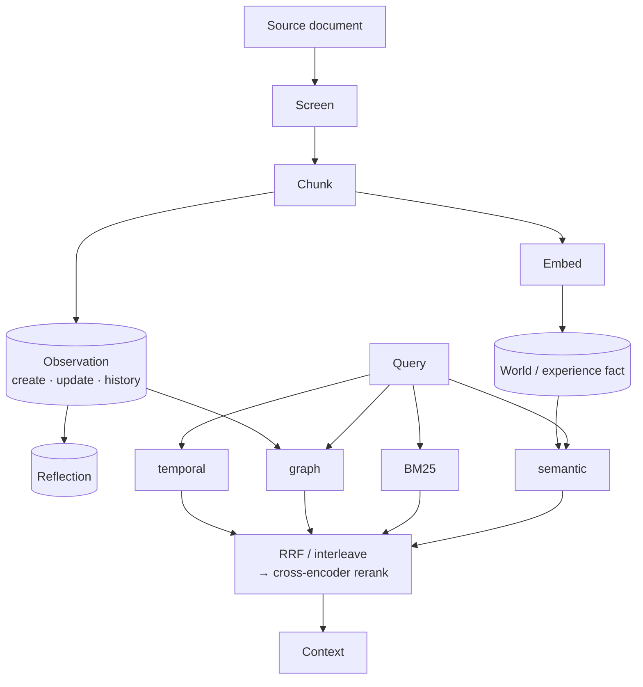

## 1. Executive Summary

Hindsight is a memory service built around three verbs: retain source material, recall relevant facts, and reflect over a bank's accumulated knowledge. Its strongest architectural move is not any single index; it is the separation between raw documents/chunks, extracted `world` and `experience` facts, automatically consolidated `observation` facts, and user-curated reflections.

The open implementation is unusually complete. It includes a FastAPI/MCP surface, PostgreSQL/pgvector and Oracle backends, four-arm retrieval, cross-encoder reranking, per-bank configuration, async operations, audit logging, webhooks, and consolidation recovery. This makes it one of the most operationally serious systems in the atlas.

Its main weakness is epistemic rather than mechanical: facts and observations are still produced or rewritten by LLMs. Source IDs and proof counts make them auditable, but support is not the same as verification, and a synthesized observation can become influential without an explicit candidate/verified/rejected state.

## 2. Mental Model

Each memory bank is an isolated “brain”. Retention turns content into evidence-bearing facts and a graph of temporal, semantic, entity, and causal links. Consolidation turns repeated or related facts into observations. Recall searches these layers. Reflection answers a question using recalled evidence, disposition settings, and curated reflection material.

```text
content -> document + chunks -> extracted world/experience facts
       -> entities + links + embeddings
       -> background consolidation -> observations with source_memory_ids
query   -> semantic + BM25 + graph + temporal -> fusion -> rerank -> bounded recall
prompt  -> recall + reflections + disposition -> reflect response
```

The distinction between observation and reflection matters. `consolidation/consolidator.py` describes observations as bottom-up, automatically maintained claims. Reflections are user-curated documents. This avoids collapsing every derived artifact into one ambiguous “memory” type.



## 3. Architecture

The main layers are:

- `hindsight-api-slim/hindsight_api/api/http.py` and `api/mcp.py`: REST and MCP boundaries.
- `engine/memory_engine.py`: orchestration, bank context, async operations, health, audit, and public retain/recall/reflect methods.
- `engine/retain/`: screening, chunking, fact extraction, entity resolution, embedding, storage, and link construction.
- `engine/search/`: parallel retrieval, graph expansion, temporal extraction, fusion, reranking, tracing, and token budgeting.
- `engine/consolidation/`: background observation creation/update and deduplication.
- `engine/db/`, `engine/sql/`, and `alembic/`: PostgreSQL/Oracle abstraction and schema evolution.
- `worker/`: queued operations, retries, cancellation, and maintenance.

The code is modular, but `memory_engine.py` is very large and remains the composition center. That gives the service one authoritative orchestration path while increasing change risk and navigation cost.

## 4. Essential Implementation Paths

- Retain entrypoints: `MemoryEngine.retain_async()` and `retain_batch_async()` in `engine/memory_engine.py`.
- Retain pipeline: `retain_batch()` in `engine/retain/orchestrator.py`.
- Fact extraction: `engine/retain/fact_extraction.py`; conversion and persistence are split into `fact_storage.py`, `embedding_processing.py`, and `entity_processing.py`.
- Recall entrypoint: `MemoryEngine.recall_async()` in `engine/memory_engine.py`.
- Four-way candidate generation: `engine/search/retrieval.py`.
- Rank fusion: `reciprocal_rank_fusion()` and the dedup-oriented `interleave_fusion()` in `engine/search/fusion.py`.
- Graph expansion: `engine/search/link_expansion_retrieval.py`.
- Final scoring: `engine/search/reranking.py`.
- Reflection: `MemoryEngine.reflect_async()` and `engine/search/think_utils.py`.
- Consolidation: `engine/consolidation/consolidator.py`.
- Core schema history: `alembic/versions/5a366d414dce_initial_schema.py` and later observation/reflection migrations.

## 5. Memory Data Model

Key persisted concepts include:

- `banks`: the isolation and configuration boundary.
- `documents` and `chunks`: retained source material and chunk-level provenance.
- `memory_units`: extracted or derived facts with text, embeddings, event/occurrence dates, metadata, tags, and fact type.
- `entities`, `unit_entities`, `entity_cooccurrences`, and `memory_links`: graph navigation.
- observations in `memory_units`: carry `proof_count`, `source_memory_ids`, history, consolidation timestamps, and failure state.
- `reflections`: curated material used by reflection.
- `directives`: hard rules separated from ordinary memory.
- `async_operations`, audit, webhook, and LLM request tables: operational state.

Current migrations show evolving terminology: older “mental models” were migrated toward observations and reflections. That evolution is a documentation hazard, but the current split is conceptually stronger.

## 6. Retrieval Mechanics

`engine/search/retrieval.py` runs four strategies:

1. Semantic similarity over embeddings.
2. BM25/full-text retrieval.
3. Graph retrieval through a pluggable `GraphRetriever`, normally link expansion.
4. Temporal retrieval using extracted date constraints and time-aware spreading.

The semantic and lexical arms are combined efficiently per fact type, with score floors, tag groups, created-at ranges, partial ANN indexes, and backend-specific SQL. `reciprocal_rank_fusion()` combines rank positions without requiring raw score calibration. Per-arm caps prevent graph fan-out from monopolizing the candidate pool. A cross-encoder can then rerank the bounded set.

The presence of `interleave_fusion()` is a subtle strength. Consolidation dedup needs to guarantee that semantic rank one survives even when it lacks graph or lexical support; ordinary RRF can suppress exactly that result. Hindsight therefore treats retrieval policy as task-specific rather than universally interchangeable.

## 7. Write Mechanics

Retention is a staged pipeline rather than a single vector-store insert:

- screen/redact/block content through the memory-defense extension;
- split large inputs and preserve a document body;
- extract structured facts with type, temporal data, entities, and causal relations;
- embed facts and chunks;
- persist documents, chunks, memory units, and graph links;
- enqueue consolidation and other maintenance work.

Append and replacement modes, content hashes, chunk deduplication, batch/sub-batch handling, cancellation, and operation metadata are implemented explicitly. Consolidation then compares new facts with existing observations, issuing creates or updates and carrying source IDs forward. A focused semantic dedup pass can merge near twins after an LLM adjudication.

## 8. Agent Integration

Hindsight exposes REST, generated Python/TypeScript/Rust clients, MCP, CLI tooling, and integrations for agent frameworks. The surface keeps the core verbs legible:

- `retain`: send content and context to a bank;
- `recall`: retrieve bounded memory facts;
- `reflect`: ask a higher-level question grounded in memory and curated models.

This is a good service boundary because applications do not need to reproduce the extraction and ranking pipeline. It is less opinionated about exactly where recall enters an agent prompt, so safe context framing remains partly integration-owned.

## 9. Reliability, Safety, and Trust

Strong operational safeguards include:

- bank context carried through async tasks for isolation and attribution;
- PostgreSQL and Oracle migration-shape checks;
- retryable queued consolidation with capped exponential backoff and per-bank dedup;
- cancellation and progress stages;
- audit logs, LLM traces, webhooks, health checks, and vector-index health;
- memory-defense policies that can redact or block sensitive content before persistence;
- token and database budgets;
- source fact IDs, proof counts, and history on observations.

The largest correctness gap is that provenance is not an epistemic state machine. An observation supported by several extracted facts may still be wrong in the same direction. Semantic dedup also asks an LLM to decide whether claims should merge; the prompt is careful about negation and quantities, but incorrect merges remain possible.

## 10. Tests, Evals, and Benchmarks

The test surface is broad: retain/recall/reflect integration, temporal ranges, graph fan-out caps, causal relationships, observation consolidation and recovery, source-fact budgeting, memory defense, audit logs, migrations, cancellation, provider behavior, and multi-tenant maintenance. Deterministic mechanics use ordinary assertions; LLM-behavior tests use real models plus an independent judge.

The repository also ships LongMemEval and LoCoMo scripts plus performance and consolidation benchmarks. That is better evidence than a demo-only test suite, although published quality still depends on model/provider configuration and benchmark settings.

## 11. For Your Own Build

### Steal

- Preserve documents and chunks before extracting compact facts.
- Separate raw facts, consolidated observations, curated reflections, and hard directives.
- Run semantic, lexical, graph, and temporal recall as independent arms, then fuse ranks.
- Cap each retrieval arm before global reranking.
- Use a different fusion policy for deduplication than for ordinary question answering.
- Carry source memory IDs and proof counts through consolidation.
- Make queued consolidation retryable and deduplicated per scope.
- Put sensitive-data screening before durable persistence.

### Avoid

- The orchestration core is extremely large.
- LLM-extracted facts become durable without a universal verification gate.
- Observation support counts can be mistaken for truth confidence.
- LLM-driven consolidation can erase meaningful distinctions despite dedup safeguards.
- Four retrieval arms, reranking, consolidation, and multiple backends create tuning and operational cost.
- Historical terminology around mental models/observations/reflections can confuse integrators.

### Fit

Borrow Hindsight when you need a service-grade memory pipeline rather than a thin vector wrapper. Its clearest reusable ideas are evidence/derived-state separation, task-specific rank fusion, temporal recall, and recoverable consolidation.

Do not copy the full architecture for a small local agent. Start with two retrieval arms and explicit source records. Add graph, temporal analysis, consolidation, and cross-encoder reranking only when evaluations show they solve real misses. If correctness matters, add a trust state beyond Hindsight's proof and provenance fields.

## 12. Open Questions

- How often do consolidated observations improve recall versus introducing synthesis errors?
- What operator workflow corrects a wrong observation and prevents it from being recreated?
- How are four-arm score floors and reranker budgets calibrated per domain?
- Which deletion path guarantees removal from documents, chunks, facts, links, observations, audit artifacts, and external backups?
- How closely do PostgreSQL and Oracle retrieval results match under production load?

## Appendix: File Index

- `hindsight-api-slim/hindsight_api/engine/memory_engine.py`
- `hindsight-api-slim/hindsight_api/engine/retain/orchestrator.py`
- `hindsight-api-slim/hindsight_api/engine/retain/fact_extraction.py`
- `hindsight-api-slim/hindsight_api/engine/search/retrieval.py`
- `hindsight-api-slim/hindsight_api/engine/search/fusion.py`
- `hindsight-api-slim/hindsight_api/engine/search/link_expansion_retrieval.py`
- `hindsight-api-slim/hindsight_api/engine/search/reranking.py`
- `hindsight-api-slim/hindsight_api/engine/search/think_utils.py`
- `hindsight-api-slim/hindsight_api/engine/consolidation/consolidator.py`
- `hindsight-api-slim/hindsight_api/api/http.py`
- `hindsight-api-slim/hindsight_api/api/mcp.py`
- `hindsight-api-slim/hindsight_api/alembic/versions/`
- `hindsight-api-slim/hindsight_api/worker/`
- `hindsight-api-slim/tests/`

## History

**2026-08-06** — [`f9fb3e934a459f814ac00fefb1819e675d2b5bce`](https://github.com/vectorize-io/hindsight/commit/f9fb3e934a459f814ac00fefb1819e675d2b5bce) — 141 commits on, and one mark was earned at the previous pin and not claimed.

`audit_log` is added. `hindsight-api-slim/hindsight_api/engine/audit.py` was present at `ed120a25`, and its docstring states the coverage: *"fire-and-forget audit logging of all mutating and core operations (retain, recall, reflect, bank CRUD, etc.) across HTTP, MCP, and system transports."* An `AuditLogEntry` carries id, action, transport, bank id, start and end timestamps, a server-computed duration and the request, and it is written with `INSERT INTO {schema}.audit_log` — no `UPDATE` and no `DELETE` against that table anywhere outside tests. It ships with a CLI reader (`hindsight-cli/src/commands/audit.rs`) and two test files, one of them per-bank.

Two limits belong beside the mark. It is **fire-and-forget**, so a failed audit write does not block the operation it was recording, which means gaps are possible and silent. And `audit_log_enabled` is hierarchical — environment, then tenant, then bank — so the log can be off.

Of the 141 commits, the one this report should carry is `#3161`, *"guard observation_history append on 0-row observation UPDATE"*: the history row was appended even when the update it described changed nothing, so the trail recorded a mutation that did not happen. Beside it, `#3198` sweeps orphan entities when a delete enqueues no relink victims, `#3204` drops a stale global vector index by migration and makes reconcile hands-off, `#3191` caps reranker candidates per budget, and `#3181` keeps consolidated observations in their source facts' language.

Screened again: 1 auto-run surface (`.githooks/`), 31 build-time exec paths, 30 unpinned dependency surfaces and 10 inside the seven-day cooldown, so nothing was installed or run.

**2026-07-26** — [`ed120a256d51d731085ec8aca724573a7f2f1e1c`](https://github.com/vectorize-io/hindsight/commit/ed120a256d51d731085ec8aca724573a7f2f1e1c) — first reading.
