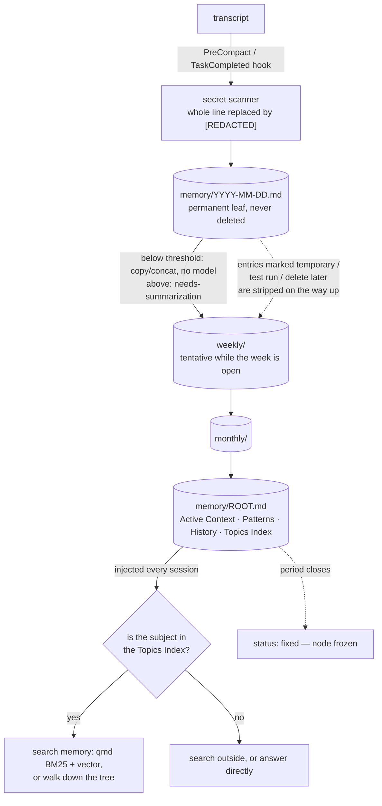

## 1. Executive Summary

Hipocampus is a memory harness rather than a memory service: 1,796 lines of Node
across four CLI files, 2,289 lines of specification, skills and templates, no
database, and MIT. It installs as a Claude Code plugin or through
`npx hipocampus init` for OpenCode, OpenClaw and Codex, and everything it stores
is Markdown in the project directory. Version 0.5.3, 86 commits between 15 March
and 25 April 2026; **no commit since 25 April 2026**.

**Its thesis is a question no other system here asks out loud.** The README puts
it as *"you can't search for what you don't know you know"*, and the worked
example is exact: three weeks ago you settled on a token-bucket rate limit; today
you ask for a refactor of the payment endpoint; the agent never searches for
"rate limiting" because you asked about "payment flow", and no query connects the
two. That is not a retrieval failure — there is no query that would have worked.

**So the top of the tree is an index, not a summary.** `memory/ROOT.md` is capped
around 100 lines and injected every session, and its job is a judgement rather
than an answer: a Topics Index for *"O(1) 'do I know about X?'"*, so the agent can
decide between searching memory, searching outside, and answering directly. The
spec states the problem it solves precisely — *"determining 'do I know about
this?' requires loading memory, but loading itself costs tokens"* — which is the
recursion most memory designs never name.

**Underneath it is a compaction tree whose nodes are regenerated, not edited.**
Every node carries `status: tentative|fixed`. Tentative means the period is still
open, and the node is rebuilt from scratch whenever new source data arrives;
fixed means the period has closed and the node is frozen. A weekly summary is
therefore never patched incrementally — it is recomputed from its dailies until
the week ends — which removes the slow drift that incremental summarisation
accumulates.

**What it cannot do is correct anything.** Raw daily logs are *"permanent leaf
nodes"*, every index node is a *"supplement"* rather than a replacement, and the
specs say *never* delete in three places. A wrong statement recorded on Tuesday
is in the tree forever; the only thing that changes is what the summaries above
it choose to say. The single content-keyed exclusion is at promotion time —
entries marked temporary, test run or delete later, in English or Korean, are
stripped on the way up — and it is the closest thing to forgetting here.

**The benchmark is the strongest evidence and it is not in this repository.**
The README reports MemAware — 900 implicit-context questions over three months of
history — with a no-memory arm at 0.8%, BM25 at 2.8%, BM25+vector at 3.4%, and
Hipocampus configurations from 9.2% to 21.0%. The arms are the right ones and the
reading is honest about the ceiling. The harness and the results live at
`kevin-hs-sohn/memaware`; nothing here reproduces them.

## 2. Mental Model

A memory is a typed entry under a heading in a daily log, and the type is
load-bearing rather than decorative. `spec/file-formats.md` defines four:
`project` (work, decisions, findings — medium priority, expires when completed),
`feedback` (user corrections and confirmations — high priority, never expires),
`user` (identity, role, preferences — highest, never expires), and `reference`
(pointers to external systems — low priority, expires, *"needs periodic
verification"*). The type sets what compaction may drop when a node is over
budget, which makes "what survives summarisation" a declared policy rather than a
model's judgement in the moment.

`feedback` has a fixed internal shape — `rule`, `why`, `how-to-apply` — so a
correction is stored as a rule with its reason and its trigger rather than as a
sentence about a conversation.

**The state machine is temporal and it belongs to the node, not to the claim.**
A compaction node is `tentative` while its period is open and `fixed` once the
period closes; ROOT.md is *"always tentative — it never becomes fixed"*. Nothing
in the tree records that a memory is candidate, verified, disputed or withdrawn,
and the Topics Index's `?` marker means only that a reference entry is due for
re-checking. So `trust_state` does not apply: the field that looks like an
epistemic status is a statement about the calendar.

Death, in the ordinary sense, does not happen. Raw logs are permanent, index
nodes are permanent, and the exclusion rules act before promotion rather than on
anything already written.

## 3. Architecture

Nothing runs. `npx hipocampus init` writes the tree, the hooks and the skills
into the project; after that the moving parts are three hook invocations and a
handful of Markdown files the agent reads and writes. The install is
platform-aware — `platforms/` carries a `SKILL.md` per host and a small plugin
shim for OpenCode — and the layer spec is explicit about where the platform's own
memory takes over: on Claude Code, `MEMORY.md` and `USER.md` are deliberately not
created because the platform has built-in memory for facts and profile, so
Hipocampus keeps to the compaction tree and the operational files; on OpenClaw,
where separate files cannot be auto-loaded, ROOT.md's content is embedded as a
*"Compaction Root"* section inside `MEMORY.md`. Deciding what *not* to duplicate
per host is a rarer piece of care than the port itself.

The only durable state outside the Markdown is
`memory/.compaction-state.json` — a counter of raw lines and checkpoints since
the last compaction.

Search is delegated. `qmd` provides BM25, optional vector search and a rerank,
and `init --no-vector` skips the embedding model to save around two gigabytes of
disk while `--no-search` drops `qmd` entirely and leaves the tree. The degradation
is stated where a reader meets it, which is the right place.

### Deployment and ergonomics

One command, no service, no key, and the store is Markdown a person can read and
edit in place — which is also the only correction path. Everything lives in the
repository, so memory is versioned with the code if the user commits it, and
leaks with the code if they push it.

## 4. Essential Implementation Paths

- **Session start.** `hooks/session-start.sh` — reads the hook's stdin JSON,
  `cd`s to the project, creates `memory/{daily,weekly,monthly}`, `knowledge/`,
  `plans/` and a `ROOT.md` stub if missing, then prints the memory protocol to
  stdout for injection.
- **Compaction trigger.** `hooks/hooks.json` — `PreCompact` runs
  `npx hipocampus compact --stdin` with a 30-second timeout, `TaskCompleted` runs
  `npx hipocampus compact`.
- **Deterministic compaction.** `cli/compact.mjs` — reads the transcript path
  from the hook JSON, appends to the raw daily log, and handles below-threshold
  nodes by copy or concatenation *"without LLM"*, marking anything above
  threshold `needs-summarization`.
- **Redaction.** `SECRET_PATTERNS` and `scanSecrets` in `cli/compact.mjs:136`,
  applied on the way into the daily log.
- **Judgement compaction.** `skills/compaction/SKILL.md` (306 lines) — the
  prompt the agent follows for the nodes the CLI would not touch.
- **The index.** `spec/compaction.md` on how ROOT.md is rebuilt every cycle and
  compressed when over cap — *"compress Historical Summary entries first (merge
  periods, remove detail)"*.
- **Retrieval.** `skills/search/SKILL.md` — the ROOT.md-first protocol and the
  `qmd` command table.
- **Recovery.** `spec/checkpoint.md` — stale task recovery, and the rule that
  hot files are written first because *"stale state cannot be reconstructed"*.

## 5. Memory Data Model

Three layers by temperature. **Layer 1** is the system prompt: `SCRATCHPAD.md`
(~150 lines), `WORKING.md` (~100), `TASK-QUEUE.md` (~50), `memory/ROOT.md` (~100
lines, ~3K tokens), and on OpenClaw also `MEMORY.md` and `USER.md`. The spec
gives the reason for the size caps that most harnesses leave implicit — *"stable
content maximizes prompt cache hit rate (up to 90% token savings)"* — so the
budget is a caching decision, not a taste.

**Layer 2** is read on demand: `memory/YYYY-MM-DD.md` daily logs, marked
*"permanent (never deleted)"*, and an agent-managed `knowledge/`. **Layer 3** is
the tree and the search index.

Metadata is thin and mostly temporal. A node carries `status`, a period, and a
`last-updated`; a Topics Index line carries the type, `Nd` days since last
mention, and `?` for needs-verification. There is no provenance beyond the file a
line sits in — no source id, no session id on an entry, no confidence and no
corroboration — so *why do you believe that* resolves to *which day it was
written*, which for a session log is a reasonable answer and not a strong one.

There is no scope key. One tree per project directory, which is the design.

## 6. Retrieval Mechanics

**The first step is not a search.** `skills/search/SKILL.md` instructs the agent
to check ROOT.md before any lookup: topic present in the Topics Index → search
memory; absent → search externally or answer from general knowledge. The skill
states the reason plainly — *"this eliminates 'loading to decide whether to
load'"* — and the four sections of ROOT.md are shaped for that decision rather
than for reading: Active Context for the current week, Recent Patterns for
cross-cutting insights, Historical Summary for chronology, Topics Index for the
lookup.

If the answer is *search*, `qmd query` runs BM25 plus vector plus rerank,
`qmd search` is the keyword-only path when vector is disabled, and tree traversal
is the third way in — walk down from the root through monthly and weekly nodes to
the daily leaf. Because the leaves are never deleted, traversal always terminates
at raw detail rather than at a summary of a summary.

The failure modes follow from the shape. The Topics Index is a lossy hash of the
whole store, so a subject that exists in a daily log and never made it into the
index is invisible to the decision that gates the search — a false negative at
the top of the tree costs the whole retrieval. The README's own numbers show the
index size mattering exactly there: raising the ROOT.md budget from 3K to 10K
tokens, 39 topics to 120, moves easy questions from 26% to 34%. And the hard tier
does not move at all, which the README attributes to the answer model rather than
the index, and which is the more interesting half of its own result.

## 7. Write Mechanics

Writes are triggered by the host, not chosen by the agent: `PreCompact` fires
when the platform is about to compress its own context, and `TaskCompleted` when
a task finishes. `cli/compact.mjs` appends the transcript to the raw daily log
and then does as little as it can — below the size threshold it copies or
concatenates with no model involved, and above it writes `needs-summarization`
and leaves the judgement to the agent's compaction skill. The split is the same
one this atlas keeps finding in the better harnesses: deterministic work in code,
judgement in a prompt, and a marker in the file that says which is which.

**The secret scanner is the only thing in the repository with tests, and it is
the right thing to have chosen.** Six patterns — `api_key`/`apikey`,
`secret`/`password`/`passwd`/`pwd`, `token`, the `sk-`/`pk_live_`/`ghp_`/
`github_pat_` prefixes, PEM private-key headers, and `Bearer` — and a match
replaces the whole line with `[REDACTED: secret detected]` on the way into the
daily log. The 69-line test asserts both directions, and the negative half is the
discriminating one: a topic heading, *"decided to use API key rotation"*,
*"password policy requires 12 characters"*, *"token count: 3500"* and *"the
secret to good compaction is…"* must all pass through. Those are precisely the
lines a conversation *about* security produces, and redacting them would corrupt
the memory of the discussion that mattered.

That test carries more weight here than it would elsewhere, because it is the
only defence. The store has no delete, so a secret that gets past the scanner is
in a permanent leaf node and in every summary that quotes it.

Deletion, correction and supersession are absent by design, and the specs say so
three times: raw logs *"must never be deleted — they are permanent leaf nodes"*,
compaction nodes are *"index supplements — originals are never deleted"*, and
*"never delete daily, weekly, or monthly nodes"*. The one content-keyed rule runs
at promotion, not at write: entries marked `temporary`, `test run`, `delete
later`, or their Korean equivalents `임시`, `테스트 중`, `나중에 삭제`, are
stripped as the material moves up the tree. So a user can mark something
ephemeral and keep it out of the index; they cannot take back what the log
already holds.

### Operational cost

Nothing blocks the agent's reply: compaction runs on the platform's pre-compaction
event with a 30-second timeout and on task completion. New material is
retrievable as soon as it is written to the daily log, and the summaries above it
catch up on the next cycle. No pass re-reads the whole store on a schedule — the
tree is rebuilt bottom-up only for the periods that are still tentative, which
bounds the work to the current day, week and month plus the root. On the read
path the cost is fixed and deliberate: roughly 3K tokens of ROOT.md in every
session, chosen to sit inside the prompt cache.

## 8. Agent Integration

Five skills — core, compaction, recall, search, flush — plus a per-platform
`SKILL.md` for Codex, OpenCode and OpenClaw, and three hooks. The agent's
authority over memory is total: it writes the hot files directly, and the layer
spec says why there is no subagent between it and them — on OpenClaw the Task
Lifecycle protocol enforces the write, on Claude Code *"`@import` visibility
drives natural updates"*.

Two integration decisions are worth naming. The install is idempotent and
self-repairing: `session-start.sh` recreates any missing directory or config on
every session, so a deleted tree comes back rather than failing quietly. And the
harness declines to duplicate the host's own memory, which is a discipline most
plugins skip.

There is no MCP server here, and no review surface: a person edits the Markdown
or they do not. `human_review` is withheld on that — a file a human *can* edit is
not a place where a human *adjudicates*, and the atlas has drawn that line before.

## 9. Reliability, Safety, and Trust

The safety story is one mechanism, tested in both directions, guarding a store
with no delete. That is a coherent position and a fragile one: the scanner is six
regexes over lines, so a secret spread across two lines, or one that does not
match a known prefix, lands in a permanent file. The project's own choice to make
this the only test suggests it knows where the risk is.

**Provenance is the file and the date.** An entry does not carry a session id, a
source, a confidence or a corroboration count, so the audit question the atlas
asks — *what changed, when, and who changed it* — is answerable only through the
user's own version control, if they commit the tree. `audit_log` is withheld:
there is no event record of mutations in the system's own store, and the daily
log is the content rather than a record of changes to it.

**Nothing withholds a memory from being treated as true.** The `?` marker on a
reference entry is the closest thing, and it flags age rather than doubt. A
statement that was wrong when written, or that became wrong later, has no way to
be marked as such; the mechanism available is to write a newer entry and hope the
next compaction weights it above the old one — which is compaction as
correction, and is exactly as reliable as the summariser's judgement on the day.

The `feedback` type is the interesting partial answer. A user correction is
stored at the highest compaction priority with *"always preserve core"*, in a
structure that separates the rule from its reason from its trigger. So the system
does keep corrections, durably and prominently — it simply does not apply them to
the thing that was corrected.

One structural risk deserves stating for a harness that installs into someone
else's repository: memory lives in the project, so it is committed if the user
commits it and published if they publish it, and the material is a redacted
transcript of their working sessions. The redaction is the only thing standing
between that and a public repository.

## 10. Tests, Evals, and Benchmarks

One test file, 69 lines, entirely about the secret scanner — discussed above and
better than its size suggests, because it asserts the false-positive cases as
carefully as the true ones. Nothing tests compaction, the tentative/fixed
transition, the exclusion rules or the ROOT.md rebuild. There is no CI workflow
in the tree.

**The benchmark is the project's strongest claim and it is external.** The README
reports results on MemAware — *"900 implicit context questions across 3 months of
conversation history"*, where the agent must surface context the user never asked
about — with a table whose arms are the ones this atlas asks for: no memory
(0.8% overall), BM25 (2.8%), BM25 + vector (3.4%), then Hipocampus tree-only
(9.2%), + BM25 (11.4%), + vector (17.3%), and + vector with a 10K root (21.0%).
A no-memory arm and two search baselines scored on the same questions is more
than most published memory numbers carry.

Three qualifications matter for a reader deciding what to trust. The harness and
the questions live in `kevin-hs-sohn/memaware` — a repository by the same author,
not read for this report — so **no result is committed to this repository** and
nothing here reproduces the table. The evaluation is of the *author's own
benchmark*, which is the ordinary situation for a new method and still means the
questions and the method were designed together. And the most useful line in the
table is the one that does not favour the design: the hard tier stays at 8.0%
whether the root holds 39 topics or 120, which the README reads as the answer
model being the bottleneck rather than the index — a limitation stated where a
reader will see it, next to the number that would otherwise look like a clean
win.

`negative_eval` is withheld. The redaction cases assert that particular material
must not be *stored*, which is the write-side analogue, and no committed case
asserts that particular material must not be *retrieved*.

## 11. For Your Own Build

### Steal

- **Give the agent an index of what it knows it knows, not just what it knows.**
  A topic index small enough to sit in every prompt turns "should I search my
  memory?" into a lookup instead of a load. The recursion it breaks —
  *"determining 'do I know about this?' requires loading memory, but loading
  itself costs tokens"* — is real in every memory system and named in almost
  none.
- **Regenerate a summary while its period is open; freeze it when the period
  closes.** `tentative` nodes are rebuilt from their sources rather than edited,
  so a week's summary cannot drift by accumulating patches, and `fixed` marks the
  point after which the cost stops.
- **Type your entries and let the type decide what survives compaction.** Four
  types with declared priorities and expiry mean the summariser is following a
  policy rather than making a fresh judgement about importance every time.
- **Store a user correction as rule / why / how-to-apply.** A correction with its
  reason and its trigger is applicable later; a correction as a sentence about a
  conversation is not.
- **Test the false positives of your redactor.** *"password policy requires 12
  characters"* and *"the secret to good compaction is…"* are the lines a
  security conversation produces, and a scanner that eats them corrupts exactly
  the memory worth keeping.
- **Decline to duplicate the host's memory.** Creating `MEMORY.md` on one
  platform and deliberately not on another, because the host already has that
  layer, is a decision most plugins never make.
- **Publish the arm that can beat you.** A no-memory baseline and two search
  baselines on the same questions is what makes the rest of the table mean
  something.

### Avoid

- **A store with no delete and one regex between it and a secret.** Permanence is
  a defensible choice for session logs; pairing it with a single line-level
  scanner means any miss is permanent, and a secret split across two lines does
  not match.
- **Correction by summarisation.** When the only way to fix a wrong entry is to
  write a newer one and hope the next compaction prefers it, the store cannot say
  which of two contradictory statements it believes — and the older one is still
  in a leaf that traversal reaches.
- **A status field that reads epistemic and is temporal.** `tentative|fixed`
  looks like candidate/verified until you read the spec; naming it for the
  calendar it describes would cost nothing and mislead nobody.
- **Memory in the working tree without saying what that means.** The store is
  Markdown in the repository, so it is committed, pushed and reviewed with the
  code unless somebody thinks about it.
- **A benchmark in another repository.** The numbers are the reason to adopt
  this, and reproducing them means finding, reading and running a second project.

### Fit

Take this if you work in one repository at a time with a supported host, you want
memory you can read and diff as ordinary files, and the failure you actually have
is the one it names: an agent that does not know its own past is relevant. The
install cost is a single command and the exit cost is deleting a directory; there
is no service, no key and no lock-in, and the layer spec is worth reading even if
you never install it.

Walk away if you need a memory that can be corrected. Nothing here can mark a
statement wrong, withdraw it, or stop it being summarised forward — the design
chose permanence at the leaves and accepts the consequence. Walk away too if the
material is sensitive enough that one line-level redactor is not a boundary you
would rely on, because there is no second one and no way to remove what gets
through. And weigh the pin: this is a small, coherent project with **no commit
since 25 April 2026**, so what you are adopting is the design as it stands rather
than a moving one.

## 12. Open Questions

- The Topics Index gates every memory search, so a subject missing from it is
  unreachable in practice. What is the index's own recall — how often does a
  topic present in a daily log fail to appear in ROOT.md — and would the
  compaction skill's prompt or the token cap dominate that number?
- Raw logs are permanent and the exclusion rules run only at promotion. Would a
  content-keyed suppression consulted at *read* time — the same list of ephemeral
  markers applied when traversal reaches a leaf — be enough to make a mistaken
  entry harmless without breaking the permanence guarantee?
- `feedback` entries are kept at the highest priority with their rule, reason and
  trigger. What would it take for a feedback entry to *bind* — for a later
  compaction to be required to reconcile against it rather than merely to
  preserve it?
- The hard tier of the benchmark does not move with index size, and the README
  attributes that to the answer model. Does the tree-only configuration beating
  vector search 8.0% to 0.7% on that tier survive a stronger answer model, or
  does the gap close?

## Appendix: File Index

**Specification**
- `spec/layers.md` — the three temperature layers, the size caps and the
  prompt-cache reasoning, the ROOT.md rationale, and the per-platform split
- `spec/compaction.md` — the five-level tree, `tentative|fixed`, the rebuild
  order, the ROOT.md cap policy, and the exclusion rules
- `spec/file-formats.md` — the four memory types and their priorities, the
  `[type]` heading syntax, the Topics Index line format, the `feedback` shape
- `spec/checkpoint.md` — stale task recovery and the hot-files-first rule

**Code**
- `cli/compact.mjs` — transcript ingest, `SECRET_PATTERNS`/`scanSecrets`, the
  below-threshold copy/concat path and the `needs-summarization` marker
- `cli/compact.test.mjs` — the only tests in the repository
- `cli/init.mjs`, `cli/uninstall.mjs` — install and removal
- `hooks/session-start.sh`, `hooks/hooks.json` — the three auto-run surfaces

**Prompts**
- `skills/{core,compaction,recall,search,flush}/SKILL.md`
- `platforms/{codex,opencode,openclaw}/core/SKILL.md`,
  `platforms/opencode/plugin/hipocampus.js`
- `templates/` — the six seeded files

## History

**2026-08-17** — [`df88ca19d42a3aba4caeaba4512da46cae7827da`](https://github.com/kevin-hs-sohn/hipocampus/commit/df88ca19d42a3aba4caeaba4512da46cae7827da) — First reading, at version 0.5.3 and 86 commits, on a repository whose first commit is dated 15 March 2026 and whose last is 25 April 2026. Screened before reading, and the screen is worth recording because it under-reported: `scripts/screen_repo.py` scanned two files and found **zero** auto-run surfaces, while the project's entire distribution mechanism is agent hooks — `hooks/hooks.json` registers `SessionStart`, `PreCompact` and `TaskCompleted`, and `.claude-plugin/` declares a Claude Code plugin. Neither path was on the screener's fixed list, which is the limitation its own skill documents; `.claude-plugin/`, `hooks/` and `hooks/hooks.json` were added to it in the same change that published this report, so a reader running the screen today sees three surfaces rather than none. All three were read by hand before anything else: each invokes the project's own code (`bash hooks/session-start.sh`, `npx hipocampus compact`), the session-start script creates directories and a config in the project and prints the memory protocol to stdout, and nothing reaches outside the working directory or the npm registry. Nothing was installed, built or run. No capability mark. Four near-misses stated in place: a `status: tentative|fixed` field that reads epistemic and is temporal, a `?` marker that flags a reference's age rather than any doubt about it, a `feedback` type stored at the highest compaction priority with rule/reason/trigger and never applied to what it corrects, and a 69-line redaction suite that asserts material must not be *stored* where the mark asks for material that must not be *retrieved*. The benchmark carrying the project's central claim — MemAware, 900 implicit-context questions with a no-memory arm and two search baselines — lives in `kevin-hs-sohn/memaware`, so no result is committed to this repository and none was reproduced here.
