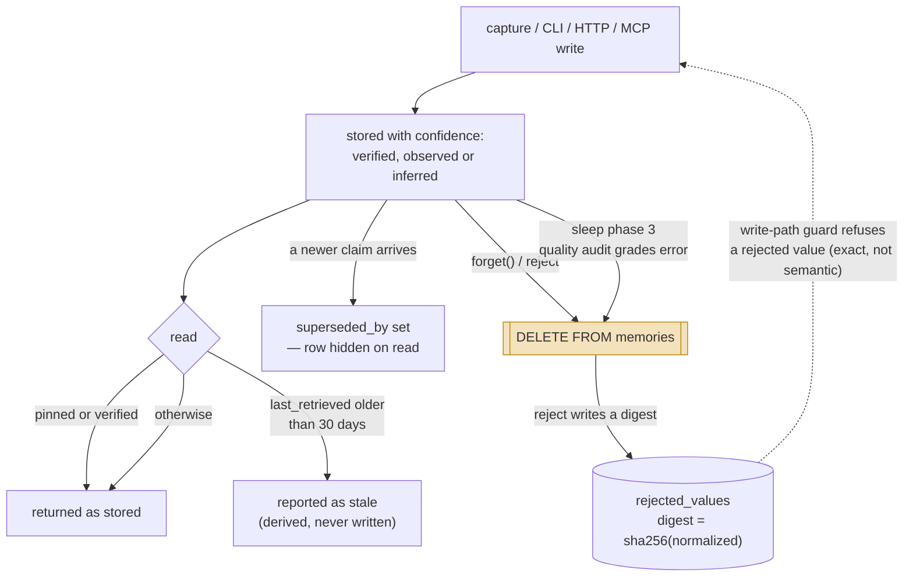

## 1. Executive Summary

Hippo is a **memory layer for coding agents** in ~50,000 lines of TypeScript,
MIT (release v1.31.0), with hundreds of test files and a migration ladder past
forty steps. Its
README leads with a thesis this atlas agrees with — *"The secret to good memory
isn't remembering more. It's knowing what to forget"* — and the gap between that
sentence and the mechanism behind it is the most useful thing in the report.

**The design idea is a physics model.** Every entry gets a `mass` computed from
strength and retrieval count, a `charge` mapped from emotional valence, and a
`temperature` that decays with age (`src/physics.ts`). Retrieval is then a
hybrid of BM25 and vector similarity fused and MMR-reranked
(`src/search.ts:344`, `:801`), with an optional `physicsSearch` (`:861`) ranking
by those derived quantities instead. Whether the metaphor earns its keep is an
open question below; what it demonstrably buys is a single place where recency,
frequency and affect combine into one number.

**The strongest thing here is not the physics — it is the scope architecture.**
`tenant_id` is a real read-path predicate, and every place it is *omitted* is
deliberate and documented. The API recall path passes it. The CLI omits it at
fifteen-plus sites under a comment stating that `cli.ts` is
single-tenant-per-process. And `sleep` omits it and hard-deletes host-wide,
which would be a cross-tenant delete except that `/v1/sleep` is **loopback-only
and admin-gated**, with the 403 naming the reason. The boundary is enforced in
the query on the read path and deliberately suspended for consolidation, with
the suspension fenced at the transport layer instead. That is a position, not an
oversight, and the version reference in the error string says the project met
the hazard in production.

**The mechanism has caught up with the tagline.** Until release v1.31.0 the
promise — knowing what to forget — outran what the code did: `forget` was a hard
`DELETE FROM memories`, correction was record-keyed supersession, and the word
*tombstone* appeared nowhere in `src/`. That release closed the gap with a
purpose-built rejected-value tombstone (`src/rejection.ts`, migration v41). A
`rejected_values` table is keyed on `(tenant_id, digest)` where the digest is a
SHA-256 of the NFC-normalized, lowercased, whitespace-collapsed content — the
value, not the row — and it stores no content (only a human `reason`), with no
foreign key so the tombstone outlives the memory it came from. A guard
(`checkRejectionGuard`) sits at the single write choke point (`src/store.ts:1172`,
and inline in the consolidation batch path at `:1986`) and refuses to write a
value that has been rejected, across capture, import, sync and the markdown-mirror
rebuild — so a later extraction that rediscovers a rejected claim is turned away
rather than silently re-asserting it. `reject`/`unreject`/`rejections` exist on
the CLI, HTTP and MCP surfaces, and a refused write is itself audited
(`reject_refusal`). The honest limitation is that the match is exact-normalized-value
only: a paraphrase of a rejected value still evades it (`src/rejection.ts:5-8`).
That earns `tombstone` and reverses the report's former central finding.

Second weakness, and subtler: **staleness is computed from disuse, not from
evidence.** See section 2.

## 2. Mental Model

A memory is a **row in SQLite** carrying `strength`, `half_life_days`, `layer`,
`tags_json`, `emotional_valence`, `schema_fit`, `outcome_score`,
`conflicts_with_json`, `pinned` and `confidence` (`src/db.ts:47`).

`confidence` is the epistemic axis and it is a discrete state, not a score:
`ConfidenceLevel = 'verified' | 'observed' | 'inferred' | 'stale'`
(`src/memory.ts:23`). **Only the first three are ever stored.**
`resolveConfidence` (`src/memory.ts:447`) short-circuits on `pinned` or
`verified`, then returns `'stale'` when `last_retrieved` is more than thirty
days old, otherwise the stored value.

That is worth stating plainly, because it is the design's quiet substitution: a
memory goes stale **because nobody looked at it**, not because anything
suggested it stopped being true. A verified fact is exempt; an `observed` one
that happens to be both correct and unfashionable is marked stale on a fixed
thirty-day threshold. The other three values in that union are epistemic, so a
reader sees a single field mixing "how we came to believe this" with "how
recently it was useful" — the conflation
[decay and reinforcement](../../patterns/decay-and-reinforcement/) exists to
separate.

Strength itself is separate and richer: `calculateStrength` (`src/memory.ts:309`)
with `deriveHalfLife` (`:390`), an `applyOutcome` that moves the score on a
good or bad result (`:424`), and a `calculateRewardFactor` (`:274`) carrying a
loss-aversion ratio — outcomes that went badly count for more than outcomes that
went well.

### How a thing becomes a belief, and how it stops being one

The edges into the deletion box are one half of the finding. One is a user asking
to forget; the other is a background quality audit deciding a memory is junk, and
it runs host-wide. The other half is what closed the former gap: `reject` writes a
digest into `rejected_values`, and the dashed edge is the write-path guard that
refuses re-asserting a rejected value — so supersession only changes
what is *shown*, but rejection changes what may be *written*.

## 3. Architecture

A Node/TypeScript package with three front doors over one SQLite file. There is
no separate database process, no vector service, and no external dependency for
retrieval — BM25 is implemented in-repo (`src/search.ts:57`) and the vector arm
sits behind an embedding provider abstraction (`src/embedding-provider.ts`).

Operationally the interesting artefact is `src/db.ts`: a migration ladder past
version twenty-five, with self-healing `CREATE TABLE IF NOT EXISTS` re-runs for
stores that were initialised partway and comments naming the incident behind
each repair. An operator inherits one file to back up and a schema that has been
evolved rather than reset.

### Deployment and ergonomics

`/v1/sleep` being loopback-only is the deployment fact that matters most: the
consolidation pass cannot be triggered by a tenant over the network, so a
multi-tenant install must schedule it on the host. Anything that assumes
per-tenant consolidation will find it is not reachable that way, by design.

## 4. Essential Implementation Paths

- **Schema and migrations:** `src/db.ts` — `memories`, `memory_conflicts`,
  `audit_log`, `goal_stack`, `retrieval_policy`, plus connector tables.
- **Epistemics:** `src/memory.ts` — `ConfidenceLevel` (`:23`),
  `calculateStrength` (`:309`), `applyOutcome` (`:424`), `resolveConfidence`
  (`:447`).
- **Physics:** `src/physics.ts` — `computeMass` (`:124`), `computeCharge`
  (`:134`), `computeTemperature` (`:138`).
- **Retrieval:** `src/search.ts` — `hybridSearch` (`:344`), `mmrRerank` (`:801`),
  `physicsSearch` (`:861`), `temporalBoost` (`:150`).
- **Write and capture:** `src/capture.ts` — `extractFromText` (`:159`),
  `summariseTranscript` (`:259`), `cmdCapture` (`:398`).
- **Scope:** `src/tenant.ts` `resolveTenantId`; predicates at
  `src/store.ts:719-721`.
- **Background:** `sleep` phases in `src/api.ts:2752` onward.
- **Audit:** `src/audit.ts:195`; retention in `src/audit-prune.ts`.
- **Validity time:** `src/policies.ts`.

## 5. Memory Data Model

The `memories` table is the core, and two other entity types carry their own
lifecycle: **policies**, **decisions** and **processes** each have a
`supersedes` link and their own audit op (`decision_supersede`,
`process_supersede`, `policy_supersede`).

Policies are where **bi-temporal validity** lives, and it is not decorative.
`src/policies.ts` makes `valid_from` required with a default of creation time
and `valid_to` nullable meaning open-ended, calls the pair "the queryable axis",
normalises dates to fixed width so they sort lexically, enforces
`valid_to > valid_from` with its own error, and carries a fix note for a
read-path bug where a datetime `valid_from` "otherwise made a same-day policy
invisible" — which is only possible in a system whose reads filter on it.

Memories carry the same axis in a thinner form. Migration 11 adds **`valid_from`
and `superseded_by`** to `memories` — and no `valid_to`, which is the point:
expiry is derived from the successor rather than stored. `--as-of` recall reads
it in both pipelines, mapping each entry to its successor's `valid_from`
(`src/search.ts:429`, `:1113`) and dropping anything whose own `valid_from` is
later than the requested instant (`:433`, `:1117`). So policies get an explicit
half-open interval and memories get a successor-chain derivation of the same
thing; `valid_to` exists on `policies` alone (`src/db.ts:1344`).

## 6. Retrieval Mechanics

`hybridSearch` runs BM25 over an in-repo corpus and a vector arm, fuses them,
then `mmrRerank` trades relevance against diversity. `temporalBoost` reads a
direction out of the query — `detectTemporalDirection` looks for "recent" versus
"oldest" phrasing (`src/search.ts:130`) — and reweights accordingly, which is a
cheap way to answer "what did we decide first" without a temporal index.

`physicsSearch` is the alternative ranker, ordering by the derived mass, charge
and temperature rather than by similarity. The `assemble` path
(`src/api.ts:1198`) is DAG-aware, substituting summary nodes when entries
overflow a budget.

Scope reaches this path as a predicate: `tenant_id = ?` composed into the query
(`src/store.ts:719-721`) rather than filtered afterwards, so `LIMIT` means the
same thing for every caller.

## 7. Write Mechanics

`capture` is the automatic path: `extractFromText` pulls candidate items out of
transcript text and `summariseTranscript` compresses a JSONL session. Writes
also arrive from the CLI, from 31 HTTP routes, and from an MCP server, and
`autolearn.ts` can learn from a repository directly.

Writes do not block on a model in the common path — extraction is a separate
command rather than an inline call on every turn.

**A background pass does rewrite the store, and it deletes.** `sleep` runs six
phases (`src/api.ts:2752` onward): consolidation, near-duplicate dedup, a
quality audit, auto-share to a global scope, an ambient-state summary, and a
graph-extraction drain. Phase 3 is the one to know about — it loads entries
host-wide and calls `deleteEntry` on every issue the audit grades `error`. The
lag between writing a memory and it being reachable is short; the lag before a
background pass may delete it is however long the operator waits between sleeps.

## 8. Agent Integration

Three surfaces: a CLI (`src/cli.ts`, the largest file), an HTTP server with 31
routes under `/v1`, and an MCP server (`src/mcp/`). API keys are validated
(`src/auth.ts`) and resolve to a tenant, with role gating on the destructive
routes.

The division of labour between them is the thing to copy: the CLI is explicitly
single-tenant-per-process, the HTTP surface is the multi-tenant one, and the
host-wide operations are reachable only over loopback with an admin role.
Different trust models for different transports, stated in code rather than
inferred.

## 9. Reliability, Safety, and Trust

**The audit log is the cleanest mechanism here.** A dedicated table with
`ts, tenant_id, actor, op, target_id, metadata_json`, one INSERT site
(`src/audit.ts:195`), and a typed op union covering `recall`, `write`,
`outcome`, `sleep`, `supersede`, `promote`, `forget`, `archive_raw`,
`auth_revoke` and `auth_create`. No `UPDATE audit_log` exists anywhere.

The single `DELETE` is retention pruning (`src/audit-prune.ts`), and it is
better than most: opt-in per tenant, dry-run capable, and it **emits its own
`audit_prune` row carrying cutoff, count and dryRun** so, in its own words,
operators investigating "where did old rows go" have one row left to find
regardless of retention floor. A retention policy that records its own execution
in the log it truncates is worth copying directly.

**Correction has two layers, and only one of them is keyed on the value.**
Supersession hides a row on read; `reject` writes the rejected value's digest
into `rejected_values`, and a guard at the single write choke point
(`src/store.ts:1172`) refuses a later extraction that rediscovers the same claim —
so the system knows a value was judged wrong and turns it away, across capture,
import, sync and the markdown-mirror rebuild, with the refusal itself audited
(`reject_refusal`). The audit op union covers it —
`reject_value`, `reject_refusal`, `unreject_value` and, closing a separate gap,
`conflict_resolve`. The residual limit is that the guard matches the exact
normalized value, so a paraphrase of a rejected claim still evades it; semantic
rejection is out of scope by the module's own statement.

**Conflict resolution is automatic, not human.** `memory_conflicts` carries a
`status`, and it moves — but by code, from inside detection and merge
(`src/store.ts:2380`, `:2497`). That is
[resolve, don't just detect](../../patterns/resolve-not-just-detect/) with a
machine adjudicator, and it is why the human-review mark is withheld: there is
no surface where a person decides.

**Scope, in full**, because a boolean mark cannot express it. `resolveTenantId`
(`src/tenant.ts`) derives the tenant from a validated API key or `HIPPO_TENANT`,
defaulting to `default`, and carries a fix note for the case where
`HIPPO_TENANT=""` fell through as the empty string and "broke every downstream
tenant filter". The API passes it; the CLI deliberately does not; `sleep`
deliberately does not and is fenced by transport and role instead.

## 10. Tests, Evals, and Benchmarks

376 test files, and the project convention stated inside them is "always use
real DB for tests" rather than mocking the store — visible in
`tests/api-recall-suppression-summary.test.ts`, which builds a real database and
exercises the actual recall pipeline. I did not run the suite.

`src/eval-suite.ts` defines `FeatureTestCase` as `id`, `category`, `query`,
`expectedIds`, `description`. **There is no must-not-appear field**, so that
suite can assert what recall should return and has no way to express what it
must not. The mark is carried anyway, because the rubric asks for committed
evaluation cases rather than for a fixture schema, and the cases exist beside
the suite: `tests/l9-tenant-scoping.test.ts` asserts
`expect(result.targets).not.toContain(bId)` (`:101`) and that a second tenant's
entry never acquires the first's `invalidated` tag (`:106`, `:495`). Those are
boundary assertions rather than content ones — the narrower half of what this
mark covers, and the half most of the corpus does not have either. `src/ablation.ts`
and `src/compare.ts` suggest ablation runs, and no results are committed.

The near-miss worth more than the mark: `RecallResult.suppressionSummary`
carries **six counters describing what recall excluded and why**, asserted by a
committed test. Telling a caller what retrieval silently dropped is a mechanism
this atlas asks for repeatedly and rarely finds, and it is a different thing
from asserting that a particular memory must not surface.

## 11. For Your Own Build

### Steal

- **A retention prune that logs its own execution.** Twenty lines, and it turns
  "the audit trail has a hole" into "the audit trail explains its hole".
- **Different trust models per transport.** Host-wide operations reachable only
  over loopback with an admin role, with the 403 naming the reason and the
  version that introduced it.
- **A suppression summary on the recall result.** Six counters for what was
  excluded and why, so a caller can tell an empty answer from a filtered one.
- **Loss-aversion weighting on outcomes.** `calculateRewardFactor` counts a bad
  outcome for more than a good one, which is a defensible prior for memory that
  guides action.

### Avoid

- **Deriving an epistemic state from retrieval recency.** `stale` sitting in a
  union with `verified`, `observed` and `inferred` invites a reader to treat
  "nobody asked for this in a month" as evidence about truth. Keep the decay
  axis and the belief axis apart, and let a memory be both current and unused.
- **A quality audit that deletes host-wide.** It is fenced here; if you copy the
  phase without the fence you have built a cross-tenant delete.
- **Supersession as your *only* correction.** Hiding a row does not stop the next
  extraction from writing it again — which is why Hippo added a digest-keyed
  rejected-value tombstone on top of supersession. Steal that pairing, and note
  its limit: an exact-value guard does not catch a paraphrase.

### Fit

This suits a team that wants a **self-contained memory service with real
multi-tenancy** and is willing to own 42,000 lines of it. The migration ladder
and the incident comments say it has been run in anger, and the transport-level
fencing says someone thought about a hostile caller. It is a poor fit if you
want a small dependency — the physics model, the DAG assembler, the graph layer,
the connectors and the goal stack all arrive together — and a weaker fit if
semantic correction durability is your requirement, since the new rejected-value
tombstone catches an exact repeat but not a reworded one, which is the axis where the
design stops at hiding rows.

## 12. Open Questions

- **Does the physics metaphor beat the hybrid ranker?** `physicsSearch` and
  `hybridSearch` are alternatives, `ablation.ts` exists, and no committed result
  compares them. It is the one experiment the repository is already shaped to
  run.
- **Why is validity time first-class for policies and unused on memories?** The
  columns exist on both. Only one has a read path.
- **What happens to a memory the quality audit deletes that a tenant still
  wants?** Phase 3 hard-deletes on an `error` grade with no quarantine tier and
  no undo, and the audit row records that it happened rather than what was lost.
- **How often does `stale` fire on a memory that is still true?** The threshold
  is a fixed thirty days of disuse, and nothing measures the false-positive rate.

## Appendix: File Index

**Storage and schema**
- `src/db.ts` — every table and a 25-plus-step migration ladder
- `src/store.ts` — read and write paths, tenant predicates, conflict resolution

**Epistemics and scoring**
- `src/memory.ts` — confidence levels, strength, half-life, outcomes
- `src/physics.ts`, `src/physics-state.ts`, `src/physics-config.ts` — mass,
  charge, temperature
- `src/salience.ts`, `src/rrf.ts`, `src/rerankers/` — ranking components

**Retrieval**
- `src/search.ts` — BM25, hybrid search, MMR, temporal boost, physics search
- `src/recall-scope.ts`, `src/recall-history.ts`, `src/recall-trace.ts`
- `src/graph-recall.ts`, `src/multihop.ts`, `src/dag.ts`

**Write path**
- `src/capture.ts` — extraction and transcript summarisation
- `src/autolearn.ts`, `src/importers.ts`, `src/connectors/`

**Scope, audit and policy**
- `src/tenant.ts`, `src/auth.ts`, `src/scope.ts`, `src/owner-validation.ts`
- `src/audit.ts`, `src/audit-prune.ts`
- `src/policies.ts` — bi-temporal validity, half-open intervals

**Integration**
- `src/server.ts` — 31 `/v1` routes; `src/mcp/` — MCP server; `src/cli.ts` — CLI

**Tests and evals**
- `tests/` — 376 files, real-database convention
- `src/eval-suite.ts`, `src/eval.ts`, `src/ablation.ts`, `src/compare.ts`

## History

**2026-08-19** — [`e928179a3b35e8fe5837878aed071d6025ced45c`](https://github.com/kitfunso/hippo-memory/commit/e928179a3b35e8fe5837878aed071d6025ced45c) — re-read six commits on, prompted by hippo's own roadmap publishing a source-verified rebuttal of this report. Two of its three claims hold and are corrected here.

**The bi-temporal paragraph was wrong twice in one sentence.** It said `memories` carries `valid_from`/`valid_to` backfilled from `created`, and that no read-path filter on them was found. Migration 11 adds `valid_from` and `superseded_by` and no `valid_to` at all; `valid_to` exists on `policies` alone (`src/db.ts:1344`). And the filter is there in both recall pipelines — successor `valid_from` mapped at `src/search.ts:429` and `:1113`, entries later than the requested instant dropped at `:433` and `:1117`. "A pair of unused columns" was one column, and it is used. The error understated the system on the axis the report otherwise credits it for.

**`negative_eval` is carried.** The mark was withheld because `src/eval-suite.ts`'s `FeatureTestCase` has no must-not-appear field. That is a fact about one fixture schema, and the rubric asks for committed evaluation cases: `tests/l9-tenant-scoping.test.ts` asserts `not.toContain(bId)` at `:101` and that a second tenant's entry never acquires the first's `invalidated` tag at `:106` and `:495`. Boundary assertions rather than content ones, which is the narrower half of the mark and the half most of the corpus lacks.

The third claim does not apply to this text: the staleness paragraph already records that `resolveConfidence` short-circuits on `pinned` and `verified`, corrected in the 15 August reading. Every mark now carries an evidence record. The screen reported no auto-run file, three manifests inside the cooldown and two `package.json` build hooks; nothing was installed and no test was run.

**2026-08-15** — [`35815a04026c685594e7d80ecb94f73662508186`](https://github.com/kitfunso/hippo-memory/commit/35815a04026c685594e7d80ecb94f73662508186) — re-pinned at release v1.31.0. Screened again before reading: no auto-run surface, several manifests inside the cooldown, build-time execs; nothing was installed or run. [`6d12a00e9d1426d89a53f545dbc297d027068ee0`](https://github.com/kitfunso/hippo-memory/commit/6d12a00e9d1426d89a53f545dbc297d027068ee0) (AT1) added a rejected-value tombstone — a `rejected_values` table (migration v41) keyed on `(tenant_id, digest)` where the digest is a SHA-256 of the normalized content, with no foreign key so the record outlives the memory, and a `checkRejectionGuard` at the single write choke point (`src/store.ts:1172`, and the consolidation batch path at `:1986`) that refuses to re-write a rejected value across capture, import, sync and index rebuild. That earns `tombstone` and reverses this report's former central finding; the residual limit is exact-normalized-value matching, so a paraphrase evades it. The audit op union grew to cover `reject_value`/`reject_refusal`/`unreject_value` and the previously-missing `conflict_resolve`. Two additive features are context: [`2a4619aef20b2e920f8d4e37980b11a91bae0e53`](https://github.com/kitfunso/hippo-memory/commit/2a4619aef20b2e920f8d4e37980b11a91bae0e53) (CS1) installs PreCompact-capture and compact-aware re-injection hooks so working state survives a context compaction, and LC2-E3 adds an opt-in (default-off) learned-value *rescue* veto over the sleep decay pass that can only spare a condemned memory, never condemn one. Size grew to ~50,000 lines of TypeScript; the stack row is promoted from seeded to reviewed. The four prior marks (`trust_state`, `bitemporal`, `scope_enforced`, `audit_log`) were re-verified against `src/memory.ts`, `src/policies.ts`, `src/store.ts` and `src/audit.ts`. No paper exists.

**2026-08-04** — [`a9c7cca3613b6571bfb37ad1fb6c070b7c976197`](https://github.com/kitfunso/hippo-memory/commit/a9c7cca3613b6571bfb37ad1fb6c070b7c976197) — first reading.
