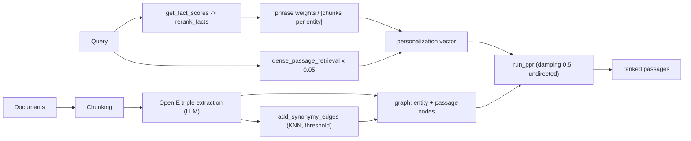

## 1. Executive Summary

HippoRAG is an MIT-licensed research framework from OSU-NLP-Group (NeurIPS'24, with HippoRAG 2 reframing the work as non-parametric continual learning). It is the only system in this atlas whose retrieval mechanism is **Personalized PageRank over a knowledge graph**, and that single choice makes it worth studying regardless of whether you adopt the rest.

The analogy the paper draws is explicit: the LLM is the neocortex, an encoder is the parahippocampal region, and an open knowledge graph is the hippocampus. What matters architecturally is what falls out of it.

Every other graph-backed system in the atlas performs multi-hop retrieval by **traversing**: [Graphiti](../graphiti/) runs BFS across edges and nodes, [Cognee](../cognee/) exposes triplet retrievers, [agentmemory](../agentmemory/) fuses a graph arm into weighted RRF. Each has to decide how far to walk and in which direction. HippoRAG does not walk. It builds a **personalization vector** — seeding graph nodes with query-relevant weight — and lets a random-walk-with-restart diffuse relevance across the whole graph in one operation. Multi-hop association becomes a property of the diffusion, not of a traversal policy.

Two design details deserve attention beyond the headline:

**Entities are linked, never merged.** `add_synonymy_edges` runs KNN over entity embeddings and adds *edges* between similar phrases above a threshold. Compare Graphiti, whose report's stated biggest risk is that entity-resolution mistakes reshape a large portion of the graph. HippoRAG sidesteps that entire failure class: a wrong synonymy edge adds a weak diffusion path, while a wrong merge destroys two identities irreversibly.

**Seed weights are inverse-frequency penalized.** A phrase's seed weight is its fact score divided by the number of chunks that entity appears in, so ubiquitous entities do not dominate the diffusion. This is an IDF instinct applied to graph seeding, and it is the kind of detail that separates a working PPR system from one that always returns the hub nodes.

The limits are those of a research artifact aimed at benchmarks rather than agents: there is no scope, no trust state, no provenance beyond chunk identity, deletion is explicitly partial, and unit-test coverage is thin next to a well-developed benchmark reproduction tree. It is also corpus-oriented — it indexes documents, not conversations — so using it as agent memory means deciding what a "document" is.

## 2. Mental Model

There is no memory record type. The unit is a **chunk** plus the graph derived from it:

```text
Nodes
  entity-<hash>   phrase nodes from OpenIE triples
  passage nodes   one per indexed chunk
Edges
  fact edges      subject --predicate--> object, from extracted triples
  passage edges   entity --appears-in--> chunk
  synonymy edges  entity <--similarity--> entity  (KNN above threshold)
```

Indexing:

```text
docs -> chunk -> OpenIE (LLM) -> (subject, predicate, object) triples
     -> add_fact_edges / add_passage_edges / add_synonymy_edges
     -> embed entities, facts, and chunks into an embedding store
     -> augment_graph / save_igraph
```

Retrieval — the part worth copying:

```text
query
 -> get_fact_scores(query)              embedding similarity against fact triples
 -> rerank_facts(...)                   LLM filter/rerank to top-k facts
 -> for each top fact, take subject and object phrases:
        weight = fact_score / |chunks containing that entity|      # IDF-style penalty
        accumulate into phrase_weights, then average per phrase
 -> dense_passage_retrieval(query)      normalized, scaled by passage_node_weight (0.05)
 -> node_weights = phrase_weights + passage_weights                # personalization vector
 -> run_ppr(node_weights, damping)      igraph personalized_pagerank, prpack, undirected
 -> rank passage nodes by resulting PageRank score
```

The dense retrieval arm is deliberately weak — passage nodes are seeded at 0.05 — so it acts as a prior that nudges the diffusion rather than a competing ranker.

## 3. Architecture

`src/hipporag/` is about 7,500 lines, dominated by one orchestrator:

- `HippoRAG.py` (1,756 lines) — indexing, graph construction, retrieval, PPR, QA, and deletion.
- `StandardRAG.py` (429) — a baseline for comparison.
- `information_extraction/openie_{openai,vllm_offline,transformers_offline}.py` — triple extraction backends.
- `embedding_store.py`, `embedding_model/`, `vector_stores/{qdrant,chroma,milvus}_store.py` — pluggable embedding and vector storage.
- `llm/` — OpenAI, Bedrock, vLLM, and transformers backends.
- `rerank.py`, `utils/config_utils.py` (295), `utils/llm_utils.py` (436).
- `reproduce/` — benchmark reproduction harness and dataset scaffolding.



## 4. Essential Implementation Paths

### Seeding the personalization vector (`graph_search_with_fact_entities`)

For each reranked fact, both the subject and object phrase are hashed to an `entity-` node key and looked up in the graph. When found, the fact's score is added to that node's weight — divided first by the number of chunks the entity occurs in. Weights are then averaged across occurrences, and optionally truncated to `link_top_k` phrases.

Dense passage retrieval scores are min-max normalized and written into the same vector at `passage_node_weight = 0.05`.

One line is worth flagging as a robustness issue:

```python
assert sum(node_weights) > 0, f'No phrases found in the graph for the given facts: {top_k_facts}'
```

A query whose extracted phrases do not link to any graph node raises an `AssertionError` rather than degrading to dense retrieval. In a benchmark harness that is a reasonable loud failure; in an agent's recall path it is an outage.

### Running the diffusion (`run_ppr`)

```python
pagerank_scores = self.graph.personalized_pagerank(
    vertices=range(len(self.node_name_to_vertex_idx)),
    damping=damping,          # default 0.5
    directed=False,
    weights='weight',
    reset=reset_prob,
    implementation='prpack',
)
```

Two choices matter. `damping=0.5` is far lower than PageRank's conventional 0.85, meaning the walk teleports back to the seed nodes very often — relevance stays close to the query's entities rather than drifting toward globally central hubs. And `directed=False` means predicate direction is discarded for diffusion: "A acquired B" and "B acquired A" propagate identically. That is fine for associative recall and wrong for directional reasoning, and it is not stated as a limitation anywhere in the code.

NaN and negative reset probabilities are clamped to zero before the call, which is a small but real defence against a malformed seed vector.

### Synonymy edges (`add_synonymy_edges`)

KNN over all entity embeddings, filtered by `synonymy_edge_sim_threshold`, with batched query/key processing and — importantly — edges built only between newly inserted phrase nodes and existing ones, so incremental indexing does not rebuild the full N² comparison.

This is the atlas's [hybrid retrieval fusion](../../patterns/hybrid-retrieval-fusion/) instinct expressed as topology: instead of fusing a lexical score with a vector score at rank time, embedding similarity becomes permanent graph structure that the diffusion traverses.

### Deletion (`delete`)

The docstring is admirably explicit: "triples and entities which are indexed from chunks that are not being removed will not be removed." Deletion removes chunks and the triples unique to them, while shared entities and facts survive because other chunks still support them.

This is defensible — it is reference counting, not a bug — but it means deleting a document does not guarantee that everything it contributed disappears. An entity introduced by a deleted chunk and later mentioned in a surviving one remains a node with its accumulated edges. For a memory system with privacy obligations, that distinction needs to be stated to users.

## 5. Memory Data Model

Storage is an igraph graph plus an embedding store with pluggable vector backends (Qdrant, Chroma, Milvus). Nodes are content-hashed (`compute_mdhash_id`), so identity is deterministic from text.

What is absent, relative to the agent-memory systems in this atlas:

- **No scope.** There is no user, session, agent, or tenant key anywhere. The corpus is global.
- **No trust or lifecycle state.** No candidate/verified/rejected, no pinning, no expiry, no decay.
- **Provenance is chunk identity only.** A fact edge records which chunks support it; it records nothing about who said it, when, or with what authority.
- **No correction semantics.** A wrong extracted triple can be removed only by deleting the chunks that produced it, and re-indexing that chunk reproduces it.
- **Time is absent.** There is no event time, no validity interval, nothing comparable to [Graphiti](../graphiti/)'s bi-temporal edges.

These are consistent with the project's actual goal — corpus QA benchmarks — but they are the gap between "retrieval framework" and "agent memory", and HippoRAG 2's continual-learning framing does not close it in the inspected code.

## 6. Retrieval Mechanics

The pipeline is genuinely multi-stage: fact-level embedding similarity, LLM reranking of candidate facts, IDF-penalized graph seeding, a weak dense-passage prior, and PPR diffusion. `retrieve_ircot` / `answer_with_ircot` add interleaved retrieve-and-reason for multi-hop QA, and `retrieve_dpr` provides a pure dense baseline.

Its distinctive strength is **sense-making across documents**: because diffusion crosses synonymy and fact edges, a query can surface a passage that shares no vocabulary with it, reached through two or three intermediate entities. That is exactly the case flat vector search handles worst.

Its distinctive weakness is **cost and opacity**. Retrieval requires an LLM rerank call before the graph step, PPR runs over the entire graph per query (timed separately as `ppr_time`), and the resulting ranking is not attributable to any single signal — you cannot easily answer "why did this passage rank first?" beyond "the diffusion put weight there."

## 7. Write Mechanics

`index(docs)` chunks, extracts triples via OpenIE, builds fact/passage/synonymy edges, embeds everything, and augments the graph. `pre_openie` allows extraction to be run ahead of time, and `load_existing_openie` / `merge_openie_results` / `save_openie_results` make extraction results cacheable and resumable across runs — a practical touch, since OpenIE over a large corpus is the expensive step.

Extraction quality is LLM-dependent and ungated: a hallucinated triple becomes a permanent edge that shapes every future diffusion, with no verification tier and no way to mark it rejected. The atlas's standing objection to treating LLM-extracted facts as truth applies here with extra force, because in a diffusion model a single wrong edge affects far more than one retrieval result.

## 8. Agent Integration

There is no MCP server, no tool surface, no hooks, and no service. HippoRAG is a Python library with `main.py` and `examples/` as entry points, aimed at researchers reproducing benchmark numbers.

Anyone mounting it as agent memory has to supply scope, lifecycle, provenance, correction, and an injection strategy themselves, and has to decide what a "document" is when the input is conversation rather than corpus.

## 9. Reliability, Safety, and Trust

Strengths:

- Deterministic content-hashed node identity.
- Non-destructive entity resolution — synonymy as edges, not merges.
- Incremental synonymy construction that avoids full recomputation.
- Cacheable, resumable OpenIE with explicit merge/save paths.
- NaN/negative clamping on the reset vector.
- Honest documentation of deletion's reference-counted semantics.
- Pluggable LLM, embedding, and vector-store backends.

Gaps:

- **Assertion instead of fallback** when no query phrase links into the graph.
- **Undirected diffusion** silently discards predicate direction.
- **No scope, trust state, provenance, or temporal model.**
- **Extracted triples are permanent** and unverifiable; a wrong edge has graph-wide blast radius.
- **Deletion is partial by design** and needs to be surfaced to users with privacy requirements.
- **Per-query PPR over the whole graph** is a real cost that grows with corpus size.

## 10. Tests, Evals, and Benchmarks

This is the inverse of most systems in the atlas: benchmark reproduction is well developed and unit testing is thin. `tests/` contains `test_bedrock_mantle.py` (73 lines) plus an `integration/` directory, while `reproduce/` carries the dataset and harness scaffolding for the published evaluations.

The suites were not run for this review, and no numbers were reproduced. The published claims — multi-hop retrieval and sense-making gains over standard RAG — rest on the papers and the `reproduce/` tree rather than on committed result artifacts in this checkout, so the same caution the atlas applies to [OpenViking](../openviking/) applies here: a reproduction harness is not a reproduced result.

For a system whose ranking is a diffusion process, the most valuable missing tests are the ones nobody has written: what happens to ranking when a single synonymy edge is wrong, and how much does the `damping` and `passage_node_weight` pair move results?

## 11. Patterns Worth Stealing

- **Diffusion instead of traversal.** Seeding a personalization vector and running PPR removes the hop-depth and direction decisions that make BFS-based graph memory hard to tune.
- **Inverse-frequency seed weighting.** Dividing a seed weight by the entity's chunk count is a one-line defence against hub domination.
- **Synonymy as edges, not merges.** Non-destructive entity resolution: a wrong link degrades ranking slightly; a wrong merge destroys identity.
- **A weak dense prior.** Seeding passage nodes at 0.05 lets vector search inform the diffusion without competing with it.
- **Low damping for query-locality.** 0.5 keeps relevance near the seeds; it is a tunable that directly expresses "how associative should recall be?"
- **Cacheable extraction.** Separating `pre_openie` from `index` makes the expensive LLM stage resumable.

## 12. Antipatterns / Risks

- **Hard assertion on an empty seed vector**, where a fallback to dense retrieval is the obvious behaviour.
- **Direction discarded** without documentation.
- **LLM-extracted edges treated as permanent structure** with no verification or rejection state.
- **Deletion that does not remove derived structure**, undocumented outside a docstring.
- **Corpus-global scope** with no isolation of any kind.
- **Whole-graph computation per query**, which is a scaling cliff rather than a gradient.

## 13. Build-vs-Borrow Takeaways

Borrow:

- The PPR retrieval formulation, essentially as written — it is the most transferable idea, and igraph's `personalized_pagerank` makes it a small amount of code.
- IDF-style seed penalization.
- Synonymy-as-edges in place of entity merging, particularly if you have been burned by resolution mistakes.
- The cacheable OpenIE split.

Do not copy:

- The assertion; degrade to dense retrieval instead.
- Undirected diffusion if your predicates carry meaning.
- The data model as agent memory — it has no scope, trust, provenance, or time, and all four would have to be added before it could carry a user's memory.

## 14. Open Questions

- How sensitive is ranking to `damping` and `passage_node_weight`? Both are defaults with no published ablation in the repository.
- What is the right behaviour when a query's phrases miss the graph entirely?
- Could edges carry direction for reasoning while remaining undirected for diffusion?
- How would scope be added — one graph per tenant, or scope-filtered subgraphs before PPR?
- Does per-query PPR remain viable at agent-memory corpus sizes, or does it need approximation?
- Can a wrong synonymy edge be detected after the fact, given that its effect is diffuse by construction?

## Appendix: File Index

- Orchestrator, indexing, retrieval, PPR, deletion: `src/hipporag/HippoRAG.py`.
- PPR seeding: `graph_search_with_fact_entities()`; diffusion: `run_ppr()`.
- Graph construction: `add_fact_edges()`, `add_passage_edges()`, `add_synonymy_edges()`, `augment_graph()`.
- Triple extraction: `src/hipporag/information_extraction/openie_*.py`.
- Embedding and vector storage: `src/hipporag/embedding_store.py`, `embedding_model/`, `vector_stores/`.
- Baseline: `src/hipporag/StandardRAG.py`.
- Configuration defaults (`damping`, `passage_node_weight`, `synonymy_edge_sim_threshold`, `linking_top_k`): `src/hipporag/utils/config_utils.py`.
- Benchmark reproduction: `reproduce/`.
- Tests: `tests/test_bedrock_mantle.py`, `tests/integration/`.
