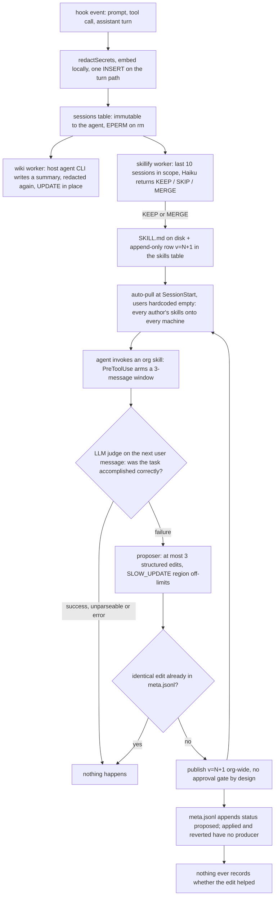

## 1. Executive Summary

Hivemind is a TypeScript hook layer that gives a team of coding agents one shared long-term memory: every prompt, tool call and assistant turn is written as a row in a Deeplake workspace, a background worker turns each session into an LLM-written wiki summary, and a second worker mines batches of recent sessions into `SKILL.md` files that install themselves on every teammate's machine at the next session start. Apache-2.0, package `@deeplake/hivemind` at version 0.7.152, 57,117 lines of TypeScript in `src/` against 314 test files carrying 5,470 `it()` cases. This is Activeloop's Hivemind; the atlas also covers an unrelated project of the same name, [causewayai/hivemind](../hivemind/), which shares nothing with it.

**The interface is the interesting product decision.** Memory is not a tool API. A `PreToolUse` hook watches for Bash, Read and Grep touching `~/.deeplake/memory/`, validates the command against an allowlist of 74 builtins, and executes it against a virtual filesystem backed by SQL (`src/hooks/pre-tool-use.ts`, `src/shell/deeplake-fs.ts`, `src/hooks/memory-path-utils.ts:8-37`). The agent runs `grep -r auth ~/.deeplake/memory/` and gets a `UNION ALL` of an ILIKE scan and a cosine search across the summaries and sessions tables. Nothing had to be taught a new tool.

**The correction mechanism is the reason to read this repository.** Invoking an org skill arms a judgment window of three user messages (`src/skillify/skillopt-trigger.ts:1-17,:39`). The next user message spawns a detached worker that reconstructs the window around the invocation, appends the reaction, and asks an LLM one deliberately narrow question — *"Ignore whether the user seemed happy or polite — a praised-but-wrong answer is a FAILURE"* (`src/skillify/success-judge.ts:28-33`). On `success: 0` a proposer returns at most three structured edits, which are applied outside a protected `SLOW_UPDATE` region and published as version N+1 to the organisation's skills table (`src/skillify/skillopt-improve.ts:119-152`, `src/skillify/skill-edits.ts:19-43`). A memory correction driven by the user's next sentence, in a setting with no training reward, is rare.

**It publishes that correction to everyone with nothing in the way, and says so.** `src/skillify/skill-org-publish.ts:5-6` reads *"No approval gate by design: detect → improve → publish, directly."* The edited skill is a teammate's, the editor is recorded only as a contributor, and auto-pull writes it to every signed-in machine at the next session start with the author filter hardcoded to the empty list (`src/skillify/auto-pull.ts:147`). `human_review` is withheld on that sentence.

**The loop does not learn from itself.** `MetaStatus` is `"proposed" | "applied" | "reverted"` (`src/skillify/skillopt-meta.ts:15`) and the docstring says the A/B gate will close the loop; `metaEntryFor` writes `status: "proposed"` and nothing in the tree writes either other value or reads the field at all. The optimizer's cross-run memory therefore prevents re-proposing an identical edit and records nothing about whether any edit helped.

**The weakest claim is proactive recall.** The README says recall degrades to *"lexical (ILIKE keyword overlap), so it works without the embedding model"*. The hook says the opposite in a comment and in code: *"SEMANTIC (cosine) ONLY… there is deliberately no lexical (ILIKE) fallback"* (`src/hooks/recall.ts:13-16`). Embeddings are off unless `@huggingface/transformers` resolves, which a fresh install does not have (`src/embeddings/disable.ts:17-22`), so on a default install the advertised unprompted recall returns nothing on every prompt. The documented tuning knob for the removed path, `HIVEMIND_RECALL_MIN_OVERLAP`, survives as `MIN_LEXICAL_OVERLAP` with no reader anywhere in the tree.

## 2. Mental Model

Four kinds of thing are remembered and they sit at different epistemic levels. A **trace row** is a fact about what happened and cannot be wrong; it is immutable through the agent's own surfaces — `rm` on a session path throws `EPERM` (`src/shell/deeplake-fs.ts:1120`) — and removable only by the owner through `hivemind sessions prune`. A **summary** is one LLM's reading of a session, rewritten in place on each checkpoint. A **skill** is a claim about how to do something, and it is the only object with a lifecycle. A **rule**, **goal**, **KPI** or **doc page** is human- or generator-authored state with its own small table.

A skill becomes a belief when an LLM curator, shown the last ten sessions in scope and every existing skill, answers `KEEP` or `MERGE` against a rule it is told: the pattern must recur across at least three exchanges, be non-obvious to a competent engineer, and not already be covered (`src/skillify/skillify-worker.ts:276-278`). There is no execution and no outcome check at write time — the gate is a model reading transcripts. It stops being a belief only by being edited: `MERGE` from the mining worker, `push` from a person, or the reaction-driven optimizer, each appending a row at version N+1 that later readers select with `ORDER BY version DESC LIMIT 1`. Nothing retires a skill. `unpull` deletes the local copy and its manifest entry, and the next auto-pull reinstalls it, because the row is untouched and the pull carries no exclusion list.

Scope is the one field that moves on its own, in one direction. A `MERGE` whose editor is not the row's author sets `scope` from `me` to `team` — *"one-directional promotion"* (`src/skillify/scope-promotion.ts:34-41`) — and the SkillOpt publish promotes unconditionally, on the argument that an optimizer edit is inherently shared. The `scope` column is written on every row and read by no query in the tree.



## 3. Architecture

**Nothing runs as a server here.** The unit of execution is a short-lived Node process spawned by a host agent's hook, and every one of them talks to `https://api.deeplake.ai` by `POST /workspaces/<workspaceId>/tables/query` with `{query: "<SQL>"}` in the body, a bearer token, and an `X-Activeloop-Org-Id` header (`src/deeplake-api.ts:305-314`). The client composes all the SQL — DDL, healing `ALTER TABLE`, inserts, the retrieval UNIONs — so the mechanism is fully readable at this commit even though the engine behind the endpoint is not.

Eight tables are declared in one place (`src/deeplake-schema.ts`): `memory` for summaries and virtual-filesystem files, `sessions` for per-event traces, plus `skills`, `hivemind_rules`, goals, KPIs, docs and a codebase-graph snapshot table. Schema drift is handled by `healMissingColumns`, which reads `information_schema.columns` for the workspace, diffs against the declaration, and `ALTER TABLE ADD COLUMN`s only what is missing, tolerating one "already exists" race and re-verifying it. A module-load lint refuses any `NOT NULL` column without a `DEFAULT`, because the backfill on a populated table would fail.

**Local state is small but real**: `~/.deeplake/credentials.json` at mode 0600, `~/.deeplake/state/skillify/{config,pulled}.json`, `skillopt/meta.jsonl`, `recall-events.jsonl`, a per-session event cache the summary worker reads instead of re-scanning the fat `message` column, a `query-cache` directory materialising intercepted `Read` results as real files, and the skills themselves as `SKILL.md` directories under `.claude/skills/` or `~/.claude/skills/`.

### Deployment and ergonomics

An account and a token are required before anything is stored; there is no local-only mode, and with no credentials session start prints *"Not logged in to Deeplake; memory search is unavailable this session."* Install is one command that detects every supported assistant and wires its hooks. Semantic search is opt-in: `hivemind embeddings install` fetches nomic-embed-text-v1.5 (768 dimensions, matryoshka-truncated) and a local daemon, a ~600 MB dependency the README states up front. The summary, doc and skill-mining workers shell out to the host agent's own CLI (`claude -p`, `codex exec`, `pi --print`), so no second API key is needed and the token cost lands on the user's existing plan. The store is not repairable by hand — it is rows behind an HTTP endpoint — but the virtual filesystem makes it browsable with `ls` and `cat`, and BYOC points the bytes at the adopter's own GCS, Azure or S3 bucket.

## 4. Essential Implementation Paths

- **Capture.** `src/hooks/capture.ts` on `UserPromptSubmit`, `PostToolUse`, `Stop` and `SubagentStop`: resolve the per-directory config, build the event object, `redactSecrets` the serialized line, embed it through the local daemon, and `buildDirectSessionInsertSql` → one INSERT, with a create-and-retry fallback on a missing table.
- **Summary.** `src/hooks/spawn-wiki-worker.ts` spawns `src/hooks/wiki-worker.ts` detached; it prefers the local event cache over the table, writes the JSONL to a temp dir, runs the host CLI against `WIKI_PROMPT_TEMPLATE` (`spawn-wiki-worker.ts:21-66`), redacts the result and hands it to `src/hooks/upload-summary.ts`, which redacts again and UPDATEs the row.
- **Skill mining.** `src/skillify/triggers.ts` counts assistant turns and fires `src/skillify/skillify-worker.ts`; it lists candidate sessions with `project = ?` plus `authorClause()`, extracts prompt/answer pairs under a 40,000-character budget, renders every existing skill into the prompt, runs the gate CLI, parses a verdict from a file or stdout, writes or merges the `SKILL.md`, and `insertSkillRow`s version N+1.
- **Propagation.** `src/skillify/auto-pull.ts` at SessionStart → `src/skillify/pull.ts`: `buildPullSql` selects every skill row, `selectLatestPerName` keeps the highest version per `(project_key, name)`, and each is rendered back to a `SKILL.md` at `<root>/<name>--<author>/` with symlinks fanned out to other agents' skill roots.
- **Retrieval.** `src/hooks/pre-tool-use.ts` intercepts the tool call; `src/shell/grep-core.ts:308-412` builds the hybrid UNION; `src/shell/grep-core.ts:681-768` re-applies the real regex to the returned rows and formats grep-shaped output. `src/hooks/recall.ts` is the unprompted path. `src/mcp/server.ts` exposes the same searches as `hivemind_search`, `hivemind_docs_search`, `hivemind_read` and `hivemind_index`.
- **Correction.** `src/hooks/shared/skillopt-hook.ts` arms and reacts; `src/skillify/skillopt-worker.ts` takes a per-skill lock; `src/skillify/skillopt-improve.ts` judges, proposes and publishes.
- **Deletion.** `src/commands/session-prune.ts` via `hivemind sessions prune`; `DeeplakeFs.rm` (`src/shell/deeplake-fs.ts:1118-1194`) for everything under the memory mount.

## 5. Memory Data Model

A trace row carries `id`, `path` (`/sessions/<user>/<user>_<org>_<ws>_<sessionId>.jsonl`), `message` as JSONB, a `FLOAT4[]` embedding, `author`, `project`, `description` (the hook event name), `agent`, `plugin_version`, `creation_date` and `last_update_date`. A summary row is the same shape with `summary` text instead of JSON. Both carry record time only: a search for `valid_from`, `valid_until`, `valid_time`, `effective_from` or `as_of` across `src` and `tests` returns nothing, so `bitemporal` is withheld.

`project` is two different things under one name, and the difference matters. On trace and summary rows it is `basename(cwd)` (`src/utils/project-name.ts:14-16`) — two checkouts named `api` collide, and a prompt issued from a subdirectory tags a different project. On docs and skills rows it is `deriveProjectKey`: a sha1 of the normalised `remote.origin.url`, truncated to 16 hex, falling back to the absolute cwd. The weak one is why proactive recall has no project filter at all, and the comment says so: a basename filter *"both collides… and — worse — silently drops valid history when the user prompts from a subdirectory"* (`src/hooks/recall.ts:122-128`).

A skill row is the richest object: `name`, `project_key`, `local_path`, `install`, `source_sessions` (the session ids it was mined from), `source_agent`, `scope`, `author` (immutable lineage across merges), `contributors`, `description`, `trigger_text`, `body`, `version`, timestamps. Correction is a version chain — skills, rules and docs all INSERT a new row rather than UPDATE, explicitly to sidestep a storage quirk the comments describe as *"two rapid UPDATEs on the same row drop one silently"*. Goals and KPIs were written the same way and are not any more: `upsertGoalRow` UPDATEs in place and the comment is candid — *"The version column stays at 1 (vestigial in the schema…). Cons: no audit trail"* (`src/shell/deeplake-fs.ts:524-538`). Two comments in the tree still describe the old behaviour, including `rm`'s claim that closing a goal *"writes a new v=N+1 with status='closed' (soft-close, preserves audit trail)"* when it reaches the in-place UPDATE.

Multi-tenancy is the workspace, enforced on the other side of the API: the workspace id is a path segment and the org an auth header, so every row a query can see belongs to one workspace. That is a partition, not a stored key applied on a read path, and it earns no mark here. Everyone in the workspace reads everything in it, which the README states as the design.

## 6. Retrieval Mechanics

Grep is compiled, not passed through. `buildGrepSearchOptions` turns the agent's flags into a server-side `LIKE`/`ILIKE` prefilter, extracting a literal prefix or an alternation set from a regex when it can, and `refineGrepMatches` re-applies the true regex in Node so `-v`, `-c`, `-l` and `-n` behave. With an embedding available the query becomes four subqueries in one `UNION ALL` — semantic over `summary_embedding` and `message_embedding` with `ARRAY_LENGTH(col, 1) > 0` to exclude rows a migration backfilled with `[]`, and lexical over `summary::text` and `message::text` — then `ORDER BY score DESC LIMIT 40`. **Lexical rows emit a constant `1.0` sentinel**, so every literal substring hit sorts above every semantic hit regardless of cosine; the comment defends it, and notes that BM25 was tried and dropped because its `~1..3` scale swamped cosine in the same union.

Proactive recall is a different query and a stricter one: only `/summaries/%` paths, only rows with a non-empty vector, the current session's own summary excluded by path, top three by cosine, one injected if it clears the threshold — attributed as `recalled from <teammate> · <date>`, on a 1,500 ms budget whose abort actually cancels the in-flight query. The gate before it skips acknowledgements and short follow-ups, and every recall-worthy invocation is appended to `~/.deeplake/recall-events.jsonl` with `injected`, `below`, `none`, `timeout` or `error`, which is a usable hit-rate instrument. `RecallQueryOptions.project` exists and is exercised only by a test; the single production caller omits it deliberately, so recall reads the whole workspace's summaries.

**Failure modes.** Over-recall is bounded to one snippet per prompt and under-recall is the default state, since with no embedding daemon the path returns `none` every time. The index the agent reads first, `/index.md`, is capped at the 50 most recent rows per section. Tool output is normalised on the way out — `formatToolCall` drops boilerplate, and any `<recalled-memories>` block injected by a previous turn is stripped greedily from first open to last close, so recalled text cannot be re-retrieved as if it were fresh evidence (`src/shell/grep-core.ts:248-269`). The code graph under `<memory>/graph/` is substring search over node ids with a one-hop neighbourhood, read from a local snapshot with zero network calls; it is a browsable surface, not an arm of memory retrieval, and the README's claim that *"Search and recall walk this graph"* is not true of either `searchDeeplakeTables` or the recall query.

## 7. Write Mechanics

Capture is on the turn path. Each hook event does one local embed and one INSERT before the hook returns; a table-missing error triggers a create and one retry, and the whole `main` is wrapped so a failure exits 0 and surfaces nothing mid-session. The refusal to surface anything is a deliberate rule worth quoting: a user-facing message can only reach a mid-session hook through `additionalContext`, which is the model's prompt, and *"Writing a user-facing 'credits exhausted, top up at `<url>`' notice there is a prompt-injection pattern… Hard rule: nothing user-facing is ever written into the model/agent prompt"* (`src/hooks/capture.ts:304-318`). The same rule keeps LLM-derived banner prose out of `additionalContext` at session start.

Everything derived is deferred to a detached worker. Summaries fire at 10 captured events, then every 50 events or 2 hours, and at session end; mining fires when a per-project counter of assistant-complete events reaches 20, and unconditionally at session end so the tail of a session is not missed. Lag before a new memory is retrievable is therefore a trace immediately, a summary at the next checkpoint, and a skill at the next mining run plus the next machine's session start — and the optimizer builds in a bounded retry for the insert-to-read visibility lag, polling `findInvocation` five times with linear backoff before giving up. No pass rewrites the whole store; every background job reads a bounded window, and the mining watermark is set to the **oldest** session in the batch rather than the newest, so a session older than the `LIMIT` cutoff is not permanently skipped.

Deduplication is the curator's job, not the store's: the mining prompt renders every existing skill, project and global, tagged with its author, and forbids `MERGE` into any name not in that list. Conflict between two workers on the same skill is handled by a per-skill lock plus the meta fingerprint; across machines it is not, and the comment says the append-only history plus a deterministic pull tie-breaker is the intended follow-up.

Noisy input is filtered in exactly one place and it is a good one. `src/hooks/shared/redact.ts` masks before the text is embedded or written: PEM and OpenSSH key blocks, about thirty provider token schemes with the scheme prefix kept as a hint, `Authorization` headers, URL basic-auth, Sentry DSNs and Slack webhooks, `KEY=VALUE` where the key is secret-ish, and a Shannon-entropy backstop for unlabelled tokens with guards that exempt UUIDs, hex hashes and dated model identifiers. It runs on capture, on the generated summary, and again on upload. It does not run on a `SKILL.md` a person pushes with `hivemind skillify push`.

## 8. Agent Integration

Seven host agents, each wired differently: a marketplace plugin for Claude Code, hooks in `hooks.json` for Codex and Cursor, shell hooks in `config.yaml` plus an MCP server and a skill for Hermes, a native extension for OpenClaw, a TypeScript extension registering first-class tools for pi, and MCP alone for Claude Cowork. The Cowork path is honest about its limit: with no hook lifecycle, a background ingester tails Local Agent Mode transcripts with a per-transcript line watermark, and plain desktop-chat turns are stated as uncapturable because an MCP server never sees the conversation.

The agent's agency over memory is broad and indirect. It cannot call a `save_memory` tool — writes happen to it, by hook — but it can read, `grep`, `cat`, `mv` and `rm` anything under the mount, create goals by Bash heredoc against `<memory>/goal/<owner>/<status>/<uuid>.md`, and move a goal between states with `mv`. `Write` and `Edit` on the mount are denied with a message telling it to use Bash instead. Session start injects the active team rules plus a how-to block telling the model to treat a rule violation as a critical error, and a one-line note for the graph and the docs wiki; Codex is deliberately excluded from the rules injection to keep its TUI clean.

Adapting this to another agent is the same three pieces each time — a capture hook, a session-end hook, and either a tool-intercept point or the shared MCP server — and the tree contains seven worked instances of it, including one (Cowork) where the intercept does not exist and the transcript tail stands in for it.

## 9. Reliability, Safety, and Trust

**Provenance is genuinely tracked and never consulted.** A skill row records who authored it, who has edited it, which session ids it came from, which agent produced it and which plugin version wrote it, and the pulled file carries all of it in frontmatter so a later gate can see whose skill it is. No query filters on any of it. There is no epistemic state anywhere: `trust_state` is withheld because no field distinguishes a candidate from a verified skill, and the closest thing — `docs.status` moving `active` → `archived` when a branch overlay is promoted — is archival, which the rubric excludes.

**`tombstone` is withheld and the near-miss is written down in the tree.** The only occurrence of the word is a schema comment: *"deleting a KPI conceptually means writing a tombstone version, deferred to v1.1"* (`src/deeplake-schema.ts:163`). Deletion elsewhere is unrecorded: `hivemind sessions prune` hard-deletes your own trace rows and the matching summary, `rm` under the mount is a `DELETE FROM … WHERE path = …`, and neither touches the skills those sessions were mined into — a skill's `source_sessions` can name rows that no longer exist, and the knowledge distilled from a session survives the session's deletion with no marker anywhere.

**`audit_log` is withheld, and the version chain is the reason it is close.** Skills, rules and docs are append-only by construction, so every edit to them is durable and attributable. But that is a version history of the object, not a named event record of mutations, and the two tables holding the captured memory go the other way: `upsertRowSql` UPDATEs a summary in place, and prune deletes. The project knows the cost of in-place writes — the append-only pattern exists to dodge a documented storage quirk — and chose it twice anyway, for summaries and for goals.

**The trust boundary is stated plainly by the product and is the thing to weigh.** Everyone in the workspace reads every trace, and a skill mined from one engineer's session is executed as instructions in another's. A `.hivemind` file travels with a repository and can route a clone's traces and reads to a different org; the defence is that it cannot carry a token, so it can only target orgs the existing login already authorises, and that the session-start banner always prints the effective org, workspace and the file that routed it. The command interception is defended with unusual care: `isSafe` rejects `$( )`, backticks, process substitution and `$'…'` ANSI-C quoting, splits on pipes and separators and requires every stage's first token to be in the allowlist, and the allowlist's comments record what was removed and why — `sed` for `-e '1e <cmd>'`, `awk` for `system()`, `xargs`, `tar --to-command`, `env`, `timeout` and `time` as wrappers that run an arbitrary child. Against that, the summary prompt instructs the model to preserve *"exact token/key/secret-name values"* verbatim into a summary every workspace member can read, with a worked example that writes a staging token into the wiki; the redactor masks on both sides of that instruction, so what survives is whatever the masker does not recognise.

**Recovery and consistency.** Queries retry with exponential backoff and bounded concurrency; a 402 enqueues a user-visible banner because otherwise *"captures and memory recalls fail silently — the agent reads empty memory and confidently reasons from no data"*. A session-start placeholder row is cleaned up if events never arrive. There is no backup of the local skill directory beyond a `.bak` written when a pull clobbers a same-named file.

## 10. Tests, Evals, and Benchmarks

The suite is large and the CI gate is unusual: per-file coverage thresholds, mostly 90, that each pull request appends to, with the comments explaining every calibration below the bar. Vitest runs with coverage on every push, alongside a duplication check, CodeQL, a Windows smoke subset, and a static audit of the OpenClaw bundle against ClawHub's scan rules.

What that gate does not cover is named in the same file. `src/skillify/skillify-worker.ts` and its spawner are excluded from coverage because they *"need a live Deeplake workspace + a real agent CLI to exercise meaningfully"* — so the worker whose verdict decides what becomes a team skill is checked only by a bundle-scan test asserting the built artifact exists and contains the right entry strings, and the end-to-end matrix script is recorded as living *"at /tmp/skillify-e2e-matrix.mjs in the author's worktree, not committed"*.

The evaluation claims are the weakest part. The README reports a LoCoMo run — $8.94 to $6.65 per 100 QA, 1,700 to 1,008 tokens per question, 8.9 to 6.2 turns — and no harness, result file or dataset for it exists in the tree: no path matches `locomo` or `benchmark`, and the numbers appear only as prose plus a hardcoded 1.7x multiplier used to render a per-session "tokens saved" banner (`src/dashboard/data.ts:57`, `vitest.config.ts:486`). What the repository does carry is the residue of that run as regression tests: `tests/claude-code/pre-tool-use-baseline-cloud.test.ts` rebuilds 272 session rows matching the real `locomo_benchmark/baseline` workspace and pins the three QAs the run got wrong, and `tests/claude-code/output-cap.test.ts` records the cause behind that run's losses — *"11 of 14 losing QAs that hit this path never recovered the persisted file"* when Claude Code spilled a large tool result to disk and showed the model a 2 KB preview. Turning a benchmark loss into a committed fixture is better practice than most published numbers, and it is not the number.

The cited tests can fail. The resume-brief exclusions each assert the replacement is present against a populated fixture, so none of them can pass on an empty result; the docs project-scope test asserts the predicate is present when a project is set and absent when it is not, so it fails in both directions. No test in the tree asserts that a skill mined in one project stays out of another's search, and none asserts anything about the optimizer's effect on a skill's later success — there is no signal to assert it with.

## 11. For Your Own Build

### Steal

- **Mount memory as a filesystem and compile the shell commands.** An allowlist of builtins, a path intercept, and a compiler from `grep` flags to SQL gets you retrieval that needs no tool documentation, no schema in the prompt, and no new habit from the model. The allowlist's removal comments are the artifact to copy: each one names the escape it closes.
- **Judge the user's reaction, and ask the question that resists sycophancy.** *"Ignore whether the user seemed happy or polite — a praised-but-wrong answer is a FAILURE"* is the whole idea, and the conservative parse — unparseable, empty or errored returns success — means a flaky judge can fail to detect but never manufacture a failure.
- **Bound the edit and protect a region.** At most three structured ops, anchored on existing text, with a `SLOW_UPDATE` block that fast edits may not touch, keeps an automatic rewriter from laundering a document into something else over a dozen turns.
- **Set a mining watermark to the oldest item in the batch, not the newest.** Ordering DESC and limiting N means a newest-watermark permanently skips everything under the cutoff. Re-mining is cheap; a permanent gap is not.
- **Redact before you embed.** Masking at the serialization boundary covers every field and both egress paths at once, and a fixed-width mask that keeps the scheme prefix stays debuggable without leaking length.
- **Never write user-facing prose into the model's context.** A mid-session notice with a URL in it is a prompt-injection pattern whoever audits you will flag, and there is almost always a user channel available instead.

### Avoid

- **Publishing an automatic correction to shared memory with no review.** The judge is one LLM reading one window; the blast radius is every teammate's next session. A staging scope, or a diff a person confirms, costs a version bump and buys back the failure mode.
- **Declaring an outcome vocabulary you never write.** `proposed | applied | reverted` with only the first produced and none read means the loop cannot tell an improvement from a regression, and the dedup it does have only prevents proposing the *same* edit — a different edit toward the same wrong idea is unimpeded.
- **Filtering a read path with a parameter every caller omits.** An optional `project` on the query builder, a `users` list hardcoded empty at the only automatic call site, and a `scope` column nothing selects on are three shapes of the same defect: the boundary exists in the code and not in any request.
- **Deriving a scope key from a basename.** It collides across repositories and changes when the agent is invoked from a subdirectory. The fix here — a hash of the git remote — already exists in the same tree and is used for a different table.
- **Letting a README describe a path the code removed.** A documented fallback, a documented tuning variable and a documented degradation mode all outlived the lexical recall arm; a reader tuning `HIVEMIND_RECALL_MIN_OVERLAP` is adjusting a constant nothing reads.

### Fit

This suits an organisation that has already decided its agent transcripts are a shared asset and is willing to keep them in a vendor's store — the data-collection notice is blunt about what is captured and who can read it, and that is the first question, not the last. Inside that decision it is a strong fit for a small-to-mid engineering team on one codebase who all use coding agents daily and want the propagation: the install is one command, the per-agent adapters are real, and nothing needs to be operated. It is a poor fit for anyone who needs local-only memory, since no credential means no storage at all; for consultancies and anyone working across client boundaries, where the `.hivemind` routing is the only separation and the default is one shared pool; and for teams that would need to review what enters a shared skill library, because the repository's position on that is explicit and the roadmap entry for pre-release review is a roadmap entry. Adopt the mounted-filesystem interface and the reaction judge as ideas regardless — they transfer to a store you run yourself.

## 12. Open Questions

- How often does the optimizer actually fire and publish in a real team, and how often is the resulting edit an improvement? Nothing in the tree measures it, and `recall-events.jsonl` has no counterpart for SkillOpt outcomes.
- Does the LoCoMo comparison hold up? Without a committed harness, dataset or per-question output, the cost, token and turn figures cannot be recomputed or re-run.
- What does the Deeplake engine do with a deleted row and its vector? Prune issues `DELETE FROM`; whether the embedding survives is on the other side of the API.
- How does a cross-machine race on the same skill resolve in practice? The per-skill lock is local, and the comment names a deterministic pull tie-breaker as a follow-up.
- The comments cite a `CLAUDE.md` as the authority for the UPDATE-coalescing quirk that shapes the whole append-only design, and that file is gitignored, so the reasoning behind the central storage decision is not in the repository.

## Appendix: File Index

- **Schema and client:** `src/deeplake-schema.ts`, `src/deeplake-api.ts`, `src/utils/sql.ts`, `src/utils/repo-identity.ts`, `src/utils/project-name.ts`.
- **Write path:** `src/hooks/capture.ts`, `src/hooks/shared/redact.ts`, `src/hooks/shared/session-insert-sql.ts`, `src/hooks/summary-state.ts`, `src/hooks/session-event-cache.ts`.
- **Summaries:** `src/hooks/spawn-wiki-worker.ts`, `src/hooks/wiki-worker.ts`, `src/hooks/upload-summary.ts`, `src/hooks/wiki-offset.ts`.
- **Retrieval:** `src/shell/grep-core.ts`, `src/shell/grep-interceptor.ts`, `src/shell/deeplake-fs.ts`, `src/hooks/pre-tool-use.ts`, `src/hooks/memory-path-utils.ts`, `src/hooks/virtual-table-query.ts`, `src/hooks/recall.ts`, `src/hooks/shared/recall-{gate,query,format,events}.ts`.
- **Skills:** `src/skillify/skillify-worker.ts`, `skill-writer.ts`, `skills-table.ts`, `pull.ts`, `auto-pull.ts`, `push.ts`, `unpull.ts`, `manifest.ts`, `scope-config.ts`, `scope-promotion.ts`, `gate-{parser,runner}.ts`.
- **Correction loop:** `src/skillify/skillopt-trigger.ts`, `skillopt-worker.ts`, `skillopt-improve.ts`, `success-judge.ts`, `skill-proposer.ts`, `skill-edits.ts`, `skillopt-meta.ts`, `skill-org-publish.ts`.
- **Other memory kinds:** `src/rules/{read,write}.ts`, `src/commands/goal.ts`, `src/shell/goal-paths.ts`, `src/docs/{write,refresh,promote,vfs-handler}.ts`, `src/graph/vfs-handler.ts`.
- **Integration and deletion:** `src/mcp/server.ts`, `src/mcp/cowork-ingest.ts`, `src/hooks/session-start.ts`, `src/dir-config.ts`, `src/commands/session-prune.ts`, `harnesses/`.
- **Tests:** `tests/claude-code/{grep-core,resume-brief,skillify-pull,deeplake-fs,pre-tool-use-baseline-cloud,output-cap}.test.ts`, `tests/shared/{recall,docs,success-judge,skillopt-*}.test.ts`, `vitest.config.ts`.

**Searches recorded for the negative claims**

```sh
grep -rn 'MIN_LEXICAL_OVERLAP' --include='*.ts' .                          # 1 hit: the declaration in recall-gate.ts:125, no reader
grep -rn 'RECALL_MIN_OVERLAP' .                                            # README table + prose, one test's env cleanup, the declaration
grep -rnE "'applied'|\"applied\"|'reverted'|\"reverted\"" --include='*.ts' src tests   # 1 hit: the MetaStatus type itself
grep -rn '\.status' src/skillify/                                          # only HTTP statuses and a spawn error; nothing reads MetaEntry.status
grep -rniE 'tombstone|deleted_value|rejected_value' --include='*.ts' src tests         # 1 hit: the deferred-to-v1.1 KPI comment
grep -rniE 'valid_from|valid_time|valid_until|effective_from|as_of' --include='*.ts' src tests   # 0: record time only
grep -rniE 'audit|event_log|mutation_log' --include='*.ts' src             # comments only, plus a graph-build history.jsonl
grep -rn 'recallTopHit' .                                                  # one production caller (recall.ts:163) and the tests; only a test passes `project`
grep -rn 'users: \[\]' src/                                                # auto-pull.ts:147 — the automatic pull has no author filter
grep -n 'author\|project' src/shell/grep-core.ts                           # both appear only in searchDocs; memory search has neither predicate
grep -rniE 'denylist|blocklist|blacklist' src/                             # 0: unpull records no exclusion the next pull consults
find . -path ./.git -prune -o \( -iname '*locomo*' -o -iname '*benchmark*' -o -iname '*eval*' \) -print   # one knowledge doc matching on "retrieval"
find . -path ./.git -prune -o \( -iname 'CITATION*' -o -iname '*.bib' -o -iname '*.cff' \) -print          # 0: no paper of its own
grep -rni 'arxiv|bibtex|@article|@misc|citation|doi' . | grep -v package-lock   # the LoCoMo dataset paper only; "the paper" in skillopt comments cites SkillOpt, uncited
find . -path ./.git -prune -o \( -iname 'CLAUDE.md' -o -iname 'AGENTS.md' -o -iname '.cursorrules' \) -print  # 0; CLAUDE.md is gitignored and cited by seven source comments
python3 -c "…count SAFE_BUILTINS…"                                         # 74 allowlisted builtins
```

## History

**2026-09-12** — [`26bdf69cdd0198bed344f252ef7abf85b1fdc604`](https://github.com/activeloopai/hivemind/commit/26bdf69cdd0198bed344f252ef7abf85b1fdc604) — first reading. Screened with `scripts/screen_repo.py` before any file was read: one auto-run surface (`.claude-plugin/` marketplace and plugin manifests, which point at a pinned subdirectory of this same repository), two build-time execution paths (`postinstall` running `scripts/ensure-tree-sitter.mjs`, a documented native-build heal, and `prepare` running husky plus the build), one unpinned manifest with 26 floating ranges against a present lockfile, and four surfaces inside the seven-day cooldown because a depth-1 clone dates every file to the pinned commit. `.husky/pre-commit` is `npx lint-staged` and is not installed in a bare checkout. No `CLAUDE.md`, `AGENTS.md` or `.cursorrules` exists in the tree; `library/README.md` carries an `ai_description` block addressed to a reading agent, which was read as data. Nothing was installed, built or run; every claim here comes from reading the tree.
