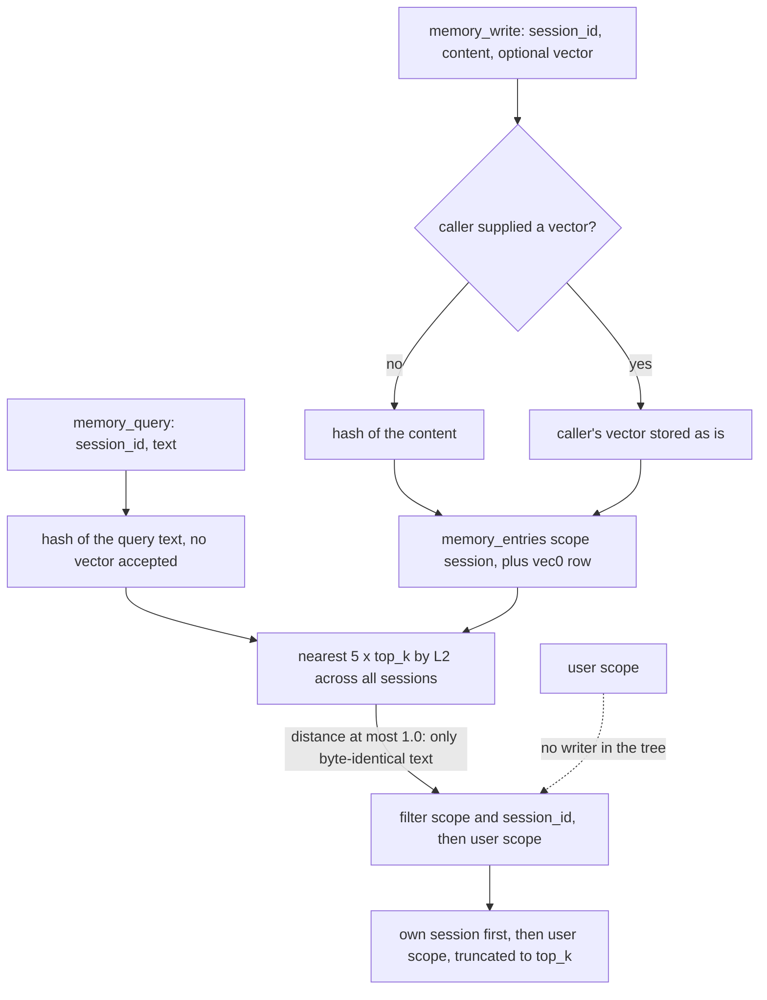

## 1. Executive Summary

Hivemind's Local Edition is a Go daemon, `hivemindd`, that gives AI harnesses a memory over MCP: write a fact, read it back later or from another harness on the same machine. Forty-four commits by one author over 5 and 6 September 2026, 865 lines of Go with 450 lines of tests. The repository carries no licence file and GitHub reports none, so by default nothing in it is licensed for reuse.

It is an MVP and its README says so, with a limitations list worth reading. What it has is small and, in one respect, careful: every entry carries a scope — `session` or `user`, constrained by a `CHECK` — and a session id, and `memory_query` returns the caller's own session entries plus the `user` scope, with the session predicate applied in SQL. A committed test puts identical vectors in two sessions and a shared entry, queries as one session, and asserts the other session's entry is absent while its own and the shared one are present. That is both the atlas's `scope_enforced` and `negative_eval` marks.

What it does not have is retrieval. The only embedding provider in the tree is `HashProvider`, which the code calls a *"non-semantic stand-in… It must be swapped for a real provider before semantic search results are meaningful"*, and the daemon wires it unconditionally. Every vector component is an FNV-1a hash of the dimension index and the text, spread into [-1, 1) across 768 dimensions and never normalised; the store keeps only neighbours within an L2 distance of 1.0. Computing the distances offline with the same hash: the exact query text is at 0.00, and the same sentence with one capital letter is at 22.54 — as far as unrelated text. So a query finds a memory only by its byte-identical content. The README's claim that search finds *"identical or near-identical"* text is right about identical and wrong about near. And its suggested workaround, writing a vector from the harness's own model, makes things worse: `memory_query` accepts no vector and always hash-embeds the query, so an entry written with a real embedding cannot be reached even by its exact text.

## 2. Mental Model

A fact becomes a memory when a harness calls `memory_write` with a session id. It is visible to queries carrying that session id, and to nothing else until something promotes it to `user` scope — which nothing in the tree does. It is never updated or deleted through the interface.



## 3. Architecture

One daemon process, one SQLite file with the sqlite-vec extension through cgo, and an MCP server over HTTP on a local port. Configuration is three environment variables — data directory, port, embedding dimension. Homebrew and Scoop packaging exist, from taps the README notes are still private. There is no CLI and no UI, so there is no way to inspect, edit, promote or delete an entry except by speaking MCP.

## 4. Essential Implementation Paths

- **Write.** `handleMemoryWrite` (`internal/mcpserver/write.go:27-49`) hash-embeds the content unless the caller supplied a vector, and calls `CreateMemory` with `Scope: "session"` and `SourceType: "harness"`; the input schema has no scope field, so a harness cannot write anything else.
- **Query.** `handleMemoryQuery` (`internal/mcpserver/query.go:27-56`) hash-embeds the query text, runs `Store.Query` once for the caller's session and once for `user` scope, appends the second list to the first, and truncates to `top_k` — so own-session results always come first regardless of distance.
- **Store query.** `Store.Query` (`internal/store/memory.go:219-302`) takes the nearest `5 × top_k` rows by L2 across the whole table, drops any with distance above `defaultMaxDistance = 1.0` (`:204`), and only then applies the scope, session and source predicates (`:250-261`) — a filter after truncation, so a session with few entries in a large store can find none of its own even with a working embedder.
- **Embedder.** `HashProvider.Embed` (`internal/embedding/hash.go:21-31`) is the only implementation of `Provider`, and `main.go:61` constructs it unconditionally.

## 5. Memory Data Model

`memory_entries(id, content, scope CHECK IN ('session','user'), session_id, source, source_type CHECK IN ('harness','etl'), external_id, created_at, updated_at)`, `memory_tags(memory_id, tag)`, and `memory_vectors USING vec0(embedding float[768])`. `external_id` and the `etl` source type are declared for a bulk-ingest path the store's own comment says is not built.

## 6. Retrieval Mechanics

Vector-first with no lexical arm: a query that matches no vector returns nothing, and tags and source can narrow a result but never widen one. With the hash embedder the vector arm is an exact-match lookup in disguise. Every query also reads the `user` scope, which is always empty at this commit because nothing writes it.

## 7. Write Mechanics

A write is one insert and one vector insert, visible to the next query immediately. Nothing runs in the background and nothing rewrites an entry.

## 8. Agent Integration

MCP over HTTP with three tools — `memory_write`, `memory_query`, `list_scopes` — for any harness that can reach a local port. The session id each harness passes is the whole of its identity.

## 9. Reliability, Safety, and Trust

**Retrieval does not work beyond exact text, and the workaround stops that working too.** As above. Until a real provider is wired and `memory_query` either uses the same provider as writes or accepts a vector, the daemon is a keyed store read by exact content.

**Scope is enforced on read and chosen by the caller.** The predicate is correct and tested. The session id it filters on arrives from the harness unauthenticated, so any client of the local port can read any session it can name; the boundary holds against a well-behaved harness and not against anything else on the machine.

**The shared scope is declared and unwired.** Every query reads `user` scope; no tool, script or migration writes it, and the README lists promotion to `user` scope as not yet possible. Cross-harness sharing, which the README leads with, currently happens only by one harness passing another's session id.

**No way to correct or delete.** There is no update or delete tool, and no CLI or UI.

## 10. Tests, Evals, and Benchmarks

Thirteen test functions in nine files. I did not run them; there is no CI configuration in the tree, and the manifests are inside the seven-day cooldown.

`TestMemoryQuery_SessionIsolation` is the case both marks rest on, and it is well built: three entries written with the same vector, so distance cannot decide inclusion, and three assertions — own entry present, shared entry present, other session's entry absent. The test's own comment explains that it pins explicit vectors because the hash embedder is non-semantic, which is correct and is also why no test in the tree exercises retrieval by anything other than an identical vector: `TestQuery_HybridSemanticAndTagFilter` uses vectors *"designed for that purpose"*, and `TestDaemon_WriteThenQuery`, the one end-to-end test, writes *the build is broken on main* through the real daemon and queries *build* — which, by the distances above, returns nothing — and asserts only that neither call errored. No test writes with a caller-supplied vector and queries by text, which is the path the README recommends.

No benchmark and no paper.

## 11. For Your Own Build

### Steal

- **Scope in the schema, predicate in the query, and a three-assertion isolation test.** Own present, shared present, other absent, over identical vectors so the filter is the only thing deciding. It is the minimum test every scoped memory should have.
- **A write tool with no scope parameter.** A harness cannot write outside its session because the input schema has nowhere to say so.

### Avoid

- **Embedding writes and queries through different paths.** If a caller may supply a vector on write, the query must accept one too, or both must go through the same provider.
- **A distance cutoff chosen without the embedder.** A fixed L2 cutoff of 1.0 means nothing without knowing the scale of the vectors it is applied to; on these vectors it admits only identity.
- **Filtering after the nearest-neighbour limit.** Push the scope predicate into the vector search, or a small session in a large store finds nothing of its own.

### Fit

A clear skeleton for a local, multi-harness memory service, worth reading for its scope handling and its honest limitations list. Not usable as memory at this commit: until a real embedding provider is wired through both write and query, it retrieves only what is asked for word for word.

## 12. Open Questions

- Whether the planned pluggable provider will be applied to queries as well as writes, and whether `memory_query` will accept a caller vector; either closes the gap described above.

## Appendix: File Index

- Daemon wiring: `cmd/hivemindd/main.go`. Config: `internal/config/config.go`.
- MCP tools: `internal/mcpserver/write.go`, `query.go`, `scopes.go`, `adapters.go`.
- Store and schema: `internal/store/memory.go`, `store.go`, `schema.go`.
- Embedder: `internal/embedding/hash.go`, `provider.go`.
- Tests: `internal/**/*_test.go`, `cmd/hivemindd/main_test.go`.

**Searches recorded for the negative claims**

```sh
rg -n 'Scope: *"user"' --type go . | grep -v _test                 # only the query side reads it; nothing writes user scope
rg -n "Embedding" internal/mcpserver/query.go                      # the query builds its own hash vector; MemoryQueryInput has no Embedding field
rg -n "Provider interface|NewHashProvider" --type go .              # one Provider implementation, constructed unconditionally in main.go
rg -n "func .*Delete|func .*Update" internal/store internal/mcpserver   # 0: no update or delete
```

## History

**2026-09-11** — [`1c93254066af4df39a7f12c2787f1de401137cec`](https://github.com/causewayai/hivemind/commit/1c93254066af4df39a7f12c2787f1de401137cec) — first reading. Screened with `scripts/screen_repo.py`: no auto-running configuration, a `Makefile`, two manifests inside the seven-day cooldown and no unpinned surface. Nothing was built or run. The embedding distances quoted were computed offline by reimplementing `HashProvider.Embed`, not by running the daemon.
