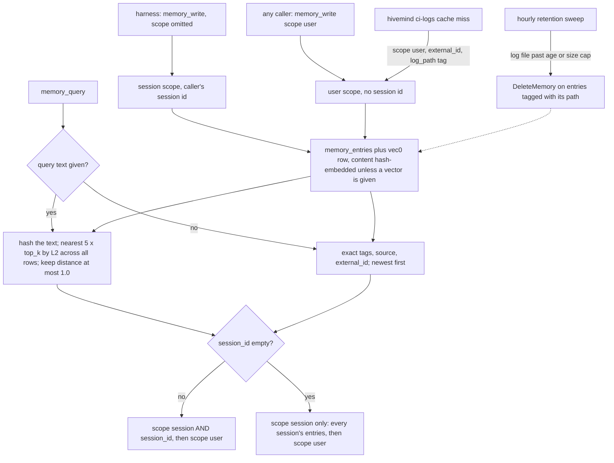

## 1. Executive Summary

Hivemind's Local Edition is a Go daemon, `hivemindd`, that gives AI harnesses a memory over MCP, plus a `hivemind` CLI that uses it as a cache for GitHub Actions logs. Its session scope is a real read filter with a test that proves another session's entry stays out. Its only embedder is a hash, so text search finds a memory only by its exact text. The repository carries no licence, so by default nothing in it is licensed for reuse.

Every entry carries a scope — `session` or `user`, constrained by a `CHECK` — and a session id. `memory_query` returns the caller's own session entries plus the `user` scope, with the session predicate applied in SQL on both of its arms. A committed test puts identical vectors in two sessions and a shared entry, queries as one session, and asserts the other session's entry is absent while its own and the shared one are present. That is both the atlas's `scope_enforced` and `negative_eval` marks.

The boundary has two gaps. The session predicate is added only when the caller's id is non-empty, and no handler rejects an empty one, so `session_id: ""` reads every session. And `memory_write` accepts `scope: "user"` from any caller, a narrowing the project's own design document records as a deliberate tradeoff while the README states that a harness cannot promote its memory.

What it does not have is semantic retrieval. The only embedding provider in the tree is `HashProvider`, which the code calls a *"non-semantic stand-in"*, and the daemon wires it unconditionally. Every vector component is an FNV-1a hash of the dimension index and the text, spread into [-1, 1) across 768 dimensions and never normalised; the store keeps only neighbours within an L2 distance of 1.0. Computed offline with the same hash, *the build is broken on main* is at 0.00 from itself, 23.12 from the same sentence capitalised, and 22.24 from the query *build* — about the 22.6 expected between unrelated vectors. The README's claim that search finds *"identical or near-identical"* text is right about identical and wrong about near.

A second arm works: a query with no text runs exact tag, source and external-id filters without an embedder, and that is the path the CI-log cache is built on. An entry written with a caller's own vector — the README's workaround — is reachable through that arm and never through text, because `memory_query` accepts no vector and always hash-embeds the query.

## 2. Mental Model

A fact becomes a memory when a caller runs `memory_write`. Without a scope it lands in `session` scope under the caller's session id and is visible to queries carrying that id. With `scope: "user"` it is visible to every query. An entry is never updated through the interface: a write carrying an `external_id` that already exists returns the existing row unchanged. It stops being a memory only if it carries a `log_path:` tag and the daemon's retention sweep expires that log file.

```mermaid
%% caption: the scope predicate is real and tested on both read arms, but it drops out when the session id is empty, any caller can write the shared scope, and text queries reach only byte-identical content
flowchart TD
  H["harness: memory_write, scope omitted"] --> S["session scope, caller's session id"]
  C["any caller: memory_write scope user"] --> U["user scope, no session id"]
  CLI["hivemind ci-logs cache miss"] -->|"scope user, external_id, log_path tag"| U
  S --> T["memory_entries plus vec0 row, content hash-embedded unless a vector is given"]
  U --> T
  Q["memory_query"] --> QT{"query text given?"}
  QT -->|yes| QH["hash the text; nearest 5 x top_k by L2 across all rows; keep distance at most 1.0"]
  QT -->|no| QS["exact tags, source, external_id; newest first"]
  QH --> F{"session_id empty?"}
  QS --> F
  F -->|no| P["scope session AND session_id, then scope user"]
  F -->|yes| A["scope session only: every session's entries, then scope user"]
  T --> QH
  T --> QS
  W["hourly retention sweep"] -->|"log file past age or size cap"| D["DeleteMemory on entries tagged with its path"]
  D -.-> T
```

## 3. Architecture

Two binaries. `hivemindd` is one process with one SQLite file, the sqlite-vec extension through cgo, an MCP server over HTTP on a loopback port, and an hourly retention goroutine. It writes its port and pid beside the database. `hivemind` is a cgo-free client — a `depguard` rule forbids it importing the store — that finds the daemon from the port file, starts it under a lock file when absent, and restarts an older daemon on version skew.

Configuration is environment variables: the database path, port and embedding dimension, and four for the CI-log cache's directory, age cap, size cap and cleanup switch. Homebrew and Scoop packaging exist, from taps the README notes are private. There is no command and no UI to inspect, edit, promote or delete an entry; the CLI's only memory verbs are the CI-log cache's.

## 4. Essential Implementation Paths

- **Write.** `handleMemoryWrite` (`internal/mcpserver/write.go:34-77`) defaults the scope to `session`, rejects anything but `session` or `user`, and blanks the session id for `user`. It hash-embeds the content unless the caller supplied a vector and calls `CreateMemory`.
- **Upsert.** With an `external_id`, `CreateMemory` inserts with `ON CONFLICT(source, external_id, scope) ... DO NOTHING` and returns the existing row on conflict (`internal/store/memory.go:80-108`), backed by a partial unique index (`internal/store/schema.go:29-31`). The first write under a key is the only one.
- **Semantic query.** When `query` is non-empty, `handleMemoryQuery` (`internal/mcpserver/query.go:39-61`) hash-embeds it, runs `Store.Query` once for the caller's session and once for `user` scope, appends the second list to the first and truncates to `top_k`. Own-session results come first regardless of distance.
- **Store query.** `Store.Query` (`internal/store/memory.go:310-393`) takes the nearest `5 × top_k` rows by L2 across the whole table, drops any above `defaultMaxDistance = 1.0` (`:295`), and only then applies the scope, session and source predicates (`:342-353`). A session with few entries in a large store can find none of its own even with a working embedder.
- **Structured query.** When `query` is empty, `structuredQuery` (`internal/mcpserver/query.go:67-87`) runs `ListMemories` twice with the same session-then-user split, filtering on tags, source and external id in SQL, newest first, with no embedder call.
- **Delete.** `DeleteMemory` (`internal/store/memory.go:185-204`) has one caller: the retention sweep's `deleteLog` (`internal/cilog/retention/sweep.go:104-121`), which lists entries tagged `log_path:` with the expired file's path and deletes them.
- **Embedder.** `HashProvider.Embed` (`internal/embedding/hash.go:21-31`) is the only implementation of `Provider`, and `cmd/hivemindd/main.go:78` constructs it unconditionally.

## 5. Memory Data Model

`memory_entries(id, content, scope CHECK IN ('session','user'), session_id, source, source_type CHECK IN ('harness','etl'), external_id, created_at, updated_at)`, `memory_tags(memory_id, tag)`, and `memory_vectors USING vec0(embedding float[768])`. A partial unique index on `(source, external_id, scope) WHERE external_id IS NOT NULL` makes the external id an idempotency key. `updated_at` is set once at insert; nothing rewrites it.

CI-log entries use a tag vocabulary as their schema: `repo:`, `run_id:`, `workflow:`, `commit:`, `status:`, `job:` and `log_path:` (`internal/cilog/cilog.go:41-50`). The raw log sits on disk at `ci-logs/<owner>/<repo>/<run-id>/run.log`, and the `log_path:` tag is the only link between the file and its entries.

## 6. Retrieval Mechanics

Two arms, chosen by whether `query` is empty; they never run together. The semantic arm is vector-only: tags and source narrow a result but never widen one, and with the hash embedder it is an exact-match lookup in disguise. The structured arm is exact filtering with no ranking beyond `created_at DESC`; its tag filter matches any of the given tags, so the CLI re-filters client-side for entries carrying both `repo:` and `run_id:` (`cmd/hivemind/cilogs_cmd.go:184-190`).

`external_id` is honoured on the structured arm only. Every query on either arm also reads the `user` scope, which holds the CI-log cache's entries and whatever any caller wrote there.

## 7. Write Mechanics

A write is one transaction — an entry, its tags and its vector — visible to the next query immediately, and it blocks the caller only for that insert. With an `external_id` a repeated write changes nothing and returns the original id, including when the content differs, which `TestMemoryWrite_UpsertReturnsSameID` pins. Nothing rewrites an entry; the one background job deletes.

The CI-log cache writes on a miss: it runs `gh run view` for the log and the run metadata, saves the log, then writes a run summary and one entry per failed job at `user` scope with an external id of `owner/repo#run` or `owner/repo#run#job` (`cmd/hivemind/cilogs_cmd.go:219-294`). On a hit it prints the stored entries and makes no network call.

## 8. Agent Integration

MCP over HTTP with three tools — `memory_write`, `memory_query`, `list_scopes` — for any harness that can reach a local port. The session id each harness passes is the whole of its identity.

`hivemind hook install` adds a PreToolUse hook to `~/.claude/settings.json` that rewrites a Bash call of the form `gh run view <id> ... --log` or `--log-failed` into `hivemind ci-logs run view ...`. It refuses commands carrying shell metacharacters and the flag-first form (`internal/cilog/rewrite.go:18-48`), so a compound command runs unchanged rather than being rewritten into an approved one.

## 9. Reliability, Safety, and Trust

**Retrieval by meaning does not work, and the documented workaround leaves text search behind.** As above. Until a real provider is wired and `memory_query` either uses the same provider as writes or accepts a vector, the semantic arm is a lookup by exact content.

**Scope is enforced on read, chosen by the caller, and open when the caller sends nothing.** The predicate is correct and tested for a caller with an id. `Store.Query` and `ListMemories` add `session_id = ?` only when the id is non-empty (`internal/store/memory.go:346-349`, `:236-239`), and neither handler checks it. `docs/DESIGN.md:107` says the go-sdk's schema-required flag is the only enforcement that a session id is present; required means the key is present, and `""` satisfies it. This is read from the code and was not exercised: a query carrying `session_id: ""` reads every session's entries on both arms.

**The shared scope has no write boundary.** Any MCP caller can write `scope: "user"`, and every query reads it. The design document calls this *"a real narrowing of that boundary"* and accepts it for the Local Edition (`docs/plans/2026-09-06-ci-log-ingestion-design.md:145-154`). The README's scopes section says the opposite — that a harness cannot promote its memory and everything it writes stays at `session` scope — and its limitations list names no CLI and no external-id upsert, both of which ship.

**A cached CI run is never refreshed.** The external id is `owner/repo#run` with no attempt number, and the upsert keeps the first row. GitHub keeps a run's id when it is re-run, so after a re-run the cache serves the first attempt's summary until the log file ages out, 30 days by default, or the size cap evicts it.

**Deletion reaches CI-log entries only, through two processes that resolve the directory separately.** The sweep walks the daemon's `HIVEMIND_CI_LOG_DIR` or its default (`internal/config/config.go:68-75`); the CLI writes under its own environment's value (`cmd/hivemind/cilogs_cmd.go:248-251`). An autostarted daemon inherits the CLI's environment; one started by `brew services` with a different value never sees the CLI's logs, so their entries are never deleted. Entries without a `log_path:` tag have no delete at all.

## 10. Tests, Evals, and Benchmarks

Sixty test functions in 26 files, and they run on every pull request and every push to `main`. `.github/workflows/ci.yml` is a four-platform matrix — `macos-15`, `macos-15-intel`, `ubuntu-latest` and `windows-latest`, the last configuring MinGW GCC because the build is cgo — and each leg runs `make check`, which the `Makefile` defines as `lint test`, where `test` is `go test ./...`. I ran nothing: this reading is from the committed cases.

`TestMemoryQuery_SessionIsolation` is the case both marks rest on, and it is well built. Three entries are written with the same vector, so distance cannot decide inclusion, and three assertions follow — own entry present, shared entry present, other session's entry absent. The structured arm's counterpart, `TestMemoryQuery_StructuredOnlyRespectsSessionIsolation` (`internal/mcpserver/query_test.go:106-126`), writes only session B's entry and asserts it absent from session A's result. Nothing in the fixture is guaranteed to come back, so an arm returning nothing passes it.

No test queries with an empty session id, and no test writes with a caller-supplied vector and queries by text, which is the path the README recommends. `TestDaemon_WriteThenQuery`, the one end-to-end MCP test, writes *the build is broken on main* through the real daemon and queries *build* — at 22.24 by the distances above, so it returns nothing — and asserts only that neither call errored.

The CI-log additions are tested at the unit level: the upsert, the external-id and tag lookups, the sweep's age and size passes with the entries it deletes, the hook's refusals, and the CLI's cache hit and cache miss against an in-process daemon. The squashed pull request records a cold-start defect the unit tests never reached — they pre-seed a port file — found by a manual end-to-end run and pinned by `TestEnsureDaemon_CreatesRuntimeDirBeforeLock`.

No benchmark and no paper.

## 11. For Your Own Build

### Steal

- **Scope in the schema, predicate in the query, and a three-assertion isolation test.** Own present, shared present, other absent, over identical vectors so the filter is the only thing deciding. It is the minimum test every scoped memory should have — with a fourth case for the empty id.
- **A retention sweep keyed on the backing artifact.** A cached entry carries the path of the file it summarises, and expiring the file deletes the entry in the same pass, so a summary never outlives its source.
- **A security tradeoff written down where it is made.** The design document names the boundary `memory_write`'s scope field narrows and why it was accepted; a reviewer can disagree with it, which is the point.

### Avoid

- **A scope predicate added only when the key is non-empty.** Reject the empty id, or bind the predicate unconditionally so an empty id matches nothing.
- **Embedding writes and queries through different paths.** If a caller may supply a vector on write, the query must accept one too, or both must go through the same provider.
- **A distance cutoff chosen without the embedder.** A fixed L2 cutoff of 1.0 means nothing without the scale of the vectors it is applied to; on these vectors it admits only identity.
- **An idempotency key missing the part that changes.** A run id without its attempt makes a re-run invisible to the cache.
- **Filtering after the nearest-neighbour limit.** Push the scope predicate into the vector search, or a small session in a large store finds nothing of its own.

### Fit

A clear skeleton for a local, multi-harness memory service; read it for the scope handling and the written tradeoffs. As memory, it works as a keyed store read by exact tags or exact text; until a real embedding provider is wired through both write and query, it finds nothing by meaning. Use it where every client on the machine is trusted, since the session boundary depends on each one sending its id.

## 12. Open Questions

- Whether the planned pluggable provider will be applied to queries as well as writes, and whether `memory_query` will accept a caller vector; either closes the retrieval gap in section 1.
- Whether the deferred handler-side session-id check named in `docs/DESIGN.md:107` will also cover `memory_query`, which is where an empty id opens the boundary.

## Appendix: File Index

- Daemon wiring: `cmd/hivemindd/main.go`. Config: `internal/config/config.go`.
- MCP tools: `internal/mcpserver/write.go`, `query.go`, `scopes.go`, `adapters.go`, `server.go`.
- Store and schema: `internal/store/memory.go`, `store.go`, `schema.go`.
- Embedder: `internal/embedding/hash.go`, `provider.go`.
- CI-log cache: `internal/cilog/` (vocabulary, summary, hook rewrite), `internal/cilog/retention/` (sweep and ticker), `cmd/hivemind/cilogs_cmd.go`, `hook_cmd.go`, `hook_install.go`, `autostart.go`, `daemonconn.go`.
- Design: `docs/DESIGN.md`, `docs/plans/2026-09-06-ci-log-ingestion-design.md`.
- Tests: `internal/**/*_test.go`, `cmd/hivemindd/main_test.go`, `cmd/hivemind/*_test.go`.

## Appendix: Recorded Searches

Run from the root of the checkout at the pinned commit.

| Claim | Command | Result at this pin |
| --- | --- | --- |
| The CLI is a writer of `user` scope besides any MCP caller | `git grep -n -E 'Scope: *"user"\|"scope": *"user"' -- '*.go' \| grep -v _test` | `cmd/hivemind/cilogs_cmd.go:309` writes it; `internal/mcpserver/query.go:52,76` read it |
| `memory_query` takes no vector | `git grep -n -E 'Embedding' -- internal/mcpserver/query.go` | Two hits, both passing the hash vector the handler built; `MemoryQueryInput` has no `Embedding` field |
| One `Provider` implementation, constructed unconditionally | `git grep -n -E 'Provider interface\|NewHashProvider\|func .*Embed\(' -- '*.go' \| grep -v _test` | `HashProvider` only; `cmd/hivemindd/main.go:78` |
| No update, and one delete with one caller | `git grep -n -E 'func .*(Delete\|Update)\|DeleteMemory\(\|UPDATE memory_entries' -- internal cmd \| grep -v _test` | `DeleteMemory` at `internal/store/memory.go:185`, called only from `internal/cilog/retention/sweep.go:110`; no `UPDATE` |
| The session predicate is conditional, and no handler checks for an empty id | `git grep -n -E 'SessionID (!=\|==) ""' -- internal cmd` | `internal/store/memory.go:236` and `:346` only |
| No test queries with an empty session id | `git grep -n -E 'SessionID: *""\|"session_id": *""' -- '*_test.go'` | Nothing |
| No test queries by text against a caller-supplied vector | `git grep -n -E 'handleMemoryQuery\(\|"memory_query"' -- '*_test.go'` | Every text query is either pinned to the hash of its own text or, in `TestDaemon_WriteThenQuery`, asserts only that no call errored |
| CI runs the suite | `ls .github/workflows/` and `grep -E -A2 '^(check\|test):' Makefile` | `ci.yml` and `release.yml`; `check: lint test`, `test: go test ./...`. |
| No paper | `git grep -n -i -E 'arxiv\|bibtex\|@article\|@misc\|citation\|doi\.org'` | Nothing |
| No benchmark | `git grep -n -i -E 'func Benchmark\|benchmark'` | Nothing |
| The CLI's verbs | `grep -n 'case "' cmd/hivemind/main.go` | `version`, `ci-logs`, `daemon`, `hook`, `help`; none reads, edits or deletes an arbitrary entry |

## History

**2026-09-28** — [`666bfa105a2f70ce53b2704fe896cd14138716f0`](https://github.com/causewayai/hivemind/commit/666bfa105a2f70ce53b2704fe896cd14138716f0) — re-pinned after upstream rewrote `main`. All 44 commits were re-created with identical trees, authors, dates and subjects, dropping their SSH and PGP signatures and 41 `Claude-Session:` trailers; the previous pin's tree equals that of [`b6860f1ebe21325d01a2f60c5d94bf96819d4cfc`](https://github.com/causewayai/hivemind/commit/b6860f1ebe21325d01a2f60c5d94bf96819d4cfc), so nothing the report relied on exists only in the [archived](https://github.com/agent-memory-atlas-archive/causewayai--hivemind/commit/1c93254066af4df39a7f12c2787f1de401137cec) history. One squash-merge on 24 September 2026 adds the CLI, CI-log cache, structured query, writable `user` scope and retention delete ([§4](#4-essential-implementation-paths)). Both marks stand; the report's unwritable `user` scope, absent delete and absent CLI are gone. Wrong at the old pin as well: an empty `session_id` drops the session predicate ([§9](#9-reliability-safety-and-trust)). Screened: one `Makefile`, nothing in the cooldown, no auto-run or unpinned surface; nothing installed, built or run.

**2026-09-20** — [`1c93254066af4df39a7f12c2787f1de401137cec`](https://github.com/causewayai/hivemind/commit/1c93254066af4df39a7f12c2787f1de401137cec) — audited at the unchanged pin, which is still the tip of `main`. Section 10 said there is no CI configuration in the tree. There is: `.github/workflows/ci.yml` runs `make check` — `lint` plus `go test ./...` — across macOS ARM, macOS Intel, Linux and Windows on every pull request and every push to `main`, and `release.yml` sits beside it.

The claim mattered because of what it was doing in the sentence: it was the stated reason for not establishing whether the thirteen committed tests pass. A reader was told the suite was unverified when the project verifies it on four operating systems. Both marks stand on the same evidence and neither moves; the finding the section exists for — that no case queries by text against a caller-supplied vector, which is the path the README recommends — is untouched and lands harder, because a four-platform matrix runs the narrow pinning on every change and still nobody covers the recommended path.

The report now carries a Recorded Searches appendix. It had none, which is why a claim nobody could re-run reached the site.

**2026-09-18** — [`1c93254066af4df39a7f12c2787f1de401137cec`](https://github.com/causewayai/hivemind/commit/1c93254066af4df39a7f12c2787f1de401137cec) — re-read at the same commit; `main` has not moved since 6 September 2026 and nothing needed correcting. Both marks re-verified: `memory_query` still runs the session predicate and then the user scope, `TestMemoryQuery_SessionIsolation` still seeds three identically-embedded entries and asserts session B's absent with A's and the shared one present, and the repository still carries no licence file, none in `go.mod` and none in the README. The retrieval finding re-tested too — `HashProvider` is still the only implementation of `embedding.Provider` in the tree and `cmd/hivemindd/main.go:61` still wires it unconditionally. One detail added: the unwritable `user` scope is a decision rather than an oversight. `write.go:38` sets `Scope: "session"` under the comment *"there is no Scope field to override that"*, and `list_scopes` still returns `["session", "user"]`, so the shared tier is advertised to the model, read on every query, and closed to every write.

**2026-09-11** — [`1c93254066af4df39a7f12c2787f1de401137cec`](https://github.com/causewayai/hivemind/commit/1c93254066af4df39a7f12c2787f1de401137cec) — first reading. Screened with `scripts/screen_repo.py`: no auto-running configuration, a `Makefile`, two manifests inside the seven-day cooldown and no unpinned surface. Nothing was built or run. The embedding distances quoted were computed offline by reimplementing `HashProvider.Embed`, not by running the daemon.
