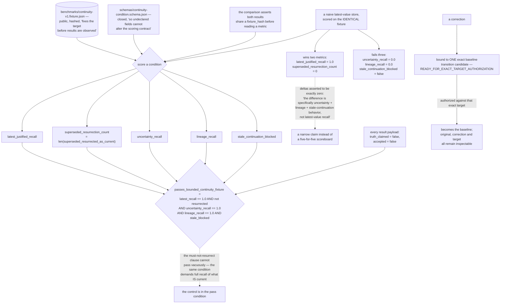

## 1. Executive Summary

HOLO-Invariant is "AI continuity that preserves corrections instead of hiding
them" — MIT, Python 3.10+, 91,867 lines across roughly two hundred modules with
1,603 test functions in 218 test files, and zero runtime dependencies. It is a
framework for preserving, reconstructing and checking state across sessions,
models, tools and execution environments.

Its README states the contrast as a table, and every row is a failure this atlas
reports somewhere: correction replaces history, the latest value hides its
lineage, resume trusts supplied context, memory authority is implicit. Against
each: correction becomes a verified relation, original and correction and target
all stay inspectable, resume checks externally retained evidence, authority stays
explicit and bounded.

**The benchmark is the reason to read it.** Five bounded metrics over one
committed fixture:

| Metric | Reference |
| --- | --- |
| Latest justified recall | 1.0 |
| Superseded resurrection count | 0 |
| Uncertainty recall | 1.0 |
| Lineage recall | 1.0 |
| Stale continuation blocked | true |

Four things make that table mean something. The fixture is public and hashed, and
"fixes the target before results are observed". The condition schema is closed
"so undeclared fields cannot alter the scoring contract" — a candidate cannot add
a field that changes how it is scored. The reference result is "regenerated from
the same committed fixture and condition on every change" in CI. And the
comparison test asserts `holo_reference["fixture_hash"] == fixture["fixture_hash"]`
before reading a single metric.

**Then it scores the trivial alternative, and reports which metrics the trivial
alternative wins.** A plain latest-value store is run against the identical
fixture, and the test records that it passes two of the five: its
`latest_justified_recall` is 1.0, and its `superseded_resurrection_count` is 0 —
"[i]t does not resurrect the overwritten value as current." It fails exactly
three: uncertainty recall, lineage recall, and stale-continuation blocking. And
the deltas are asserted to be *zero* on the two the baseline already wins, under
a comment that states the claim in one sentence:

> "The difference is specifically uncertainty + lineage + stale-continuation
> behavior, not latest-value recall."

This atlas has read a great many benchmarks. Very few name the metrics their
baseline already passes. Doing so converts a five-for-five scoreboard into a
narrow claim — *this system represents uncertainty, lineage, and staleness, and
ordinary storage does not* — which is both smaller and worth something, because
it can be checked and could have come out the other way.

The pass condition is why this earns the negative-evaluation mark rather than
just admiration. `passes_bounded_continuity_fixture` is

```python
latest_recall == 1.0 and not resurrected and uncertainty_recall == 1.0
and lineage_recall == 1.0 and stale_blocked
```

— a must-not-retrieve assertion (no superseded claim comes back as current) that
cannot pass vacuously, because the same condition demands full recall of
everything that *is* current. A store that returned nothing would fail the first
clause. The control is in the pass condition itself.

**The artifacts refuse to claim more than they show.** Every result payload
carries `truth_claimed: false` and `accepted: false`. The demo's description ends:
"[i]t does not modify an existing chain or grant truth, acceptance, write, or
execution authority." A correction is bound to one exact baseline transition
candidate and sits at `READY_FOR_EXACT_TARGET_AUTHORIZATION` until authorized
against that target — the same bind-to-one-operation property this atlas found in
[Anda DB](../anda-db/)'s approvals and [Edda](../edda/)'s verdicts.

What this is not: a memory an agent writes to. There is no store with a read
path, no scoping over stored content, and no mutation record — the transitions
are the subject. A reader arriving for a memory backend will find a scoring
contract and a correction model, which is the valuable thing here and not the
thing the category name suggests.

And the metrics are bounded in the literal sense the code names them: five
properties over one fixture of a chosen shape. Passing says the system represents
uncertainty, lineage and stale continuation *on that fixture*; generalisation is
the reader's inference and not the benchmark's claim — which
`passes_bounded_continuity_fixture` concedes in its own identifier.

## 2. Mental Model

A **correction** is a relation, not a replacement.

A **fixture** is hashed before anyone runs against it.

A **baseline** is scored on the same target, and told what it won.

A **result** records that it claimed no truth.



## 3. Architecture

| Area | Role |
| --- | --- |
| `holosim/continuity_baseline_benchmark.py` | The scorer, the metrics, the comparison |
| `holosim/spine_protocol.py` | The continuity protocol (1,641 lines) |
| `holosim/verified_claim_correction_transition.py` | A correction bound to one target |
| `holosim/invariant_catalog.py` | The declared invariants |
| `holosim/slot_merkle_sqlite.py` | Hashed slots over SQLite |
| `benchmarks/`, `schemas/` | The fixture, the closed condition schema, CI results |

## 4. Essential Implementation Paths

`holosim/continuity_baseline_benchmark.py:153-190` — the five metrics and the
pass condition that keeps one of them honest.

`tests/test_latest_value_continuity_baseline.py:75-150` — the baseline, what it
wins, and the deltas asserted to zero.

`benchmarks/continuity-v1.fixture.json` — the target, fixed and hashed.

## 5. Memory Data Model

A claim with retained evidence, correction edges forming a lineage, and an
uncertainty record. The model's commitment is that all three survive a
correction: "[o]riginal, correction, and target remain inspectable."

## 6. Retrieval Mechanics

None of its own. Reconstruction and checking rather than search.

## 7. Write Mechanics

A correction becomes a transition candidate bound to one exact baseline, held at
`READY_FOR_EXACT_TARGET_AUTHORIZATION` until a typed authorization for that exact
target arrives. Binding the authorization to the target is what stops one
approval from licensing a different transition.

## 8. Agent Integration

A CLI and a system-neutral condition document, so another continuity system can
be exported into the same shape and scored against the same fixture. That is an
unusual offer — a benchmark designed to be run against its author's competitors
on equal terms — and its value depends entirely on the fixture being fair, which
is why the hash pinning and the baseline scoring matter as much as the metrics.

## 9. Reliability, Safety, and Trust

The trust story is methodological rather than architectural: the fixture, the
closed schema, the CI regeneration, the baseline comparison, and the payload
fields that decline to claim truth or acceptance.

## 10. Tests, Evals, and Benchmarks

1,603 test functions across 218 files, including tests that assert the README's
own table matches the regenerated reference result — so the published number
cannot drift from the computed one. Nothing was installed or run for this
reading; the numbers quoted are the committed ones.

## 11. For Your Own Build

Score the trivial alternative on your own benchmark, and publish what it wins.
A metric the naive baseline already passes is a metric your system should not
take credit for, and saying so is what turns a scoreboard into a claim.

Hash the fixture and close the schema. "Fixes the target before results are
observed" and "undeclared fields cannot alter the scoring contract" are two
sentences that prevent most of the ways a benchmark stops being one.

Put the control in the pass condition. Requiring full recall of current claims
alongside zero resurrections means the negative half cannot be satisfied by a
system that returns nothing.

And let your artifacts say what they do not establish. `truth_claimed: false` in
every result is a small field that keeps a downstream reader from importing a
score as a verdict.

## 12. Open Questions

Whether the authorization is human. Transitions are bound to an exact target and
typed; who supplies the authorization was not traced.

How the fixture was chosen. It is fixed and hashed, which makes it fair; whether
its shape favours the model it was built alongside is a question the fixture
cannot answer about itself.

What the spine protocol contributes. At 1,641 lines it is the largest module and
sits outside the benchmark path read here.

## Appendix: File Index

| Path | What to read it for |
| --- | --- |
| `holosim/continuity_baseline_benchmark.py:153-190` | Five metrics, and a pass condition that cannot be gamed by silence |
| `tests/test_latest_value_continuity_baseline.py:75-150` | A baseline scored honestly, including what it wins |
| `holosim/verified_claim_correction_transition.py:1-25` | A correction bound to one exact target |

## History

**2026-09-16** — [`2d36396a060f28ec68110f7697b893d2c8cff859`](https://github.com/Deathburgerz013/HOLO-Invariant/commit/2d36396a060f28ec68110f7697b893d2c8cff859) — first reading, at a commit dated 15 September 2026. Screened before opening, from a shallow clone: four files scanned, no auto-run surfaces, no build-time execution points, one unpinned surface and one dependency file inside the seven-day cooldown. Nothing was installed, built or run, and no benchmark was executed.
