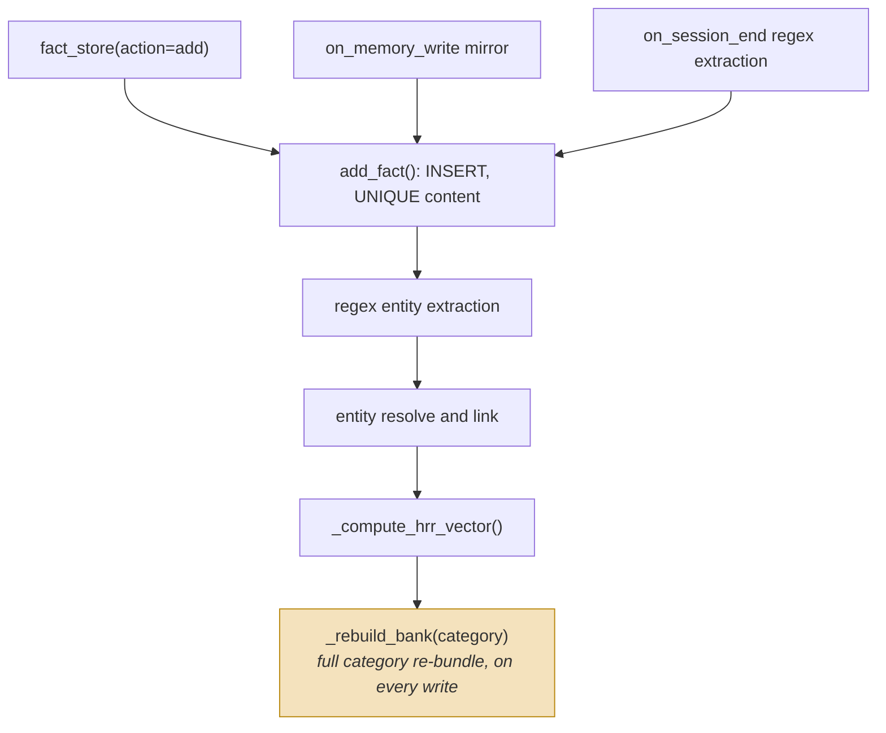
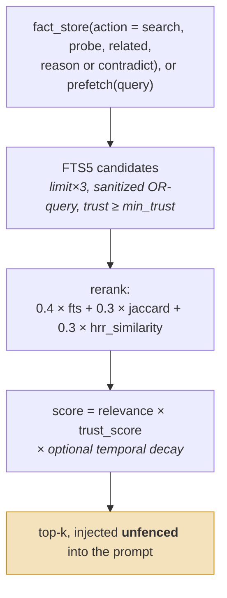
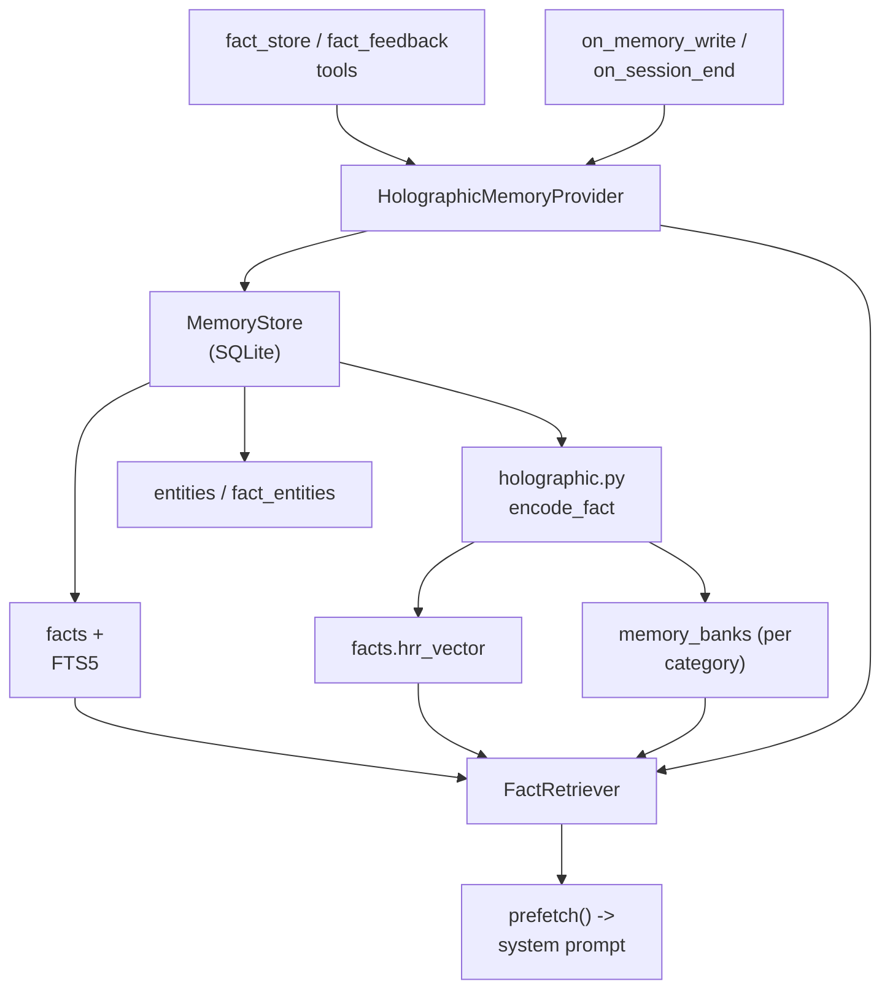

## 1. Executive Summary

Holographic is the first-party memory provider shipped inside [Hermes Agent](../hermes-agent/) at `plugins/memory/holographic/`, whose own built-in memory — what the agent has when no provider is mounted — is reported separately. It is the only system in this atlas built on a **vector-symbolic architecture**: facts are encoded as Holographic Reduced Representation (HRR) phase vectors, and retrieval uses algebraic `bind`/`unbind`/`bundle` operations rather than a learned embedding model.

The whole plugin is 912 lines across four files. That compactness is a feature: unlike most systems here, the entire memory model can be read in an afternoon.

Two things make it worth studying:

- **Deterministic representation without an embedding model.** Atoms are generated from SHA-256 of the token string (`encode_atom`), so vectors are byte-identical across processes, machines, and Python versions. There is no embedder to record, version, or drift — the atlas's usual "record embedder identity" guardrail is satisfied by construction.
- **`contradict` as a first-class retrieval action.** It surfaces fact pairs with high entity overlap and low content similarity. No other system in the atlas exposes contradiction discovery as an ordinary query.

Two things make it a cautionary example, and they are more instructive than the strengths:

- **Trust is one float doing two jobs.** `trust_score` is simultaneously epistemic confidence and retrieval strength; the ranker multiplies it straight into relevance (`score = relevance * trust_score`). This is precisely the split that [Verel](../verel/) and [RainBox](../rainbox/) treat as foundational.
- **User feedback silently deletes memory.** `fact_feedback` moves trust by +0.05 (helpful) or −0.10 (unhelpful), and both search paths default to `min_trust=0.3`. A fact created at the default 0.5 trust falls below the retrieval floor after **three** unhelpful ratings. The row survives and `list` still returns it, because `list_facts` alone defaults `min_trust` to 0.0 — but no recall path a model reaches for does, and nothing records that a suppression occurred: no tombstone, no review queue, no counter. The atlas's "telemetry mistaken for truth" antipattern is not merely present here; it is the trust model.

The plugin also demonstrates a failure mode specific to plugin-shaped memory: it mirrors the host's built-in memory writes into its own store (`on_memory_write`), creating two copies of the same content with independent lifecycles and no reconciliation or deletion propagation.

## 2. Mental Model

The memory unit is a flat fact row. There is no claim/evidence split, no scope, and no status:

```python
facts(
    fact_id         INTEGER PRIMARY KEY,
    content         TEXT NOT NULL UNIQUE,   # dedupe is exact-text only
    category        TEXT DEFAULT 'general', # user_pref|project|tool|general
    tags            TEXT DEFAULT '',
    trust_score     REAL DEFAULT 0.5,       # confidence AND retrieval strength
    retrieval_count INTEGER DEFAULT 0,
    helpful_count   INTEGER DEFAULT 0,
    created_at      TIMESTAMP,
    updated_at      TIMESTAMP,
    hrr_vector      BLOB                    # float64 phases, 8 KB at dim=1024
)
```

Entities are resolved into a side table and linked many-to-many, which is what makes the algebraic query actions possible:

```python
entities(entity_id, name, entity_type, aliases, created_at)
fact_entities(fact_id, entity_id)
memory_banks(bank_name, vector, dim, fact_count, updated_at)  # one bundled vector per category
```

The HRR layer is the distinctive part. Each fact is encoded compositionally:

```text
encode_fact(content, entities) =
    bundle(
      bind(encode_text(content), ROLE_CONTENT),
      bind(encode_atom(entity_1), ROLE_ENTITY),
      bind(encode_atom(entity_2), ROLE_ENTITY),
      ...
    )
```

Because `unbind` inverts `bind`, an entity can be algebraically probed out of a fact — or out of a whole category bank — without keyword matching:

```text
unbind(fact_vector, bind(entity, ROLE_ENTITY)) ≈ content_vector
```

Write lifecycle:



The highlighted step is the cost of the algebra: because a category bank is one
bundled vector, adding a single fact re-bundles the **whole category**, so write
cost grows with the category rather than with the write.

Retrieval lifecycle:



Trust multiplies relevance rather than gating it, so a low-trust fact is ranked
down and never excluded. And the result is injected **unfenced** — compare
[RainBox](../rainbox/), which wraps recalled memory and neutralizes angle brackets
before the model sees it.

## 3. Architecture

Core files, all under `plugins/memory/holographic/`:

- `holographic.py` (125 lines): the HRR algebra — `encode_atom`, `bind`, `unbind`, `bundle`, `similarity`, `encode_text`, `encode_fact`, `snr_estimate`, and the `phases_to_bytes`/`bytes_to_phases` blob codec. NumPy is imported behind a `try`, and every algebra entry point calls `_require_numpy()`.
- `store.py` (308 lines): SQLite schema, `MemoryStore` CRUD, entity extraction/resolution, trust feedback, HRR vector computation, bank rebuilds, and a process-wide shared-connection registry.
- `retrieval.py` (215 lines): `FactRetriever` with `search`, `probe`, `related`, `reason`, and `contradict`, plus FTS5 query sanitization and Jaccard reranking.
- `__init__.py` (264 lines): the `HolographicMemoryProvider` implementation of Hermes's `MemoryProvider` ABC, tool schemas, and end-of-session regex extraction.



## 4. Essential Implementation Paths

### HRR encoding (`holographic.py`)

`encode_atom` derives a phase vector deterministically from SHA-256 counter blocks: it hashes `f"{word}:{i}"`, unpacks each 32-byte digest as sixteen `uint16` values, and scales them to `[0, 2π)`. This is the single best idea in the plugin. Representations are reproducible everywhere with no model download, no API call, and no dimension negotiation.

The algebra is phase arithmetic: `bind` is `(a + b) % 2π`, `unbind` is `(a - b) % 2π`, and `bundle` is the circular mean of complex exponentials. `similarity` is `mean(cos(a - b))`.

`encode_text` bundles the atoms of each whitespace token — a **bag of words**. Word order is not represented, so "Alice owes Bob" and "Bob owes Alice" encode identically. For a store whose headline feature is contradiction detection, this is a material limitation.

### Write path (`store.py:add_fact`)

Deduplication is a `UNIQUE` constraint on exact `content`. On collision the existing `fact_id` is returned unchanged. There is no semantic dedupe, no subject/predicate key, and no conflict detection: two facts that contradict each other are simply two rows, both at trust 0.5.

Entity extraction is regex-only (`_extract_entities`): capitalized multi-word phrases, double-quoted terms, single-quoted terms, and `X aka Y` patterns. Note that the first pattern in `_RE_SINGLE_ENTITY` requires **two or more** capitalized words, so single-token entities like `Python` or `Copenhagen` are never extracted unless the user quotes them. Since `probe`, `related`, `reason`, and `contradict` all depend on entity links, this quietly caps the reach of every algebraic action.

`_resolve_entity` matches with `SELECT entity_id FROM entities WHERE name LIKE ?`. `LIKE` treats `%` and `_` as wildcards and the parameter is not escaped, so an entity containing an underscore can silently resolve to a different entity — distinct entities merge without warning.

Every successful write calls `_rebuild_bank(category)`, which re-reads every fact vector in that category and re-bundles them. Write cost is therefore O(facts in category) on each add.

### Retrieval (`retrieval.py`)

`search` is genuine hybrid fusion: FTS5 supplies `limit*3` candidates, then each is rescored as `0.4*fts_rank + 0.3*jaccard + 0.3*hrr_similarity`, multiplied by `trust_score`, with optional exponential temporal decay (disabled by default, `half_life=0`).

`_sanitize_fts_query` is a well-judged detail: FTS5 AND-joins bare multi-word MATCH arguments, which destroys recall on prose queries, so the helper drops stopwords, strips FTS5 operator characters, phrase-quotes each surviving token, and OR-joins them.

`probe`, `related`, and `reason` are the algebraic actions. `reason` is the most interesting: it unbinds each requested entity from every fact vector and scores by the **minimum** per-entity similarity, giving AND semantics across entities. `probe` has two distinct code paths — bank-based extraction when a category bank exists, and direct per-fact scoring otherwise — which return different-quality results for the same call.

`contradict` compares all fact pairs, keeps those with entity-overlap Jaccard ≥ 0.3, and scores `entity_overlap * (1 - normalized_content_similarity)`. It is O(n²) and guards itself by truncating to the 500 most recently updated facts. The truncation is silent: no field in the response indicates that older facts were not compared.

### Trust feedback (`store.py:record_feedback`)

```python
_HELPFUL_DELTA   =  0.05
_UNHELPFUL_DELTA = -0.10
```

The asymmetry is deliberate and sensible in isolation. The problem is what it interacts with: `min_trust` defaults to 0.3 in `FactRetriever.search`, in the `fact_store` tool schema, and in the provider's own `min_trust_threshold`, which is what `prefetch` passes. Starting from `default_trust=0.5`, three unhelpful ratings put a fact at 0.2 — below every one of those floors. `list_facts` is the single exception, defaulting `min_trust` to 0.0, so the row is still enumerable by a caller that asks for it explicitly. No path the model takes to *recall* something will return it again, and nothing records that a suppression occurred.

### Auto-extraction (`__init__.py:_auto_extract_facts`)

Disabled by default (`auto_extract: false`). When enabled, `on_session_end` scans user messages against six regexes (`I prefer|like|love|use|want|need`, `my favorite/preferred/default … is`, `I always/never/usually`, `we decided/agreed/chose`, `the project uses/needs/requires`) and stores the **raw matching user message**, truncated to 400 characters, as a fact.

This is zero-LLM capture, which the atlas generally endorses — but the stored artifact is conversational prose rather than a normalized claim, which then degrades the content-vector comparisons that `contradict` depends on.

The code carries two revealing guards, and the incident behind them is written down in `tests/plugins/memory/test_holographic_auto_extract.py`, whose header names #57682: the context compactor's own handoff summaries are injected as `role="user"` messages, their prose reliably matched the decision patterns, and the compactor's generated output was consequently stored as durable "facts" on every context rollover. The extractor calls `is_compaction_summary_message` and splits a merged row on `_MERGED_SUMMARY_DELIMITER`, harvesting only the genuine user text that precedes it. Six committed cases cover it, including one asserting that a real user message sitting beside a summary is extracted anyway — the positive control that stops the guard from passing by suppressing everything. This is a clean, concrete instance of derived text laundering itself back into an evidence store — a feedback loop any system with automatic capture should test for explicitly.

## 5. Memory Data Model

Storage is a single SQLite database (`$HERMES_HOME/memory_store.db`) in WAL mode, with a documented fallback for NFS/SMB/FUSE mounts.

The concurrency engineering is the most mature part of the codebase. A process-wide `_shared` registry keyed on the resolved database path gives every `MemoryStore` instance one connection and one re-entrant lock, refcounted so closing one instance cannot pull the connection out from under a sibling. The connection uses `isolation_level=None` (autocommit) specifically so a write that raises mid-method cannot strand a write transaction. The accompanying comment explains the production failure it fixes: multiple providers in one process — the main agent plus every `delegate_task` subagent — raced as independent WAL writers until one pinned the write lock and starved the rest.

Refcounting has one deliberate escape hatch. `release_all_under(directory)` force-closes every shared connection whose database sits under a directory, because refcounted closing is precisely wrong when the directory is being deleted: on Windows the desktop's `serve` process holds `memory_store.db` open for every known profile, and `rmtree` of a profile fails with `WinError 32` while any handle survives. The docstring names the issue (#88347) and states the trade — later use by a stale holder is expected to fail, since the directory is going away — and `close()` carries the matching guard, popping the registry entry only when it is still the entry this instance registered, so a late close cannot evict a fresh store that reopened the same path.

What the data model does **not** have is equally important:

- **No scope of any kind.** `store.py` describes itself as a "single-user Hermes memory plugin". There is no user, agent, project, session, or tenant column. `category` is a four-value enum used for partitioning banks, not for access control.
- **No status or lifecycle state.** Nothing distinguishes candidate from verified from rejected from stale.
- **No provenance.** A fact records no source message, actor, or session. Once written, a model-inferred fact, a mirrored built-in memory write, and an explicit user statement are indistinguishable.
- **No supersession or correction chain.** `update_fact` mutates the row in place.

## 6. Retrieval Mechanics

Ranking is genuinely multi-signal and is the plugin's strongest conventional feature: lexical FTS5, token Jaccard, and HRR cosine, fused with fixed weights and multiplied by trust.

Three caveats matter for anyone borrowing it.

**Trust is baked into relevance.** `score = relevance * trust_score` means a well-matched but lightly-downvoted fact loses to a poorly-matched trusted one, and there is no way to ask "what is the most relevant memory regardless of how it has been rated?"

**HRR contributes a neutral 0.5 when unavailable.** If NumPy is missing, `FactRetriever` silently redistributes weights to `fts=0.6, jaccard=0.4`, and `is_available()` returns `True` with the comment *"SQLite is always available, numpy is optional"*. The provider continues to advertise itself as "holographic" while running as an ordinary lexical store: `_compute_hrr_vector` and `_rebuild_bank` return early, `probe`, `related` and `reason` fall back to `search`, and `contradict` — the action with no lexical equivalent — returns an empty list, which is indistinguishable from finding no contradictions. Individual facts lacking a vector also score a neutral 0.5 rather than being excluded.

Vectors are stored as float32 behind an `HRR1` prefix, half the size of the float64 blobs the schema originally held, and `bytes_to_phases` still reads the unprefixed legacy layout. The one ambiguous case is handled rather than ignored: at `dim=1`, a prefixed float32 blob and a raw float64 blob are both eight bytes, so `phases_to_bytes` writes legacy float64 there to keep the decoder unambiguous.

**Bank capacity is computed and discarded.** `snr_estimate(dim, n_items)` returns `sqrt(dim/n_items)` and logs a warning below SNR 2.0 — i.e. above `dim/4` = 256 facts per category at the default dimension. But `_rebuild_bank` calls it purely for the side effect and ignores the return value, so saturation produces a log line rather than a guard, a fallback, or a field in the response. The module's own `bundle` docstring gives a stricter bound still — "O(sqrt(dim)) items", about 32 at dim=1024 — so the two capacity estimates in the same file disagree by roughly 8×. Neither is enforced.

## 7. Write Mechanics

Three write paths converge on `add_fact` with no shared policy layer:

1. **Explicit tool calls** — `fact_store(action="add")` from the model.
2. **Mirrored host writes** — `on_memory_write` copies every built-in Hermes memory `add` into the fact store, mapping `target == "user"` to category `user_pref`.
3. **End-of-session regex extraction** — when `auto_extract` is enabled.

None of these is distinguished in the stored row. Path 2 is the most consequential: it leaves the same content in Hermes's `MEMORY.md`/`USER.md` **and** in `memory_store.db`, with independent lifecycles. Editing or deleting the Markdown does not remove the mirrored fact, because `on_memory_write` only handles `action == "add"` — the `remove` action documented in the ABC is ignored by this provider. Host-level forgetting therefore does not propagate.

## 8. Agent Integration

Holographic implements Hermes's `MemoryProvider` ABC (`agent/memory_provider.py`, 165 lines), which is the most explicit pluggable-memory-provider contract in the atlas. It defines twenty-one members: `name`, `is_available`, `unavailable_reason`, `initialize`, `system_prompt_block`, `prefetch`, `queue_prefetch`, `recall_status`, `sync_turn`, `get_tool_schemas`, `handle_tool_call`, `shutdown`, `on_turn_start`, `on_session_end`, `on_session_switch`, `on_pre_compress`, `on_delegation`, `on_memory_write`, `get_config_schema`, `save_config`, and `backup_paths`. Holographic implements eleven of them.

The same directory ships first-party adapters for every other provider Hermes supports — `byterover`, `hindsight`, `honcho`, `mem0`, `openviking`, `retaindb`, `supermemory` — so the *adapters* are reviewable even when the backing service is not. `MemoryManager` enforces a one-external-provider limit to avoid tool-schema bloat.

The contract has a conspicuous hole, and it is the reason this ecosystem deserves its own [pattern page](../../patterns/pluggable-memory-provider/): **there is no deletion or forgetting hook.** No `forget`, no `delete_scope`, no tenant or user parameter anywhere in the ABC. A host-level erasure request has no defined path into a provider's store.

Two model-facing surfaces deserve scrutiny:

- `prefetch` injects the top five facts into the system prompt as `- [0.5] <content>` with **no fencing or neutralization**. Combined with enabled auto-extraction — where a raw user message becomes a durable fact — this is a persistent prompt-injection path: text that a user (or a quoted third party) writes once can be replayed into every later prompt as trusted-looking context. Contrast [Verel](../verel/) and [RainBox](../rainbox/), which fence recalled memory as untrusted data.
- The `fact_store` tool description ends with "IMPORTANT: Before answering questions about the user, ALWAYS probe or reason first" — tool description as policy, which the atlas treats as necessary but never sufficient.

## 9. Reliability, Safety, and Trust

Strengths:

- Deterministic, reproducible vectors with no embedder version to track.
- Serious, well-documented SQLite concurrency handling with refcounted shared connections and autocommit.
- Text is canonical and vectors are derived: `update_fact` recomputes a fact's vector from its new content, and `_rebuild_bank` rebuilds a category bank from the fact vectors it holds, so a corrupt bank repairs itself on the next write to that category. There is no wholesale recomputation — nothing in the tree recomputes the vectors of facts that have none, and `FactRetriever.search` carries a comment about "stores whose `hrr_vector` was never backfilled", so a database written without NumPy present stays vectorless until each row is updated by hand.
- Graceful degradation when NumPy is absent.
- `contradict` gives operators a way to *discover* inconsistency, which most systems lack entirely.

Gaps, roughly in order of severity:

- **Feedback is suppression.** Three downvotes put a fact under every retrieval floor with no tombstone, review surface, or audit record. It is recoverable in principle — `list` still enumerates it and a helpful rating adds 0.05 — but nothing surfaces a suppressed fact for that rating to be given, so recovery depends on an operator already knowing the row is there. "Unhelpful" and "false" are conflated.
- **One score for truth and usefulness.** No separation of epistemic confidence from retrieval strength.
- **No scope.** Single-user by construction; nothing prevents facts from one project or persona surfacing in another.
- **No provenance.** Source, actor, and session are not recorded, so a wrong fact cannot be traced or explained.
- **Unfenced prompt injection of recalled content**, which auto-extraction makes durable.
- **No deletion propagation** between the host's built-in memory and the mirrored fact store.
- **`contradict` reports but never resolves.** It has no supersession, tombstone, or review workflow; the operator is handed pairs and left to run `update`/`remove` manually.
- **Silent caps**: the 500-fact contradiction window and the ignored SNR ceiling both degrade quality without signalling it.

The `contradict` docstring asserts "no other memory system does this". Within this atlas that is not accurate: [RainBox](../rainbox/) performs lattice-aware conflict detection at write time, [Verel](../verel/) maintains explicit rejected states, and [engram](../engram/) surfaces conflict candidates for judgment. What is genuinely unusual is doing it *algebraically over vectors* and exposing it as an ordinary read action rather than a write-time gate — which is also its weakness, since detection after the fact cannot prevent the contradiction from being recalled in the meantime.

## 10. Tests, Evals, and Benchmarks

Holographic-specific coverage is 736 lines across four files, plus 1,498 lines exercising the provider ABC:

- `tests/plugins/memory/test_holographic_retrieval.py` (240 lines)
- `tests/plugins/memory/test_holographic_store.py` (227 lines)
- `tests/plugins/memory/test_holographic_auto_extract.py` (139 lines)
- `tests/plugins/memory/test_holographic_shutdown_closes_db.py` (130 lines)
- `tests/agent/test_memory_provider.py` (1,498 lines)

The suites were not run for this review. Coverage is oriented toward the shared-connection registry, encoding determinism, FTS5 query sanitization, the auto-extract contamination guards, and connection shutdown — the areas where production bugs were actually found. Two of them are worth naming because of what they assert. `test_search_results_bit_identical_to_unhoisted` pins an optimization against its own naive form, so hoisting the query vector out of the scoring loop cannot silently change a ranking; `test_search_without_vectors_never_encodes` asserts the lazy path is actually lazy on a store with no vectors at all.

What is not covered is the trust model. No test in the plugin's suites calls `record_feedback` or exercises the `min_trust` floor, so the behaviour this report treats as the system's central hazard — three ratings removing a fact from every recall path — has no committed case in either direction. `contradict`, the plugin's headline action, has none either. There is **no committed retrieval-quality benchmark**, and no evaluation of whether HRR similarity outperforms the FTS5 and Jaccard signals it is fused with. Given that HRR carries only 0.3 of the relevance weight and falls back to a neutral constant when unavailable, its measured contribution to recall is currently unknown.

The README documents configuration and the nine `fact_store` actions but no decay, forgetting, or capacity guidance. Two open issues in the tracker ([#4781](https://github.com/NousResearch/hermes-agent/issues/4781), [#31263](https://github.com/NousResearch/hermes-agent/issues/31263)) report that the plugin registers but its tools or context injection do not fire; those threads were not read for this review, and the titles alone do not establish a reproducible defect in the code inspected here.

## 11. For Your Own Build

### Steal

- **Deterministic hash-derived representations.** `encode_atom` removes the entire class of embedder-drift problems: no model to pin, no dimension to negotiate, identical vectors on every machine. Worth copying for any system where reproducibility matters more than semantic nuance.
- **Algebraic multi-entity query.** `reason`'s min-similarity-across-entities gives true AND semantics over structure, which is awkward to express in a plain vector store.
- **Contradiction as a queryable action.** Entity-overlap × content-divergence is a cheap, model-free heuristic for surfacing inconsistency, and belongs in more systems as a review aid.
- **FTS5 query sanitization.** Dropping stopwords and OR-joining phrase-quoted tokens is a small fix for a real and widespread recall bug in FTS5-backed memory.
- **Refcounted shared SQLite connections.** The registry in `store.py` is a reusable answer to multi-writer WAL contention when subagents share a process.
- **Vectors as a derived projection.** Content is canonical and every vector is recomputed from it, so the vector layer can be thrown away and rebuilt — worth keeping even though this tree ships no wholesale rebuild to invoke.

### Avoid

- **Telemetry as truth, with deletion as a side effect.** The clearest instance in the atlas: a rating tool directly mutates the score that gates retrieval, and enough ratings remove the memory from recall entirely.
- **One score for confidence and reachability.**
- **Bag-of-words encoding under a compositional banner.** Word order is discarded, so relational facts and their inversions are indistinguishable.
- **Unescaped `LIKE` for identity resolution**, allowing distinct entities to merge.
- **Capacity computed and ignored**, with two mutually inconsistent capacity estimates in one module.
- **Silent truncation** of the contradiction comparison set.
- **Dual-write to host and provider stores** with no reconciliation or deletion propagation.
- **Unfenced injection** of stored prose into the system prompt.
- **Entity extraction that misses single-word entities**, silently limiting every algebraic action.

### Fit

Borrow:

- `encode_atom`'s SHA-256 phase derivation, and the `bind`/`unbind`/`bundle` algebra, if compositional structure matters to you.
- `_sanitize_fts_query` more or less verbatim.
- The shared-connection registry pattern.
- The `contradict` heuristic — as an input to a review queue, not as an output on its own.

Do not copy:

- The trust model. Split epistemic confidence from retrieval strength before wiring any feedback tool to either, and route suppression through an explicit rejected state rather than a threshold.
- Feedback that changes reachability without an audit trail.
- Scope-free storage, unless the deployment really is single-user forever.
- `prefetch` as written; fence recalled content before it enters a prompt.

## 12. Open Questions

- Does HRR similarity measurably improve retrieval over FTS5 + Jaccard alone? Nothing in the repository answers this, and the 0.3 weight makes it easy to overestimate.
- What is the intended behaviour when a category bank saturates past SNR 2.0 — should `probe` fall back to per-fact scoring, or should banks shard?
- Should `fact_feedback` write a tombstone or review row instead of silently crossing the `min_trust` floor?
- How should a host-level "forget this" propagate to a provider when the `MemoryProvider` ABC has no deletion hook?
- Should mirrored `on_memory_write` facts be marked as derived, so that host deletions can find and remove them?
- Would sequence-aware encoding (positional binding) fix the "Alice owes Bob" inversion problem without abandoning the deterministic-atom property?

## Appendix: File Index

- HRR algebra: `plugins/memory/holographic/holographic.py`.
- Store, schema, entities, trust: `plugins/memory/holographic/store.py`.
- Hybrid and algebraic retrieval: `plugins/memory/holographic/retrieval.py`.
- Provider, tools, auto-extraction: `plugins/memory/holographic/__init__.py`.
- Provider contract: `agent/memory_provider.py`.
- Sibling provider adapters: `plugins/memory/{byterover,hindsight,honcho,mem0,openviking,retaindb,supermemory}/`.
- Tests: `tests/plugins/memory/test_holographic_*.py`, `tests/agent/test_memory_provider.py`.

**Searches recorded for the negative claims**

```sh
rg -n 'tombstone|deleted_at|is_deleted|suppress' plugins/memory/holographic/          # 0: removal writes no record
rg -n 'user_id|project_id|session_id|scope' plugins/memory/holographic/store.py       # 0: category is the only partition
rg -n 'audit' plugins/memory/holographic/                                             # 0: no mutation log
rg -n 'record_feedback|min_trust|unhelpful' tests/plugins/memory/test_holographic_*.py  # 1, a re-implementation of the
                                                                                      #    scoring formula inside a
                                                                                      #    determinism test; no case
                                                                                      #    exercises the trust floor
rg -n 'contradict' tests/                                                             # 0 under tests/plugins/memory/
rg -n 'rebuild_all_vectors' .                                                         # 0: no wholesale vector rebuild
rg -n 'search_facts' .                                                                # 0: the store exposes list_facts
```

## History

**2026-09-09** — [`9e6c4100cbf5222fb473ecc2b51fd17874f6ee75`](https://github.com/NousResearch/hermes-agent/commit/9e6c4100cbf5222fb473ecc2b51fd17874f6ee75) — second reading, 14,909 commits past the previous pin, at the same commit as the [Hermes Agent](../hermes-agent/) report so the two describe one repository in one state. Screened again before reading: one auto-run surface, twenty-one build-time execution surfaces, five unpinned surfaces and twenty manifests inside the seven-day cooldown; nothing was installed and no suite was run. The plugin was compacted from roughly 2,000 lines to 912 with the mechanism intact — schema, trust deltas, fusion weights, the three write paths and the per-write bank rebuild are unchanged, and every file line count in section 3 is corrected.

One published strength was wrong at this commit and is removed. `rebuild_all_vectors()` no longer exists anywhere in the tree, so the report's claim of a deterministic wholesale recovery path — cited in section 9 and again under Steal — no longer holds. What survives is the weaker and still useful property: content is canonical, `update_fact` recomputes a fact's vector, and `_rebuild_bank` rebuilds a category from its members, but a store whose rows never got vectors has nothing to backfill them. A second claim is narrowed rather than corrected: section 1 called a downvoted fact permanently invisible, which section 4 of the same report already contradicted, since `list_facts` alone defaults `min_trust` to 0.0. The accurate version is that no recall path returns it and nothing surfaces it for the rating that would bring it back.

New since the previous pin, and none of it moves a mark: NumPy is now optional, with the algebra behind `_require_numpy()` and `contradict` returning an empty list rather than degrading — indistinguishable from finding no contradictions; vectors are stored as prefixed float32 with the `dim=1` size collision handled explicitly; `release_all_under` force-closes shared connections under a directory so a Windows profile delete cannot fail on an open handle (#88347); the FTS5 sanitizer gained a stopword list; `contradict` gained a 500-row comparison guard. The compaction-summary contamination the previous reading described from code comments is now pinned by six committed cases whose file header names the issue, including a positive control asserting that genuine user messages beside a summary are still harvested. `tombstone`, `trust_state`, `scope_enforced`, `audit_log`, `bitemporal`, `human_review` and `negative_eval` remain absent: removal deletes a row and writes nothing, trust is a float and not a state, `category` partitions banks rather than filtering reads, no log covers fact mutations, and no committed case asserts that anything must not be retrieved.

**2026-07-27** — [`0fa5e41c86f022bba147797849f0b44865721476`](https://github.com/NousResearch/hermes-agent/commit/0fa5e41c86f022bba147797849f0b44865721476) — first reading.
