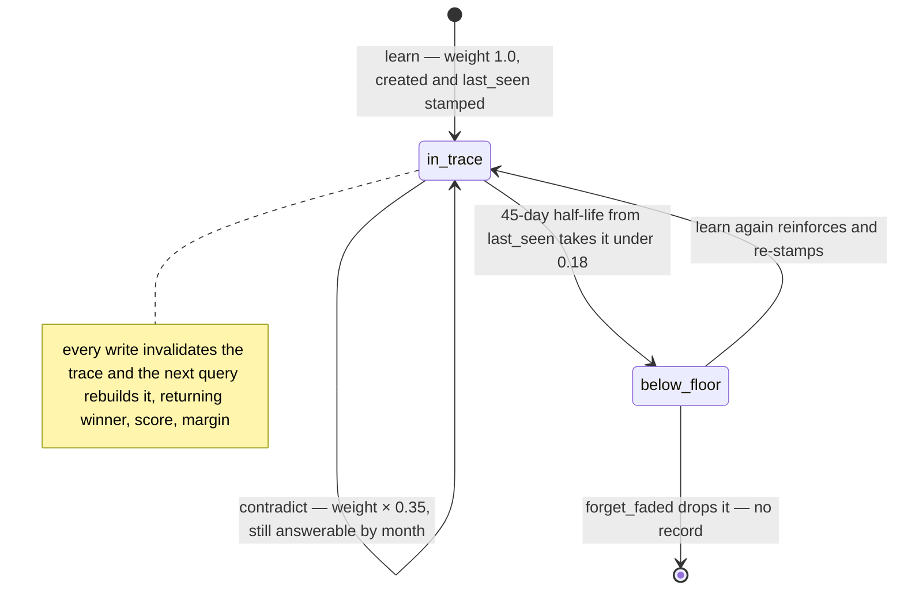

## 1. Executive Summary

holomem is one Python module — 423 lines on NumPy, MIT, nine commits between
2 and 6 September 2026 by one author, version 0.1.0 — that stores facts as
weighted triples in a single complex vector and forgets them on a schedule. It
is a Fourier holographic reduced representation in the vector-symbolic family
Plate described in 1995, and the module says so in its first paragraph and
claims none of it; what it adds is *"a memory that ages"*: decay from the
last confirmation, reinforcement with a ceiling, contradiction as an exact
subtraction, and a second trace indexed by the month a fact was learned so a
dated question has somewhere to go. The screen found no auto-run surface, one
unpinned requirement and two manifests inside the seven-day cooldown; nothing
was installed or run, and the read was made from a full clone.

The algebra is four lines (`holomem.py:24-28`). A symbol is `d` unit phasors
with phases from a hash of the folded name (`symbol`, `:167-189`); binding is
the elementwise product and unbinding the product with the conjugate, an
exact inverse; the trace is the weighted sum of `bind(S, R, O)` over every
fact whose decayed weight clears a floor (`_build`, `:327-349`); a query
unbinds the trace by `bind(S, R)` and snaps the residue to the nearest known
object by complex cosine (`query`, `_cleanup`, `:366-386`). The inverse query
is the same operation with the other pair, so *"who works on X"* costs no
second index. What the module measures rather than asserts is where this
stops working: `bench_capacity.py` stores `N` distinct triples and queries
every one, twelve trials a cell over forty cells, and `results/capacity.json`
holds the sweep the README's table is drawn from — at `d = 1024`, top-1 recall
is 0.973 at 100 facts, 0.835 at 150 and 0.391 at 300, and the recomputation
from the committed file matches the table to the third decimal.

The design's memory idea is in the weights. A `Fact` carries a `created_ts`
and a `last_seen_ts`, and its effective weight is `weight · 0.5^(age/45 days)`
with age counted from the last confirmation (`:210-218`), so *"a fact you keep
mentioning stays sharp however old it is."* Relearning adds 0.25 up to 1.5
(`learn`, `:272-287`); `contradict(s, r, o)` multiplies every other object of
the relation by 0.35 and does not delete (`:289-304`); `forget_faded` drops
facts below 0.18 (`:306-316`); the epochal trace binds each term to
`epoch:YYYY-MM` so `query_at` answers what the relation held then (`:398-407`).
The answer a caller gets is a triple — winner, score, margin — and the README
argues, with a committed figure, that the margin measured as a z-score over
the losing candidates is the number to gate on, because an absolute threshold
*"silently stops firing exactly when the memory starts needing one."*

No mark, and the reasons are the design's own limits: nothing persists, so
nothing outlives the process except a list the adopter keeps; there is no
scope, no state, no record of a contradiction or a drop, and no test that a
damped fact stays out of an answer. The same author's `membench`, read on the
[benchmarks page](../../benchmarks/#membench), is where this memory is scored
against a corpus that knows when each fact stopped being true.

## 2. Mental Model

A belief is a triple with a weight, and the weight is a clock. It enters at
1.0 when learned, or rises by a quarter when learned again, and from the
moment it was last mentioned it halves every forty-five days. It is *used*
whenever the trace is rebuilt — at the next query after any write — and its
share of the trace is its decayed weight, so a belief nobody has repeated for
a season contributes little signal and, past the floor, none at all. A query
does not search the list; it unbinds the sum and asks which known object the
residue most resembles, and the honest output is not the winner but how far
the winner stands above the rest.

It stops being believed by three roads and none of them is a delete. A newer
value for the same subject and relation, announced through `contradict`,
multiplies the old value's weight by 0.35 — it still contributes, so *"you
used to say X"* remains answerable through the epochal trace, and it can be
reinforced back. Silence lets it decay under the floor, at which point it
leaves the trace while staying in the list. `forget_faded` then drops it from
the list, and nothing records that it was ever there. A fact never gains a
state, a source or a record; what it has is a weight, two timestamps and a
month.



## 3. Architecture

There is no infrastructure. `holomem.py` exports `bind`, `unbind`, `csim`,
`symbol`, `fold`, `epoch_of`, `Fact` and `HolographicMemory`; NumPy 1.24 or
later is the one dependency, and a `pyproject.toml` added on 6 September
2026 makes it installable because, its comment says, a fresh clone of
`membench` showed twenty red tests when the module could only be reached by
an environment variable. Symbols are cached in a module-level dictionary
capped at 4,096 entries that is cleared whole on overflow (`:163-189`), which
the README measures as a nine-fold rebuild slowdown past about 1,365 facts
and leaves in place because every published number was measured against it.

Time is injected: `HolographicMemory(dim, now_fn)` takes a clock (`:263-268`),
which is what makes the README example and the tests reproducible to the
third decimal on any day. Three benchmark scripts and a plotter sit beside the
module: `bench_capacity.py` (the sweep, seeded per cell so a clean checkout
rewrites `results/capacity.json` byte for byte), `bench_compare.py` (the
trace against a plain dict on the same facts, after a Reddit objection the
script quotes), `bench_cost.py` (insert, rebuild and query time and bytes
over three passes with the band printed), and `plot_results.py`, which reads
the three JSON files and computes nothing.

### Deployment and ergonomics

`pip install numpy`, import, construct with a dimension. The operating point
the README names is `d = 2048` for a few hundred facts: 32 KB per trace,
64 KB with the epochal one, and *"98 % precision on 40 % of questions"* at the
recommended gate. Persistence is a list of `(s, r, o, weight, created_ts,
last_seen_ts)` the adopter serialises; the module offers no format and
nothing to load it back.

## 4. Essential Implementation Paths

- **Fold and derive.** `fold` strips accents, lowercases and collapses
  everything outside `[a-z0-9]` to underscores (`:151-160`), so *Startup* and
  *startup* are one symbol; `symbol` hashes the folded name with BLAKE2b to
  seed a uniform phase vector (`:167-189`). No codebook, no insertion order.
- **Learn.** `learn(s, r, o)` folds the key, scans the list for it, and either
  reinforces — `min(1.5, w + 0.25)`, `last_seen_ts = now` — or appends a
  `Fact` at the given weight with `created_ts` defaulting to now (`:272-287`);
  either way `_invalidate` drops both traces.
- **Contradict.** `contradict(s, r, o)` multiplies the weight of every fact
  with the same folded subject and relation and a different object by 0.35;
  `o=None` damps every object (`:289-304`).
- **Decay and floor.** `Fact.effective_weight(now, half_life)` is
  `weight · 0.5^(age_days / 45)` from `last_seen_ts` (`:210-218`); `_build`
  skips a fact under 0.18 and adds the rest to both traces, the epochal one
  bound to `epoch_of(created_ts)` (`:327-349`); `forget_faded` drops the
  under-floor facts from the list (`:306-316`).
- **Query.** `query` unbinds `trace` by `bind(S, R)` and calls `_cleanup`
  over the object pool; `query_subject` unbinds by `bind(R, O)` over the
  subject pool; `query_at` unbinds the epochal trace by `bind(epoch, S, R)`
  (`:383-407`). `_cleanup` sorts the pool by complex cosine and returns the
  best name, its score and the margin over the second (`:366-381`);
  `noise_floor` is `1/sqrt(2d)` (`:416-423`).
- **Gate.** The z-score gate lives in the benchmark, not the module:
  `bench_capacity.py` computes `(top − mean(others)) / std(others)` and counts
  an answer as given at `z ≥ 4`, reporting gated precision and coverage per
  cell.

## 5. Memory Data Model

`Fact` is `s`, `r`, `o`, `weight`, `created_ts`, `last_seen_ts` (`:201-221`);
its key is the folded triple. The trace is `np.complex128[d]`; the epochal
trace the same. The candidate pools are rebuilt from the list on every query
(`_pools`, `:359-364`). There is no id, no source, no state and no record of
a damping or a drop; the month a fact was learned is recoverable only as the
symbol it was bound to.

## 6. Retrieval Mechanics

Retrieval is one unbind and one cleanup. The unbind is exact; the noise is
the crosstalk of every other term, which grows like the square root of the
fact count, and the cleanup's margin is where that shows. The README's table,
recomputed here from `results/capacity.json`, is the map: at `d = 1024`,
top-1 0.973 at N = 100 with gated precision 1.000 on 71 % coverage; 0.835 at
N = 150 with 0.993 on 37 %; 0.391 at N = 300 with 0.890 on 10 %. The README
states the rule of thumb the sweep supports — top-1 crosses 50 % near
`N = d/4`, with the measured ratio drifting from 2.9 to 4.4 across
dimensions — and then warns against reading it as a sizing rule, because
`d = 4N` *"sizes it exactly for failure."* The inverse query is the same
cost; the dated query is the same cost against the second trace, and its
scores are lower because the month symbol adds a binding: the README's own
example returns *lisbon* for May at 0.190 against a noise floor of 0.022.

## 7. Write Mechanics

A write is a list scan and an append or a field update, then an
invalidation; the next query pays an O(N) rebuild of both traces. Nothing
blocks and nothing is asynchronous; there is no persistence to lag. The
scan makes insertion quadratic and `bench_cost.py` measures the exponent at
2.08 over N from 250 to 4,000 — the README quotes the exponent rather than a
ratio because two earlier ratios, 619× and 194×, were published from an
uncommitted script on a busy machine and retracted. No background pass
rewrites the list; `forget_faded` is the caller's to run.

### Operational cost

At `d = 1024` the README's committed cost table gives a 2.6 ms query and a
4 ms rebuild at 250 facts, 11 ms and 18 ms at 1,000; a forward query is 515×
slower than a dict lookup by the compare file's median. No model, no
network, no tokens.

## 8. Agent Integration

None in the tree: no server, no tool, no prompt. The module's own disclaimer
is the integration note — a hosted model *"consumes tokens, not vectors,"* so
the trace cannot be handed to a model, and the memory's job is *"deciding
which few facts are still sharp enough to be worth spending tokens on."* The
author's assistant, Dermioz, is named as the consumer and is not in the
repository. The `membench` harness is the one caller in public, and it wraps
the module as an arm beside a scrambled-corpus control.

## 9. Reliability, Safety, and Trust

**Tombstone — withheld.** A contradicted fact is damped and can be reinforced
back; a faded fact is dropped without a record; nothing is keyed on a value
that was refused.

**Trust state — withheld.** A weight and a margin are numbers; the gate that
would withhold an answer is a threshold the caller applies.

**Bitemporal — withheld.** `created_ts` and the month symbol are the time a
fact was learned; `last_seen_ts` is the time it was last confirmed; neither is
when the fact was true, and the README's *"true back in May"* is a fact
learned in May.

**Scope — withheld.** One object, no key.

**Audit log — withheld.** No record of a learn, a contradiction or a drop.

**Human review — withheld.** No surface.

**Negative evaluation — withheld.** The suite asserts that contradiction
strictly decreases a weight and widens the margin toward the new value, and
that a faded fact leaves the trace before it leaves the list
(`test_holomem.py:117-170`); no case asserts that the damped value is absent
from an answer, and the membench harness, which scores silence after a
fact's end date, is a separate repository.

**What the tests do guard.** Twenty-one cases, each with its failure mode in
a comment; the README records a mutation pass of seven mutants in which one
test — asserting `weight == CONTRADICT_FACTOR`, an `x == x` — stayed green
with contradiction disabled, and was rewritten to pin the behaviour. The
README example is a test that asserts the printed scores to three decimals
against a pinned clock, added after the README quoted an output the code
could not produce.

## 10. Tests, Evals, and Benchmarks

`test_holomem.py` is 272 lines and twenty-one cases under pytest: the
algebra (exact inversion, commutativity, unit modulus, the noise floor),
derived symbols and folding, forward and inverse recall, fixed trace size,
decay from last confirmation, reinforcement saturation, the weight floor,
contradiction as a strict decrease and a widening margin, the old belief
surviving, the epochal trace, margin collapse under load, the fact list as
ground truth, and the README example verbatim. Every test can fail, and the
file's docstring says the standard: *"a test whose failure mode nobody can
state is decoration."*

The benchmarks are the serious artifact. `results/capacity.json` holds forty
cells of twelve trials — dimension, fact count, mean and worst top-1, gated
precision, coverage and the noise floor — and the README's nine-row table
recomputes from it exactly. `results/compare.json` holds the dict comparison
(the reverse index crosses the trace's 16 KB at N ≈ 58; the forward query is
515× slower by median) and `results/cost.json` the three-pass cost table with
its environment. The README names three figures it published and retracted —
two insert-time ratios from an uncommitted script and an absolute-margin gate
that passed 0.3 % of queries at N = 100 — and states the habit each taught:
check that nothing else is running, and quote an exponent or a z-score rather
than a ratio. No paper; three works of prior art are cited and the algebra
is attributed to them.

## 11. For Your Own Build

### Steal

- **Gate on a margin in units of noise.** A z-score of the winner over the
  losing candidates holds one threshold across every dimension and load; an
  absolute score threshold stops firing as the store fills.
- **Decay from the last confirmation, not creation.** Age is not
  irrelevance; a fact repeated last week is sharp however old.
- **Derive symbols from names.** A memory with no codebook rebuilds
  identically from its fact list on any machine, which is the whole
  persistence story for a design that has none.
- **Commit the sweep and draw the table from it.** A README whose every
  number recomputes from a JSON in the tree, with the retracted figures
  named, is the standard the rest of this atlas's benchmark sections are
  measured against.

### Avoid

- **Damping as the only correction.** A contradicted belief at 0.35 of a
  reinforced 1.5 still outweighs a fresh 1.0 after a month of silence; the
  design keeps history at the price of letting an old belief win.
- **A memory with no list format.** Everything about the trace is portable
  and nothing about the list is; the adopter writes the serialiser and the
  scoping.
- **Sizing at the collapse point.** `N = d/4` is where recall halves;
  planning there is planning for a coin flip.

### Fit

For a few hundred relational facts about one person or project, in a process
that can keep the list and afford a rebuild per write, this is a small,
honest instrument with a confidence signal most stores lack, and the
benchmark discipline around it is better than the code needs. It is not a
store: nothing persists, nothing is scoped, nothing is recorded, and a text
retriever is still required for anything that is not a triple. Read it for
the gate and the decay policy, and for how a project retracts its own
numbers; do not deploy it as the memory of anything with more than one user
or more than one relation per subject you cannot enumerate.

## 12. Open Questions

- Does contradiction hold under decay? A reinforced old belief at 1.5 × 0.35
  against a new one at 1.0 with a 45-day half-life on both — the crossing
  point is a function of the three constants and no test or benchmark places
  it.
- What does the membench corpus say about the floor and the half-life
  together — is silence after a fact's end date arriving from decay or from
  the gate?
- Would a relation with many objects per subject, the case the sweep calls
  easier, change the `d/4` rule, and in which direction?

## Appendix: File Index

| Path | Lines | What it holds |
| --- | --- | --- |
| `holomem.py` | 423 | The algebra (`:110-148`), `fold` and `symbol` (`:151-189`), `epoch_of` (`:190`), `Fact` (`:201-221`), `HolographicMemory` — constants (`:224-261`), `learn`, `contradict`, `forget_faded` (`:272-316`), `_build` and `trace` (`:327-357`), `_pools`, `_cleanup`, `query`, `query_subject`, `query_at` (`:359-407`), `noise_floor` (`:416`) |
| `test_holomem.py` | 272 | Twenty-one cases with their failure modes |
| `bench_capacity.py`, `bench_compare.py`, `bench_cost.py`, `plot_results.py` | 220, 263, 247, 296 | The sweep, the dict comparison, the cost table, the figures |
| `results/capacity.json`, `compare.json`, `cost.json` | 40 cells, 10 rows, 5 rows | The committed numbers |
| `pyproject.toml`, `requirements.txt` | — | Installable since 6 September 2026; `numpy>=1.24` |

Searches behind the absence claims above, run from the repository root:

```sh
rg -c -i 'open\(|json\.|pickle|\.save|\.load|sqlite|to_file|from_file' holomem.py   # 0: nothing persists
rg -n -i 'user|tenant|namespace|scope' holomem.py                     # one hit, :78, prose about the user's history; no scope
rg -n 'def test_' test_holomem.py                                     # 21
rg -n 'assert .*not in|assert .*!=' test_holomem.py                   # none asserting a damped value absent from an answer
rg -n -i 'arxiv|doi' README.md                                        # none: no paper; three prior works named
```

## History

**2026-09-07** — [`4a96a08e35541da558a2f19a2dd27f09f5b74efd`](https://github.com/polmanas1998-star/holomem/commit/4a96a08e35541da558a2f19a2dd27f09f5b74efd) — first reading, at the head of `main`, the commit that made the module installable. Screened first: no auto-run surface, one unpinned requirement, two manifests inside the seven-day cooldown; nothing installed or run, the read made from a full clone. The README's capacity table was recomputed from `results/capacity.json` and matches. No mark; the fact list's persistence is the adopter's, and the report says so in section 1 rather than excluding a design whose forgetting is the point. The same author's `membench` harness was examined on 6 September 2026 and lives on the benchmarks page.
