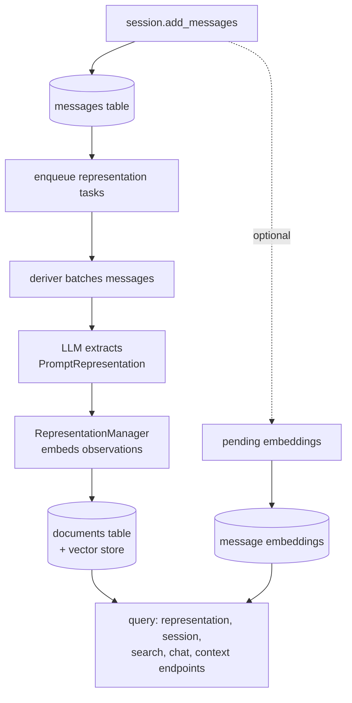
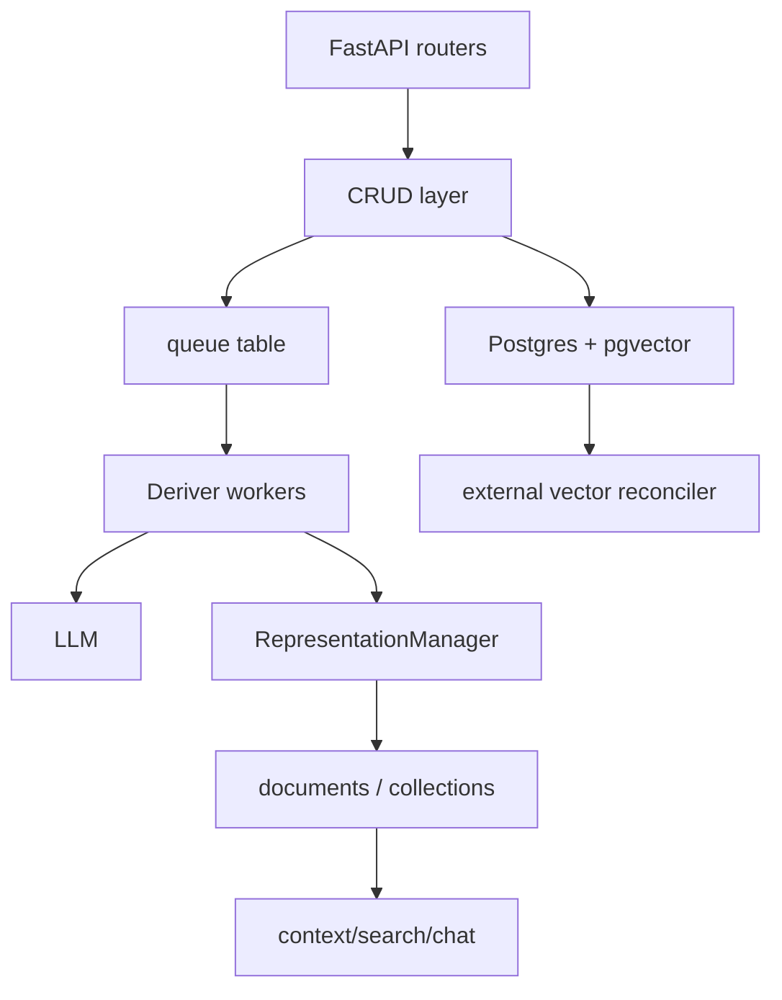

## 1. Executive Summary

`honcho` is a FastAPI/Postgres memory service for stateful agents. Its core model is not "store arbitrary facts"; it stores messages/events, then derives peer-centric representations in the background. The system models workspaces, sessions, peers, messages, message embeddings, observer/observed collections, documents/observations, queue items, and active queue sessions.

This is one of the more serious service architectures in the workspace. It has:

- Raw message event log.
- Async derivation queue.
- Derived explicit/deductive observations.
- Peer-to-peer representation model.
- pgvector or external vector-store paths.
- Session context/search APIs.
- Bench/eval harnesses for LoCoMo, LongMem, BEAM, Oolong, etc.
- A workspace-level chat that routes across every peer before recalling through the pair machinery.

Version 3.1.1 is dated 2 September 2026; 50,294 lines of Python under `src/`
beside 211 test files. Two things arrived in the 3.1 line that the sections
below describe: a workspace-level dialectic (`POST /v3/workspaces/{id}/chat`)
that answers across all peers in a workspace and honours `scope`, and a Qdrant
adapter as a fourth vector backend. Two things were fixed that had been losing
data silently: until 2 September 2026 two concurrent writers to one
`(workspace, observer, observed)` collection could deadlock on `times_derived`
reinforcement updates, the error was swallowed per document, the batch was
lost and the queue item marked processed — 682 events in 90 days by the
project's own count in the fix — and until 31 August a NUL byte in a
model-generated observation raised a Postgres `DataError` in the dedup
pre-fetch and dropped the whole observer batch.

The strongest idea is the separation between raw messages and inferred representations. The main risk is eventual consistency and trust: derived observations are LLM-generated and embedded, but the code reviewed does not show a hard verification gate before they become queryable memory.

## 2. Mental Model

Honcho's memory model:

- `Message`: raw interaction/event in a session from a peer.
- `MessageEmbedding`: chunked embedding rows for message semantic search.
- `Collection`: a pairwise observer/observed memory space.
- `Document`: derived observation about an observed peer from an observer's perspective.
- `Representation`: in-memory object combining explicit and deductive observations.

Lifecycle:



Two paths reach a query and they hold different things. The messages table plus
its embeddings is what was *said*; the documents table is what was *inferred about
a peer by another peer*. A collection is not "Alice's memory" but "observer X's
representation of observed Y", so the same message can produce different
observations in different collections and nothing reconciles them — which is
correct for the model and means there is no single answer to "what does Honcho
believe about Alice".


## 3. Architecture

Core files:

- `honcho/src/models.py`: SQLAlchemy schema.
- `honcho/src/crud/message.py`: message creation/search/context helpers.
- `honcho/src/crud/document.py`: document CRUD and vector search.
- `honcho/src/crud/representation.py`: representation save/retrieve logic.
- `honcho/src/deriver/deriver.py`: LLM-derived observation processing.
- `honcho/src/deriver/enqueue.py`: queue record generation.
- `honcho/src/deriver/queue_manager.py`: worker polling, batching, stale cleanup.
- `honcho/src/dialectic/chat.py`, `honcho/src/dialectic/core.py`: query answering over peer memory; `honcho/src/dialectic/workspace.py`: the workspace-level agent.
- `honcho/src/vector_store/`: one `VectorStore` interface with Turbopuffer, LanceDB and Qdrant adapters; `pgvector` is the ORM path.
- `honcho/src/reconciler/*`: vector reconciliation.

Architecture:



## 4. Essential Implementation Paths

Message capture:

- `create_messages()` in `honcho/src/crud/message.py`.
- Ensures session/peers exist.
- Uses `pg_advisory_xact_lock(hashtext(workspace), hashtext(session))` to serialize sequence assignment.
- Assigns `seq_in_session`.
- Creates pending `MessageEmbedding` rows if `settings.EMBED_MESSAGES`.

Queueing:

- `enqueue()` and `handle_session()` in `honcho/src/deriver/enqueue.py`.
- Resolves workspace/session/message configuration.
- Generates queue records for representation and summary tasks.
- Cancels pending dreams for active observed peers.

Derivation:

- `process_representation_tasks_batch()` in `honcho/src/deriver/deriver.py`.
- Sorts messages, formats timestamped turns, builds `minimal_deriver_prompt(...)`.
- Calls `honcho_llm_call(..., response_model=PromptRepresentation, json_mode=True)`.
- Converts response to `Representation`.
- Saves observations for all observer collections via `RepresentationManager.save_representation(...)`.

Representation storage:

- `RepresentationManager.save_representation()` in `honcho/src/crud/representation.py`.
- Normalizes observations.
- Batch embeds observation text.
- Writes documents through `crud.create_documents(...)`.
- Schedules dream processing when enabled.

Representation retrieval:

- `get_working_representation()` and `_get_working_representation_internal()` in `honcho/src/crud/representation.py`.
- Mixes semantic, most-derived, and recent observations within `max_observations`.

Message search:

- `search_messages()` and helpers in `honcho/src/crud/message.py`.
- Supports pgvector and external vector-store paths.
- Deduplicates chunk hits by message ID.
- Adds context windows around matched messages.
- Scopes peer searches to sessions where observer has membership.

Document search:

- `query_documents()` and helpers in `honcho/src/crud/document.py`.
- Uses pgvector cosine distance or external vector store, then fetches ordered DB rows.

Tests:

- `honcho/tests/crud/test_representation_manager.py`
- `honcho/tests/deriver/test_deriver_processing.py`
- `honcho/tests/integration/test_representation.py`
- `honcho/tests/integration/test_message_embeddings.py`
- `honcho/tests/unified/test_cases/*`
- `honcho/tests/bench/*`

## 5. Memory Data Model

Important tables from `honcho/src/models.py`:

- `workspaces`: tenant/config root.
- `peers`: people, agents, groups, projects, ideas.
- `sessions`: event containers.
- `session_peers`: peer membership/configuration per session.
- `messages`: raw message log, full-text indexed.
- `message_embeddings`: chunk embeddings, sync state, HNSW index.
- `collections`: unique `(observer, observed, workspace_name)`.
- `documents`: derived observations with `level`, `times_derived`, embedding, source IDs, soft delete, session link.
- `queue`: background tasks.
- `active_queue_sessions`: work-unit ownership.

The `Document.level` field distinguishes explicit and deductive observations. `times_derived` tracks reinforcement/derivation count. `source_ids` can support derivation trees.

Scoping is strong: most tables include `workspace_name`, and peer/session relationships are composite-key constrained.

**A scope is a peer, which is the design decision worth reading.** Rather than
add a column, a nullable foreign key and a filter to every read, a scope named
`therapy` is a peer named `scope.therapy` that observes its member sessions and
never speaks — so the entire existing observer/observed machinery carries the new
boundary and no read path had to learn a new predicate. Developers never see the
mechanics: `/scopes` routes and a `scopes` field on session creation are the whole
surface.

`src/utils/scopes.py` is the single source of truth and it makes the identity
unforgeable from both ends. Being a scope requires the reserved `scope.` name
prefix **and** `{"kind": "scope"}` in the peer's `internal_metadata`. The prefix
is outside `RESOURCE_NAME_PATTERN` — the charset every API-created peer must
match — so no peer created through the validated API can occupy the namespace,
and `internal_metadata` appears in no API schema, so the marker cannot be set by
a client. Requiring both means *"a peer that merely occupies the namespace, or
merely carries a look-alike `configuration`, is not a scope."* The module also
records why a backstop remains: peers carried over by an earlier users→peers
rename predate the charset pattern and were never validated, so a legacy
collision path stays in `crud/scope.py`. Naming the one population your invariant
does not cover is the difference between a guard and a claim.

## 6. Retrieval Mechanics

Honcho has several retrieval paths:

- Message semantic search over `message_embeddings`.
- Message full-text index exists on `messages.content`.
- Document semantic search over `documents.embedding`.
- Recent observations.
- Most-derived observations.
- Session-limited context.
- Peer-visible sessions when observer is provided.
- Dialectic agent chat over peer representation.

`RepresentationManager._get_working_representation_internal()` splits the observation budget:

- Semantic observations if query supplied.
- Most-derived observations when requested.
- Recent observations for the remainder.

This is a useful pattern: it avoids pure semantic recall and includes low-latency, stable representation context.

**Workspace-level chat routes first and recalls second.**
`WorkspaceDialecticAgent` (`src/dialectic/workspace.py`) subclasses the pair
agent with an empty observer and observed. Its prefetch is orientation rather
than retrieval — workspace stats, the five most active peers and their self
peer cards — because, in the module's words, *"a workspace-flat observation
top-k would be dominated by the most verbose peers."* Observation search then
stays pair-scoped, with the pair supplied as tool arguments, and message search
is workspace-flat to reveal which peers discussed a topic. A `scope` on the
route resolves to a session allowlist as the union of the named scopes, fails
closed when the union is empty, and changes what the prefetch may show: a peer
card is a single cross-session aggregate, so *"an in-scope peer's card can
still carry facts derived from sessions outside the scope"*, and the agent
drops cards entirely under an allowlist and routes on stats alone — the same
rule the `get_peer_card` tool enforces. Message search itself is ILIKE over
`messages.content` or an embedding query, with `top_k` floored at one after a
zero reached Turbopuffer.

**A `scope` on a read is an observer swap, not a filter.** Passing `scope` to
chat, representation, context or search resolves the scope peer and reads from
the `(scope_peer, observed)` collection, with message recall following the
scope's session membership. One guardrail is enforced and one is deliberately
not: a scope may not be the *observed* peer, because a scope is a silent observer
with `observe_me=false` and no representation of it is ever formed — while the
observer position is left unchecked precisely because that is what a scoped read
*is*. The comment says so, and gives the reason the raw path peer is still
refused separately: so the difference between *"the caller named a scope"* and
*"the `scope` option resolved to one"* stays visible in the error.

**The filter DSL fails closed.** A filter body is arbitrary client JSON with no
schema, so validation was emergent and any shape the DSL did not recognise
surfaced as an unhandled 500 from inside SQLAlchemy or psycopg. Fixing shapes one
at a time did not converge — a fuzz over the DSL turned up five more families
after three were fixed — so the answer is two generic guards instead: any operand
bound to a non-JSONB column must be a scalar, checked element-wise for `in`, and
`apply_filter` re-raises anything it does not recognise as a 422 after logging it
with the offending shape. Two invariant tests over a generated matrix of filter
bodies assert that every shape either compiles or raises, and that no non-scalar
is ever bound to a scalar column. That is the right shape for input validation on
a read path: enumerate the invariant, not the bugs.

Three defects fixed underneath are worth naming because each was a silent wrong
answer rather than a crash. A null operand hit `float(None)` and raised
`TypeError` where only `ValueError` was caught; a null operand is a null check
rather than a value comparison, so `{"ne": null}` compiles to `IS NOT NULL` and
the other operators reject null with a 422. Numeric operators cast every column
with `float()`, so a string inequality on a text column was rejected as an
invalid number — coercion is gated on the column actually being numeric, and
text columns compare as text. And an unrecognised operator dict on a scalar column fell
through to `column == value`, binding a dict to a VARCHAR, which compiles and
fails in the driver.

## 7. Write Mechanics

Honcho writes raw messages synchronously and derived memories asynchronously.

Message write:

- Transactional session/sequence handling.
- Optional chunk preparation.
- Embedding work deferred through pending rows/reconciler.

Derived write:

- Queue worker batches representation tasks.
- LLM call extracts explicit/deductive observations.
- Observations are batch embedded.
- `create_documents(..., deduplicate=settings.DERIVER.DEDUPLICATE)` handles persistence.

This is operationally sound for service latency: message ingestion does not wait on derivation. The tradeoff is stale reads immediately after writes.

**Concurrent writers to one collection are serialised by id-ordered row
locks.** `create_documents` collects reinforcement and replacement operations
during the batch, locks the target rows with `SELECT … ORDER BY id FOR
UPDATE`, and applies them; a `SQLAlchemyError` aborts the batch instead of
continuing through an aborted transaction, and transient errors are classified
(`src/utils/retryable_errors.py`) and retried through a bounded in-process
counter rather than marking the item errored. The fix commit records the
alternative it rejected — an advisory lock, because that is database-scoped and
would serialise every writer to a collection across tenants sharing a name.
`_normalized_observation` strips NUL bytes from model output at the same point
ingress already stripped them from user content.

**Membership is retroactive, and reconciling it costs no model call.**
`src/deriver/scope_backfill.py` adds two queue handlers. `scope_backfill` runs
when a session joins a scope that already has messages: it copies the session's
*explicit* documents from each sender's global `(P, P)` collection into the
scope's `(scope_peer, P)` collection, then enqueues a dream to rebuild the
scope's higher-order layer. **Zero LLM re-derivation**, and the reason is an
invariant the module names — explicit-level documents are session-pure and
identical across observer collections — so retroactive membership is *"pure row
copying"*. The only external call is an embedding lookup for source rows whose
embedding column is null, and since 1 September 2026 the copy runs in chunks of
500 specs with vectors hydrated per chunk, after several concurrent backfills of
a 14,000-document session were OOM-killed at the deriver's memory limit. An idempotency marker (`copied_from` in
`internal_metadata`) links each copy to its origin, and the handlers run in
phases — plan, embed, write, sync — each opening its own short-lived session, so
a database session is never held across an embedding or vector-store call.

That invariant is load-bearing and is stated rather than asserted:
`rg -n -i 'observer-independent' src tests` returns nothing. If an explicit
observation ever became observer-dependent, the backfill would silently copy the
wrong text into a scope, and nothing in the tree would notice.

**`scope_removal` is the more interesting half, because it follows derivation.**
Removing a session soft-deletes its explicit documents from the scope's
collections, and then iterates a frontier to a fixpoint:

```python
while frontier:
    derived_stmt = update(models.Document).where(
        ..., models.Document.level != "explicit",
        models.Document.deleted_at.is_(None),
        models.Document.source_ids.has_any(array(frontier)),
    ).values(deleted_at=func.now()).returning(models.Document.id)
    frontier = [row[0] for row in (await db.execute(derived_stmt)).all()]
```

The comment states the rule the loop implements: *"a deduction resting on removed
evidence must leave with it, and so must an induction resting on that
deduction."* This is the failure most stores in this atlas have — deletion
reaches the row it was pointed at and stops, leaving every summary and inference
built on it in place and retrievable. A transitive closure over `source_ids` is
the answer, and `source_ids` was already there.

## 8. Agent Integration

Surfaces:

- FastAPI routers under `honcho/src/routers/`.
- Python and TypeScript SDKs under `honcho/sdks/`.
- MCP server under `honcho/mcp/`.
- Agent integrations and examples.

Agent-facing operations include:

- Add messages to sessions.
- Ask a peer chat question.
- Get session context.
- Search peer/session/global memory.
- Fetch representations.
- Inspect queue status.

The system expects applications to store interaction history, then let Honcho reason in the background.

## 9. Reliability, Safety, and Trust

Strengths:

- Raw messages preserved separately from derived observations.
- Queue ownership and stale cleanup exist.
- Advisory locks prevent session sequence races.
- Soft deletes on conclusions, with the reconciler doing the hard delete and the vector cleanup; sessions and workspaces hard-cascade in the background and answer `202` before the cascade runs, and the documentation says what that means — no soft delete, no trash, no restore, and no endpoint that reports when the cascade finished. Peers and individual messages cannot be deleted; a peer's data goes with its sessions. A soft-deleted scope copy is a restore candidate the next time the session joins the scope.
- Vector sync state tracks migration/reconciliation.
- Tests cover migrations, queueing, deriver, routes, SDKs, and benchmarks.

**The removal path deletes vectors eagerly and treats the sweep as a backstop.**
Soft-delete alone would leave the embeddings live until the reconciler's sweep
ran, so removal calls `delete_many` on the external vector namespace immediately,
under a comment naming the exposure: *"so recall can't surface removed memory
while waiting for the reconciler sweep."* A failure there is logged and left to
the sweep rather than raised — the right ordering, since the durable state is
already correct and only the projection is behind.

Risks:

- LLM-derived observations become queryable documents without a visible hard verification gate.
- Background reasoning creates eventual consistency; API users must handle freshness.
- Multi-peer observation configuration is powerful but easy to misconfigure.
- Prompt injection in messages can influence derived observations.
- Until 2 September 2026 a deadlock between two writers to one collection dropped the batch silently and marked its queue item processed; the row-lock fix and the retry classifier close it, and nothing re-derives what those 682 events lost.
- Trust is partly implicit in "explicit" vs "deductive" and `times_derived`, not a full epistemic state.
- A scope sees only what was ingested after the session joined it, unless a
  backfill job runs and completes. `get_scope_status` exposes the state, which is
  the right call — a membership boundary that is silently partial is worse than
  one that reports itself — but a caller that does not check it can read a scope
  mid-backfill and get a boundary that is real and incomplete at once.

## 10. Tests, Evals, and Benchmarks

Honcho has the richest test/eval footprint among these repos:

- Migration tests under `tests/alembic`.
- CRUD and representation manager tests.
- Deriver queue/processing tests.
- Integration tests for enqueue, embeddings, representation.
- Unified JSON test cases for observation topology, LongMem-style scenarios, configuration inheritance, and scope confinement.
- Benchmark harnesses under `tests/bench` for BEAM, LoCoMo, LongMem, Oolong, etc.

I did not run these tests. 211 Python test files sit beside a case harness with
its own runner (`python -m tests.unified.run`) and 41 JSON scenarios, 19 of
which carry a `not_contains` assertion.

**The unified cases are where the negative assertions live, and they are the
reason `negative_eval` is marked.** Nineteen case files carry a `not_contains`
assertion. Most of them assert *emptiness* — no `## Explicit` or `## Deductive`
header in a representation that should not exist, which proves a pair was never
observed rather than that material was withheld. Two do the harder thing.

`dream_knowledge_updates_and_patterns.json` walks Maya through a conversation
where her job and city are superseded — Austin startup to Google in Seattle —
and then asks where she currently lives and works, asserting `contains: Seattle`
and `contains: Google` alongside `not_contains: Austin` and `not_contains:
startup`. A value that was ingested, embedded and later replaced must not come
back. That is a correction test, and correction tests are close to absent from
this corpus.

**The suite's own history at this commit is the caveat on that mark.** Until
26 August 2026 the `unified-tests` workflow was skipped on every merge to
`main`, because its gate job ran only on a labelled pull request and a
skipped ancestor propagates down the needs chain — the fix commit says the
suite *"has been skipped on every merge to main while still burning a Fly
machine."* And until 3 September 2026 the dream case above could not pass as
written: its `get_representation` step named a session id, a bare session id
becomes a one-element allowlist, and an allowlist narrows the levels served to
`explicit`, so the deductive and inductive observations it asserted on were
excluded by design. The repair dropped the session id and, in the same commit,
deleted a `flush` field that *"never had an effect despite being set in 47
places"*, raised two summary budgets no conforming summary could fit, and made
`results.json` carry the failing step and the judge's reasoning instead of a
bare status. The scope case needed none of that. Two cases arrived with
workspace chat: `workspace_chat_scope.json` puts Alice's fact in a scoped
session and Bob's outside it, asserts a scoped workspace chat contains neither
of Bob's terms, and then asks unscoped as the control; `peer_isolation_test.json`
asserts a peer outside a session cannot chat its way to the session's content.

`scope_confines_recall.json` is the visibility version and it is built the way
this atlas keeps asking for. Alice says one thing in a session inside the `work`
scope and something else in a session outside it; a scoped representation asserts
`not_contains: marathon` and `not_contains: bass`, a scoped chat asked directly
about her hobbies must report not knowing, and then **the same question is asked
unscoped and must return the marathon**. The case says why that last step is
there: it *"proves the scoped result above is the scope working, not the deriver
simply having failed to record the personal session."* A negative assertion
without that control is satisfied by a pipeline that did nothing, and most
negative suites in this corpus do not have it.

## 11. For Your Own Build

### Steal

- Raw event log plus derived representation documents.
- Observer/observed collections for multi-peer memory.
- Async derivation queue with explicit work-unit ownership.
- Blend semantic/recent/most-derived observations for working context.
- Advisory locks for session sequence assignment.
- Vector reconciliation path for external vector stores.
- Deduplicated message search snippets with context windows.
- **Cascade a deletion along `source_ids` to a fixpoint.** A frontier loop over
  a column most stores already populate is the difference between removing a
  fact and removing what was concluded from it. If your documents record what
  they were derived from, this is a `while` loop and one `UPDATE`.
- **Add a scope dimension by reusing the key you already have.** Modelling a
  visibility boundary as a silent observer peer meant no read path needed a new
  predicate, and the boundary arrived on chat, representation, context and search
  at once.
- **Make an internal identity require two halves, one of them unreachable from
  the API.** A reserved prefix outside the public charset plus a marker in a
  field no schema exposes is cheap, and it means neither a name squatter nor a
  crafted payload can manufacture the type.
- **Validate a schemaless filter body with an invariant, not a bug list.** Two
  generic guards plus a generated matrix of shapes caught five families nobody
  had enumerated; fixing the reported 500s one at a time had not converged.
- **Write the negative test with its own positive control.** A scoped read that
  omits the marathon proves nothing unless the unscoped read returns it.

### Avoid

- Derived observations are persuasive but not necessarily verified.
- Complex peer observation config can create surprising memory visibility.
- Eventual consistency must be surfaced clearly to users.
- A large service footprint may be too heavy for local coding-agent memory.
- **Do not let a copy-based backfill rest on an unasserted invariant.** The
  scope backfill is correct only because explicit observations are
  observer-independent. That property is written in a docstring and nothing
  tests it, so the day it stops holding, the failure is wrong text inside a
  visibility boundary rather than an error.

### Fit

Borrow:

- Message log separated from derived memory.
- Peer/observer modeling if building multi-agent systems.
- Context blend: semantic + recent + reinforced.
- Queue/reconciler architecture.

Avoid if your goal is a small local memory layer. Honcho is closer to memory infrastructure for products and teams.

## 12. Open Questions

- How exactly does `create_documents(..., deduplicate=...)` decide duplicates?
- What is the production meaning of `times_derived`?
- How are bad derived observations corrected or contradicted?
- What freshness guarantees are documented to SDK users?
- How much does the dreamer layer alter long-term representations?
- Is the session-purity invariant the scope backfill rests on true of every
  explicit observation, and could it be asserted rather than documented? A test
  that derives the same session under two observers and compares the explicit
  layer would settle it.
- The removal cascade walks `source_ids` inside one scope's collections. What
  happens to a derived document in the *global* collection whose support was a
  session later purged for other reasons — is there a caller of that loop
  outside scope removal?
- `get_scope_status` reports backfill progress. Do the SDKs surface it, or is a
  partially-backfilled scope indistinguishable from a complete one to a normal
  caller?

## Appendix: File Index

- Schema: `honcho/src/models.py`.
- Message write/search: `honcho/src/crud/message.py`.
- Documents: `honcho/src/crud/document.py`.
- Representation: `honcho/src/crud/representation.py`.
- Deriver: `honcho/src/deriver/deriver.py`, `honcho/src/deriver/enqueue.py`, `honcho/src/deriver/queue_manager.py`.
- Dialectic chat: `honcho/src/dialectic/` (`workspace.py` for the workspace-level agent).
- Vector stores: `honcho/src/vector_store/` (`qdrant.py`, `turbopuffer.py`, `lancedb.py`).
- Dream scheduling: `honcho/src/dreamer/dream_due.py` (a read-only due count exported as a metric).
- Reconciler: `honcho/src/reconciler/`.
- Scopes: `honcho/src/utils/scopes.py` (the prefix and the `kind` marker),
  `honcho/src/routers/scopes.py` (CRUD, membership, `get_scope_status`),
  `honcho/src/crud/scope.py` (the legacy-collision backstop),
  `honcho/src/deriver/scope_backfill.py` (`process_scope_backfill`,
  `process_scope_removal`).
- Filter DSL: `honcho/src/utils/filter.py`.
- Tests/evals: `honcho/tests/`; the case harness is
  `honcho/tests/unified/` (`runner.py`, `run.py`, `test_cases/`), with
  `scope_confines_recall.json`, `workspace_chat_scope.json` and
  `dream_knowledge_updates_and_patterns.json` carrying the negative retrieval
  assertions with controls.

Searches behind the absence claims above, run from the repository root:

```sh
rg -n -i 'observer-independent|observer_independent' src tests   # the backfill invariant is stated, not tested
rg -n 'flush' tests/unified/runner.py tests/unified/schema.py     # the dead knob is gone
rg -rn -i 'audit|mutation_log|event_log' src -l                   # config, prometheus, telemetry trace only
```

## History

**2026-09-05** — [`be54355545b64ddb10203829d323861f52423685`](https://github.com/plastic-labs/honcho/commit/be54355545b64ddb10203829d323861f52423685) — 52 commits on, at 3.1.1 plus the Qdrant adapter. Screened again first: two auto-run surfaces (the `.vscode` files), twelve build-time execution points, six unpinned surfaces, a `CLAUDE.md` treated as data, and **four files inside the seven-day cooldown** — `pyproject.toml` and `uv.lock` changed the day of reading — so nothing was installed and no test was run. The mechanism is unchanged and the context is not: workspace-level chat with a fail-closed `scope` and a peer-card rule that drops cards under an allowlist; a Qdrant backend; a chunked backfill; and two silent-loss fixes, the collection deadlock that dropped batches until 2 September and the NUL byte that dropped observer batches until 31 August. Both marks hold, `audit_log` re-checked and withheld. **One thing published on 22 August rested on a case that could not pass:** `dream_knowledge_updates_and_patterns.json` asked for its representation with a session id, which narrowed the read to explicit level and excluded the observations it asserted on, and the whole unified suite had been skipped on merges to `main` since its gate job was added; both were fixed upstream on 26 August and 3 September and are recorded in section 10. The mark did not rest on that case alone — `scope_confines_recall.json` carried it and is unchanged. Also: the stack census promoted from seeded to reviewed with a lexical arm added for the ILIKE message search, and the deletion semantics rewritten from the code and the new documentation — sessions hard-cascade, conclusions soft-delete, peers and messages cannot be deleted.

**2026-08-22** — [`ddbb90e36f2d148c7982f6ed85b09d31cabf5944`](https://github.com/plastic-labs/honcho/commit/ddbb90e36f2d148c7982f6ed85b09d31cabf5944) — 32 commits on. Screened again first: two auto-run surfaces, eleven build-time execution points, five unpinned surfaces, no file inside the seven-day cooldown, and a `CLAUDE.md` addressed to a reading agent; nothing was installed and no test was run. **`negative_eval` is added, and it was earned at the previous pin** — `dream_knowledge_updates_and_patterns.json`, which supersedes a peer's job and city and then asserts the old values are absent while the new ones are present, was committed before it and was not read. Sixteen of the seventeen case files carrying `not_contains` predate this pin. The new work is Scopes, in three phases: scope-kind peers with an unforgeable two-part identity and CRUD routes, a `scope` option on chat, representation, context and search that resolves to an observer swap, and two queue jobs that reconcile membership retroactively — a backfill that copies explicit documents with no model call, and a removal that soft-deletes them and then walks `source_ids` to a fixpoint so derived documents resting on removed evidence go too. `scope_confines_recall.json` arrives with the scope option and carries its own unscoped control. Beside it, the filter DSL was made to fail closed with two generic guards and an invariant test over a generated matrix of shapes, after a fuzz found five families of body that produced unhandled 500s; and one write path was found hardcoding `deduplicate=True`, so `DERIVER_DEDUPLICATE=false` could not disable deduplication for observations created through the agent tool.

**2026-08-06** — [`d191c107e5250cc2ca4c6058d9ebfe26b7cfc6f8`](https://github.com/plastic-labs/honcho/commit/d191c107e5250cc2ca4c6058d9ebfe26b7cfc6f8) — 48 commits on, none of them the mechanism. The range is operational: a configurable embedding batch size, tiktoken encoding resolved without constructing an embedding client, per-request and Gemini HTTP timeouts, podman-compatible Docker build inputs, pgvector preinstall documentation for least-privilege database roles, and updated deriver extraction examples. The peer/session model, the derived-representation pipeline and the dialectic path are untouched. `audit_log` was re-checked and stays withheld: `src/telemetry/events/` is product telemetry, not a record of memory mutations. Screened again: 2 auto-run surfaces (`.vscode/settings.json`, `.vscode/tasks.json`), 11 build-time exec paths, nothing inside the cooldown.

**2026-07-26** — [`eb386c3ceb77774b29108f9ab114e71d52b7d420`](https://github.com/plastic-labs/honcho/commit/eb386c3ceb77774b29108f9ab114e71d52b7d420) — first reading.
