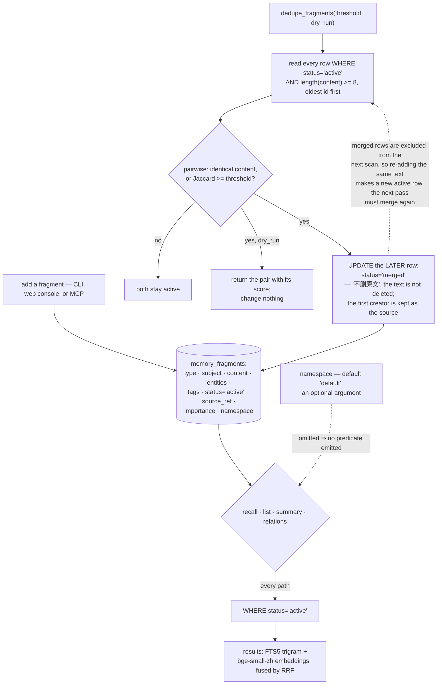

## 1. Executive Summary

Huiran-cerebro (赛博大脑, "cyber brain") is a personal and team memory hub and
knowledge-base engine — MIT, Python 3.10+, version 1.5.0, 4,582 lines across a
handful of modules, one SQLite file with no service dependency. Its stated goal
is to settle an AI's memory and knowledge into a local, searchable, conversable
private knowledge base, and it ships an MCP server with a written integration
guide for Doubao, a web console, and Windows batch launchers.

The engine is four layers in one file: a knowledge base of documents and chunks,
memory fragments, a typed entity graph, and an AI conversation log, retrieved by
FTS5 with trigram tokenisation — the right choice for Chinese, which has no
spaces to tokenise on — fused with `bge-small-zh-v1.5` embeddings by reciprocal
rank.

The mechanism worth the visit is the deduplication, and it makes two good
decisions in one docstring:

> "重复碎片合并：内容 Jaccard >= threshold 的碎片，标记后写者 status='merged'（不删原文）。
> 保留先创建者（信息源），后写者合并到它。"
>
> *Merge duplicate fragments: for fragments whose content Jaccard is at or above
> the threshold, mark the later writer `status='merged'` (do not delete the
> text). Keep the first creator as the information source; the later writer is
> merged into it.*

**It marks rather than deletes**, so the duplicate stays inspectable and the
merge is reversible — and because the recall, listing, summary and relation
paths each select `WHERE status='active'` (`:708`, `:779`, `:807`, `:838`,
`:1173`, and `list_fragments` through its default at `:640`), the marked row
leaves retrieval without leaving the store. That is the trust-state mark: a
stored discrete status, set by a real mechanism, read by the paths that matter.

There is one read where it is not applied, and it is the one a session opens
with. `daily_context` (`:1264-1339`) assembles the start-of-day block, and its
three fragment queries carry no status predicate: the iron rules selected by
`source_ref LIKE 'iron_rules%'` (`:1270`), the five most recent `decision`
fragments (`:1326`), and five `importance='high'` fragments (`:1334`). Each is
rendered straight into the block — `[铁律]`, `[提醒·最近决策]`, `[提醒·高价值知识]` —
so a fragment the dedup pass marked `merged` comes back in all three, which is
the one thing marking it was meant to prevent. The six filtered reads are the
searches; the three unfiltered ones are the summary a person reads first. That
asymmetry recurs across this corpus and is worth stating plainly: the search
path is the one with a predicate because it is the one anyone thinks of as
retrieval, and the context builder returns prose rather than rows, so nothing
about it looks like a query.

**And it keeps the earlier fragment**, on the stated ground that the first writer
is the information source. Last-write-wins is the default almost everywhere, and
it is the wrong default when the later copy is a restatement of the earlier one
rather than a correction of it.

A `dry_run` flag returns the candidate pairs with their similarity scores and
changes nothing, so the threshold can be tuned against real data before it is
applied to it. Small, and more than many larger systems here offer.

What to weigh against that. **There are no tests** — no test directory, no test
file, and the two `tools/_*_smoke.py` scripts are smoke checks rather than
assertions — under a pass that rewrites rows in place. The dedup is a full
pairwise scan of every active fragment with a Python Jaccard per pair, so its
cost grows with the square of the store. And because the scan reads only active
rows, a merged fragment is never compared against again: re-adding the same text
creates a fresh active row that the next pass must merge all over again. The mark
records a decision; nothing consults it when the next write arrives, so it is a
retirement rather than a refusal.

`namespace` exists on fragments and entities with a `default` value, and is
passed as an optional argument that emits no predicate when omitted — so it
separates nothing unless a caller asks it to.

Two details for a reader coming from elsewhere. The delete helper is Windows-only,
calling `SHFileOperationW` with `FOF_ALLOWUNDO` so a removed directory lands in
the recycle bin rather than vanishing — a thoughtful default that does not exist
on other platforms. And the README carries a section explicitly addressed to LLM
readers, alongside an `llms.txt`, which is worth knowing when an agent summarises
this project from its own documentation rather than from its code.

## 2. Mental Model

A **fragment** is a small remembered thing, and it is either active or it has
been merged into an earlier one.

**Merged** means retired from recall, not gone.

The **first writer wins**, because the first writer is the source.

## 3. Architecture

| File | Role |
| --- | --- |
| `cyber_brain.py` | The schema, the store, search, recall, dedup, summaries |
| `web_ui.py` | The browser console |
| `mcp_server.py` | The MCP surface |
| `session_log.py`, `summarize.py`, `daily_brief.py` | Session capture, rolling summaries, a daily brief |
| `doctor.py`, `tools/check_version.py` | Diagnostics, and a version badge kept in sync |

## 4. Essential Implementation Paths

`cyber_brain.py:832-859` — the dedup, its docstring, and its dry run.

`cyber_brain.py:189-206` — the fragment schema and the status index.

`cyber_brain.py:708`, `:779`, `:807`, `:1173` — the four places the predicate is
repeated.

## 5. Memory Data Model

Fragments carry a type, a subject, entities, tags, a status, a source reference,
an embedding state, an importance and a namespace. Content items carry more:
a status of draft or done, a version and a parent id forming a revision chain, a
source type, a source tag and an `authorization_ref` defaulting to `manual` —
provenance fields that are recorded and, as far as this reading found, not yet
consulted by a read.

Rolling summaries carry a scope key and a checkpoint version, which is how the
system keeps a compacted account of a long stretch without losing the fragments
underneath it.

## 6. Retrieval Mechanics

FTS5 trigram and embeddings fused by reciprocal rank, with the active-status
predicate repeated at each site rather than centralised — four copies of one
rule, which is the shape that drifts. A retrieval-audit table records what was
asked and in what mode.

## 7. Write Mechanics

Direct inserts; dedup is an explicit pass rather than a write-time check. That
ordering is the trade-off: writes stay cheap and unconditional, and duplicates
accumulate until someone runs the pass.

## 8. Agent Integration

An MCP server with a document walking through connecting Doubao, plus a web
console and CLI. `add_content` takes a status defaulting to `draft`, so an agent's
write lands as a draft unless it says otherwise — a small default in the right
direction.

## 9. Reliability, Safety, and Trust

The merge-not-delete rule is the substance. Beyond it: a `doctor` command, a
version constant with a script that syncs the README badge to it, and a
recycle-bin delete on Windows.

The absence to weigh is testing. A pass that rewrites status in place, over a
store whose whole value is that nothing was lost, is the code most in need of a
test that a merged fragment is absent from recall and its content still in the
table.

## 10. Tests, Evals, and Benchmarks

None found. Two smoke scripts under `tools/` exercise the frontend and the graph
without asserting outcomes. Nothing was installed or run for this reading.

## 11. For Your Own Build

Mark, do not delete, and say so in the docstring. A duplicate marked `merged`
with its text intact can be reviewed, reversed and counted; a deleted one cannot.

Decide which side of a duplicate survives, and write down why. "Keep the first
creator, it is the information source" is a rule a reader can argue with, which
is more than a silent last-write-wins offers.

Ship the dry run with the destructive pass, not after it. Returning the candidate
pairs and their scores is what makes a threshold tunable.

And put the status predicate in one place. Four copies of `status='active'` is
four chances for the next read path to forget it.

## 12. Open Questions

Whether `authorization_ref` and `source_tag` are consulted anywhere. Both are
written with defaults and no reader was found.

What `embedding_state` gates. It defaults to `disabled` on every fragment, and
how the embedding path treats that was not traced.

Whether a merged fragment can be restored. The row and its text survive; no
command to set the status back was found.

## Appendix: File Index

| Path | What to read it for |
| --- | --- |
| `cyber_brain.py:832-859` | Mark rather than delete, keep the first writer, and a dry run |
| `cyber_brain.py:189-206` | The fragment, and the index the predicate needs |
| `cyber_brain.py:78-101` | Provenance fields on a content item, awaiting a reader |
| `tools/recycle_delete.py` | A delete that lands in the recycle bin, on one platform |

## History

**2026-09-19** — [`08644a7edd1bff64ba46177d069287cb1daaad7a`](https://github.com/qilunuojiang9-hue/Huiran-cerebro/commit/08644a7edd1bff64ba46177d069287cb1daaad7a) — `trust_state` re-tested at an unchanged pin, and the record's universal claim did not survive it. Every anchor held: the column and its index, `dedupe_fragments` marking the later writer merged without deleting the text, and the filtered reads at `:708`, `:779`, `:807`, `:838` and `:1173`, with `list_fragments` defaulting to active at `:640`. Six reads filter. The seventh is `daily_context` (`:1264-1339`), which assembles the block a session opens with, and its three fragment queries carry no status predicate — iron rules by `source_ref` (`:1270`), the five most recent decisions (`:1326`) and five high-importance fragments (`:1334`), each rendered straight into the block. So a fragment marked merged is withheld from every search and returned in the summary a person reads first, which is the one thing marking it was meant to prevent. The mark stands on the six; the record now names the seventh beside it. This is the third system in one sweep where the missing predicate was in the session-start context builder rather than in a search path, which is worth saying out loud: the context builder returns prose rather than rows, so nothing about it looks like a query. Re-read from a fresh clone; nothing was installed and no suite was run.

**2026-09-16** — [`08644a7edd1bff64ba46177d069287cb1daaad7a`](https://github.com/qilunuojiang9-hue/Huiran-cerebro/commit/08644a7edd1bff64ba46177d069287cb1daaad7a) — first reading, at a commit dated 16 September 2026. Screened before opening, from a shallow clone: two files scanned, no auto-run surfaces, no build-time execution points, one unpinned surface and one dependency file inside the seven-day cooldown. Nothing was installed, built or run.
