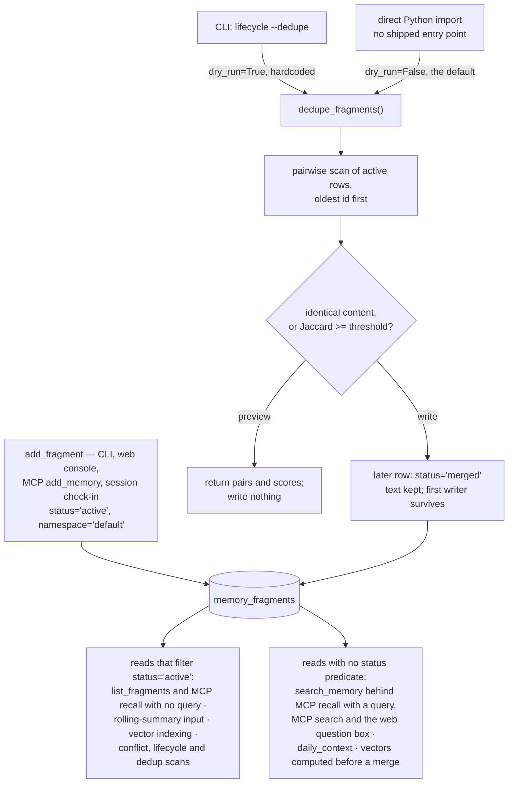

## 1. Executive Summary

Huiran-cerebro (赛博大脑, "cyber brain") is a personal memory hub and knowledge
base over one SQLite file, reached through a CLI, a web console, and an MCP
server with a written guide for Doubao. Its deduplication function makes two
good decisions and writes both into its docstring: mark the later duplicate
`merged` rather than delete it, and keep the earlier fragment as the source.
Neither takes effect as shipped. The one command that runs the pass hardcodes a
dry run, and the keyword search the MCP tools call does not read the status.

The engine is four layers in one file: a knowledge base of documents and chunks,
memory fragments, a typed entity graph, and an AI conversation log. Retrieval is
FTS5 with trigram tokenisation, the right choice for Chinese, which has no
spaces to tokenise on, fused with `bge-small-zh-v1.5` embeddings by reciprocal
rank.

The dedup docstring (`cyber_brain.py:832-835`):

> "重复碎片合并：内容 Jaccard >= threshold 的碎片，标记后写者 status='merged'（不删原文）。
> 保留先创建者（信息源），后写者合并到它。"
>
> *Merge duplicate fragments: for fragments whose content Jaccard is at or above
> the threshold, mark the later writer `status='merged'` (do not delete the
> text). Keep the first creator as the information source; the later writer is
> merged into it.*

**The function writes by default and nothing shipped lets it.** `dedupe_fragments`
takes `dry_run=False` (`:832`), and its only caller in the repository is the
`lifecycle --dedupe` command, which passes `dry_run=True` (`:1650-1656`). The
command then prints that re-running with `--dedupe` will mark the later writers
merged. Re-running with `--dedupe` runs the same preview. The README documents
a `--dry-run` option for the command, and the parser declares none
(`:1465-1469`). No MCP tool and no web route calls the function. So
`status='merged'` has one writer (`:854`), reachable only from a Python import
that no entry point makes. The hardcoded preview shipped with the feature, in
[`6d97f6e38d69f87b37af6dd596007a436aca57a0`](https://github.com/qilunuojiang9-hue/Huiran-cerebro/commit/6d97f6e38d69f87b37af6dd596007a436aca57a0)
on 14 September 2026.

**Were the mark written, the searches would not read it.** `search_memory`
(`:653-674`) gathers candidates from the FTS index and a LIKE scan, fetches each
by id, and applies no status predicate. It serves the MCP `recall` tool whenever
a query is given, the MCP `search` tool, and the web console's question box
(`web_ui.py:350`). `daily_context` (`:1264-1347`), the start-of-day block, reads
fragments three times without one: iron rules by `source_ref` (`:1270`), the
five most recent decisions (`:1326`) and five high-importance fragments
(`:1334`). Vector indexing skips non-active rows (`:1173`), so a fragment merged
before its first indexing gets no embedding. One indexed before the merge keeps
its vector until a reset, and the semantic fetch reads it back by id (`:1249`).

The status does filter where a listing is built. `list_fragments` defaults to
active (`:640`), which covers the MCP `recall` tool with an empty query and the
web console's fragment list, and the rolling-summary pass reads active events
only (`summarize.py:57-59`). The conflict scan, both lifecycle passes and the
dedup scan filter too (`:708`, `:779`, `:807`, `:838`). So `merged` would
withhold a fragment from the lists and the maintenance passes, and return it to
anyone who searches for it.

**The survivor rule is the part to take.** Keeping the earlier fragment, on the
stated ground that the first writer is the information source, is the right
default when the later copy is a restatement rather than a correction.
Last-write-wins is the wrong default for that case.

A `dry_run` flag returns the candidate pairs with their similarity scores and
changes nothing, so a threshold can be tuned against real data before it is
applied.

What to weigh against that. **There are no tests.** The three
`tools/_*_smoke.py` scripts drive a running web console through Playwright, and
none touches the store's operations. The dedup is a full pairwise scan of every
active fragment with a Python Jaccard per pair, so its cost grows with the square
of the store. Because the scan reads only active rows, a merged fragment is never
compared again, and re-adding the same text creates a fresh active row. Session
check-ins are the exception to write-time silence: they skip a same-day
near-duplicate before insert (`session_log.py:51-72`, `:90`).

`namespace` exists on fragments only, with a `default` value that no write path
overrides, so a namespace filter separates nothing (section 5).

Two details for a reader coming from other platforms. The delete helper is
Windows-only, calling `SHFileOperationW` with `FOF_ALLOWUNDO` so a removed
directory lands in the recycle bin. And the README carries a section addressed to
LLM readers, alongside an `llms.txt`, which matters when an agent summarises this
project from its own documentation rather than from its code.

## 2. Mental Model

A **fragment** is a small remembered thing with a type, an importance and a
status. Every write path inserts it `active`.

**Merged** would mean retired from the lists, not gone: the row and its text
stay. It is the only other status the code writes, and only a direct library
call writes it.

The **first writer wins**, because the first writer is the source.

What a status withholds depends on the read. Listings, the summary pass and the
indexer read `status='active'`; keyword search, the start-of-day block and a
vector computed earlier do not.

```mermaid
%% caption: the merge is written only by a direct library call; the shipped command previews, and the keyword search behind the MCP tools does not read the status
flowchart TB
    W["add_fragment — CLI, web console,<br/>MCP add_memory, session check-in<br/>status='active', namespace='default'"] --> ROW[("memory_fragments")]
    CLI["CLI: lifecycle --dedupe"] -->|"dry_run=True, hardcoded"| DED["dedupe_fragments()"]
    LIB["direct Python import<br/>no shipped entry point"] -->|"dry_run=False, the default"| DED
    DED --> SCAN["pairwise scan of active rows,<br/>oldest id first"]
    SCAN --> PAIR{"identical content,<br/>or Jaccard >= threshold?"}
    PAIR -->|"preview"| CAND["return pairs and scores;<br/>write nothing"]
    PAIR -->|"write"| MARK["later row: status='merged'<br/>text kept; first writer survives"]
    MARK --> ROW
    ROW --> FILT["reads that filter status='active':<br/>list_fragments and MCP recall with no query ·<br/>rolling-summary input · vector indexing ·<br/>conflict, lifecycle and dedup scans"]
    ROW --> NOF["reads with no status predicate:<br/>search_memory behind MCP recall with a query,<br/>MCP search and the web question box ·<br/>daily_context · vectors computed before a merge"]
```

## 3. Architecture

| File | Role |
| --- | --- |
| `cyber_brain.py` | The schema, the store, search, recall, dedup, summaries, and the CLI |
| `web_ui.py` | The Flask browser console |
| `mcp_server.py` | The MCP surface: seven tools, lower-frequency operations selected by a `mode` argument |
| `session_log.py`, `summarize.py`, `daily_brief.py` | Session check-ins, rolling summaries, a daily brief |
| `doctor.py`, `tools/check_version.py` | Diagnostics, and a version badge kept in sync |
| `tools/check_sanitize.py` | A pre-publication scan for private terms, over the tree or the whole git history |

Nothing runs in the background. Every pass — summaries, lifecycle, indexing —
is a command a person or a client invokes.

## 4. Essential Implementation Paths

`cyber_brain.py:832-859` — the dedup, its docstring, its dry run, and the one
status write at `:854`.

`cyber_brain.py:1465-1469`, `:1650-1656` — the `lifecycle --dedupe` command,
which always previews.

`cyber_brain.py:653-674` — `search_memory`, with no status predicate, and its
callers at `:912` (`recall`) and `:941` (`search`).

`cyber_brain.py:1163-1200` — `index_vectors`, filtering active rows at `:1173`.

`cyber_brain.py:1264-1347` — `daily_context`, the start-of-day block.

`mcp_server.py:72-104` — the `recall` and `search` tools, and which store call
each mode reaches.

## 5. Memory Data Model

Fragments carry a type, a subject, entities, tags, a status, a source reference,
an embedding state, an importance and a namespace (`cyber_brain.py:189-205`).
`embedding_state` defaults to `disabled`, and no line reads or writes it after
the schema. `importance` is set by type and keyword at insert and demoted by the
lifecycle pass; it ranks search results and picks the start-of-day block's
high-value list.

`namespace` is declared on `memory_fragments` alone (`:200`, migrated at `:310`).
The insert names no namespace (`:634`), so every fragment is `default`. The
entity, content-item and knowledge-base tables declare no namespace column, yet
`search` with a namespace sends `AND namespace=?` to each of them (`:379-388`,
`:934-946`). The scoped branch of the unified search names a column those tables
lack.

Content items carry a status of draft or done, a version and a parent id forming
a revision chain, a source type, a source tag and an `authorization_ref`
defaulting to `manual` (`:78-101`). The provenance fields are written, and no
query filters on them.

Entity links carry `valid_from` and `valid_until`, and `neighbors` drops a link
whose `valid_until` has passed (`:390-406`). An upsert overwrites the window, and
`link` deletes the edge outright when handed a past `valid_until` (`:345-363`).

Rolling summaries carry a scope key and a checkpoint version, which is how the
system keeps a compacted account of a long stretch without losing the fragments
underneath it.

## 6. Retrieval Mechanics

`search_memory` unions FTS5 trigram hits with LIKE hits over content and tags,
fetches each row by id, drops rows outside a namespace when one is given, and
sorts by a decay key: high importance never decays, the rest decay with the
square root of age (`:653-695`). `recall` prepends the latest rolling summaries
and appends semantic hits over fragments (`:904-931`). The unified `search`
queries entities, content, fragments, knowledge-base chunks and keyword packs,
then fuses FTS, LIKE and entity rankings with the semantic scores by reciprocal
rank (`:934-1009`).

The active-status predicate sits in the listing and maintenance reads, not in
the search function. A retrieval-audit table records each query, its mode, its
candidate counts and the ids returned.

## 7. Write Mechanics

Writes are direct inserts and return when committed. A fragment is searchable at
once through FTS triggers, and semantically after the next indexing run. The
dedup is an explicit pass, not a write-time check, with one exception:
`session_log.log` skips an event whose subject, or whose character-set Jaccard at
or above 0.85, matches one already written that day (`session_log.py:51-72`,
`:90`). Rolling-summary upgrades skip an exact type-and-content match
(`summarize.py:68-89`). Nothing rewrites the whole store in the background.

## 8. Agent Integration

An MCP server exposes seven tools. The Doubao guide folds twelve operations into
six, because Doubao loads a limited number of tools per connector, and the
seventh, `session_log_tool`, is for clients without that limit. Lower-frequency
operations are selected by a `mode` argument: `recall` in `daily` mode returns
the start-of-day block, and `stats` in `conflicts` mode returns the read-only
conflict scan. `add_content` takes a status defaulting to `draft`, so an agent's
write lands as a draft unless it says otherwise. No tool reaches the dedup or
the lifecycle passes.

## 9. Reliability, Safety, and Trust

The design worth keeping is merge-not-delete with the first writer kept and a
preview first. As shipped, the preview is all a user can reach, and the status it
would set is honoured by listings and ignored by search.

No capability mark is awarded. `trust_state` is withheld twice over: no shipped
entry point produces `merged`, and the reads an agent searches with do not
consult it. `scope_enforced` is withheld because nothing writes a namespace other
than `default`. `bitemporal` is withheld because the validity window on entity
links is overwritten in place and deleted on expiry, so the period a relation was
believed cannot be recovered. `audit_log` is withheld: the audit table records
retrievals, not mutations. No state waits on a reviewer, and there are no tests.

## 10. Tests, Evals, and Benchmarks

No test file exists in the tree. Three Playwright scripts under `tools/` open
the web console on a local port and check that a tab renders; `_today_smoke.py`
exits non-zero when the tab or a hardcoded date of 10 September 2026 is absent.
None exercises the store's operations. `tools/_dup_scan.py` reports exact and
near duplicates over every fragment regardless of status, and writes nothing.
`tools/check_sanitize.py` exits 1 on a private-term hit, a publication check
rather than a memory test. No paper is cited in the repository's text files.
Nothing was installed or run for this reading.

## 11. For Your Own Build

### Steal

Mark, do not delete, and say so in the docstring. A duplicate marked `merged`
with its text intact can be reviewed, reversed and counted; a deleted one cannot.

Decide which side of a duplicate survives, and write down why. "Keep the first
creator, it is the information source" is a rule a reader can argue with.

Ship the dry run with the destructive pass. Returning candidate pairs and their
scores is what makes a threshold tunable.

### Avoid

A preview hardcoded where the write was meant to go, beside a hint that promises
the write. Test the command, not only the function: one assertion that a second
run marks a row would have caught it.

A status filter placed in the listing reads and left out of the search function.
Put the predicate where every read passes through it, and include the context
builder, which returns prose rather than rows and so does not look like a query.

### Fit

For one person on one Windows machine who wants a Chinese-first local store with
an MCP surface, it is small enough to read in an afternoon and to fork. Anyone
who needs duplicates retired, scopes separated, or a correction to stick should
treat it as a sketch of the right decisions and wire them before relying on any.

## 12. Open Questions

Whether the hardcoded preview is deliberate. The CLI help, the README and the
command's own hint all describe a merge, which reads as unfinished wiring rather
than caution.

Whether a merged fragment could be restored. The row and its text survive, and
no code sets the status back.

## Appendix: File Index

| Path | What to read it for |
| --- | --- |
| `cyber_brain.py:832-859` | Mark rather than delete, keep the first writer, and a dry run |
| `cyber_brain.py:1650-1656` | The only caller, always previewing |
| `cyber_brain.py:653-674` | Keyword search with no status predicate |
| `cyber_brain.py:1264-1347` | The start-of-day block, reading fragments three times unfiltered |
| `cyber_brain.py:189-205` | The fragment, and the index the predicate needs |
| `cyber_brain.py:78-101` | Provenance fields on a content item, with no reader |
| `session_log.py:51-72` | The one write-time duplicate check |
| `tools/recycle_delete.py` | A delete that lands in the recycle bin, on one platform |

## Appendix: Recorded Searches

Run from the clone root at the pinned revision; the result column is what each
returned.

| Claim | Check | Result at this pin |
| --- | --- | --- |
| No test file exists anywhere in the tree | `git ls-tree -r --name-only HEAD \| grep -E '(^\|/)tests?/\|__tests__/\|(^\|/)test_\|_test\.\|\.test\.'` | Nothing, at 25 blobs |
| `status='merged'` has one writer | `git grep -nE 'UPDATE memory_fragments' HEAD` | Three hits; `:813` and `:825` set importance, `:854` sets `merged` |
| The dedup's only caller passes `dry_run=True` | `git grep -nE 'dedupe_fragments\(' HEAD` | The definition at `:832` and the CLI call at `:1651` |
| The `lifecycle` parser declares no dry-run flag | `git grep -nE 'add_argument\("--(dry\|dedupe\|threshold)' HEAD` | `--dedupe` and `--threshold` at `:1468-1469`; the only `--dry-run` is `summarize.py:114` |
| `search_memory` applies no status predicate | `git show HEAD:cyber_brain.py \| sed -n '653,674p' \| grep -cE 'status'` | 0 |
| `namespace` is declared on fragments only | `git grep -nE 'namespace TEXT' HEAD` | `:200` and `:310`, both `memory_fragments` |
| No insert sets a namespace | `git grep -nE 'INSERT INTO memory_fragments' HEAD` | `:634`, whose column list has no `namespace` |
| `embedding_state` has no reader or writer | `git grep -nE 'embedding_state' HEAD` | The schema line `:198` only |
| No query filters on the provenance fields | `git grep -nE 'WHERE[^"]*(authorization_ref\|source_tag)' HEAD` | Nothing |
| No paper is cited | `git grep -niE 'arxiv\|bibtex\|@article\|@misc\|citation\|\bdoi\b' HEAD -- '*.md' '*.txt' '*.cff'` | Nothing |

## History

**2026-09-28** — [`2f48deb24304b80c5434802a06ebfeb06d6f6c4e`](https://github.com/qilunuojiang9-hue/Huiran-cerebro/commit/2f48deb24304b80c5434802a06ebfeb06d6f6c4e) — The upstream re-created its history. Every commit keeps its subject, author name and date and has a new tree, none matching the pin's, each differing in a few lines of `COLLAB.md` and `requirements.txt` that named a third-party service and an internal project. The old pin is held in the [archive](https://github.com/agent-memory-atlas-archive/qilunuojiang9-hue--Huiran-cerebro/commit/08644a7edd1bff64ba46177d069287cb1daaad7a); `cyber_brain.py` is byte-identical at both pins, and three new commits add a sanitisation scan. `trust_state` is withdrawn, and was wrong at the old pin: the dedup's only caller hardcodes a dry run, and `search_memory` never filters on status ([section 1](#1-executive-summary)). The smoke scripts were miscounted (three, not two) and `namespace` was placed on entities. Screened from a full clone: one unpinned surface, nothing inside the cooldown. Nothing installed, built or run.

**2026-09-19** — [`08644a7edd1bff64ba46177d069287cb1daaad7a`](https://github.com/qilunuojiang9-hue/Huiran-cerebro/commit/08644a7edd1bff64ba46177d069287cb1daaad7a) — `trust_state` re-tested at an unchanged pin, and the record's universal claim did not survive it. Every anchor held: the column and its index, `dedupe_fragments` marking the later writer merged without deleting the text, and the filtered reads at `:708`, `:779`, `:807`, `:838` and `:1173`, with `list_fragments` defaulting to active at `:640`. Six reads filter. The seventh is `daily_context` (`:1264-1339`), which assembles the block a session opens with, and its three fragment queries carry no status predicate — iron rules by `source_ref` (`:1270`), the five most recent decisions (`:1326`) and five high-importance fragments (`:1334`), each rendered straight into the block. So a fragment marked merged is withheld from every search and returned in the summary a person reads first, which is the one thing marking it was meant to prevent. The mark stands on the six; the record now names the seventh beside it. This is the third system in one sweep where the missing predicate was in the session-start context builder rather than in a search path, which is worth saying out loud: the context builder returns prose rather than rows, so nothing about it looks like a query. Re-read from a fresh clone; nothing was installed and no suite was run.

**2026-09-16** — [`08644a7edd1bff64ba46177d069287cb1daaad7a`](https://github.com/qilunuojiang9-hue/Huiran-cerebro/commit/08644a7edd1bff64ba46177d069287cb1daaad7a) — first reading, at a commit dated 16 September 2026. Screened before opening, from a shallow clone: two files scanned, no auto-run surfaces, no build-time execution points, one unpinned surface and one dependency file inside the seven-day cooldown. Nothing was installed, built or run.
