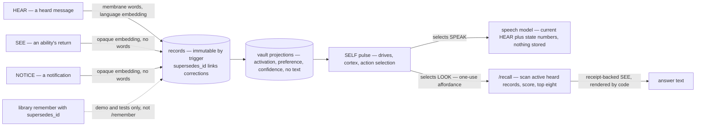

## 1. Executive Summary

HUMANs — *Habitus Unified Memory And Nervous System*, the package is
`habitus_ai` — is a persistent local agent whose memory, drives and action
selection live in one continuing process rather than in a prompt rebuilt each
turn. Apache-2.0; three commits on 7 September 2026 by one author, version
0.1.0; 19,689 lines of Python under `src/`, 6,553 lines of tests in 33 files
holding 151 cases, 11,151 lines of experiments and 3,704 lines of documents
including a whitepaper and an architecture contract. The same account's
[AIMAOS](../aimaos/) is in this atlas; this tree shares no code with it. The
screen found no auto-run surface, one unpinned manifest with no lockfile,
three build-time execution paths, one file inside the seven-day cooldown and
an `AGENTS.md` treated as data; nothing was installed or run, and the read was
made from a full clone. The README's *"No External Memory. No RAG. No Context
Window"* is a claim about the shipped conversation surface, and the tree also
ships the RAG path as *"a control."*

Two decisions make it memory in this atlas's sense. **Canonical records are
immutable in the database.** `MindStore` (`store.py:39`) creates a `records`
table and two triggers — `BEFORE UPDATE` and `BEFORE DELETE` raise
*"canonical records are immutable"* (`:125-133`) — and the architecture
contract states the rule: *"A correction creates a new record that supersedes
the old record; it does not overwrite history."* The active-record queries
exclude any row a newer record's `supersedes_id` names (`:411-421`,
`:850-865`), so a superseded fact leaves retrieval and stays in the table.
**Retrieval is an action the mind must select.** The speech motor — a local
Ollama model behind a `ChatModel` protocol — receives a system message
carrying the current drive, urgency and stability numbers and one user
message, the current `HEAR` event; *"No earlier messages or retrieved records
are available"* is in the system text (`integrated_agent.py:282-321`), and a
test asserts the first event's text is absent from the second call
(`tests/test_integrated_agent.py:69-108`). Stored text reaches an answer only
when `/recall` is selected as an exact one-use `LOOK` affordance
(`:724-738`); `_recall_memory` (`:582-628`) then scans active records that
carry `membrane_words`, scores token overlap at 0.58, cosine at 0.24, phrase
match at 0.18 with a 0.12 boost for an explicit user memory, drops candidates
under a floor, returns eight, and labels the result
`automatic_prompt_injection: False`. The rendered text is returned through a
`SEE` cycle with a receipt and is never placed in the model's prompt.

The third decision is a boundary. Six lanes — `HEAR`, `SEE`, `NOTICE` in,
`SPEAK`, `LOOK`, `DO` out — share one graph, and *"only an inbound `HEAR`
event may create word-derived membrane evidence"*: a tool return or a
notification is embedded as an opaque payload under its lane's namespace
(`pipeline.py:349-356`), so filenames, receipts and error text cannot become
vocabulary or answer a language query. `tests/test_membrane_modality.py:73-125`
is the negative case: a heard record, a seen record and a noticed record on
one concept, the last two carrying passwords; the vault holds the heard one
alone, a query for the passwords finds neither of the others in the direct
ids, the vault ids or the rendered context, and a query for the heard phrase
finds it.

Two marks — `audit_log` for the record store and `negative_eval` for that
test. `trust_state` is withheld: a `verified` flag on receipts changes the
prefix the renderer gives a record and filters nothing. `tombstone` is
withheld because supersession is a pointer to a record, not a record of a
value refused. And the finding against the design is a producer: the
library's `remember` takes a `supersedes_id`, the demo and the tests pass one,
and the command line's `/remember` never does (`functional_agent.py:318-344`),
so the shipped mind adds facts, deduplicates them by exact text, and cannot
correct one.

## 2. Mental Model

A belief here is a record that arrived on a lane. It enters as a heard
message, a spoken reply, an ability's return, a notification, or a fact the
person asked the mind to remember, and it enters once, with its lane, its
source, its time, its embedding and its provenance, into a table nothing can
change. Beside it, language-free projections land in the vaults of the graph
nodes it touched — activation, preference, confidence, pulse — and those are
what the mind's drives and action selection run on. The words are in the
record; the graph holds where the record went.

A belief is *used* in two different senses. It shapes the next pulse through
the graph whether or not anyone reads it. It reaches an answer only if the
mind selects `LOOK`, runs `/recall`, and returns the text through a receipt —
and even then the text is rendered by code, not handed to the speech model,
which sees the current utterance and a line of state numbers. A heard record
is eligible for that recall; a seen or noticed one is not, whatever words it
carries.

A belief stops being used in one way only: a newer record names it in
`supersedes_id`, and the active-record queries stop returning it while the row
stays. On the library that is one argument to `remember`; on the shipped
command line no path passes it, and `/remember` refuses an exact duplicate and
accepts everything else beside what it contradicts. Nothing decays, nothing is
deleted, and a wrong fact told once is a fact until a caller of the library
supersedes it.



## 3. Architecture

A single Python package with an optional PyTorch extra for the cortex.
`store.py` is the SQLite layer; `pipeline.py` is `BaseAgenticMemoryRAG`, the
library with `remember`, `recall`, the output cycle and outcome recording;
`graph.py` is the conserved dual graph with its invariants; `self_pulse.py`,
`recurrent.py` and `developmental_cortex.py` are the pulse, the desire field
and the 18-million-parameter random-born cortex the README leads with;
`lanes.py` is the six-lane scheduler; `integrated_agent.py` is the shipped
mind — abilities, affordances, receipts, the speech renderer;
`functional_agent.py` is the earlier command surface the README calls a
control; `tools.py` holds the workspace read and the bounded run;
`embeddings.py` holds the `Embedder` protocol and a deterministic hash
embedder the architecture contract calls *"an offline test adapter"*.
`experiments/graph_native_live/` is 11,151 lines of nurseries, a LoCoMo replay
and two C++ helpers for the open-weight experiments.

Running it means Python 3.11, Ollama with a small model for speech, and
PyTorch for the cortex; the Makefile's `playground` target runs the whole loop
offline with a tiny cortex and a fake motor, and `doctor` checks the live
prerequisites without creating state. The database defaults to
`state/habitus.sqlite` under the Make targets and `habitus-mind.sqlite` from
the CLI; `:memory:` is an explicit opt-in. The store binds an embedding
`space_id` and dimension on creation and refuses to open under a different one
(`store.py:316-338`).

### Deployment and ergonomics

One process, one file, one model daemon. The cost is the cortex — a
random-born network updated per pulse — and the discipline: a mind that
cannot see its own history in a prompt has to be asked to look, and the
person types `/recall`. Everything the mind did is inspectable through
`/state` and `--json`: pulse ids, selected outputs, evidence ids, receipts,
hashes and the graph's invariant errors.

## 4. Essential Implementation Paths

- **Record.** `remember` (`pipeline.py:278-297`) resolves the kind, the record
  type and the input trunk; a lexical `HEAR` input is embedded by the
  embedder, anything else by `opaque_payload_embedding` under a
  `trunk:type` namespace (`:349-356`); the `MemoryRecord` is built with its
  `supersedes_id` (`:361-372`) and inserted; concept assignments and vault
  membership follow, with non-language records kept out of crown and lexical
  vaults.
- **Immutability and supersession.** The triggers at `store.py:125-133`;
  `list_active_records` (`:411-421`) and `records_for_vault` (`:850-865`)
  exclude a row named by a newer record's `supersedes_id`.
- **Library recall.** `recall` (`pipeline.py:638-698`) routes the query as an
  event, calls the retriever for a packet — `direct_top_k = 3` with a
  similarity floor of 0.08 (`:82-83`), graph-selected vaults, dense and BM25
  inside them — advances a working memory that retains prior injections,
  appends core records, and renders under `context_budget_chars` with the
  direct and core records protected from truncation (`:684-686`).
  `_render_record` (`context.py:8-28`) prefixes each line by type and by the
  `verified` flag.
- **Shipped recall.** `_recall_memory` (`integrated_agent.py:582-628`) as
  described in section 1; the `/recall` records themselves are excluded from
  the scan.
- **Speak.** `messages_for` (`:282-321`) builds the two-message prompt;
  `render` (`:320-325`) calls the motor; `_actualize_speech` (`:753`) records
  the reply with `transcript_records_used: 0`, `recalled_records_used: 0`
  and the SELF and cortex state hashes.
- **Authorize.** `_affordance` (`:724-738`) finds the ability among the
  pulse's selected outputs or raises *"SELF did not authorize the sensed
  ability"*; `record_outcome` (`pipeline.py:821-835`) refuses a verified
  external outcome without a receipt id.
- **Remember and recall on the command line.** `_remember_fact`
  (`functional_agent.py:318-344`) scans active fact records for an exact
  case-folded match and adds one otherwise with a SHA-256 of the text;
  `_recall_response` (`:346-377`) returns every explicit fact plus the
  library's hits, last twelve.

## 5. Memory Data Model

`records` (`store.py:112-123`): `record_id`, a unique `event_id`,
`record_type` — inbound message, outbound message, fact, receipt, tool result,
observation, thought, notification — `source_id`, `timestamp`, `text`,
`embedding_json`, `provenance_json`, `metadata_json`, `supersedes_id`. The
metadata carries the causal trunk, the membrane lane, whether the record has
membrane words, and for a fact its SHA-256 and the `explicit_user_memory`
flag. `experience_projections` has no natural-language column by contract:
experience id, record id, node, layer, side, activation, preference,
confidence, pulse. `experience_state` keeps a confidence-weighted mean per
experience id that later observations update, so *"later verified outcomes can
change how the same turn is remembered without rewriting its immutable
language."* Traces, outcomes, experience cycles and their returns are the
per-pulse history; concepts, edges and node dynamics are the graph, updated in
place.

## 6. Retrieval Mechanics

There are two retrievers and the shipped mind uses the simpler one. The
library's `recall` is a two-lane design the architecture contract draws: a
*"global direct dense top 3"* it calls a *factual safety rail*, and semantic
endpoints that lead through weighted graph paths to selected vaults where
dense and BM25 retrieval run; the lanes *"meet only by canonical record ID"*
and *"graph candidates cannot evict the direct safety rail"*, which
`tests/test_retrieval_pipeline.py:35-59` asserts against eight distractors.
A working memory carries prior injections into the next pulse
(`:80`), and the renderer keeps direct and core records whole under the
character budget.

The shipped `/recall` is a scan: every active record with membrane words,
scored by token overlap against a stop-word-stripped query, cosine over the
hash embedder's vectors, an exact phrase match and the explicit-memory boost,
with a floor that drops a record with no overlap, no phrase and similarity
under 0.42. It returns eight, newest last among equals, and the result goes
back as a `SEE` return that code renders into the reply. What the model says
next is still a function of the current utterance alone.

## 7. Write Mechanics

A write is synchronous on the event-loop thread: the record is inserted, its
projections deposited, the graph advanced, the pulse saved, before the lane
yields. The six lanes queue concurrently but *"the short graph and SQLite
mutations remain serialized on the event-loop thread"* (`EXPERIMENT.md`). No
background pass consolidates, decays or rewrites anything; growth — the
promotion of overlap clusters into child concepts — is an explicit,
evidence-gated API, and a promoted child *"retains every canonical experience
that justified it"* (invariant 14).

Correction is the gap. The library's `remember(..., supersedes_id=)` is the
one path that retires a record, and the shipped surfaces never call it with
a value: `_remember_fact` deduplicates by exact text and otherwise appends,
`handle` in the integrated mind records what it hears and says, and no
command, ability or affordance produces a supersession. `demo.py:40` and
`tests/test_store_and_topology.py:60` are the callers. On the shipped mind a
fact that turns out wrong is a fact forever, and the only lever is another
fact that outscores it.

### Operational cost

A pulse per event through the graph and the cortex, one model call per
`SPEAK`, no model call for `/remember`, `/recall`, `/open`, `/run` or
`/state`; a `/recall` costs a scan of every active language record in
Python.

## 8. Agent Integration

The agent is the mind. A person types; a `HEAR` event becomes a record; the
pulse selects among `SPEAK`, `LOOK` and `DO`; a `SPEAK` renders through the
motor; a `LOOK` or `DO` needs an exact affordance from that pulse, runs once,
and returns through `SEE` or `NOTICE` with a receipt — `/open` returns a
file's content and its SHA-256 inside the authorized workspace, `/run`
executes one Python file under time, memory, descriptor and output limits
(`tools.py`). No MCP, no HTTP; another program uses the library or the
`--once … --json` one-shot. The human's surface is the command line and the
SQLite file; there is no page and no review queue.

## 9. Reliability, Safety, and Trust

**Audit log — awarded.** Immutability is a database trigger, not a
convention; every event is a record with source, time and provenance; a
correction is a new row that points at the old one; every ability run leaves
a receipt with a hash and every pulse a trace and an outcome; a verified
outcome cannot be recorded without a receipt id. The limit is beside it: the
graph — concepts, edges, node dynamics, experience preference — is updated in
place, and the per-pulse trace is the only history of those changes.

**Negative evaluation — awarded.** `test_non_hear_words_never_enter_crown_vault_or_language_recall`
seeds three records, asserts two are absent from every retrieval surface, and
asserts the third is present in the same test. `test_current_event_renderer_has_no_transcript_or_recalled_text`
asserts a private token from the first event is absent from the second
model call, with the call count and the second message's content as the
control. `test_graph_candidates_cannot_evict_three_direct_records` asserts the
rail holds against distractors.

**Trust state — withheld.** `verified` on a receipt, tool result or
observation and the `THOUGHT` type are rendered as different prefixes — *I
directly verified*, *I observed*, *I once considered, without treating it as
verified* — and nothing excludes the unverified ones; supersession is a
lifecycle pointer, not a verdict.

**Tombstone — withheld.** A superseded record is retired by id; nothing is
keyed on the value, and `/remember` will accept the retired text again as a
new fact if it is not an exact duplicate of an active one.

**Bitemporal — withheld.** One timestamp, the time of the event.

**Scope — withheld.** One database is one lineage and one owner; `source_id`
is stored on every record and applied on no read path; the lane filter keeps
seen and noticed text out of language recall, which is a boundary between
senses, not between users.

**Human review — withheld.** `/remember` is explicit and `/state` is
inspectable; nothing lets a person approve, reject or edit a record.

**What the design refuses, in its own words.** The architecture contract's
closing rule: *"Future layers must not hide direct evidence, mutate canonical
history, bypass one-use authorization and receipt verification, or turn graph
familiarity into a fact."* The honest-boundaries list says the cortex *"does
not yet generate generally coherent open-ended speech by itself"*, `/run`
*"is not a hostile-code sandbox"*, and the persistent pressure and valence
variables *"are engineering variables, not evidence of consciousness."*

## 10. Tests, Evals, and Benchmarks

151 cases in 33 files, run in CI on CPU with nothing downloaded. They cover
the store's triggers and supersession, the retrieval rail, the lane boundary,
the one-use affordance (`tests/test_self_pulse_kernel.py:252`, an idle poll
cannot repeat an output without a new pulse at `:399`), receipts surviving a
restart, the embedding-space binding, the renderer's prompt, the concurrent
lanes, and the developmental cortex and curriculum. Several are written as
mutation targets and say so.

The whitepaper's evaluation is a curriculum: 36 topics, 432 episodes, 494
records, 276 nodes, invariant errors zero before and after a restart, topic
coverage 35 of 36, label-absent paraphrases 16 of 18, graph-to-vocabulary
recovery 16 of 18 at top one, a four-condition transformer matrix. Its
section 9.3 is *"an evidence manifest, not a promise that the files are
present in every clone"*: five SHA-256 hashes of run files and native
binaries that Git ignores, and none of them is in the tree. Its section 10
tables what is and is not demonstrated, and two rows matter for a memory
reader: *"Arbitrary episodic facts cross the continuous seam — Not
demonstrated"* and *"The adapter replaces text RAG — Not demonstrated"*, each
with the suite that would advance it named. A LoCoMo replay exists as a
script — turns arrive through `HEAR`, session boundaries through `NOTICE`,
captions through `SEE`, questions answered from the live graph with retrieval
measured *"only afterward as a separate diagnostic"* — with five tests on
its scoring and receipts and no result committed. No paper; `CITATION.cff`
cites the software.

## 11. For Your Own Build

### Steal

- **Immutability as a trigger.** Two `BEFORE` triggers on the records table
  make *append-only* a property of the file, not of the code that happens to
  write it.
- **Retrieval as a selected action with a receipt.** A model that is never
  handed stored text cannot leak it, misattribute it or be prompted into it;
  the person sees exactly when the mind looked and what came back.
- **Lane-scoped language memory, tested negatively.** Keeping tool output and
  notifications out of the vocabulary and out of language recall is the
  rare boundary that a test asserts with a positive control beside it.
- **A whitepaper with a not-demonstrated table.** Naming the suite that would
  advance each claim is worth more than the claims.

### Avoid

- **A supersession the product cannot write.** The one correction mechanism
  in the store is reachable from the library and the tests and from no
  command a user types.
- **Recall as a scan with a hand-tuned score.** Four coefficients and a floor
  over every active record is fine at a few hundred and is not an index.
- **A lineage with no scope key.** One database per user is a deployment
  rule; nothing in the store distinguishes sources at read time.
- **Evidence hashes for files the repository ignores.** A manifest a reader
  cannot check is a promise; committing one run would make it a fact.

### Fit

For a researcher who wants a memory that cannot be silently rewritten, a
model that cannot be silently fed, and a boundary between what was heard and
what was returned by a tool, this is a serious first release with the
discipline in the database and the tests, and the graph and cortex above it
are the research the whitepaper is about. It is not a memory service: one
person, one file, no correction from the command line, no forgetting, no
review, and a recall that the person has to ask for by name. Read the store,
the lane test and the renderer's prompt; treat the drives and the cortex as
what the whitepaper calls them, engineering variables under study.

## 12. Open Questions

- Will `/remember` ever take a correction? The library's argument exists and
  the test for it passes; a `/remember … supersedes …` or a contradiction
  check against active facts is the missing producer.
- When the same fact is told twice in different words, both are active facts
  and `/recall` returns both; is the intended answer the newer or the
  higher-scored?
- What does a LoCoMo replay score? The script, its tests and its scoring rule
  are committed; a run is not.
- Does the `verified` flag ever gate anything beyond the renderer's prefix and
  the outcome's receipt requirement?

## Appendix: File Index

| Path | Lines | What it holds |
| --- | --- | --- |
| `src/habitus_ai/store.py` | 1,334 | `MindStore`, sixteen tables, the two immutability triggers (`:125-133`), active-record queries (`:411`, `:850`), projections, dynamics, traces, outcomes |
| `src/habitus_ai/pipeline.py` | 872 | `BaseAgenticMemoryRAG`: `remember` (`:278`), output cycles, `recall` (`:638`), `record_outcome` (`:821`) |
| `src/habitus_ai/context.py` | — | `_render_record` (`:8`) and `render_context` (`:30`) |
| `src/habitus_ai/integrated_agent.py` | 1,124 | `IntegratedMind`: `messages_for` (`:282`), `_recall_memory` (`:582`), `_affordance` (`:724`), `_actualize_speech` (`:753`), `handle` (`:891`), `state` (`:963`) |
| `src/habitus_ai/functional_agent.py` | 604 | `_remember_fact` (`:318`), `_recall_response` (`:346`) |
| `src/habitus_ai/graph.py`, `self_pulse.py`, `recurrent.py`, `lanes.py` | 1,952, 1,745, —, — | The conserved dual graph and invariants, the SELF pulse, the desire field, the six-lane scheduler |
| `src/habitus_ai/developmental_cortex.py`, `developmental_runtime.py`, `developmental_curriculum.py`, `open_weight.py` | 2,070, 1,446, 1,380, 2,149 | The cortex, the born-in runtime, the curriculum, the open-weight interface |
| `src/habitus_ai/tools.py`, `embeddings.py`, `types.py`, `models.py` | 597, —, —, — | Workspace read and bounded run with receipts, the `Embedder` protocol and hash embedder, the record types, the `ChatModel` protocol |
| `ARCHITECTURE.md`, `WHITEPAPER.md`, `EXPERIMENT.md`, `docs/` | 3,704 in all | The contract with its fifteen invariants, the paper with its not-demonstrated table, the six-lane experiment |
| `tests/` | 6,553 in 33 files | 151 cases |
| `experiments/graph_native_live/` | 11,151 | Nurseries, the LoCoMo replay, native helpers |

Searches behind the absence claims above, run from the repository root:

```sh
rg -n 'supersedes_id\s*=' src/habitus_ai/*.py | rg -v 'store.py|types.py|pipeline.py'   # demo.py:40 only — no command passes one
rg -n 'DELETE FROM' src/habitus_ai/store.py                           # none
rg -n -i 'forget|expire|decay|ttl' src/habitus_ai/store.py src/habitus_ai/pipeline.py   # none on a record
rg -n 'source_id ==|source_id =' src/habitus_ai/pipeline.py src/habitus_ai/integrated_agent.py   # writes only; no read path filters on it
find . -path ./.git -prune -o \( -name '*.json' -o -name '*.jsonl' -o -name '*.sqlite' \) -print   # none: no committed run
rg -n -i 'arxiv|doi' README.md WHITEPAPER.md CITATION.cff             # none: no paper beyond the tree's own
```

## History

**2026-09-08** — [`a1c86c292ac0c8d7f11800d0c2b1462756f9dbe9`](https://github.com/munch2u-a11y/HUMANs/commit/a1c86c292ac0c8d7f11800d0c2b1462756f9dbe9) — first reading, at the head of `main`, the third of three commits made on 7 September 2026. Screened first: no auto-run surface, one manifest with no lockfile, three build-time execution paths, one file inside the seven-day cooldown, `AGENTS.md` treated as data; nothing installed or run, the read made from a full clone. Two marks. The supersession producer was traced from the store's link to every caller of `remember` before the update column was written.
