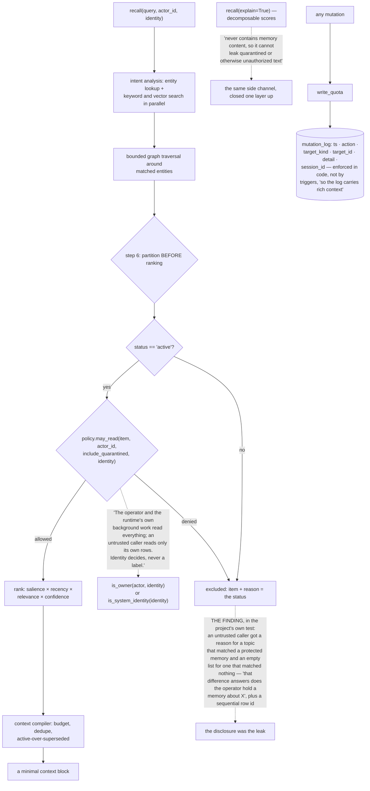

## 1. Executive Summary

Hungry Hippa is "[o]ne memory. Any AI. Your machine." — MIT, Python, 15,028
lines, a local SQLite store with an MCP surface so several AI clients read and
write the same memory, and an explicit promise that the database is not uploaded
anywhere. The schema calls itself a "Living Cortex": episodes, evidence, a graph,
beliefs, procedures, vectors, consolidation, forgetting and retrieval, under
reversible migrations that each carry an `up` and a `down`.

For a project this size, the file list under `tests/` is the surprise:
`test_existence_oracle.py`, `test_confused_deputy.py`, `test_injection_framing.py`,
`test_trust_boundary.py`, `test_trust_token.py`, `test_quarantine_cli.py`,
`test_supersession.py`, `test_provenance.py`, `test_file_permissions.py`,
`test_resource_limits.py`. Attack classes named as filenames.

**And one of them records a finding the project made against itself, which is the
most useful thing in this report.** Recall returns, alongside its results, a list
of what it excluded and why — an item key and a reason such as `other-actor`.
That is exactly the disclosure this atlas praised in
[mnemonic](../mnemonic/) a few reports ago: a retrieval that tells you what it
held back. Here is what it also is, in the project's own words:

> "Finding: recall as an untrusted caller returned
> `excluded=[{"item": "belief:B-0002", "reason": "other-actor"}]` for a topic that
> matched a protected memory, and `[]` for a topic that matched nothing. That
> difference answers 'does the operator hold a memory about X', and the row id
> leaks sequential identifiers. Graph entity names were returned unfiltered too."

The same feature is a courtesy to an authorised caller and an existence oracle to
an unauthorised one. The difference is who is asking — which means the disclosure
has to be conditioned on the answer to that question, and a system that returns
one list to everybody has decided the question does not matter. Three separate
leaks in one sentence: the presence, the sequential id, and the unfiltered entity
names.

**The read policy that followed states its rule rather than implying one.**

> "The operator and the runtime's own background work read everything; an
> untrusted caller reads only its own rows. Identity decides, never a label."

`may_read(item, actor_id, *, include_quarantined, identity)` returns
`(allowed, reason)` for every row, ownership is `is_owner(actor, identity) or
is_system_identity(identity)`, and the `actor_id` a caller passes cannot by
itself grant anything. That last clause is the producer test this atlas looks for
and rarely finds: several systems read this week accept an actor string and
record it as though it were an identity.

**The status partition runs before ranking.** `episodes.status` is
`active | archived | compressed | purged`, and step six of the pipeline —
described in the module docstring as the "actor/status policy partition
(quarantine + sensitivity)" — sends anything not `active` to the excluded list
with its status as the reason, before the ranker sees it. Quarantined rows return
only when a caller passes `include_quarantined`. Relationship reads carry the
same predicate, and the context compiler prefers active over superseded on top.
Partitioning before ranking is the placement [theurian](../theurian/) argues for:
a withheld row that reaches the ranker moves every number computed from the
ranking.

**And the explanation is built not to be a side channel.** Scores are
decomposable — `recall(..., explain=True)` returns the parts behind each item's
score — and the docstring states the constraint: the explanation "never contains
memory content, so it cannot leak quarantined or otherwise unauthorized text". A
system that has just been bitten by an oracle in its exclusion list has gone and
checked its explain path for the same shape.

What to weigh. The mutation log is enforced in code rather than by database
triggers — the schema says so and gives the reason, richer context — so a new
write path can omit it and the database will not notice; thirty-two call sites
cover what exists today. Evidence kinds distinguish `user_explicit` from
`agent_inference` and `derived_pattern`, but nothing found withholds on that
distinction, so provenance labels rather than gates. `importance` and
`confidence` both default to 0.5, so an unset value looks like a considered
middle. And the tests are `run_all()`-style modules returning result lists rather
than pytest functions, so a plain `pytest` run exercises less than the filenames
promise.

## 2. Mental Model

A **status** decides before a score does.

An **identity** decides who may read; a **label** decides nothing.

An **exclusion list** is a kindness to the authorised and an oracle to everyone
else.

An **explanation** must not carry what the policy withheld.

## 3. Architecture

| File | Role |
| --- | --- |
| `schema.py` | The Living Cortex schema and reversible migrations |
| `retrieval.py` | The pipeline, the partition, the explanation constraint |
| `policy.py` | `may_read`, and identity over label |
| `db.py` | `log_mutation`, and the write path |
| `forgetting.py`, `semantic.py`, `procedural.py`, `graph.py` | Sweeps, beliefs, procedures, relationships |
| `tests/` | Attack classes as filenames |

## 4. Essential Implementation Paths

`tests/test_existence_oracle.py:1-10` — read this first; it is the report.

`src/hungry_hippa/policy.py:126-138` — the rule, stated.

`src/hungry_hippa/retrieval.py:1-16`, `:323-338` — partition before ranking, and
an explanation that carries no content.

## 5. Memory Data Model

Episodes with outcome, importance, confidence, project, status and a
reinforcement count; evidence with a kind spanning `user_explicit`, `document`,
`tool_result`, `visual_observation`, `audio_observation`, `external_source`,
`agent_inference` and `derived_pattern`; beliefs, procedures, relationships and
vectors. Raw evidence rows are immutable, which is what makes supersession
meaningful rather than cosmetic.

## 6. Retrieval Mechanics

Covered above. The one addition: the ranking is "transparent and heuristic … so a
learned policy can replace it later through the same interface" — a stated
intention to keep the seam, which is how a heuristic stays replaceable instead of
becoming load-bearing by accident.

## 7. Write Mechanics

A quota table gates writes, and a quota breach is itself logged
(`write_quota_exceeded`) rather than silently dropped. Every mutation writes a
log row with an action, a target and a session.

## 8. Agent Integration

An MCP server over one local store, so several clients share a memory. That
sharing is what makes the identity check load-bearing: the design's whole premise
is several callers against one database.

## 9. Reliability, Safety, and Trust

The security work is the substance, and its best property is that the project
found its own leak in a feature it had built for good reasons and wrote the
finding down where the next reader will meet it.

## 10. Tests, Evals, and Benchmarks

Seventeen test modules and a 901-line evaluation harness. The modules use a
`run_all()` convention returning result records rather than pytest functions, so
the harness rather than `pytest` is the entry point. Nothing was installed or run
for this reading.

## 11. For Your Own Build

Condition your exclusion disclosure on who is asking. Telling a caller what you
withheld is right for an authorised one and an existence oracle for everyone
else, and one list for both decides that the distinction does not matter.

Let identity decide, never a label. An `actor_id` a caller supplies is a claim;
treating it as an identity is how the confused-deputy tests in this repository
got their names.

Partition before you rank. A withheld row that reaches the ranker changes every
number computed from the ranking, even when its content never appears.

Check your explain path for the leak you just fixed. A score decomposition that
quotes content re-opens the channel the policy closed.

And write the finding into the test. The docstring here explains what went wrong,
with the actual payload, where whoever touches that code next will read it.

## 12. Open Questions

Whether evidence kind ever gates. It distinguishes what a person said from what a
model inferred and no read path was found that acts on it.

How much of the suite a plain `pytest` run covers. The modules expose `run_all()`
rather than test functions.

Whether the entity names are filtered now. The finding names them as leaking; the
fix path was not traced.

## Appendix: File Index

| Path | What to read it for |
| --- | --- |
| `tests/test_existence_oracle.py:1-10` | A disclosure that was a leak, with the payload |
| `src/hungry_hippa/policy.py:126-138` | Identity decides, never a label |
| `src/hungry_hippa/retrieval.py:1-16` | A pipeline, and an explanation that carries no content |
| `src/hungry_hippa/schema.py:1-32` | Reversible migrations, immutable evidence, a mutation log |

## History

**2026-09-19** — [`3cddd2adcd85362fba6627dedb87ac431aa7e518`](https://github.com/TRUE-BLUE-INDUSTRIES/hungry-hippa/commit/3cddd2adcd85362fba6627dedb87ac431aa7e518) — `trust_state` re-tested against the narrowed line, which this system answers more directly than anything else read in this sweep. Every anchor held at the same line numbers. Step six of the recall pipeline is a partition, not a predicate scattered through a query: `retrieval.py:323-338` sorts each collected item into `excluded` with its status as the reason or into `allowed`, and `:340` then calls `self._rank(allowed, terms)` — the state decides membership, the score decides order, and the two are consecutive lines. The comment above the stage says so in its own words. Two additions to the record. `may_read` (`policy.py:126-140`) resolves the caller through `is_owner` or `is_system_identity` under a comment stating the rule — identity decides, never a label — so the read policy keys on a resolved principal rather than a supplied string. And the two reads of `episodes` that carry no status clause are the correct ones: the forgetting sweep has to see every status, and the FTS backfill (`db.py:194-207`) indexes every row because the partition runs on whatever the index returns, so a non-active episode can be an index hit and is excluded with a reason rather than silently absent. Both are worth naming, because this sweep has found the same omission elsewhere where it was a defect. Screened again first; nothing was installed and no suite was run.

**2026-09-16** — [`3cddd2adcd85362fba6627dedb87ac431aa7e518`](https://github.com/TRUE-BLUE-INDUSTRIES/hungry-hippa/commit/3cddd2adcd85362fba6627dedb87ac431aa7e518) — first reading, at a commit dated 15 September 2026. Screened before opening, from a shallow clone: two files scanned, no auto-run surfaces, no build-time execution points, one unpinned surface and one dependency file inside the seven-day cooldown. Nothing was installed, built or run.
