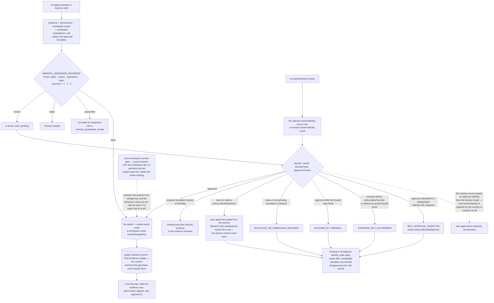

## 1. Executive Summary

HUQAN is a decision gate rather than a memory: "An agent proposes something.
HUQAN decides whether it lands." AGPL-3.0, JavaScript, 287,058 lines across
1,563 files, Node 22.13 or newer, three binaries — a CLI, an MCP server, and a
pre-execution guard for external agents. "No model, no cloud, no API key."

It is in this atlas because one of the things it gates is a memory write, and
because the outcomes it can return for a write are not the ones it returns for a
tool call:

> "A memory write adds `quarantine` and `reject`, because a write can be set
> aside for inspection rather than refused outright."

The README reads its own quickstart transcript back to make the point: "the
write **did not happen**. It was held. It happened at line 3, after something
approved it, and line 4 is the durable record of why. That gap is the entire
product."

**The mechanism to take away is one sentence, and it closes a hole this atlas
finds repeatedly.** Across the corpus, systems that claim human review usually
record an `actor` or an `approved_by` string that the calling code fills in — so
what is stored is who the request *said* approved it. HUQAN refuses that
construction:

> "The runtime never accepts an approver identity from the decision body. The
> receiver/operator supplies an authenticated context and the injected identity
> resolver turns that context into a receiver-owned identity result. Missing or
> ambiguous identity, stale state, scope drift, unavailable durability, and
> firewall disagreement all fail closed."

`decide()` takes an `approverContext`. `resolveIdentity` is a required injected
function and the runtime will not construct without it. Separation of duties is
then checked on the resolved identity rather than on a label: the approver is
compared to the requester on both `identityRef` and `identityHash` and rejected
with `SELF_APPROVAL_REJECTED` unless the policy explicitly allows it, and above
the policy's critical risk score the runtime pulls prior decisions out of the
mutation journal and keys them into a set, so the same person cannot count twice
toward a two-approver requirement.

**The refusals compose the way they should.** An `override` is authorised only
when the policy allows it *and* the firewall actually returned block. An
`approve` against a firewall block fails outright. A decision on a case whose
status is no longer `pending`, `escalated` or `blocked` is refused as duplicate
or ambiguous.

**And the module declines to become a platform.** "This module is deliberately
bounded. It does not implement a workflow suite, IAM provider, connector
authorization system, or a second storage authority. Review cases and immutable
transition snapshots are committed through the existing Graph mutation journal
and Trust Evidence Ledger."

## 2. Mental Model

A **proposal** is not a write; the write is what happens after someone decides.

An **approver** is a resolved identity, never a name in the request.

A **quarantine** is a hold with a receipt, not a refusal.

An **escalation** is a person declining to decide, and it stops everything.

A **receipt** is the durable answer to why.

## 3. Architecture

| Area | Role |
| --- | --- |
| `lib/human-oversight-approval-runtime.js` | Review cases, resolved identities, and every refusal |
| `lib/memory-admission-gate.js` | The frozen decision vocabulary and its receipt kinds |
| `lib/cross-workspace-access-gate.js` | A pure isolation decision over two workspaces |
| `lib/graph-mutation-receipt-*.js` | The journal's schema, writer, reader and rollback |
| `lib/cli-trust-receipt.js` | The receipt a person reads |
| `THREAT_MODEL.md` | What the gate is defending against, stated separately |

## 4. Essential Implementation Paths

`lib/human-oversight-approval-runtime.js:10-15` — the sentence that decides
whether a review claim means anything.

`:78` — the runtime refusing to exist without an identity resolver.

`:348-354` — self-approval checked on resolved identity, not on a name.

`:368-389` — distinct prior approvers, gathered from the journal and scoped to
one workspace.

`lib/memory-admission-gate.js:5-21` — four outcomes, frozen, with an ordering.

`lib/cross-workspace-access-gate.js:3-14` — the tenant question the storage key
does not answer.

## 5. Memory Data Model

What HUQAN durably holds is a decision record: review cases, immutable
transition snapshots, mutation receipts and Trust Receipts, alongside the graph
nodes that were allowed to land, keyed under their workspace. The memory entry
itself is ordinary; what is unusual is that it does not exist until something
decided it should.

## 6. Retrieval Mechanics

Retrieval here serves adjudication rather than recall: evidence gathering,
verification, contradiction detection and risk scoring feed the policy
boundary. A reader looking for ranking, fusion or consolidation will not find
them, and that is the design rather than an omission.

## 7. Write Mechanics

A proposal carries evidence, provenance and a workspace. The gate returns one of
four outcomes for a write. `review` opens a case that only an authenticated
decision closes, and the transition is committed through the journal that
already exists rather than into a store of the runtime's own.

## 8. Agent Integration

`huqan` for people, `huqan-mcp` for agents over stdio, and `huqan-gate` as a
pre-execution guard for agents that are not otherwise wired in. The quickstart
runs against a throwaway store in a temporary directory and "does not touch your
own memory and does not relax a gate."

## 9. Reliability, Safety, and Trust

Fail-closed is the stated default across identity, staleness, scope, durability
and firewall disagreement, and the escape hatches are policy flags rather than
code paths — which is both the strength and the limit, since a policy that sets
`allowSelfApproval` gets exactly what it asked for.

## 10. Tests, Evals, and Benchmarks

Tests sit beside their modules throughout the tree, including for the approval
runtime, the admission gate and the cross-workspace gate — the last of which is
written as a pure function specifically so its decision can be tested without a
store.

## 11. For Your Own Build

Never take the approver from the thing asking for approval. If your schema has
an `approved_by` field the caller fills in, what you have recorded is a claim
about a person, not a person.

Require the identity resolver at construction. A runtime that can be built
without one will eventually be built without one.

Check separation of duties on the resolved identity, and key your approver set
on it, so a second approval from the same principal does not satisfy a
two-approver rule.

Make "held" a distinct outcome from "refused". A write set aside for inspection
and a write rejected are different facts about the same content, and only one of
them is recoverable.

## 12. Open Questions

Whether the oversight guarantees mean much in a single-user install. Escalation
is absent there by the project's own account, and the distinct-approver rule
degenerates, so what a solo operator gets is receipts and refusals rather than
separation of duties — which is honest, and worth knowing before the gate is
credited with more than it provides.

Whether the graph behind the gate is meant to grow into a memory in its own
right. The admission machinery is far more developed than the store it admits
into, and a reader evaluating HUQAN as agent memory rather than as a gate should
size that gap first.

## Appendix: File Index

| Path | What to read it for |
| --- | --- |
| `lib/human-oversight-approval-runtime.js:10-15` | The rule that makes an approval mean something |
| `lib/human-oversight-approval-runtime.js:348-354` | Self-approval refused on resolved identity |
| `lib/human-oversight-approval-runtime.js:368-389` | One person cannot be two approvers |
| `lib/memory-admission-gate.js:5-21` | Held and refused as different outcomes |
| `lib/cross-workspace-access-gate.js:3-14` | The isolation question a storage key does not answer |

## History

**2026-09-16** — [`6f11b01476f019149cf5d56e961b5cb0b5d7a92e`](https://github.com/ali-ulu/huqan/commit/6f11b01476f019149cf5d56e961b5cb0b5d7a92e) — first reading, at a commit dated 16 September 2026. Screened before opening, from a shallow clone: no auto-run surfaces, one build-time execution point, one unpinned dependency surface and six dependency files inside the seven-day cooldown. `AGENTS.md` is addressed to a reading agent and was recorded as data. Nothing was installed, built or run, and the quickstart was not executed, so the gate described here is read from source rather than observed.
