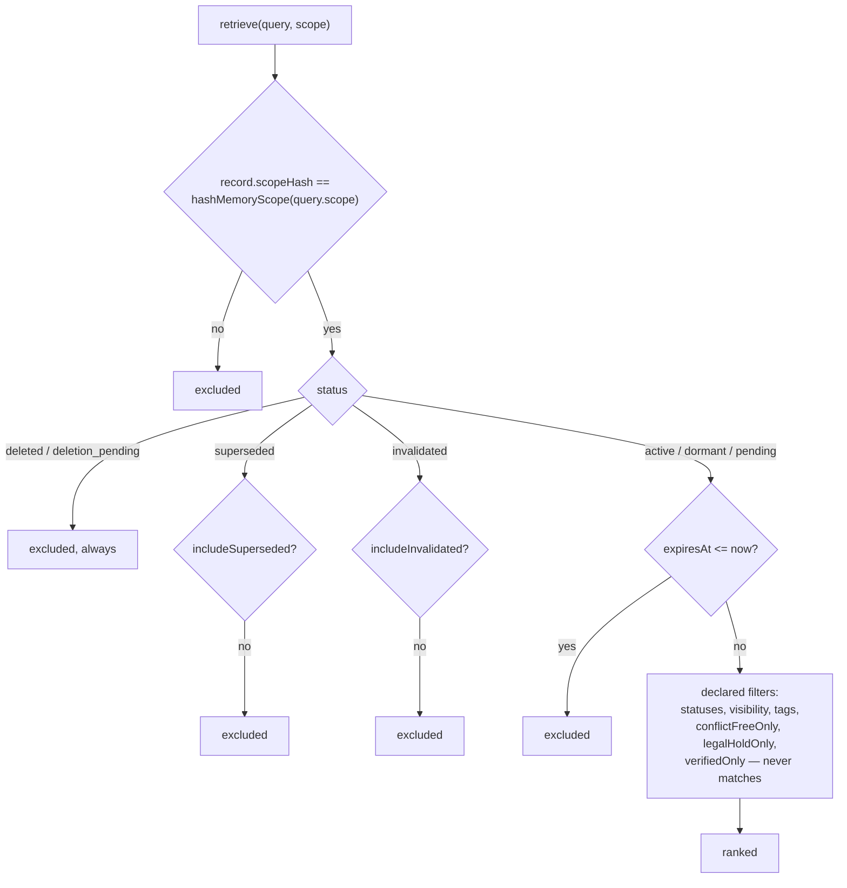

## 1. Executive Summary

Hypha is an Apache-2.0 TypeScript agent framework — 148,121 non-test lines across
seventeen workspace packages, 1,537 commits — and `packages/memory` is a
40,651-line memory subsystem in its own right, 152 files covering a managed
record store, a retrieval pipeline, a context builder, provider adapters for
several external memory services, a lifecycle task queue and a dead-letter
manager.

The record contract is one of the richest in this corpus. A managed memory
carries an eight-value `status`, a five-value `visibility`, a structured `scope`
with a `scopeHash` beside it, a `contentHash`, four separate unit-interval
scores — `confidence`, `importance`, `strength`, `salience` — plus `decayScore`,
`accessCount`, typed relations, an index status of its own, `expiresAt`,
`deletedAt`, and the flags `immutable`, `sensitive` and `humanVerified`.

Three marks are earned and the schema's ambition is the reason to check each one
rather than read the field list. `trust_state` and `scope_enforced` are real: the
retrieval gate compares `record.scopeHash` against a hash of the requesting
query's scope *before any other test*, then drops `deleted` and
`deletion_pending` unconditionally and `superseded` and `invalidated` unless the
caller asked for them. `negative_eval` is earned by a case that proves the store
populated and then invalidates one of two records and asserts the retrieve
returns only the other.

**And one field in that list is read four times and written nowhere.**
`humanVerified` appears exactly six times in the entire repository: once in the
schema, once as a `verifiedOnly` retrieval filter, once as the same filter in the
managed store, once as a ranking feature scored `record.humanVerified ? 1 : 0`,
once in a conflict check — and never on the left-hand side of an assignment, in
source or in tests. The filter can only ever return nothing; the ranking feature
is always zero. `human_review` is withheld on that, and it is the most
informative thing in the package: the design understood that a verified memory
should outrank an unverified one, and the verifying was never built.

## 2. Mental Model

Memory here is a *managed record* with a governed lifecycle, and the framework's
posture is that every read is a filtered projection of a store the caller does
not address directly. A retrieve carries a scope; the gate hashes that scope and
admits only records whose stored `scopeHash` equals it. There is no path that
returns a record by id without that comparison.

The status ladder is a retention lifecycle more than an epistemic one —
`pending → active → dormant`, with `superseded`, `invalidated`,
`deletion_pending`, `deleted` and `failed` as the ways out — and the epistemic
weight sits in the four scores beside it rather than in the status. That is worth
naming because it is the opposite arrangement from most of this corpus: here the
*status* is mostly about the record's place in a lifecycle and the *scores* carry
belief, and only `invalidated` reads as "we no longer think this is true".



## 3. Architecture

Seventeen packages. `memory` holds the record contract, the native in-process
provider, the retrieval pipeline, the context builder and gateway, a working
store, structured stores for vectors, idempotency, extraction state, external
mappings and lifecycle tasks, plus client adapters for several third-party memory
services. `core`, `kernel`, `fsm`, `domain`, `skills`, `tools`, `inference`,
`storage`, `serving-cache` and `workcache` sit around it, with `mcp` as the agent
surface.

`memory-events.ts` defines a `memory.*` / `context.*` event family carrying an
operation id, a profile id and revision, a provider id, a scope hash, a memory
id, an item count, a latency and a normalised error, published through the
framework's event bus. It is observability rather than a ledger — the events are
emitted, not persisted to the memory store — which is why `audit_log` is withheld
below.

## 4. Essential Implementation Paths

- **Write.** `native-memory.ts` builds a record with `contentHash:
  hashMemoryContent(candidate.content)` and `scopeHash: hashMemoryScope(request.scope)`,
  sets `status: 'active'` and `indexStatus: { state: 'pending', attempts: 0 }`,
  and when a previous version exists links it with a
  `{ type: 'supersedes', targetMemoryId: previous.versionId }` relation
  (`packages/memory/src/native-memory.ts:555-572`).
- **Read gate.** `retrieval.ts:462-526` — scope hash equality first, then status,
  then expiry, then the declared filter set.
- **Rank.** `recordComponentScores` combines an exponential recency term with a
  configurable half-life, `importance`, `confidence`, an authority score derived
  from the source type, `verified`, and `reinforcement` from `strength`
  (`retrieval.ts:528-545`).
- **Index.** A pending index state, an outbox and a worker that leases and
  completes, with a dead-letter manager for exhausted lifecycle tasks.

## 5. Memory Data Model

`managedMemoryRecordSchema` (`packages/memory/src/record-contract.ts:170-205`) is
the contract, validated with Zod. The fields that matter for the marks are
`status` (`:52-61`), `visibility` (`:177`), `scope` and `scopeHash` (`:176`,
`:199`), `contentHash` (`:198`), and the three booleans `immutable`,
`humanVerified` and `sensitive` (`:189-191`).

`indexStatus` is a second small state machine on the same record — `none`,
`pending`, `indexing`, `indexed`, `partial`, `failed`, `deleted` — which keeps
"has this been indexed" separate from "is this believed", a distinction several
systems in this corpus collapse into one column.

## 6. Retrieval Mechanics

Hard filtering, then score fusion, then a stable tie-break, then an explanation
that can be replayed: `provider.retrieval.explain(snapshot.id)` returns the same
object the retrieve produced, and a committed case asserts the equality. A
retrieval that can be re-explained from its own snapshot id is rare here and
worth the note.

The filter set is broad — `statuses`, `visibility`, `tagsAny`, `tagsAll`,
`excludeTags`, `verifiedOnly`, `conflictFreeOnly`, `canonicalKeys`,
`relationTypes`, `legalHoldOnly`. `conflictFreeOnly` excludes any record carrying
a `contradicts` relation, which is a genuinely useful predicate. `verifiedOnly`
is the one that cannot match.

## 7. Write Mechanics

A correction writes a new version and relates it to the previous one with
`supersedes`, leaving the predecessor in the store with its status moved. The
supersession pointer is keyed on `previous.versionId` — a record id — which is
what withholds the `tombstone` mark: `contentHash` is computed and stored on
every record, so the material for a value-keyed refusal exists, and no write path
consults it against the hashes of deleted or invalidated records.

## 8. Agent Integration

An MCP package, a harness, a skills package and a domain-pack model, with the
README describing the product as an "Agent Core + Production Harness for
governed, durable, and reusable domain agents". Sixteen workspace manifests carry
floating version ranges, which the screen flagged and this reading did not act on
— nothing was installed.

## 9. Reliability, Safety, and Trust

**Scope enforced — awarded.** `retrieval.ts:462-463` computes
`hashMemoryScope(request.query.scope)` and excludes any record whose stored
`scopeHash` differs, and it is the first test in the gate, before status, expiry
or any declared filter. The hash is a SHA-256 over the structured scope object,
so a scope that differs in any field is a different bucket.
`hindsight-local-client.test.ts:419-459` pins the boundary at the provider
adapter: a mapping stored under one scope, fetched under a scope differing only
in `sessionId`, is rejected with `MEMORY_SCOPE_DENIED` rather than returned. The
honest limit is that the scope arrives in the request — the gate enforces
consistency between the request's scope and the record's, and nothing in the
memory package establishes that the caller is entitled to the scope it names.

**Trust state — awarded.** Eight stored values, of which four withhold a record
from a default retrieve: `deleted` and `deletion_pending` unconditionally, and
`superseded` and `invalidated` unless the request opts in. That is a state
deciding admission rather than a score deciding order, and the four
unit-interval scores sit beside it doing the ordering, which keeps the two jobs
apart.

**Negative eval — awarded.** `foundation.test.ts:179-243` adds two records, runs
a retrieve and asserts the result ids equal *both* of them — the populated
control — then sets the second record's status to `invalidated` through
`recordStore.updateStatus` and asserts the same retrieve now returns exactly the
first record's id. The exclusion is proven against a result that was populated
moments earlier in the same test, and an empty store fails the first assertion.

**Human review — withheld, and this is the finding.** `humanVerified` is declared
on the record, filtered on by `verifiedOnly` in both the retrieval gate
(`retrieval.ts:501`) and the managed store (`managed-store.ts:366`), scored as a
ranking feature (`retrieval.ts:541`), and consulted in a same-key conflict check
(`native-maintenance.ts:85`). It appears six times in the repository and not once
on the left of an assignment — no MCP tool, no provider, no maintenance pass, no
test fixture sets it. So `verifiedOnly` is a filter that returns the empty set by
construction, and `verified` contributes a constant zero to every score.

This is the shape the atlas's producer test exists for, and the distinction worth
keeping is that the *consumers* are real and correct. Someone thought about what
a human-verified memory should mean for retrieval and for ranking, wrote both,
and never built the verifying. A reader adopting this schema should treat the
flag as a hole to fill rather than a feature to inherit.

**Tombstone — withheld, with the material present.** Every record stores a
`contentHash`, and supersession is keyed on the predecessor's version id. Nothing
consults the hash of a removed or invalidated record before a new write, so the
same content can be re-added under a fresh id. The hash exists; the lookup does
not.

**Audit log — withheld.** `memory-events.ts` is an emission layer over the
framework event bus — typed payloads with an operation id, scope hash, latency
and error — published rather than persisted. It is the right design for
observability and is not a durable record of what changed in the store.

**Bitemporal — withheld.** `createdAt`, `updatedAt` and `expiresAt` are all
record-axis timestamps, and `expiresAt <= now` is an expiry test rather than an
as-of read. There is no validity interval and no instant parameter on the
retrieve.

## 10. Tests, Evals, and Benchmarks

270 cases in `packages/memory/src/*.test.ts` across 74 test files in that package
alone. The suite is unusually concerned with failure paths — dead-letter
management, provider reconciliation, bounded recovery, context artifact
integrity, API-version drift, and a case that refuses a non-loopback cleartext
endpoint at construction. `foundation.test.ts` covers hard filtering, score
fusion, stable tie-break and the replayable explanation in one case.

**No paper describes this system, and no benchmark result is committed.** A
search for `arxiv`, `bibtex`, `@article`, `@misc`, `citation` and `doi.org`
across the markdown and manifests returns nothing, and `find . -iname
'CITATION*'` returns nothing. The README's claims are architectural rather than
measured.

## 11. For Your Own Build

- **Hash the scope and compare hashes, first.** One equality against a SHA-256 of
  the structured scope, evaluated before status, expiry or any user filter, is
  cheaper to reason about than a predicate assembled per query — and there is no
  read path that skips it.
- **Keep the index state off the trust state.** `indexStatus` is its own seven-value
  machine, so "not yet searchable" never has to borrow a value from "not
  believed".
- **Make a retrieval explainable by id.** `explain(snapshot.id)` returning the
  same object the retrieve produced, with a committed equality assertion, turns a
  ranking into something a user can be shown after the fact.
- **Grep your own schema for fields nothing writes.** The cheapest version of this
  report's main finding is one command per boolean flag: search for the field name
  and look for an assignment. Four consumers and no producer is a filter that
  silently returns nothing.

## 12. Open Questions

- Was `humanVerified` ever wired, in a branch or an earlier release? The
  consumers read as deliberate rather than speculative, which suggests a producer
  was planned; nothing in the tree at this commit indicates where it would go.
- The scope gate enforces consistency, not entitlement. Whether a caller may
  request a given scope is decided outside `packages/memory`, and a reader
  deploying this should find out where.
- `contentHash` is computed and stored on every record and, as far as this
  reading found, is not read on any write path. It is one lookup away from being
  the tombstone the schema otherwise lacks.

## Appendix: File Index

- Record contract: `packages/memory/src/record-contract.ts` — `memoryStatusSchema`
  (52-61), `managedMemoryRecordSchema` (170-205), `humanVerified` (190),
  `contentHash`/`scopeHash` (198-199).
- Retrieval: `packages/memory/src/retrieval.ts` — the gate (462-526), the
  `verifiedOnly` filter (501), `recordComponentScores` (528-545).
- Managed store: `packages/memory/src/managed-store.ts:366` — the second
  `verifiedOnly` filter.
- Maintenance: `packages/memory/src/native-maintenance.ts:85` — the same-key
  conflict check reading `humanVerified`.
- Write path: `packages/memory/src/native-memory.ts:555-572`.
- Hashing: `packages/memory/src/memory-utils.ts:17-23`.
- Events: `packages/memory/src/memory-events.ts`.
- Tests: `packages/memory/src/foundation.test.ts:179-243` (the populated control
  and the invalidation exclusion), `hindsight-local-client.test.ts:419-459`
  (cross-scope rejection).

**Searches recorded for the negative claims**

```sh
grep -rn 'humanVerified' --include='*.ts' . | grep -v node_modules            # 6 hits: 1 schema, 4 consumers, 0 assignments
grep -rn 'humanVerified' --include='*.ts' --include='*.js' . | grep -E 'humanVerified\s*[:=]\s*(true|false|[a-z])'   # 1 hit, the Zod declaration itself
grep -rn 'contentHash' --include='*.ts' packages/memory/src/operations.ts packages/memory/src/native-memory.ts   # computed and stored, never compared
grep -riE 'arxiv|bibtex|@article|@misc|citation|doi\.org' --include='*.md' --include='*.json' . | grep -v node_modules   # 0
find . -iname 'CITATION*' -not -path './.git/*' -not -path '*/node_modules/*'  # 0
```

## History

**2026-09-19** — [`ac77fa9b4a1b1da2815adf7d5582dbc27cd9373f`](https://github.com/CodeSoul-co/Hypha/commit/ac77fa9b4a1b1da2815adf7d5582dbc27cd9373f) — `trust_state` re-tested at an unchanged pin and every anchor held: the eight-value enum at `packages/memory/src/record-contract.ts:52-61`, the gate at `packages/memory/src/retrieval.ts:462-478`. One detail is added, and it is the kind this sweep has come to value. The gate opens with `const passed = ['scope', 'permission', 'not_deleted']` and every refusal returns `{ allowed: false, passed }`, so a rejected record carries which checks it had already cleared before it failed — a refusal that can be explained rather than an empty result, which is what hungry-hippa's exclusion reasons and temvera's belief ids also get right. Worth restating together, because these are the four separations the corpus most often collapses and this system holds all of them: state against score, with four unit intervals feeding ranking while the status decides admission; not-believed against not-searchable, `indexStatus` being its own seven-value machine; unconditional against opt-in, `deleted` and `deletion_pending` always dropped while `superseded` and `invalidated` need a request flag; and status against time, with expiry and the validity window tested after the status in the same gate rather than folded into it. Re-read from a fresh clone; nothing was installed and no suite was run.

**2026-09-17** — [`ac77fa9b4a1b1da2815adf7d5582dbc27cd9373f`](https://github.com/CodeSoul-co/Hypha/commit/ac77fa9b4a1b1da2815adf7d5582dbc27cd9373f) — first reading, at the head of `main`, 1,537 commits in. Screened with `scripts/screen_repo.py` first: no auto-run surface, one build-time execution path, sixteen manifests carrying floating version ranges, and nothing inside the seven-day cooldown. Nothing was installed, built or run — no npm, no vitest, no jest. Three marks. `human_review` is withheld on a producer test rather than on an absence: `humanVerified` has four consumers including a retrieval filter and a ranking feature, and no writer anywhere in the tree. `tombstone` is withheld with its material present — `contentHash` is stored on every record and consulted by no write path. `audit_log` is withheld because the memory events are published to an event bus rather than persisted, and `bitemporal` because every timestamp on the record is a record-axis one.
